# 1、16男士衣品速成穿搭指南(完结）：第11课：玩转场合着装，要帅要得体要有逼格！！：第11课：玩转场合着装，要帅要得体要有逼格！！

hello，各位同学，大家中午好，欢迎大家来到陈列共和直播间。😊，我是主持人vivin。大家都在吃饭了吧，正好是饭点的时候。好，课程开始之前的话，我们回顾一下上一期课程的一些重要内容。我把它发上来。

大家可以温故而知新。那么在这一堂堂课当中呢，我们讲的四个体型。那每个体型我们都有讲到他穿衣的禁忌以及适合穿的一些呃衣服的这种款式以及单品。那我非常建议大家学完这堂课之后，呃，去整理对照这些禁忌。

首先判断自己的体型是属于哪种体型，然后对照的这个体型，他所既会穿的颜色也好，或者是款型也好，或者是面料也好，去整理咱们的衣橱，把不适合的这些品类，以及你们的衣服给它拎出来去剔除掉。好了，呃。

不知不觉已经来到我们这个系列课程的最后一节课了。呃，场合着装我个人认为场合着装是非常非常呃重要的一个职业的素养。在陈列共和，我们有每个人有配备战袍的这样一个习惯。因为我们认为就是你无论做哪一行。

你的形象就应该要看起来像这个行业的专家。因为人是可以貌相的，一般来说嗯。人的貌相可以大部分的看出他是怎样一个人，大家认同吗？🎼更多最新课程尽在阿木课程QQ598556873。

微信号PUA88S更多最新课程尽在阿木课程QQ598556873，微信号PUA更多最新课程尽在阿木课程QQ598556873，微信号PUA88S同行合作联系QQ。😊，好，我记得老师讲过一个案例。

就是一个面试者，他其实去面试这家公司的时候，是非常想要进这家公司。但是为什么当。这家公司想要录用他的时候，他最后选择放弃了呢。原因是面试官穿当天面试他的时候穿了一双袜子，而且是露在外面的。他。

就因为这个面试官的形象，他不愿进到这家公司。就像那本百你的形象价值百万的那本书有讲到。一个公司的。老总和员工，他的外表就是公司最好的这样一个说明书。所以如果一个公司从老板到员工都具有杰出的形象。

客户一定会情愿为这些优秀的形象付出更高的价格。

所以产合着装的重要性就在这。好了，既然这么重要，那我们就。掌声邀请钟老师来分享今天的课程。

啊，大家中午好。我是成业顾和的钟小莹，今天来到了我们男装。搭配穿衣指南的最后一堂课了啊，时间过得很快。十19。今天在最后一堂课跟大家来讲一讲到底什么是场合着装。呃，刚刚看到讨论区。

大家说年前终于赶上了一次直播了。那正好跟大家拜个早年。那虽然我明天还是有女女鞋呃，我虽然我明天还是有鞋子成列的课程，但是对于我们这堂课的同学来说，那可能我们就在这里给大家拜一个早年。

祝大家2018年健康快乐幸福。刚刚发上来的4张图是我们的陈列诗，昨天晚上连夜为我们公司布置布置的一个新的景点啊，就是我们那个到时候过年的时候，大家围着拍照的地方，我们来了一棵大桃树啊。

在桃树上面粘贴了很多福字的这个利士风啊，也意寓意着来年福到啊，我认为幸最重要的幸福就是身体健康，所以也希望大家在2018年拥有一个健康的身体，这是最重要的。因为所有的一切的来源都来自于身体的健康。

我想问一下丁雪呃，听直播的感觉跟普通跟听回播的感觉是不是完全不同啊？那其实刚刚开始vi远也跟大家有讲到一部分，就是场合着装其实是非常非常关键的一个公司的形象。呃，人员的形象从老板到员工到工作人员。

哪怕是给我扫，就是打扫卫生的安y，他们的着装其实对一个公司都非常非常的重要。一个公司的视觉形象不仅仅只是产品形象，不仅仅只是店铺的形象。有很多时候员工的穿着，对外的工作人员的对外的形象啊谈图各方面。

我觉得都属于品牌形象之一。所以就是不得不去关注，不得不去思考的。所以希望大家从这堂课开始越来越关注自己的形象。同时用自己的形象一点一滴的去影响身边的人。那么什么叫做场合着装呢？

场合着装又有另外一个名字叫做TPO场合着装。其实TPO是西方人最早提出来的服饰穿穿戴原则。啊，他的他的意思是时间地点、场合，还有目的，就是告诉大家，在着装的时候，要考虑时间地点目的这三个要素。

所以所谓的场合着装就是依据不同的场合，着装规则进行的服装搭配，打造个人的完美形象。如果你在欧美国家生活和工作，你基本上会发现一切的场合都需要着装原则，都和着装原则有关。

比如说你参加party前会通知你会穿什么样的服装，比如说晚宴的时候，他会在勤柬上要求写上啊，你穿的着装的要求，甚至啊你打电话去给一个高级的餐厅预约的时候。

经理都会提醒你就是高级这这个高级餐厅的经理都会提醒你。呃，餐厅需要什么样的着装才能够进来。所以你常常会看到有很多国外的高级餐厅。因为现在啊外来的旅客也多了，他们通常都会在啊门口的衣橱里面备几件西服。

然后以备于你今天穿的是T恤，或者你穿的是合体的衣服，他就会让你披上这件衣服。才能让你进去吃，才能让你进去吃饭。其实这是一种非常贴心的一种行为。可能有很多人会觉得哇，怎么是这么歧视呢？其实不是你穿着。

衣服你穿的衣服，如果跟里面的这个场合的人穿的衣服格格不入的话，其实你进去这个场合你也会有一种感觉，这种感觉是什么？这种感觉就是你会。你会很尴尬，其实这反而是另外一种贴心，它会让你不至于让你尴尬。

所以他会在门口的衣橱里面给你备一件呃西服，让你走进去的时候，不会引来别人讶讶异的眼光。所以其实这个是反而是一种贴心的好的一种服务。

所以我常常会提醒很多出国旅游的朋友，你一定要带一套小正装啊，哪怕不是一套，你都要带一件西服，男士和女士啊，男士要带西服，女士肯定要带一件小的黑礼服啊，小礼服短的啊，不一定是那种夜地的长裙啊，一定记住。

不要夜地的长裙，夜地的长裙一般都是非常高端的晚宴邀请才会用到的。一般来说，小黑裙都是足够的了。所以这个我们待会再讲外出旅行的时候也会讲到。

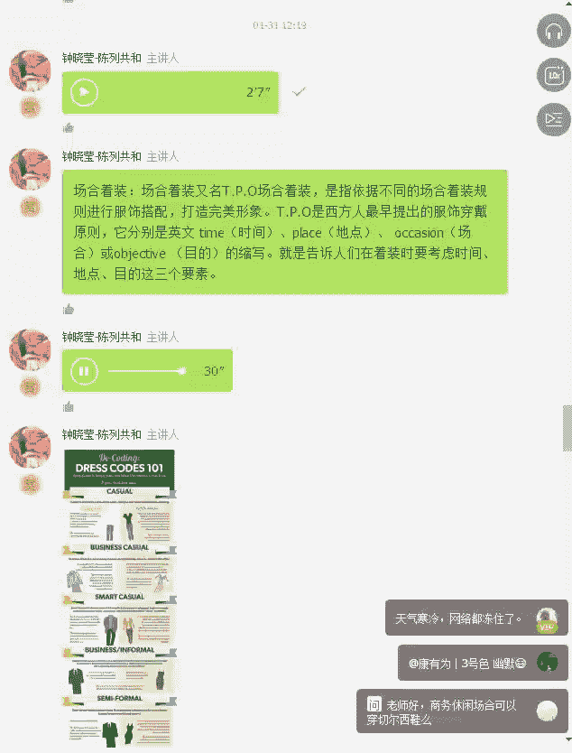

好，大家看完这一张长图之后，大家就明白了什么是呃caual，什么是business casualual，然后然后商务休闲，然后休小的休闲。然后还有就是商务的这种正装啊，什么是呃礼服。

大家应该能够通过这张图能够理解整个场合着装的一个过程。

，莎士比亚曾经说过，服饰其实往往是可以表现人格的，在人际交往当中，服装服饰是在很大程度上反映了一个人的社会地位、身份、职业、收入、爱好，以及这个人的文化素养，还有他的审美品味。

所以说即使我们没有开口说话，我们的衣着，我们的体态，我们的姿态，我们说话的方式，我们说话的内容，其实都会泄露我们过去的经历。所以服装一直被认为是传递人的思想感情的一种非语言信息。我上次去参加一个晚宴。

非常隆重的晚宴啊，主办方一直要求我们是要穿呃礼服的啊，什么叫礼服呢？就是男士要穿呃带领结的，然后女士要穿夜帝这种长裙，啊，男士要穿的是这种然后女士要穿的就是夜帝的长裙。那那天呢我刚好看到了一个男士。

他自己可能都觉得很尴尬，她是怎么出席的呢？啊，她穿了一条牛仔裤，虽然他上半部分也穿了西服，但是他是很尴尬的。为什么？因为他完全没有按照这个着装套路来，也就是他当天是这么穿的，当然不是这个男士啊啊。

大家可以看到这两个对比起来，你就明白下面的这张图是休闲的，而上面的这个是非常正式的晚宴当中要求的男士的标准着装。🎼所以我想。🎼更多优质课程请加微信，1882310541618823105416。

如果你是穿牛仔裤的这个男士，你一定会觉得好尴尬，对吧？我们在日常的大众常常会遇到的场合类型有几种呢？其实无非就是三种，但是三种当中可能也会分为很多种不同细节。第一种就是工作的场合。

第二个就是度假休闲的场合。第三个就是出席啊社交的场合。第一个是工作场合，第二个是休闲场合，第三个是出席的社交场合。那工作场合当中可能公司的类型不同，穿衣的要求也是完全不同的，有非常正式的公司。

有不太讲究的公司，有非常时尚的公司。所以呢你穿着其实穿着没有对与错，只有合适与否，也没有说谁穿的特别好，也没有谁谁穿的特别廉价，只有说你穿的这个是否符合你现在目前上班工作的场景。

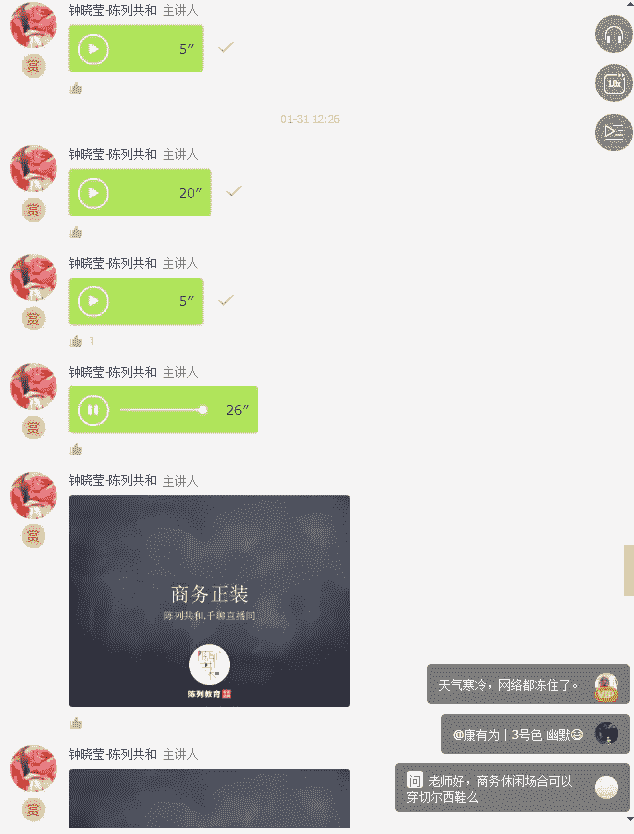

好了，接下来我们看到的就是商务正装。商务正装其实就是类似于半正式的场合。比如说一些商务的会议啊啊在白天举行的一些较为隆重的活动啊，或者是你中午要请一个非常重要谈判客户吃饭呢。

或者是你要到别人公司去访问呢，我都建议你去穿着一些中性色和呃深色的西服。那配素净的优雅的领带和衬衣，一定记住，不要去配那种花里胡哨的衬衣，也不要配那种花里胡哨的领带。

因为通常正式的场合要的要求的是呃简单低调啊，不突出自己。但是要尊重这个场合，这是商务正装着装时候一个非常重要的。关键点。

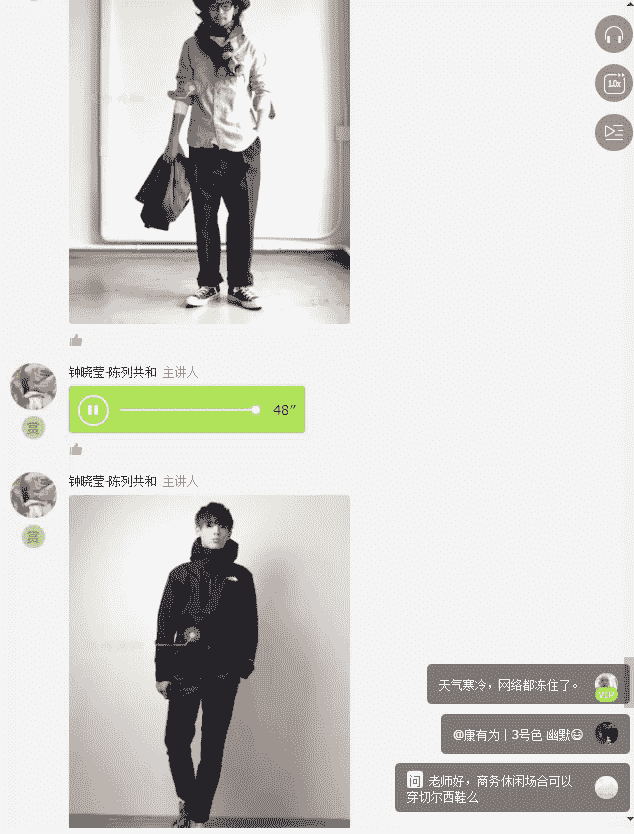

那么谈到商务正装的禁忌的时候呢，我认为首先第一个白色西服是不适合的啊，白色西服比较适合演艺行业或者是休闲的时候穿着，然后不适合穿花西服，也不适合穿花衬衫，也不适合穿花领带。

也不适合穿露脚踝的鞋子也不适合穿马丁靴，所以正式的场合它一定会有一个非常关键的一个关键词。那么就是正式正式的时候，人一般都会有一些拘谨，有拘谨的行为和动作都是正常的。为什么？

因为正式的场合就是要约束你的行为。除非你在自己家里，那没关系，随便你不受约束，你穿个大裤衩都可以好，随便。但是在正式场合，你相当于出席了一个社交型的场合了，那么你就必须要有约束自己行为的服装出行。啊。

这个网络真的是很慢啊，而且图片跟我语音完全是迭代，跟不上的。所以请大家慢慢的去听和慢慢的去看。其实现在好像千聊里面已经有个简易版，就是你不用一个一个的点我的语音，你点开简易版。

它就一直流畅的播放的也挺好的。我觉得特别适合开车的时候听。

好了，大家现在看到的就是在商务场合当中扮这种商务正装里面的竞技的打扮，你一定不能穿着运动式的鞋子，不能穿连帽衫，不能穿羽绒背心啊，不能穿呃宽的宽松的这种裤子去进行商务会谈，除非你是大咖啊，你谁都不怕啊。

可以，你是大师都可以，你也不能穿这种运动型的夹克，你也不能穿冲锋衣去见客户，除非你是明星。所以以上的这些都是商务正装的非常重要的一个竞技点，就是过分随意的着装，一定记住我刚刚所说的所谓的正装。

它一定是修饰和约束你的行为的。约束你的举止，约束你的站姿，约束你的坐姿的，所以它一定不是舒服的。所以你永远记住穿商务正装的时候，你不舒服，其实是很正常的。

当然也有一些商务正装是很舒服的，很高级的面料的西服啊等等这些。那当然是有很舒服的这种高级正装的。

但是再怎么舒服的面料啊，你因为你比较合身嘛，呃整整个衣服的肩部啊、臀部啊、腰部啊都是非常合体的。所以你穿的时间长了，你一定会觉得不舒服的。好吧，那我们现在就接下来看看商户场合的正装当中啊。

最标准的着装是什么样子的。

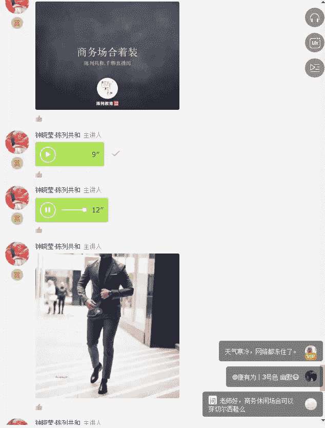

好，这个就是非常标准的商务场合的着装啊。首先第一你要有衬衫，你要有领带啊。当然还有一个就是你可能要有带巾。那如果你真的冷，你可以穿件羊绒大衣，记住你可以穿风衣，但是你一定不能穿冲锋衣。

你也不能穿运动型的夹克。所以其实这个是非常重要的，特别是在正式的场合当中。

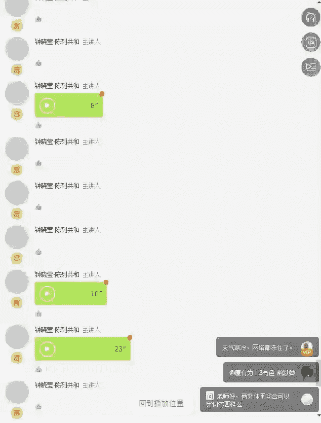

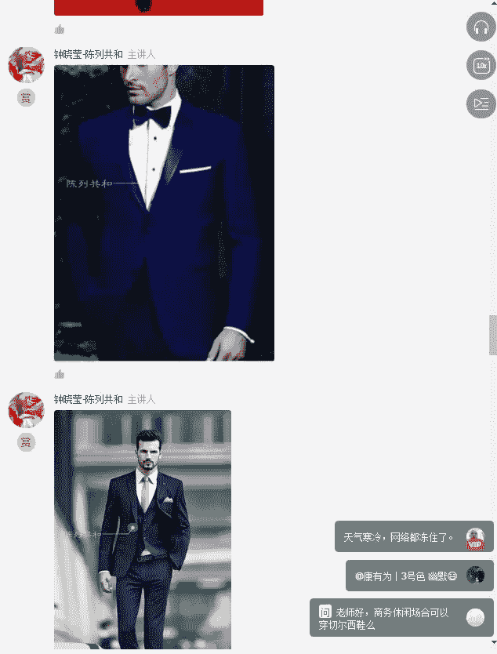

这种正式的场合都不是说你正式的晚宴的场合，都已经都还没有去到。你要见呃高官哪，你要见这种大政要啊，或者是呃大客人大客户的这种礼服，这只是简单的正常的日常的男士正常着装需要的。好啊。

所以专业的场合里面可以选择的这种西服的颜色是较为保守的颜色。比如说深蓝深灰、卡其黑啊，卡其我觉得可以选择出。你如果是时尚公司的话是没有问题的。但永远是永远不会出错的。但同时意味着缺少个性，但是你要记住。

在商务场合当中要的不是个性。在这里面我特别推选的就是深蓝色、灰色的西服，是最能体现气质和权威感的，能够满足高端人士的这种穿着的诉求。你参加正式的会议或者约见重要的客户的时候。

都能够为你的形象增添干练和专业。其实你的价值真的。不止一套西服的钱，对吗？所以值得投资的一套贵一点的西服真的可以穿好多年。而且在任何一个重要的商务场合。

你都是最得体的那一个形象永远能够给你增加更多的印象分，我敢保证。好了，那我们讲完呃工作场合当中的商务正装之后，我们就来讲讲商务休闲。其实什么叫做商务休闲呢？我们来讲一下。那所谓的商务休闲。

其实就是我们现在国内常说的啊，有很多男装，他定义为自己是商务休闲。因为这几年其实商务休闲是很很盛行的。其实商务休闲刚刚开始是在1990年开始有这样子的一种呃商务休闲的着装的方式。

在西方的白领间开始迅速的流行。特别是美国和加拿大的一些地区，比如说很多在硅谷工作的IT工作者，他们就是用这种商务休闲的方式来上班的。比如说呃穿一件T恤，外面造一件休闲的呃西服。那以正式的着装不同的话。

商务休闲并没有一个非常明确的定义啊。所以呢呃我总结了一下，其实就是游泳的衬衫，有可能是polo衫，polo衬衫或者是牛津衬衫，旁边有两粒扣子的那种，然后再加一条卡其色的裤子。

可能它这种也被称之为商务休闲。那也有一种就是上面是呃单膝休闲单膝，然后下面是一条啊休闲裤呃，也可以，或者是其实商务休闲在我们大部分的概念里面就是不是套析，而是单膝。

好，大家看到了吗？这种就是商务休闲，商务休闲就是它第一不打领带，但是它可能会用带巾。第二就是它不会穿成套的西服，它全部都是单西单件的西服，搭配其他颜色的裤子。

好，以上就是跟大家给大家看到的这种商务休闲。商务休闲其实我觉得最重要的是其实是可以表达很多自己的个人风格的那当然很多时候你说我商务休闲穿个球鞋行不行？嗯，要看你的公司是讲究的公司还是不太讲究的公司。

或者时尚的公司。其实越是时尚的公司，其实对于着重的要求应该是越高吧。那当然了，现在大部分很多的公司其实是介于不讲究之间的啊，不讲究和随便之间的。所以我觉得在不讲究的公司，其实你也可以讲究。

我觉得这讲不讲究是你自己的要求啊。

好了，接下来我们要讲我们另外一个场合，这个场合就叫做休闲啊。休闲呃在这里面我们可以看到就是休闲。我觉得我会把它分为周末的休闲和旅行的休闲。

那周末的休闲我觉得无非就是最重要的穿衣主题，我认为就是轻松舒适得体。比如说周末的时候，你通常会干什么啊，喝咖啡、看电影，陪老婆逛街，然后陪小孩玩或者跟朋友聚会，穿着轻松随意一点。

你在周末的时候就不要穿西服了。就是都有很多时候，我们中国人，我不知道现在内地怎么样啊。以前我们在广东的时候，其实每到过年过节的时候都有好多叔叔穿西服。哦，我觉得好正式哦，为什么呢？因为除非是我们家白酒。

你才需要穿西服来，不然的话你应该是穿这种休闲的单膝就好了，穿着舒服一点的高领的羊毛衫，对吧？所以我觉得最重要的是周末或者是过年过节的时候，家庭聚会穿着轻松舒服就好了，不要邋遢。

大家可以看到，这些都是周末穿衣服的范儿，很简单，很随意。

很有味道。又或者是选择这种比较文艺泛滥的这种穿着的方式，小白鞋，然后配条啊灰色的休闲裤，然后再配条针织衫，然后再配一个白色的衬衣在里面呼应鞋子又或者是穿牛仔裤，也配小白鞋，又或者是穿卡其色的裤子。

又或者是用白色来配这种牛仔衣，然后里面加条纹，其实我给大家的所有的这些图片，说真的真的是非常非常实用的，大家只需要按照他去穿着就好了。一定记住比例啊，你就好像你刚刚看到那个日本的那个男士穿衣服。

他的裤子呃，第一，他穿的并不是特别的高啊，但是他刚好是到腰的位置，显得腿部非常的浅，非常的长，然后呢，因为他的肩膀，因为他有健身，所以你感觉到他上半身的比例和下半身的比例是非常协调和舒服的。

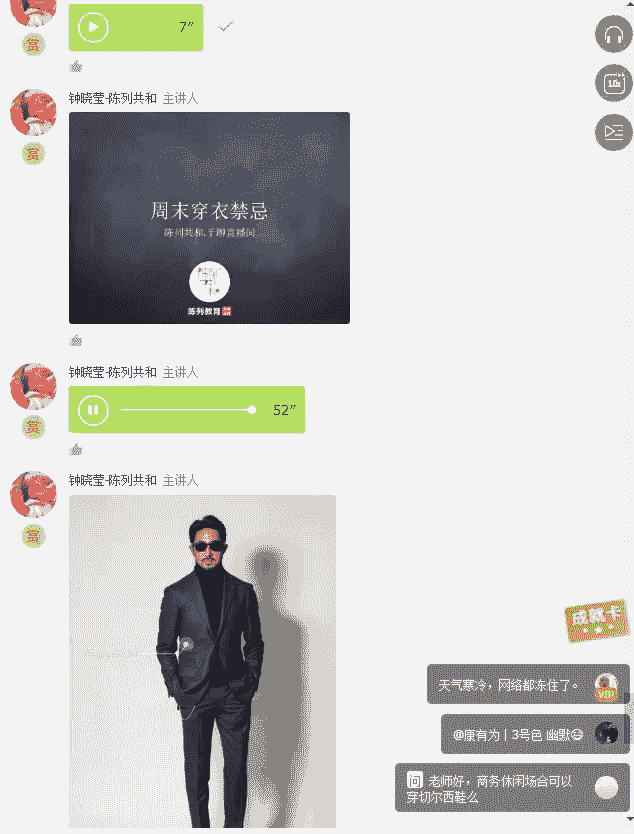

这就是周末穿衣的禁忌不要穿正装，不要穿的正儿八经的，除非你周末也要见客户。所以所谓的场合其实就是合适，没有什么最好最贵。我觉得最重要是合适，合适就不会让你在这个场合当中尴尬。因为你不尴尬。

所以你就会非常的优雅和得体。好了，那接下来讲到另外一个休闲的场合，就是旅行了。旅行。我给大家的建议就是你的穿衣主题要符合旅行的目的地，国家的呃国情，同时，你这次旅行的目的是什么？比如说你是去冲浪。

你去热带国家，你穿着的东西肯定跟你去这种欧洲国家是不同的对吗？所以你去的是日本还是美国还是欧洲，其实都是不一样。比如说你看到你去的这个是热带国家，那么你穿的就是大短裤啊、拖鞋啊这些就可以了。

就是这种比较轻松随意的这种呃着装的风格。

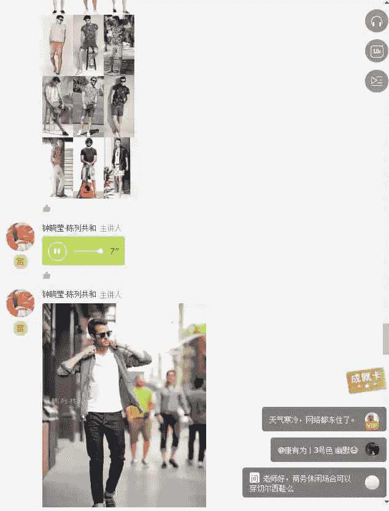

那如果你去的是一些欧美国家，欧洲，那我可能就会建议你穿的阳刚一点。

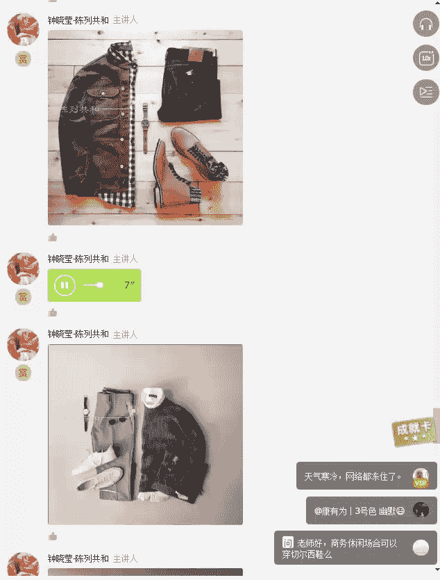

那如果你是去的日本韩国，那我可能会建议你穿着的文艺一点，就是这种类型。

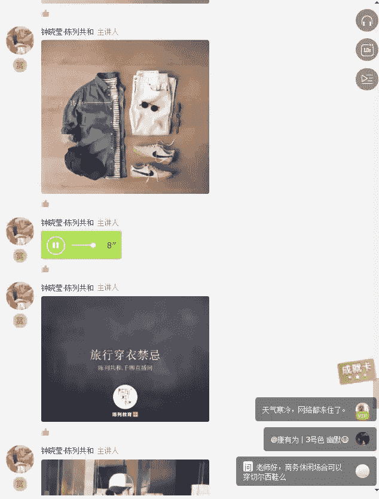

啊，如果你是去欧美国家，你就不要穿着这么东南亚了。所以呢旅行着装当中的禁忌，我觉得就要看你的旅行的目的地，还有就是你想去干什么。

好，我们最后来讲一个出席社交场合时候的穿着。那出席社交场合时候有很多吧，比如说有正式的晚宴，有私人的party啊，还会有年会啊。我们最近等你很多的公司都在做年会。那如果你要出席正式的社交场合。

那么你要穿着正式晚宴的party衣服，你第一要学会打领结。第二个你要学会打领带。

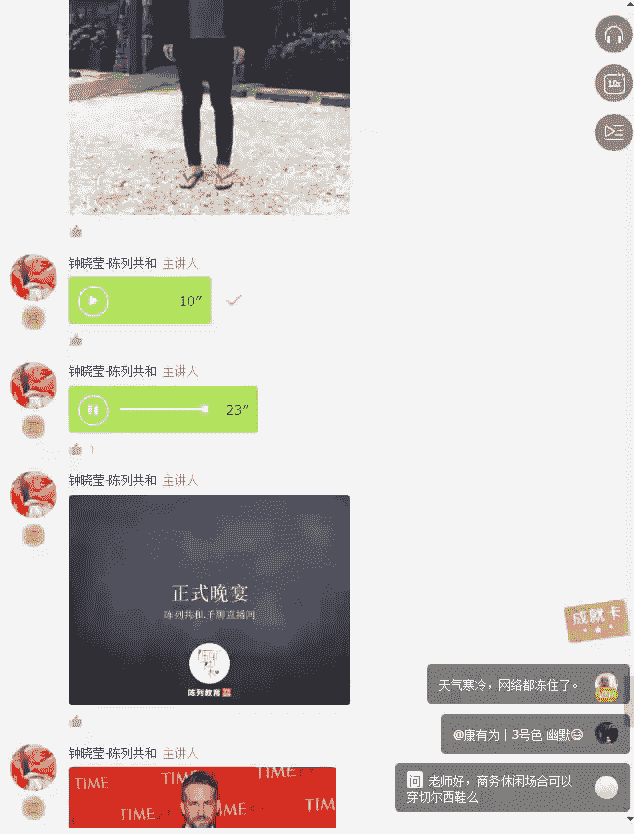

啊，这些都是正式的晚宴哈，比如说像这种可能也是正式的晚宴也可以的。有时候有些晚宴他是不要求你一定要打领结的，你领带也可以。好，现在给大家看到的示范到的是一些打领带的一些方式啊，希望对大家有帮助。

毕竟马上要年会了，所以呢给大家一些小建议。其实年会呢我们之所以不把它放在主题里面讲，是因为其实年会有很多主题。比如说我们今年的年会就是cosplay，就是化妆舞会的主题。你穿着，那基本上要看你扮演谁了。

不一定是每个人都要穿西服的。那再来呢有一个非常重要的社交场合就是私人的party。那私人的party其实大部分都是偏向于我建议选择大地色系，偏暖色调，容易给人一种非常温暖和亲切感啊。

所以呃这种大地色系是不适合去出席这种严肃的场合的啊，比如说你可以出席，比如说员工的庆生会呀，私人的party都是可以的。

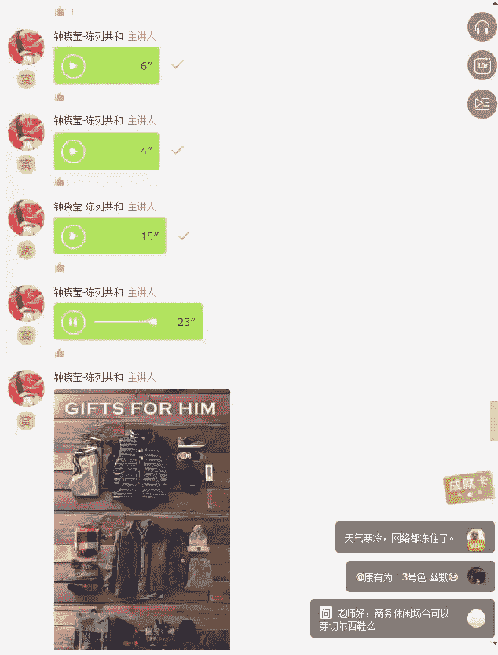

像这种就不适合出席正式的场合啊，也不适合出席员工庆生会啊这些的，这种就比较适合你平时休闲穿着。其实如你出席年会的时候是这么穿，其实也是蛮拉风的。

不一定要打领带，除非是要求主办方要求你一定要打领带。好，最后给大家看到这张图，从上到下啊，就是第一个第一场呃第一个格子衬衣和咖啡色的西服都是适合你在呃商务休闲场合啊。

比如说你第一套格子衬衣就比较适合你在周末的时候穿着。那那边的那个咖啡色就适合你在一些呃轻松的自然party就可以穿着。那下面呢有领结的那个呢是比较适合你在正式的晚宴。好。

那打领带的这个呢是比较适合你在正式的工作场合的。那下面的这些就是比较酷的，比较夸张的呃，这种呃休闲的方式或者正装的方式了。比如说左边左下角这个是医生的着装啊。

右下角这个是比较呃比较酷的这种三件套的西服都可以给大家做参考。好了，以上就是我们讲到的我们大众日常会遇到的三种场合，工作休闲和出席社交场合。那在场合着装里面呢，我们还是回归到那句话。

所谓的场合着装不是你要穿多贵，也不是你要穿多精致，而是你穿的有多合适，永远记住这一点，不合适的着装一定会让你尴尬，你尴尬的时候，你一定发挥不正常。你一定你如果想让别人高看你一眼。

那么你就一定要把场合着装。提起来你一定要去去一定去这个场合之前，一定要先问清楚这个场合着装的要求是什么。大家知道吗？被誉为全世界最会穿衣的女人之一的jaqueline，就是美国肯尼迪总统的夫人。

她每次跟肯尼迪总统出访的时候，他都会问对方仪仗队接机时候的环境色以及仪仗队的衣服的颜色。为什么？因为它确保它下飞机那一刻是完美的跟这个场景，跟这个环境融合在一起的，不会陷入这个环境当中。

但是一定要跳出这个环境，同时又不显得自己特别的突然。所以这就是场合着装带给大家的一一个思考吧。就是永远记住你的形象，如果你自己的不注意的话，是没有人来帮你去注意这一点的。

你的形象其实可以让你自己变得非常的有价值，也可以让你自己变得非常的廉价。所有的一切都是在你自己的手中。好了，以上就是我们今天的第十一讲场合着装的全部的内容。

在这里面我就不再一一的去总结我们这十一讲当中讲过了哪些内容了。今天就在这里做一个最后的呃小小的结束。但是我认为这个都不是结束，所有的结束都是为了更好的开始。好啊，同学们，那我们。

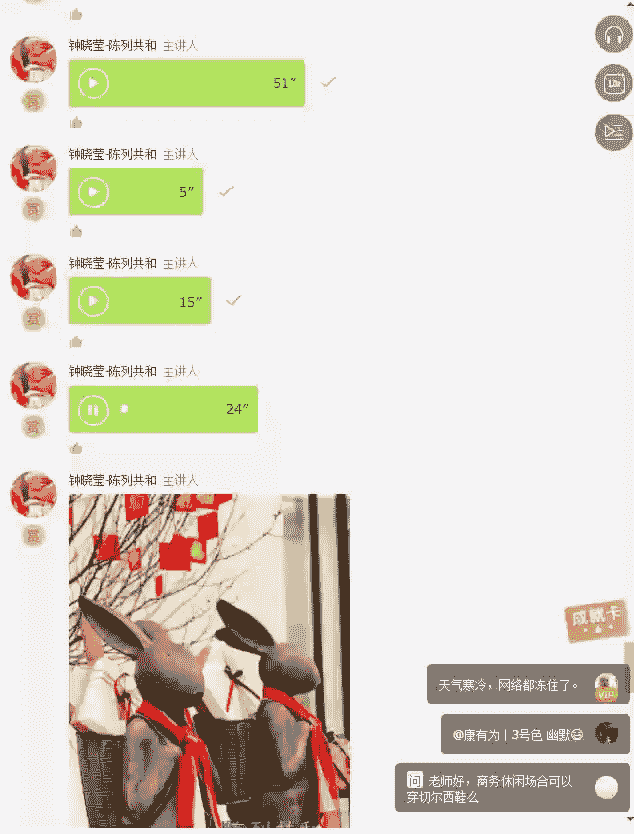

这1一堂课就到这里画了一个完美的小的逗号，希望我们未来越来越精彩，也希望大家的着装越来越精彩好吗？那接下来留5分钟的时间在这里面回答大家的问题，感谢大家。这十一讲当中一直坚持下来的同学，感谢你们的聆听。

感恩。

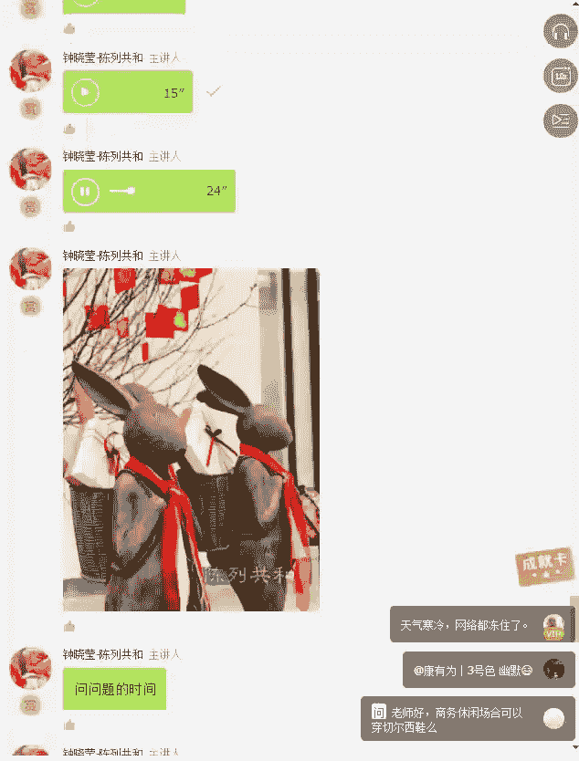

好了，感谢老师今天的课程分享。那这期课程已经是我们系列课程的最后一期了。那就像老师说的呃，不是一个句号，是一个逗号。呃，期待在其他的场能够再次跟大家相聚。😊。

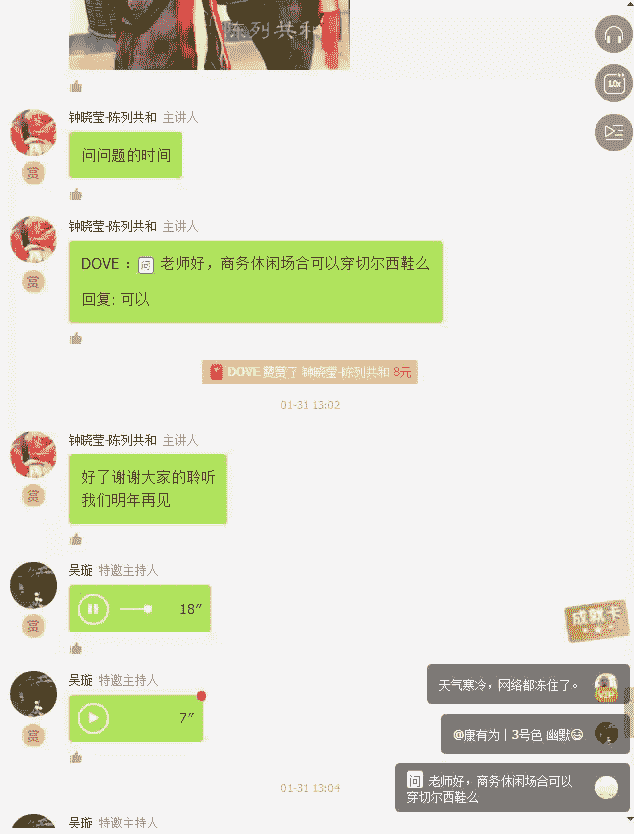

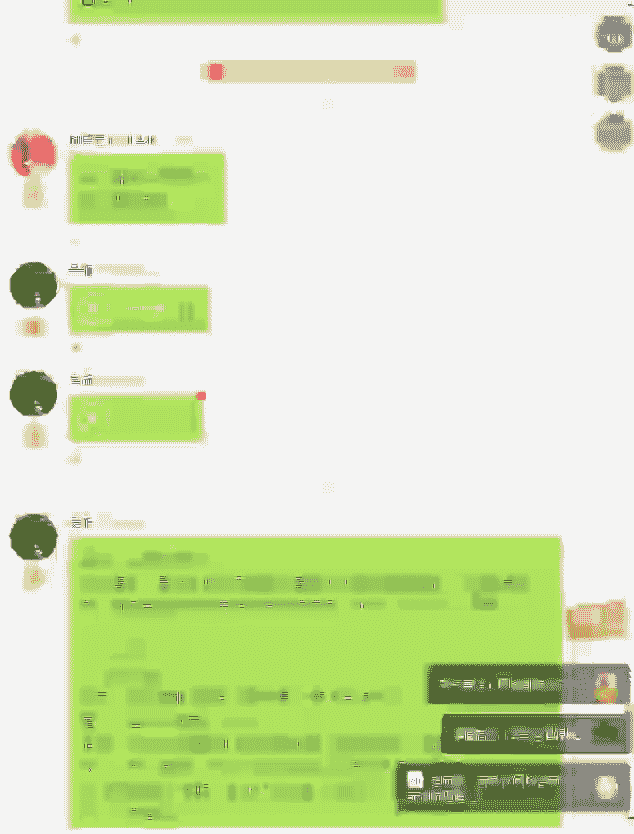

好，我也主持人也在此祝大家提前祝大家新年快乐。

那下一期课程，也就是明天我们即将进入到马上学会写子陈列的系列课程。如果大家有感兴趣的，或者是正好是做这一行的那也可以。购买这个课程，然后进行学习。那我们明天上课的时间是晚上的7点半。好。

在最后的话也是希望大家动动手指，对我们的课程，今天的课程进行一个评价。那操作的流程我发给大家。

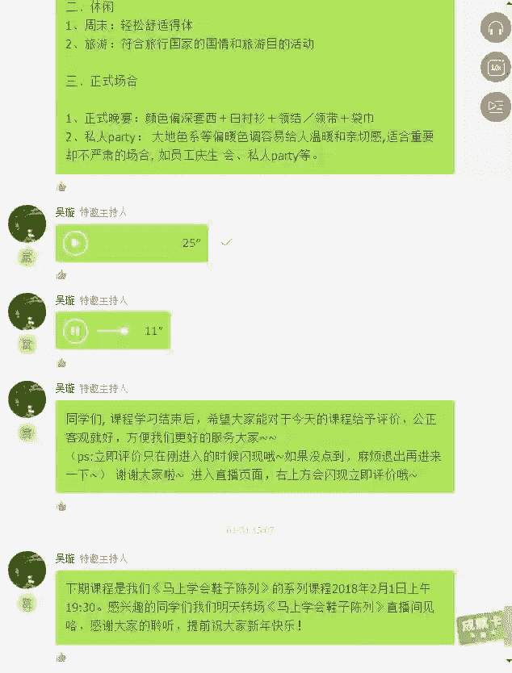