# 1、16男士衣品速成穿搭指南(完结）：第1课：内外兼修是每一个男人的必备素养：第1课：内外兼修是每一个男人的必备素养

hello，大家好，我是陈业共和的钟小莹，我们又见面了。😊，我误导一下大家。刚刚大家应该是以为又来到了陈列课程的课堂了，对吗？

之所以要发这几张照片上来，是因为我想跟大家提前说一下圣诞快乐。而我们这个课程呢很好，在双旦之前开课，可以满足到大家买买买的需求。买之前先听课，也许真的会省下不少的银子。但是同时如果我们是做男装店铺。

做男男性服装生意的那听完这堂课之后，也许我认为不是也许是一定会对你接下来的双旦节的销售会有很大的帮助。其实我认为不只是双旦的，还有春节。在这个正个月开始到2月份，我相信都是我们做服装。的旺季。

做服装的旺季。所以呢希望大家能够在这个课程当中有所得有所获。还有一些个人的同学，我相信你听完这个课程之后，一定会得到很多很多自我的。素养的提升。比如说从内在还有外在，最重要其实这堂课主要是讲外在。

但是呢我觉得其实内外兼修就是倒术兼修。拥有一个好的内在，也是需要好的外在来表达的。一个人的穿着绝对是他内在的一种表达。你们说对吗？你有钱不行，你必须得证明你有钱，你有品味不行，你必须证明你有品味。

而人的魅力，无论是男人还是女人，很多时候都是从外在而来的。

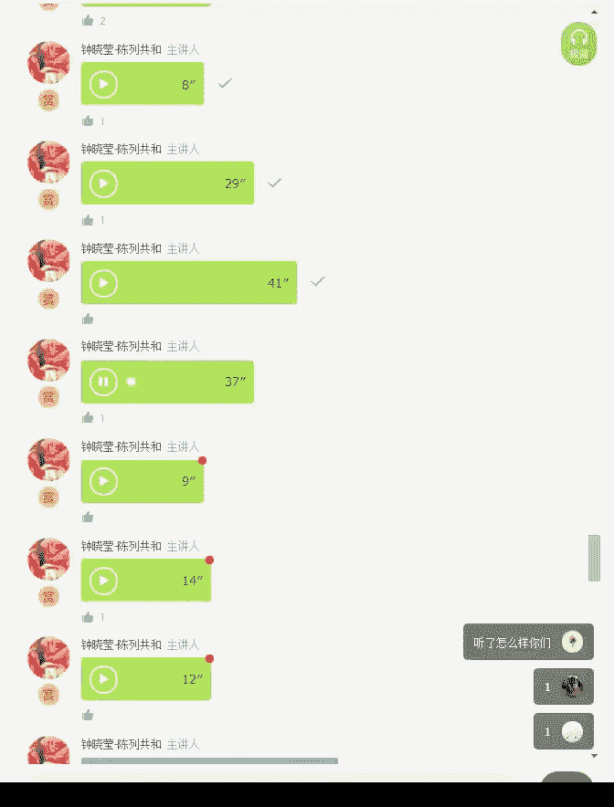

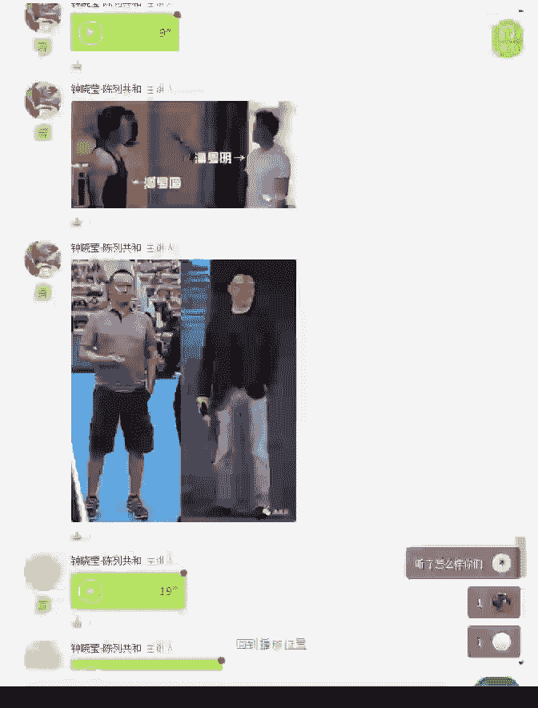

有很多时候我们会说以貌取人是不对的。但是why not。

以貌取人是大多数人在大多数时候的选择好吗？曾经王尔德先生有说过一句话，他说不以貌取人的人都是肤浅的。就连现在很多小朋友在读幼儿园的小朋友都会攀比说谁的爸爸妈妈更好看一些。如果爸爸妈妈的形象好，说真的。

子女都会自信很多。所以为了下一代，我们也要把自己的形象修炼起来，这是对于我们自己的人生的价值和意义，一个非常好的升华和体验。我想问一下大家，当我们看到这两张同样都是沙滩的照片的时候。

你会更希望见到的是哪一个男人呢？王尔德先生曾经说过。人真正的完美不在于他拥有什么，而在于他是什么。所以，内外兼修是每一个男人的必备素养，而所谓的内外兼修，其实就是倒术兼修。我们拥有好的内在涵养。

但是我们也需要好的外在形象来表达我们优秀的内在。

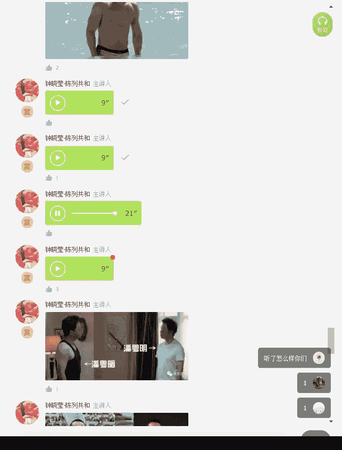

正如那句话，没有任何一个人愿意透过我们邋遢的外表去了解我们丰富的内心。

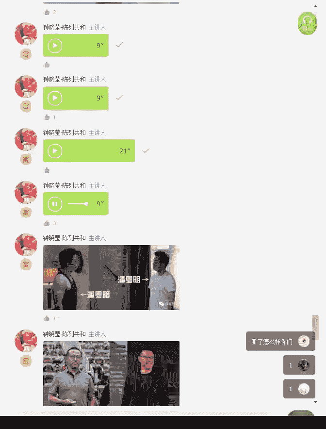

我现在给大家看几张男演员的对照图，为什么要放男演员呢？因为他是我们公众都认识的，所以呢我们会比较容易理解这个形象对于。

一个男士的重要性。

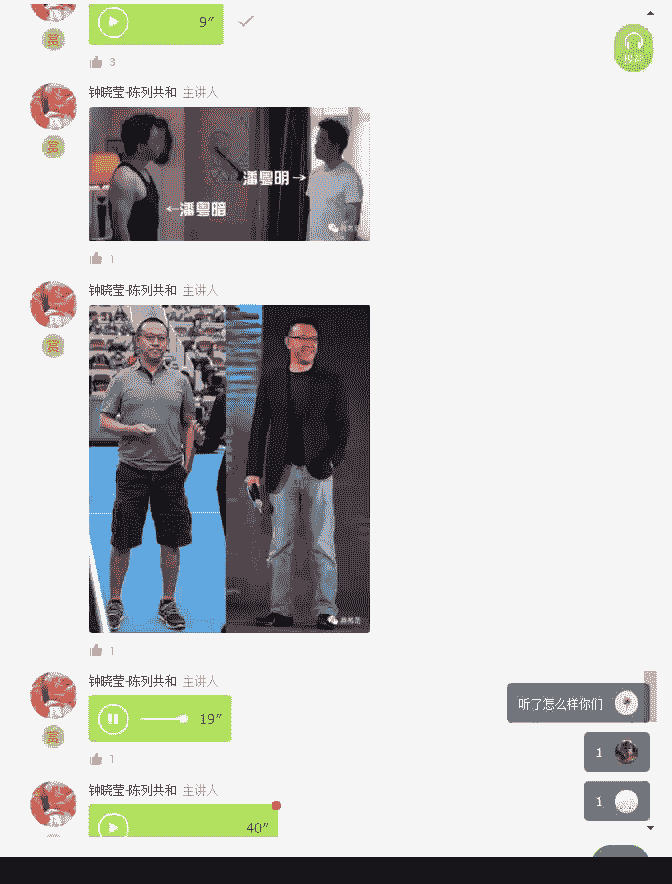

大家现在看到的是潘粤明以及姜文先生，潘粤明先生和姜文先生的两个对比。潘粤明，我记得曾经是很多少女梦寐以求的男神，但是现在出来的潘粤明真的是胖的不成样子，像一个地瓜一样的就出现了。

那还有另外一个呢就是姜文先生，你看到姜文先生穿到的左图，中年男子的随意的穿着，还有右图，一套黑西服，然后一条牛仔裤，你会更愿意接近和更愿意相信谁对你说的话呢。

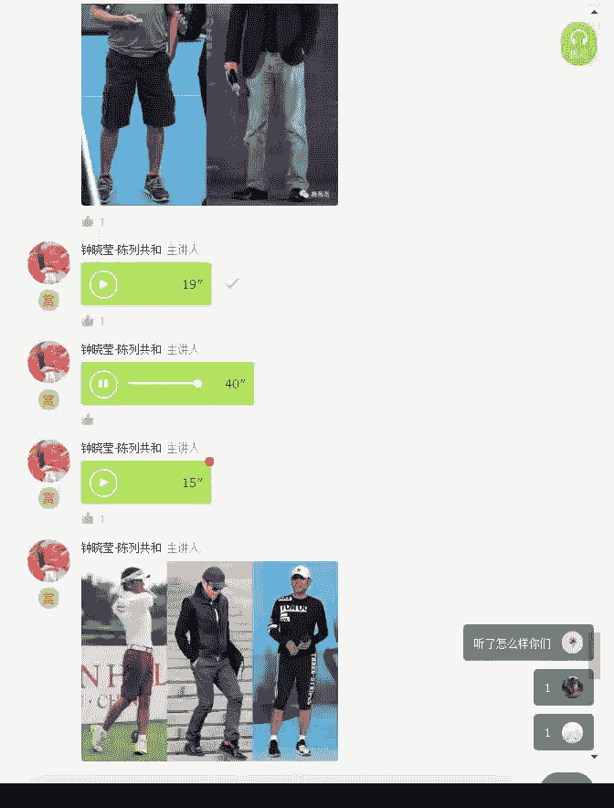

谁的话会更有说服力呢？有很多时候我们会说，哎呀，外形不代表我的内在吗，但是永远记住。如果你有好的内在，那么你也应该要用好的外在来表达自己。

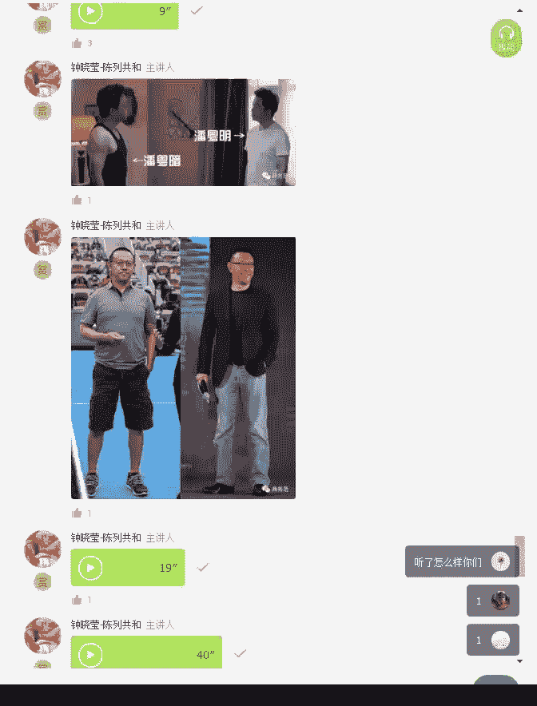

我们现在看到的是两个不同年代的男人，男演员，一个是陈道明，一个是吴秀波。吴秀波一直以来都被誉为我们的大书级男神。那陈道明更不用说了，年纪应该有将近有60岁了吧，50多岁是肯定有的。

但是你看到他的这个身材的保养，以及他平时的这种运动的爱好，都能够让这个人变得特别的年轻，比如说前段时间很火的那部电影，电视电视剧叫做我的前半生里面，他扮演的那个日本料理店的老板是不是特别有魅力。

开个摩托车，你感觉到宝刀未老啊。

所以年龄绝对不是我们放弃形象。的一个借口，任何一个人，只要你开始重视到形象的重要性，一点都不完。我们今天的第一堂课标题叫做内外兼修是每个男人的必备素养。

那么也就代表了我们今天会从两个方面来谈一谈到底内在男人应该必备的素养包括了哪些方面，而外在又应该具备的素养，又包括哪些方面呢？那么我们就先从内在开始谈起。因为所有的外在都是内在的显现。无论男人还是女人。

很多时候我们在工作和生活当中都会遇到很多单身的男士，你会发现有很多单身的男士当中，有一小部分的比例是被誉为钻石王老5的。那被誉为钻石王老5的这一批人，你会发现他都有一个非常重要的一个特点。

他有一个非常好的外形。这个外形并不是说他长得多帅，而是他穿衣服很得体，他有身上有精英元素，而且呢他跟时上有一点点的挂钩。还有最重要最重要的就是他拥有非常好的个人爱好和生活习惯。

所有的女人好像都愿意去接近这样的男人。对这就是男性的个人魅力的体现。你永远记住，一个女人跟男人是一样的，男人的择偶标准是好不好看？女人的择偶标准，刚开始的时候也非常看重外貌的。我曾经在一个餐厅吃饭。

坐下来的时候，我就开始点菜。然后我坐下来吃饭，我特别喜欢观察身边的人，我就观察到我左手边的这个女士呢，感觉好像是在等人。因为在呃那个朋友来之前，她已经拿出了两次镜子来涂抹口红，以及观察她的睫毛啊。

她的头发呀等等。结果这个她的朋友来了，是一个男士。当时在这个男士来之前，我就猜到了应该来的是一个男士，而且他们应该是第一次见面。然后这个男生一坐下来之后呢。

这个女生我感觉到我用余光漂到他的整个的脸就拉下来了。而且坐下来刚没有点完菜，她就跟这个男的说，他说我们简单吃点就好，因为我待会儿可能还要回公司。然后我就再观察一下这个男士的穿着。

我发现这个男人穿着真的很一般，很邋遢，但是并不代表他没有内涵哦。但是呢这个女人就是直接从她的外表就已经给他打了不及格的分数了，这不就是很亏的一种做法吗？如果你有好的内在。

为什么你不用好的外在来把她表达出来呢？讲完这个例子之后，我相信你们脑海当中也会浮现出很多这样的例子，对吗？所以呢如果你有时间打字的话，可以在后台告诉我你有没有遇到过这样子的例子，你本人或者你身边的朋友。

好了，那么就让我们来先谈谈男人内在必备的素养包括了哪些方面呢？首先我认为有三个方面是必备的。第一，生活习惯的养成，也就是好的生活习惯的养成。在这里面就包括了三个部分。第一，你要有好的。

生活习惯首先代表了你要有一个运动的习惯。你要有自己的这个运动的这个固定的这个时间，为什么？因为毕竟男人的身材其实是能够给到一个女性安全感的。另外一个就是阅读的习惯。内在需要阅读来填充。

为什么富有诗书气质华这句话应该是知道的。但是我们中国人的阅读习惯其实是因为我们从小到大的这种高考被逼迫，到最后我们都很厌倦去读书。但是你会发现，其实现在有很多好的书，是用来可以增加我们跟朋友。

交往以及谈话聊天当中的谈资的。所以在生活习惯的养成当中，第二个习惯，我把它预定定为阅读的习惯。第一个是运动的习惯。那第三个呢就是我们个人的卫生习惯，个人的卫生习惯。

我们要让自己出现在公众面前的时候是干净得体的那所谓的干净。那我们一定是用嗅觉来来什么嗅觉和视觉来去去去去了解的，因为没有人一见面就触摸你摸摸你脸油不油啊，对吗？摸看看他只能是看看你的头发干不干净。

头发油吗？头发有头皮屑吗？对吗？还有就是你有口气吗？然后你有体气吗？对吗？所有的这些你会发现基本上都靠视觉和嗅觉来完成，所以生好的一个生活习惯的养成。

特别是个人卫卫生习惯的这个部分的关注是非常非常重要的。我就给你举两个例子，一个是口气的例子，一个是体味的例子。昨天我的美容师跟我做美容的时候，做护肤的时候跟我讲起，他说，哎呀。

你都不知道现在我坐地铁的时候都戴口罩。我说为什么呢？他说你都不知道有些人啊那个扑面而来的那个口气啊，大的呀，简直就要把你熏晕倒。然后他说其实一个人的口气真的会让人产生很大的厌恶感，你都不想跟他说话。

而且你想离他很远很远。我想问问。你身边有没有这样的例子？其实口气真的是一个社交上的一个非常大的障碍。而且某种程度上，其实如果你有口气的话，如果我们有口气的话。

也就代表可能我们的胃当中有一种菌叫做幽门螺幽门感螺旋杆菌。这个菌是因为胃部分泌的这个细菌而导致的。那也就代表了我们听完这堂课之后，可能很多人就要跑去体检了，看看自己有没有这个。如果有的话。

我真的建议你去治疗一下，为什么？因为这个很关键，社交场合当中最忌讳的就是体味和口气了。那我们再来讲一个体气，体气呢就是体味了。最近有一部电影很火，冯小刚导演的芳华，大家有没有看过？有看过的在。

群里告诉我看过。这个就是这部电影的剧绍。这部电影主要是描述的一个文革文化大革命时期，啊，包括到改革开放时期的这个一个部队文工团的一个故事。在里面呢女主角呢因为汉味大而遭遇嫌弃，没有人愿意和他搭档跳舞。

但是在里面有一个活雷锋、刘锋自告奋勇担待了。但是在现实生活当中，这样的侯雷锋是绝技的，所以我们千万不要抱有这样的幻想，所以我们一定要搞定自己的体位，体位太重要了。不然的话，泡妹对你来说都属于高难度项目。

其实有很多时候我们都会遭遇这样子的一个口气和体味，特别是在电梯一些比较需要紧密靠近的一些场合。所以在个人生活习惯养成的部分。第一个我给出来的是运动的习惯，第二个是阅读的习惯。

第三个是保持良好的个人卫生的习惯。那么现在我们讲到的是男人内在必备的素养的第二个方面，也就是个人爱好的培养。我想问一下在座的各位同学，你们个人有没有什么特别的爱好，特别敏感的就不要说出来了啊。

比如说我们说到的个人爱好，就包括了烹饪、咖啡啊、攀岩啊，然后甚至是旅游啊，甚至是阅读啊，其实都属于个人爱好。那当然还有一些就是我们呃有很多时候特别擅长的一些运动啊，我认为也是属于个人爱好。

一个真正有趣的人，他一定是拥有个人爱好的。比如说我有个朋友他特别爱养多肉，而且他是男士，但是他一点都不娘，他很阳刚。但养多肉的时候，你又感觉到他呵护多肉，他家里有几十种多肉的品种。但他呵护的很好。

他每次呵护多肉的时候，你都感觉到他好像在在照顾他的女朋友和他的情人。甚至我有一些女性朋友都说哎呀，好，希望成为他那盆多肉啊。比如说我有个朋友他很喜欢煮饭，那你想一下煮饭的男人。

大家有没有记不记得黄磊因为会煮饭，会做饭的男人仿佛天生有一种荷尔蒙，能够有一种催情的荷尔蒙，能够让这个女人很快速的喜欢上他。😊，那比如还有一种就是咖啡师。

其实你有没有发现咖啡师甚至是有一个包括厨师都很容易泡到妹妹，为什么呢？因为他们有谈词，还有就是女人都特别愿意靠近这种有个人兴趣爱好的男人。包括男人也是一样的，她也愿意靠近有个人兴趣爱好的女人。

比如说这女人会跳舞，会画画，会弹琴，会呃会写作，呃，会呃唱歌等等，这都是个人爱好，或者是你的个人爱好很独特，比如说收集什么标本，对吗？比如说你有很多呃，比如说我我身边有些女性她很很会玩攀岩，她很会。

她甚至还会玩滑翔伞。那这个时候无形当中就增加了非常多的这种个人的魅力。还有就是你会发现你的圈子会非常的丰富。好，当然养宠物也算是一个个人的爱好。哇，我发现大家还是很对胃口的啊，不错不错。

来这里听课的同学，我发现有很多优质的优质的这个潜力股啊，可能有些人已经都已经结婚了。而且我觉得如果你有个伴侣，有个对象，其实你更应该要精进自己。其实人生只有两个方向，要么精进，要么堕落。好了。

接下来我们要讲到的男人内在必备的素养的第三个方面，那么就是终身学习目标的设定。我刚刚也讲啊，人生其实只有两个方向，一个是精进，一个是堕落。我们永远不要去失去对美好事物和美好生活的向往。

因为所有的美好都值得我们去浪费时间。人生的体验是谁都没有办法帮帮我把我们带走的。因为你体验之后的感受，你的愉悦，它会让你变让它变成你人生当中最重要的一种经历。曾经有过一段时间，有篇微文特别的火。

题目好像是这样子的，中国的男人配不起中国的女人。当然也有很多反驳贴啊，那我想说的，其实这个作者只是从表面，从中国男人的外形去匹配中国女人的外形。那女性对于形象的要求一直来说都是比男性要高出很多的。

但这也正常，因为这是天性啊，女人爱美，这是天性啊。男人可能更多的思维是在于事业，在于工作。男人更偏向于理性思维。而美感这个部分其实很多都是感性思维。所以女人一定记住，永远记住你身边的这个男人。

其实某种程度上就是我们身边的一张名片哦。他的样貌，以及他的外形决定了外界对于我们这个女人的评价。我妈常说，如果你家老公鞋子穿出去脏，人家不会说这个男人怎么这么邋遢，会说，哎呀，她这个女人没娶好啊。

老婆连鞋都帮她擦。那当然，现在社会你根本就不用擦鞋，可能你把鞋子送到外面去护理都可以。但是你必须有这个动作。还有另外一个就是你得有监督他，你得关注她，为什么呢？其实有很多时候大家有没有发现。

无论男人女人，只要你的形象好，只要你今天穿的衣服是新衣服，甚至是你特别爱的爱穿的一件衣服，你今天的精气神，以及待人的和气度，都会提高很多。为什么？因为你已经拥有了一份美好。

所以你不会轻易的用自己的行为和举止去破坏这份美好。所以只要人人都穿的美一点好一点。我相信这个世界就会变得更礼貌一点，更友善一点。借用冯唐先生说的那句话说，你我如我是相亲相爱，这个世界就会少一些灾难。

好了，讲到这里，那么我们就进入到男人的外在了，好吗？那外在无非就是头和身啦，对吗？头身福我是这么分的。但是呢在这里面我们提前先跟大家来讲到的是。打造有型男人的四大思想纲领是什么？

我给我们男人们和女人们来一个四大思想纲领。哇哦，谢谢木古同学给我的打赏，谢谢。

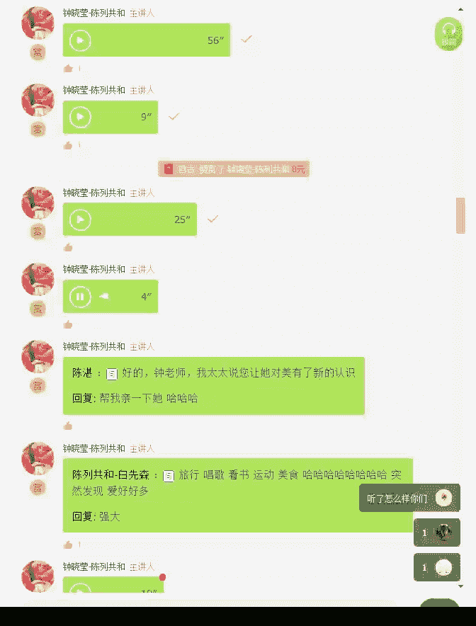

陈站，你太太一定是有一双发现美的眼睛，不然的话听再多我的课可能也没有办法让他发现美。

所以常常会听到有同学说，老师，我听了你的课之后有很大的改变。其实是因为正好我路过的时候，你绽放了。所以一切都是自己的功劳。首先要感谢自己。其实来到这个课堂听课的同学就是精进的同学。

就是希望对于这个自己的未来，保有更多美好和创作更多美好的同学。所以我能够在这里给大家去讲课，说真的打心里我特别特别的开心，也特别特别的幸福。谢谢陈赞的打赏，谢谢。😊，给大家看到的这是国外的一个男模。

我个人非常欣赏的一个男士模男性模特，她的着装，她的搭配一直都是保有自己非常强烈的风格。其实按身高他并不高，但是你会发现他的比例非常好。你一看他就是有健身的习惯的，所以这是一个楷模。一个男人。

如果你平时有穿西服的话，一定记住你要健身，特别是胸部的这个部分。为什么？因为西服它是靠胸肌的这个部分挺阔才好看的。你很少看到有一些瘦血的男人穿西服是好看的。当然我们也不需要把胸部练到好像拳击手那么大。

其实只需要适合就好。永远记住所有的一切，所有的美，其实它都在找寻一种平衡。那么我们现在就来讲讲打造有型的男人的四大思想纲领是什么？首先，纲领一就是我们必须符合大众的主流审美观念。

现在我们的现代文明其实已经进步到越来越追求个性化审美的时代了。很多人其实都有自己非常独特和推常个性的一种个人的审美爱好。但是从大众的这种审美角度来说。

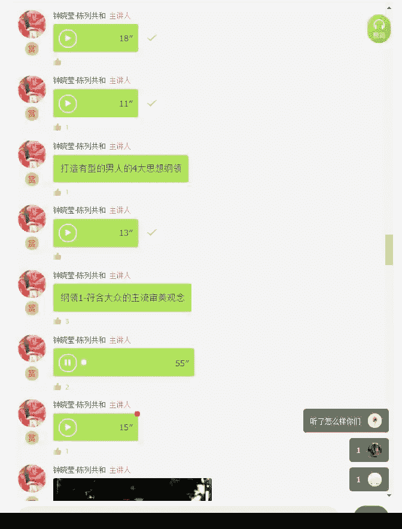

是很关键的，就是小众的审美，其实会导致我们在女性的这个群体当中的受众面会过过窄，也就代表了你越小众，你会发现越不越难以取得女性的青睐。比如说什么吊裆裤啊，棒球帽啊，这种嘻哈的打扮。

很有可能会被很多的白领女性觉得她好幼稚，而打扮成007像詹姆斯邦德。比如说像刚刚的那个男士欧洲的男模一样的话，反而你会能够吸引到很多优质的这种office lady。同时你也会受到很多嘻哈热辣妹的青睐。

记住，嘚色的穿搭，那都是给男人男神们准备的。我们有很多时候频凡大众就不要瞎嘚瑟啊。

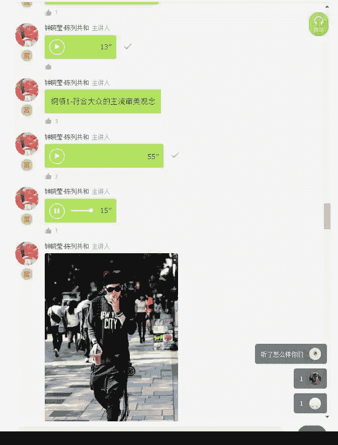

好，比如说我们现在看到的这种。就感觉非主流对吗？非常的小众，经常会有人觉得我这裤裆怎么掉这么低？大家看到的这些就是james邦德新一代的james邦德他的这个形象。大家有没有感觉到他给你的感受是什么？

你一看到他，你就觉得哇，这是一个精英男士精英男士。

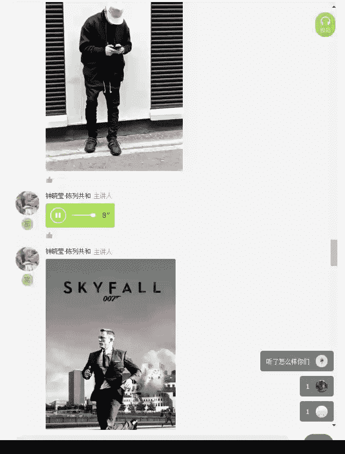

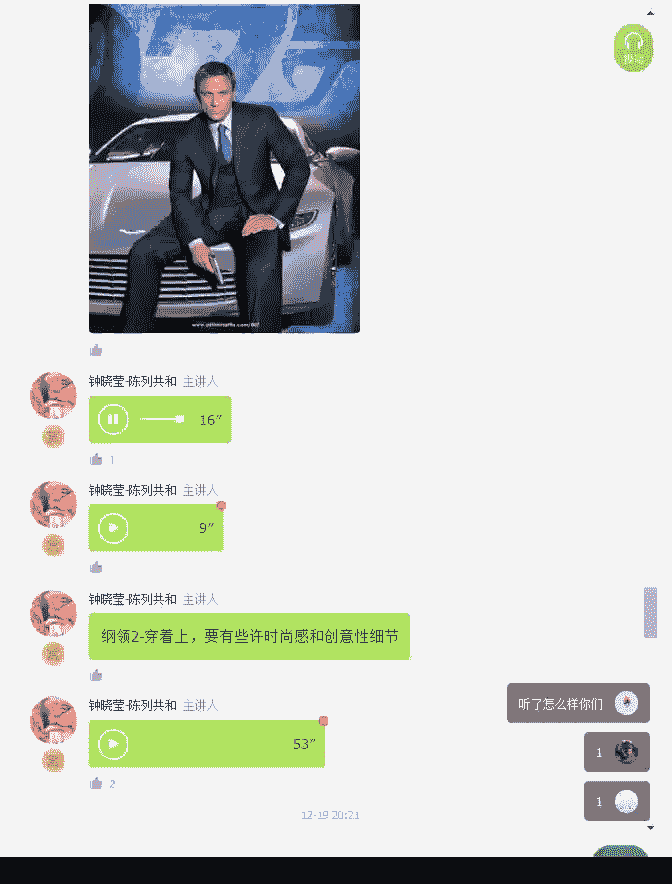

好了，接下来我们要讲到的纲领2，就是穿着上要有些许的时尚感和创意性的细节。

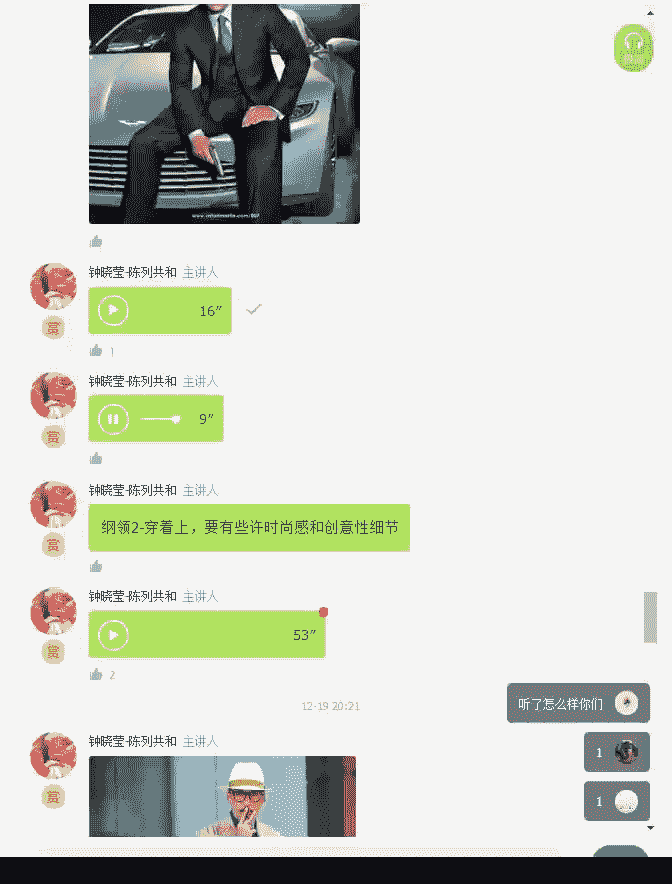

时尚感和创意是一个男人刷存在感的一个非常重要的武器啊。如果你仅仅是符合主流审美，而没有脱颖而出的话，那很多异性是很难发现你的存在感的。所以独特的审美是可以让很多人在大众当中脱颖而出的。

比如说什么叫做独特的审美呢，就比如说你有很多时候你穿西服，但是你不打领带，但你用戴金，或者有时候你穿T恤，你不用围巾，但是你会用领巾，或者是你穿你常常穿一种类型的鞋子。比如说切尔西靴。

或者是布洛克皮鞋或者是乐福鞋，那这都是独特的审美啊。比如说别人都不戴手链，但是你戴手链，但是记住哦，你不要带金链子哦，现在看到所有的戴金链子的男人，我看见他不是土匪，就是屠夫。好。

大家有看到我现在发上来的这几张图片吗？我们从最后一张来看，最后一张你会发现这个男士的。

右呃左肩上呃口袋襟看到了吗？还有他的眼镜。那第二张图大家看到了这个男士的帽子和鞋子的颜色是呼应的。而第三张图片我们看到他的脚踝是露出来的。然后接下来呢还有看到了穿格纹的，穿围巾加西服的。

然后穿今年最流行的元素高领的，然后包包上面还挂了一条围巾的，还有就是这种比如说亚洲的这个男士啊，戴硬顶帽子，口袋襟以及他牛仔衬衣的这种内搭的衬衣，包括他那条牛仔裤，你就感觉到这些都是时尚感。

而这种时尚感都是非常恰当的时尚感。

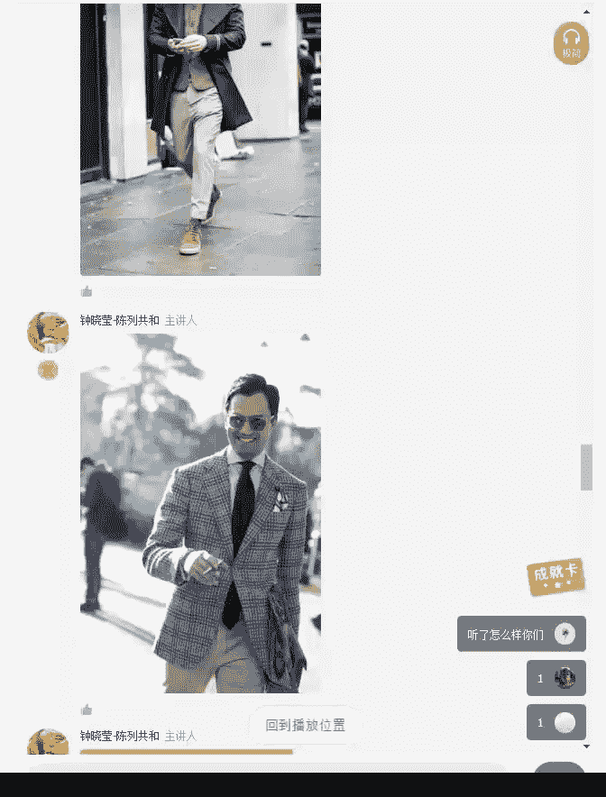

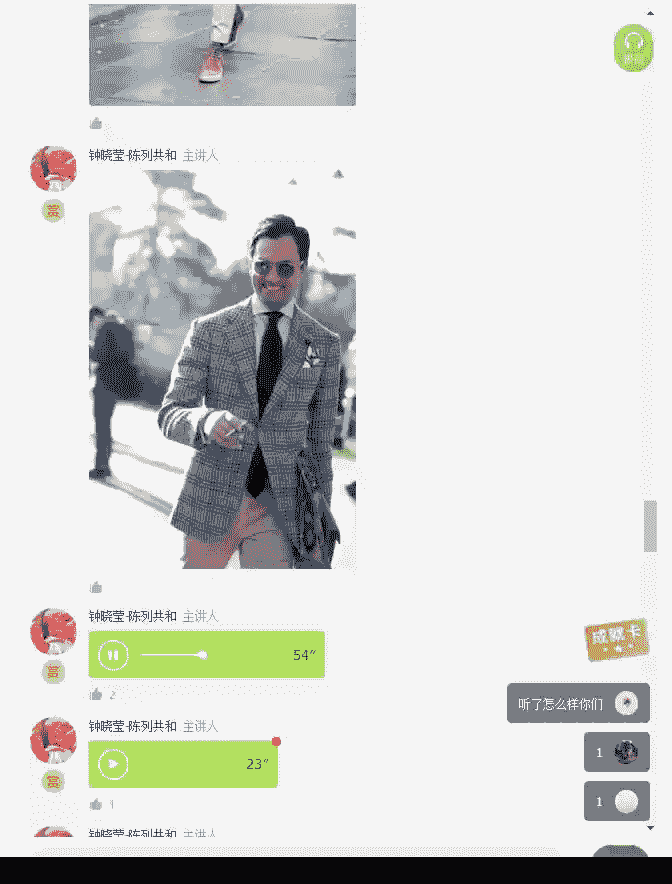

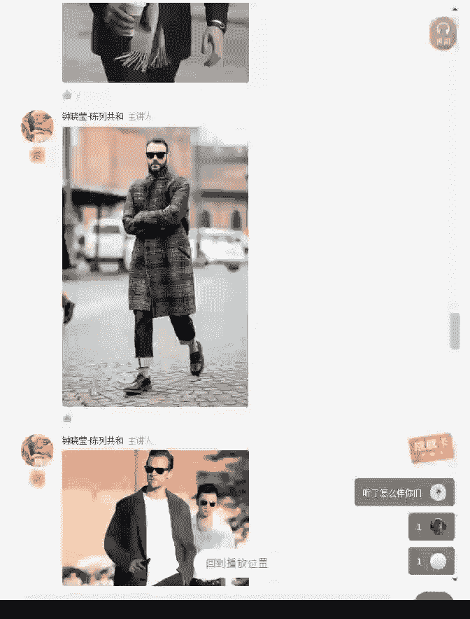

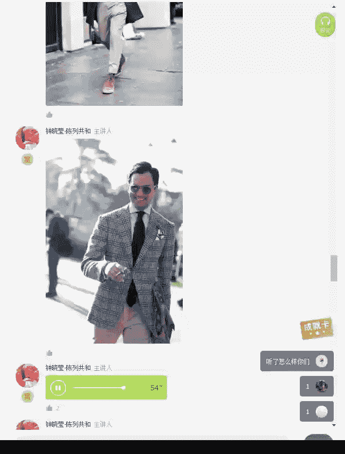

都不是那种过于偏激的时尚感。这就是我们刚刚说到的钢领2，穿着上要有些许的时尚感和创意性细节。创意性细节可以表达在领巾、带襟、袖扣、衬衣的袖扣，比如说闷骚的袜子，还有一顶非常好看的帽子。

还有一个一双非常非常有质感的鞋子，然后包括手表等等。

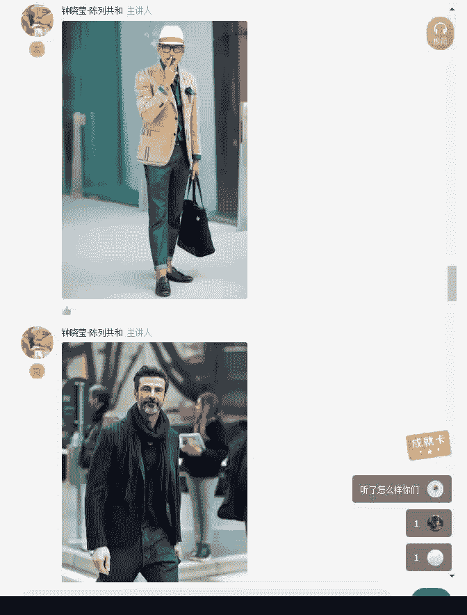

好，那么我们现在讲到的是钢领三。纲领三就是你的个人习惯以及你的个人爱好，还有就是你的穿着上面必须拥有精英元素。

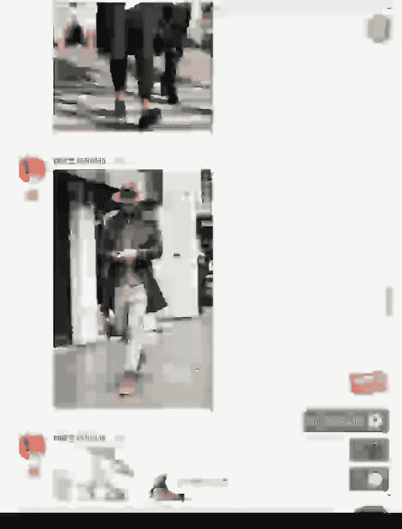

我们都知道，运动服一定是比西服套装更方便动作的。但是为什么很多好莱坞的动作片里面，比如说007啊、王牌特工啊、瞒天过海啊，这里面的男主角他都会穿很合体的西服去追逐打斗呢？很明显，穿运动服打。

你们是不会买票去看的，为什么？因为一点都。不酷炫，也不也不够男神。所以导演呢包括视觉总监呢，美术美术指导的希望靠这样子的穿着来表达出主角的这种精英性。而这种精英性就能够让主角有特定阶层的一个分层。

而这种特质是大部分男性所不必不具备的。这里面就能够体现出这个呃我们常说的这个孔雀理论里面所提到的这种高价值的属性。女性会通过某一些外形的特征来选择出资源丰富的精英男性来交往。如果你有兴趣的话。

我特别推荐你看一本书叫做精子战争。所以我。

简单的把精英元素理解为服饰的质地和裁剪，比款型更重要。发型的干净利落，比造型更重要。时髦值有很多时候比舒适保暖更重要。比如说你说因为冷，所以你就像裹珍粽一样的穿，然后裤脚很长，然后袜子也很邋遢。

然后甚至有时候去吃榻榻米，去日本料理店吃饭的时候，你把袜子一脱。哎呀，那个味啊，还有包括那个袜子起球啊等等，都会让你很尴尬。所以永远记住，无论是男人还是女人，你都得经得起脱，我所说的这个脱是什么脱呢？

你们自己脑补哦。

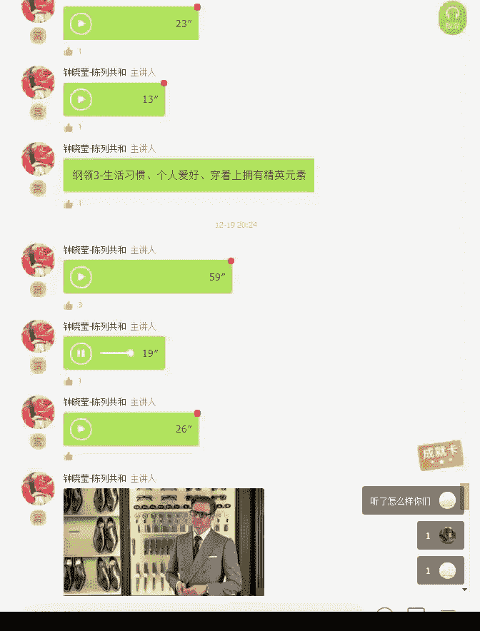

大家看到了吗？这就是精英的装束。永远记住，所谓的精英装束，就是服装的质地和裁剪比款式还要重要。

发型干净利落，比造型更重要，你别把你的头发搞得跟，人家一看，你就以为你是发型师。好，时髦有很多时候真的在重要的场合还是真的比舒适和保暖重要。你可以穿保暖内衣在里面，但是你不能把它露出来。

好吧，那接下来我们要讲到的就是纲领四了，这个也是非常重要，而且也是需要持续的。那么就是培养个人的美感。那怎么培养个人美感呢？首先第一看电影。第二。看杂志。第三，多旅行。第四，多看展览。

美感和时尚感这种东西绝对不是一下子就有的，它是慢慢的培养和累积出来的，而且它是一个非常重要的生活习惯的培养。所以我建议大家长期去呃看电影，一定要去看一些电影，特别是看一些精英电影。

比如说leonardo有很多的电影都值得大家去看。然后大家在里面一直都在表达很多它的精英元素。然后另外呢就是我特别推荐大家去定一些杂志，比如说GQ啊，时尚先生啊，这些杂志，他会告诉你很多相关的知识。

永远记住，有很多时候时尚并不代表等于时尚不等于古怪，我们相对比较提倡说在细节当中去表达一些时尚和创意。比如说独特的袖扣啊，呃，别针啊、口袋的方巾啊等等。我不建议大家去染黄发，染绿发啊。

应该男人不会染绿发的啊，染一些灰呃一些一些特别奇怪的一些颜色，不要，为什么？因为这个不符合大众审美。我们要讲的，我的课程里面一直在提倡的就是大众审美，大众审美，而不是小众审美。

比如说我们刚刚讲到的培养个人美感的第一个看电影。第二个看杂志。第三个看展览，第四个是旅行。那我把展览和旅行的这个顺序调换了一下。因为旅行是一个呃可能相对来说较远的一个旅途哈。

比如说可能我们一年可能会去两个地方旅行或者一个地方旅行，所以可能不够频繁。那代替我们旅行最好的方式就是看电影。因为你看电影真的可以一口气，你可以一天可以看好几个地方的电影，那这个时候你就去了印度。

去了法国，去了意大利，去了英国，去俄罗斯，对吧？等等。所以看展览也是一个非常好的手段。其实有很多时候永远记住。不要不要说老师，我看不懂这个展览，我就不去看了。其实有时候展览不是追求懂。

而是那种感觉你去到那里，你去到那个场合，磁场，它就会带给你很多的东西。人的美感就是这样子一点一滴的培养起来的。所以不要急功近利，不要想着我一付出就要获得。这样的话。

你根本不可能成为一个内外兼修的男人或者女人。好了，那么我们就来最后再讲讲外在的体现。我们刚刚所讲的是纲领。那我们现在来讲讲一些术的方面。那到底我们这些内在的培养以及这种外在的纲领，表达在哪一些方面呢？

那直接就表达在我们的人的外形上面。那我们外形里面呢，我会把它分为三个部分。第一个是头部，第二个是身体，第三个就是覆盖在身体外面的服装，你永远记住为什么会分出一个身体呢？因为我待会会讲到，我们要做健身。

我们要做身体保养，我们要去排除和解决我们身上的体位，我们要把体位变成体香。而且还有一个最重要的就是身体是决定了你穿衣服好不好看的一个重要关键因素。那么头身服，这就是我们男人外在表达的三个重要的方面。

而我们这堂课接下来所有的课程里面好像发现都是在讲头和服装啊。身体的保养。我们在这堂课当中是不会讲到的，需要靠自己去培养这种个人的健身习惯啊，培养个人的良好的这种生活习惯去养成。

那么我们先来想到头头指的就是你的发型，记住了，50%，男人的50%的性感都在于发型上面，不同的发型可以直接区分屌丝突鳖和高富帅。

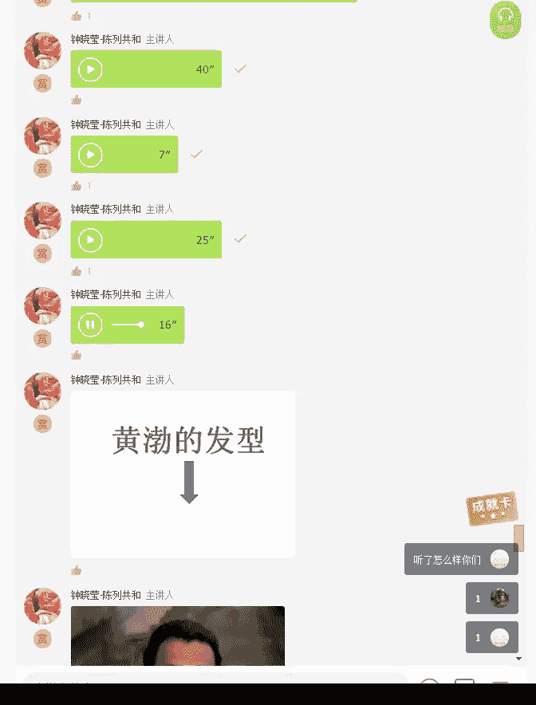

大家看到王博了吗？这就是一个发型，对于男人的这个糟蹋哈是加分还是减分？其实发型非常关键，永远记住，干净利落，比造型更重要，脏兮兮的头发是不会被女性认可的。其实男性也不喜欢头发脏兮兮的女性。😊。

所以在这里面发型我给大家一个普世的原则啊，前不遮尾。后不盖领三周一剪，三周就要剪一次了。我的头发通常是两周就剪一次，因为我本人是短发。我曾经记过日本的一个生活美学家松普尼太郎逊先生说过。

他说一定不要等头发长了再剪，头发一定是在没有长之前就要剪的。好了，接下来我们就讲到头发的保养啊，头发的保养也很关键的，大家知道吗？第一次洗头一般都要打两次肥皂，呃，两次洗头水，第一次是清洁。

第二次是保养。当然你还要持续去做一些护发。头发对于男人来说还是很重要的啊，头发呃往发际线往后走一点，你的年龄可能就会老很多。所以，保养头发跟保护肾是一样的重要。那接下来我们讲到的第二个部分就是深。

身这里面我们讲到的是健身，你要持续健身。好身材跟差身材的差别，穿衣服是完全不同的。第二个就是你的身材身体要保养，也就是你代表了你要定期体检，一年至少要体检一次。还有就是你去测一下你的体脂肪。

如果你的体脂肪含量很高的话，那你们一定要去减肥了。记住，减肥不是减重，减肥是减掉你体内的那些脂肪。可能很多年纪轻轻的男士，因为应酬，因为吃喝，可能很多时候都有脂肪肝了。

所以这个时候你更需要注重你身体的保养，所有的好的外在都是有好的内在来显现出来的。那第三个就是体胃，清楚你的体胃，一定要学习用虚后水、古龙水以及就是腋窝下面的这个体液，体液应该叫做体液剂吧。

就是你查完之后，你就算出汗，它味道也不会很大。应该叫做止汗露。止汗露。大家看到这三个男人吗？一个是彭雨晏，以前是一个胖子，你看胖的轮廓都没有。你像在像彭雨晏的身材啊，第三第二个就是onardo哈。

第三个就是我们的杜海涛。

所以胖能让你的年龄增加10岁以上，瘦能让你的年龄减少15岁以上。好了，那么我们最后讲到的是服服就是指的服装。在这里面我给大家三个原则。原则。就是。搭配不要超过三色，原则2，身上的亮点不可多于两个。

原则3，以基础款为主，少买流行款。当然服装这里面我们首先刚刚讲到的是一个穿着搭配。那我们还会涉及到服装的保养啊，包括衣橱的分类收纳呀，这个都是非常关键的。特别是职场男性，你的衣橱的分类和收纳严重。

严重影响了你上班的效率，以及你个人的形象的好与坏。那在这里面，因为我们第一堂课其实只是简单的给大家做一些示范啊，只讲类别啊，不讲一些细节。所以在这里面我们刚刚讲到的这个穿搭的搭配里面有三个原则。

第一个原则是不超过三色。因为大众审美当中男士如果超过三色，那就一定会不好。不好不好驾驭，为什么？第一会受制于身材，你的身高，你的体型等等。还有包括你的场合。第二个就是你原则性的这个原则二。

就是你身上亮点不可以多扣两个。比如说你的又是手表，又是手链，又是耳环，又是项链，这个元素就太多，你的亮点太多，永远记住你的亮点只有两个。比如说鞋子手表，甚至是亮点可能都是呼应的。

比如说我们刚刚看到那个戴帽子的男士，它的帽子就跟它的鞋子是呼应的。好，第三个原则就是以基础款为主，少买流行款。那什么叫做基础款呢？我们以秋冬基础款为示范作为讲解。

好了，在这里面大家可以看到纯色的套头V领衬针织衫。两粒扣的修身西服外套，纯色或者细格的修身衬衫。修身的原色牛仔裤，记住不要穿快阔宽大的牛仔裤。呢子大衣没有logo的好质感的皮鞋。

比如说乐福鞋、切尔西靴靴或者布洛克。好，还有配饰，配饰里面就包括围巾表、皮带、领带或者领结或者领巾，或者是口袋巾，还有墨镜。

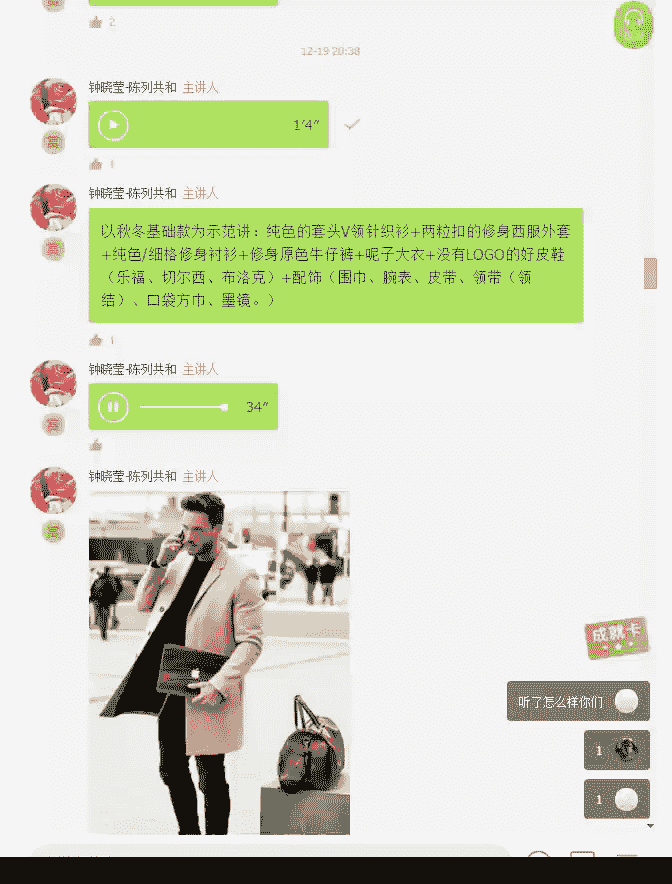

大家现在看到的全部都是一些基础款的穿搭的一些示范。当然了，在接下来的课程当中，我也会给大家讲解很多。比如说我们专门有一些基础款的搭配等等这些。

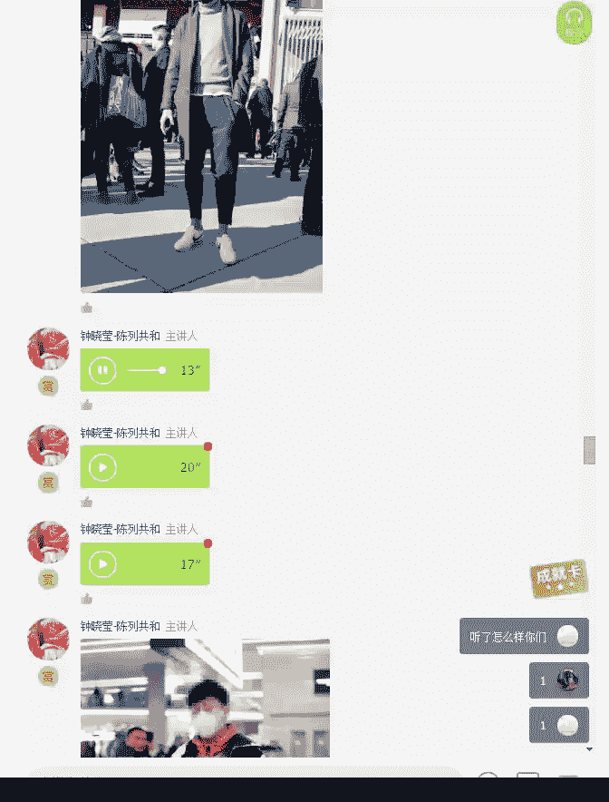

所以今天在这里面我们只给大家介绍一些类别，我们就不再展开了。包括接下来我们的搭配呀，比如说我们里面一定会所谓的搭配，就是内外上下的呼应。所以呢我们一定会讲到配饰，讲到鞋子，讲到外套。

讲到一些基础款的一些内搭。接下来给大家看到几张返利的照片，然后大家看完之后可能会有一些想法就是。我们是希望自己变成什么样的一种男人呢？完全在于我们个人的选择。我们是想成为屌丝，还是成为男神。

完全取决于我们怎么样去思考和怎么样去进修自己的衣品。

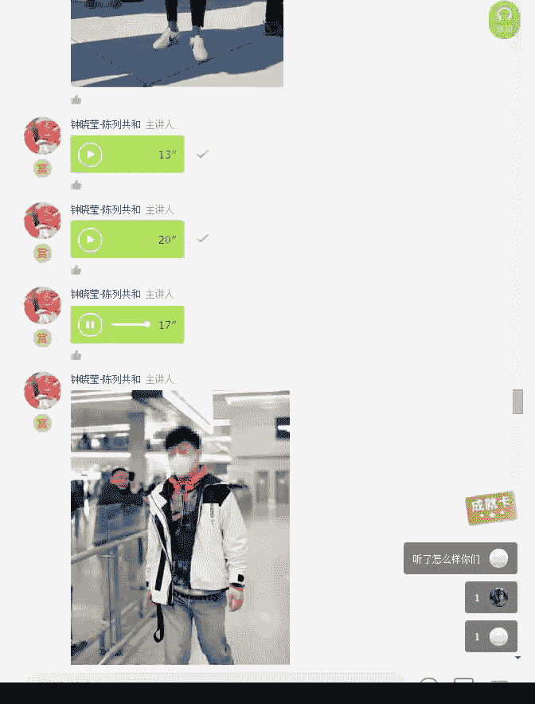

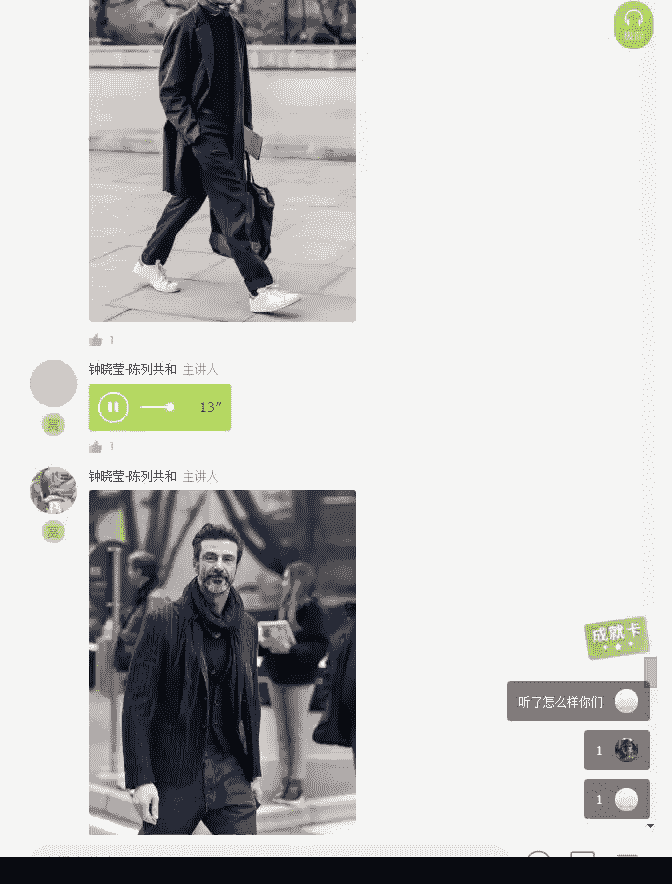

所以特别期待在接下来的课程当中，能够给到大家更多的供养和更多的搭配的一些想法和建议，好吗？希望我们共同来为全新的自己打造出更好的形象。

好了，今天所有的课程内容我们就讲到这里。最后我想跟大家讲，还是引用王尔德先生的一句话，他是这么说的，他说，爱自己是终身浪漫的开始，希望每个男人和每个女人都找到自己的终身浪漫。

无论是男人还是女人，其实爱自己都是最关键的。

最后送给大家这一这一盆特别具有阳刚气的插花艺术作品。

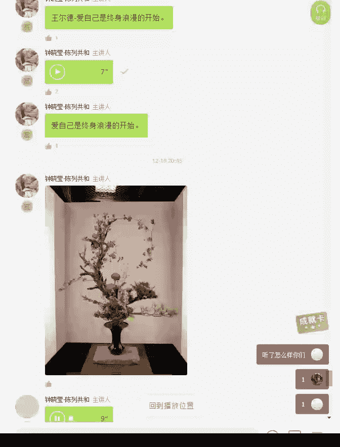

谢谢熊熊给我的打赏，还有谢谢欧阳刚刚给我的打赏，谢谢你们。好吧，在这里面我会留。5分钟的时间跟大家来互动，做一些问题的回答。谢谢康有为。我每次念你这个名字的时候，我都想起那个古时候的康有为。

谢谢有为的打赏，谢谢大红包5啊，谢谢你。😊，我们明天还是7点半的，我们明天不见不散。

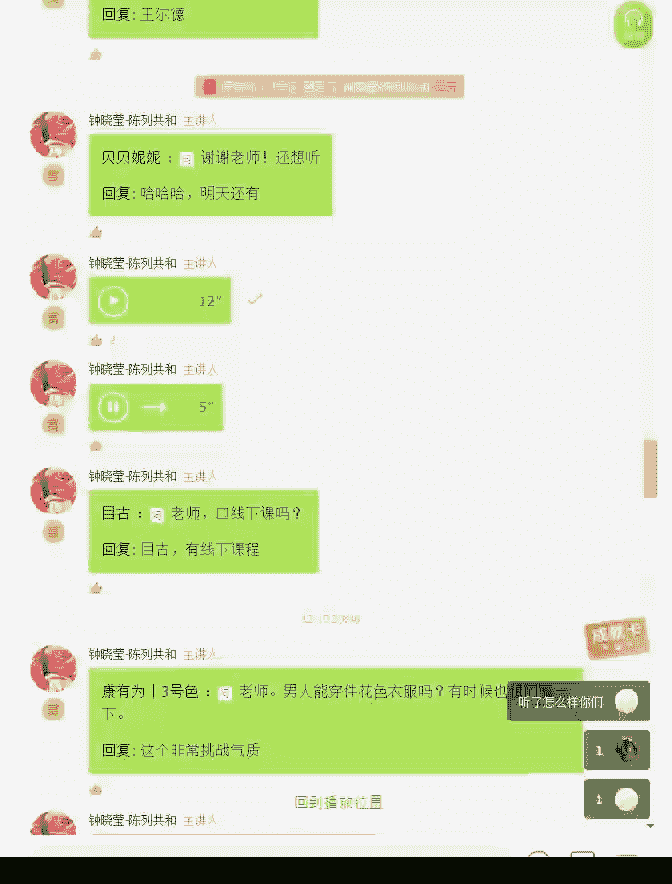

好了，那我们今天就到这里吧，大家晚安，把时间交给主持人。我们明天晚上7点半不见不散。老地方，我们明天晚上见哦，祝大家晚安，做个好梦。

最后给大家看一个移动的这个弹幕，李健先生的一个笑话。

好了，第二次跟大家说晚安，明天晚上见。

嗯。好的，谢谢钟老师的精彩分享，也谢谢各位小伙伴们一直守候到现在。那今天的课程内容呢，我也做了一个简单的笔记。然后现在我发上来跟大家分享一下。

呃，在这里再次跟各位小伙伴们强调一下，就是入群的，还没有入群的小伙伴，然后扫描我们的二维码，加入我们男士搭配的交流群。嗯，我们的大师兄会经常做干货的分享。然后群也是我们通知事项的一个重要的途径。

所以大家还没有加入的，一定要现在就加入进来。

嗯，那这里再次跟大家强调一下，然后明天晚上我们第二节课依然是在千聊直播间晚上7点半，以及我们第三节课在本周四的晚上7点半开课，大家千万不要错过哦。

嗯。嗯，最后呢还有一个小事情，就是拜托嗯大家就是帮我们一个忙。然后待会儿课程结束以后，然后点击我发上来的链接进去，给我们这一节课一个中肯客观的评价。然后我们会在你们评价的基础上做出更好的改善和服务。

谢谢大家。

好啦，那今天的课程我们就到此为止了。如果有小伙伴还有问题的话，也可以加我们呃大师兄的微信，然后向大师兄咨询所有关于课程的事情。

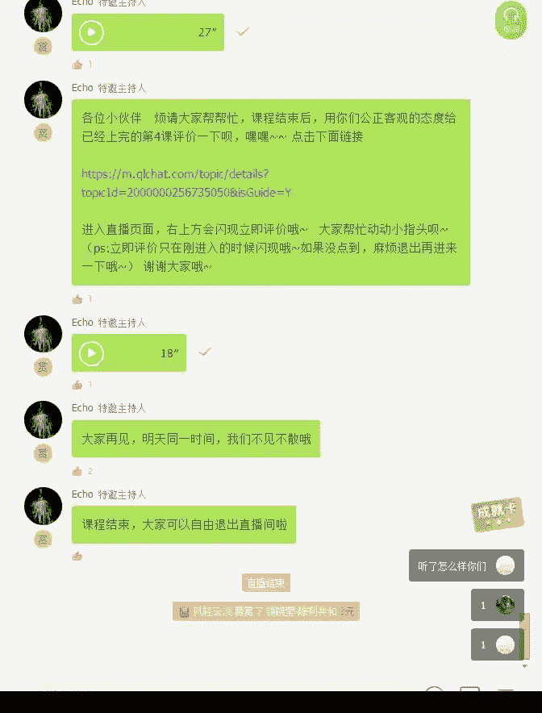