# 1、16男士衣品速成穿搭指南(完结）：第2课：找到自己肤色的适用色与禁忌色（一）：第2课：找到自己肤色的适用色与禁忌色（一）

好了，我来了，我是钟小莹，我来了我来啦，等级了吧，大家晚上好。我是成为共和的钟小英，很高兴在今天晚上我们接着昨天的话题继续聊下去。男士如何提升自己的衣品？我刚刚看到在群里有同学说，哇塞。

一下就换到第八天后哎。发现了小秘密了。其实呢在这个系列课里面呢，我刚开始呢我在设计这个课程的时候，我是想说先从单品开始讲吧。那今天我突然间在在看这个课程的这个脉络的时候，我想说。我想先从肤色开始讲。

因为讲完肤色之后，大家才会知道哪些颜色是我们真的不能碰的，哪些颜色是我们可以去碰的那这样的话，接下来我讲基本款的时候，那么大家就可以去慢慢去补足，去补足自己的这个呃基本款的衣服，但是在补竹的过程当中。

肯定会涉及到一些颜色的区分。那么我就选择了跟我的团队沟通，说，我今天和明天晚上先把色彩的部分先讲完。不晓得现在大家理解了吗？我这样解释，你们能够听得清楚吗？可以理解吗？

大家现在看到的是一些大自然里面的颜色，因为发现大自然里面的颜色是非常非常丰富的。虽然我们今天要讲的不是一堂色彩课，我们今天要讲的是教会我们所有的男同胞们和女同胞们如何去分辨男士的肤色。

从而帮助他们选到更适合和更能够。让他们更出彩更有精神的服装的颜色。这个课程有两讲，因为讲色彩呢。它比较抽象，需要我们有非常多的这种想象力，才能够去理解这个色彩所呃所区分的这个小小的这种差距在哪里。

因为每个色彩都有它比较独特的特点。我曾经说过一句话，我说这个世界上没有不好看的色彩，只有不好看的搭配。如果想要搭配出色的话，最重要的是要多训练，多搭配，不要害怕犯错。因为毕竟色彩搭配其实是没有对错的。

它只有合适与否，是否适合这个场合是否适合你的身份，是否适合当下的这个季节。所以希望这两天的晚上的课程能够帮助到大家去梳理我们的肤色，以及梳理我们衣橱里面的衣服。今天晚上的课程听完之后。

你们就可以去到你们的衣橱里面，打开衣柜，把自己属于暖色的衣服挑出来。其实男士的肤色，我只会给大家分到冷暖，不会分到特别的细。其实男士穿衣服大部分时候你会发现其实都是偏向于中性的颜色的那什么叫中性颜色呢？

无非就是黑灰白蓝，对吗？很少可能有偶尔的时候会出现一些，比如说红啊，或者出现一些黄的颜色，但是其实也是不多见的，比如说我现在发上来的这个红色的格子啊，或者是这种驼色的偏姜黄色的上衣外套啊。

又或者是这种红色的毛衣搭这种咖。色系卡其色系的外套啊，这都是我们男士在生活过程当中常见的一种搭配。所以它不像女士那么的多元化。你比如说女生穿衣服，颜色它可以很缤纷很多彩。所以常常会有朋友说，哎呀。

其实男人真的是一看她的衣橱都觉得好闷，好无聊。但是话又说回来，你会发现其实越是这样子，你会发现搭配的时候效率就越高。它比女生搭配的时候效率都高很多。所以任何事情都要两面来看。

当我们去看到女生的这种衣橱的时候，我们觉得哇好丰富啊。但是我们看到男士的衣橱的时候，其实有时候我还是蛮羡慕，我蛮羡慕我身边的这些男士男士呃朋友们的衣橱，包括我家里的先生的衣橱。因为他们衣橱真的很极简。

黑白灰蓝没了，你再怎么搭，你会发现男人出差很方便。但是不像我们女人，我们女人一出差，你会发现哇，真的是一个大箱子才能够搞完全部。所以如同于色彩一样，你会发现我们人的肤色也是会分冷色和暖色的。

那么我们普罗大众如何快速的去学会色彩的搭配呢？其实首先第一个仙人的条件就是你得思考你适合哪些颜色。我们现在给大家看到的这个色相环，大家可以看得到上半部分是属于暖色区，而下半部分属于冷色区。

那么我们现在先来学习一下，分商品，也就分服装的冷暖色。接下来我们再告诉大家去分辨人的皮肤的冷暖色。因为毕竟是在线上不像像线下那么的直接。我们可以直接看到每个人的肤色。所以在线上去讲肤色的课。

其实是有蛮大的难度的。所以呢没有关系，我们待会也会告诉大家一些检测的小诀窍。你们按照这个诀窍去选就可以了。因为毕竟男士你很少会穿到大红大黄大绿这种衣服，对吗？所以对于色彩，男士也不用太恐惧啊。

因为色彩对于服装搭配来说很简单，对于男士来说，无非就是不要超过三色原则。有时候如果想显高，可能就选择一色或者两色就足够了。

我们现在看到的这件外套就是非常非常。绝对的暖色系。因为我希望大家能够理解，所以我会用比较极端的颜色来告诉大家。那比如说现在黑人兄弟这个非常著名的美国眼帝哈，华盛顿他的身上所穿的这件衣服。

就是我们常说的冷色，也就是蓝色了。所以冷色和蓝冷色和暖色，其实在每个颜色里面都会有的。比如说赤橙红绿青蓝紫，它有冷有暖。如果你想要去更深入的学习，其实你可以去听马上学会女装色彩里面。

你就可以更直接的去分到冷暖的很多的赤橙红绿青蓝紫的颜色了。但是在这里面我们就不展开去讲了。因为毕竟男装用色是很少的，很少会用到特别过度鲜艳的颜色，除非是一些流行装。

所以呢我在这里面会给大家一些比较极端的和比较突出的，比较容易让大家认出色彩感的这样的色彩的示范。

这就是我们现在看到的一个冷色，一个什么暖色。那我们再接下来再给大家来看一个色彩，它的冷暖。

大家看到了吗？这就是夏雨，夏雨穿的这两件颜色都是暖色。待会儿我们讲肤色的时候，你就发现夏雨属于是那种偏黄的肤色，他穿这种颜色感觉好像跟他自己的肤色是完全区分不开来的。甚至某种程度上。

我认为下雨其实是偏暗的肤色的，所以呢它穿暖色其实看上去是不好看的。

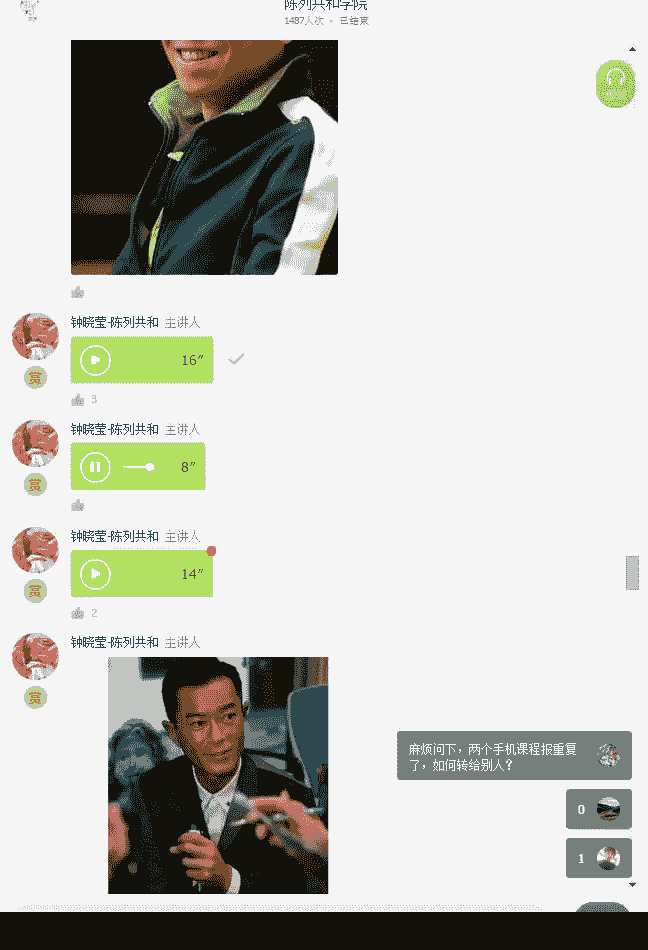

那么我们现在接下来要讲的就是我们的肤色也有冷暖，那我们怎么样去分辨呢？我们怎么样去分辨我们的肤色是冷色调还是暖色调呢？给大家几个方法。

我想问一下大家。古天乐的肤色怎么样？是不是感觉他的肤色是属于偏黑型的肤色？

你再来看这个这个男士男星，我不知道是日本人还是中国人。你看到他的整体的肤色，是不是感觉到他的肤色是偏什么偏白的肤色。那还有第三种肤色是什么？肤色呢？就是这个偏黄的肤色，偏白偏黑和偏黄。

那当然还有一种肤色，这种肤色叫做中性色。什么叫中性色呢？就是他看上去不白也不黑也不黄，也就代表了他的肤色的匀整度是非常的高的。比如说像吴秀波，他就属于这种中性肤色。

所以你会发现其实他穿很多颜色的衣服都是不错的。好，那也就代表了我们在男性的肤色当中，我们会分为冷色偏黑的肤色，暖色偏黄的肤色，中性色就是偏白的肤色。那到底我们怎么样去检测自己是冷的还是暖的呢？

有两个方法。第一个方法最直接的就是去选择两件衣服，一件是暖色的，一件是冷色的。比如说你可以穿上一件黄色的衣服和穿上一件蓝色的衣服，然后你来对比，看哪个颜色让你的眼睛看起来更炯炯有神，你的轮廓看起来更好。

然后线条更清晰，然后整个人看上去没有憔悴和疲惫感，哪个颜色让你的黑眼圈不明显，哪个颜色让你的雀斑或者你的痘斑，或者让你的整个人的气场都显得特别的爽朗。那么这个颜色就是适合你的。

所以无论因为我现在看不到大家的肤色啊。但是大部分的中国男性相对来说，因为我们是黄种人，那一定是有黄色的底色的。但是我们大家会。发现在我们的生活当中会发现有好几种男士啊，好好几种肤色的男士。

其中有一种肤色的男士就是偏白的。而偏白肤色的男士有一个特点，他跟偏黑肤色的男士，也就是暖冷色肤色的男士不太一样。偏暖色肤色的男士呢，如果他有胡子，他留胡子，他今天晚上如果不剃胡子。

明天早上起来也不剃胡子，你就会发现第二天你看到他的时候，他是憔悴的。但是如果是偏冷肤色，也就是偏黑的，像古天乐这种啊，这种肤色的人，那像华盛顿这种肤色，像奥巴马这种肤色，你基本上是看不出来他的胡子的。

为什么？因为他的胡子虚根的颜色跟他的皮肤是非常接近的。这也是一个非常重要的判断标准。第一种方法就是用冷暖色的肤衣服来去判断。第二种方法就是看他留胡子是显脏还是显得精神。大家去回想一下陈道明。

陈道明就是一个偏冷色肤色的。所以你会发现陈道明在穿衣服的时候，只要他碰到暖色系，就会显得很怂。这个人显得没有气场，然后显得也不够干练。但是呢如果这个人是偏暖色肤色，呃，比如说像何炅这种。

他就很少能穿到特别冷的冷峻的颜色，他可能就要穿一些。比如说卡其啊啊嗯呃橄榄呃呃墨呃比如说嫩绿啊，嫩黄啊这种颜色就会显得他特别的年轻一些。好，那接下来分辨自己的肤色的方法。三呢。

最简单的就是你去分别找两条金项链啊，你家太太的也行，你自己的行，一条是金色，一条是银色，戴上去，你看看哪一个项链在你的脖子上，让你的整个就是你让这个项链发光。比如说有些人戴金，一戴上去。

你就感觉这金是假的，乌污的，甚至会变成磨砂金的感觉，那也就代表这人的肤色是不适合的。你们试想一下古天乐戴金项链，会不会感觉好像镀为一层灰一样的。对，但是你去你去想一下，比如说像吴秀波播这种中性肤色。

他就可以戴金和银都可以。甚至有些偏白的男星，嗯，比如说像陈宝国这种，他就一定可以戴到金色的项链。那么我们再再给大家总结一下怎么去分辨自己的肤色呢？方法一就是选择暖色的衣服。

比如说黄色和蓝色的冷色的衣服来做对比，看哪一个颜色，让你的皮肤质感显得更好，让你的轮廓让你自己显得更瘦，更精神。好，第二个方法就是是就是我们刚刚说到的，看他的虚根啊，如果是暖色肤色的男生。

他第二天如果没有剃胡子的话，一定会显得很憔悴。而且虚根很明显。那如果是冷色肤色的男士呢，他是不会的。比如说我们公司有个同事就绝对不会他留多长的胡子，你都不感觉到他脏。但是暖色肤色就会感觉到他脏。

那第三个方法就是用金色项链和银色项链来判断。金代表了暖色肤色，如果你适合戴金项链，代表了你是暖色肤色，如果你适合戴银色项链代表了你是冷色肤色。我们这堂课呢其实主要是以使用为主。

因为每个同学在这里面听完之后，你们都不是去做专业的老师的，你也不是去做专业的搭配式的。其实我们大部大部分比例的同学在这里面还是希望学到一些让自己一听就懂，一懂就能用的这种方法。

所以在这里面我会把肤色简化为三种，一个是偏暖的偏偏暖的肤色，也就是偏黄的，一个是偏暖的肤色，也就是偏黑的，一个是中性肤色，把这个肤色分为三种给大家。这样大家就比较好理解了。

我们现在看到的这两位男神都是偏冷的肤色，也就是偏暗的肤色。呃，这样的肤色比较适合什么和不适合什么。我们现在就给大家去看这堂课主要目标就是让大家自我去分辨自己的肤色。

这就是我们这堂课最重要get到的一个点，大家一定记住，在学习的时候，我们不要去探求这个量，为什么呢？因为有很多时候我们学再多的知识，如果我们不能去用它，那所有的知识都是白搭的，都没有用的。

所以知识不是力量，运用知识才是力量。在这里面偏深的肤色，也就是冷色肤色，它比较适合黑白，它适合黑白分明的这种搭配方式。

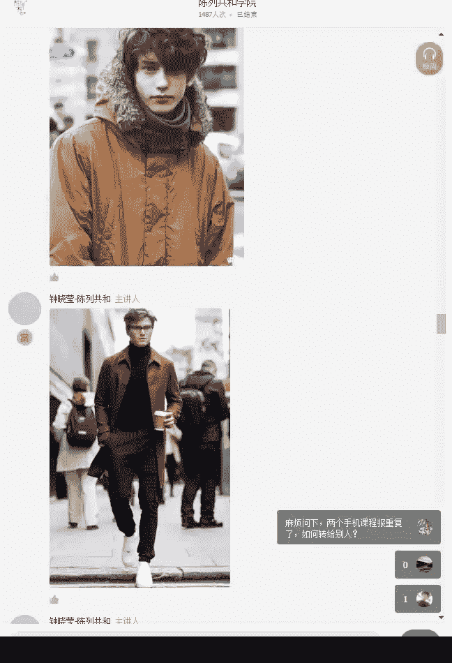

同时第二个它适合偏浅蓝的颜色，但是它不适合什么宝蓝色。你看他穿上宝蓝色之后，你就会发现他的皮肤变得又黑又黄。为什么？因为这两个颜这个宝蓝色会让他的皮肤变得完全没有质感和光泽，会将他的皮肤衬托的更黑。

当然同时他们还要避免什么黄色，就是我们现在所看到的这种，同时他还要避免什么绿色。你像这种都是非常需要去避免的。

其实你永远记住一点，就是。男士如果你的皮肤是偏冷的那你大胆的去穿黑白灰、牛仔蓝、天空蓝这种颜色都没有关系。哪怕来一些比较骚气的颜色，比如说紫色都是可以的。但是你一定不要去碰黄。

也不要去碰这种什么砖红色啊，也不要去碰这种咖啡色，比如说像这种颜色啊，像这种颜色啊都不要去碰，为什么呢？因为它会让你的肤色变得更暗，让你的肤色变得很脏。

然后包括今年的这种特别流行的这种焦糖色，都是不适合它的。但是这种焦糖色又非常适合那种中性肤色和暖肤色的人，为什么？因为这个颜色跟他们的皮肤更加的接近。偏黄的肤色，我们接下来要讲到的是偏黄的肤色。

它们又适合什么样的颜色呢？那记住哦，我们现在所讲的全部都是靠近脸部的服装的颜色，而不是什么靠下裤子以下的这些颜色。我们刚刚说了偏黑的肤色比较适合什么？比较适合的是。灰。黑白海军蓝啊，这种比较中性的颜色。

那我们接下来要讲到的偏黄的肤色呢，它一定适合的颜色就是浅色和柔色蓝色系里面的颜色，比如说棕灰色啊、浅灰色啊、红色啊，或者是一些更暖的蓝色。

我们现在给大家看到的这些都是老外的肤色，而老外的肤色跟我们中国人的肤色是不太一样。因为他们大部分都是白种人，要么有一些是棕色人种，而我们是黄种人，黄种人的底色一定是有黄基调的色彩在里面的。

所以呢我们在穿衣服的时候，偏黄的肤色呢，其实黑白灰，你照样可以穿的。因为男士的肤色，它不像女士那么的分辨的那么明显，但是我们一定要区分有暖红和冷红，比如说冷红就是玫瑰红啊，然后酒红啊。

而暖红就是什么砖红啊，橘红啊这种。今天我这边的网络呢有点卡哈，所以大家在听课的时候可能会有一些断。但是大家不用着急，因为什么？因为其实呃如果它断了的话，你可以等几等一下下，然后待会呢它就会连在一起了。

好吗？很抱歉。

在中国，仿佛再宽的光纤。具体操作起来好像都不得劲。

像我们现在看到的这个就属于完全非常纯正的什么暖色系了。而这个暖色系它一定是适合什么嗯暖色肤色的人，而不是冷色肤色的人。你们试想一下，古天乐穿这个一定是很难看的。包括我们现在发上来的这种驼色。

它都是适合暖色系的。

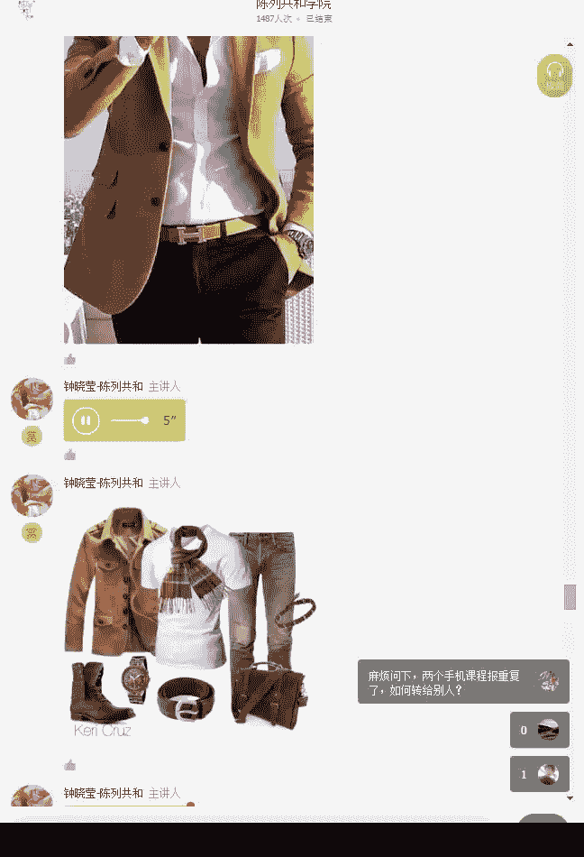

其实有很多时候我们发现有一些男士他穿这种类型的驼色是非常干净的。但是如果是冷色肤色的人，穿这个就会显得非常的脏。

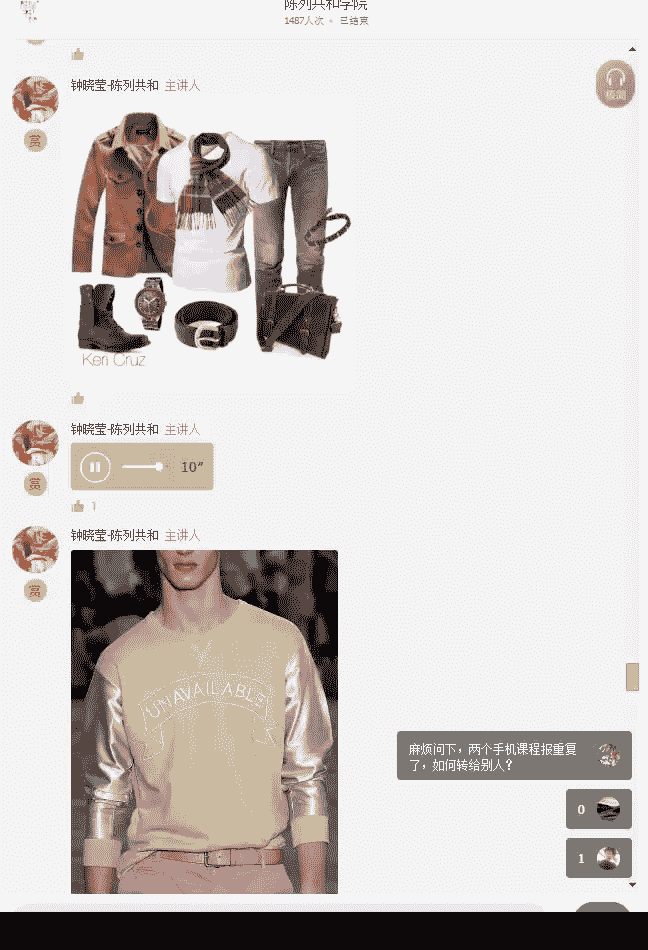

所以在这里面其实很好分辨。我建议中性肤色你随便穿没有关系，为什么？因为你肤色不会有特别大的这种倾向性。如果你的肤色真的很黑，那我真的建议你千万不就要不要去碰咖啡驼卡呃呃呃比如说姜黄呃，橙色呃，包括。

翠绿或粉绿这种颜色，包括粉红都不要去碰，为什么呢？因为它会让你的整体的肤色显得非常的暗。比如说像这种粉红，黑色肤色的人穿也是不好看，但是暖色肤色的人是可以去尝试的。

比如说马上就要到圣诞节了，马上就要到元旦和新年了。其实如果是暖色肤色的男人，是可以这样去套穿的，不用大面积的去裸露这种偏暖的格子衬衣，你可以在外面覆盖一件这种卡其色的粗棒针织的毛衣，也是非常有调性的。

非常有品味。同时你在下半身可以搭配一条什么牛仔裤，就很有味道了。

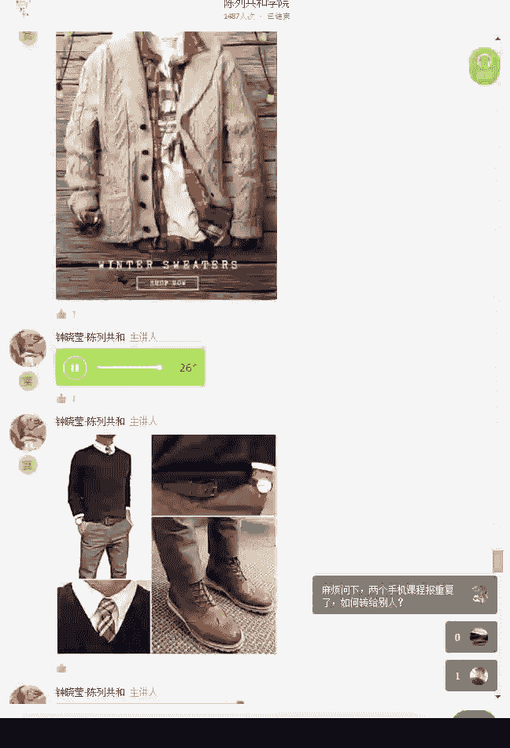

比如说像这个蓝就很适合暖色肤色的男人，为什么？因为他这个属于腐蓝，属于暖色。所以大家有没有看到他的手表以及他的皮带，还有他的鞋子互相之间是有呼应的。还有一个非常关键的细节。

有没有发现西方男人他的裤脚都偏短，而我们东方男士裤脚都偏长。我常常说你们的裤脚剪下来都可以当都可以做成一条内裤了，为什么呢？因为真的裤脚太长了。所以如果你想的更高挑，想的更利落和更整洁的时候。

我真的是建议大家去把裤脚改得更短一些。比如说像这个男人身上所穿的这条裤子的感觉就很合适。

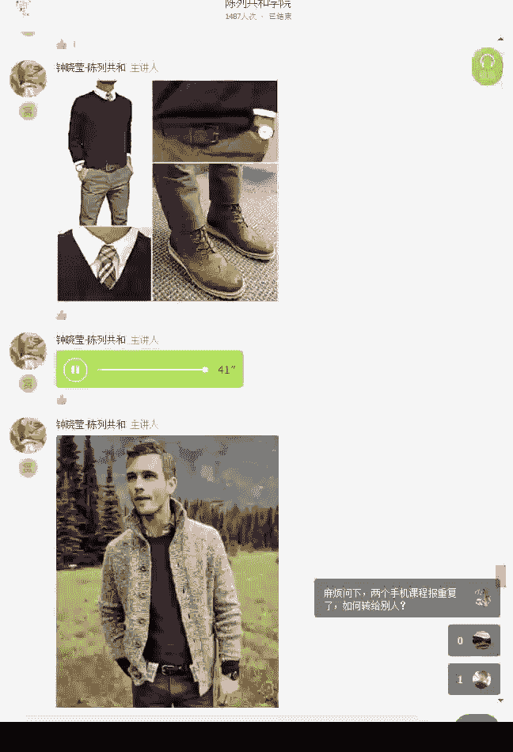

又或者暖色肤色的人可以这样穿一圈整身的大地色系。其实男人穿衣服很简单，我发上来的这些图，你们如果觉得自己目测自己是暖色的，你就把暖色的图存下来。到时候去服装店里面去找到这些衣服来测试。

如果你认为自己是冷色的，那你就把冷色的图存下来，同样也去服装店里面去找到这些衣服测试，甚至今天晚上你们就可以去完成这个测试了。

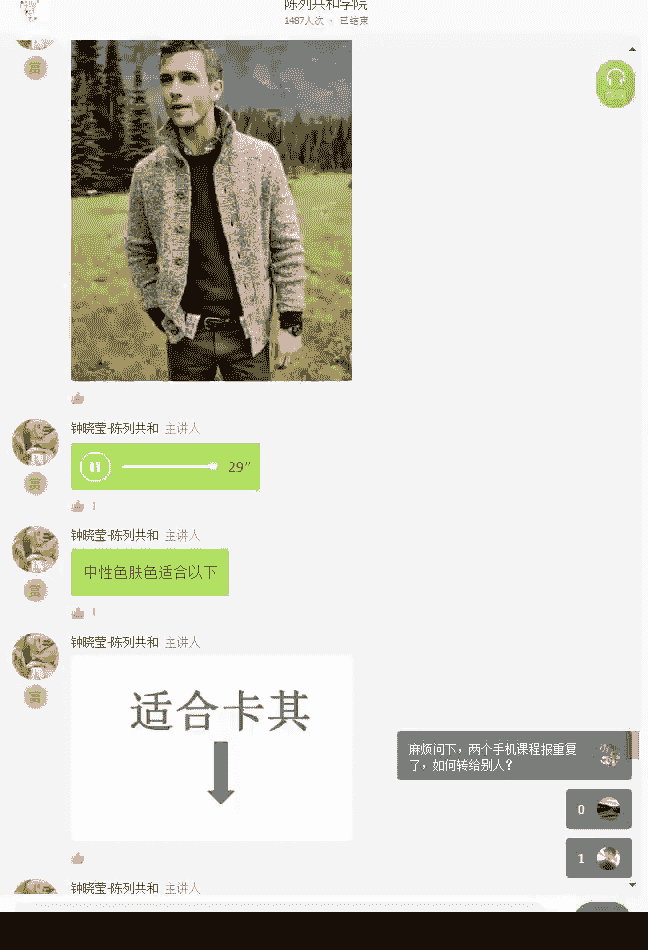

这就是中性色，中性色适合中性中性肤色适合卡其色，因为卡其色其实是一个非常百搭的一个颜色。但是呢如果你的肤色不够白，是驾驭不了这种颜色的。

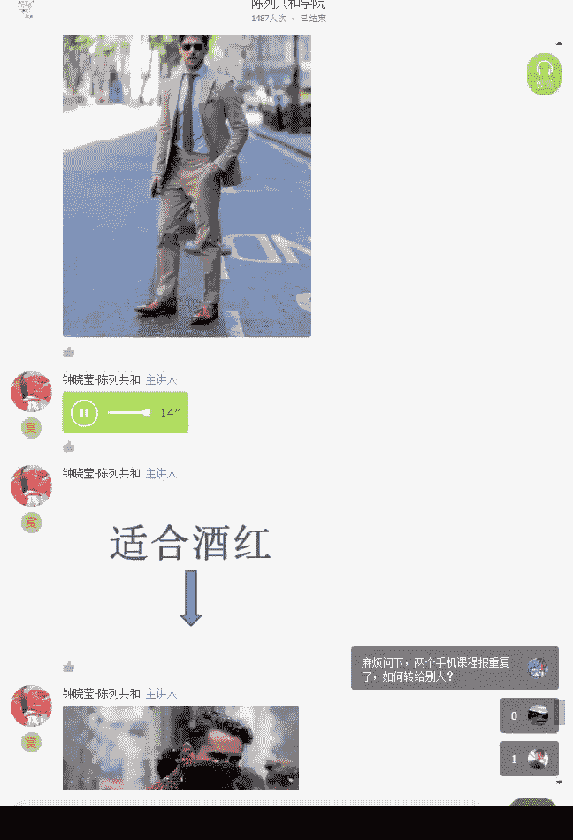

大家试着去想象一下这种颜色，如果让黑色的肤色的男人穿上，是不是感觉很尴尬？

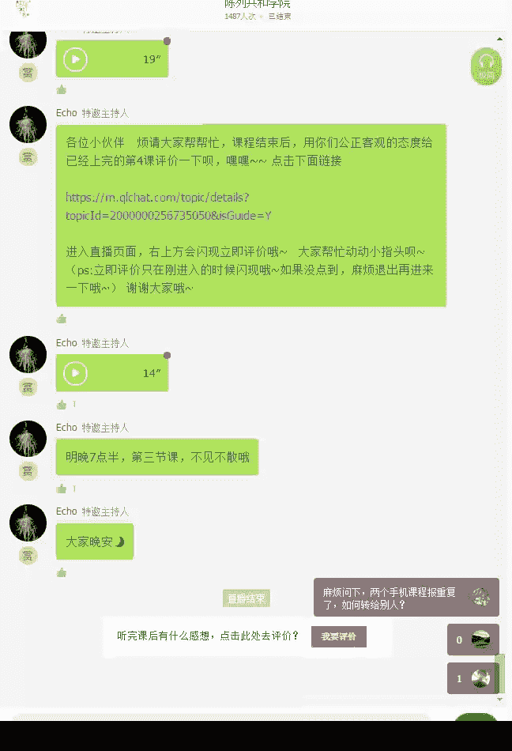

好，接下来他们还适合一个颜色，这个颜色叫做什么海军蓝，海军蓝跟浅蓝是不太一样的。浅蓝呢它更适合这种，比如说像古天客这种。

颜色比较深的肤色，而海军蓝是适合这种皮肤偏白的。

好，还适合这种颜色就是海军蓝，而这种海军蓝其实是很能够衬出男人的这种刚毅的这种气场的那当然你说呃其他的肤色能不能穿，这种颜色可以。我们现在所说的就是找到你肤色当中最合适的，让你最出彩的颜色。

并不是说将其他的颜色都给你判死刑啊，不是这个意思。

好，最后一个适合中性肤色的就是这种偏绿色的这种调性的颜色，就是深绿色。比如说橄榄绿啊啊这种深一点的这种绿色。那哪怕是一些大地色系的绿，其实也是可以驾驭的。好了。

那么我们接下来就给大家介绍一些通纱型的颜色啊，黑白灰就不讲了，在这里啊啊黑白就不讲了，在这里面给大家看到几个颜色，比如说灰色，灰色其实是今年蛮重要的一个流行色，无论是男装还是女装。

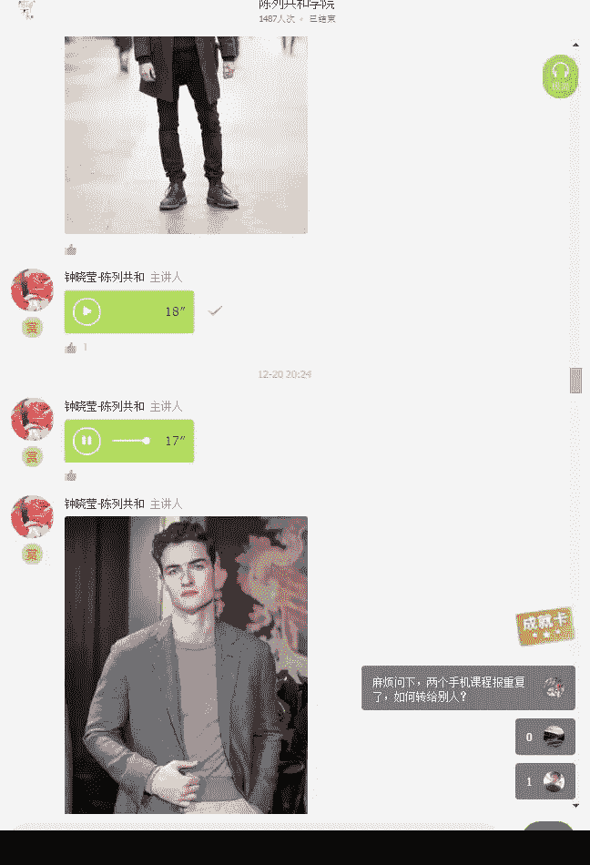

好，这几个灰色都是比较适合所有的肤色的男士的呃，黑色呃，你的皮肤偏黑也行，偏黄也行，啊，偏白的中性色也是可以的。

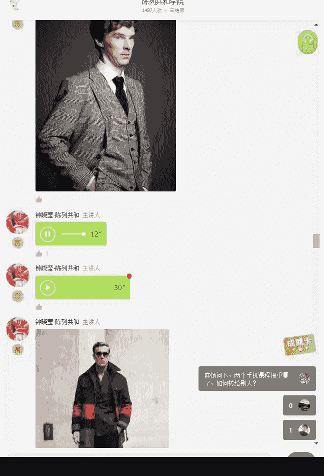

你永远记住，这三个肤色当中，中性色是所有颜色都可以驾驭，大部分颜色都可以驾驭。如果你的肤色是偏中性的，就是白一些的肤色啊，因为一白遮白首嘛，在男人这里其实也是适用的那如果你的肤色是偏黑的，就一定要记住。

不要去穿暖的颜色，比如说暖蓝啊、暖黄啊、暖绿啊，这种颜色都不要去选择，包括暖紫啊，包括红色都要慎重，选红色一定要选那种玫瑰红、深酒红。

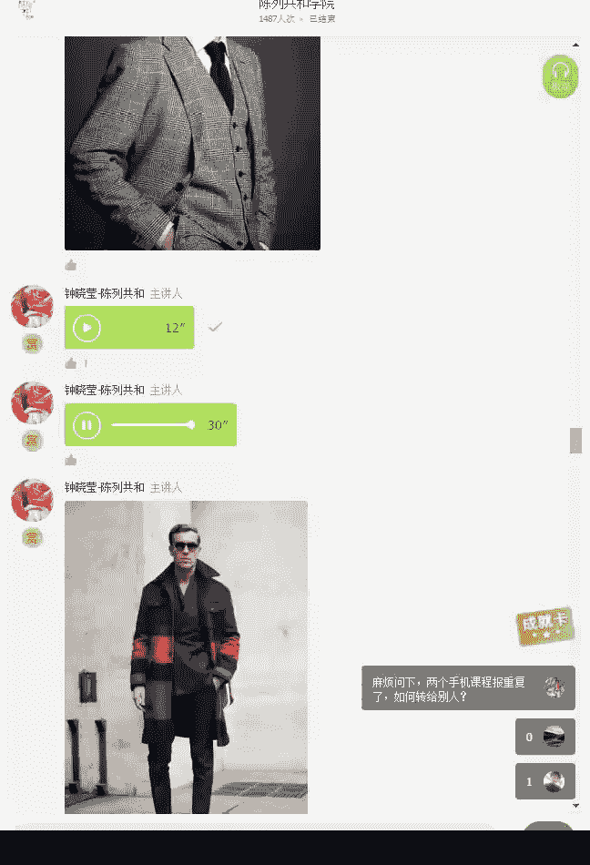

比如说就千万不要这样穿，因为这两个颜色对比太强烈，而且这个红色是虽然不接近脖子，但是你会发现这个红色是非常暖的。

但是呢冷色肤色呢其实是可以穿到这种紫色的。

虽然这个款式看起来非常的流行，但是它的颜色是对的。包括这种紫色也是可以的。其实你会发现，其实古天乐是有穿过这种紫色的。

好了，接下来我想跟大家讲的就是在职场当中，所有的男士都避免的颜色第一亮黄色。第二，避免沉色。好了，以上就是我跟大家去讲到的如何分辨自己的肤色以及偏黑肤色，也就是冷色肤色和偏暖的肤色，也就是偏黄的肤色。

以及中性肤色之间，他们适合和不适合的颜色。那么我们现在呢在课程的最后的结束呢，我们就给大家来一些暖色的服装的搭配的示范和冷色的服装的搭配的示范。回去之后呢。

我希望大家能够照着这个方式去找寻适合我们的肤色的衣服。永远记住，服装搭配必须得要配，你才能够快速的获得知识，快速的能够将知识转换成你可用的这个知识点，这才是有用的。我们作为普国大众。

如何快速的学会色彩搭配。首先第一个就是我们要明确我们的配色目的是什么。比如说我今天要去哪里，我要参加的是什么样的一个会议，或者是我参加的是什么样的活动，又或者是我在生活当中。

我要见谁或又或者我在职场当中，我要表达出什么样的一个自己，这就是你所谓的配色目的。就是你想用配色达到什么，你要非常的清楚。好，第二个就是要多看，第三就是要多搭。所以色彩搭配没有什么高精尖的技术。

但是呢必须是建议在我们以。搭多量才能够产生质的变化。你没有量，你是无法产生质变的。

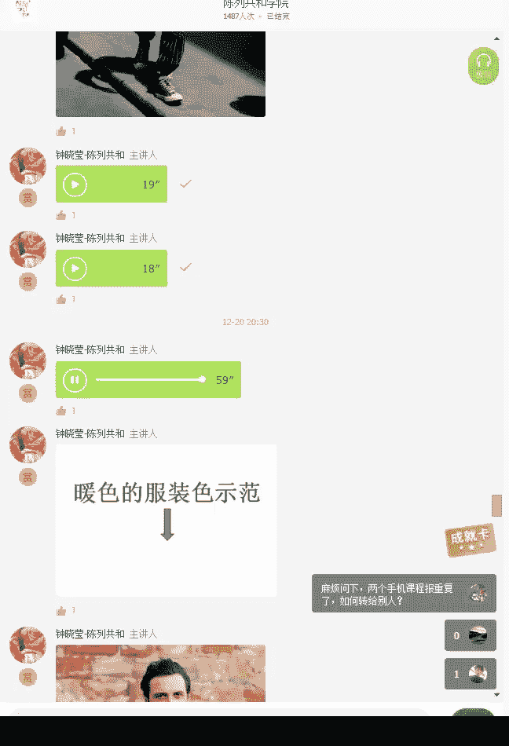

好，以上这些就是暖色肤色搭配的示范。那当然在明天呢我会给大家再讲解多一些。比如说一些不同的，比如说我们怎么样去分辨。红里面的暖和冷啊，我们怎么样去分辨蓝里面的冷和暖呢？这些我们留待明天再来讲解。

接下来再给大家示范几套冷色搭配的示范。好了，这些就是给大家示范到的一些冷色搭配的示范。有3张图还没有上传上来，为什么？因为这个网络的原因，我们现在正在传的过程当中，请大家耐心等待。

待会你们会看到三张冷色的搭配的示范。

好了，大家现在看到这三套冷色的搭配的示范了吗？明天晚上呢我们会继续来讲这个暖色肤色的示范和冷色肤色的示范。让大家理解更多的赤橙红绿青蓝紫里面的不同的冷和暖，这样接下来大家就能够分辨了。

那今天晚上呢我们所有的理论知识就到这里了。接下来呢在讨论区回答大家的问题。所以永远记住那句话，我们所有的配色都是要有目的的。你想达到什么样的目的。你想表达什么样的自己。

因为毕竟所有外在的形象都是我们内在形象的显现。所以我们想要表达什么样的自己，这是最关键最关键的。我们不要去想流行色，我们要更多的想是我们适合什么样的颜色。好了。

接下来在讨论区待5分钟的时间回答大家的问题。我们明天晚上在本周的最后一堂课，7点半，我们同样的时间在这里面见大家。明天晚上还是继续去讲到暖色和冷色的服装色的示范，给大家看到更多的冷和暖。

当我们获取更多的这种冷暖的色彩知识之后呢，我们接下来去逛街去选衣服的时候就会更清晰了。那同时在这里面我想特别的提示大家，如果没有特别的需要，我希望建议大家特别是男士，不要去染。

特别暖的亚麻色或者是咖卡其色的这种头发的颜色，不要去染这种呃特别个性化的颜色，为什么？因为毕竟干净整洁比时髦更重要。在男士的这个部分。其实话说回来，对于女士也是一样的，干净整洁比时髦更重要。

陈上问到说皮肤偏黑，呃，如果穿驼色的高帮皮鞋有没有问题，当然没有问题。但是你永远记住，如果你要穿，永远记住，男士的服装的搭配，主要是坚持两色原则和三色原则。如果你要搭这种呃暖色呃暖色的皮鞋。

那也就代表了你的皮带也要跟着这个皮鞋的颜色来延伸。包括你的手表。

也就是你的穿着要起到一个上下呼应的作用，这样的话你才会显得整个人身材是偏什么高挑的。因为没有人愿意把自己穿的矮矮的。所以呢上下色彩的呼应是男士着装当中一个非常关键的点。就比如说像我现在发上来的这张图。

它就是做到了什么三色原则，蓝白卡其。

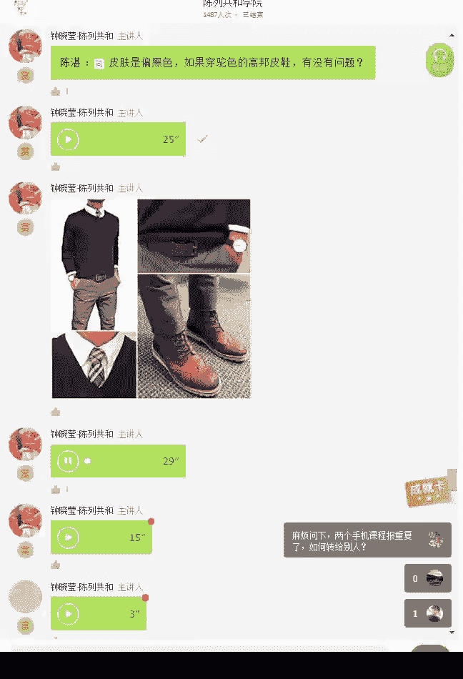

而且他的裤子的颜色跟他的鞋子颜色跟他的皮带跟他的手表的颜色是一整体的。所以你会发现他非常的干净和整齐。其实颜色越少的男人看起来越精致，而且你去看很多的精英男士的穿着，颜色都是偏少的。

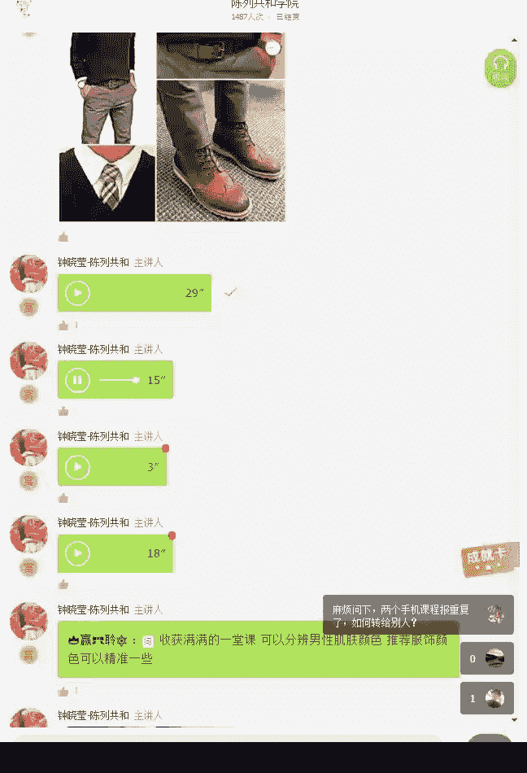

一般来说都不超过三色原则。其实我们在搭配的时候，最重要是思考的就是靠近我们皮肤的部分的颜色，不要去犯忌讳就可以了。但是其他部分的颜色当然我也不希望他看到男生去穿彩裤子，其实彩色的裤子是很难搭的。

而且穿出来很娘炮的感觉。

这就是我刚刚说到的上下呼应的搭配色。

好，大家抓紧时间问问题哦，我们还要倒计时2分钟。

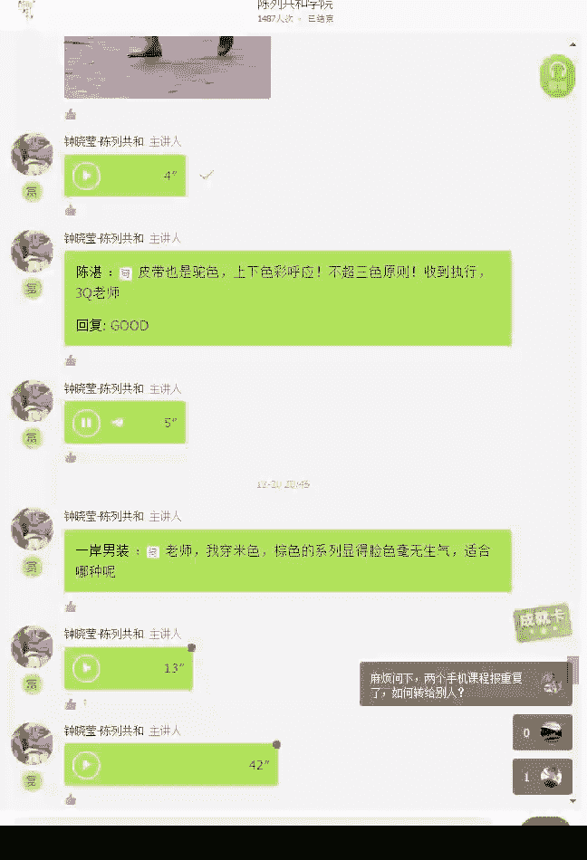

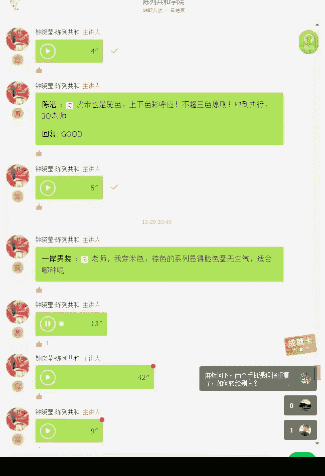

呃，依爱男装你有入群吗？你有入群的话，可以发照片到群里看一下。然后如果你穿这种米色和棕色不合适的话，有可能你是冷色肤色。我建议大家今天晚上回去就进行一个自己的这种小的测试。因为呃用服装来测试是最准的。

为什么呢？因为你服装的面积是比较大的，所以如果我们穿上不合适的衣服的时候，它真的会让我们整个皮肤陷于非常暗淡，甚至整个人都有一种冰冷的感觉。所以在这里面我特别建议大家是用这种呃极暖和极冷的这种颜色。

比如黄和蓝来去测试黄一定是柠檬黄啊，或者是这种姜黄。那蓝一定是天空蓝或者是这种浅蓝色。好了，那我们今天晚上就到这里吧，明天晚上我们7点半不见不散，继续谈色彩。

最后祝大家晚安，把时间交给主持人echo，谢谢。

Yes。好的，谢谢谢谢老师的精彩分享，也谢谢各位小伙伴们的守候。那今天呢我依然为大家做的笔记，只是我的笔记嗯是图片。因为我刚刚在做笔记的时候，公司的网络断了。所以我只能把我做的笔记拍成图片发给发上来。

然后如果大家想要文字版的话，那明天我会让大师兄在我们的群里面把文字版的笔记发到我们的交流群。

嗯，所以呢还没有入群的小伙伴一定要抓紧了。然后因为确实第一个。

