# 1、16男士衣品速成穿搭指南(完结）：第3课：找到自己肤色的适用色与禁忌色（二）：第3课：找到自己肤色的适用色与禁忌色（二）

哈哈哈，我今天发给大家的不是花，而是吃的东西。这一看就是一盘辣子鸡。😊，有没有人还没有吃饭呢，看到的时候是不是感觉很饿？我最近在减脂肪，所以呢这么油腻的东西我只能在一个月之后才能吃了。

所以发上来跟大家一起看一下，看一下就好了。😊。

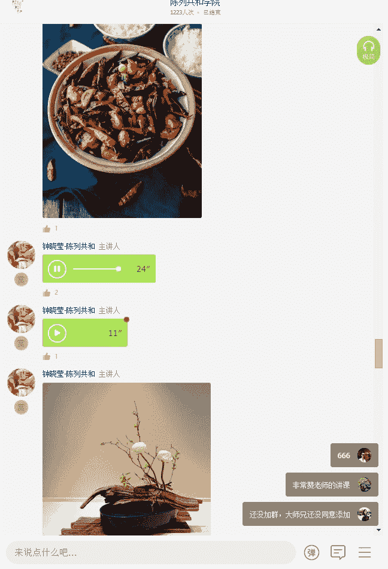

我想知道昨天大家听完课之后，回去有没有去做自己衣橱的整理呢？有的话请在讨论区告诉我。

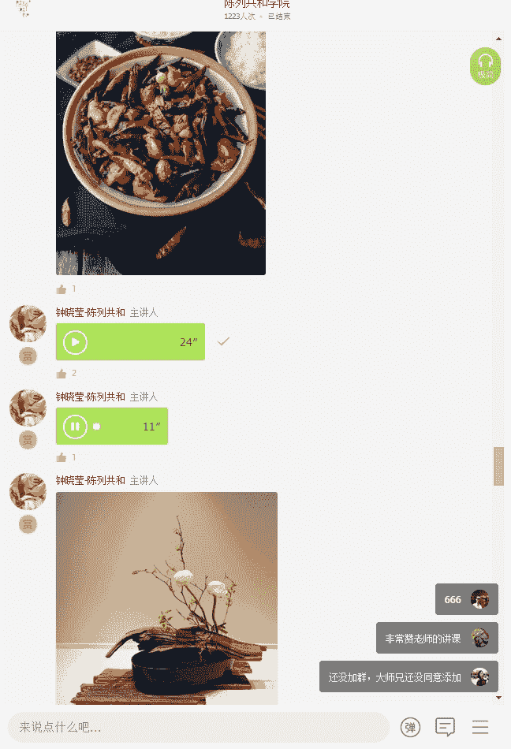

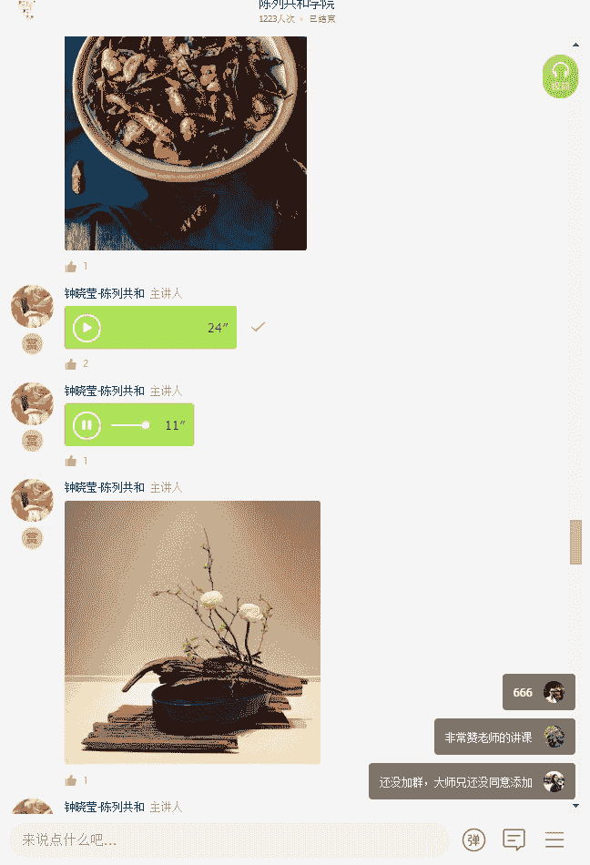

好了，依然还是以一盆美丽的日式插花开始。我们今天的课程。

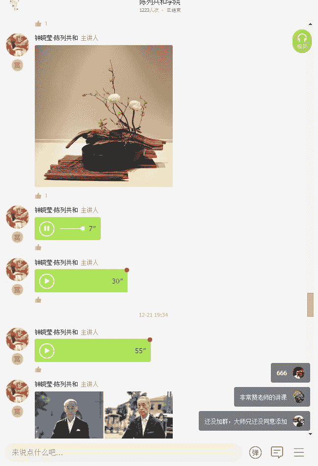

每个人的形象其实都可以价值百万，只不过在于我们自己是否在意，以及是否愿意为他付出更多的时间和更多的精力，同时愿意学习这方面的知识。我觉得穿着得体，不仅仅是对别人的尊重，也是对自己的一种尊重。

如果我们想要获得别人的尊重。那么我们首先应该做到的是自己尊重自己。

每个人都可以去树立自己的风格，去建立自己的个人品牌。但是前提是我们愿意这么去做。所以你会发现在很多的生活当中和工作当中，我们常常会遇到这样的人，他工作也很忙，但是呢他每天的打扮都很精致。

好像感觉他都不用睡觉似的，他还有时间健身，也有时间阅读，还有时间跟朋友吃喝玩乐。大家是不是特别特别羡慕这样的人，特特别特别想拥有这样的人生呢？所以我记得我第一节课曾经说过一句话，我说人生只有两个方向。

一是精进，一个方向是精进，第二个方向是堕落。所以任何一个人。我们每一个人的人生其实都建立在自己对自己的要求之上，同时也掌握在自己的手中。

今天我在看图片的时候，看到了这个呃亚洲男人，我不晓得他是中国人还是日本人还是韩国人。但是我看到他的时候，我真的觉得。很被吸引。不是因为他的颜值，也不是因为他的年龄，而是因为他的年纪蛮大了。

但是他还坚持如此得体的精致的打扮。

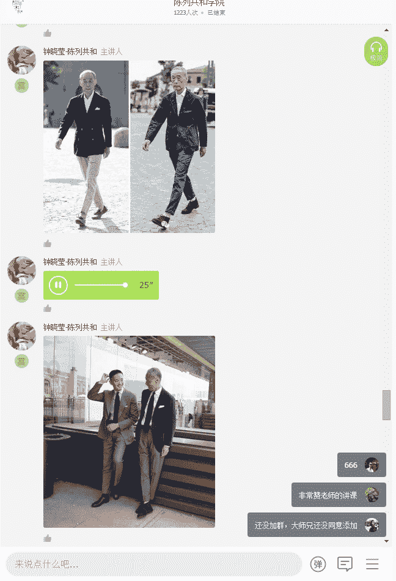

大家请看这三张，我特地把它怎么样，把它那个。存在我的手机里了，因为我真的觉得这个男士非常的精致。你看他的裤子，他的鞋子以及他的西服，然后包括他的发型，然后他整个人的举止言谈都让你感觉到得体和。

特别吸特别特别愿意去亲近他。其实某种程度上我们的外在形象就是这样子给我们赋能和加分的，大家认同吗？

所以我希望透过这1一堂课，让我们身边的男人，中国的男人变得越来越有魅力，同时越来越尊重自己的穿着。其实，尊重自己的穿着，让自己的穿着得体，某种程度上就是深度的尊重自己。

哇哦，谢谢罗拉给我打赏的52的红包，谢谢。好吧，那我们今天就进入正题。今天呢总共我的课程会分为四个部分。第一部分我们会先教大家如何去分辨色彩的三个种类，色彩的三个种类当中有。第一，有彩色。第二，五彩色。

五彩色就是所谓的黑白灰。第三就是中性色，就是所谓的卡其咖啡驼和米色。啊，大家如果要添加我们这个大师兄的微信号的话，我想大家在echo主持人在最后再公布。因为在这个课堂当中。

我希望大家连贯的看到所有课程的图片，好吗？

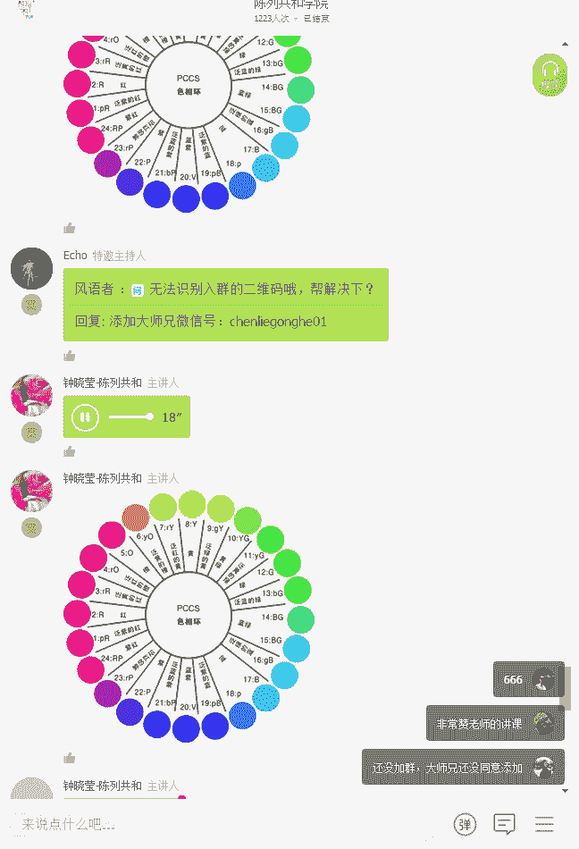

大家现在看到的就是我们刚刚所讲到的色彩的三个种类当中的什么油彩色。好，大家现在看到的这个就是这个摄像环，就是有彩色的摄像环。那其实我们肉眼可以分辨的颜色是少之又少的，能说出名字的。

我觉得能说出100个色彩的名字已经非常牛逼了。所以在这里面我们不需要记记住这些色彩。我们最重要的是懂得去分辨，分辨什么分辨它带给我们的感受是什么？就如同于红色带给我们的感受可能是热烈的激情的。

黄色带给我们的感觉是目标感是向上的，绿色带给我们的感觉是和平的啊，自然的，蓝色带给我们的感觉是理性的，而紫色带给我们的感觉是暧昧和浪漫的。所以我们不需要去想说啊，到底我们的这个呃这个颜色到底有多少种啊。

不需要。其实在今天的这个课堂当中，我只需要大家去懂得分辨有彩色、无彩色和中性色就可以了。现在大家看到这对鹦鹉，其实就是什么，就是有彩色，包括它底下的这个色彩的这个识别。

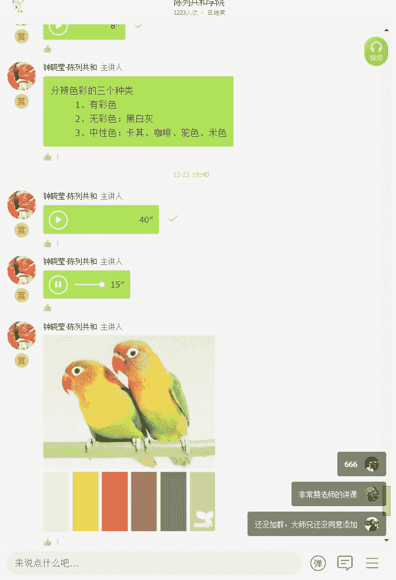

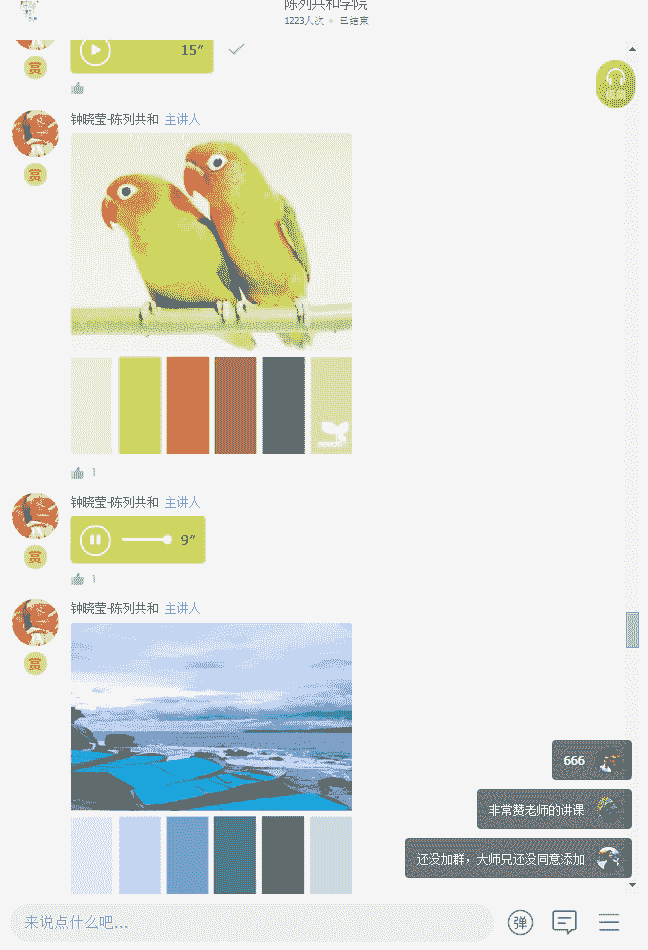

而且它是有彩色当中的什么暖色。好，我们现在给大家看到的这个是有彩色当中的冷色。有没有发现这两个画面放在一起的时候，你们将这两张图对比的放在一起的时候。

有没有感觉到暖色带给人的感觉是向上的生充满了生命力的，而冷色带给我们的感觉是冷静的。

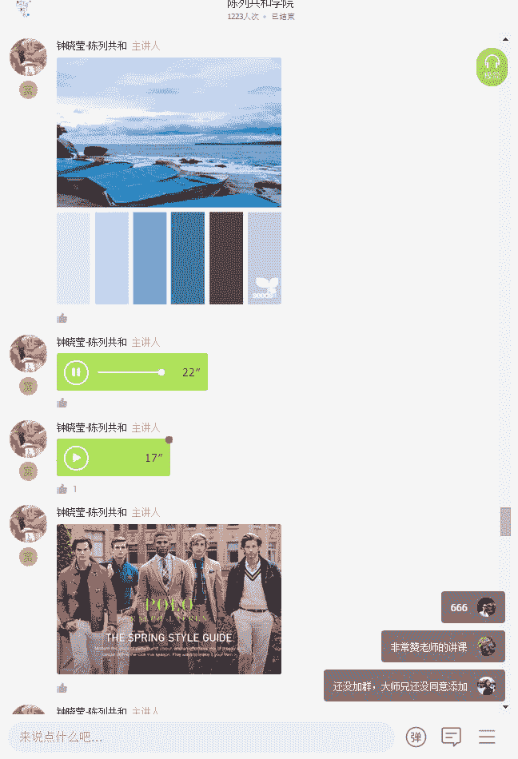

那我们再次重申，在这个部分里面，我们首先学会了分辨色彩的三个种类。第一有彩，第二五彩五彩色就是所谓的黑白灰，我就不给大家看图啊，大家应该能够识别出黑白灰。好，第三个就是中性色，那就是卡其咖啡米色和驼色。

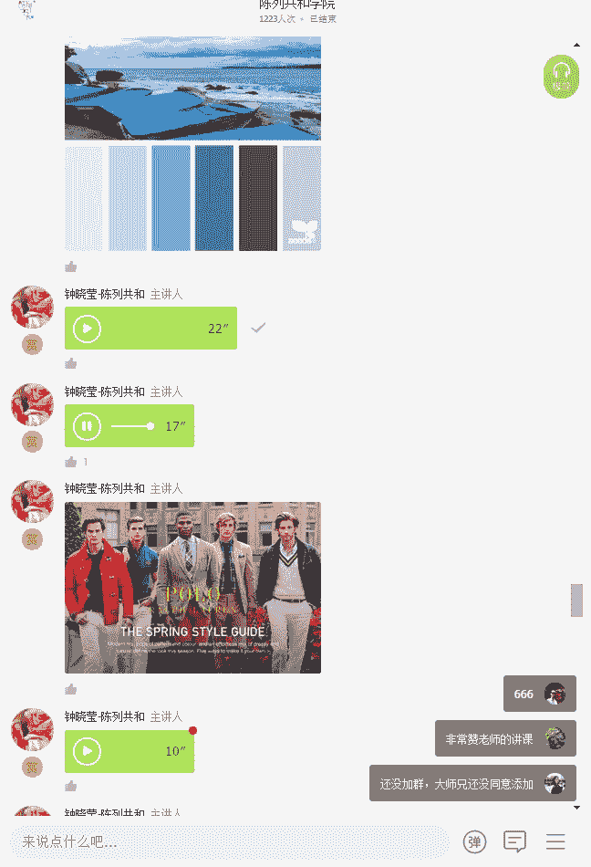

大家看到这张polo的海报的时候，在这里面就分别包含了黑白灰以及油彩色以及中性色。

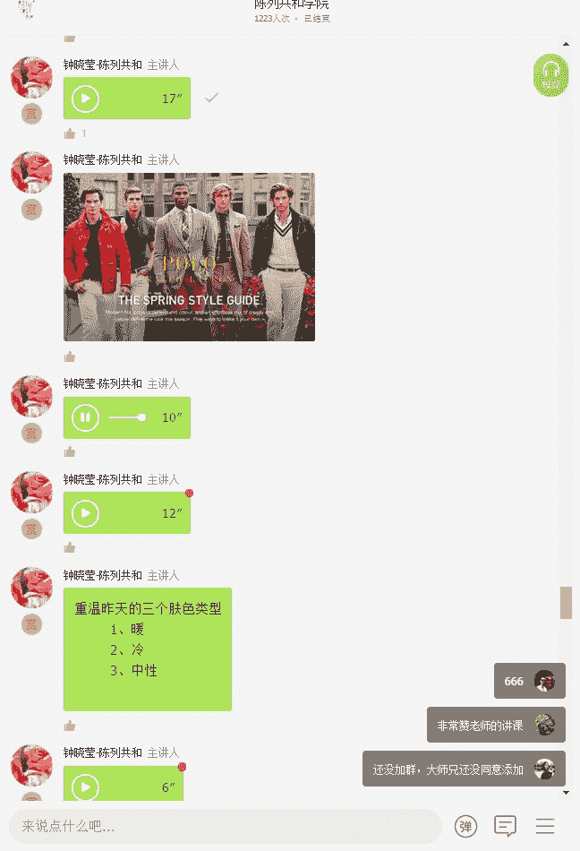

好了，我们来重温一下我们昨天的三个肤色的类型。我讲到了哪三个肤色类型呢？第一个偏暖的肤色，第二个偏冷的肤色，第三个是中性的肤色。

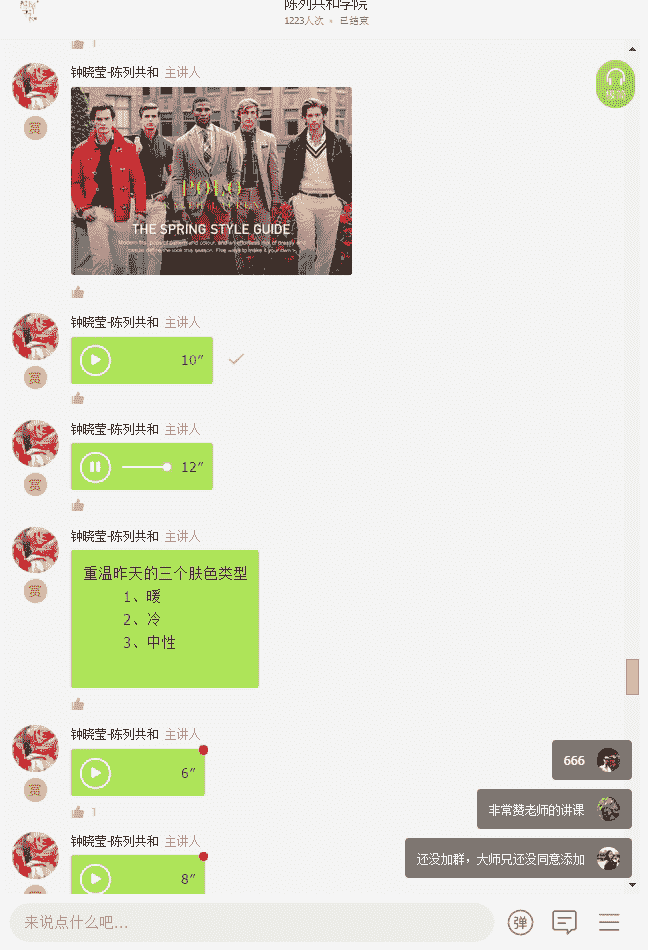

然后我们来回顾一下古天乐的肤色是偏冷还是偏暖的？对，偏冷的肤色。好了，那么接下来我们来讲到的第二部分。第二部分就是讲到如何分辨色彩的冷暖。

为了方便大家能够跟上我的节奏，所以在这里面给大家做到了一些文字。好，到时候大家可以把它记入笔记当中，方便大家回顾和理解。那首先第二部分我们要做呃要讲到的就是分辨色彩的冷暖。第一，我们要看有彩色的冷暖。

我们待会给大家看示范图。第二，五彩色是没有冷暖之分的。第三，中性色也没有冷暖之分，中性色是万能的搭配色，对于男女都是。

好，我们现在给大家看到的这两个对比图，左边是cool，右边是warm，就是左边是冷色，右边是什么暖色。好，我们再给大家看一个左边暖色右边冷色，大家能够感受得到吗？其实暖色就如同于它的什么？

它的这个文字一样，让人感觉到非常的温暖。而所谓的冷色也如同于它的文字一样，让人感觉到有一些冷峻。

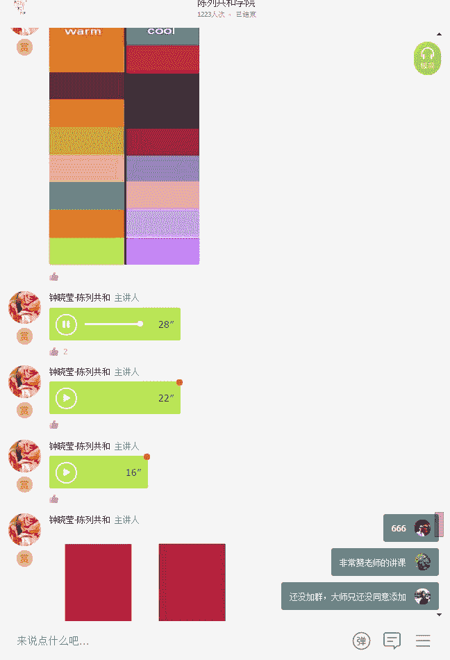

甚至有时候冷色会给人感觉是冷冰冰的那相对来说大家去看很多的电影啊，主角的这个角色的塑造的时候，如果这个人是一个比较冷静和理性的人，通常他在剧里面所穿的衣服相对来说也是冷色。

但是如果这个主角是比较活泼开朗和外向的那他穿的颜色一定是暖色。所以色彩对于人的这个呃衣着的这个部分，特别是男士一定要谨慎使用油彩色。因为男士的搭配当中，其实大部分都是。那两个种类的颜色。

黑白灰以及中性色。那么我们昨天也讲到了，所有的油彩色当中，它是有冷暖之分的。我们现在给大家来看一张红，大家有没有看到这个红左边是暖红，右边是冷红。你们只需要把这两把这两个存下来以后去买衣服的时候。

用它来对照就好。有没有发现暖红有个特点，就是有没有发现它是偏黄的，而冷红有个特点，它是偏蓝的。那么对应下来呢，大家再来看一个蓝色，有没有发现暖蓝左边是偏黄的，而冷蓝右边是偏蓝的。好。

那我们再来看一个紫色，那也是一样，偏黄和偏蓝，大家能够分辨出来了吗？也就是我昨天所说的赤橙红绿青蓝紫，它都有冷暖之分，但是永远记住它是有彩色。甚至我们说黄色是暖色，但是黄色也有冷暖之区分，有没有发现？

右边的那个冷色的黄感觉加了好多的白呀，你加白越多，你会发现这个黄就越什么越冷。所以有时候如果你真的想降低你这件衣服的这个黄色的这个暖色的调性的话，那么你就请穿白色的内搭或者白色的裤子来缓和它。

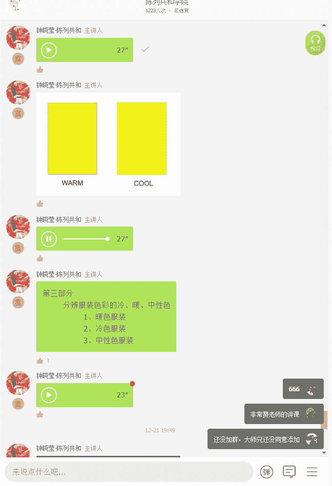

好了，到这里我们就讲到了，讲完了我们如何分辨这个色彩的冷暖了。那接下来呢第三部分呢，我们就来分辨什么服装色彩的冷色、暖色以及它的中性色了。那这个部分是非常关键的。所以呢我的讲解的篇幅也会稍稍长一些。

好吧，那么我们现在就进入到了服装冷暖色的对比示范。

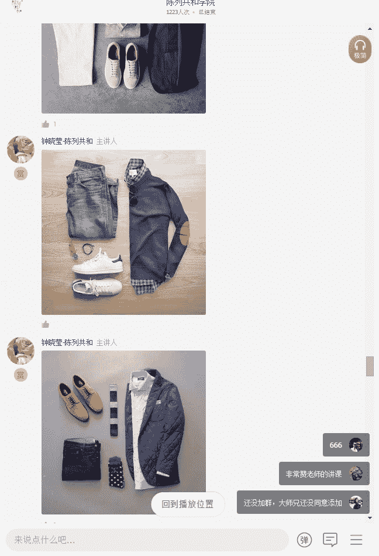

来考试，请告诉我前后两件衣服哪件是暖的绿，哪件是冷的绿。前后啊你可以说前冷后暖，也可以说前暖后冷。

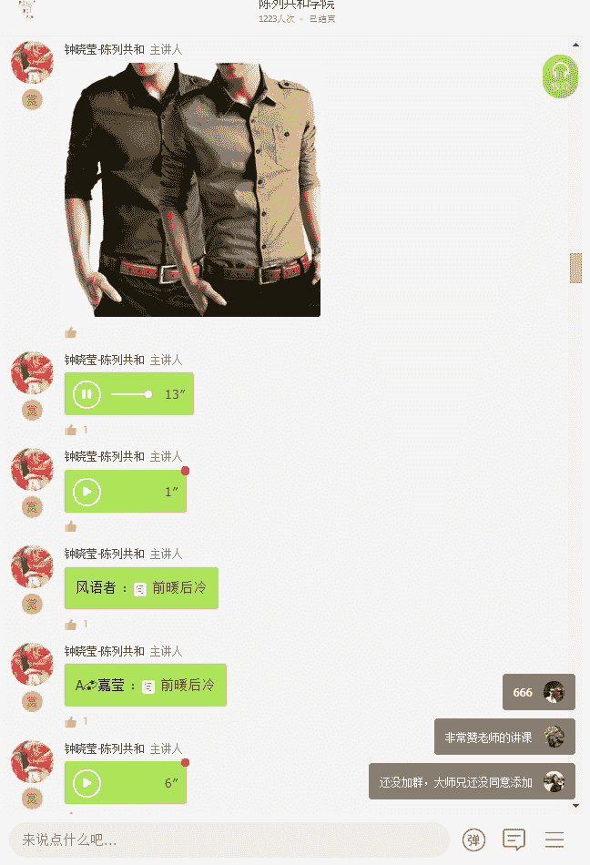

来做下练习吧。很棒，前暖后冷，前暖后冷，答对了，风雨子和佳莹都答对了。其实有很多时候你会发现我们摄取的知识不需要太多，只需要把简单的知识重复用，就会产生非常大的价值。

很棒啊，轻雨针也答对了。

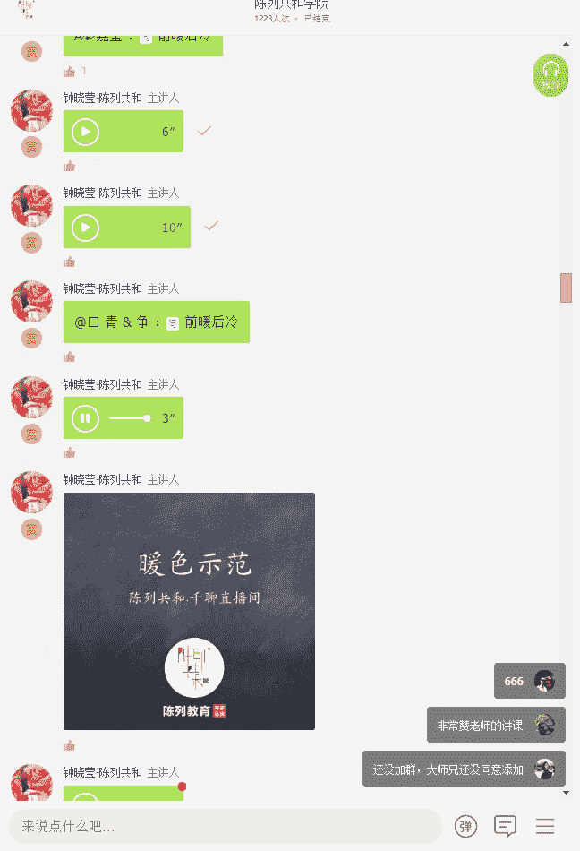

好了，那么我们现在就给大家做暖色的涂色的示范。在这里面我只给大家看服装的颜色。

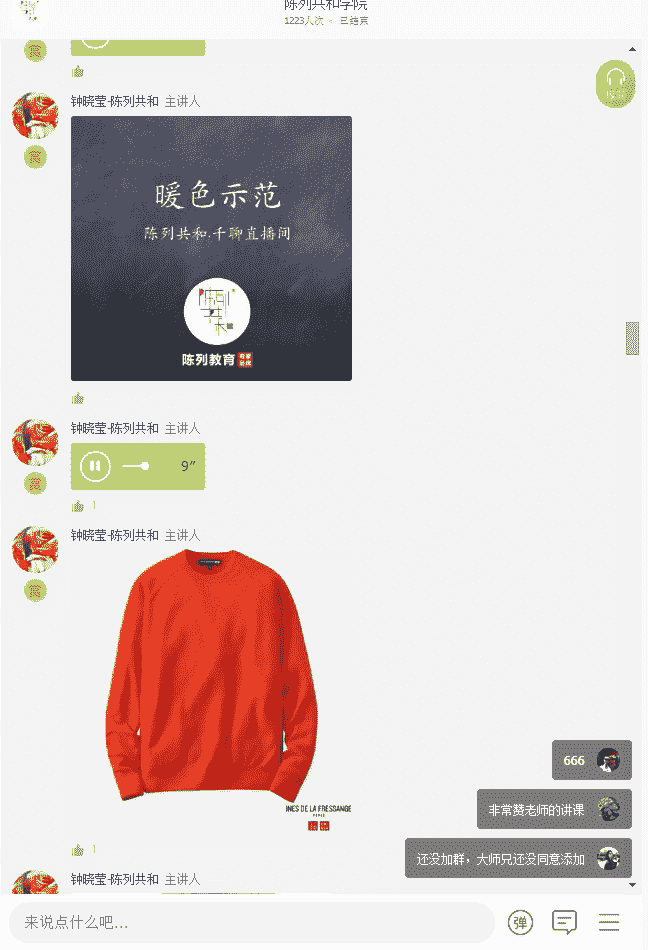

好，大家现在看到的从橘色开始到绿色啊，到黄色到这种深的红色，它全部都属于暖色。那暖色有一个特点，那特点就是你会发现它膨胀性特别的强，也就代表了如果你是比较偏胖的人，那么我建议你一定要多穿冷色。

特别是男士。但是如果你的身材还不错哈。那呃加上你的肤色又是偏偏暖的那你可以去穿到暖色，但是暖色都有一个特点，就是膨胀感特别的强。如果身身材偏胖的人比较容易显胖。

OK我们现在给大家来看冷色的服装的示范。

好了，大家现在看到了吗？这就是冷色，冷色跟暖色。你们把图存下来之后，你就会发现哇，区别很大。暖色给人的感觉就是觉得这个男人是比较容易接接近的。但是如果是冷色的话，你就觉得这个男人好像看上去会比较冷一点。

然后难以接近，甚至有时候你会觉得他会偏向于理性。但是大家有没有发现所有的冷色和暖色，所有的油彩色，他是不是都很容易跟中性色搭在一起。特别是我们现在看到了倒数第二张那个呃中年男士戴个墨镜。

他穿了一件豆沙灰的绿色啊，穿着一条卡其色的裤子，但是他的腰带和他的鞋子是有呼应的。也就代表了它其实是冷色和暖色的相撞的搭配。但是这个呢是需要一定的搭配功力的。如果我们自己穿的话。

我建议大家去配卡其色的皮带就好了。啊，卡其色的皮带，卡其色的鞋子就如同于最后一张。那个蓝衬衣配的那条深卡其的裤子一样的搭配。

OK我们现在进入到中性色的搭配示范。

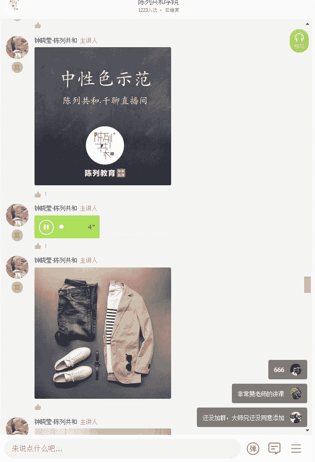

好，大家看到了吗？这就是中性色的搭配示范。中性色其实就是咖啡驼米卡其。

那当然还有一种颜色就是五彩色，那就是灰以及白，还有黑。

当然可能有一些老师会把黑白灰归为中性色，但是我不建议我建议把黑白灰单独的挑出来，它作为一个非常重要的一个色彩的类别。

所以大家get到了吗？我们总共讲到了是三个不同的服装的颜色，暖冷中性。那在这里面呢给大家一个搭配的原则。就一般来说，其实男士呢暖冷搭配其实是有的。我们的暖冷中性色的搭配互相之间是可以串位的哈。

比如说暖跟暖配冷跟冷配冷跟冷配其实是最常见的，或者是暖跟中性色配或者是冷跟中性色配。

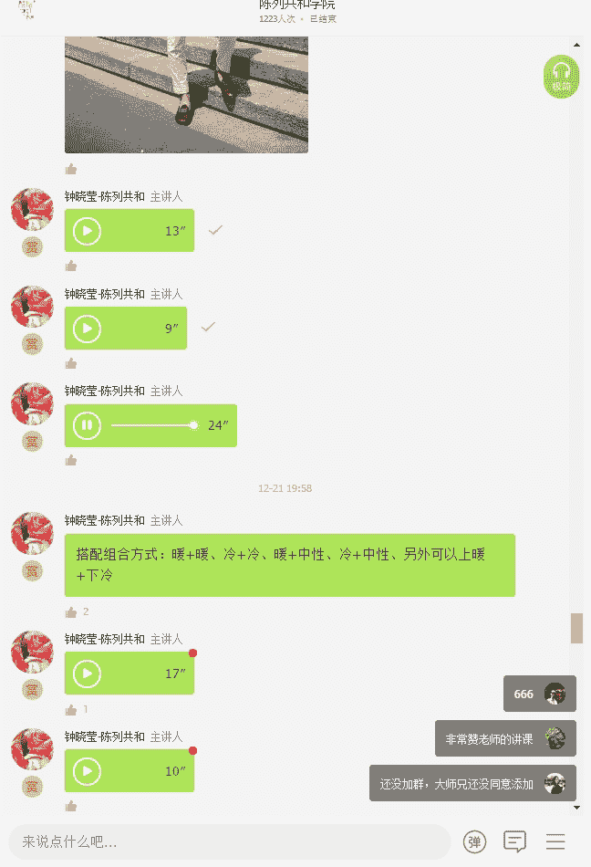

好了，这个就是我给到大家的一个搭配组合的方式，暖加暖冷加冷或者暖加中性或者冷加中性。另外也可以是上暖下冷。比如说我的肤色偏暖的那我就用上冷和下暖，上暖和下冷的方式。永远记住。

我们所谓的肤色对应服装色是一定是接近我们的脸部的位置，夏装你怎么穿都还okK。夏装是一定不拘泥于说我一定是要冷或者一定是要暖的。但是其实大部分的呃夏装要么就是冷色，要么就是中性色。要么就是黑白灰。

冷色里面可能更多偏深蓝。

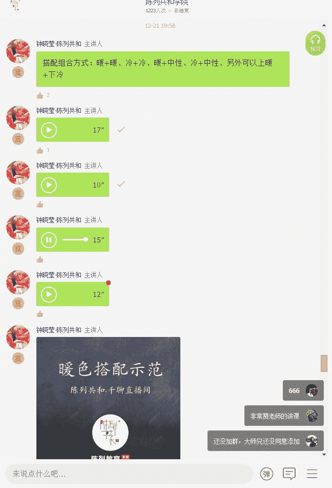

好了，那接下来呢我们再给大家去做暖色、冷色和中性色的一些搭配的示范。可能在这里面呢就会用到我们刚刚所说的这种组合的方式了。

好，大家现在看到的这一套是不是一个暖色的上衣，配了一个。中呃应该叫做黑白灰的裤子，对吗？深灰色的裤子，这种就是暖加中性色的搭配。那还有这个也是暖加中性色的搭配。

那我们接下来看到的这两套呢就是暖加蓝色的搭配。

大家有没有发现我们今天的图里面都会有很多的文字性的间隔，主要目标是为了方便大家存涂存下来，比如说将暖跟暖存在一起，冷跟冷存在一起。这样接下来你的搭配示范以及你的搭配参考就会更明确一些。

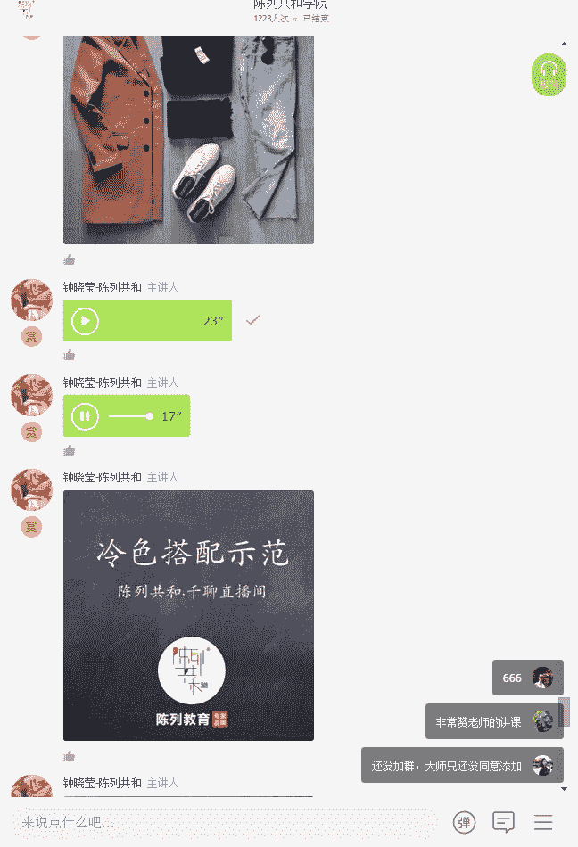

那冷色搭配就很简单了，冷色搭配基本上是全部呈现出一种色调的，特别是男士。我昨天也说过，如果你一定要显得高级，你永远记住，你全身上下的颜色是不可以超过三种的。我现在在给大家来看一个呃冷色肤色的男士。

他的服装的搭配的示范，然后他的搭配的错误的和搭配的对的给大家来看一看。帮助大家去消化。为什么说我们要找到自己的肤色的冷暖，同时我们要找到衣服的冷暖，然后去匹配我们的肤色。永远记住，是人穿衣服。

不要让衣服来驾驭人。有很多时候我们会说哇这个人衣服好漂亮，但是有时候我们会说哇这个人好漂亮。所以当时我们说这个人很漂亮，或这个人很帅的时候，一定是他在驾驭衣服。但是如果我们说这个衣服好好看呢。

这个时候代表了衣服在驾驭人。所以我们学习的目标是让我们自己能够去驾驭我们的衣服，而不是让衣服反过来驾驭我们。好了，大家看到了这个男士了吗？这个男士是什么样的肤色，请告诉我是冷还是暖。是偏黑还是偏黄？

你们太棒了你们太棒了。好，那我想再问一个问题，你们觉得他穿浅蓝更显肤色明亮，人的轮廓更清晰，还是他穿深蓝？有没有发现他穿宝蓝的时候显得皮肤很红，感觉好像是晒伤了。所以这个衣服跟肤色的原原因是什么？

原因是因为这个颜色的衣服跟肤色的明度差距不大，反而会导致它像一只晒红了的虾米，而浅蓝色是非常显出它的肤色的白的，而且让它的肤色的光泽度会变得更好，这就是适合的颜色和不适合的颜色上来之后的感觉。

谢谢幸福小雀绿给我的打赏。😊，有没有发现他这个肤色的人特别适合穿灰色？我们公司的CEO也是呃这样子的深肤色，所以你会发现它特别适合穿灰色，它特别适合穿浅蓝，而它不适合穿深蓝，特别是这种强度很高的宝石蓝。

哇哦，谢谢谢谢遇见生活打赏给我的52，还有lisa给我的我爱你的红包。很棒啊，大家学习很快非常快。那我们现在看到这个男士穿三件衣服的时候，一个是偏暖的，这个有点类似于焦糖色的外套。

以及中性呃以及黑白灰的灰色和黑色，有没有感觉他穿灰色会舒服很多。而且他穿灰色的时候，它中间的那条围巾。它的这个色彩的调性也降下来了，降到了基本上属于中性色这种卡其色的颜色是不是很舒服？

接下来我们再给大家看这个男士，其他适合他的着装的一些样子。

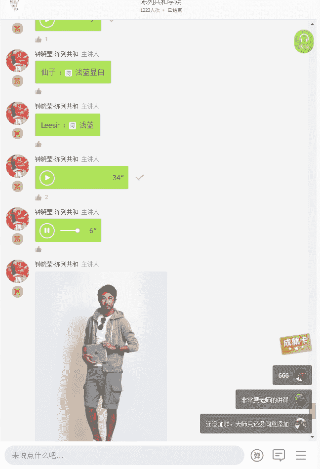

同样又是一套回。他个人真的是很喜欢穿灰，因为他的肤色真的蛮深的。大家可以看到这个男士他穿的这个裤脚有没有发现都偏短，所以也就代表了我们中国男人的这个裤脚是不是应该要剪一下。

我今天朋友圈里面也发了那个呃亚洲中年男士的，应该老年男士的那几张图。我说主要看裤脚，因为他们的裤脚都特别喜欢这种翻脚边，其实翻角边是非常有精英气质的。

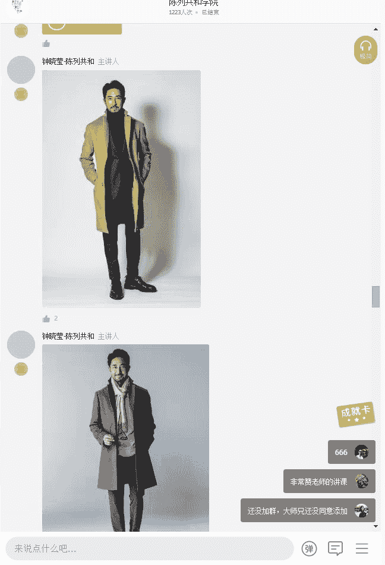

大家来看，然后这种偏冷肤色的人呢，他特别适合穿这种黑白的对比。只要有这种黑白的对比，你就会感觉到他特别的有范儿，而且它的肤色轮廓感都会很强，而且整个人会显得更瘦一些。

哪怕他穿全身这种黑和灰的相结合，你也觉得他特别的有范儿。所以其实冷色肤色的男士是特别适合留胡子的，但是暖色肤色的男士是特别不适合留胡子的。然后暖色肤色的男士还有一个特点，就是脸的部分会比较容易红。

特别是到秋冬的时候，中间的被子可能会容易红，然后一晒可能也会容易红，所以他们留胡子的话，会选得整个人皮肤都会变得很脏。所以我不建议暖色肤色的男士留胡子。但是我非常建议冷色肤色的男士留胡子。

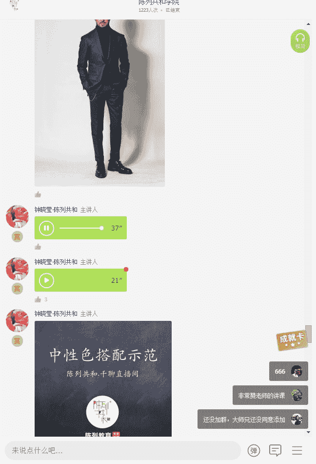

好了，这就是给大家看到的这个冷色肤色的男士的一个搭配的示范啊，一个人物的搭配的示范。这是一个我非常喜欢的一个日本呃大叔，他的穿着的搭配，而且我觉得他特别适合呃送给大各位在职场当中的男士。

那同样我们再重复的给大家看一下中性色的这种搭配的示范。其实中性色大部分都是这种偏，比如说啊卡其啊、偏驼啊、偏米啊这种颜色。

这就是非常典型的咖啡色，也就是非常典型的中性色。那你有没有看到它跟后面的白以及灰，也就是黑白灰的这个五彩色在一起搭配，非常的漂亮。但是大家可以看到它的外套以及它包包和它的鞋子互相之间的呼应。

这套是非常男神的搭配啊，我个人非常喜欢，因为我特别喜欢看到男士穿这种反皮的这种面料的衣服。好，我们现在看到的这个也是一个中性色的搭配，就是这种浅卡其的搭配。

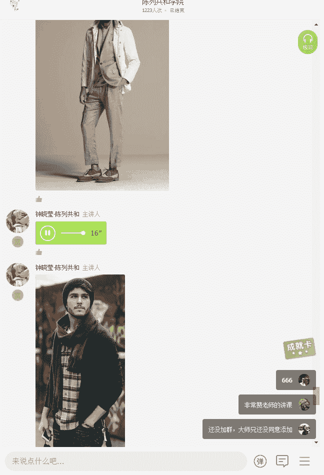

好，给大家看到的这个呢就是用一个有彩色的绿色，而这个绿呢是偏暖的绿来搭配这种咖啡色，里面再配一个格子。有没有发现它里面的格子衬衣跟那个围巾的颜色是相搭配的。然后围巾呢正好是两色围巾。

然后里跟外衣又呼应上跟内搭又呼应上。所以其实我蛮建议男士去买这种两色围巾的。因为两色围巾是非常百搭的。而男士在搭配当中其实也非常讲究这种呼应。大家现在看到的，我给大家带出来的图。

全部都不是那种怪怪的搭配，全部都是这种全身上下不超过三个颜色，而且上下上中下都采用了呼应的搭配的方式。

好了，以上就是我带给大家的一个搭配方式的一个组合的搭配方式的一个示范。那么我们接下来就会进入到我们的第四部分。

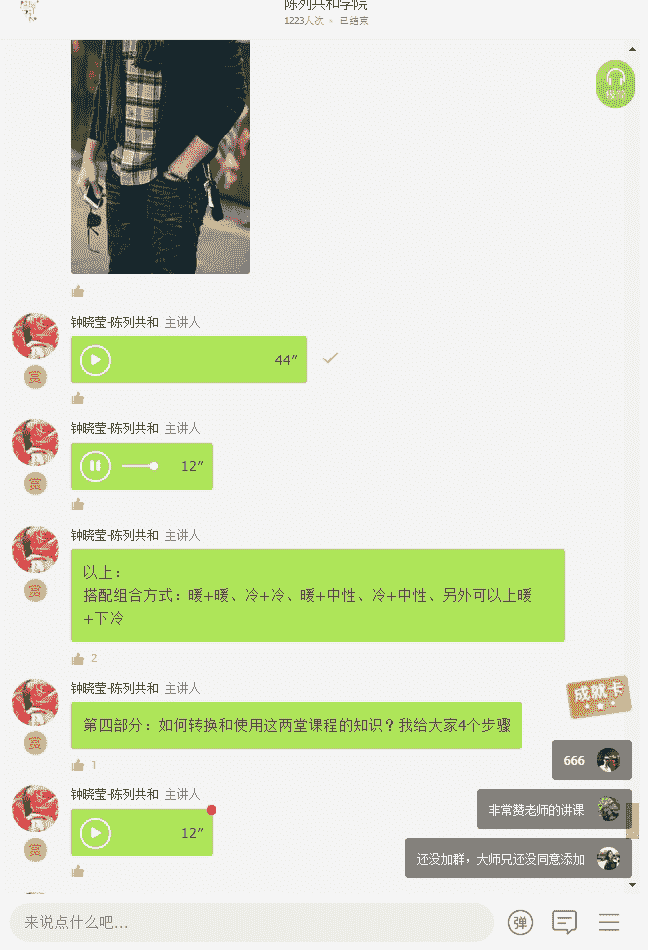

好吧，大家接受我这么多的理论的知识，以及看了这么多图片的示范之后，大家一定会想说，那老师我回去怎么转换和使用这两堂课的知识呢？那么我给大家四个步骤。好，步骤一就是将我们这两堂课的图片全部都收集下来。

并分类存储。怎么分类存储，你们该分非常清楚，也就是分成三类，暖色、冷色、中性色。好，那第二步呢就是将衣橱里面的冷暖中性色都分别的分分别的区分出来，并同时把它用衣架挂好。比如说从暖到冷再到中性色。

然后同时再加入一个黑白灰，也就是将衣橱里面的冷暖中性色和黑白灰分出来。

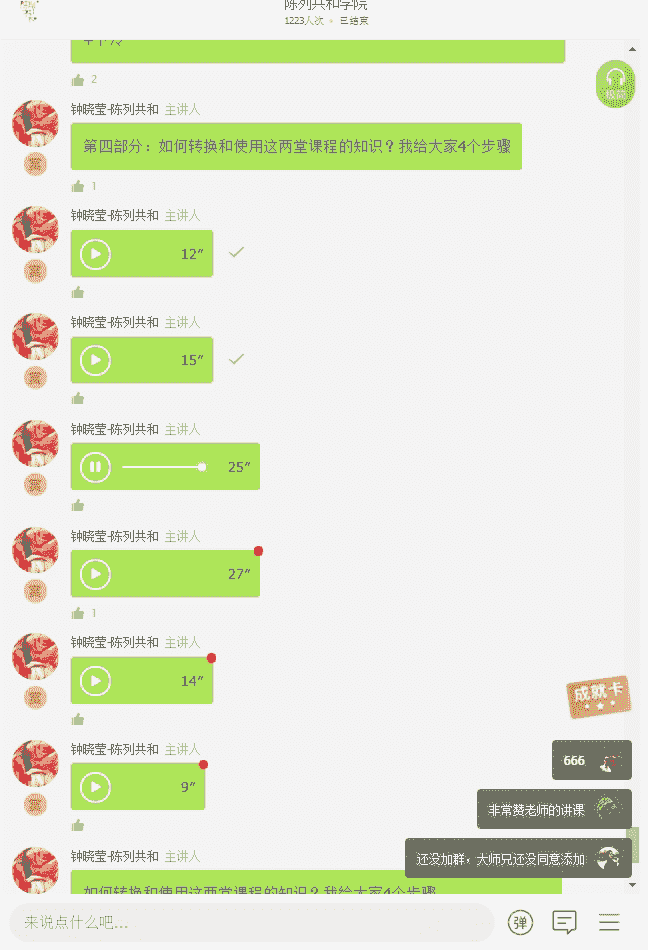

那么第三步呢，就是根据我们课程当中的图片进行自己衣橱当中服装的搭配。因为你已经将你的衣服分出冷暖和中性色和黑白灰了，那么们就根据找到我们的这些图片来开始模仿它。大家知道吗？最快的学习就是从模仿开始。

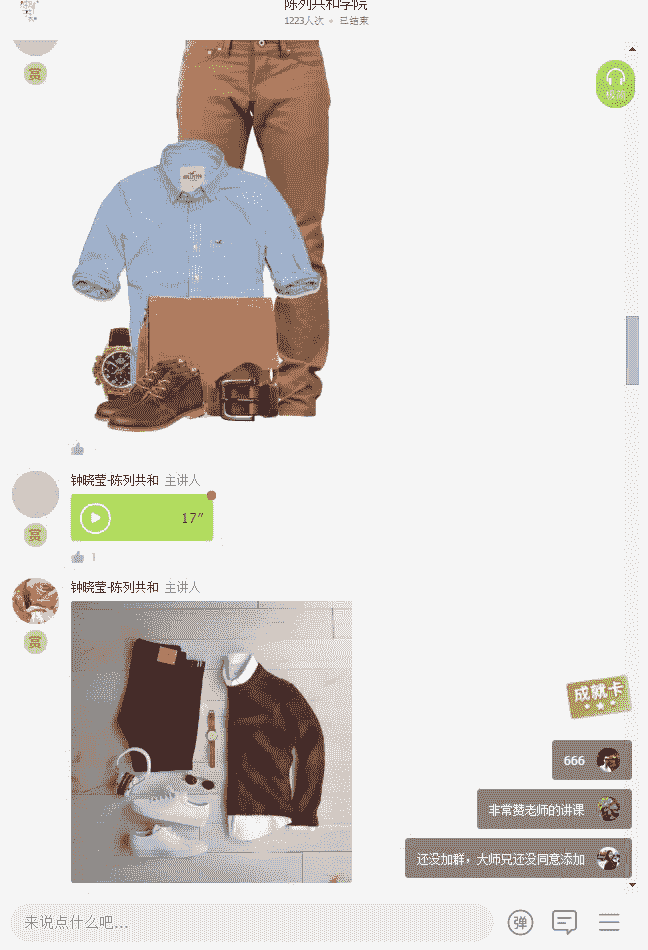

我们不要想着说，老师我去自我创造，不要我们先从模仿开始，毕竟模仿是最快的学习。好，那么第四步就是将我们搭配好的衣服穿上身，然后开始拍照，同时让家人和朋友来评价。那当然呢也可以发到我们的搭配群。

让我们的搭配小老师给你们看一看。好了，以上就是我带给大家的四个步骤，就是如何学会转换和使用这两堂课的知识。

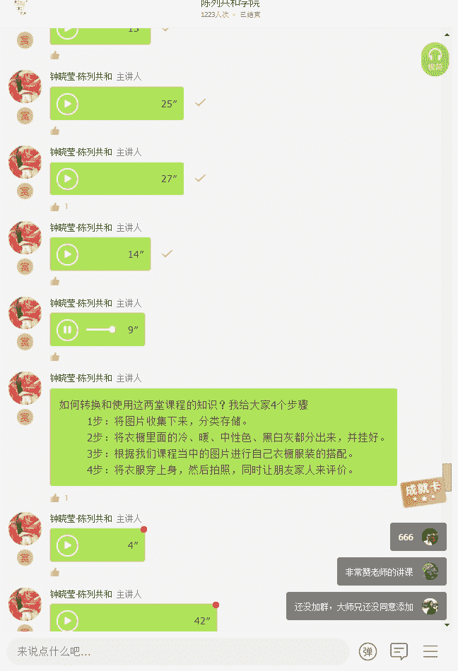

同样我将文字版发在这里，让大家看到了。

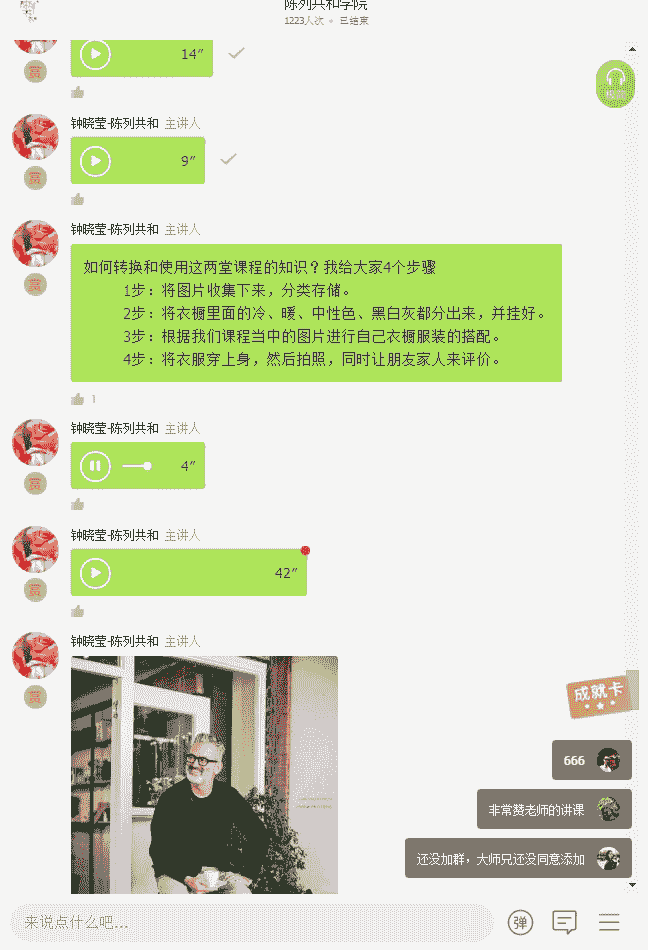

好了，之所以让大家这么去做完成这四个步骤的原因是。我认为学习是分为两个阶段的，也就是学加习这两个阶段。第一个阶段，我们学习接受理论知识的输入阶段。第二个阶段是我们使用实践的练习输出成果的阶段。

所以学和习这两个阶段必须是结合在一起用才行，才有才有什么才有收获。所以如果你仅仅只是接受了老师给你的理论知识的输入。但是你不去使用实践练习输出成果的话，那么你这个学习是没有效果的。

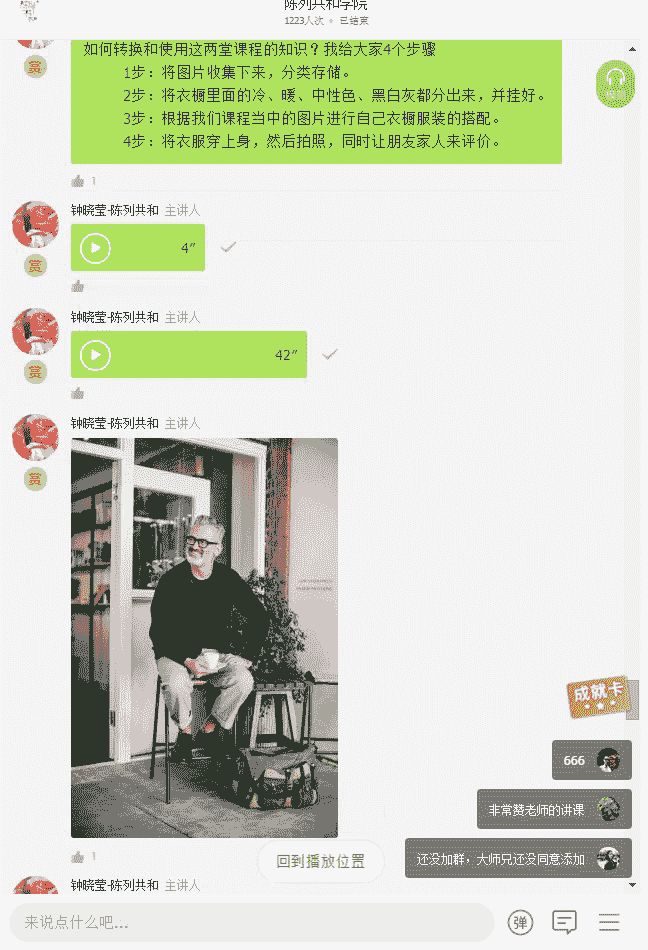

好了，伴随着这张又一个老男人的照片的出现，我们今天的所有的理论知识的内容，也包括我们的肤色以及服装色彩的冷暖色的分辨的内容就到这里了。也刚刚好做一个周的总结和周的结束。

接下来我们留5分钟的时间来在讨论区回答大家的问题，感谢大家的聆听。我相信这堂课的脉络是非常清楚的，所以我也希望大家不断的重复去听。因为一堂课其实我们听一遍跟听两遍跟听三遍，你的收获是完全不同的。

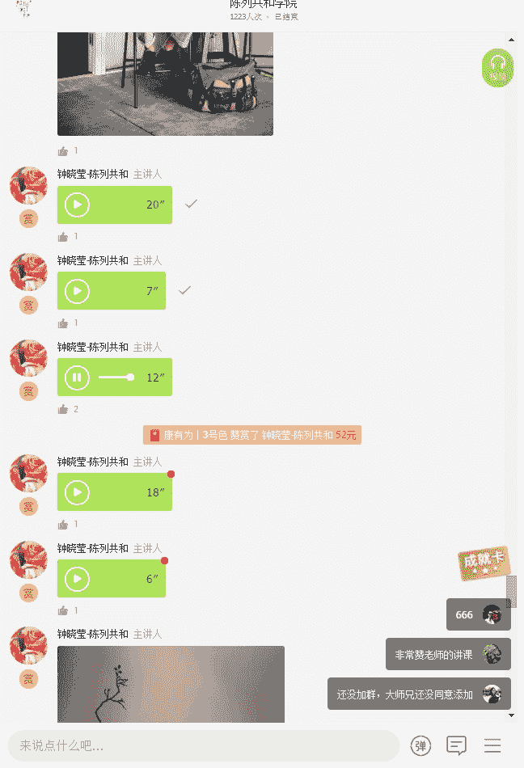

在课程的最后，我也祝福在课程当中的所有的同学，无论是男同学还是女同学，在这个周末可以出去逛街，可以出去买衣服，一定记住，洗很重要，一定要让自己动起来好吗？不然的话，我们学再多的内容都是没有效果的。

谢谢康有为同学给我的大赏，谢谢52，你们真的是对我太好了。😊。

啊，小芳问老师鞋子算不算三色原则以内，当然算啦。一般来说，男士的着装里面大家可以看到的就是他们一般都会采用上中下三色三者的呼应，而且这三个基本上全部使用的是什么？同一个色彩或者接近的色彩。

我现在发上来的这几张图，大家看到了吗？

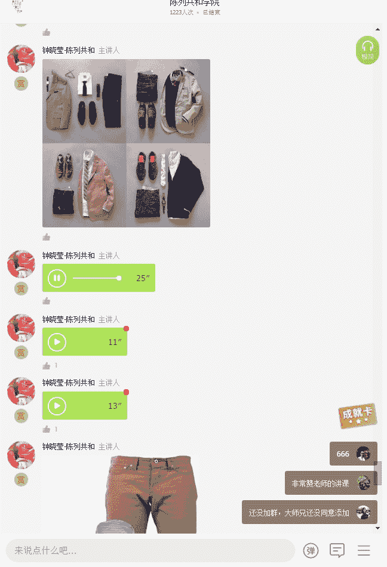

鞋子跟皮带跟裤子的颜色，鞋子跟裤子跟皮带的颜色，或者跟手表的颜色，三者之间是相互呼应的，也就是上中下。所以男士的穿衣搭配原则里面有一个非常关键的原则，就是三色原则，不超过三色原则。

还有另外一个关键的核心原则就是上中下的呼应原则。我们看到的这张图就是上中下的呼应原则。呃，就是呃比如说我的这个呃应该这么说，手表，我的皮带以及我的鞋子呼应了。如果你想显高，永远记住。

一定是鞋子跟裤子同色。

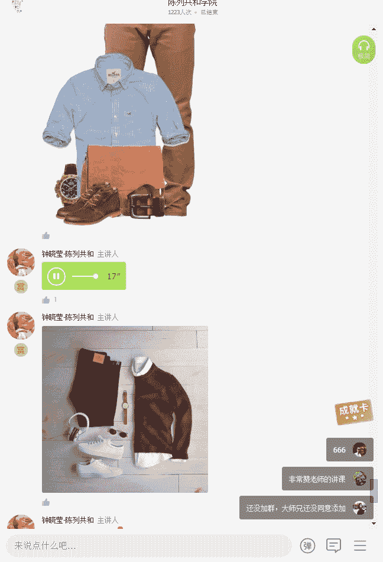

或同一色系。也可以用这样的呼应方法，就是衣服跟鞋子的呼应。然后中间皮带呢跟裤子的颜色走，所以一般男人来说会有3个。三条皮带，第一条黑，第二条卡其驼色或者咖啡色啊，第三条就是白色。当然你如果说讲究一点的。

应该有一条牛仔色。而且我建议大家一定要有两条皮带，至少要有两条，一条是正装，一条是休闲。其实最好是有呃4条皮带，两条正装，两条休闲。这个到时候我们在必备单品当中会跟大家慢慢的去讲哈。

好，有为啊，你说像我这种又黑又油又黄又黑，又瘦又高的，穿点花色或暖色。我个人不太建议你穿花色好，我看到了你的头像，我感觉好像你也没有说传说中那么黑那么油啊，我不太建议男士穿花色。

因为花色本身呃就比较难驾驭。对于亚洲男性来说，除非你有一个比较嗯张扬的气质。所以我建议有为，你可以选择一些，比如说你可以穿暖色，那呃我觉得其实也没也没有太大的关系，你可以不一定要穿很暖的。

比如说黄啊、橘红啊这种我是不太建议你穿的。为什么？因为你的个子在这里。如果你很高的话，你穿这种颜色会显得特别的打眼，而且这种打眼不是说你帅的打眼，而是你你丑的打眼，所以我建议你还是跟着冷色来走，好吗？

看冷色搭配的示范。

其实我特别想给我们广大的男同胞们一个信心哈。其实现在在中国穿的特别精致，特别得体的男士其实是不多的。所以只只需要我们稍稍的努力一下，你就会发现我们就能够做到那个20%的人。

所以我希望大家能够听完这堂课之后，真的要开始行动，行动才会有一切。

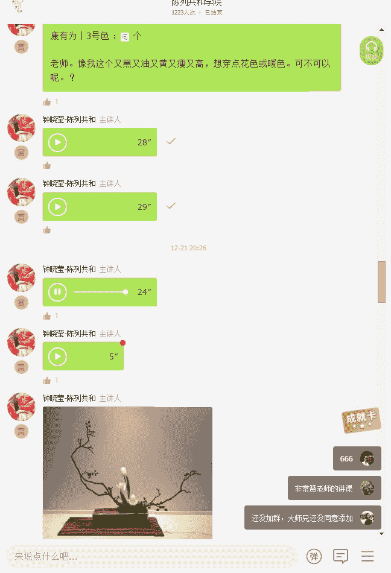

千万不要等到别人嫌弃我们了，我们再去改变，那时候就已经晚了。

好了，那我们今天回答问题的时间就到这里吧啊，我们下一堂课再见。那我们就把时间交给echo，然后让echo来告诉大家，接下来呃下一堂课的时间，以及提醒一下大家这个日期，好吗？那我们下一堂课再见哦。

在这里面提前祝大家冬至快乐，因为明天晚上就是冬至了，一年又要快要过去了。同时有很多很多北方的呃同学应该知道冬至在很多北方的家人眼里是呃冬至大过年的，所以我也希望大家明天过一个红红火火的冬至。

也希望来年大家不要动到耳朵，好吗？今天就到这里吧，谢谢大家的聆听，也感谢所有打赏给我的同学，非常非常的感谢，是你们让我们陈列共和变得更美好。在这里面我们特别愿意为你们做更多的服务。

