# 1、16男士衣品速成穿搭指南(完结）：第4课：男人基本款衣橱 必备单品和穿搭示范（一）：第4课：男人基本款衣橱 必备单品和穿搭示范（一）

大家假期好。先祝大家提前祝大家元旦快乐。应该是提前了两天哈，发上来了一张特别喜庆的图。我想我们非常非常期待我们中国的农历新年的。那我们先来过个小小的元旦。在假期期间，还在收听节目和收听课程的同学。

要给你们一些掌声。爱学习的人永远都不会被淘汰。好了，今天进入我们课程的主题，我们连续四堂课，应该是5堂课，全部都在讲我们男人的基本衣橱当中的必备单品的穿搭示范。我特别认同一句话。

就是我曾经还把这个标题作为我写过的一篇微信的文章的标题，就是干净整洁，比时髦更重要。其实一个人的外在不在于你穿了多少钱的衣服，而在于你这个人整体的形象带给别人的感受。

所以其实有很多时候我们怎么样能够让自己保持一个非常好的外形的形象的状态呢？那么这个跟我们是否拥有一个。整井仅有条和类别完整的衣橱是分不开的。我们一定常常会遇到这样的状况，无论是女人还是男人。

都会出现以下四种状况。第一，出门上班找不到衣服。第二，出差收拾行李非常费劲，特别是出差7天就想着这个搭配就很难。不知道这一件跟那件怎么搭。好，第三就是怎么搭，好像都不出彩。

第四就是模仿别人的搭配也模仿不来。之所以会出现这四种状况的原因是因为我们对自己的衣橱里面的类别完全不了解，甚至我们有什么样的衣服，有什么样的颜色，有什么样的款式，可能我们都是一无所知的。

因为基本上我们买完衣服回来之后，要么就折叠，要么就选挂。特别是大部分的呃，我相信大部分同学衣橱里面都是用折叠的方式的。如果你的衣橱里面全部都是以折叠为主，那基本上可以断定。

我们是很难找到衣服的那我们就更难知道我们有哪些衣服是可以互相组合搭配在一起的啦。我特意把这段文字。发上来让大家去看到，因为我担心大家理解不了那个服装类别的这两个字是什么？如果我们的服装类别不完整的话。

就会出现这以下是四种状况了。大家对号入座一下，看看有没有这种状况发生呢。好了，那么我们之所以会在花4到5堂课的时间来去跟大家去讲男人的基本款衣橱。那么也就代表了这个是非常重要的关键的。

影响了我们的外在形象和我们的搭配的一个关键点呢。所以接下来我们要看看什么是我们如何去打造一个基本款的衣橱。在这里面我想在进入每一个单品的类别之前，我想跟大家讲讲三个关键点。首先第一个关键点。

就是我们要了解什么是一个完整的衣橱。在这里谢谢大家给我的打赏，感谢你们感谢你们一直守候在陈列共和的直播间。😊，你们打赏的这个钱应该够我今天中午吃椰子鸡了啊。

好啊，那什么为之一个完整的衣橱呢？一个完整的衣橱必须具备三个特点。第一，任何一件单品都可以和其他三件单品搭配在一起。第二。无论生活当中的什么场景，是休闲还是工作，还是旅行还是运动，还是晚宴。

都可以在衣橱里面找到合适的搭配。第三就是整体的服装风格和色彩，都能够反映出你自己独特的风格。

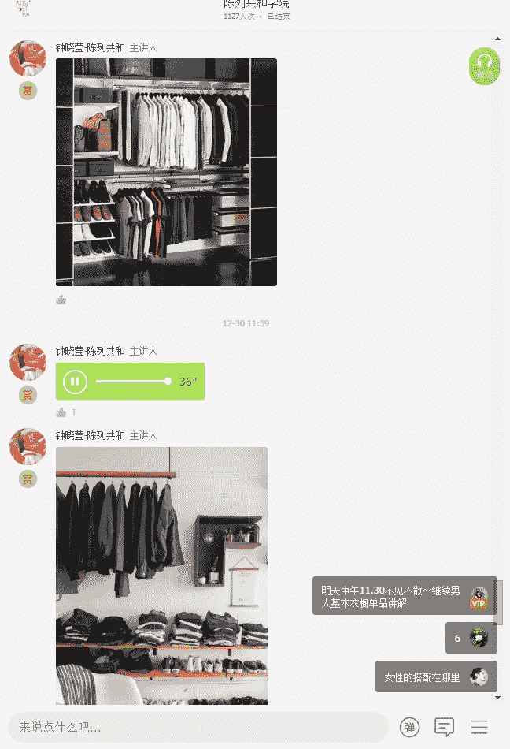

所以我现在给大家看到的是一些男士的国外的精英男士的衣橱。

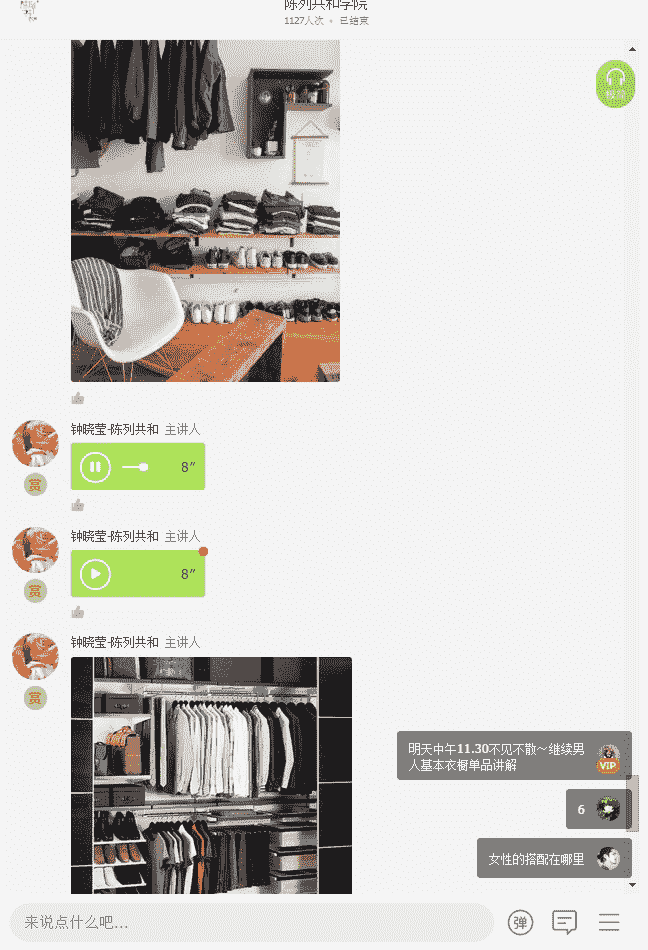

我想问一下大家，你们家的衣橱今天下完课之后就拍照上传一下吧。

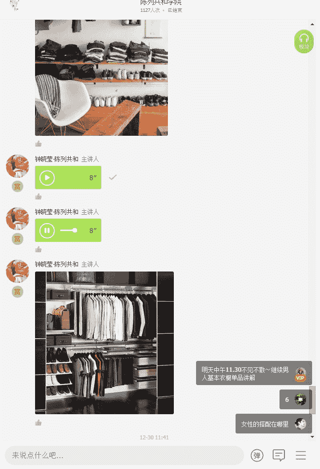

拍照发到微信群里面看让大家来互相点评一下，看看谁的衣橱整理的是最好的。我现在发上来的这个这个其实这个衣橱就非常的好识别，为什么呢？因为他所有的衣服基本上全部都是悬挂出来的。然后他的T恤，他的裤子。

他的衬衣，包括他的西服，而且你有没有发现他的衣服的厚薄。从内到外是不是从左到右的顺序？那我们的衣橱呢？我们的衣橱可能都是乱的。比如说乱塞乱放，然后一段时间不整理，就像一个狗窝一样的。

我记得我弟的衣橱就是这样子的。每次我小时候我记得我妈妈帮她整理完之后，没有两天，他基本上又翻乱了。为什么？因为在这个当中里面，他没有建立逻辑和规律。其实我们在搭配的时候，你会发现。

搭配的规律就是我们整理衣橱的规律。我们穿衣服是不是肯定不不可能先把外套穿了，再穿内搭，对不对？所以我们一定是先穿内内搭里面的T恤，毛衣再加外套，然后裤子再加皮带，对吗？袜子再穿鞋。

所以基本上是这样的逻辑的。所以呢我们一般会从左到右开始，这样的一个顺序来整理我们的衣橱，这样的衣橱就是非常完备，也是非常易找的。

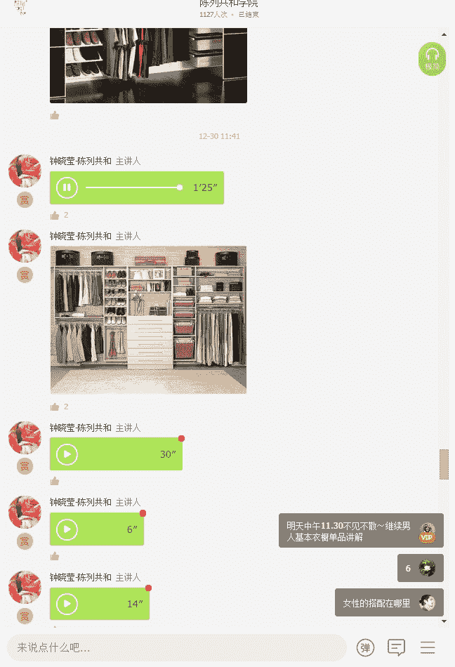

比如说像这样的衣橱也是非常方便的。当然我们中国人是不可能把鞋子放在衣柜里的那比如说把鞋子放在衣柜里面，通常都是呃比如说他们基本上这个鞋子是不会穿出门的可能都是在房间地毯里面走动的那我们在国国内是很少。

基本上没有男人会这样做，女人也很少。因为这样地一不干净。但是我们要学习的是他们的侧挂，以及他们的折叠以及他们放配饰的一些方式。在这里我想问一下大家，你们家的衣橱侧挂多的还是折叠多？好了。

那接下来我们就讲到如何打造我们基本款衣橱的第二大方法，就是买衣服的五大基本原则。买衣服的五大基本原则。好了，接下来我们要讲到的就是打造我们基本款衣橱的第二个关键点。

就是我们要学会买衣服的五大基本原则是什么？好了，接下来我们要讲到的就是我们打造基本款衣橱当中的四个基本原则。我刚刚说错了，我说成了5个啊，只有4个基本原则。衣橱的四大基本原则。第一。

第一个原则就是买衣要做什么减法，并不是说你买越多越好的，而是说你在买每件衣服的时候，你都要思考跟我家里那个衣橱里面的其他的衣服怎么单品是怎么去搭配的呢？如果没有就不要买了。

第二个就考虑到这个什么跨季节穿衣的衣服的购买。比如说你可以买一些牛津布的衬衣啊，然后你可以买一些牛仔布的衬衣，你可以买一些牛仔裤，或者是一些基本款的圆领T恤，或者是一些呃比如说薄一点的羊绒的针织衫呢。

这种都是属于可以跨季节穿着的。最起码你可以跨两个季，甚至。有些衣服是可以跨三个季的，甚至有些衣服是四季都适用的。比如说我们待会会讲到的这种圆领的。无领的无色的这种白黑或者是素色的T恤。好。

那第三个呢就是购买大件的时候呢，要舍得花钱，不要去想说我在买大件的时候呃，抠着抠着省一点，然后买多一点。不是的，所谓的大件就是大衣风衣，这些这就是大件。好，那第四个呢就是买鞋子和皮带的时候。

一定建议大家要买真皮，不要贪便宜，情愿要贵一点。毕竟。你这个使用的周期会比服装的时间要长很多。好了，以上就是我给大家出来的四个基本原则，就是衣除的四个基本原则。好了。

那接下来呢我需要大家一起来帮助我做到这一点，就是对我们的衣橱进行断舍离。这个好难好难，特别是对于我们女人，我觉得男人其实呃是可以的。为什么？因为你们的量级跟我们的量级是不一样的。可能你都没有试过呃。

我看看我待会要不要公开我的衣橱啊，我有几十条牛仔裤。那给大家看到的话，大家也是晕倒的。所以我觉得其实对于衣橱进行断舍离是非常非常关键的。😊，Yeah。断舍梨的发明者商山下因子女士曾经说过一句话，她说。

人类一直在获得和放手的循环往复中螺旋式的前进。断舍离是一种从扔东西开始的训练，让你觉察到自己的欲望是过头的还是不足。如果你连一件东西的存在都忘光了，那根本就提不上什么爱惜它了。

所以接下来呢我们要将衣服分为三个框啊，你拿出三个框来，将上面贴上，比如说第一个框写上丢弃，准备要捐出去的。第二个框写上暂留，表示我有犹豫的。第三个框。上面写着储藏代表了他不是当季的。

这是我们要走出断舍离的第一步，也就是将衣服分为丢弃、暂留和储藏。就是我们面对我们自己这么多的衣服的时候，我们该如何去检索，如何去思考到底哪些东西要留下呢？那记住哦，问自己接下来四个问题。

盈盈这个就是需要断舍一个，跟我一样啊。其实我们会穿的衣服，其实也就最多去到20%常穿的。你会发现有时候我们特别愿意去穿一些特别熟悉的，不会出错的一些衣服。所以接下来我们要问自己四个问题。哪四个问题呢？

第一，我有多久没有穿过这件单品了？第二，我喜欢它的程度有70%吗？第三，我现在的身材，这件衣服还适合我吗？第四，这件衣服的风格是否已经过时了吗？还适合我吗？问完自己这四个问题之后，就将衣服放进。

丢弃暂留和储藏当中。比如说我如果说我已经两年没有穿过这件单品了，那也就代表了，我可能根本就不记得它的存在了，那我一定会把它放在丢弃的那个框里面。但如果我说我大概只有一个月或3个月没有穿过这件单品。

但是我喜欢它的程度有70%。那可能是现在因为我胖了，我没有办法穿它，那可能我就会放它放在暂留的这个框里。那接下来有一些呢是不适合现在这个季节的，比如说一些夏季的很薄的款式，那一些很鲜艳的一些颜色。

可能我们就把它放在呃当储当季储不是当季的这个储藏的这个框里。这是第一步，就是你要先把它。放出三个框来。第二步就是紧跟着问自己四个问题。永远记住，所谓的断舍离失让你舍弃掉一些你不需要的东西。

这时候你的房间，你的空间，你的呃你的整个的一个衣橱里面才会有空间去迎接一些新的类别。因为接下来我就会跟大家去讲到男装衣橱当中的必备类别。我会先跟大家梳理一个基本的类别的脉络。

最后呢我们会利用这五节课的时间，一一跟大家去讲到它的搭配，以及它的搭配禁忌。

我一直都遵循一个原原则，所谓的搭配就是你必须要多看多练以及多模仿。永远记住，我们要通过不断的对我们自己衣橱里面的衣服进行筛选，当下的自己就会就会发现越来越鲜明的风格就会出现在我们自己面前。

这个时候我们才会知道到底是什么东西是适合我们的，而什么东西是不适合我们的人最可怕的就是限于纠结。所谓的纠结的原因是因为你根本不清楚自己适合什么和不适合什么，这个时候你才会纠结。

那你说像我我是非常清楚我自己要什么，不要什么，喜欢什么，不喜欢什么，适合什么，不适合什么。所以我任何时候我买衣服都是当机立断的。不适合我的，我根本就不会花时间去看它。我觉得有一句话特别好。😔。

他是这么说的，他说所有纠结的烦恼都来自于过去对自己的不忠诚。我举个例子好了，比如说点餐，你是自己想吃什么，然后去点什么呢？还是说大家说什么好吃，去点什么，就这么样的一个小事情。

有时候我们都不能对自己很忠诚，反而会去迎合别人的视角，活在别人的意见里。结果每一次你有没有发现，我们听别人去点的都不好吃。我们自己去坚持点的都好吃。有很多时候我们穿衣服也是一样的。

所以你听谁的意见非常的重要。如果你听到了不对的人的意见，他只会让你徒增烦恼。所以我希望大家学完这堂男装课之后，对大家最根基本的要求，就是去动去做，一定记住多看多练习，多模仿，多看多练习，多模仿。

最终才能够提升你的衣品啊。好了，所以接下来呢我希望大家今天听完课程结束之后，马上去动手做一件事情，就是整理自己的衣橱，将自己的衣橱按照我接下来给到大家的1个类别，把它分别分辨出来。

把一些完全不需要的丢掉。当然你也可以听完我讲这些课程之后再丢。但是其实有一些是很明显的，你一年到一年半以上都没有穿过的。我建议你真的要把它淘汰掉。除非它是过季的啊。我想问一下大家。

在我们现在群里有多少个人可以做到，做到的请举手。好了，这就是我跟我跟大家讲到的如何打造我们的基本衣橱的部分的总结。这个部分我们就用这句话来做这个总结。接下来我会跟大家去讲到男装基本款的单品的11种单品。

记住，我不是今天就把这11种单品讲完，讲完了大家也吸收不了。我今天首先第一个我会讲一个单品。就是讲到我待会会讲到的第一个单品，但是我会给大家先把所有的这个单品全部都讲一遍，它是什么名字。

接下来好方便你们待会趁着这两天假期去整理你的衣橱。首先第一个单品。T恤。T恤里面又分为了长袖T恤，短袖T恤。第二个单品叫衬衣。衬衣里面分为正式衬衣和休闲衬衣。第三，修身西服。第四，休闲西服。

这个休身西服应该就是括弧正式西服。好，第五就是质地优良的西裤。第六，毛衣毛衣里面又分为个kisme羊绒毛衣，薄羊毛毛衣。好，那当然还会有一种叫做针织衫，我也把它放在了毛衣这个位置。好吧，第七个就是大衣。

大衣这里面呢会分为呢子大衣或者是平绒大衣。好，第八个就是风衣，风衣里面会分为长风衣和短风衣。第九个就是鞋子，鞋子分为上班鞋、休闲鞋、运动鞋。

那当然在运动鞋里面可能还会分为跑步鞋、高尔夫鞋或者是恬径的劲跑鞋等等，这就要看你平时热爱什么样的运动啊。比如说还有一些人会穿羽毛球鞋。好，第十个就是配饰。而。

这第1个配饰里面我们分别会罗列围巾、手表、腰带袜子。好，以上就是我给大家讲到的男装基本款单品当中的10个类别。第一T恤。第二，衬衣。第三，正式的修身西服。第四，休闲西服。第五，质地优良的西裤。

第六毛衣第七大衣第八风衣，第九鞋子第十配饰。当然我们还可以增加一个环节就是第十1，那这个第十1是什么？就是牛仔裤。但是我为什么没有把牛仔裤放在里面呢？

因为我认为很多人应该有90%人都是拥有牛仔裤这个单品的。好了，我相信大家都已经get到了。那么我们今天时间的原因，我们只讲一个单品，就是跟大家来讲讲T恤、长袖T和短袖T。长袖T和短袖T都长袖T分为两种。

一种是圆领，一种是高领。短袖T基本上全部都是分为两种圆领或者是V领。好，那所谓的长袖T和短袖T呢都是可以外穿，也可以做内搭的那为什么会讲到短袖T呢？

因为其实现在有很多讲究的男士穿衬衣的时候或者是穿毛衣的时候，都喜欢用白色的短袖T做衬衣的打底，一来是避免出汗时候让衬衣湿掉，很尴尬好的，贴身了都太性感了。第二就是大多数人都是在冷气空间里面工作。

有助于保暖啊，保证三点不露。好，大家来看到这个男神，这个男神是谁呢？应该就是贝克汉姆了。大家可以看到一个人的整体的搭配着装，特别是在秋冬的时候，我们看到的很多时候是不是全部都是由内。

T恤来做基本的开始的就是那件黑色的T恤，对吗？外面再造一件针织衫，在外面再套一件外套。而这个外套有可能是风衣，有可能是夹克，有可能是大衣。所以我们才会从第一个类别是T恤开始讲起。我想问一下大家。

大家看到贝克汉姆这张图的时候，我们在旁边给他进行分解的时候，大家有没有感觉？其实这就是搭配。所谓的搭配就是运用一件单品，你去找到跟它相关联，可以搭配一起走出来，一起搭在你身上的衣服的这样子的一个感觉。

就叫做搭配。搭配一定是两件以上的衣服在一起进行的一个活动。好啊，大家现在看到的就是T恤的长袖T，圆领T和高领T。当然也有一种T是V领，但是V领T建议大家不要单穿，一般都会用来做家居服。

或者是做一些打底或者是衬衣的一些内搭。

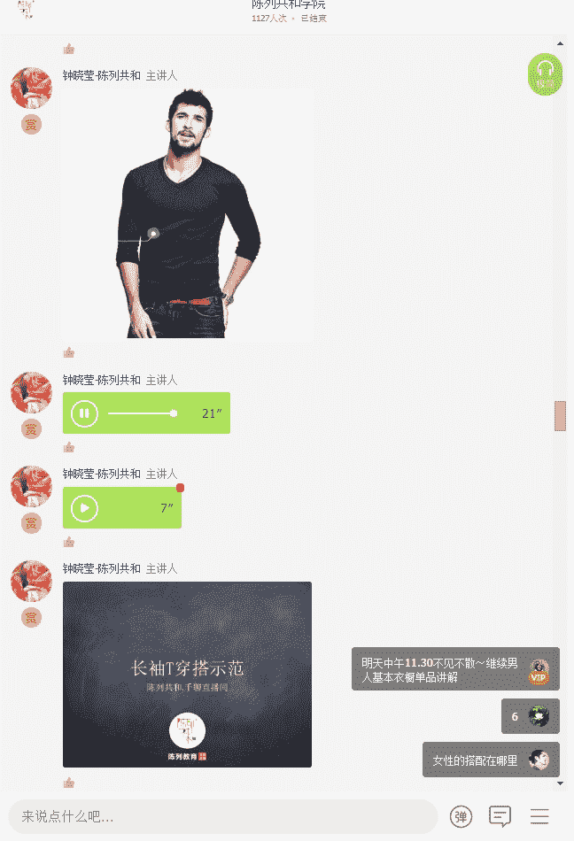

最常穿和最实用的这秋冬季节，一定是圆领和高领。

好了，我们现在来给大家看到长袖T恤的搭配示范，给大家看一下乔教主搭配的最好的。从好像是9几年还零几年开始，一直穿到他去世，一直都是这件黑T加牛仔裤。

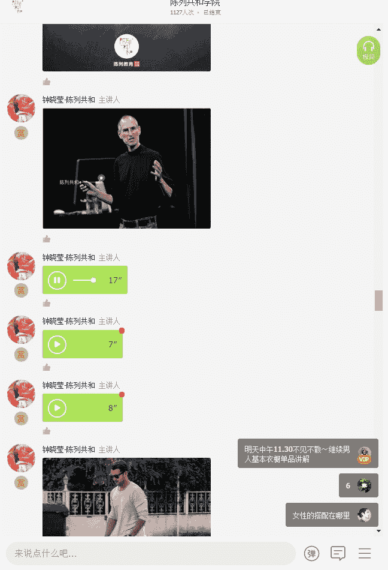

这就是个人风格的形成。我曾经说过，所谓的风格就是耐得住寂寞的坚持。

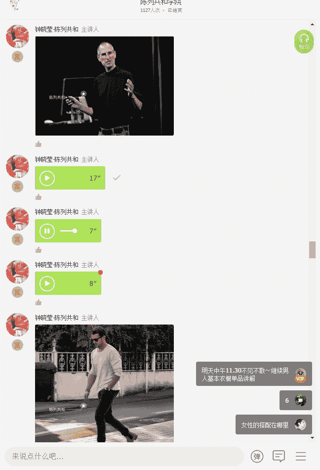

T恤的选择里面对于男士来说，无非就是黑白灰卡其。还有条纹。

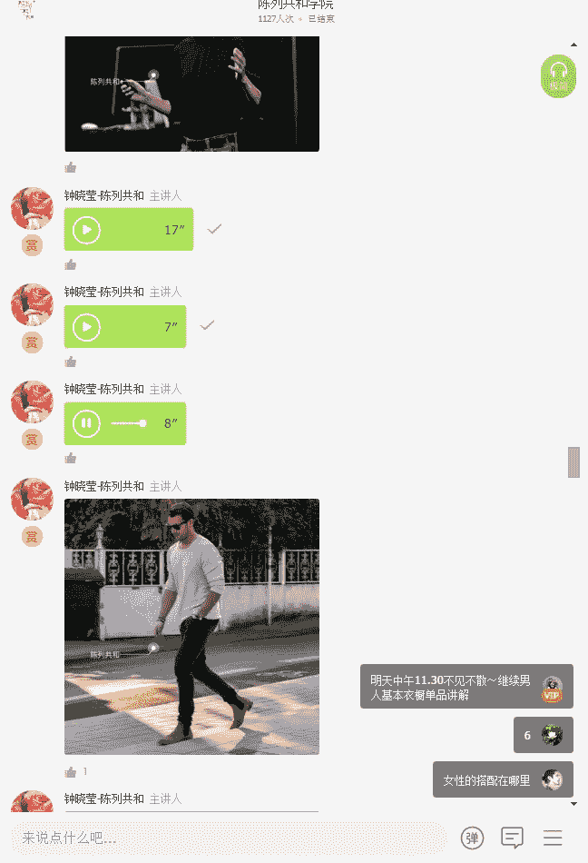

所以你如果有经济基础的话，其实是完全可以配齐的。黑白灰。卡齿。

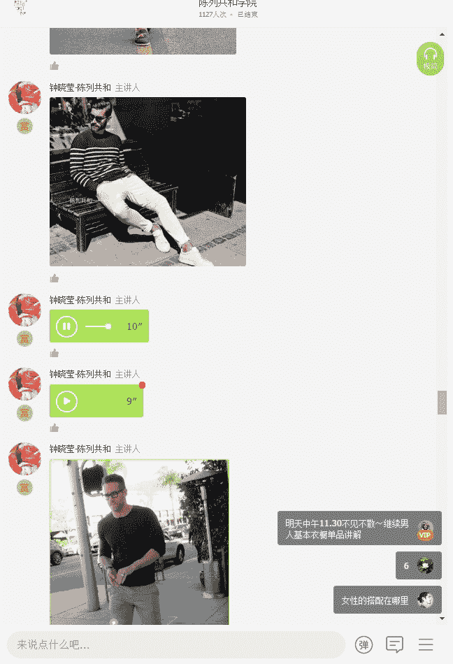

条纹。条纹是相对于其他三个颜色来说，最休闲，最容易穿出这种假日感的这种搭配。

那当然了，因为这些衣服的基本色全部都是黑灰白卡其条纹，所以基本上夏装也是以深色或者是牛仔，又或者是卡其色为主，又或者是黑配黑白配白全白。但是我建议如果你没有拥有特别男神的气质，千万不要白配白。

如果你的身材不是特别的完美，你也不要浅色配浅色，尽量建议大家上浅下深，上浅下深，又或者是牛仔裤来搭配所有的这种长袖的T恤都是非常好配的那如果你想显高个。那我建议他你配全身黑色或全身灰色也不错。

好，接下来我会给大家看几个平铺的搭配图。在这个平铺的搭配图里面，大家就能够看得出每一个单品互相之间的这种关系。大家可以看到白T黑T条纹T灰T他们互互相之间是怎么样去搭配的。

我非常建议大家一定要将这些图存下来。为什么？因为你接下来没有搭配灵感的时候，你唯一能做的最高效和最快速的方法就是找出我们这堂课，男士一品提升的这堂课成列共和出品的这堂课当中，所有存下来的图。

把它变成一个图册。下次没有灵感，你就从这里去找灵感，这是最快的方法。

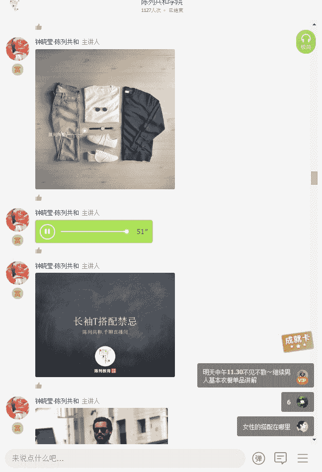

好，OK在这里面呢，我觉得不仅仅要让大家看到这个搭配的好，还要看到搭配的禁忌是什么。首先第一点我特别特别建议大家的就是不要把上衣穿的太长，因为穿的太长，一定会让你整个人变得很矮。就是第一个点就是记长。

不要太长。第二个呢就是系紧，不要穿的太紧。第三个就不是要穿的太薄，因为太薄容易露点，露点之后感觉就特别的尴尬。第四个就是不要穿这种口袋很明显在上面出现的拼接款，建议大家全部买基本款。我这样说。

大家get到了吗？搭配的时候，我们采用的是同一个色系，或者是上浅下深的搭配。T恤的穿着一定记住，不能够露出特别明显的胸线啊，男士的这种T恤一定比如说你的身材如果特别健硕，你一定记住。

你不要穿的跟健身教练一样。一出来，人家一看你就觉得你这是搞健身的嘛，这多尴尬。永远记住，我们在这个课堂当中强调的穿衣原则是得体，同时符合大众审美。我们要的不是标新立异的个性审美。

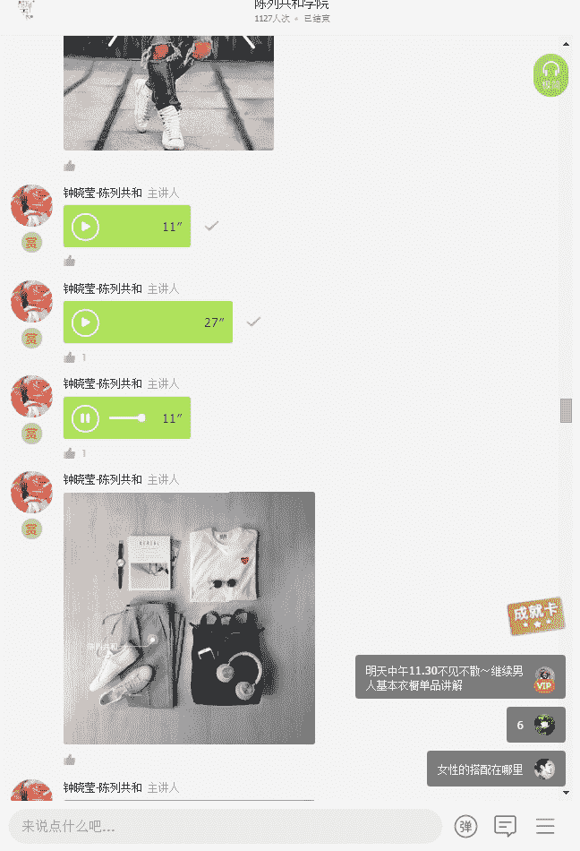

那我们刚刚也给大家看到了几个搭配的图示。比如说如果我穿的是白色的T恤，那么可能我脚下的这双鞋子就呼应白色。那如果我穿的是黑色的T恤，我脚下的这双鞋子可能呼应的就是黑色。

那当然呢有很多时候可能我们用两件T恤叠穿。比如说白的穿在里面，军绿色穿在外面，但是呢我们会露出一点白边，那么这个时候我们也会穿白鞋。在这里面推荐大家搭配的方式，其实精致一点的呃，稍微合体一点的T恤。

其实是可以搭配西裤的。但是你的西裤一定要露脚踝。那如果是宽松一点的，可以配卡其色，也可以用来配什么牛仔裤。

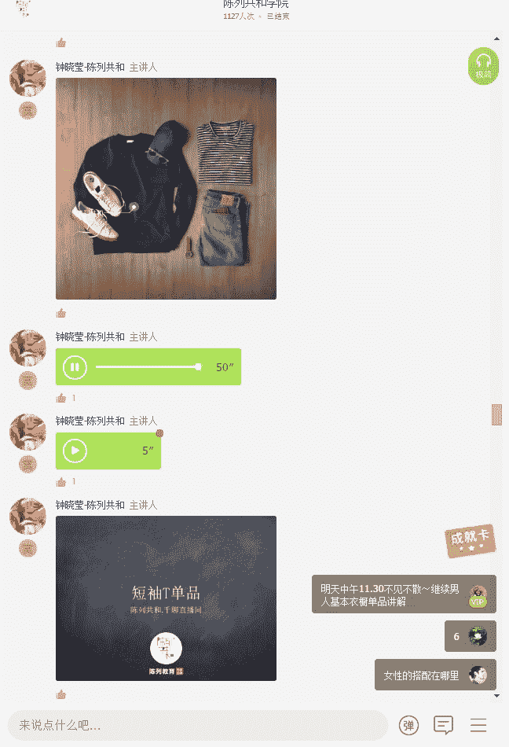

好了，以上就是长袖T的给大家的一个介绍。

OK我们接下来看到短袖T的单品。首先短袖T什么叫短袖T呢？就是这种短袖圆领T。

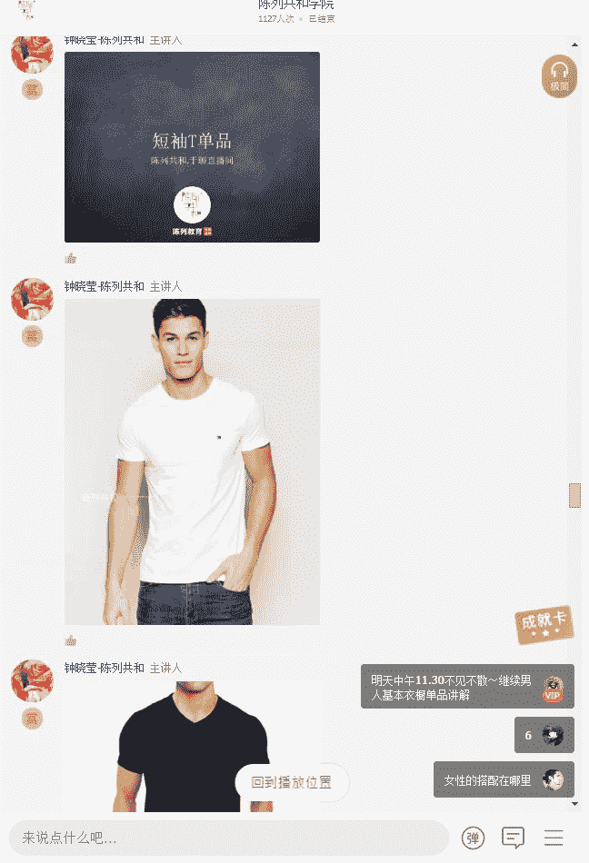

啊，短袖V领T有黑有白。

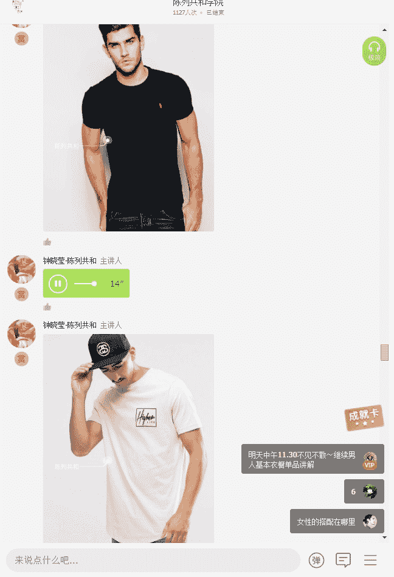

我现在给大家看到的这三件都可以作为搭配衬衣的款式。那接下来这种宽大的这种拼接的啊，这种肩部和肩和臂部有线条和拼接的就不适合做内搭的，这种适合单穿。一定记住，如果你是个子偏矮的男生或者是个子偏瘦的男生。

你都需要用T恤来增加你搭配的层次感。那么接下来就给大家看到短袖T的穿搭示范。

我们先来看单品短袖T怎么搭。

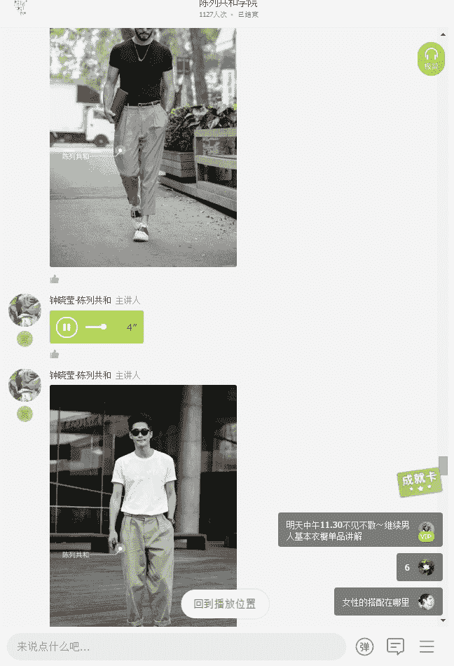

这就是单品短袖题。那当然还有这种套穿的方法，这种套穿的方法是现在目前来说非常流行的一种搭配的方式。我相信很多同学都会这么去穿着。

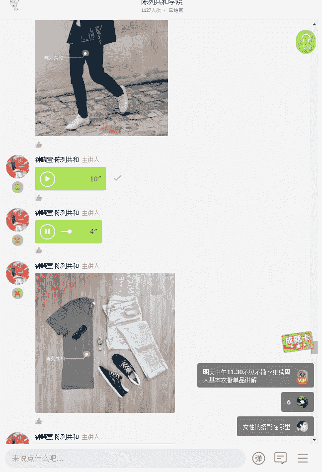

又或者用这种单品的短袖T来搭牛仔裤，搭卡其色的裤子，又或者搭黑色的裤子。

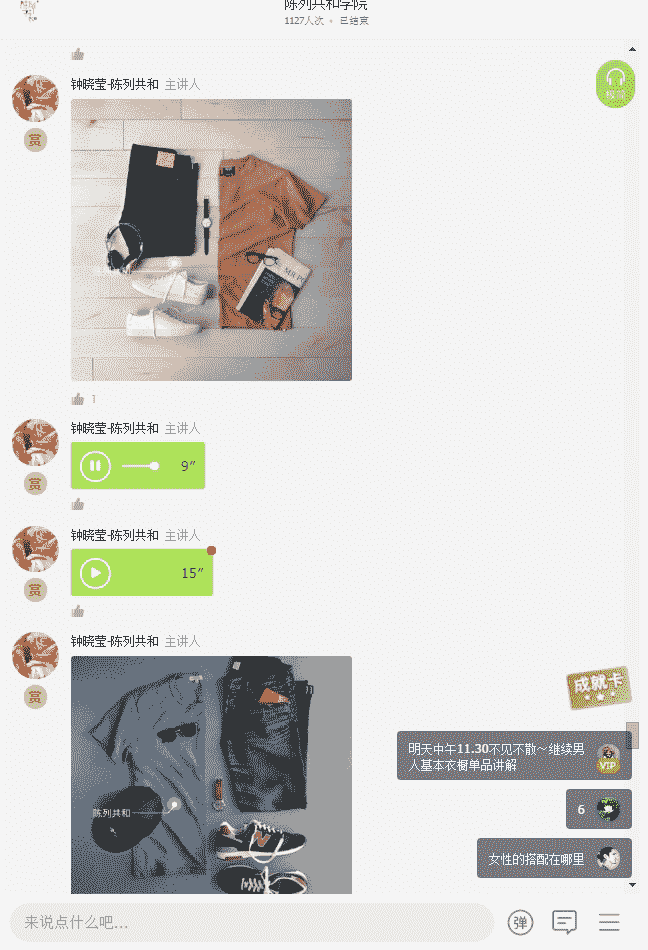

你永远记住，所有的搭配里面都讲求呼应。上下色彩的呼应。上衣皮带、鞋子的呼应，那男士来说基本上都是上衣和鞋子的呼应。

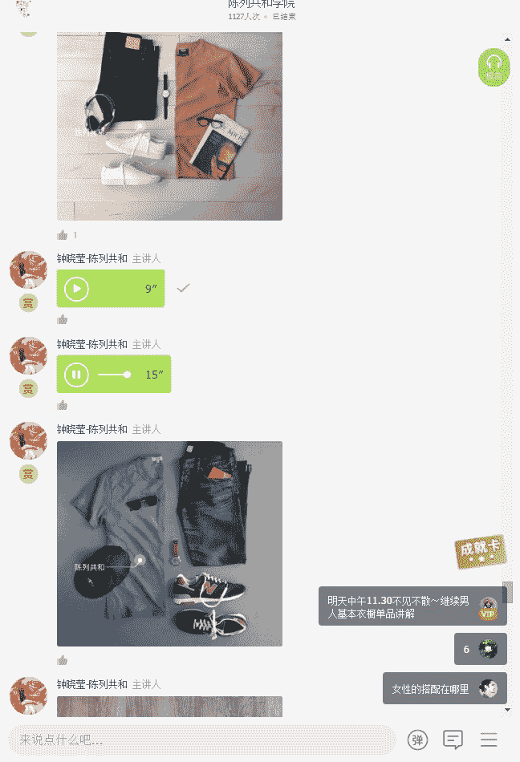

我们在这里面所讲到的短袖T并不局限于白色啊，它会有灰，会有蓝，会有条纹，然后它会有黑，它会有军绿，它甚至还会有这种卡其色，甚至它还会有这种蓝色啊，这种蓝色，我在这里面都把图找出来给大家看，其实记住啊。

因为这是一堂线上课，我们没有办法一对一面对面的看到大家，所以呢我们在这里面给大家提供的图片呢，大家一定尽可能的去尝试。但是你一定记住一个原则在穿着的时候，如果你想要自己显高。

就采用两色或者一色的搭配方式。如果你想让自己的腿显得比较长，你就记住让你的裤子和你的鞋子中间露出脚踝。如果你想的让自己显得更加健硕，那是没有其他的方法。就必须是健身了。

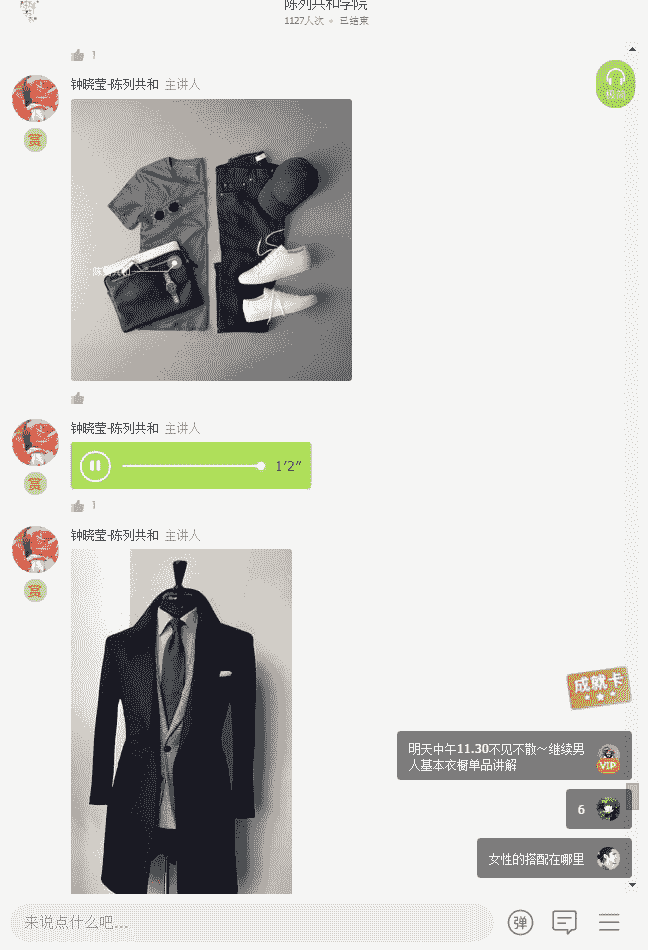

那我们刚刚也说过了，短袖T还有一种非常重要的一个功能，就是用来搭配西服的时候，用来做这种什么打底型的。搭配比如说像男人有很多时候，比如说像呃穿西服啊，或者是穿衬衣的时候。

可能他都会在那个衣服里面去增加这样的一个打底。就是说刚刚我们看到贝克汉姆，其实他也是加了一件T恤在里面跟毛衣跟外套进行了一个组合的搭配。

好了，接下来我们最后在这堂课当中给大家讲到短袖T恤搭配的什么禁忌。

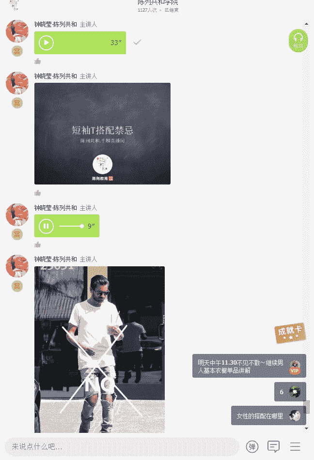

第一个还是不要过长。这个男士其实这套衣服真的很奇怪。首先第一个衣服太长，第二个裤子中间膝盖太破。

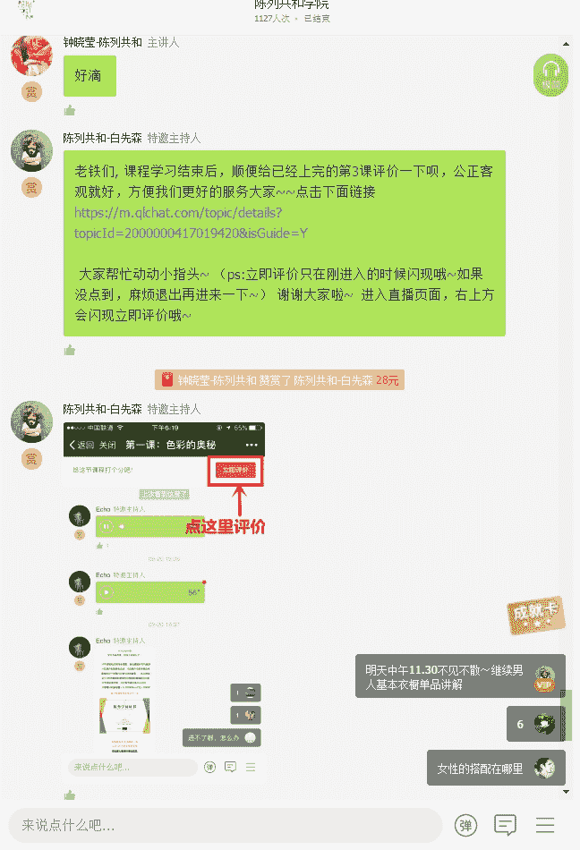

大家有没有看到这个男士啊，你记住啊，T恤是不可以长于外套的，T恤不可以长于外套。当你这么穿的时候，下面的裤子还那么紧，你能把自己从一米8米穿成1。7米的身高，你知道吗？

还有就是不要去随便穿这种奇怪图案的T恤啊，还有男人就是如果你跟女人约会的时候，千万不要穿米奇。这种卡通的图案会让人比觉得你特别的幼稚。

当然还有就是面料不要太薄。如果你穿的这件T恤，面料很薄的话，一定记住做一个什么样的事情，就是在外面加一件外套。加一件牛仔衬衣或者是加一件薄的休闲衬衣都是可以的。

比如说像这个就是里面是一件白T，外面是一件黑色的衬衣，休闲的那你们发现他的那个那双纽巴伦的鞋子，就跟他上衣的这个黑色呼应了。

大家看到了吗？这就是T恤跟衬衣之间的这种互动。当然我们在明天会详细跟大家再去讲解衬衣的搭配。那么我们今天所讲到的类别，只讲一个就是T恤，跟大家分享了T恤的单品，以及T恤的最佳搭配示范。

还有跟大家讲到了它的竞忌搭配示范。

好，最后我给大家特别提示一下三个点。第一。身上的颜色不要超过三种。第二，色彩搭配讲究呼应，而男士的搭配呼应主要是来自于上衣和鞋子和皮带的呼应。好，第三，买衣服的时候先选好款式再选色彩。那永远记住。

男人不是靠什么，不是靠这种艳丽来打动别人的，你靠的是稳重，无论是任何一个年龄，除非你是儿童，你需要靠彩色缤纷的衣服去吸引别人。不然的话，你买衣服的时候一定记住，先选款再选色。色不是最重要的。

色只需要记住，选择一些适合你这个场合的颜色就可以了。

好了，今天的结束。我想用一句话来做结束，就是所谓的品味就是不过度用力。所谓的品味就是不过度用力。

好，那么我们今天的课程就到这里了。接下来留5分钟的时间给大家在讨论区里面问问题好吗？感谢大家的聆听。我们明天中午还是这个时间11点半。

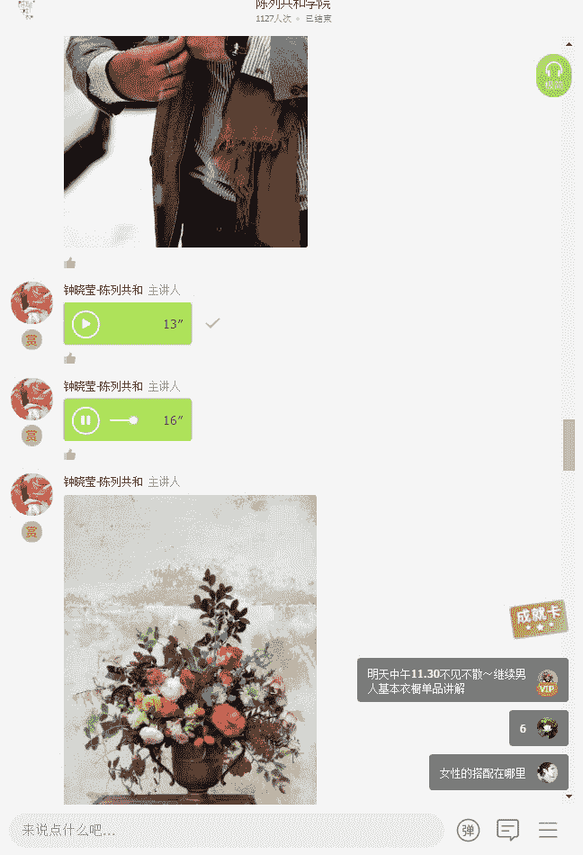

不见不散。好的，谢谢老师的精彩分享。😊，哇哦，感谢大家的打赏，谢谢你们，感谢感谢，打赏总是令人心情愉悦的哈。😊，好，谢谢康有为先生的52，谢谢莹莹的打赏。还有谢谢呃lesslie是吗？

是叫lesslie的打赏吗？😊，呃，有为，你这个应该是属于店铺的陈列和店铺产品类别调整的问题，呃，不属于这个男装搭配的问题。

卖袜子卖单品袜子一定不会需要你从头到脚去帮客人搭配啊，不需要的袜子单品袜子的陈列，只需要展现出你的产品的特点，以及你能够帮助顾客完成什么样的一个搭配的示范，而这个搭配可以是图片。

可以是局部的鞋子和袜子的搭配。比如说你可能是有切尔西的鞋子，有布克的鞋子，有运动鞋，有呃这种板鞋，它不同的鞋子搭配不同的袜子，这个其实只需要给顾客一个搭配的场景就好了。而不是去考虑说我卖袜子。

我得把全身都配齐，这不就本末倒置了吗？

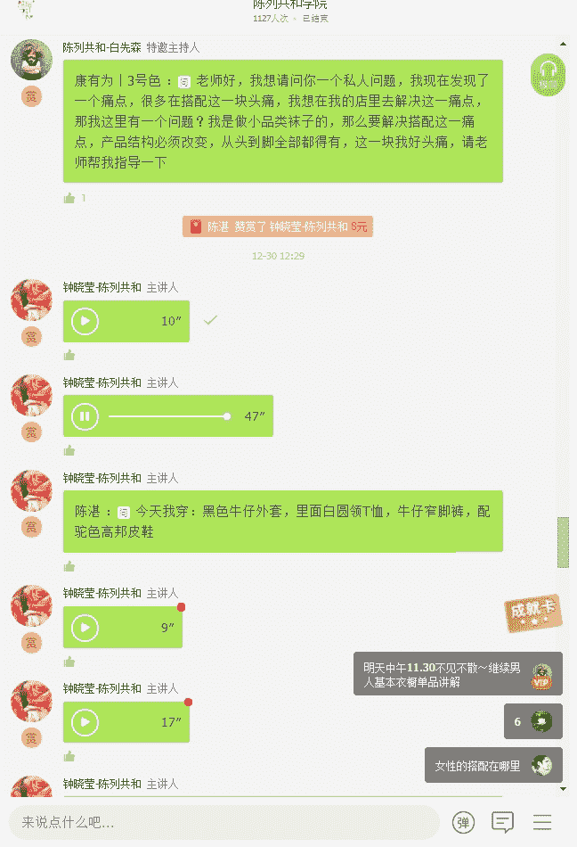

陈站，你今天就已经有4个色了，黑色、白色、牛仔色以及驼色。呃，不知道你现在穿着的感觉是怎样。那如果可以的话，你的牛仔裤如果是黑色就没有问题。如果你的牛仔裤不是黑色，是蓝色。

那么也就代表了你的那个驼色的高帮皮鞋就要换成黑色。呃，有为，你看一下莹莹这边已经给出了顾客的心生的答案，啊，袜子对于男士是很重要的。皮鞋穿袜子啊，运动的袜子，然后长班、短帮等等呃，单品都不一样。

在日本就有专门的这种男装袜子店，女装袜子店。所以袜子对于一个人的这个搭配的品味的提升也是很关键的。多去观察顾客的穿着，多去看一些时尚的杂志，多去观察一下街头，看看人们都是怎么穿的。永远记住。

不要去满足顾客的需求。你要的是引领顾客的需求。有很多时候顾客没有看到这个东西，他是不知道自己需要的。好了，那大家就去开始整理自己的衣橱吧，男士整理自己的女士帮老公去做整理。

然后到时候可以在群里去发一下哦。好了，祝大家午餐愉快。我们今天的课程就到这里，我们明天11点半再见。好的，感谢老师的回答。同时也感谢老铁们对陈列共和一如既往的支持。嗯，和往常一样。

然后这边的话大白先分享一下我自己的课堂笔记。

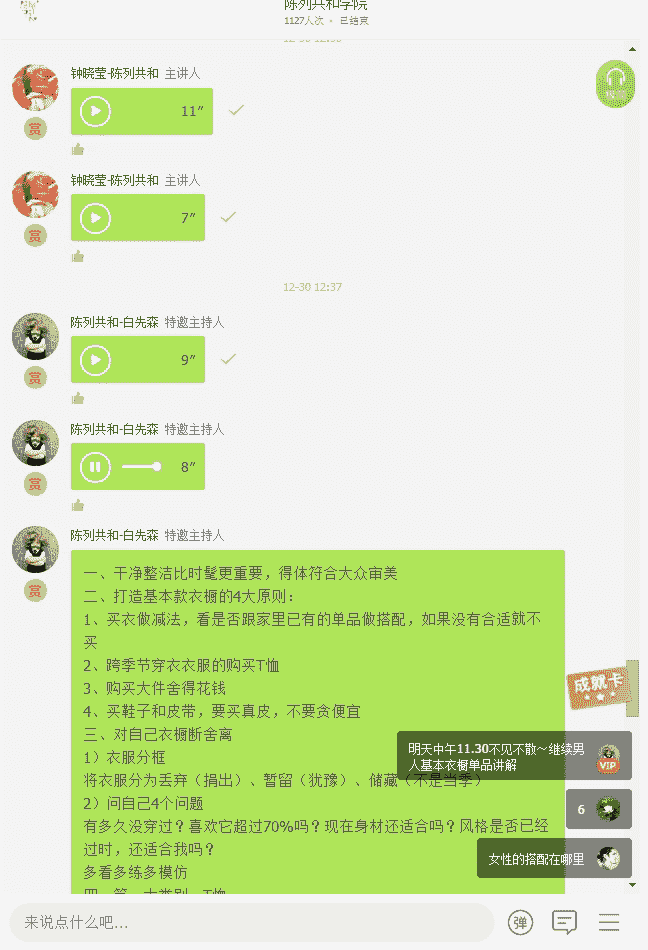

好的，然后给老铁们做一个温馨提示，明天中午11点半继续在直播间不见不散。第五节课，然后继续我们下面的。单品老师讲解。

OK最后一件事呢，就是麻烦各位老铁就是给我们的课程做一个客观。

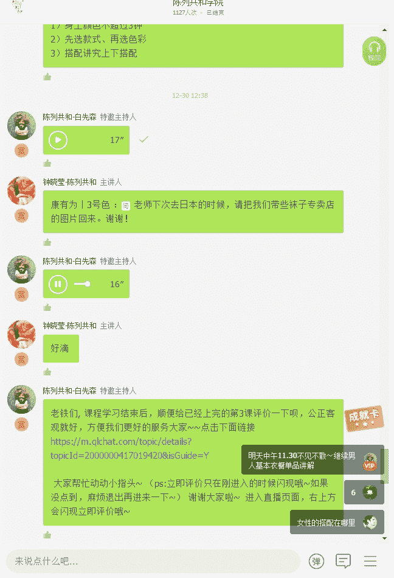