# 1、16男士衣品速成穿搭指南(完结）：第5课：男人基本款衣橱 必备单品和穿搭示范（二）：第5课：男人基本款衣橱 必备单品和穿搭示范（二）

hello，大家好，我们马上就迎来2018年了。今天是我们2017年最后的一天，大家有没有感觉到好激动？我今天特别想问大家，在2017年，我们吹过的牛都实现了吗？😊。

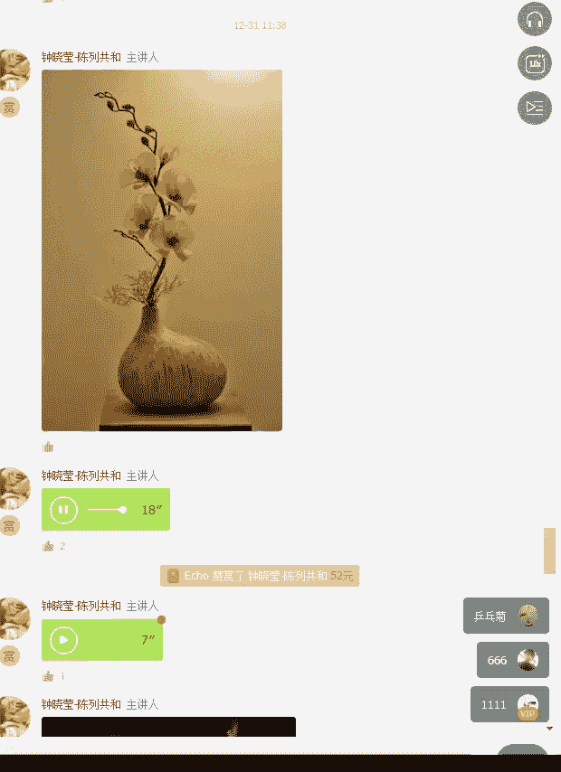

我想问一下大家，大家有没有看得到我发给大家的这个插花的这个图啊？

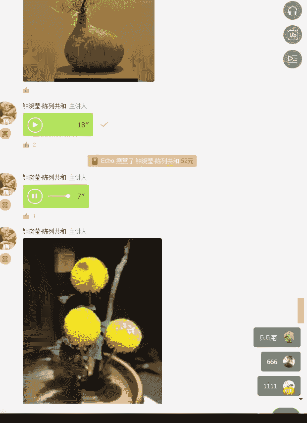

送给大家2017年最后一天，我特别喜欢的一家杭州的餐厅的插花，这个雏菊让我们感觉到我忘了它这叫什么菊花啊，让我们感觉到有昌劲有力的生命力，希望大家在马上迎来2018年的时候，又许下更多的愿望。

然后让自己的梦想一步一步的成真。

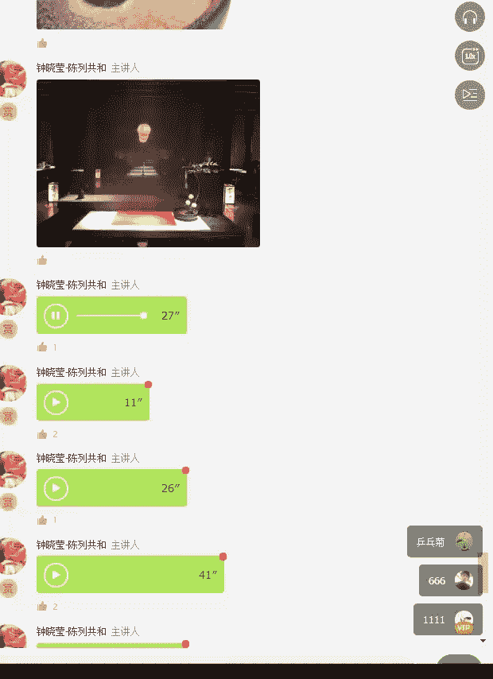

今天我在外面，所以呢网络的讯息传送的时候可能会有一点点的这个慢。所以希望大家有呃需要等一下哦，谢谢你们。我觉得今天特别特别的值得纪念。2017年12月31号，我们。这么多人聚集在这个直播间当中。

用学习来迎接全新的2018年，我觉得是一件特别有意义的事情。我一直认为投资在任何事情上面，都不如投资在自己的大脑上面来的更加的重要。感谢大家的聆听，也感谢大家的守候。

我觉得在成业共和直播间里面的所有一直守候着课程的同学，一直长期以来一直坚持把课程学完的同学都是独一无二的。其实我们有很多时候做的很多的事情，其实都是少数人。会去做的。所以我觉得我们都是这个20%的人。

因为我们是全世界这个20%最爱学习的人，所以未来我们一定会爬到这个20%的塔尖，也祝福大家在2018年收获更多的梦想成真，收获更多的事业的成功。当然，我觉得最重要的是收获心灵的美好，以及身体的健康。

好了，给大家的祝福就讲到这里了。我们接下来就会进入到我们今天的课程。我们今天的课程依然延续我们昨天的课题。昨天我们开场时讲到了一个基本衣橱打造的步骤。大家还记得吗？我想在这里面问问大家。

你们昨天回去了之后，有多少个同学去做了自己衣橱的整理呢？有的话请在讨论区告诉我好吗？昨天我们跟大家有讲到，首先是什么是一个完整的衣橱？所谓完整的衣橱用一句话来讲。

就是你任何时候任何场景出门都不担心找不到合适的搭配。然后我们怎么样对我们的衣橱进行这种断舍离呢？我当时有给大家提出了四个问题，然后建议大家留出三个收纳筐，一个收纳筐叫做准备要丢掉的？第二个是暂时留下来。

第三个就是储藏的问自己哪四个问题呢？就是第一，我有多久没有穿过这件单品的。第二，我喜欢它的程度有70%吗？第三，我现在的身材它还适合我吗？第四，它的风格是不是过时了呢？是不是已经outout了呢？

还适合我吗？问完这四个问题之后，再把它放入丢弃暂留和储藏。分别这三个框里。感谢echo的打赏，感谢呃 cruelger，我我不晓得这个英文名言对了没有啊。😊，感感谢你的打赏，谢谢。😊，很棒啊。

陈战下午去买衣架了，很棒。呃，在道德经里面有句话，我特有一段话我特别喜欢，叫做上士闻道，勤而行之。中士闻道若蠢若亡，下士闻道大孝之。那大家可以去搜索一下这段话。

其实大概的意思就是上军就是一听到某一个概念和理论。只要大家只要自己是认可的，马上就去行动。中军呢就是中等中等中等人才呢，就是啊我听到了之后，我觉得哎我要相信吗？还是我要不信啊，我要相信吗？我要不信。

你会发现上军已经踏出了十步啊，但中军呢可能他还只有在只有在原地徘徊。那夏军呢夏军是什么样？夏军就是完全听完任何的东西都是一动不动，所以希望大家能够在2018年做一个晴而行之的人，做一个行动力极强的人。

其实真的是这样子的，我们学的知识再多，你会发现，如果我们不用它，真的一切都等于0。还是那句话，我常说啊一直重复啊，简单重复，直到你吐，就是知识不是力量。运用知识才是力量。好了，我们昨天讲完了第一个类别。

也就是我们基本款衣橱单品当中的第一个类别。那我们现在来重温一下，我们总共昨天讲到的我们男人必备衣橱里面的整个类别有多少啊，还记得吗？考试问一下大家。我们昨天分别讲到了男装基本款的单品当中。

总共有10个类别。第一个类别是T恤，第二个是衬衫，第三外套，第四裤子，第六，毛衣第七，大衣、第八风衣。第九，鞋子鞋子我单独挑出了一个类别。因为我认为鞋子是男人做造型的一个非常重要的工具。第十是配饰。好。

那接下来呢我分别再一次讲解啊，再次给大家细分一下。首先第一个类别里面T恤我们讲到了长袖T短袖T啊。衬衣呢我们今天会讲到我们今天会讲到衬衣和外套。那衬衣呢我们会讲到正式衬衣，休闲衬衣。

那外套当中我们会讲到正式修身西服和休闲西服以及夹克。好，第四就是裤子了，裤子里面我们分为西裤，质地优良的西裤、牛仔裤、休闲裤。啊，毛衣里面我们分为个开什米羊绒毛衣以及薄羊毛毛衣、针织衫。

第七大衣里面呢我们就仅仅只是大衣了，大衣可能有长大衣和短大衣。但是男士基本上都是短大衣。好，第八个就是风衣，风衣里面我们也讲到了长风衣短风衣。第九个就是鞋子。鞋子我分为个三个场景。第一个场景，上班鞋。

第二个场景。休闲的时候的鞋子。第三个场景是运动鞋。好啊，那我们来到了第十个类别，这第十个类别呢也很关键，就是男的服装要搭的好，这些配饰是不可少的那这些配饰就分别有围巾、手表、腰带，还有men骚的袜子。

贝贝妮妮说要做上君太棒了。我听到你说出这样的话，我真的非常非常开心。盈盈说好幽默，重复到吐，重复是好事。莹盈，你很有灵气，简单的东西重复做才是真正的上道。好，莹盈说的非常好，11个外加牛仔裤。

那我现在把牛仔裤放在个裤子里面，所以你就把它当成10个品类就好了。其实大家知道吗？学习不在于你学到了多少的知识，而在于你真正记住和用到了多少的知识。所以在这里面我觉得我一直追求的是简单大到至简。

我不希望给大家讲很多的概念。但是你们用都用不上。我希望的就是日常的我们平时用的非常多的一些方法，简单重复，直到你吐，直到你去用，我才会停手。这个就是我们课程的宗旨。好啊。

在这里面我们再次重复我昨天给大家的叮嘱。首先第一个穿衣服，特别是男士有三个非常重要的关键原原则要遵守。第一，全身上下颜色不要超过三种，超过三种以上，你就会发现你离男神很远，离屌丝很近。

第二个就是色彩呼应，上下呼应，上中下呼应，上下呼应指的是上衣和鞋子的呼应，上衣和裤子的呼应。好，上中下呼应就是指指的是上衣皮带手表以及鞋子的呼应。好，那第三个点就是买衣服的时候一定记住，对于男人来说。

先选款再选色。因为男人最重要的是质感，而不是耀眼。我不知道大家get到了这三个点吗？其实有很多时候道理越简单，越容易执行。

好了，我们现在马上进入到衬衣的这个类别。衬衣呢我会把它分为正式衬衣和什么休闲衬衣。那么我们现在就来先看看什么叫做正式衬衣。正式衬衣顾名思义，就是它一定是在穿正装或者出席正式场合时候的衬衣。但是大家记住。

我这里面指的不是礼服型衬衣。礼服型衬衣在这里面我不讲的。

到时候我会在场合着装的时候，会给大家过一遍，就是在不同的场合，我们到底应该怎么样去穿衣服？好，现在大家看到的这个就是正式的衬衣，正式的衬衣都有一个特点，纯色。很多正式的衬衣就算有纹路。

它的纹路也是暗纹路，只要衬衣有格子、条纹、菱纹格，那都不叫正式场合的衬衣。你去看很多外交的场合，很多正式的场合，很多商务的场合，所有的男士出席都不会穿格纹衬衣的。因为那不叫正式衬衣，那叫休闲衬衣。

大家能够识别出来了吗？好吧，那我们在这里面先跟大家讲讲穿衬衣时候的一个非常重要的一个袖长的选择。那大概多长的衬衣袖长是合适的呢？我在这里面给大家看到一张图啊。太长以及太短都是不对的。应该是在哪个位置。

有没有发现是手腕以及手臂的衔接处好，太长也不行，有些衬衣短过了手腕的位置不好。那左边的这个又太长，中间的又太短而，刚刚好的是最右边的这个，所以你以后买衬衣的时候，一旦是不合适，你就记住要改短。

要么就一定要把它，如果你是单穿的话，可能你就要去把它怎么样挽起来。但是挽衬衣也有方法的。特别是有时候大家有没有看到奥巴马。奥巴马总统曾经的时任美国总统，他每次演讲的时候，他会都会把衬衣怎么样？捋起袖子。

撸起袖子，甚至他都不带领带。其实某种程度上他在表达一个东西，就是我很年轻，我很有干劲，让我们一起撸起袖子，大干一番吧。所以大家一定一定不要去忽略服装，带给我们的这种外在的这种心理的暗示。

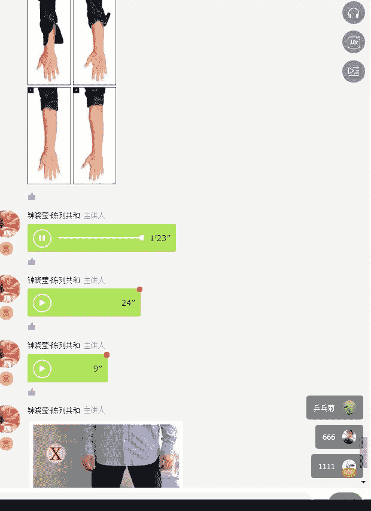

在这里面给大家看到捋袖子的方法，其实有很多男装铝袖子铝的都像农民一样。所以近我的合伙人常常就会让我教他怎么样去捋袖子。其实男人。能够装逼的地方都很少，基本上就是从这些细节来看一个男人的特点了。

所以希望大家能够看到这些细节的重要性。

那铝袖子的细节我就不多跟大家讲了，大家。拿到这张图存下来，对镜子这张图待会自己做几个练习就可以了。

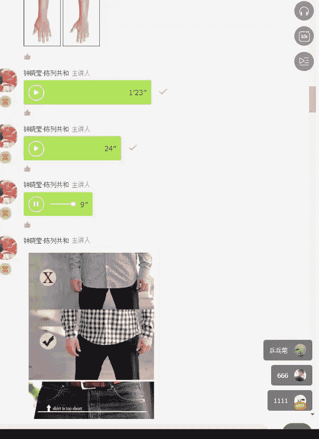

大家看到这个衬衣的这个下摆的这个宽度也是很关键的，上面打叉的部分就是不合适的，下面是对的。下面对的呢，大概它的预留的呃宽度是多少？就是一个女士的拳头横着放进去或者竖着放进去都可以，但是你一定要有个松动。

不至于你坐下来扣子的崩到对方脸上去了。

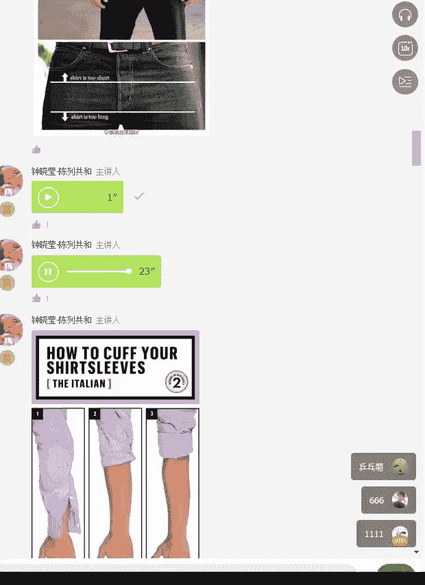

好了，以上就是给大家看到的一些衬衣的一些禁忌点。然后大家可以看到呃这些挽袖子啊以及这个呃怎么样去这个选择袖口的长度啊，怎么样选择下袖呃下摆的这个宽度的这些图片，大家记录下来就可以了。

我们现在给大家看到的这两张图，全部都是他们不穿西服时候穿衬衣的感觉。那其实有很多时候我们看到的很多正装场合，男士都是这样穿衬衣的，衬衣一般都是跟西服搭配。衬衣千万不要跟夹克搭配。

那是我们中国领导人特有的一种穿着方式。但是在正式的职场和商务场合当中，一定记住，夹克配衬衣，除非你领导这么穿，你为了讨好领导或者迎合领导，不然的话，你还是要用衬衣来配什么西服的。

那穿正式衬衣的时候呢，你的西服外面呢也可以加入一个带襟。我待会给大家看到西服的时候会讲到。

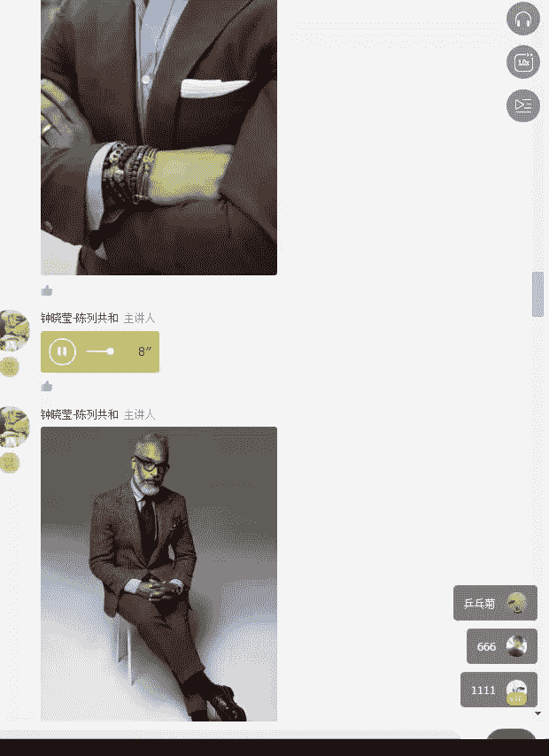

现在大家看到的就是非常完整的正式衬衣，搭配西服和搭配西裤的样子。那我接下来给大家示范几个正式衬衣的一些照片。

记住了，正式衬衣必须搭配什么？必须搭配西裤啊，休闲衬衣你可以随意的搭，你可以搭牛仔裤都可以。但是记住正式衬衣一定要搭配西裤。好了，考虑到正式衬衣，其实我们穿着的场景也不多。我希望大家能够理解一个东西。

就是你的衬衣一定要跟你的质地优良的西裤来相搭配。那什么叫做质地优良的西裤呢？就是首先第一个正式的西裤，它一定会有一个特点？这个特点是什么？就是一定会有裤线。

大家现在看到的这种就是质地优雅的西裤。那当然这种正式的衬衣它还可以跟什么搭呢？它还可以跟针织衫搭。其实跟这种针织衫搭也会很有质感。

所以搭配正式衬衣的时候，我只需要大家记住一点，在你的衣服衬衫里面一定要加入我们昨天讲到的短袖T白色T恤。

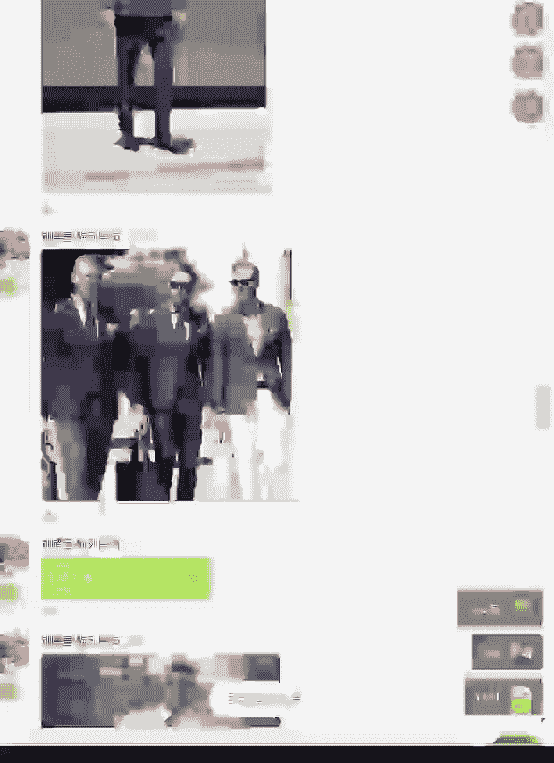

第二个呢就是你可以不带领带，但是你的领口一定记住，如果你不带领带的时候，一定要敞开两颗扣子。那不要把扣子扣的特别紧，比如说像这个啊像这个都是左边的这右边的这个男士都是敞开个一粒扣子和两粒扣子的。好。

如果你系个领带，你就可以把扣子全扣。

第二个呢就是衬正式衬衣的袖子的长度是非常讲究和下摆的长度。一般来说，正式衬衣配西裤的时候，都应该像贝克汉姆这样子把整个衣服怎么样扎进去，你千万不要这样去穿，这样去穿就不会是正式衬衣的搭配的方式。

这一定是休闲衬衣的搭配方式，才会把它放在裤子外面。大家get到了吗？

好，第三个点就是正式衬衣，一般来说洗的频率。如果你是商务型男士的话，你洗的频率会很高。所以呢建议大家呃半年左右就要换一批衬衣了。

ok那我们现在来看看休闲衬衣的。

搭配。什么叫做休闲衬衣呢？大家可以看到有牛仔，有格纹，有牛津布。

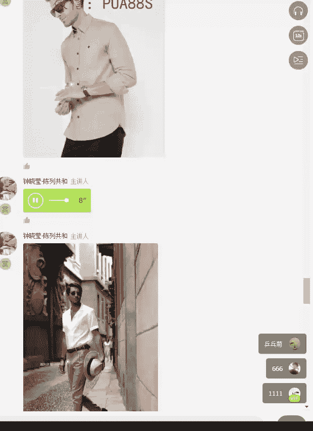

甚至还有一些是什么棉布质地的，大家可以看到，这种都是休闲衬衣。那休闲衬衣有个特点，就是特别容易穿出男神的气质。但是一定记住哦，有很多时候有些男人是不适合袒胸露背的。比如说扣子很开啊。

比如说我现在发给大家看到的这这一套衣服就特别适合张国荣陈坤，这种具有一点点浪漫。玩世不恭气质的男人穿着。一般男人来说，你穿休闲衬衣可能都要是稍微严谨一点的啊，比如说要扣子要扣得上去一点啊。

或者是用这种叠穿的方式。

其实休闲衬衣的搭配场景在我们大大部分男士的生活当中也是非常非常什么常见的。所以在这里面我再给大家示范多几套平面搭配图。你把这些平面搭配图全部都存下来之后呢，就可以把它用在日常的搭配里面了。

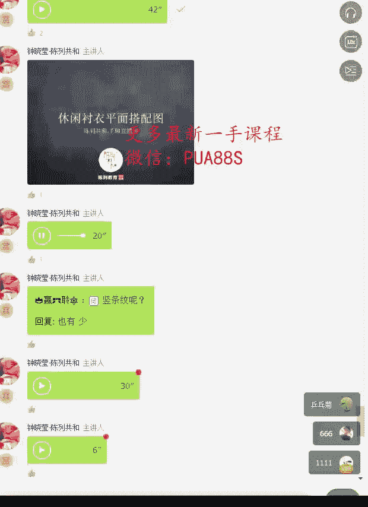

休闲衬衣记住它是区别于正式衬衣的，所以它的面料也是非常多元的。比如说今年会有灯芯绒，会有平绒，会有这个什么呃，叫做那个叫什么那个有点像那种绒布一样的，就是那个叫什么绒啊，今年特别流行。

就是表面有点滑滑的。好，还有牛仔布，还有牛津布，甚至还有亚麻。所谓的休闲意思就是它运用的场景都是一些非正式的场合。

那么我们现在就给大家先看看牛仔衬衣怎么样去搭配。牛仔衬衣可以跟卡其色，可以跟白色，可以跟牛仔色一起来搭配。

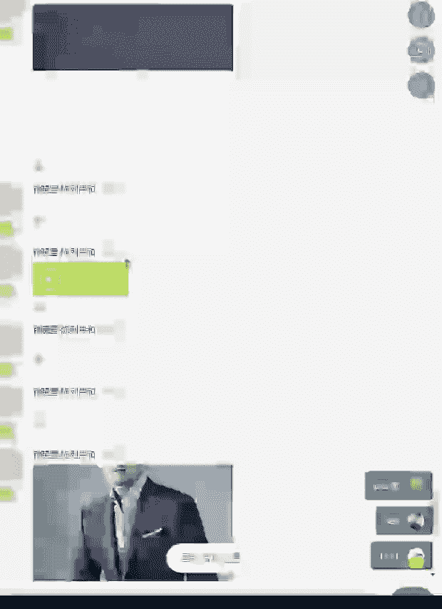

好，大家有没有看到我现在发上来的这个红色格纹和蓝色格纹的衬衣，它的鞋子和腰带，尽管它下中间的这个裤子配的是不同的，但是他们互相之间颜色是不是有呼应，包括他们的手表。你永远记住。

呼应配色是所有男女装搭配当中最好用的一个色彩搭配技巧，没有之一。

还是那句话，你想穿的男神，你全身就不要超过三个颜色，你想显高，全身就不要超过两个颜色。如果你想显得更高，全身就用一色。但是一定记住，其实在男士的造型当中，无论你的衣服有多好，只要你的头发不好看。

所有的造型都会一败涂地。所以男人的发型也是非常关键的。

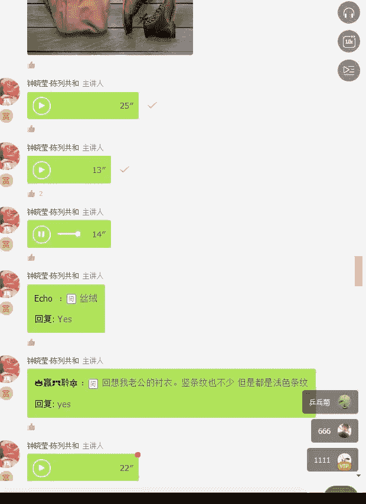

很好啊，像银玲这样子听课的方式，就是一边听一边去反思，一边去思考。其实有很多时候你会发现我们在听课的现场，有很多时候呃老师所讲的这个知识能够引起我们的一些反思和启发的话，其实是非常好的。

大家一定要去呃让自己的脑子开动起来，好吗？

比如说休闲衬衣其实很常穿的方式只有这两种。我们首先看到的第一个就是这个黑白格纹，然后搭配这个黑色的裤子，以及这双鞋子。有没有发现只要你想显高，记住，把裤脚挽起来，露出脚踝，你一定是显高的。

因为所有的视觉都集中在你上半身。好，第二种常穿的这种休闲呃休闲衬衣的方法呢，就是这种大家可以看到，就是里面搭一个白T啊，这个白T是长袖和短袖都无所谓。那外面再套了一个衬衫。

这种特别适合矮个子男士男士和瘦削型。就是很瘦很瘦的这种男士来穿着。好，现在给大家示范的是一衣多穿的这种方式。这件格纹衬衣虽然不是百分之百一样啊，但是大家可以看到他有了三个不同的穿衣场景。

首先第一个穿衣场景大家可以看到是什么？第一个穿衣场景，我给大家看到的是一件呃格纹衬衣里面搭一件白T，然后一条黑色牛仔裤，下面脚上穿了一双小白鞋，这个小白鞋呼应的就是他里面的白T和格子衬衣，上面的白格。

好，第二个搭法呢，你会发现换了一条牛仔裤，同时他又换了一双纽巴伦的鞋子。而他的里面就没有搭这个白T了。这时候显示出一个很power，很有力量感的男人，这时候他的手表也换成了运动型的。

外面再加了一件这种高尔夫球式的马甲。好，那接下来呢大家看到第三套呢就是他可能出要出席一些商务的场合了。有可能你出差的时候就一衣多搭了。

外面再加一个，比如说我晚上回到呃房间，我就可以休闲了，我就可以换上一条黑色的牛仔裤或者一条牛仔裤。然后白天出去的时候，我就换上卡其色的裤子，穿卡其色的皮鞋，卡其色的腰带，卡其色的钱包。

卡其色的这个呃驼呃驼色的或者是咖啡色的这种手表带，然后再加一件西服，西服的口袋襟的位置。大家有没有看到呼应了这件。格子纹衬衣，这就是搭配，搭配其实就是呼应，搭配就是不超过三色。

大家get到了这些点吗？

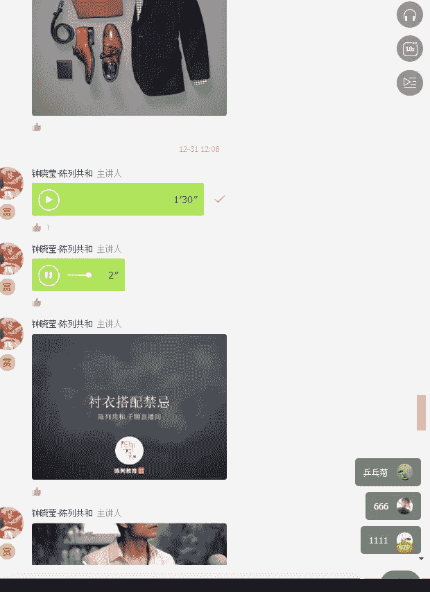

好了，接下来给大家看到的是衬衬衣搭配的这个禁忌点。那首先第一个我们可以看到，千万不要带这样的配饰。

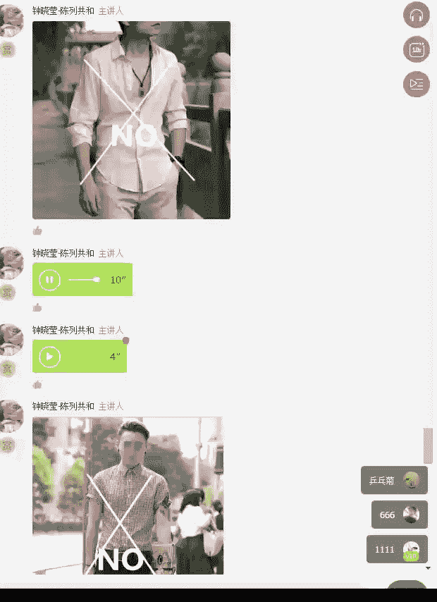

带这样的配饰，就让邂逅这是杀马特风格。

另外就是不要上紧下也紧，特别是男士，你穿这种紧身西裤，紧身裤子是非常非常需要考虑的。

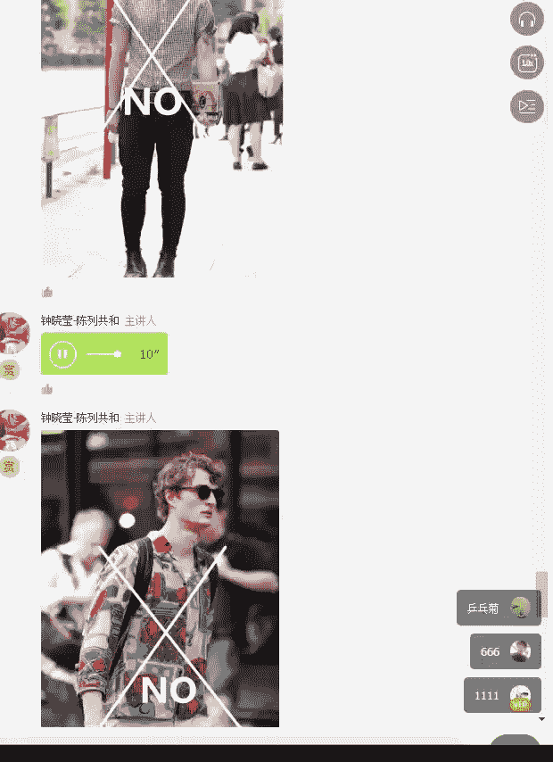

好，大家看到的这三张其实都是花的，特别特别的花。一定记住，这些都是给男神穿的，穿的不好就变屌丝了。大家可以看到第一张可能还能接受哈，欧洲男人穿还可以，但是中国男人穿这种衣服一看不是黑社会，就是打手。好。

第二件第二件为什么不好呢？牛仔裤还有里面的衬衣，里面的T恤很长，外面的衬衣也很长，袖子还这样穿，就特别像台湾的那种农民。好，第三张图为什么不行呢？全身颜色全部看不出任何的分界线。那。

当然你说hiiphop啊、嘻哈啊，玩这种时尚类型没有关系，你可以玩。但是在这里面这堂课里面我讲的全部都是符合大众审美和正常大众上班穿着的审美要求的。好，大家get到了这些禁忌点了吗？

为什么我每次在讲不同的单品的时候，都给大家看到禁忌呢？原因很简单，我们不仅仅要知道自己应该怎么穿，我们还要知道自己不该怎么穿。给大家看一下，这是我那天出席的一个晚宴时候的这个搭配，就是两色啊。

玫红配上全黑。当然我的手包是暗红色，也就代表了不超过三色。因为手包的面积很小，所以它作为点缀色的出现。所以只要是你想要走经典的路线和优雅路线。如果是女士，我建议是不要超过三色的。

所以大家明白为什么现在有很多的这种精致型的女性，她穿西服的时候，全部都是以成套西服为主。

好，大家有没有看到这个女生也是一样的，她小白鞋呼应的是她里面的那件丝质的呃背心，然后她的这个呃衬西服的领口是黑色，所以她的裤子也是黑色，她的包包也是黑色，所以她全身上下就是三色呃，墨绿白黑。

好，你看我都把自己放上来了哈，敢死对一样的。好，主要是想告诉大家，呃，我在现实中生活当中就是运用两色原则偏多的。😊，呃，包其实男士的这个三色原则是非常重要的。包括我的CEO。

我基本上给他搭配衣服的时候都是两色或单色原则。一会艾le如果有我们CEO的照片啊，就上次在千聊和这个云之光的论坛上面的照片可以发上来给大家看一看。呃，我们CEO所运用的这种两色原则和单色原则。

okK那我们现在就进入到了西服外套里面，我今天先讲西服。

西服里面我分为了两个，一个是正式的修身西服啊，另外一个是。

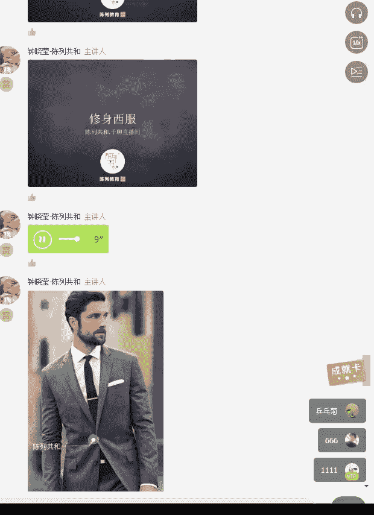

我们刚刚说到的休闲西服。好，大家现在看到的这种就是正式的西服了，修身西服为什么要加个修身西服呢？原因是因为所有正式场合当中的西服都必须是合体的。

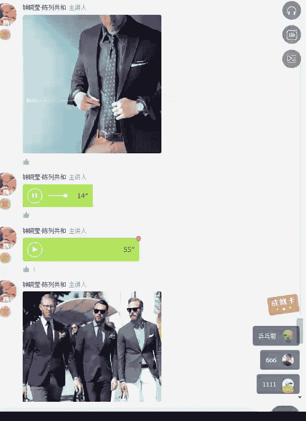

我个人是非常喜欢看男士穿西服的，呃，较中呃较外国男士而言，中国大部分男士穿西服的场合其实相对来说会少一点。但是其实现在有很多的商务场合都是非常重要的，所以呃少不要紧啊，但是少因为它少，所以我们要精。

这才是最重要的。所以一定记住，男人在穿西服的时候，切记走太过于时髦，我们一定要去找到自己适合的，而且一定记住肩位很关键。我们很多的这种男士西服啊，特别是特别宽大的那种西服是不合适的。呃。

不要去选择特别宽大的这种西服，因为宽大的西服会让你变得特别的老气，那应该去选择那种西服，看上去是比较合适你的身材的。大家看到了吗？这个就是我们CEO的照片发上。

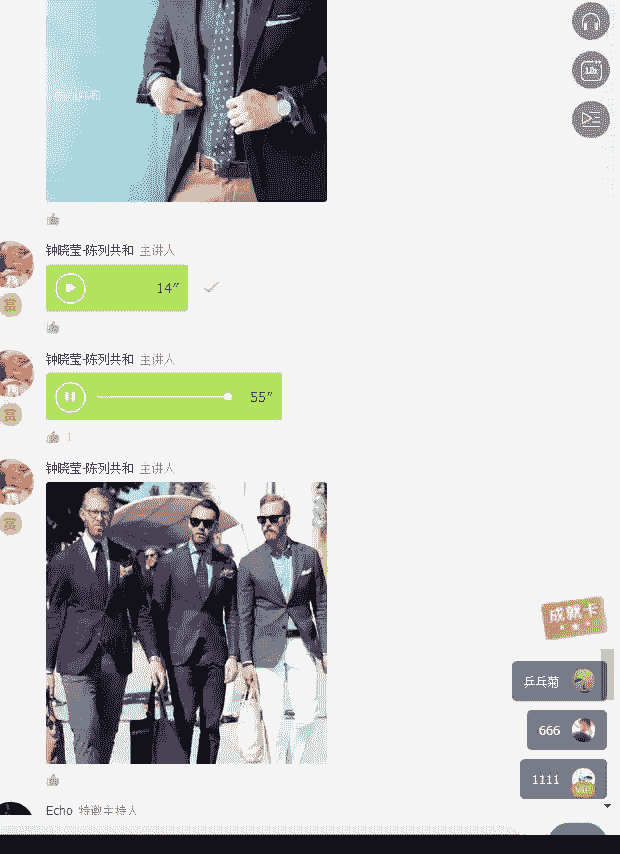

上来了。是的，那它这个就是两色原则啊，全套灰色的西服里面一件白色的高领，然后脚下那双鞋子也是灰色。

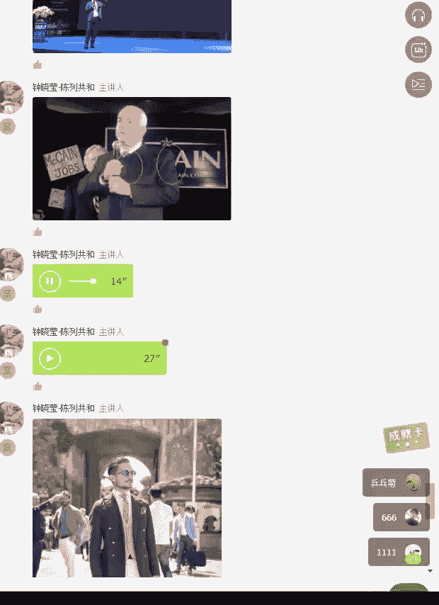

我们现在看到的这个呃原来的美国总统的其中的一个竞选人叫麦肯恩。你看他穿的西服，我们圈到那两个圈的位置，包括他里面套的这种羊毛衫，这也是我们中国传统男士特别爱穿的一种方法，其实尽可能不要这样穿。

如果你要真的觉得冷的话，我倒是建议你应该是穿这种三件套式的西服啊。大家看一看什么叫三件套式的西服啊。

如果你真的冷，你可以加一件这样子的一个马甲在里面。其实这种马甲第一可以保暖。第二个你会发现它穿上去会非常非常的精致。也可以穿一件这种开衫啊，呃针织式的马甲也很舒服。现在其实有很多这种款式。好。

那我想问一下大家，什么样的身材穿西服最好看呢？给大家看一个身材，一种是倒三角形身材，一种是正三角形身材，一种是四方形身材，哪一种身材穿西服最好看？左边的第一种和中间的这种最好看的应该是中间的这种。

因为他的肩部比较宽。大家有没有发现很多的欧洲男士，他们的肩部和胸肌的位置都比较发达，所以你会发现他们很撑西服，他们能够把西服啊，撑的特别的有味道。你看到他们这些都是胸肌的位置是比较饱满的。

所如果你想要把西服穿的好看，大家知道要做什么吗？做俯卧撑。我们的CEO是每天100个俯卧撑。所以你会发现他穿西服的时候，他胸部的那个肌肉是鼓胀的。所以你会发现西服的那个肩脖的位置是很好看的。

如果你是很瘦削的，然后又没有胸肌，你整个人还是弯腰的那穿西服是一定不好看的。哈哈这个是我们CEO参加了一个国际性的论坛。他在上面去讲我们陈列是什么？就是我们是怎么去给顾客去做设计的，然后就讲说。

因为我们更在意他的商品怎么卖出去，这是我们的CEO。我们今天这样讲课，把我们自己都给放上去了。有这么多的花絮，你们嗨不嗨呀？好了，接下来我们要讲到的就是记住了，如果你只能选一套西服的话。

我建议选深灰色啊，不要选全黑色。呃，一般来说全黑色其实是比较难驾驭的。当然你也可以选择，但是我建议选深灰色会百搭很多。那西服的搭配呢，接下来给大家做一些示范，有很多时候正式西服也可以配高领毛衫的哦。

正式西服有时候也可以不搭什么领带的，也可以配高领毛衫。

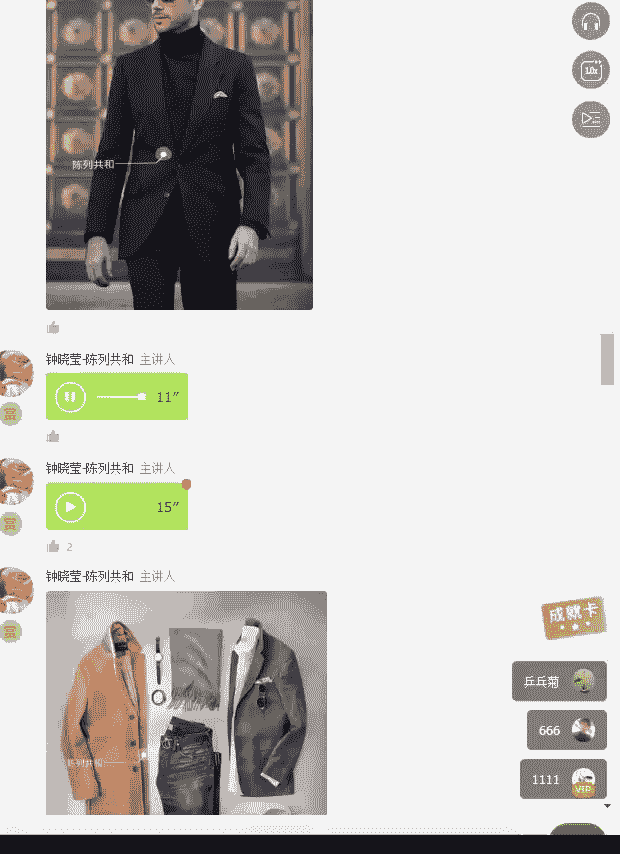

好，一般来说在秋冬天，如果你穿正式西服的时候，呃，很少人会不配大衣的。所以一般来说，正式西服我们也是需要配什么大衣的，也是需要配大衣的。

当然也有一些人会拿这种正式西服来搭配牛仔裤，呃，或者是搭配这种针织衫。其实这都是一些潮人的搭配的方式了。

我还是建议大家成套穿啊，正式的场合一定记住要成套穿。如果你不成套穿的话，一定会显得不够什么，不够重视，不够重视大会，不够重视你出席的这种场合。比如说像这种就是正式的。呃，正式的一种穿法。

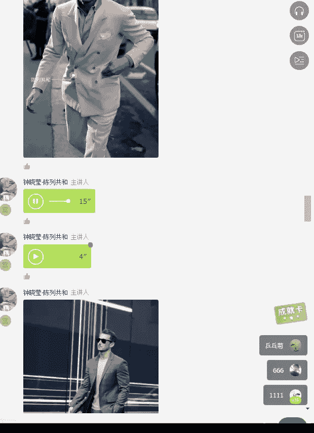

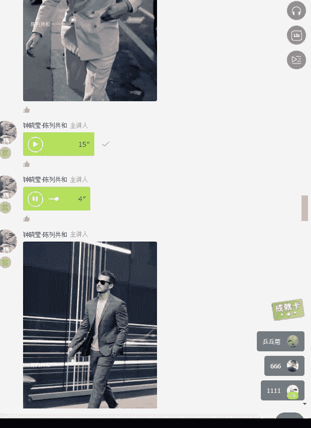

大家看到这种也可以用来搭配这种呃圆领的针织衫。是正呃当然也有一些人会用它来搭牛仔裤也是可以的。

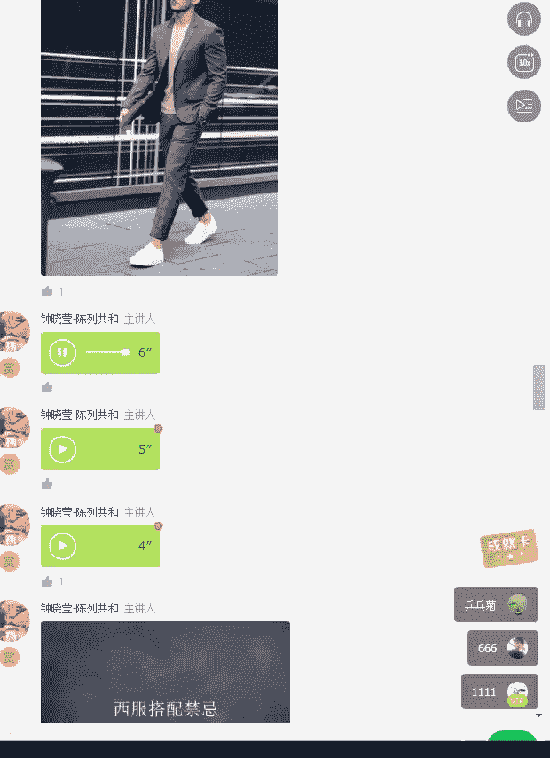

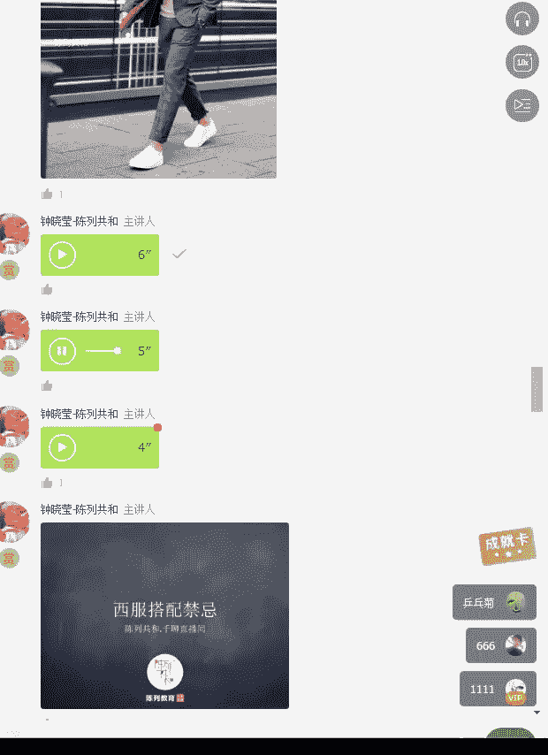

但是一般来说，正式西服一定不可以搭格子的休闲衬衣。

好，接下来我想跟大家讲到的就是正式西服里面的搭配的禁忌，比如说颜色一定不能够太艳。

像这种都是禁忌啊，都不能够穿这种，因为太艳了。然后比如说像这种很花哨，除非你是来自迈阿密，嗯，除非你是呃来自哥伦比亚毒枭的故乡。

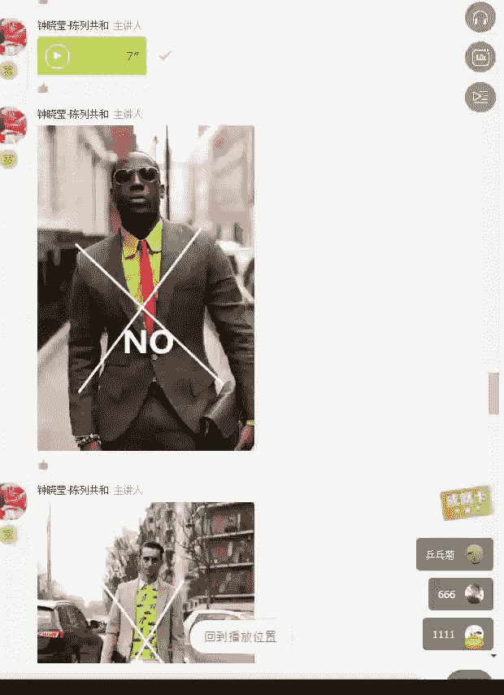

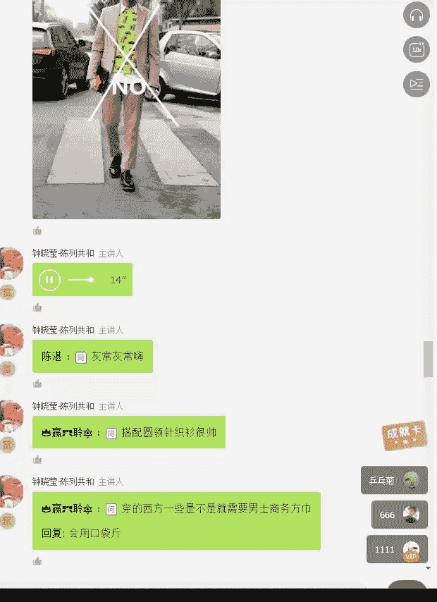

好了，接下来我们要讲到的是休闲西服。休闲西服就多了。休闲西服所谓的休闲西服就跟我们的正装西服正好是相反的。正装西服有可能它是A字型或者X型收腰一点。那休闲西服一般都是H型。什么H型。

就是相对来说它会比较宽松，它会比较直线，它会比较呃松垮，然后它的面料呢相对来说也会比较多元啊，比如说牛仔啊麻布，然后棉布甚至一些特殊的一些面料，或者是它在袖子的位置会有一些会有一些薄接薄啊。

甚至它会是这种啊羊呢的羊呢子的面料。

那休闲衬衣的搭配的方式就非常的多了。休闲衬衣的搭配呢，其实有很多时候我们都可以选用牛仔裤，卡其裤，牛仔裤搭休闲衬衣其实是非常非呃休闲西服啊，口误是非常非常多元的。所以我给大家的建议就是可以多穿休闲衬衣。

不一定要常常要穿很正式的，你可以穿一些休闲式的衬衣，然后呢让自己呃看上去会更加的精致一些。

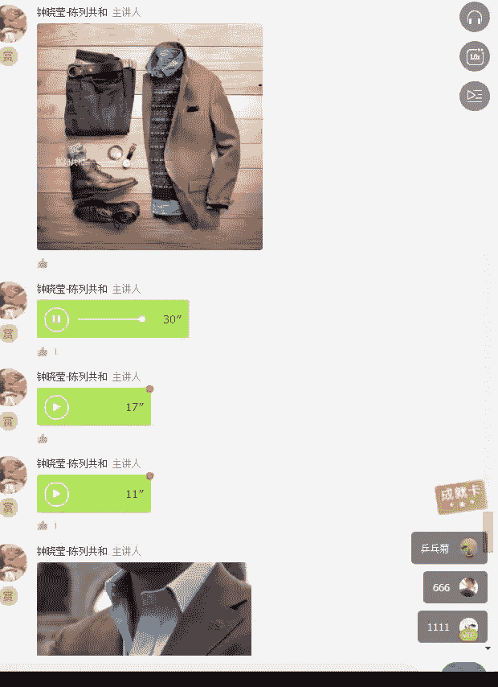

在T恤、衬衣和西服当中呃，我刚刚一直口误讲衬衣啊，讲其实我讲的是西服。在T恤衬衣和西服这三个排序当中，T恤是最不正式的。第二个正式的是衬衣。第三个就是西服了。

这是现在还有一种呃衬衣是呃修修西服，是这种针织的面料。尽管这件不是西服，我给大家看的是一种材质。

比如说有很多时候，无论是休闲衬，休闲西服还是正式的西服，其实很多男士都会在口袋的这个位置加口袋巾，甚至他还会在那个花眼的位置加入一朵花式的胸针。其实有很多时候我们不仅仅是男士可以穿西服。

我觉得女士穿西服也是非常帅的。

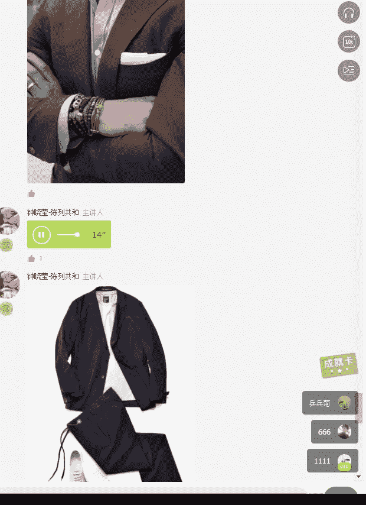

要看到的这一套其实就是一整套的休闲。休闲的西服休闲的西服在里面的搭配就比那个我们的这个正式西服要来的简单一点。比如说圆领T啊啊或者是休闲衬衫啊，或者是高领毛衫啊，或者是针织衫啊都可以搭配。

那在这里面给大家看到了两个休闲西服的这个搭配的感觉哈。其实下面这套我觉得它更像正式的西服，因为它是全呃一套色的那一般来说一套色的西服呢，如果你的版型是比较偏修身的那我们可能会把它归为正式西服。

那上半部分的这个no呢原因是什么？因为他胸口的装饰物态度，还有就是嗯他的领口开的比较低。那当然其实这是一种style哈，但是不属于我们这堂课当中所提倡的这种style。

你可以呃除非你有特别浪漫和妖娆的男性气质。不然的话这样穿衣服其实特别是中国男士很难hold住。OK我们今天的基本的类别就讲了两个，一个是衬衫，一个是外套。外套里面我讲到了正式的休身西服以及休闲的西服。

那夹克呢我觉得嗯除了皮夹克之外，那就是劲霸的那种类型的夹克。我个人其实不是特别建议男士穿夹克啊，除了皮夹克以外，因为夹克其实是很少男士穿的特别好看的。

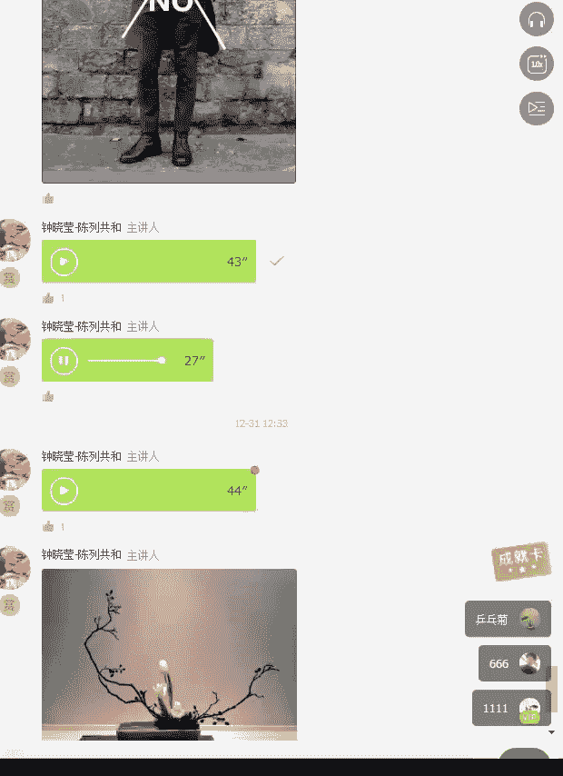

好了，今天我们要讲完讲的两个大类别，衬衣和外套。那接下来呢我建议大家开始寻找你的衣橱当中的衬衣，正式的衬衣和休闲的衬衣，然后拿它出来跟牛仔裤和你的西裤来进行搭配，找到你衣橱里面的外套，修身西服成套的好。

或者是单件的都可以和休闲西服，甚至可以找到夹克，因为夹克除了皮夹克以外，就是劲霸那种类型的夹克了。我觉得其实这几年其实穿夹克的男人都比较少了。

所以呢在这里面我希望大家能够从自己的衣橱下手能够开始去整理自己的整个的一个搭配的逻辑。

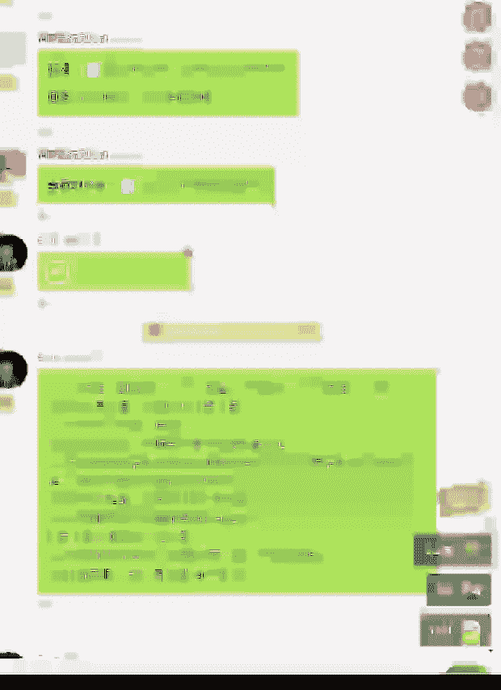

嗯。OK大家看到这朵花的时候就知道了，到了我们。问问题的时间了好吗？那我们接下来就得5分钟的时间给大家问问题哦。陈战，你真的好喜欢你那双驼色皮鞋啊，是古董吗？黑色皮的休闲西服嗯。

黑色的高领下面是黑色牛仔裤，你给来穿驼色的皮鞋，呃，会显得很矮哎。其实我们个人不是特别建议穿皮皮质的西服，会显得很老气。嗯。

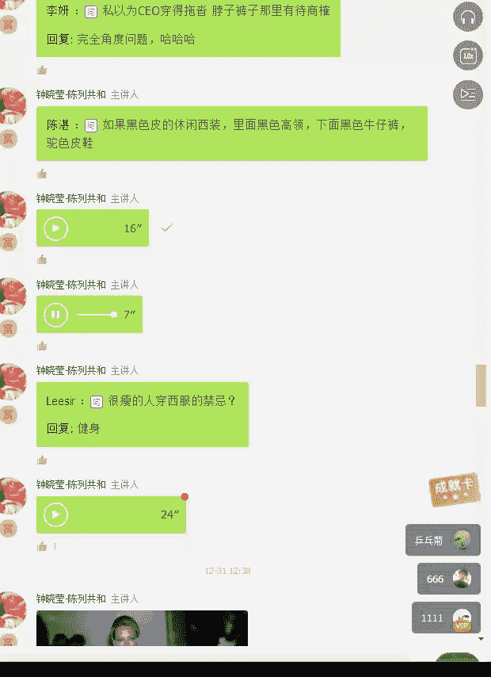

liser很瘦的人穿西服的禁忌，就是第一不要穿成套的西服，呃，尽量去穿休闲西服，就是分开的，然后穿一些面料稍微厚一点的，有质感一点的面料。比如说呢子啊啊或者是这种灯芯绒啊。

能够让它的整个人变得更丰满一些。大家看这个女人穿西服也是很帅的，很有质感。

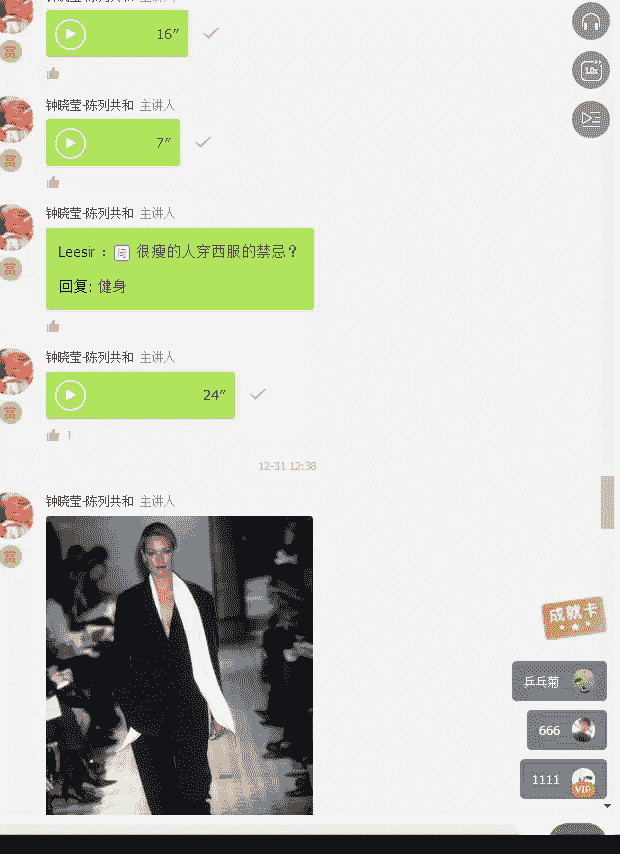

好了，大家如果有问题的话，继续再问哈，那我们今天就到这里吧，把时间交给echo主持，提前祝大家2018年。新年快乐。新历年。新年快乐。哈哈哈哈，最后用我这张西服来做结束，这张特别适合跟大家说，元旦快乐。

😊。

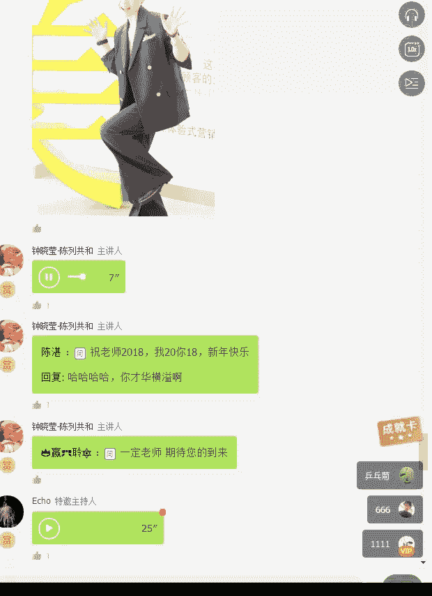

Yeah。好的，时间交给我了。啊，谢谢女神钟老师的分享，也谢谢各位小伙伴们，今天依然在支持我们。那在今天的课程我也做了笔记，然后现在把笔记发上来，大家可以保存一下，仅做参考。

那在课程结束了呢，我还是要再次跟大家强调一下我们下一次开课的时间，就是我们嗯下个月1月、18号、19号、20号这三天。那最后呢还是跟大家强调一下，还没有入群的小伙伴，抓紧时间入群。

然后大师兄从下个月开始会陆陆续续每周在我们的男士搭配群里面分享干货，所以还没有入群的小伙伴，等一下添加大师兄的微信。好了，感谢各位老铁的大力支持。我们2017年就要过去了。那2018年祝大家新年快乐。

新的一年有新的成长，新的收获，新的幸福和开心。

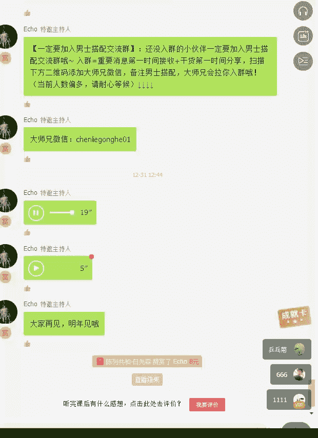