# 1、16男士衣品速成穿搭指南(完结）：第6课：男人基本款衣橱 必备单品和穿搭示范（三）：第6课：男人基本款衣橱 必备单品和穿搭示范（三）

好久不见，大家晚上好，又来到了新的一年。2018年。我是成业共和的钟小莹，很高兴再次在千聊的男装搭配课堂当中见到大家。刚刚发上来的是给你们的餐后甜品，这也是法国非常著名的一个甜品大师的作品。

那就把它当成一个艺术品吃了吧。呃，曾经的美国历史上最优雅的总统夫人jackine，他有一句名言，他说我知道我不管做什么事都不如我把衣服穿的好更重要。当然了，这句话呢也呼应了vivin刚刚。

放上来的我的这个行李箱。因为我认为其实对外的这个视觉的表达，其实就是你个人的整体的内涵的表达。所以我是很关注于我个人的这个视觉的表达的。陈人家常常说，你这个人身上所看到的这个外在。

其实包含了你呃经历过的事情，你看过的书，你去过的东西以及你呃恋爱过相爱过的人等等。你去过的地方，它是一个种和。所以人的第一印象真的没有办法磨灭。所以我想说学搭配。最重要的目的不是要穿的多么的炫。

而是要把真正的自己，甚至要优化自己，把自己更美好的一面体现出来。我记得在年前的一系列的课程当中，我们有讲过什么是一个完整的衣橱。其实很多时候搭配一套一点都不复杂，最重要的是。我们有很多时候觉得他复杂。

是因为我们没有个方法。当我们觉得做一件事情很难的时候，其实是因为我们的方法是有限的。所以又回到了完整的衣橱的这个概念。其实完整的衣橱不是要求大家什么都呃买最贵的哈，什么都买最多，相反，反而是要买少要精。

为什么？因为你只有在精简的状况下面，你才能够穿出更好的自己。衣橱一定是离不开生活场景的，无论生活当中的什么场景，都可以在我们的衣橱当中找到合适的搭配，这就是完整的衣橱。但是你不要忘记一点。

我们每个人都会有自己的核心生活场景。你比如说我的核心生活场景，就是工作和旅行。那么大家。我们自己的生活场景呢，一天一周一个月，一个季度，一年。你的核心生活场景，从工作、生活、旅行、运动、晚宴当中。

你去挑选2到3个，把它定义出来。这个时候你在做搭配的时候就会有非常强的这种思考啊，思考的方向啊。永远记住，我们一切的行动都必须服务于目标呃，搭配场景就是我们的目标。比如说我今天要去哪里。

我要见谁去的场合是什么样子的。你比如说像ja林贾奎林，这个美国的曾经的最优雅的那个总统的夫人，他曾经是这样子的，他每访问一个国家，他都会要到这个国家迎接他的仪仗队的衣服的颜色，包括整体的这个场景。

并非什么要这样子的。因为他希望能够保证他在下飞机的那一刻，是在这个场景当中是特别协调的同时，他又能够在这个场景当中显得特别的美和优雅。所以场景多么的重要，不用多说，为什么？

因为刚刚jaqueline的这句话和这个势力已经告诉大家了。尽管他是女人，但是对于男人来说也是一样。だ？

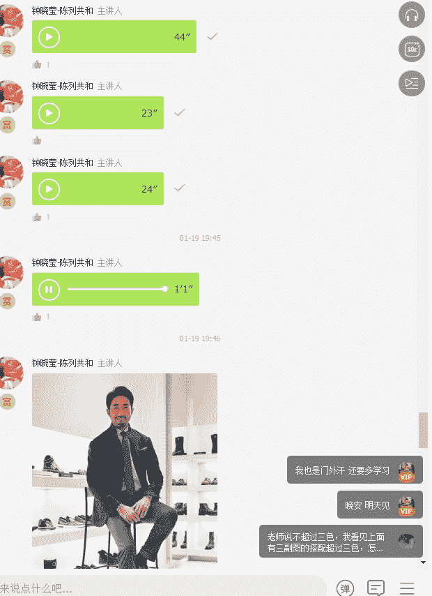

大家看到的这位男士，他就是在不同的场景当中所使用的服装的这种搭配的感觉。大家可以看到他从职场转变到轻松休闲的度假风格的穿着。其实这就是场景的一种转换。那我想问一下大家。

你们可以告诉我你们的核心生活场景是什么？你们的核心生活场景当中包含了工作、生活、旅行、运动、晚宴或者是其他吗？请在讨论区告诉我。

那么我们今天依然延续我们年前的另外一节课，然后我们继续去做我们基础衣橱的必备单品的讲解。我们今天会讲解到的是呃我们的毛衣、呢子大衣，还有风衣。

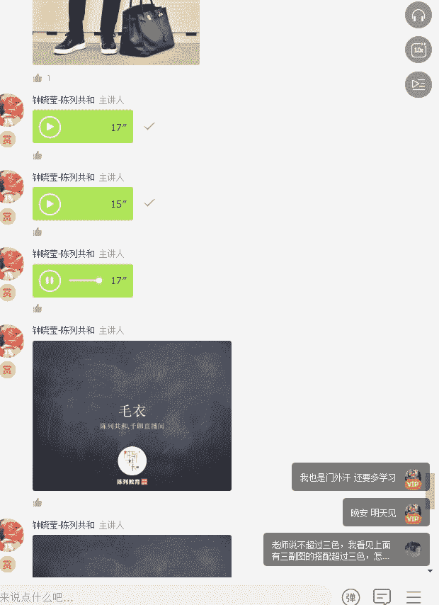

毛衣我想大家应该很容易理解。那毛衣其实有很多种不同的品类。首先第一种是。羊毛毛衣。那羊毛毛衣当中，你会发现有高领和圆领的区别。那当然还会有一种非常重要的很舒服的面料。这个东西叫做羊绒。

那最好的羊绒就是cashme的羊绒。

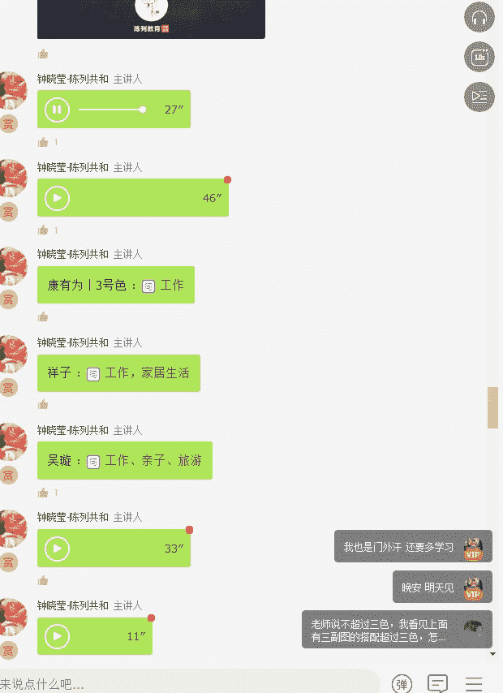

其实一个衣橱里面单品比较齐备的男人是一绝对是一个非常精致的男人。同时我觉得从一个男人的衣着也能够看出这个男人的妻子或者是他的女朋友的要求。人家常常说一个男人穿的不好看，走出去，不会说这个男人怎么样。

反而会说哎呀，这个男人招他啊，嫁娶了一个差点说嫁了一个娶了一个不修边幅的女人，你看他穿成这样，他们家的老婆都不说他。所以最后你会发现落下画柄的还是我们女人。所以大家一定要记住。

把你家先生拾得的整整齐齐的，也是我们女人应尽的义务啊。

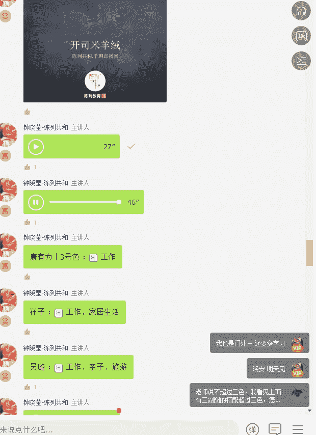

好，我看到看大家有发你们的这个生活的核心的场景哈。那有为是说工作啊，然后那个嗯祥子是说工作和家居生活很好。然后呃vian是说工作亲子和旅游，那也就代表了你的核心生活场景是比较多元的，有3个。

那有为呢就只有一个了。康有为同学，你怎么只有一个生活场景呢，要增加你的生活场景好吗？我记得有为是卖袜子的，所以你想一下你的生活场景要多一点，因为生活场景多了之后，你的衣服的搭配变化就会多。

这样你对袜子的需求也会大呀。

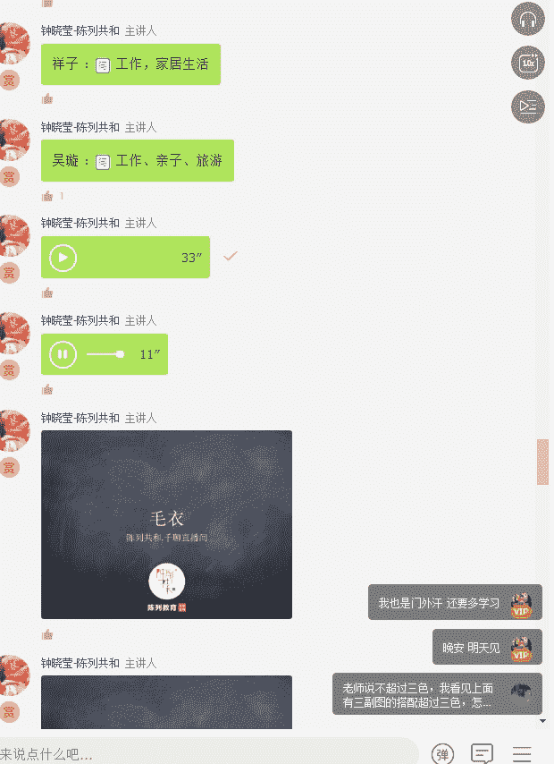

好了，那我们现在就起还是进入到我们的这个毛衣的这个这个部分的讲解。那我们刚刚提到了说作为一个精致的男人，你的衣橱里面的类别必须是什么？必须是完整的。所以我们今天要讲到的是呃毛衣第一个品相。

那毛衣里面分为开sme羊绒以及高领的薄毛毛衣。像这种啊高领这个是冬天的时候，男人穿西服和穿外套啊，穿呃包括我们待会讲到的呢子外大衣以及风衣是最好的搭配伴侣。

当然还会这种大家很常穿的这种羊啊圆领的薄羊毛衫。这些都是非常重要的单品。也就是说，你的毛衣里面至少要拥有一件圆领的薄羊毛毛衣。那再往上走，你说我要多买一件，那你就买一件高领的薄羊毛毛衣。

那薄和厚你自己去选择。因为不同的地区温度不同。那当然最顶级的就是我要拥有一款kime的羊绒。其实羊绒真的是一件顶两件的啊。平时有很多朋友会问我说，哎，你怎么穿那么少啊，会不会冷？我说不冷，为什么？

因为我里面穿的是一件羊绒，我根本就不需要穿太多，它就已经很暖了。所以真正好的衣服它是让你很轻松的，它对你的身体的压力一定是不大的？比如说我个人就特别不喜欢穿很重的衣服。因为很重的衣服，我们穿一整天的话。

它就会显得很很肩部的压力很大，但是呢kime羊绒就会有这种好的特点，就是它很轻，但是它很。保暖。搞得我好像是卖羊绒的似的。好了，那接下来呢我要跟大家讲一个禁忌啊，如果你的脖子是比较偏短的那你一定记住。

你不要去穿高领毛衣。如果你的脖子又很粗很肥，然后你的双下巴也很明显，那一定记住，你也不要穿高领，你要穿V领或者圆领，圆领里面可以套衬衫都没有问题。但是你永远记住，如果我们的脖子很短，很粗。

是不适合穿高领衣的。

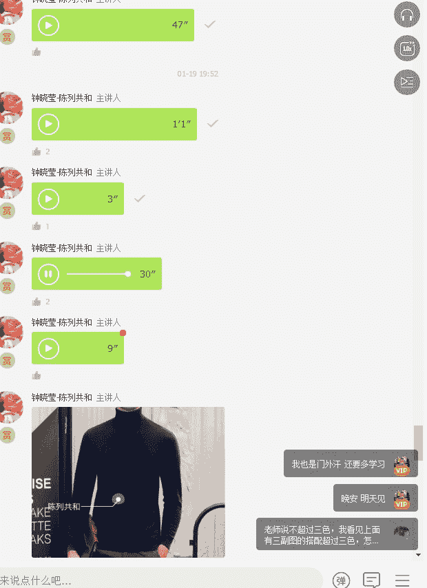

其实真正的穿搭技巧最有用的一条就是扬长避短。但是在扬长避短之前，你必须知道自己的短处在哪里。

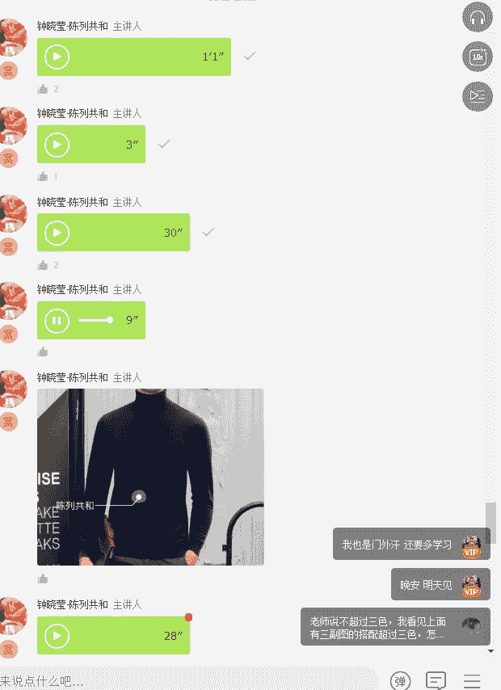

所以我觉得在学习搭配之前，你要非常深入的去思考你自己的短处在哪里。我是身长腿短还是腿长，腿腿长身短，我是肩宽还是我的肩是窄的，特别是有些男性，他的肩部是溜肩，溜肩型的男士呢就是我现在发上来的这种。

这就属于溜肩型的男士。那溜肩型的男士，有一个特点，就是他穿西服，可能不能不不是很好的去撑得起来。所以像这种溜肩型的男士男士男士呢，我建议就是尽可能的不要穿太多的这种紧身的毛衣。

你可以去穿一些稍微宽一点的，或者是纹路稍微粗一点的，不要穿太过于贴身，不然的话会显得你整个肩膀往下走。

好啦，接下来要给大家示范一些毛衣的搭配。那这个毛衣的搭配其实场景有很多，你上班可以穿，你下了班休闲也可以穿，你可以搭配牛仔裤穿，你也可以搭配西裤穿，你可以搭配风衣穿，你也可以搭配呃外套和西服穿。

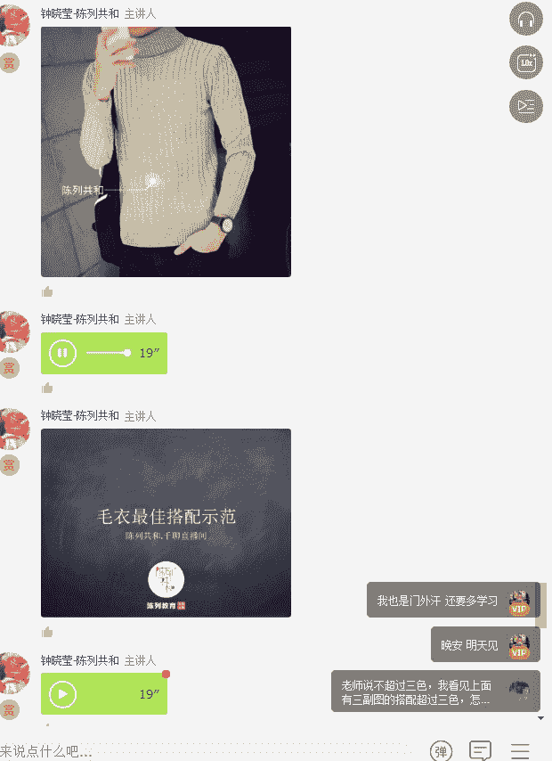

大家现在看到的这一套就是比较休闲的一种搭法，它搭配的是牛仔裤。那当然呢接下来的第二套呢，其实还是我们常见的一种搭配的方法。大家有没有看到所有的搭配里面都强调呼应，上中下的呼应，包括现在给大家看到的这套。

还有就是这个男士穿到的黑色。羊毛衫以及脚下的这双黑色的这个平底鞋。那。

好，以上的这种搭配呢是相对来说是比较什么比较呃比较轻松的，比较休闲的那我接下来给大家看到的这些是比较什么比较上班可以穿的。

比如说用这种高领来搭配西服。

当然还有一种kisme的羊毛衫，或者是呃羊绒衫或者是羊毛毛衣，也有这样子的开襟型的。

好，大家看到的这个就是里面一件白T，外面再加一件羊毛羊绒衫或者羊毛衫，然后外面再套一件休闲的西服。其实这种就属于叠穿的。叠穿的这种穿法呢，比较适合个头比较瘦削。然后啊身材比较中等的男士。

你需要透过这样子的叠穿的方式来打造你的整体的这种魁梧的身材。

好了，接下来我们要讲到的是毛衣搭配的禁忌。

好，大家看到这两张图，你都会有一个特特别强烈的一种感觉。是第一个就是不要有太多的装饰和流苏。第二个就是不要穿太过于大面积的图案啊，特别不适合中国男士。因为中国男士本身从长相的五官就不是特别的立体哈。

我们中国人的特点，亚洲人的特点。那跟老外是不同的。老外的立体感很强，所以他们能够驾驭一些比较夸张的色彩和夸张的图案。但是因为我们中国人的这个呃五官的这种平面以及身材的呃这种这种体型的原因，没有那么魁梧。

没有那么高大。所以呢我们尝试这种夸张的图案是不合适的。那另外呢就是穿毛衣的时候，还有一个非常重要的，大家要去关注到的就是不要太长，因为太长的话比较容易显得自己呃特别的腰长腿短。

人家现在要求的不都是大长腿嘛，所以尽可能的把自己的腿拉长是没有坏处的。比如说像这个呃穿星星大猩猩毛衣的这个男士，他如果把毛衣放呃前半部分塞进那个裤子里面，前半部分哦，指的是不是全部。

然后露出腰带可能就显得更高一些了。

OK那我们现在接下来要讲到今天的第二个品相，就是呢子大衣。那我想说呢子大衣其实是很关键的一个单品。我现在给大家看到，这个就是呢子大衣。那呢子大衣都有一个特点，它一定是冬天穿着的它相对来说会比较厚一些。

那呢子大衣会有好几个不同的颜色。我们现在大家看到的这个是非常独特的这种军绿色，也非常男神，很man的一种呃呃一种感觉。那当然了，呢子大衣其实它的面料一定是呢子面料哈。

那大家不知道什么叫呢子面料呢去搜索一下。

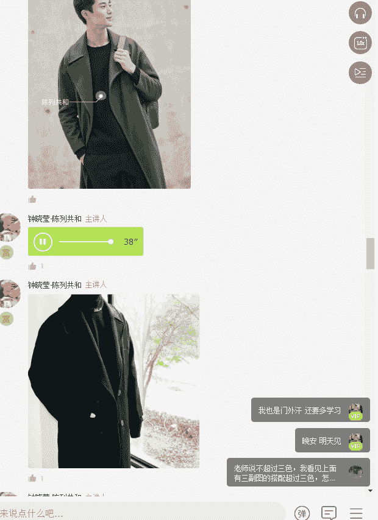

好，那我们现在看到的这些呢子大衣，我建议大家啊入手呢子大衣的时候，如果你没有一件哈，第一件，那你一定记住要买素色，不要买图案的啊，你可以买黑，可以买灰，可以买军绿，可以买蓝。

那但是呢不要去买到格纹这么夸张的搭配。

因为他很难搭。好了，那我们接下来就给大家看到一些呃搭配的示范。好了，我们先来看深色的蓝色啊，两个不同时代的男士所穿着的搭配感觉。一定记住，大家可以看到第一张图，这个男士。

包括第二张图这个男这个男士男呃应该属于中老年男士了，那他们两个穿着都有一个特点就是上下的色系都非常的一致。同时还有一个就是在欧洲大部分的男士在冬天都会选择穿这种麂皮鞋，就是反皮鞋。因为它特别有质感。

而且它带给人一种温暖感。其实大部分。我不知道其他女士啊，我身边的很多女士只要看到男士是穿这种麂皮鞋的，她都会自认为她比较有品味。那当然还有一个就是我们有看到这个呃老头子，她的裤脚翻了一个很宽的翻脚边。

那裤子的光泽度和质感是非常好的。大家能够看出来吗？这也是品味的一种象征。

好吧，那我们现在来看一下啊其他的颜色，比如说灰色系的这样子的一个呢子大衣的搭配。其实灰色系是最好跟牛仔裤组合搭配在一起的，因为它比较容易营造轻松的感觉。

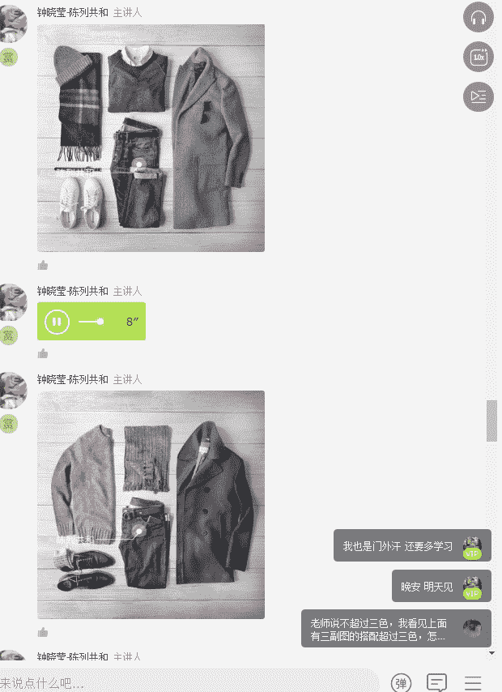

那当然接下来呢我就推荐大家可以去买一件这种军绿色的，因为军绿色比较容易呃出时尚感。

但是我不太建议大家买这种白色啊，这种颜色是很难搭的，而且非常考肤色。同时嗯如果你肤色很黑，你穿上这样子颜色的大衣。第一，它很容易脏哈。在冬天的时候穿这样的大衣。第二个就是它在冬天很难搭配衣服。

好了，接下来给大家看到的就是呢子大衣的一个搭配的禁忌。那其实呢子大衣呢最重要的搭配，我觉得是要看长度。

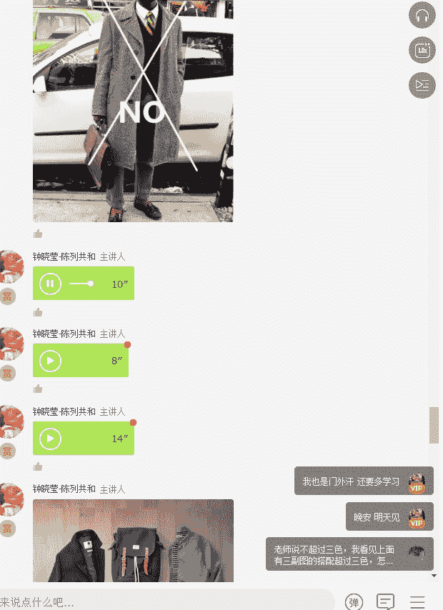

你比如说如果我们的身高是1。70米的男士，那我建议你的呢子大衣就不要超过膝盖。

当然因为你的身高很高，你就可以去穿到这种及膝的啊及膝的这种大衣。但如果除非你有一米8模特的身材，不然的话，你不要去穿到脚踝的这种长度的大衣。

还有另外一个就是大衣，你会发现，其实呃特别是男装的大衣，呃，这种呢子大衣的款式一般来说都是这种插肩袖的那也有一种袖子呢是呃比较时尚感的，就是它不是插肩袖，它是直接连肩袖。

但是连肩袖的大衣呢不太适合呃这种怎么说呢？就是。我们要在职场当中，我建议如果你不是时尚公司，就不要穿那种特别夸张的廓形的大衣。比如说像这种啊特别夸张的。

这个是不适合在正式职场当中穿着的那正式职场呢应该穿什么样子的？下图给大家看。

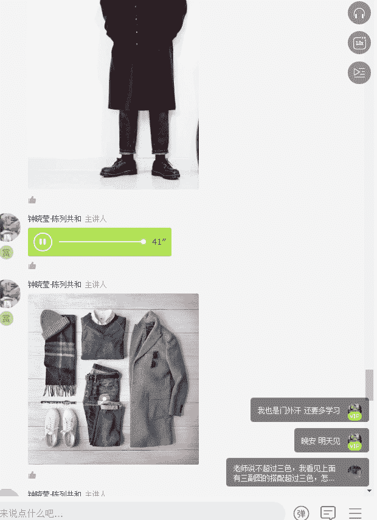

啊，接下来要给大家看到的这是是呃。职场当中应该要穿到的大衣，那一定是稍微要贴身一些。然后呢，同时呢它必须是要有一点点的什么呃有一点点的收腰，这样的话会比较适合。啊，当然了，如果是特别正式的场合。

选择的大衣，它也不能够有特别明显的大口袋，它的口袋有可能是斜插的啊，侧缝插插袋。那还有另外一个就是现在有一些呢子大衣呢，它会出现连帽的，就是连着帽子的那个如果你的年龄比较轻啊，28岁以前啊。

不要28岁以下的这种年龄，其实是可以穿着的。但是在职场当中，我建议大家，除非你是时尚品牌，时尚从业人员，不然的话不要去穿这种过度时尚的款式。大家一定记住，我在这堂课当中所强调的不是你要穿的多潮。

而是你要穿的得体。

好，大家现在看到的是示范的第三个单品啊，风衣。那风衣呢分为长风衣和短风衣。那当然了还是一样，如果你的个子不超过1。76米哈，我建议大家不要去穿长风衣。那大家可以看到吴亦凡先生穿的这件风衣。

其实第一他很考个子啊，还有因为他的这个原有两个原因。第一他的长度，第二，他的廓型，你会发现他廓型不是收腰的。它廓形是偏H型的。还有第二个就是它的这个肩章位置啊，这种肩章位置呢呃是比较适合溜肩的男士穿的。

不适合直肩的男士。比如说有一些男士他的肩膀是很直的，特别是有一些军人的肩膀，它就是很直线的那这种有直线感的这种肩膀呢，如果再穿这种可能就会显得脖子变短的。那还有一个就是长风衣戴帽啊。

这种其实是比较看到是比较传统的，它是单排扣风衣，那单排扣风衣都有个特点，就会显得老气一些。那如果你想显年轻就选择短风衣的单品。这种是比较适合一。7米左右啊，1。

75米以下的这种男士来选择的因为第一不会显得特别拖沓，但是同时呢又能够很很很精致。好，大家现在看到的这些都是风衣的搭配的一个示范。那呃风衣的搭配其实有分好几好几个场合，还是那句话。

就是我们要回到我们自己的核心场景。呃，现在给大家看到的这个核心场景是属于上班的场景，它里面一定会穿西服，或者是穿稍微正式一点的外套，然后外面再套件风衣。其实你去到欧洲，包括在日本和韩国。

很多男士在正常上班期间都是这么穿的。大家现在看到的这种穿着的方式呢，是偏向于时尚和休闲的。但是我觉得其实有很多文艺男是很适合这样穿的。大家有没有看到上下颜色的呼应，白袜子和上面的白的英文字母啊。

红围巾跟下面鞋子的红色来做一个相互的呼应。其实这个是蛮适合一些文艺男的穿着。当然，如果穿这种H型的这种宽大的风衣的话，对于你的身高的要求也是比较大的。好。

给大家现在看到的是两款比较casual的这样子的风衣的搭配的方式。那我在这里面特别推荐大家选择风衣时候的颜色，第一款卡其色，第二款深蓝色。如果你还想要多买一款，你可以买黑色或者是橄榄绿。

那风衣也是一样的，有分双排扣和单排扣。那双排扣的特点呢就是看上去会更精致和更时尚一些。那单排扣的特点就是它的异窗性会比较高。然后什么叫做单排扣的风衣呢？我现在给大家看到做一个示范。

现在给大家看到的这个就是单排扣的风衣。那风衣呢其实它的面料都有一个特点。首先第一个它是必须要挡风的。第二个就是有可能它是要挡雨的。

好，大家可以看到一个是卡其色的搭配，一个是这种军绿色的搭配。

那当然还有一一种搭配的方法，就是我们今年特别特别流行的用呃连连帽衫这种卫衣来搭配外套或者风衣。

但是大家看到这个男士穿穿着的，它是里外同一个色系的这就会体现出非常强的精致感。

那当然了，这个呃意大利男士搭配的这种感觉其实也是非常呃推荐的。呃，用条纹衫来搭配这种蓝色的这种风衣外套也是很有范儿。但是你一定记住，下半部分可以穿牛仔裤或者是穿卡其色的裤子。

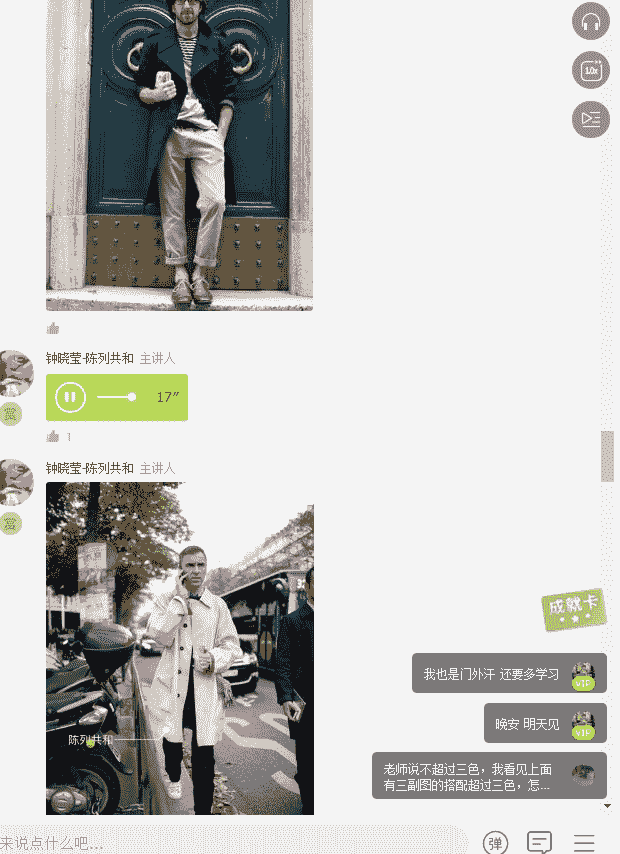

好，在这里面我不太建议大家去选择这么白的风衣，因为这么白的风衣其实是很难驾驭的。

然后也不要选择颜色这么艳的风衣，也很难驾驭。

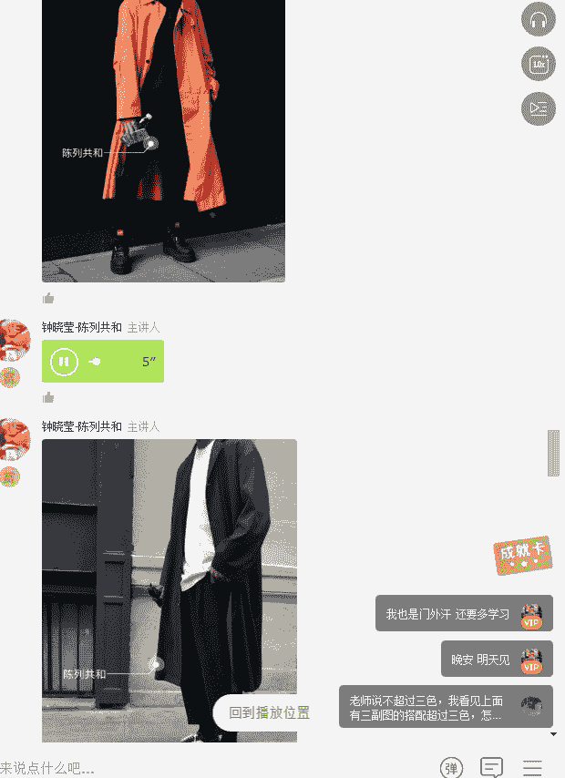

还有另外就是不要选择像这种很宽大的，没有任何型的这种风衣，这个是比较适合嘻哈风格或者是街头风格，不符合我们要的得体。

好，大家现在看到的这就是风衣的禁忌。那这个风衣禁忌里面大家可以看到，首先第一个no就是穿的太女性化了，太瘦了。那我相信大家是不会这么穿的哈，这是是吃穷莫辩。而另外一个就是不要选择这种格子式的风衣。

格子式的风衣其实是很难驾驭的，对于身材的挑战是非常大的。

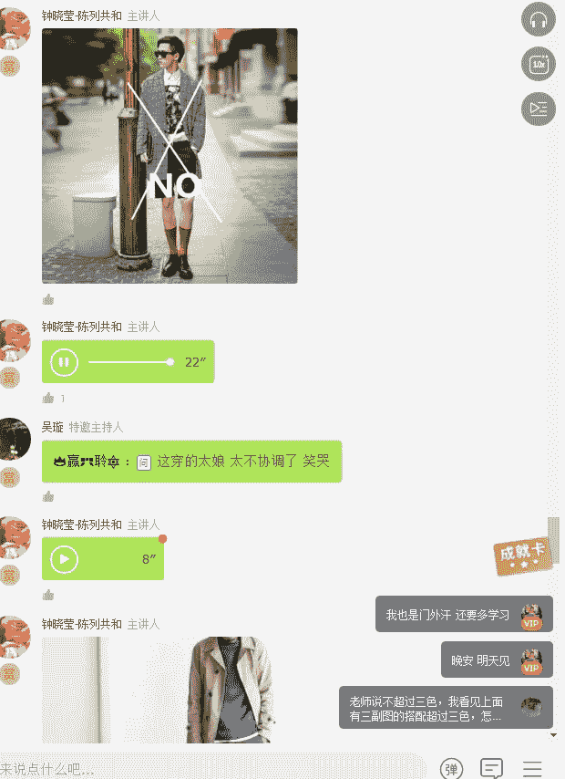

是的，穿的太娘了，太不协调了。所以真正好看的东西是一定符合大众审美的。那最后呢给大家看几张，就是符合我们大众审美的。

你看到了很多日本的职场男士，其实他们选择的风衣都是刚刚到臀部往下，大概5公分到10公分左右啊，有些是8公分。所以大家不要去选择那种过膝的风衣。比如说像呃刚刚吴亦凡穿的那种，他就非常挑战我们的身高了。

对我们身高的要求就非常大了。所以我大我是比较建议大家选择这款burary的这个长度的。然后选择的颜色呢，我建议是选择卡其和蓝色。

啊，当然了，你的年纪如果稍长一点的话，我建议选择这种单排扣的呃风衣，这样会显得更加的有绅士风格。

好了，以上就是我们今天要讲到的三个衣橱基本单品当中的毛衣、呢子大衣以及风衣。我们明天课程呢会继续跟大家去讲我们配饰当中非常关键的鞋子，鞋子我是单独挑出来讲的，所以明天鞋子的篇幅会比较多。

那鞋子里面我们肯定会呃融入一小部分的袜子。因为不同的鞋子搭配的袜子肯定是不太一样的那我们到最后一呃到星期天的时候呢，我们就会讲到我们最后的这个基础单品里面的最后一张图。呃。

最后一张呃最后一个单品就是配饰。那配饰配饰里面我们会包括围巾手表腰带。好了，直到现在我们总共讲过了几个单品呢，第一个T恤，第二个衬衣，第三个西裤，第四个修身的西服，第五个休闲的西服。那讲到了毛衣。

讲到了呢子大衣，讲到了风衣，也就代表我们讲到了8个单品。那我想问一下在座各位同学，你们的8个基础单品都有吗？都有吗？请在讨论区告诉我。好了，最后用一句话来结束我们今天的呃课程的内容。

但是我还是在这里停留5分钟回答大家的问题。大家永远记住，所谓的好品味就是不过度用力的去打扮自己。再重复一遍，所谓的好品味就是不过度用力的去打扮自己。好，在这里我回答一下刚刚呃有位问的问题哈。

风衣和呢子有什么区别？风衣是一个服装的款式，那风衣又叫做风雨衣，其实它是起源于当时的一次大战，一次世界大战时候，西部战场的军用大衣，也被称之为战壕衣啊，战壕服。而它这个战壕服呢是由b布y这个公司生产的。

也就是英国呃军队所穿着的这种风衣，它的特点，款式的特点就是前金双排扣。前襟双排扣，右肩附加裁带裁片开袋，配有同色的面料的腰带、肩袢、袖袢等等啊，这些。那因为战后之后呢，这个大这种这种风衣哈。

不能叫做大衣。这种风衣是被女装作为了很多的流行的运用，最后就开始了有了男女的区别，就从战战壕式的风衣变成了这种试穿型的风衣。而呢子呢它是一种面料，通常不会用呢子来做风衣，它只会用来做大衣啊。

或者是一些外套。我们很少会说啊，你穿一件呢子风衣，不会我们会说你穿一件呢子外套和呢子大衣。所以风衣它是一个服装的品类，呢子它只是面料，大衣才是品类。我之所以要加入呢子大衣。

意思就是呢子其实它是一个比较厚的毛织品。那做大衣呢是非常挺括的。所以你可以把呢子去掉，只写大衣也可以。然后另外一个就是脖子多短才为之短呢，我觉得这个是要看个人的身材比例的那从康有为先生，你的头像来看。

我认为你的脖子应该是不短的。好，呃，有为是这样子的，我们在这个课堂当中，其实更多的是讲搭配。但是呢我看到你问到了什么是日系风格，我就来这里简单的给你做一个回复。那其实你的店铺装成什么样的风格。

不是你的朋友叫你装成什么样的风格，而是你这个品牌的定位，以及你这个商品的风格是什么？你永远记住这个店铺的空间不是给我们自己住的，而是给商品自己居住的。所以你要回来看你的商品卖给谁，他有什么样的风格，呃。

卖给的这个原点人群，他喜欢什么样的一个调性，这才是我们要去思考这个空间要装修成什么样风格的原点。

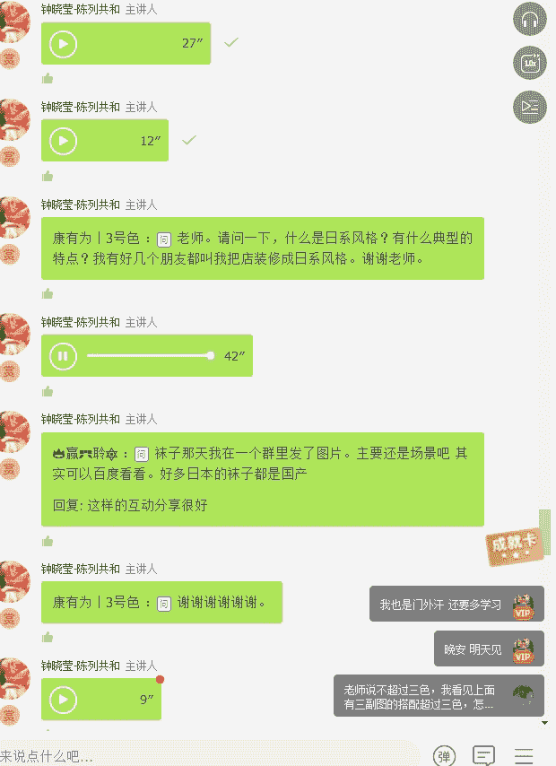

好啦，那我们今天的互动讨论就到这里啦。那我们。明天7点半不见不散。

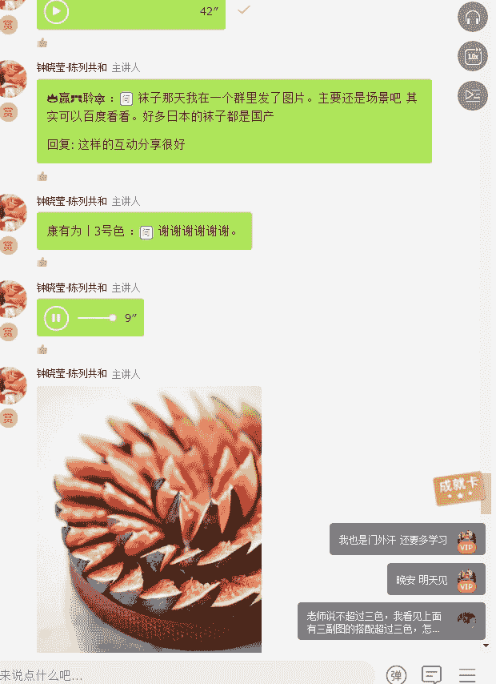

好的，感谢钟老师今天的精彩分享，谢谢。😊。

好，在课程的结束之前的话呢，有一个小小的忙，希望大家能够帮一一下。就是呢花费一小点时间，然后帮我们这一次的课程做一个评价。也就是点击那个链接进去之后的话呢，做一个评价。因为你的这个建议能。

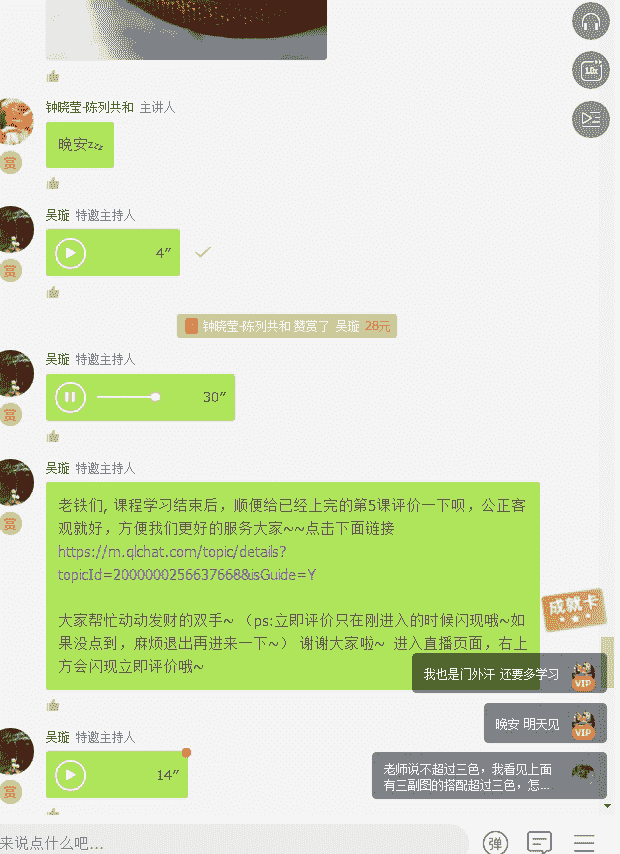