# 1、16男士衣品速成穿搭指南(完结）：第7课：男人基本款衣橱 必备单品和穿搭示范（四）：第7课：男人基本款衣橱 必备单品和穿搭示范（四）

大家晚上好，我是成业共和的钟小莹。再次在周末的晚上跟大家见面哦。刚刚发了一个我今天看到的一个图片，特别有趣啊，一家四口挣钱的，管钱的，花钱的，还有一个是新来的。好，今天我们就来谈谈我们家里的那些鞋子。

那我想跟大家说，其实对于男人来说，鞋子可能真的不多，但是对于女人来说，鞋子真的会很多。我自己就有100多双鞋子，那我妈常常戏称说，哎呀，我我女儿是蜈蚣吗？怎么需要穿这么多双鞋子。那对于鞋子的这个部分。

我觉得我是很有发言权的那男人也好，女人也好，特别是男性啊，我觉得凸显一个男性的品味的有三大样东西。第一，他的手表。第二，他的鞋子，第三就是他的皮带。

在开始正式的内容之前，我给大家看几张照片。首先就是我们穿鞋的误区的照片。首先第一个就是你没事，别露脚趾啊，正式的场呃正式的上班场合当中，如果穿这露这么多脚趾的拖鞋的男士也是很尴尬的。

第二个就是不要穿的这么锃量的皮鞋，还搭配牛仔裤，因为他们两个之间的风格是完全不相符的。

。

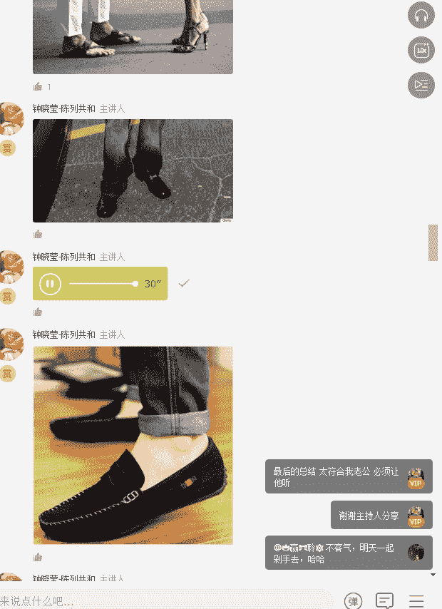

对于一个男士来说，其实鞋子真的是很提升自己的品味的那我刚刚看到讨论区，有人说那个嗯有1双鞋，哎，我觉得还不错。然后有些同学说只有呃只有一双鞋。啊，一11一套配西服西裤，还有一套是配休闲，大概是两双。

其实我觉得鞋子一定要正式场正式的正式搭配场合，上班场合应该有两双休闲的是可以有两双，然后当然还有运动的。所以我觉得正常应该三个核心场景里面，我们应该要6双鞋。

男人应该有几双鞋呢？我觉得男人不需要多，你应该要拥有五双鞋。第一双鞋就是你作为职场人，你必须要有一双黑色的德比鞋。那我待会会告诉大家什么叫做德比鞋。这个就是我们说的德比鞋。

我们先把男人应该拥有的五双鞋告诉大家。然后第二双呢叫做布洛克鞋啊，大家应该知道什么叫布洛克鞋。那布洛克鞋呢有个非常大的特点，就是它是英伦鞋子里面的一个非常重要的一个经典鞋款。

大家现在看到的是非常标准的呃布洛克呃德比鞋。那马上给大家看到的是呃布洛克鞋。

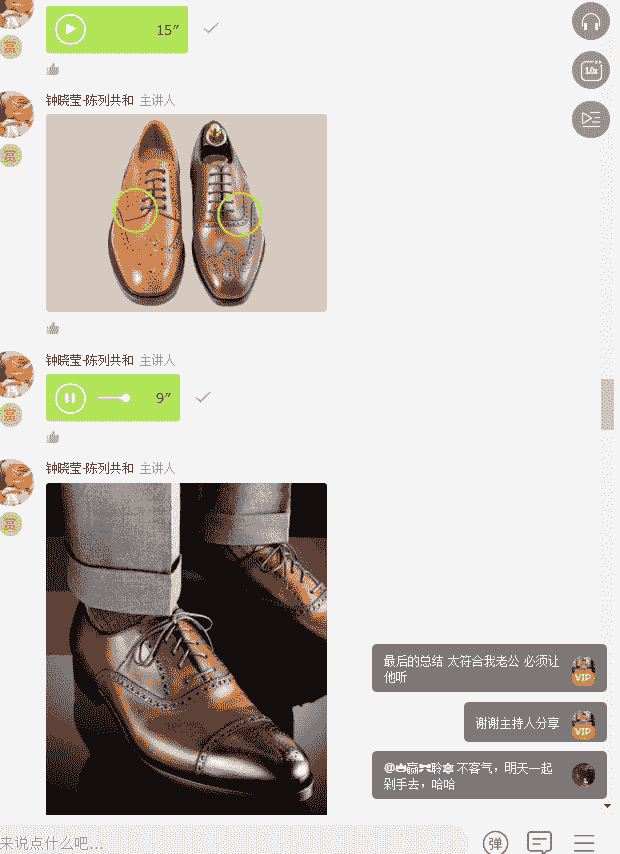

好，那么大家现在看到的就是布洛克了。那布洛克的特点跟德比的特点会有一些区别啊，德比更加的正式。而布洛克呢系带的位置，德比的系带位置会长一点，而，布洛克系带的位置没有那么长。

那接下来呢还会有一个非常重要的一个高帮的马靴啊，就是马丁靴这种类型的呃，类似于马丁靴吧。但其实它不是马丁靴。

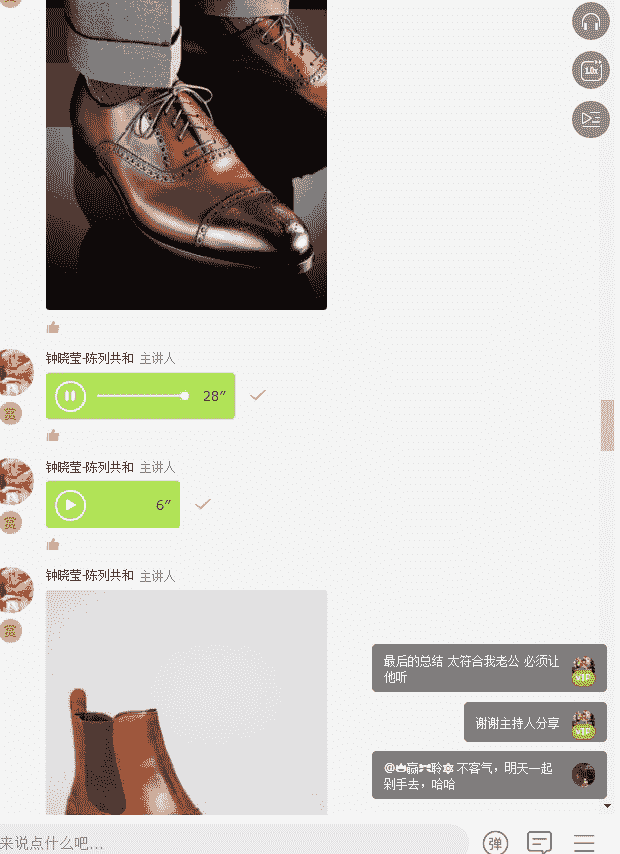

比如说可能我们会选择切尔西学这样子的产这样子的特点。

好，那接下来第四双鞋呢，我认为男人应该有一双匡威。

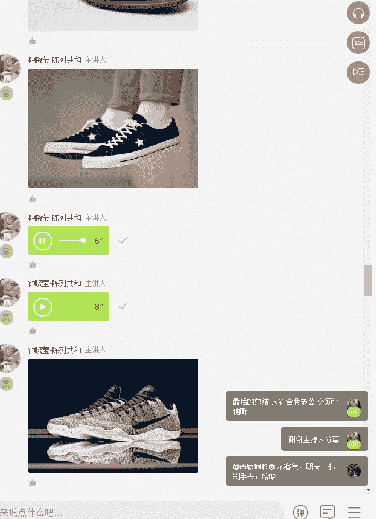

好，第五双鞋呢，男应该有一双什么鞋呢？你们猜猜看男应该有一双运动鞋。

好了，这就是我给大家提出来的男应该拥有五双鞋的概念。第一个就是搭配正装穿的德比鞋。第二个搭配正装休闲都可以的。特别是搭配牛仔裤，特别好看的这种啊布洛克鞋。那比如说啊第三双就是我们常说的御寒高手。

就是这种高筒一点点的切尔西鞋。然后第四双鞋就是匡威，第五双鞋就是球鞋。那在座的各位同学，你们拥有这5个类别的鞋子的，请在那个什么请在那个。呃，头务区告诉我，你说我有我满足了这个条件。

好吧，那么我们现在就开始进入正式的呃，按场合来搭配鞋子的这个场景里面了。

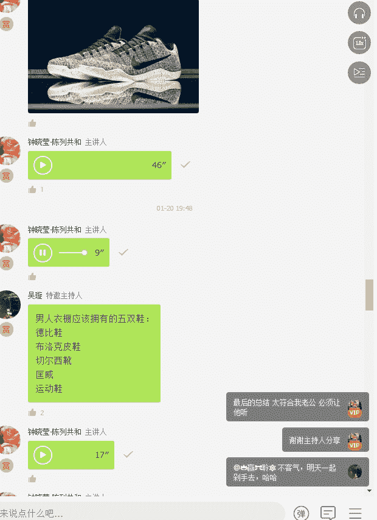

我们都知道我们在工作过程当中呃，在休闲的过程当中，在运动的过程当中都应该有不同的鞋子。所以我今天会跟大家讲三个场景，三个生活场景。第一个上班的时候，第二个休闲的时候，第三个就是你运动的时候。

首先今天我想反过来，我先让大家来看一些搭配鞋子的禁忌点在哪里。然后接下来我们再进入到正常的搭配当中。

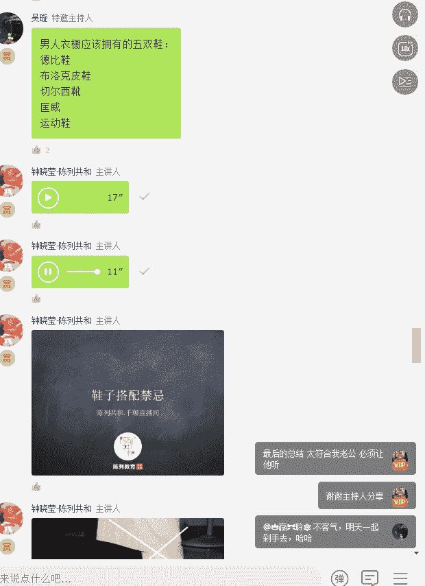

首先大家猜猜第一个禁忌是什么？一定是这个就是穿黑鞋配白袜。

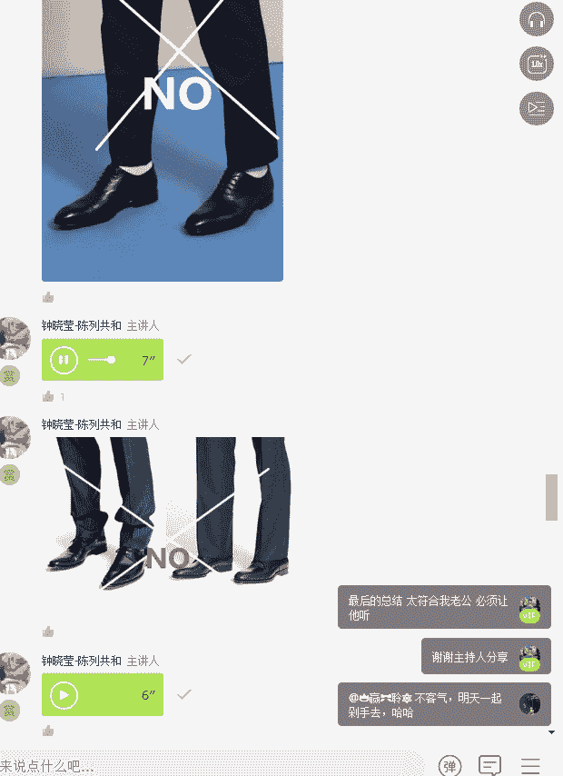

那第二个呢就是裤长太长，然后窝的两圈都在这里。

好，第三个就是像乞丐一样的挽裤脚，或者是直接勾腿毛。

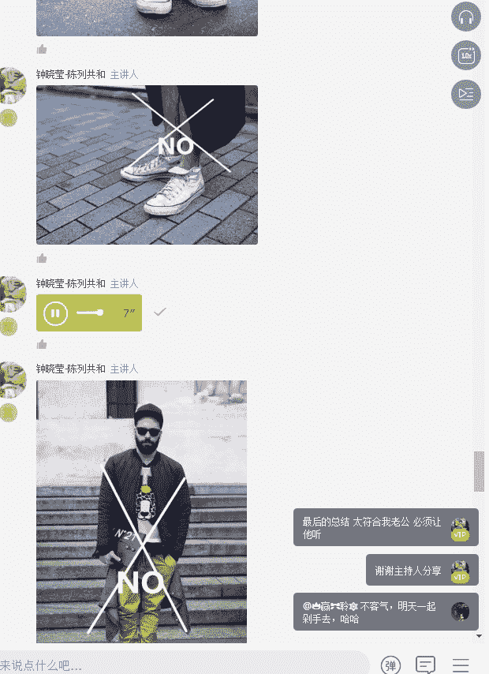

最后一个就是穿特别艳色的鞋子。好，大家去自我去思考一下，看看我们这几个有没有中招啊。你知道吗？曾经有我在网上听一个段子，说有一个男生，就因为他老板开会的时候穿了双白黑鞋白袜子，他就辞职了。

因为他觉得这个老板太没有品味了，跟着他一定没有前途。那个两子缺一双就补上啊。好了，所以接下来呢我会跟大家讲到我们生活当中常用到鞋子的三个场景。第一，上班，第二，休闲。第三运动，这是我们核心的生活场景。

这三个场景是我们每个人都会遇到的。

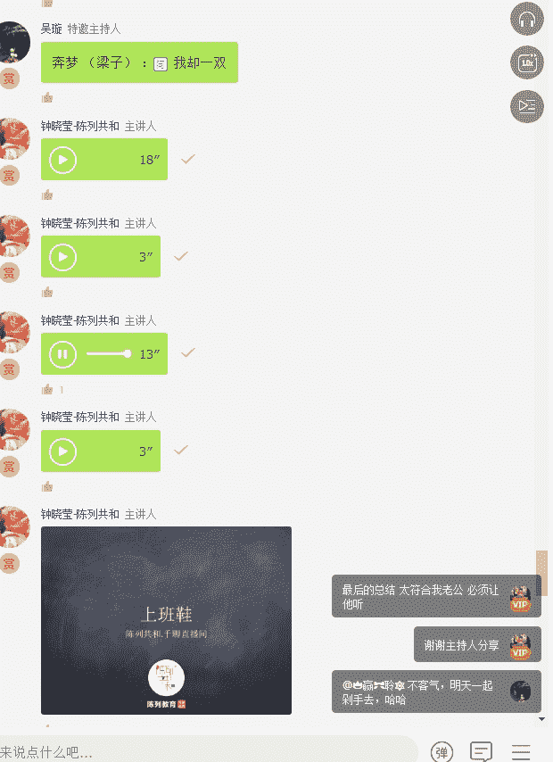

所以在这里面我先跟大家来讲讲到底上上班的时候，你需要拥有的单品是什么？首先第一个你要拥有一双系带鞋。

当然，系带鞋你可以选择很多种不同的颜色啊，比如说棕色，比如说黑色，比如说这种深棕色。

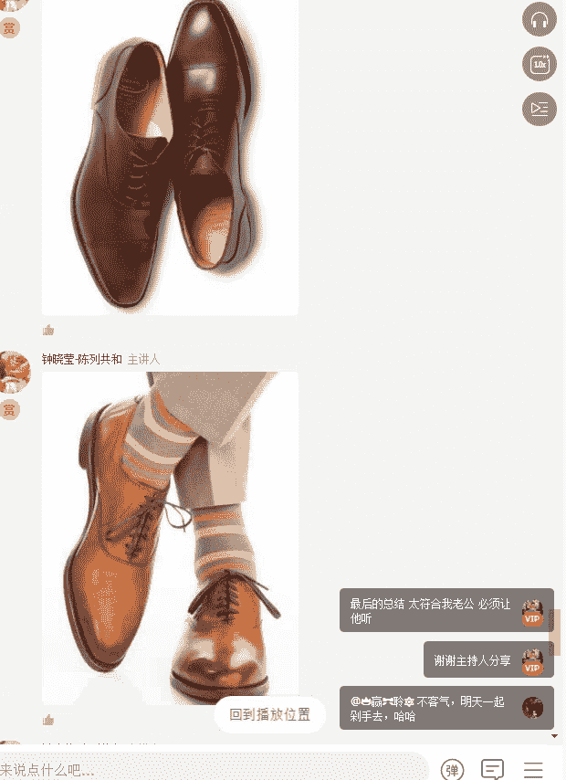

还有蓝色都是可以选择了。一般来说保守一点，就是建议大家去选择深一点的颜色。那鞋子要跟什么呼应呢？考试鞋子应该跟什么呼应，跟身上的哪一个部位的配饰进行呼应。在这里面我想考试，想问问大家。

到底鞋子应该跟什么样的东西呼应呢？

大家回答的非常准确啊，我曾经说过，男士穿衣服不要超过三0，那你的鞋子，你的皮带，还有你的手表，还有你的包包，都应该是呈现出同一个色彩是最好的这是最能够体现质感的。

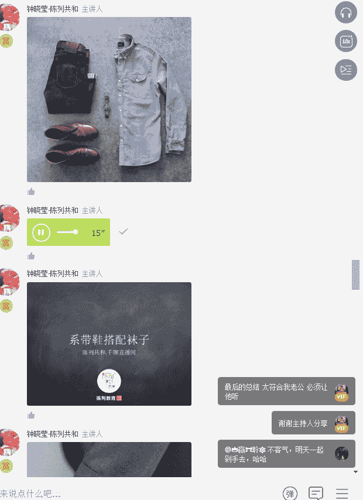

那好了，我们刚刚讲到了，上班时候你必须要拥有一双系带皮鞋。那这个系带皮鞋怎么去搭配袜子呢？这个是很关键啊，你可以搭配这种深色的袜子，你也可以搭配这种很闷骚的这种袜子。

那就要看你身上所穿的这个裤子的颜色了。还有包括你的毛衣啊等等一系列的颜色。因为最近这几年其实真的蛮蛮蛮注重这种鞋子的特点的，特别有很多的男士是很在意这个部分的。但是如果你你可以的话。

也可以选择这种不露袜子的。然后袜子相对来说比较低调的这种搭配也是可以的。那袜子一般来说呢，我建议如果你不是玩特别潮的范的这种搭配。那我建议你的袜子尽量跟你的裤子的颜色是一致的。这样第一。

你穿起来会比较得体。然后第二就是呃穿起来不至于是分节的，或者是还有另外一个就是如果你。

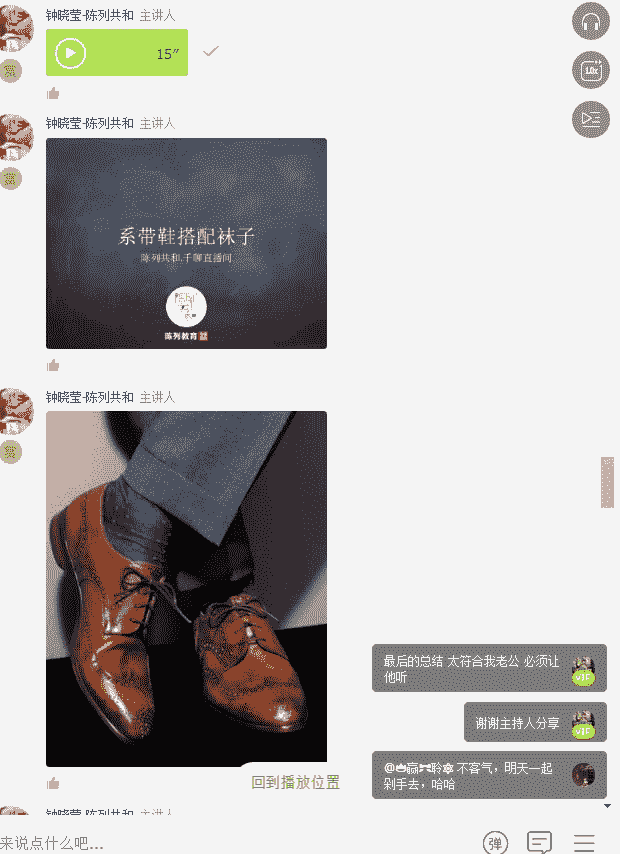

穿正装鞋的时候，你一定要记住一个点，这个点是什么？就是你不要穿的太短。如果你把袜子穿的太短的话，然后分分钟有可能你的这个一坐下来那个鞋子呃，那个裤子往上抽的时候，你这个袜子就露出来了。

同时呢还露出了脚毛。

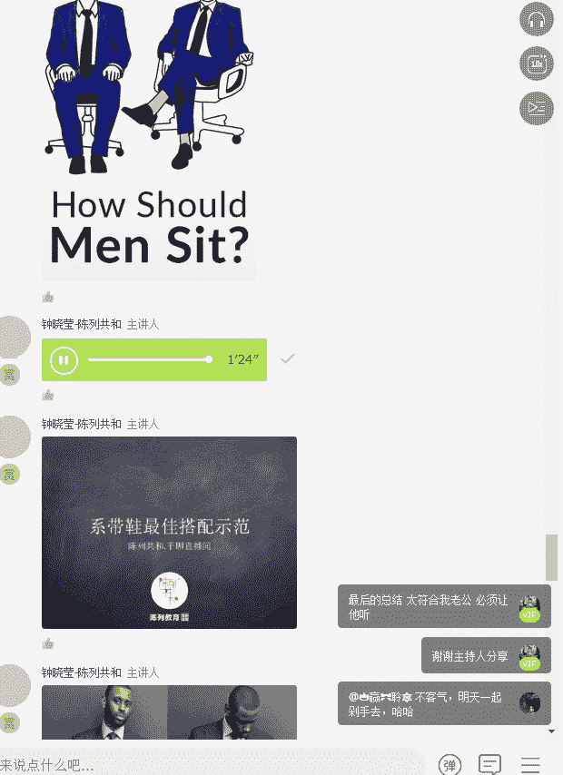

然后接下来因为是正装的场合，所以呢给大家啊一个几个参考哈，就是啊当然这个参考我觉得它不具备特别强的呃建议，特别是这套红色的，只是给大家养养眼。

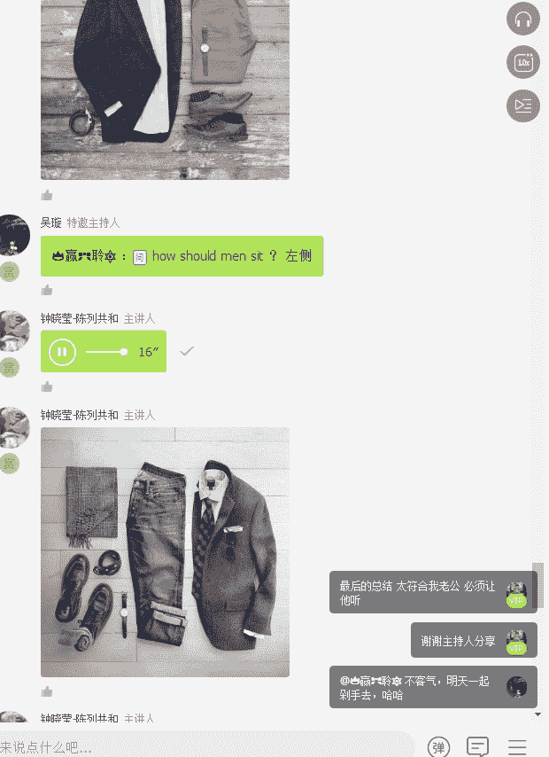

然后比如说这两套，我觉得是一些时尚创意公司或者是设计公司职场当中可以去选择穿着的搭配方式。当然，如果你不喜欢穿系带的话，你就可以选择这种乐福的单品。那这种乐福的单品呢，我觉得它很好很好穿，很易穿。

那同时呢其实它搭配起来也比较方便。

那我们就看看这种乐福鞋是怎么去搭配裤子的。我给大家一个建议，就是呃像图上的这些男士一样，把裤脚怎么样做一些卷边的这种处理。这个都属于乐福鞋，大家可以看到，其实真的蛮好看的那当然如果你不穿西裤的时候。

其实你也可以穿乐福鞋。比如说像这个穿牛仔裤的时候也可以穿乐福鞋。所以其实乐福鞋我觉得它的百搭性是很强的，甚至有些人夏天会用它来配短裤啊，或者是配一些很休闲的这种啊这种亚麻的裤子也是可以的。

但是我觉得穿正装的时候，特别是穿小西服，一整套小西服的时候是真的是帅呆了。

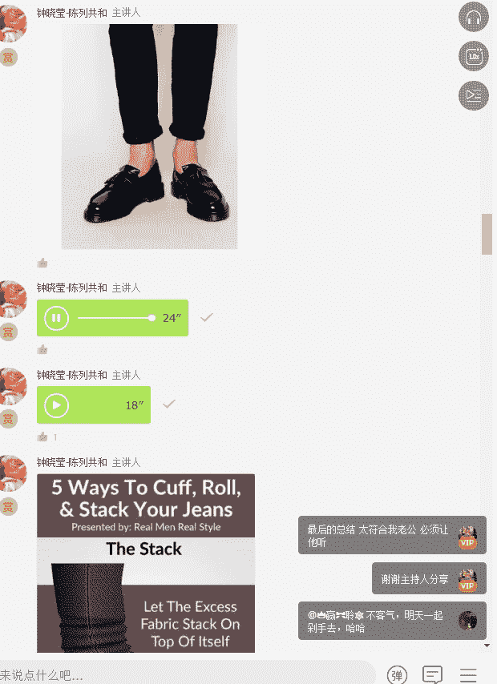

而，乐福鞋如果你的裤脚很长的话，一定是不好看的。如果在呃其实中国大部分男士在穿鞋子的时候啊，特别是裤脚啊都是偏长的。如果我们的裤脚是这个样子的话，一定是很很不得体的。你们看到这个图上面卷了好几圈。

那如果我们想要把裤脚变得更短一点的话，那我们可能就要学习。比如说一定记住我现在发上来的这个是非西裤的卷法，这个是一些休闲裤和牛仔裤的卷法，你就可以把它往上卷。特别是你穿这种切尔西靴的时候。

那这么做的呃优优点是什么呢？就是让整个男士的身高显得更高，腿会显得更长。

啊，在这里给大家提供呃四个颜色的鞋子的选择，一个是黑，一个是蓝，一个是深棕，一个是浅棕，这些颜色都可以选择。但是我现在发上来的这个其实是欧洲人特别喜欢的。很多欧洲绅士特别喜欢选择的一种颜色。

大家可以看到这种鞋子呢，但是其实话说回来穿的时间太长，其实是不太舒服的。因为它前半部分是全部都是夹紧的。所以呢对于呃男士穿才太长时间，这样的鞋子可能也会特别不舒服，所以大家也是谨慎选择。

然后选择一些皮质比较软一点的款式。

好，接下来要讲到的是正式上班场合当中的第三款鞋，就是布洛克鞋。那这个布洛克鞋呢它的特点其实大家看过那个王王王牌特工，你就看到它里面的很多的绅士，呃，穿正装的时候，其实他们都会选择这款鞋子。

因为这款鞋子是非常非常英伦的。

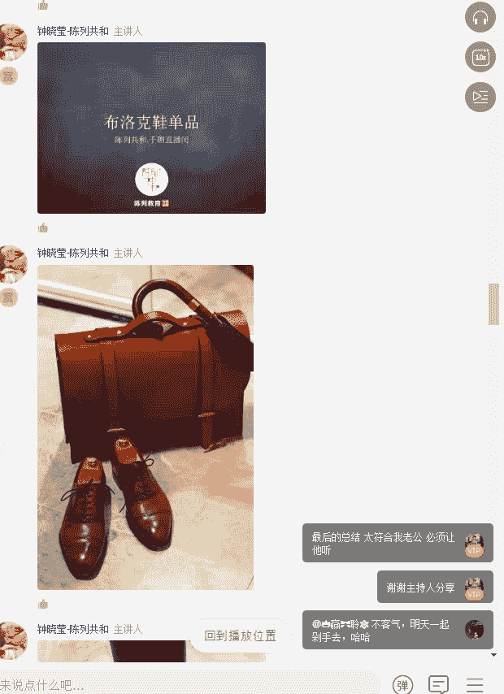

当然了，在这里面我提醒一下大家，袜子可以选择同鞋子的颜色一致，也可以选择跟裤子的颜色一致，也可以选择这种，或者是这种看上去反差和对比性特别强的。

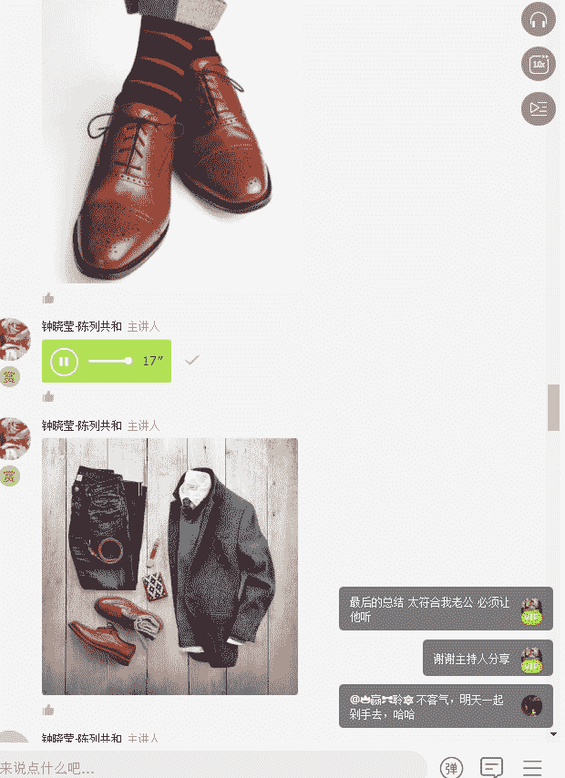

但是一定记住，如果你的身高不是特别的高，然后你你的身材也不是特别的标准，又有点微胖，我建议不要选择太过于炫的袜子。一定记住，袜子一定是跟身上的某一个配件的颜色是相呼应的。比如说外套啊呃。

比如说上衣呃比如说毛衣啊呃，又比如说是这个呃手手链啊，手带啊，我们明天就会讲到。

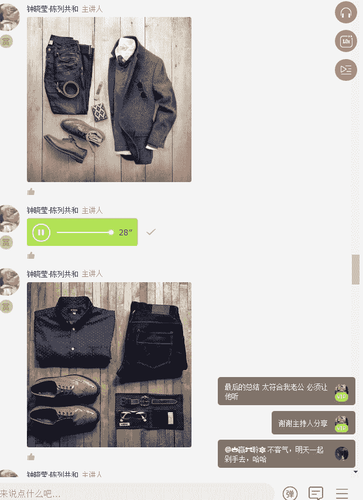

好，那我建议大家在选择袜子和鞋子和裤子的时候，一定记住几个要点。第一，尽量的选择什么呢？选择跟自己的裤子的颜色一致的袜子。因为显得腿腿长，显得没有那么明显和突兀。第二个就是如果你有点微胖。

然后你就不要去穿太过于呃艳丽的袜子，除非你是设计师，除非你是潮酷派。那不然的话就不要去选择太过于闷骚的袜子。那还有另外一个就是一定记住鞋子腰带和外套的颜色，尽可能的去呼应。比如说我现在发上来的这一套。

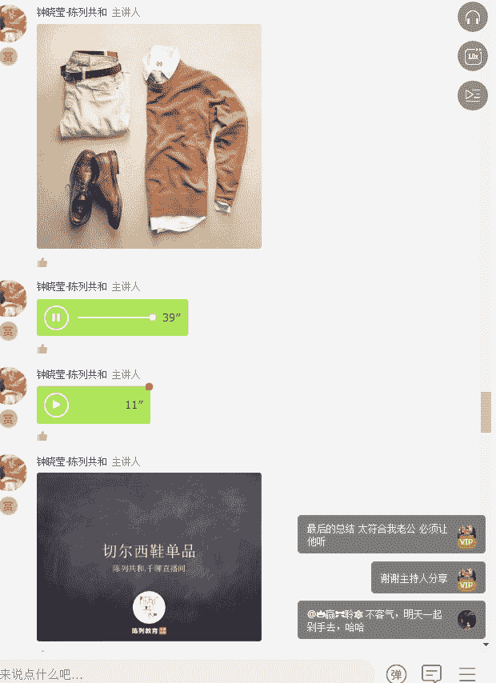

好了，那接下来呢给大家推荐一个在休闲的场合当中，或者是正式的场合当中都可以穿着的一款单鞋叫做切尔西。好，切尔西靴呢其实它真的是非常的广泛，特别是男女都有这一双鞋这这个单款鞋。

最近这几年也是非常潮流的那对于切尔西西西的这个鞋子，它应该怎么样去搭配西裤呢？大家可以看到不要搭配太长的裤子，其实它可以搭配西裤，也可以搭配牛仔裤，都是很好看的。但是一定记住，不要像接下来这样穿。

不要像这个呃这个男士的这个鞋子跟裤子中间这样露出个腿部的肌肤，一定记住，它不能够肌肤，你一定要把那个袜子跟它进行联动。

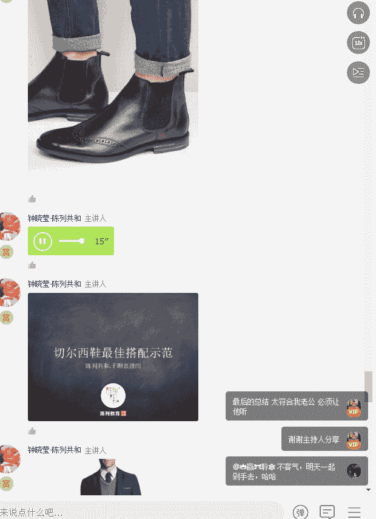

我在这里想跟大家讲，如果你想显高，就记住用切尔西靴来装点你的衣橱。为什么？因为它真的会让男人变得更加的挺拔。那比如说在穿，如果你真的想让自己显高。

你一定要记住选择这种同色系的裤子、袜子和鞋子同色系的呃这样子的搭配。

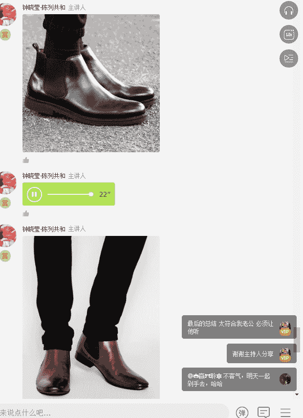

还有另外一个就是穿切尔西的时候，裤子不要太长。

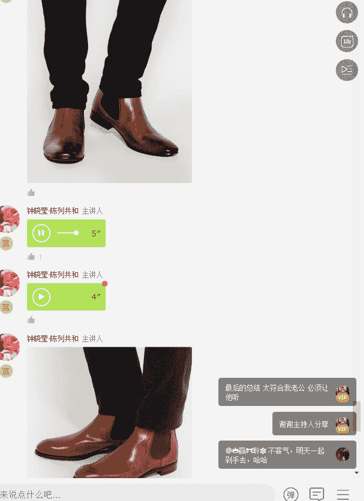

你比如说我现在发上来的这张图，就是裤子太长了。

那裤子呢刚好就是在呃鞋跟往上走，然，同时其实在脚踝的那个位置是最好的，不要太长，因为太长的话会显得很拖沓，当然也不要太短。

大家知道吗？个子越矮的男生越适合穿切尔西，因为他会显得非常的挺括。那当然了，切尔西除了皮质之外，他还有这种反皮的都是推荐大家去选择的。

其实在欧中，大部分的男士1到秋冬天的时候，他们一定会穿切尔西，因为第一保暖，第二个不容易呃就不容易进风嘛。那当然了，像穿切尔西的时候，你的裤脚呢。

我真的是建议大家可以用到刚刚我们给大家看到的这种啊那个呃乐福鞋的这种感觉的裤脚。比如说像这种大翻脚边的裤脚。

呃，如果裤子是黑色的，我推荐什么样的颜色的袜子啊？嗯，其实黑色的裤子和鞋子，那我建议你就是要么就是选择一些有格纹的啊，不要选择太红的，然后选择一些条纹的或者是波点的，但是一定记住，要呼应你身上的衣服。

当然也有一些人是玩的很潮的，他的所有的袜子跟那个呃鞋子有时候是反差非常大的，但是他不适合大众。

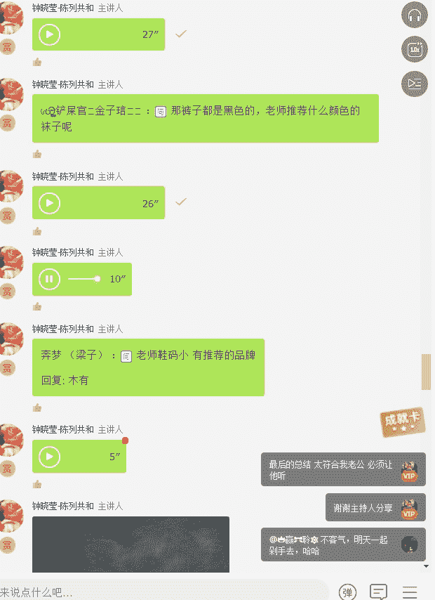

我想知道梁子，你的脚小到什么程度啊，不会是37码吧。好了，我们现在进入到休闲鞋的这个款式。其实休闲鞋有很多种。那在今天呢我主要是讲一一个是走路用的这种呃鞋子啊，就是平时的这种类似于潮一点的走。

就是这种运动鞋啊，我们把它称之为休闲运动鞋。啊。另外一种呢就是啊我们也蛮常穿穿的匡威。

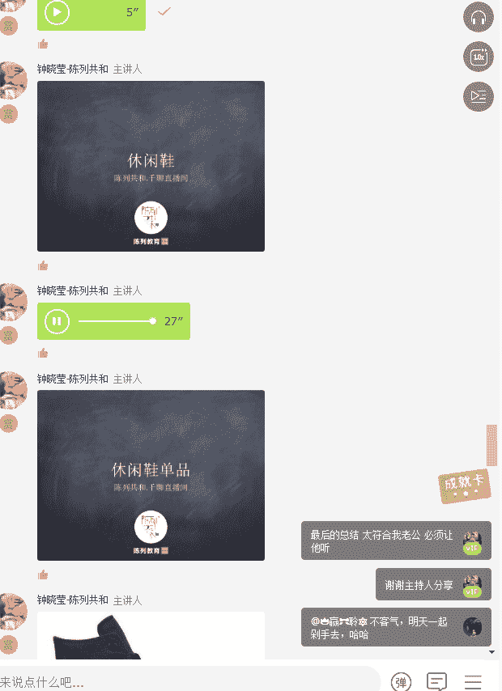

其实穿匡威的时候，你就可以穿白色的袜子啦。那你穿正装鞋子的时候，千万不要穿白色的袜子。

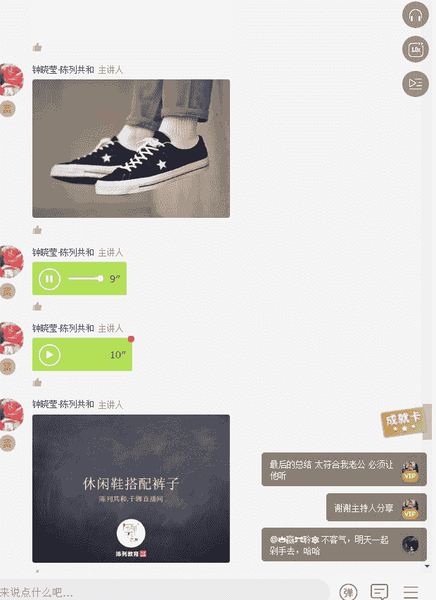

其实匡威我是觉得适合很多人的，我问任何的年纪。而且其实现在有些人玩混搭，会用匡威来配这种西裤，其实也蛮好看的。好，给大家看到的这三种状态，一个是穿西服，一个是牛仔裤啊，一个是休闲裤的感觉。

其实都可以选择。

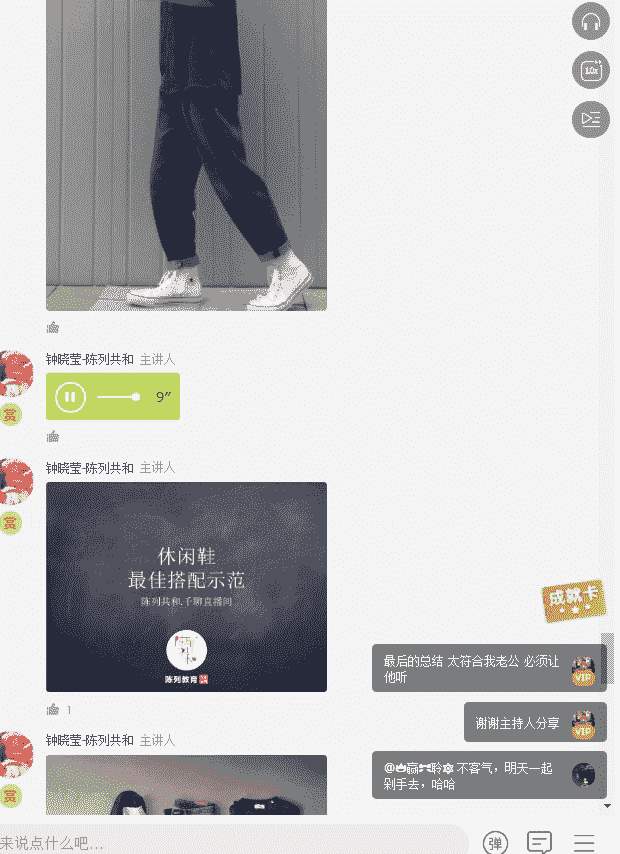

好，大家看到了吗？匡威的搭配其实是非常多元化的，而且其实我觉得匡威是属于那种无领鞋。什么叫无领鞋？就是任何一个年纪的人仿佛好像都能够穿匡威。

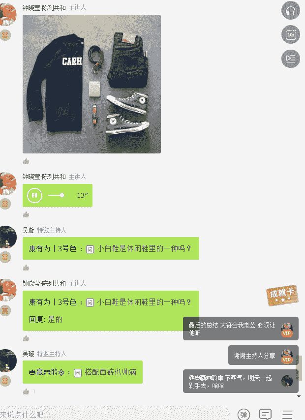

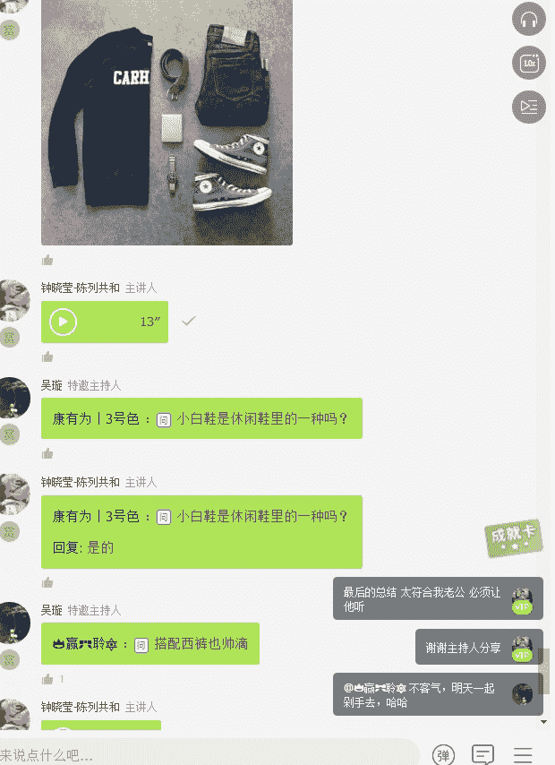

啊，玲莹莹很有品味啊，搭配西裤也真的是很帅的。我个人有时候就会用西裤来配这个匡威的小白鞋和小蓝鞋。或者是穿牛仔裤的时候用它来搭，然后上面穿呃西服也是很棒的。

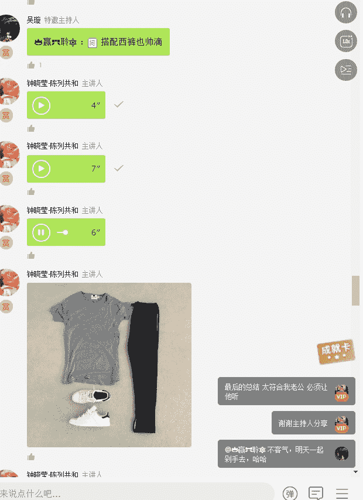

大家现在看到这种就是属于那种休闲的仿运动鞋。什么叫休闲的仿运动鞋呢？就是在这个呃搭配里面，大家可以看到就是它是非常非常随意的。

然后在整个的一个搭配的过程里面，这是我们最常见的一种打法。因为现在人真的是职场的概念越来越淡了啊，就是除非是那种金融啊、房地产啊，或者是一些非常比如说像这种搭配的方式，也是我们常用的。

或者是用它来搭衬衫。

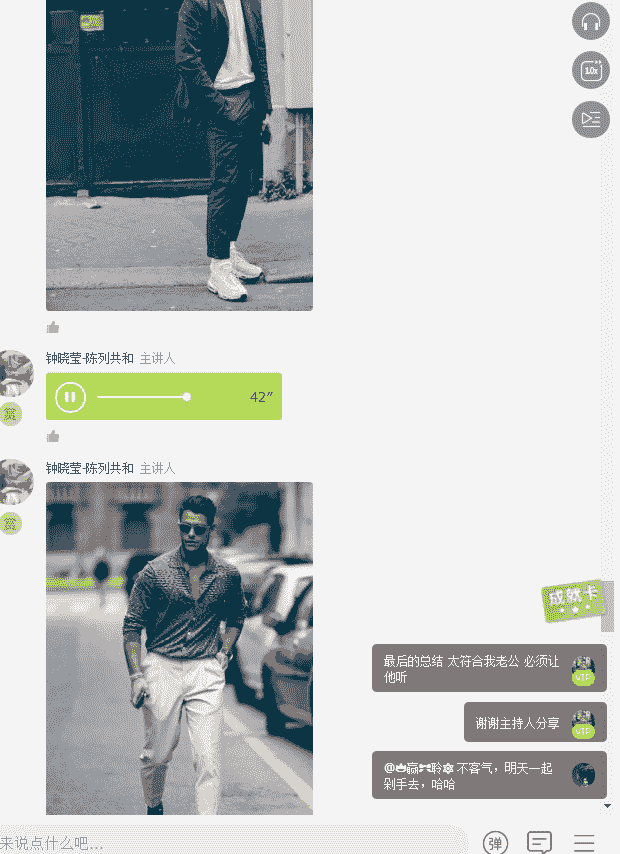

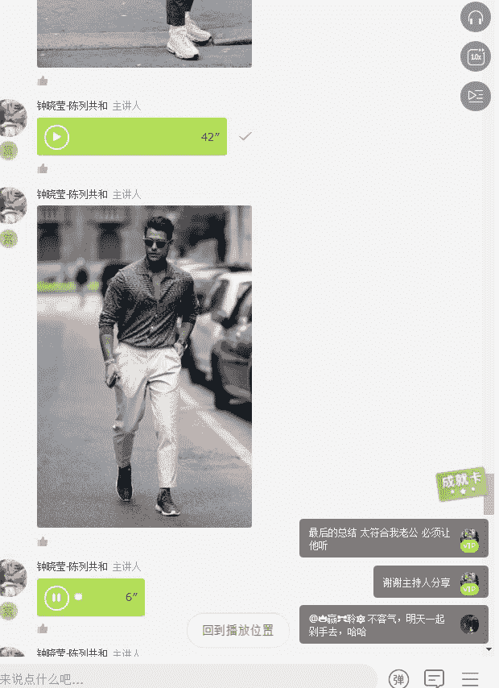

好，大家看到了吗？给大家看到的这些示范。其实我挑出来的呃所有的这些图，其实对大家来说可穿性都是非常强的。你们永远记住那几条就好了，上下呼应，然后选用三色，不超过三色原则。你比如说黑白灰三色都可以。

然后或者是格子，然后呼应牛仔裤都可以，或者是牛仔跟牛仔搭都可以，或者是灰白不同颜色的深浅的这种过渡也可以。

好了，接下来我们马上迎来最后一个呃生活当中的场景，那么就是运动了。我觉得运动必须要有运动鞋。

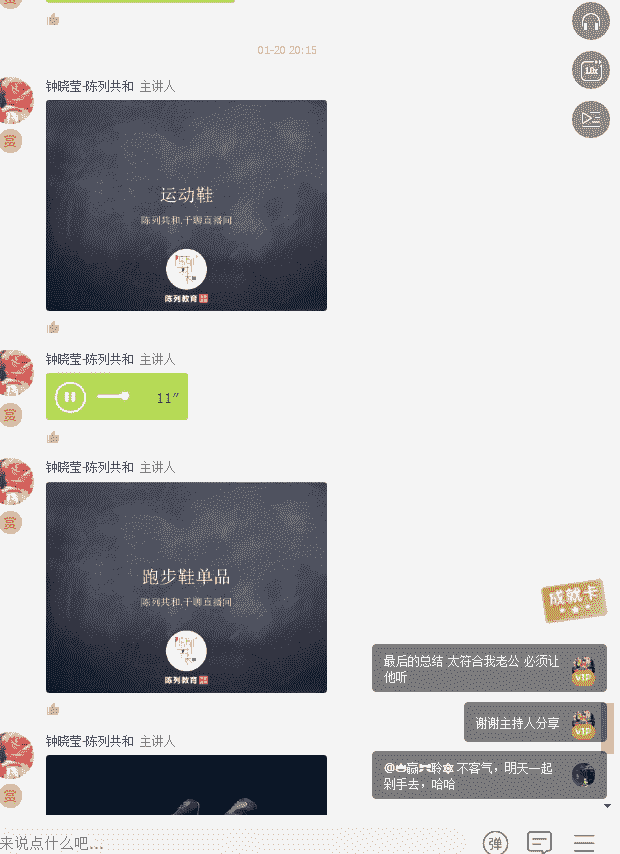

那运动呢我觉得最经常我们遇到的就是跑步了。所以呢我特别推荐大家去呃一定要买一双跑步鞋的单品。那你说跑步我我觉得从专业的角度可能耐克啊会好过阿迪吧。因为他的跑步的这种功能的研究会更多一些。

当然了，也有一些人会把这种跑步鞋拿来做日常的这种搭配也是可以的。

比如说现在特别流行的就是这样穿，就是它很舒服。那同时但是他脚下穿的是跑步鞋。但是你记住哦，如果你真正在跑步的过程当中，你穿的呃袜子肯定就是这种白色的袜子了，这种运动型的这种袜子。

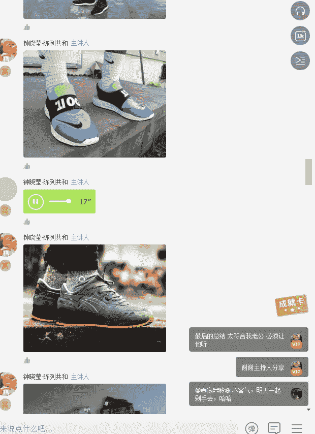

当然还有一种休闲鞋，其实我我觉得它还蛮重要的，其实就是有点像这种那个纽巴伦的这种款式。然后呢，它有很多的这种搭配的休闲衣服的这种方式啊。当然了我觉得纽巴伦的鞋子是不能用来跑步的。

但是它可以用来搭配很多的这种时尚单品。

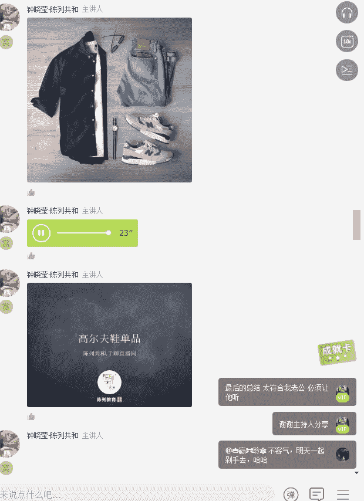

啊，最后呢不得不跟大家去推荐一个单品，因为现在打高尔夫的人越来越多了，大家也应该知道高尔夫鞋是有专门的鞋子的。

两个好女人啊，尽情的买吧，促进一下中国零售发展。

好了，那接下来给大家看到的就是高尔夫鞋搭配的裤子，可以是短裤，可以是长裤。但是一定记住它的面料必须是适合运动的，它是比较透气。

那在这里跟大家讲到的就是高尔夫鞋搭配的袜子。那我建议大家就是穿那种呃叫做船袜就好了，因为基本上不用露脚踝呃，不用露出来，不用看到袜子。给大家看看几组示范啊，简洁一点啊，不要穿太过于，一定记住。

不要去穿花袜子，打高尔夫的时候。那这个时候你就一定记住穿低调一点的袜子，深色一点的。如果你的裤子是白色，你可以穿白色。那如果你的裤子是深色，你就穿深色，一般来说都是这样去选择的。好了。

以上就是我们给到大家的三个生活场景。上班鞋，上班鞋我们拥有三双一双是系带的德比鞋啊，一双是切呃一双是波克，一双是乐福。那休闲鞋呢，可以是切尔西靴。那上班鞋可以是选择一双切尔西靴。那休闲鞋里面有匡威啊。

有纽巴伦。那运动鞋里面呢，我建议大家一定要配一双跑步鞋，还有高尔夫鞋。那如果你有走路的习惯的话，我建议你可以去买一下，买一双斯凯奇的这种走路鞋。还记得我们刚开始开场的时候讲到的男人要拥有的五双鞋吗？

第一双德比，第二双布洛克第三双切尔西，第四双匡威第五双运动。所以你不足五双的就请配主五双。因为你的生活场景当中需要你转换。什么叫精致的男人呢？精致的男人就是你在你的衣橱当中。

任何时候都能够找到合适你这个场合出席的单品。

好，接下来给大家看到的这个是什么呢？就是给大家的一个参考。然后什么样的裤子配什么样的袜子，然后同时配什么样的鞋子。

大家可以看到，男士的这个袜子是从船袜到中袜到特别长的这种袜子。那越配正装的袜子越需要长，因为你需要让自己坐下来的时候不会露出皮肤啊，不会露出腿毛。那越运动的鞋子，你会发现他的袜子就越短。

特别是你穿短裤的时候，如果你穿的是运动鞋。你的袜子可以高一点点。但是如果你是参加呃不不是参加运动的状况下面，你的袜子就可以是船袜可以完全看不见。

比如说有时候你可能会想要穿一双乐福鞋，然后但是呢你又想露出脚踝，那就请像这个男士一样穿里面的船袜是看不见的。

我们广东人是非常适应这么穿鞋的，因为呃光脚穿鞋是广东人的特点。但是如果你有脚汗的话，是建建议你不要这样穿，因为你的鞋子会比较容易有味道。好，给大家看到了船袜可以配的鞋子。

然后呃非呃长一点的鞋袜子可以配的鞋子。但是我不太建议大家穿袜子配凉鞋。

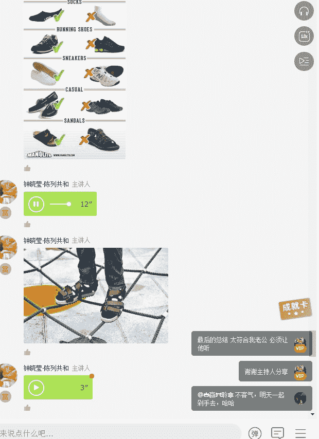

像这种穿法，我也是醉了。

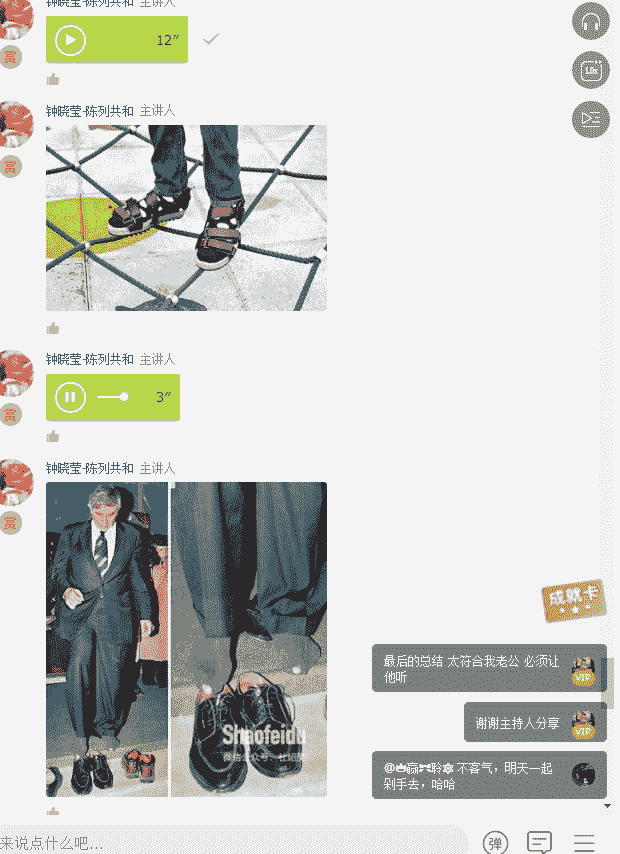

还有另外一个一定要提醒大家的，就是啊在你的这个袜子上面，一定要下一点本钱，不要等袜子破洞了，你还穿着它。比如说我在一个呃一个百度上找到了这张图片，就袜子有洞了，找到了一张图片。

这个是好像是一个国外的领导人吧，他你看他穿的袜子，你看他穿的袜子都破了，其实如果你遇到吃寿司的场景，比如说你要进入榻榻米的空间，结果你一拖鞋，袜子上面有洞是多尴尬的事情。

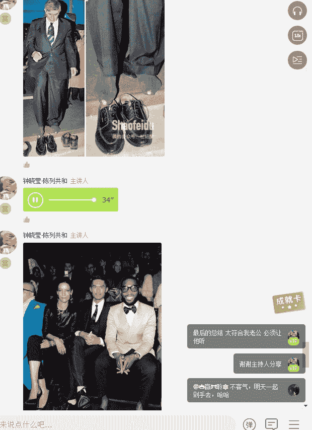

还要再次提醒，就千万不论你多男神，你穿白袜子都是很肉怯的。哈哈哈提到好多刺腿毛，因为我觉得在特别是在正式场合当中露出来真的是特别不好啊。😊，我还没有提到鼻毛嘞。

有很多人是那种呃那个什么呃鼻毛就像丛林一样的。好啦，最后给大家分享一些鞋子的款式，大家可以去看一下。那我给大家的建议是，第一，男士买鞋有几个要素，第一一定要买真皮。第二，你买完之后要常打理，啊。

打理鞋面和鞋底，有时候鞋边也要打理，其实一个人的鞋子是真的非常铺露自己的要求的。你会发现有些人的鞋子基本上是不擦的，你知道吗？皮鞋皮鞋，皮它是动物的皮肤，哎，你想一下你的脸在天冷的时候什么都不擦。

连大宝都不擦，你的脸过完一个冬季，我相信你一定裂出很多的痕。那皮鞋呢也是一样，它是要保养的，尽管它看起好像是没有生命力了，但是一定记住，皮鞋放久了，它会发霉，所以你要常常拿出来擦一下它。

然后让它保持干燥，所以呢给大家一个建议就是第二点就是要保养它。然后接下来第三个就是不要指着一双鞋穿到底。一年到头就穿一双鞋，到最后第一，你的脚一定会有味道。第二个，这个鞋子会很容易报废。

然后第四个就是买鞋的时候，一定要记住我的皮带是黑色的多还是咖啡色的多。但是其实我是建议大家每个男士呃正装有两条皮带，休闲装有两条皮带，那颜色都是呃选择黑咖啡和蓝色系，那鞋子也是一样的。

还有另外一个就是你的鞋子里面还是回到了刚刚说到的那个五双鞋，也就是我要说到的购买鞋子的5个要点当中的第五点就是你要拥有5个5双鞋子。如果你没有五双鞋子，你至少要满足三个生活场景，一个上班，一个休闲。

一个是运动。好了，第六个就是如果个子比较矮的男士，不要去穿那种呃太过于艳丽的袜子啊，如果你想显高，可以选择切膝靴。如果你想显高，你可以把裤脚变得更短一些，不要选择太长的裤脚，因为很长的裤脚。

它加重了你整体人的视觉的呃这个重心是往下走的。你整个人是不会往向上走的，还有就是如果想要身材好，我真的特别建议各位男士一定要健身，至少俯卧撑啊，仰卧起坐你是要做的。然后第七点哈应该是第七点了。

我就是建议大家回去打开自己的鞋柜，有一些真的是鞋底磨得很薄的鞋子，要么拿去加底，要么就把它淘汰掉了。特别是有一些鞋子都变形了，两个脚脚掌旁边都有一些拱出来的印记了，那一定要记住把它淘汰掉。好吧。

以上就是我这堂课当中的全部的内容。那接下来呢就给5分钟给大家问问题。明天晚上我们依然7点半不见不散，还是在这个直播间，我们去做基这个基本衣橱的最后一堂课，也就是男士的配饰。

其实这堂呃男士的这一个搭配穿搭课，其实我觉得我们最重要的目标设计这堂课之前的初心就是希望大家能够呃拥有一个非常基础，而且一穿一搭的衣橱，而不是玩出什么特别时尚的花样。因为我始终还是相信那句话。

干净比时髦更重要。好了，那今天的课程到此结束，那再次感谢钟老师今天的分享。😊，OK刚刚老师说我和银玲都是好女人。那OK明天我们一起去剁手，给我们的先生给打扮起来吧。好，在最后的话呢。

还是依然希望大家能够在上面对我们这期课程做一个评价。那操作的步骤的话呢，依然待会发上来，点击链接，完了在你的这个右上角点击立即评价。然后我们希望得到您的反馈，谢谢。祝大家周末愉快。我们明天见。

感谢感谢那个有为的打赏，感谢各各位在这个课程里面的守候啊，我们明天晚上再见。

