# 1、16男士衣品速成穿搭指南(完结）：第8课：男人服装搭的好，这些配饰不可少！：第8课：男人服装搭的好，这些配饰不可少！

hello，大家周末的晚上好，今天是周日哦，明天要上班呢，也迎来了我们倒数的第四堂课，也就是我们基本衣橱的最后一堂课。我们今天会讲什么呢？我们今天要讲到的是配饰。我个人一直都特别特别在意配饰。

因为我觉得配饰是非常重要的一个个人品味的开始，也是能够凸显个人品味的一个重要的。搭配标签吧，可以这么说。大家可以去看看那些衣品非常好的人，都有一个特点，就是非常注重什么，非常注重。搭配的细节。

而这个细节，那么就是我们的手表、皮带、鞋子、围巾、耳环。对男人现在也戴耳环，还有我们的手表。当然还有我们的袜子，但我们今天不讲袜子。因为我们昨天在讲鞋子的时候已经讲一部分的袜子了。所以所有的这些细节。

你会发现其实都在凸显某一些呃某一些隐秘处的这种光芒点。所以我也希望大家透过这堂课之后，能够越来越注重自己身上搭配的细节。细节是魔鬼，其实也是用来形容搭配当中的配饰的。

我们今天要讲到的配饰的类别分别有腰带啊，有包包，有领巾，有手表，有手上用的这种皮饰带，还有围巾，还有西装用的带巾，当然还有太阳眼镜。

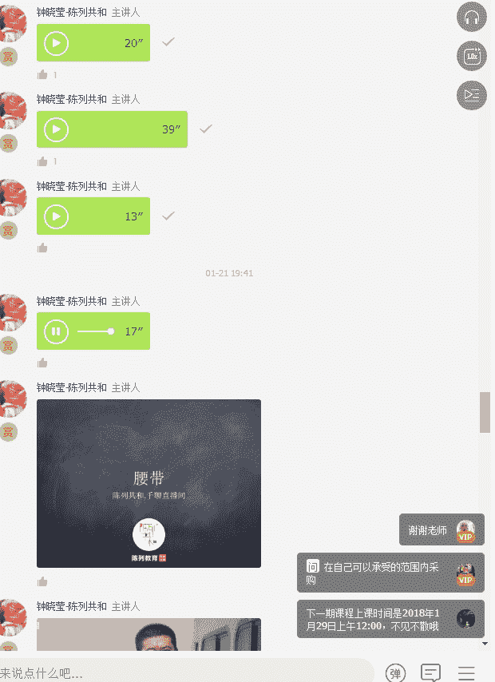

我们今天要讲到的第一个关键的细节配饰里面的第一个类别就是腰带。腰带对于一个男人跟男神之间的区别来说，他应该算是决定性的一环。大家有没有看到我们现在打了一个叉还写了一个no字的这个。

有没有发现很多特别是内地的城市，很多男性特别喜欢把裤腰带上面别着这种钥匙，走的时候咣啷咣啷的响。那这样子的是非常非常需要自己去思考，要把它拿走的。其实这个是非常呃非常表现出屌丝气质的一种搭配的方式。

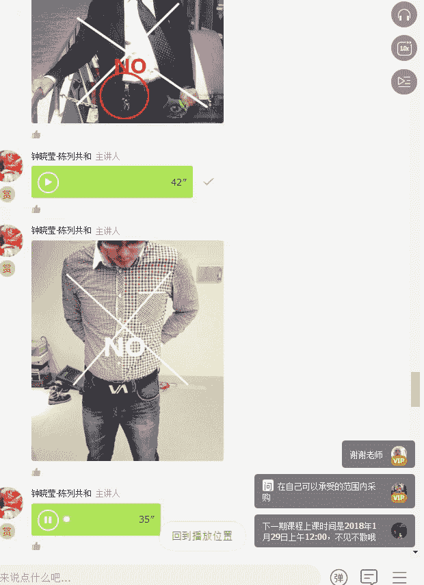

那还有一个呢就是这样子的用特别大的logo来做中间的这个皮带。嗯，其实有很多时候这种特别粗壮的不锈钢的这种logo啊，比较适合身材比较高大魁梧的欧洲人是不太适合大腹便便。

同时裤腰又穿的很低的这种什么啊这种男人，呃，特别是你的肚子又很大。然后跟这个亮散闪的这个不锈钢皮带形成了非常大的反差。还有另外一个禁忌，就是无论你的西裤有多么的合身，如果你的西裤上面是有扣袢的。

而且你要打领带，就一定记住，你要打领带的状况下，你就必须要加入正装皮带。当然，如果你说你不打领带，OK没有问题，可以不用。搭皮带都可以。因为现在有一些呃西服的裤子也比较呃比较合身。

那它是完全可以不用加皮带的。但是如果你要加个领带啊，又要穿正式的西服，就一定记住要加皮带。啊，其实也不是说西装革履，不是做保险，就是来拉业务的。呃，在深圳这种城市里面。

其实有很多西装革履的都是这种高高精尖人才哈，都是一些精英人才。其实特别是在国外，你如果有去过伦敦的话，特别是在伦敦的金金融区，你一下班的时候，你都分辨不出谁是谁。

因为所有人都穿同样的呃黑灰呃蓝这种类型的这种西服。但是他们依然穿的很帅啊。就好像我前几期跟大家讲到西服的这个部分。所以呃我觉得没有任何目标或目的的评论的衣某一些人的衣着。

其实我们可能都很难去找到合适的表达，为什么呢？因为因为我们没有目标。所以我们所谓的评论的目标就是看我们出席的这个场合，跟我们所穿的这个衣服是不是得体的。其实有很多时候。我们去到一个场合。

我们自己感觉尴尬或者是舒服，都跟我们的衣服有很大的关系。大家觉得呢？还不知道大家还有没有记得我昨天说过，我们在日常生活当中有三个重要的核心场景，第一个是职场，第二个是什么休闲呃，就是你放假的时候。

第三个就是你的运动。其实我觉得无论是男士还是女士，都需要去关注到自己的场合着装。西服是一个非常重要的，呃，我认为是非常重要的着装类别。任何一个人，无论男女。

无论你是否在职场或者你在职场当中是否经常要参加一些正式的会议，或者是晚宴，我都觉得你应该有一套得体的西服。大家如果有去到日本和呃我就不说韩国，因为我不太了解韩国，对日本我还是相对来说有小样的了解。

因为我一年大概4次会去日本。那因为我工作的原因。第二个是因为我特别喜欢日本的饮食。因为它跟我们中国的饮食很像，特别是跟广东的饮食很像。所以我去到日本的时候是特别适应的。那我也常常去观察日本男士的着装。

我觉得日本男士的着装，某种程度上比很多的女士还要来的更加的讲究，特别是在职场当中。因为我经常会在呃东京看到很多穿三件套西服的男士，他们的鞋子，他们的包包以及他们的腰带，还有他们的发型。

跟他们这套衣服的着装都非常的大。当然了，我觉得没有对错，也没有谁好谁坏，只是因为我们国家的改革开放啊，时间也并不长。同时还有就是我们国家的这种服装本。文化以及这种着装文化也是刚刚开始嗯。

短短十几二十年的时间。所以呢。我觉得在过这个过程当中，我们应该要多学习和多去体验不同的着装场景，让自己有更多的场景去演绎啊，演绎不同的自己，同时呢也让自己去有更好的感受。好了。

那接下来就给大家看一看啊腰带的一些搭配。在讲腰带的搭配的时候，我想跟大家讲到的是啊，第一个我们应该要有两条，最起码要有两条腰带。第一条就是正装，也就是大家看到的呃，这9个格子里面的左上角的第一条。

那当然你必须还要有。休闲的那休闲的皮带肯定一般来说可能颜色就会多元化一点，同时它的材质也会多元化一点。比如说分别会有一些铆钉的，会有一些大牌的方扣的那当然还有一些就是这种布料的，今年很流行的这种。

那当然还有一种是比较细的那在这个99个框里面，其实我们只放了。呃，七个皮带。那第一条就是大家常见的这种正装皮带，正装皮带有个特点就是它的皮质会比较光滑。通常正装皮带都是黑色的偏多，很少会有呃其他的颜色。

但是也有一些男性会选择跟它的西服的颜色相搭配，比如说卡其色啊，比如说咖啡色或者是深的酒红色或者是墨绿色都有可能。但是呢它们都有一个特点，就是皮质比较光滑，然后皮带扣呢非常的简洁。

那休闲皮带的特点是什么呢？相对来说材质比较粗糙，通常都是一些很粗犷的牛皮的材质或者是呃呃包括它的宽度可能都会比我说的宽度就是呃手指呃就是皮带的这个宽度，可能都会比我们的这个正装皮带要宽一点。

假设如果我们正装皮带是两个两指半啊，两子半的宽度还是呃。两子的宽度，那如果是休闲皮带，可能它就会比它再宽0。5或者一左右。好，现在给大家看到的就是一些呃比较年轻版本的这种皮带的使用。那大家可以看到。

有一些西裤上面你们有发现它是不使用皮带的，但是一定记住我刚刚说的那个原则，如果你要带领带，你就一定要系皮带。好了，那再跟大家讲一下，系皮带时候的禁忌。

因为有很多时候比如说有很多男生选择皮带的时候都会显得很长，甚至有时候自己瘦了之后，也没有把用这个把这个皮带去做一些修剪啊，把自己这个腰围跟这个皮带做一些匹配的这个长度，那这个是都是不对的。

比如说如果你的皮带真的长了，一定记住，像下面这样子啊，要么就把它放进口袋里，要么就要把它整个收到后面去，要么就是把它剪短啊，剪短就去专业的这种呃，比如说呃专门的一些你在哪里买皮带，你就要这样他帮帮你剪。

当然有些皮带是不能剪的。那这样不能剪，你就一定记住啊，要重新去买。那一般来说呃，皮带多长的长度是合适的呢？大家有没有看到我们裤裤腰上倒会有一些耳仔啊。

这个耳仔就穿皮带的那最好的方式就是你扣完呃扣完整个裤子呃，加上腰带之后，你扣到的腰带的是顺数的第二个扣子，然后穿过来的时候，你的耳仔，刚好就你的皮带刚好穿过第一个耳仔。

长出来大概嗯两公分呃左右就是非常标准的了。比如说像这张图，第二张呃这张长图的第二张图就不合适的。因为它是搭下来的，就显着是整个人很邋遢。好，现在给大家看到的是一些服装的搭配的一跟皮带呼应的一些呃示范。

大家存下来，然后可以根据这些去找寻。比如说永远记住一个原则，皮带跟鞋子呼应，就绝对任何时候都不会出错。

像现在给大家看到的就是偏休闲一点的搭配的方式啊，可以看到呃，如果你是配这种白慕达短裤啊，就现在看到的最后一张，你配的是这种夹脚拖鞋。记住了，你的皮带。

因为你是夏天一看就是出去旅游的那这个时候呢你的这个裤子呃，是偏休闲的宽松的，所以呢你要把你的皮带怎么样，把你的皮带对应你的风格啊，一般来说我们会用编织型的皮带。好。

那往上走就大家可以看到有些牛仔裤或者是一些工装裤的搭配。那工装裤这个搭配呢完全表达出了色彩呼应的原则。你看他的皮带、手表、鞋子，包括包包还有帽子，还有他的眼镜是不是全部都是一气呵成的。

其实这就像一个呃大家会看到什么样的人，你会觉得他好精致，也就是他身上的颜色不多，你才会觉得他精致。一般我们会觉得穿颜身上的颜色穿的很多的人是那种很浮夸的，浮夸的人给人的印象，一般来说都不好。为什么？

因为大家都不喜欢，特别是在中国都不喜欢这种特别出头的人。所以如果我们想要博得别人的好印象。我真的是建议大家去穿一些呃一定要用色的时候，呃，去控制在三色以内去穿一些更得体，更有质感的衣服，不求多。

但是要求精，特别是男人。

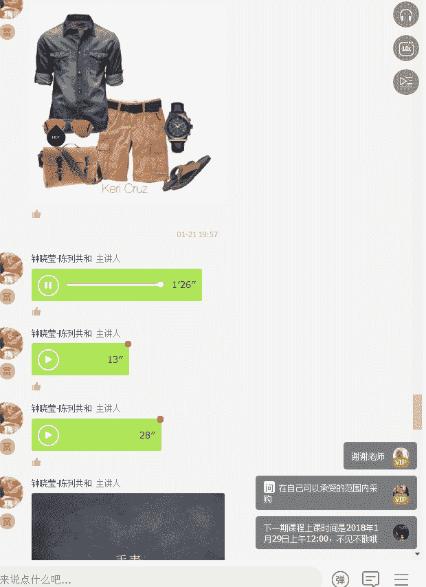

如果你是已经去到了28岁的男性啊，我认为男士26岁就已经开始要讲究了。呃，女人其实也是一样的，你越早讲究，你会发现你就越有价值。

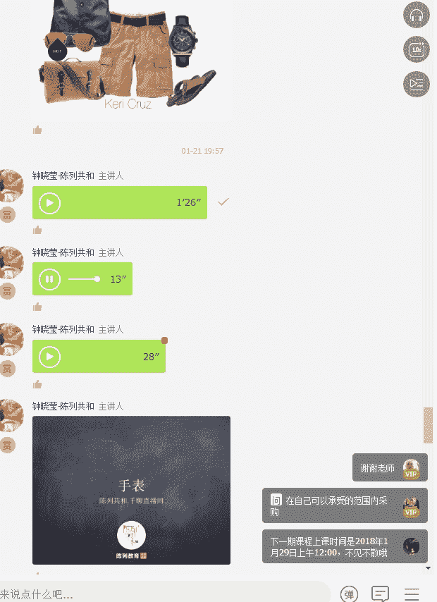

就是。你越早讲究，你就更越有价值。因为每个人的视觉就每个人的外在形象对于自己都是加分的。当然也有些人的视觉形象，外在的形象是给自己减分的。所以从呃从内心去问一下自己，是希望做一个。

让自己的形象给自己加分的人，还是让自己的形象是给自己减分的人呢？我相信大家都会选择前者。

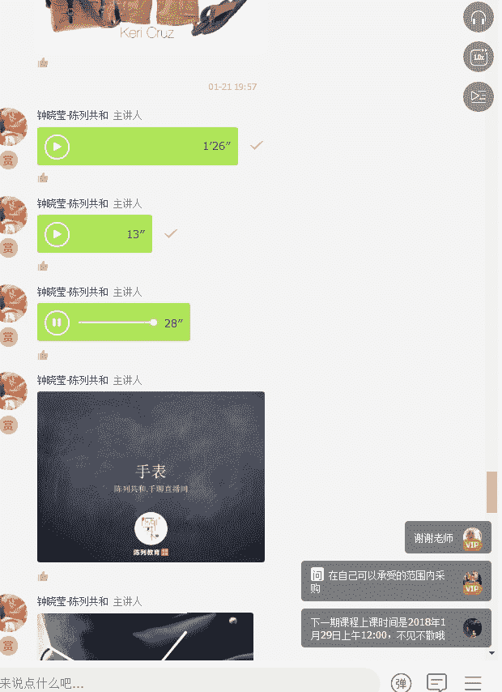

好，接下来我们要讲到第二个单品手表啊，手表呢我先给大家看到这个搭配的禁技啊，大家可以看到这个搭配原因。禁忌在哪里是因为衬衣的长度以及跟这个表，还有跟西服，有没有发现分成了三节，这是不合适的。

其实一般来说代表我认为最大的禁忌就是超出你年龄的价格。比如说我跟你在还在讲一个笑话，我弟弟在中国移动工作，他那时候刚刚毕业的时候，在中国移动的一个分公司。然后呢，他们的同学呢，就每天跟他一样啊。

跟他的同事每天跟他一样都是挤公车上班的。然后呢，他们有一天不知道是什么什么兴起了，就跑去买了一个A货的手表。我弟呢就买了一个劳力士。然后呢，我弟那个同事呢买了一个百达翡丽，然后我弟弟就常常笑他说哎。

你一坐公交车上班的。我这个才低调。你那个一看就是一看就知道你那个是假的，因为超出你的这个能力范围太多太多了。

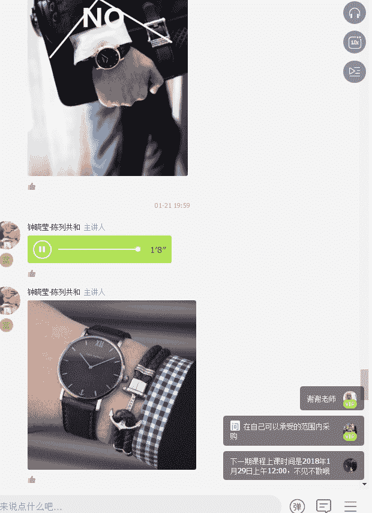

所以我觉得男人戴表一定要符合你当下的年龄和你的身份，这是很关键的，戴的太高，也会让自己怯啊呃戴的太低，也会让自己怯。所以呢我觉得最好是符合你当下的这个经济收入来去呃去去去思考。

因为男人的表说真的不需要有很多，跟皮带一样。其实男人表你可以有2块，一块是呃上班，一块是休闲，甚至是你一块通纱都可以。比如说我是比较sportty的，我是比较运动型的男人。那我可能就会买运动型的表。

那比如说现在的卡西欧，他现在也有一些皮的表带也不错。那如果我是比较精致的优雅的男士啊，我比较文艺。那我可能就会买一些比较书卷气的娟秀一点的，细腻一点的圆表盘。那厚度不要太厚的。

比如说呃像我现在发上来的这一组。

那一个两个呢都加个表加了旁边的这个手袋哈，那一一种是比较运动的，一种是比较绅士的。

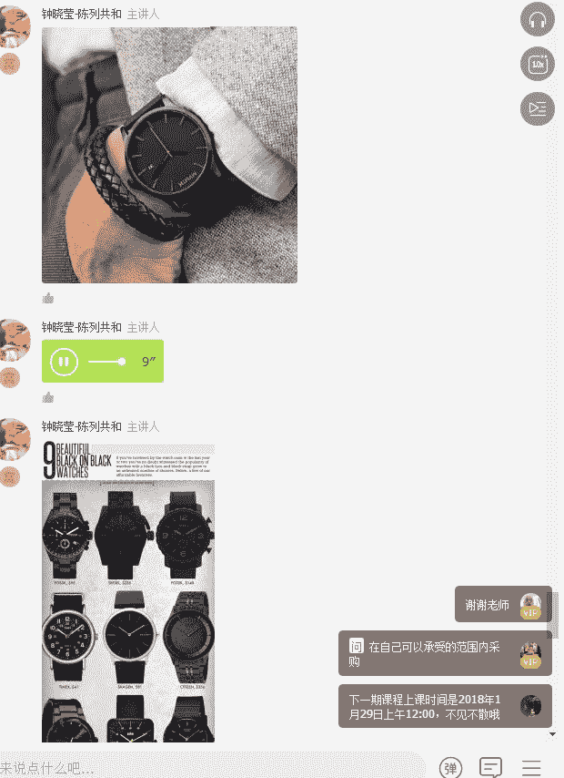

好，在这里面有给大家看到呃，大家可以看到第一排的表呢相对来说是比较个性和。硬朗的。然后第二排的表呢是相对来说比较中性的，很多男士都可以选择。第三排的表呢。

我觉得呃除了中间的这个方形方形的这个其实是比较适合文艺男的那其他的都还好，还可以选择。所以如果你想要有2块表。你现在有一块是呃钢表带，那你就再买一块皮表带也就够了。你可以买一个皮表带是黑的。

买一个钢表带，可以是不锈钢的，或者是灰灰色的都可以，或者你可以买一个皮表带，是那种深咖色的也不错。好，现在我给大家发上来的这张图呢，就是讲述的是左边是你穿什么样的衣服的时候，右边配什么样的表啊。

首先大家可以看到，第一个它是穿的是这种呃燕尾服和礼服。那他带的表一定是这种非常精致的和经典的款式。那如果你穿的西服呢，你会发现前面两款都合适，后面的就不合适了。那如果你穿的是休闲服呢，全部都合适。

如果你穿的是这种cware，就是这种很休闲的，比上面的这个busbus就商务休闲看到了吗？商务休闲是这么来的，商务休闲就是它是西服，但是呢它又不是非常成套的西服。所以我们一直都理解的商务西服。

商务休闲其实就是不成套的西服。比如说上衣是西服，下面有可能是休闲裤啊，甚至有一些潮人它会穿牛仔裤。那最后呢大家可以看到运动的这个如果你是在穿运动服的时候一。请记住第一块表示不合适的，其他都还OK。

我这样发上来，希望大家能够有对照的作用。好吧，那接下来我们就给大家看一些啊手表的搭配的一些方式。

一般来说呢，手表通常是黑色和咖啡色，所以呃。一般都会能够呼应到皮带、鞋子和包包了，所以这里面的搭配就不跟大家多讲了。

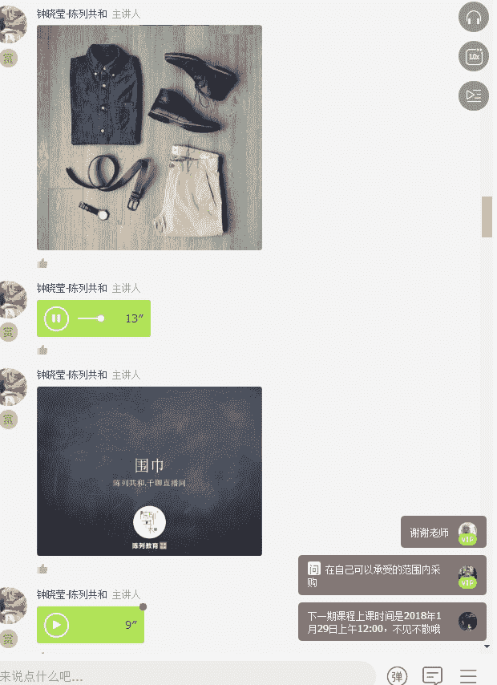

好，那接下来要讲到第三个单品，就是围巾。围巾是现在目前呃大家应该用的是最多的。

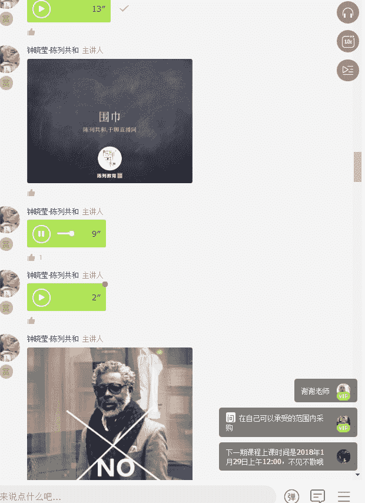

在当下的这个季节里面。

好，给大家看到的这三个图。第一个就是挤的太多，然后显得脖子好短啊，然后第然后跟衣服的反差率太高，一黑一白这样子太过于明显。那接下来第二个就是这种非常浮夸的这种搭配的方式。我相信很少人会这么穿。

那第三个就是这种非常娘炮的这种女士的这种丝巾是不要用的你看这个男士用这个皮带也是非常肉切的。

好，我刚刚看到有一位同学说他37岁带DW，其实你37岁，你可以尝试去买一块，我不知道DW这块是不是机械表啊，你可以尝试去买一块机械表啊。

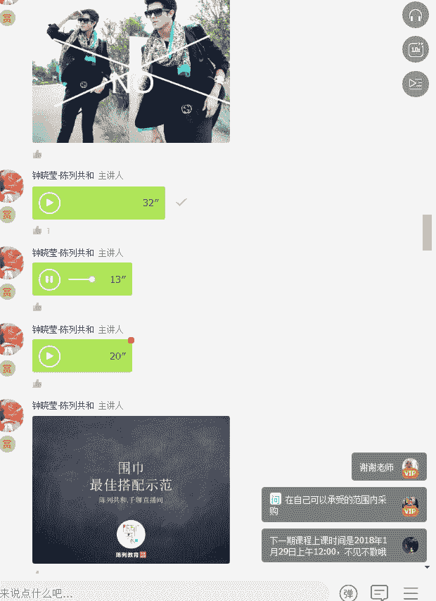

我们表里面有电子表和机械表，那机械表相对来说价格就会贵一些。那机械表是不用更换电池的，所以呢它使用的寿命和周期也会比较长。那当然所有可以传承的表一般都是机械表，电子表是没有办法。呃。

你过几年有可能久不带它都会坏掉的。

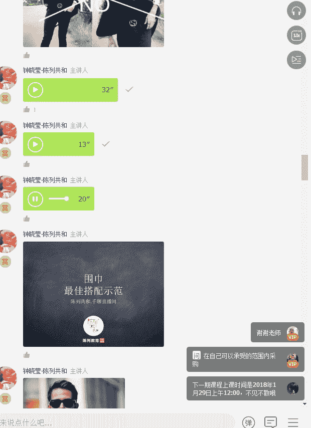

其实大家在使用围巾的时候，就记住几个原则就好。第一，呼应外套的颜色啊，第二就是呼应内搭的颜色，不要让它互相之间分叉的太大。那我们现在看到的这几个都是有呼应的。

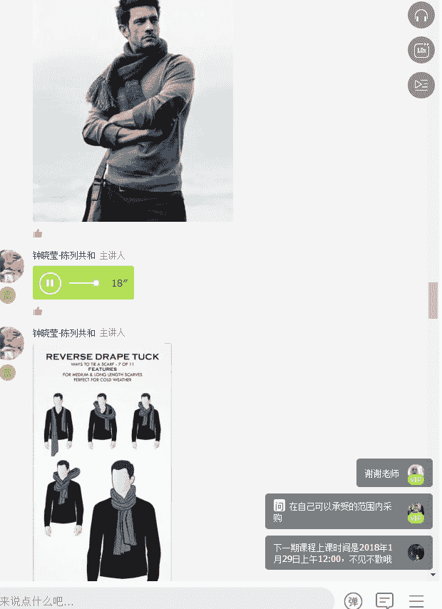

好，那最接下来呢给大家看到的这个就是最近呃大家常常使用的这种厚毛巾的一种系法。大家可以在现在如果你有围巾的话，可以尝试一下。其实这是男人女人都适合的一种打法。我觉得在这里面系围巾最帅的是这款啊。

这款系的非常的好。

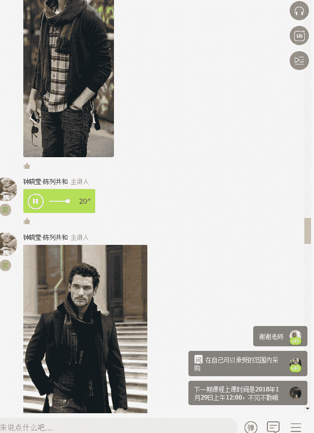

就是一长一短会显得特别有感觉。那当然呢，还有就是如果你穿的是大衣啊。比如说像这种比较潇洒感的，也是可以。简单的轻松的把它交叉在一起就好了。

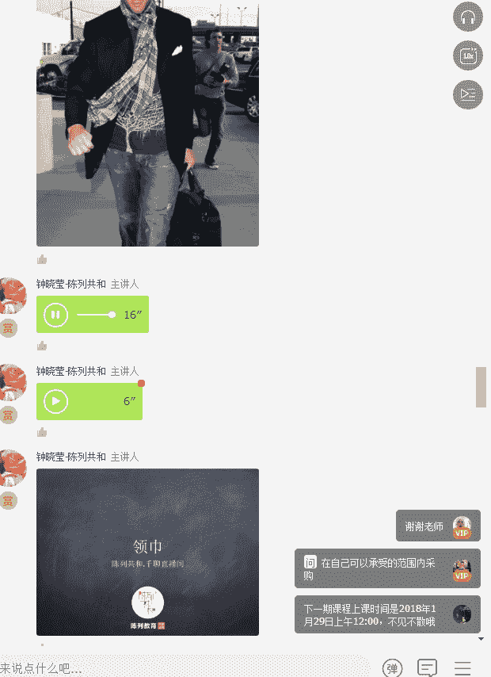

啊，我认为在冬天的时候，围巾是必备的哈，有一条或两条都可以。

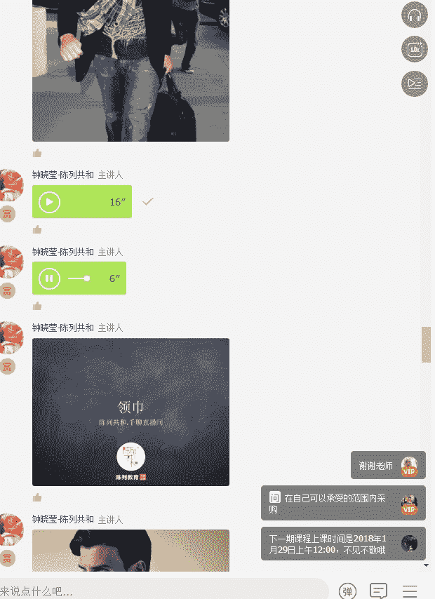

啊，我们先讲领巾，因为围巾之后就讲领巾。领巾其实是很多欧洲男士常用的，就是放在衬衣或者V领毛衣，呃，或者是T恤呃这个位置的一种呃一种装饰物。

比如说像这种呃很多的男士会用的一些在夏天和秋冬天都会用到的领巾。其实这个是非常贵族范的一种搭配的方式。这个其实在中国其实蛮少人用的，在日本非常的多。

有如时你可以看到有些日本男士，他会在穿西服的时候啊，会像这个男士或者像这个男士一样的，增加他的点缀。然后再给大家看一张全图。

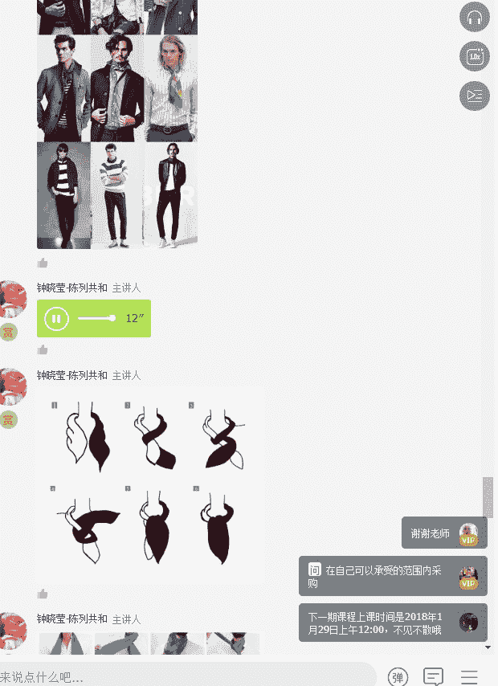

它是非常欧欧洲范儿的，非常西方的一种搭配的方式。那当然领鲸的搭法呢也给大家看到它有很多种不同的这种系法啊，也有这样子的啊，也有长方形的，大家可以照着来使用一下。

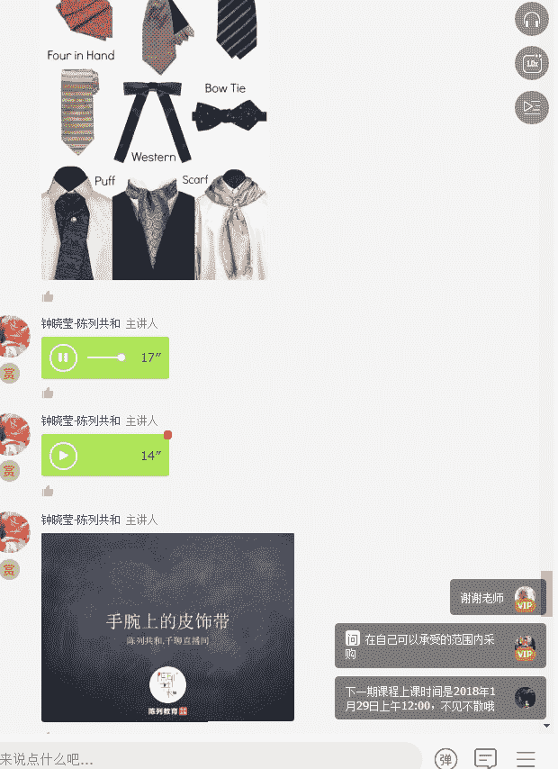

嗯，其实在中国用领巾其实是非常少见的，但是其实也很多男士也逐渐在冬天和秋天的时候使用了领巾，这个是非常体现品味的。

好吧，那我们既然讲完手表了，那我们就顺便着跟他连带的那个呃表饰呃，就是呃手上的这种饰带，我们也一起来讲解一下。

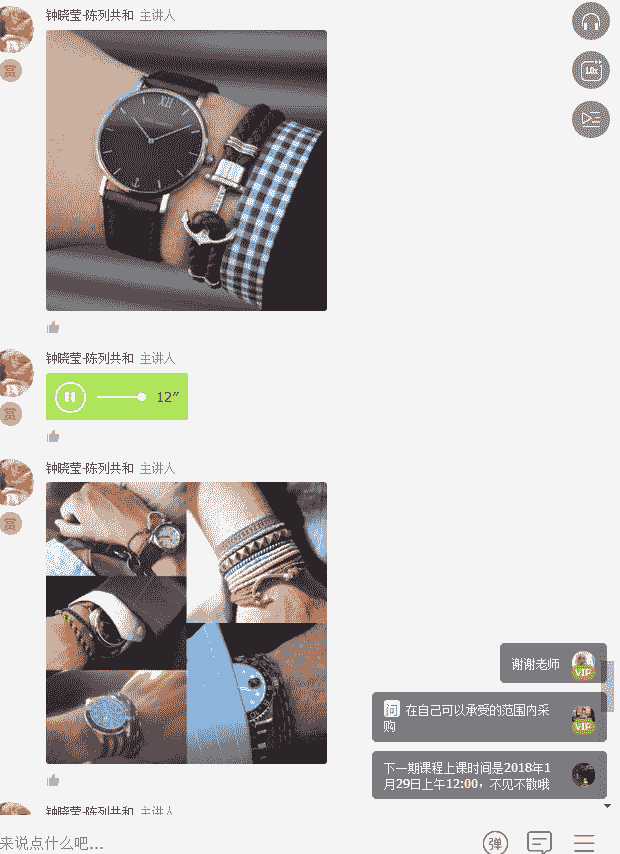

好了，大家现在看到的就是呃男士们常用的这种手手饰手编织带哈。那但是这种呢其实很多女士也会用。而我们现在有很多男士是比较喜欢跟表在一起附带的。但是这种一定记住。不适合穿正装的时候这么用。如果你要穿正装。

你一定要记得把表单独戴，不要这样加在一起戴。比如说我们中国有很多男士会将那种很大的佛珠串跟表一起戴，哇，真的很土哎。

如果你不想把自己整成暴发户啊，那你就把它带的细一点。然后尽可能这个选择这种皮饰带呢，其实最重要是跟衣服的颜色，最重要最重要其实是跟表的颜色相互呼应。

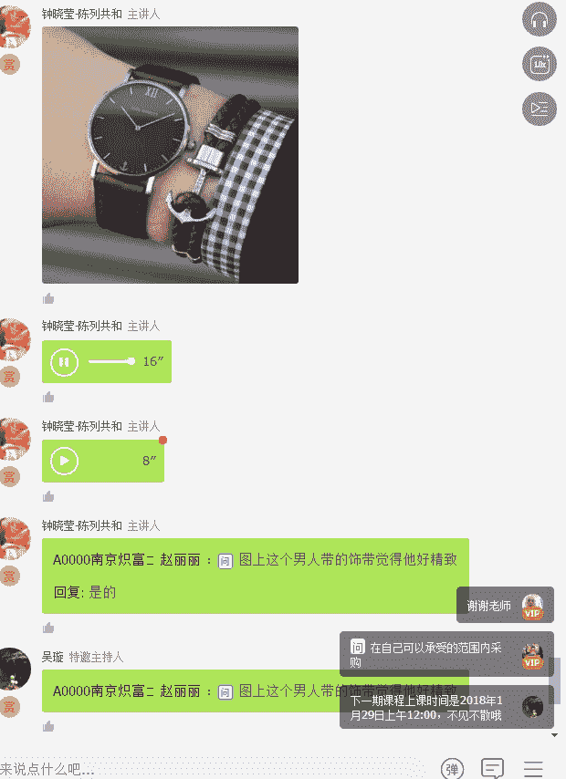

我采访一下，在这里面，我们在座的各位同学，你们有有用到这种皮试带的在讨论区告诉我。

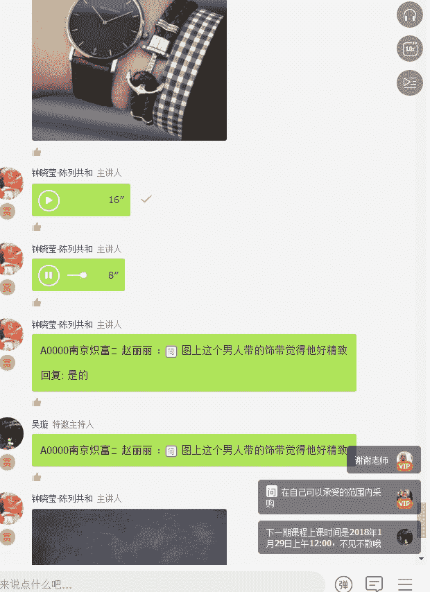

OK那我们现在就顺着想把上半身先剪完，最后我们再来落地来讲一个包包好吗？那我们接下来要讲到的就是跟我们眼跟我们的脸型非常相关的太阳镜。其实常常有很多人会问我说，老师我适合什么样的眼镜啊啊什么样的脸型。

适合什么样的眼镜，其实是非常非常关键的。有没有发现有些人戴墨镜，像男神，有些人戴墨镜，像瞎子。其实原因是因为他戴的墨镜，不符合他的脸型，也不符合他现在身上所穿的这种衣服。

特别有些男人他会喜欢戴那种雷朋的呃雷朋的那种呃机飞机师的那种墨镜，但是他又没有这种阳刚之气，戴完之后就有一点那种猥琐男的感觉。好了，在这里面呢我给大家看到了不同的脸型适合的眼镜。

然后你们直接就对号入座就好了。其实第一个脸型就属于那种呃偏正常一点的脸型哈。第二个脸型呢是长一点的。第三个脸型就下巴尖一点的。然后第四个脸型就是上额是方正一点的。然后第五个脸型就是那种国字脸的。

然后第六个就是导数。第二个大家可以看到是属于那种鹅蛋型脸的。大家去对号入座吧。我觉得其实这里面其实已经涵盖了啊各个不同的男人的眼型脸型了。哇塞，木谷，谢谢你啊，打赏这么大的红包。好。

在这里面再给大家一张特别全的图，就是所有的脸型里面啊，如果你想带给雷鹏式，第一款就是雷鹏氏。第二款呢是比较复古的这种精英范。然后还有就是大家一定要记住，第第1234第四款这种复异型的眼镜啊。

适合的脸型是不多的，适合的眼型是不多的，特别是国字脸的人，我觉得是应该不适合这样子的眼镜的吧。国字脸国字脸你想象一下啊，如果戴上去的话会不会很怪啊？因为上方下一方。

然后大家可以看到导数第四款眼镜就是谢霆锋他爸爸常戴的这种眼镜呃，上面他写的是全部哎，上面他写的是全部哎，就是所有眼型都适合哎。但我觉得这个是要谨慎的。如果你的气质没有这种风流倜傥的气质。

或者是那种云霄飞车哈，极速飞车的这种硬汉气质，就不要带这种啊。

那在这里面我提示一下大家，就是戴眼镜其实有两款眼镜是最百搭的。第一款就是我现在发上来的这个穿呃卡其色呃驼色外套的这个男士。

还有一款这个眼镜啊，这个眼镜呢其实跟刚刚那个眼镜是类似的，只不过是它是深蓝色，但这个是比较适合呃比较男神气质的，个子不超过1。78米，不要这么戴。

好，刚刚给大家看到的这个是戴领巾的三位男士。你可以看到他们戴的眼镜，你会发现其实眼镜戴的不好，真的很像瞎子的。有很多时候有些人戴墨镜是很有明星范的，但是有些人戴墨镜，你就感觉到他好做作。

所以眼镜其实跟你身上所穿的衣服要相当匹配才行。

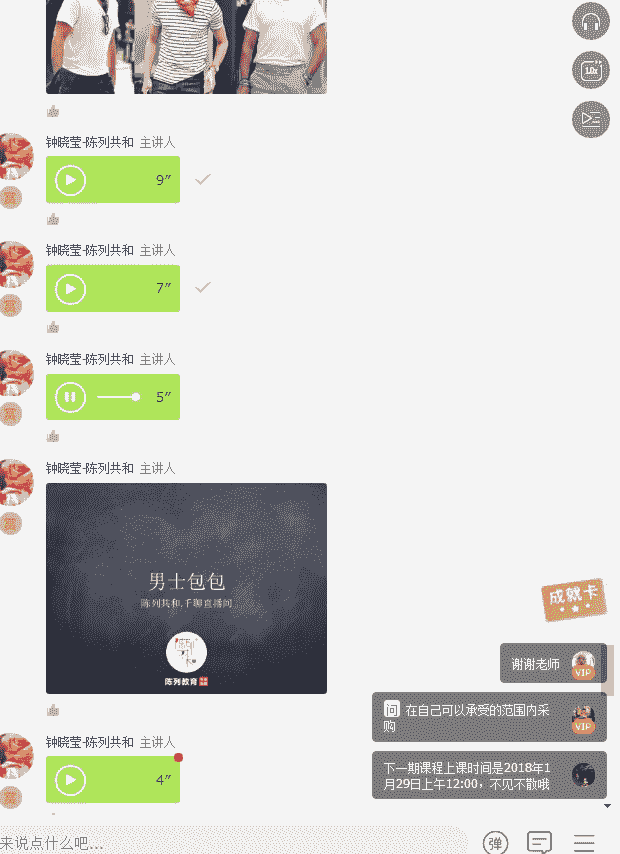

好啦，来到我们今天最后的一个单品，就是男士的皮包。

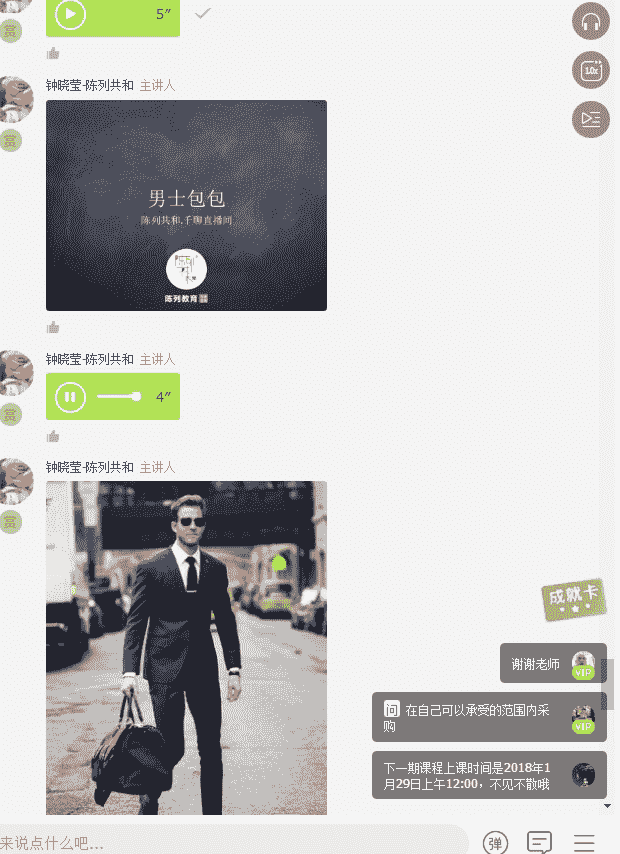

先给大家看一下哈，首先男士我认为你应该有三个包。第一个就是现在这个男人手上提的这种两天一夜啊，两天一夜的这种出差的包包，然后很简洁，然后提着非常的方便。然后当然呢你也可以是这样子的，两天一夜啊。

就是侧背上肩的。

那再接下来呢就是现在发上来的这款，就是公文包。你在上班的时候常常要使用到的，其实在欧洲和日本男士都会有一个公文包。因为他们里面要装很多的这种啊资料啊，包括他日常的一些使用的东西啊。

包括日本男人其实很喜欢用手帕的，我觉得是很优雅的一种特征。我自己也很喜欢用手帕，而且日本有一些品牌它是提供绣字功能的，所以我们可以把自己的名字的简写绣在上面。好，那男士应该有的第三个包就是这种双肩背包。

记住哦，双肩背包其实在呃在很多的欧洲国家啊，那包括我们香港地区，他们都会穿着西服背背包。还记不记得曾经有部电视剧让这种呃上班呃穿西服背背包，骑自行车成为一种时尚。那就是来自星星的你。里面的那个都教授。

从那时候开始，大家就开始呃穿着西服背包，然后蹬着自行车。当时新秀一就请了杜教授做了一个广告，那款包包卖的特别的火。好，这就是大IP哈IP带动的整个的一个呃产品的销量。所以这就是我要讲到的。

跟大家讲到的男人必须拥有的三个包。第一个是大一点的两天一夜的这种出外简单出差的包。那当然了，有些男士是会用行李箱的那第二个呢就是你的这种手提的公文包。那第三个呢就是你的这种双肩背包。双肩背包。

其实有两种，一种是正式一点的，一种是偏休闲一点的偏休闲一点的，我在这里面就不讲啊，因为呃场景使用很多。比如说有时候呃男生出差啊，或者是干嘛。

可能都会背一个现在我发上来的这种稍微宽松一点的打包式的中间的这种双肩背包。那当然你也可以是上面的也可以是下面的这这三款包包其实就已经代表很囊括了。我们男士日常生活的需要了。那有人说老师。

那为什么不推荐我们用侧背包呢？其实呃侧背包可以用，但是呃你一定要记住，侧背包一定要有一个提手，就像我现在的这个呃这张图一样。第一个它上面有一个提手，其实这款包包叫做邮差包。

大家有没有看过以前的邮差叔叔送送信的时候，他那两个包带都是双扣的这所以它延伸出来了，作为我们日常使用的邮差包。好，现在发上来的给大家看到的是另外一个就是公文包。也就是我刚刚所说的邮差包。

你可以看到里面真的很能装。特别是如果你有带电脑上班的习惯的话，这款包包是非常好的选择。它前半部分可以放ipad，可以放呃笔记本啊。当然你也可以手提，也可以侧杯，啊，欧洲很多男士都会用到这样包。

那最后呢就给大家看到很多的背包的款式，大家可以根据不同的需求去选择。但一定记住，选择背包，我建议大家不要选择白，不要选择黄，不要选择绿，也不要选择红，尽可能选择黑灰，然后卡其咖啡或者是墨绿色。

你也可以选择皮的质地，也可以选择帆布的质地。那如果你是正装穿的比较多，就选择皮的质地。如果你是休闲装穿的多，你可以选择帆布质地。好啦，今天我们所有的配件的单品就到这里啊，全部带给大家讲完了。

我们今天讲到了哪些呢？我们讲到了腰带，我们讲到了什么？我们讲到了手表，讲到了手表上面的首饰戴、皮饰带，我们讲到了围巾，我们讲到领巾，我们讲到了太阳镜，我们讲到了包包。

所以这就是我们男人配饰的整体的关键的几个重要的元素，应该是总共24677个元素。那我相信大家应该今天应该有很大的收获哈。我觉得这堂课某种程度上也促进了零售品牌的销量啊。为什么呢？

因为当我们了解了自己还有这么多缺的地方的时候，人通常都会想要去把它补足。那就算没有补足全部，但是我们也可以将自己的衣橱做到80%的完整，对吗？其实我们的衣橱的完整是为了让我们自己更得体。

同时让我们的职场更有效率，也同时让自己更受别人尊重，你永远记住。以衣就是呃先进罗一后进人，就是以貌取人。一直以来是全世界的一个标准。我们没有办法说这样不对，因为我觉得一个连外表都不在意的人。

你是很难跟他，你是很难相信他能够把很其他的事情做的更好的，大家认同吗？所以王尔德先生曾经说过一句话啊啊，英国的一个非常著名，英国还是欧洲的一个非常著名的一个呃中世纪时候的一个应该是当时的大IP吧。

王尔德，他曾经说过，他说不以貌取人的人都是肤浅的。好啦，今天的讲解就到这里了。接下来啊教给大家5分钟，然后回答大家的问题。在这个理论课程结束的时候，送给大家一幅画。这幅画是我的弟弟的女儿。

应该是小侄女吧，画的一幅画。他模仿了梵高的星空。啊，谢谢有为的打赏。有为，真的特别感谢你每堂课都给我们打赏，特别感谢感谢你们的聆听，还有感谢你们的如此热爱学习的这样子的一个状态，真的非常好。😊，啊。

有为，其实你刚刚问我说你的脸型是什么脸型，我单从同从你的头像来说，我感觉你的脸型应该是偏长一点的吧。因为并不是看的特别的清楚，你到时候可以根据你的脸型去试戴一些眼镜的形状，你就可以知道啦。啊。

有为说我们的穿着不能选便宜的吗？只能选品牌货吗？不能选市场货吗？当然不是呃，其实并不是说一定要选择品牌货呃，并不一定要买大牌。但是你一定记住，你选择市场的货，你也要选择那种有质感一点的。

因为不在于多而在于精。大家知道吗？比如说像乔教子主乔乔布斯先生，大家看到他一直常年都穿一件黑色的T和一条牛仔裤。但是大家不知道那个黑色的T是爱马仕的那牛仔裤是lis和lea的。

所以其实所有的细节背后其实隐藏的就是品牌所付出的这种呃能量吧。我觉得穿着品牌的衣服也会对我们自己的信心会有增加。因为它的品质它的舒适度会让你更多的有有更多的自信。不是有句话说吗？自信往往是穿出来的。

但是一定记住我所说的穿不是暴发户的那种穿。Li。呃，我不知道你在哪个城市啊，如果你是在上海，你可以去找一些呃牌子。其实国外的一些牌子，它有一些cashme，但是它不贵。如果你有时间去欧洲的话。

也可以去找。呃，特别是意大利的cmi和法国的cashme都不错嗯。那个鄂尔多斯，我不知道现在的款式怎么样哈，呃，以前的款式真的很老，你可以尝试看看鄂尔多斯的款式。那如果你是年轻一点的，你就买那种开襟的。

然后带连帽的这种有点像那种卫衣的那种款式的came是比较耐穿的款式，不要去买那种呃came的背心啊呃这种东西，要买就买长袖的。好啦，今天就到这里吧，我们祝大家晚安，我们下一期课程再见。

我们下期课程的时间，待会vivi老师也同步提醒一下大家。啊，我看到有为的这个问题，我还是想跟跟有为说一下，一定记住，没有任何一个品牌，一出身就是品牌。

所有的品牌都是因为他不断的努力去累积以及叠加最后它的产品以及它的顾客的价值产生的一个巨变，所以不要去羡慕品牌，但是永远记住，现在如果你不做品牌是不会有未来的品牌是应该有价值的。呃。

这个价值就存在了很多的这个细节的添加以及细节的累积，所以永远记住，如果你想要成为一个品牌，那么你就要去体验更多好的品牌。不然的话，你是打造不出好的品牌的。好吗？有为加油。好，感谢周老师今天的精彩分享。

感谢同学们的聆听。那下一期课程的时间是2018年的1月29号。😊，欢迎大家准时收听。还有另外就是我认为六七线的品牌都不能叫做品牌了，它都只仅仅只是一个商标而已啦。因为品牌是具有一定的识别度和认知度的。

所以让我们。所以让我们一起为中国品牌加油。同时我们自己如果是在经营品牌的，我们也加大对品牌的这种力度，让自己体验更多好的品牌去成就自己的品牌。

