# 1、16男士衣品速成穿搭指南(完结）：第9课：男人，掌握色彩搭配，穿出好衣品！：第9课：男人，掌握色彩搭配，穿出好衣品！

大家中午好，今天来到了我们这堂课的第九讲。我们这堂课当中其实大家学到的是最基本的，也是最重要的一些男装的搭配要领。我有一个观点，就是追逐流行，我们只会变成时间的敌人，保持简单和基础的搭配。

会让我们成为时间的朋友。这句话的意思其实就是当我们追逐流行的时候，我们是完全没有办法追过时间的。因为流行非常容易流逝，也同时非常容易过时。但是如果我们追求的是经典和简单和基础，那么我们无论多劳。

我们都会把都会让自己变成一个。有魅力的人啊，这个有魅力的人就是时间的朋友。无论你的年华已逝，还是你已经年老色衰，还是说呃你已经青春不在哈，就像女人，有时候眼也耷拉了啊，头发可能也没有那么茂密了。

但是我们依然可以做时间的朋友，因为我们保持简单和基础的着装。

啊，我之所以把这张星球大战的这个图发上来，是因为深圳今天真的很冷，冷到我特别想穿一套这样的衣服出来。那当然了，其实也是代表了另外一个寓意，就是其实我们今天第九讲讲的是色彩搭配。话说回来。

男人可供选择的颜色本身就是少之又少。其实不出错的颜色本身就只有两个黑白。那当然如果我们要再加入其中的话，就是灰色和卡其色，还有蓝色啊。所以我特地把这个拥有黑白两色搭配的星球大战大战的这个。

这个图片发上来，第一寓意今天很冷。第二就是其实男人讲来讲去的色彩搭配，无非就是在黑白灰当中不断的去调和，不断的去做一些点缀。好，那大家看到了这两张漫画图，这是我在GQ网上哈，一定要注明一下GQ网啊。

我看到了这个插图呃艺术家所绘绘制的这个呃这个插图插画艺术家叫做PPEERP他绘画的这几张图，我觉得特别的有趣，所以呢我就把它拉出来了，大家如果感兴趣的话，也可以去GQ网上去看一下，那因为这个是有版权呢。

那我们是一定要呃尊重这个版权艺术家的这个这个这个画作的。所以我在这里面我想告诉大家呃，它是来自于哪里，那我为什么会用这张图，这两张图呢？因为我刚刚也说到了，其实无非我们的男装搭配当中，无非就是黑白灰。

对吗？再多一个蓝再多一个卡其，其实其他也没有什么。所以在这里面给大家看到的是这个插画艺术家的这个名字啊，这两幅画都是由他画的，以及接下来我发上来的话都是由他来画出来的。我觉得特别的有味道。

而且非常的极简，而且非常的易搭。大家有没有发现其实有很多时候我们真的是看过很多的搭配文章，但是我们依然穿不好自己的衣服，其实原因很简单，大家知道吗？原因是因为我们学太多，但是呢我们的实践太少。

还有另外一个，因为我们学的太多过多流行的知识，但是我们并没有把自己的基础功打牢，所以呢我们就比较容易出错。所以在这里面我再次强调我们在这一堂课男士穿搭指南。其实我讲的是基础和简单。我讲的不是流行。

因为我希望大家能成为时间的朋友，而不是成为时间的敌人，被流行所抛弃。嗯，加拿大鹅，我们承年共和昨天也出一篇文章，就是加拿大和为什么这么火哈？嗯我我个人比较喜欢湛江机啊，我不喜欢加拿大鹅。好。

那我们接着来聊今天的话题，相对于女人来说，男人可供选择的颜色本身就少的可怜。可以说呃除了基本的颜色，黑白灰以外，那加入进来的有彩色，比如说蓝色、红色、紫色也是包括绿色啊。

都是少的可怜的那也就代表了我们男士的基本颜色不容易出错的黑白灰。蓝还有卡其色。这123455个基本颜色，黑白灰蓝卡其。这5个基本颜色相呃我认为它已经构成了男士衣橱当中的80%以上的产品了。

所以再能垂此挣扎的无非就是我们接下来要讲到的这个比较特别的颜色，比如说绿色、酒红色、紫色或者蓝紫色。所以对于男士的衣柜里面该有的颜色来说，我建议集中在5个颜色当中啊，五个百搭基础色，黑白灰蓝卡其。

再加一个特别的颜色，比如说绿红紫蓝紫。在这里面特别想提一下灰色，灰色其实是一个非常好的中绿色，可以说是可以跟任何的颜色搭配的，也能够很快的使任何的颜色迅速的变得非常的冷静和安静下来。

所以我常常会把灰色称之为优雅的灰。有没有发现优雅的人都有一个特点，它一定不是躁动的，它一定是安静的。所以能够称之为优雅的颜色，那一定是非灰色莫属了。白色具有非常强的这种活泼感和年轻性。

那黑色具有非常强的神秘感。那当然其实全身黑和全身白都是不好驾驭的那全身灰呢也同样不好驾驭。所以待会儿我会给大家讲讲到底我们怎么样去做好灰白黑三色的搭配。大家现在看到了吗？这位男士呢。

它是用了三个红色来进行了黑灰之间的这种搭配的这个什么跳跃。有没有发现全身只有一个红色，一个亮色的感觉，显得非常的精致啊，这也是我今天讲课当中的一个非常关键的要点。也就是对于男士衣柜里面该有的颜色来说。

我建议你集中在5个颜色，黑白灰蓝卡其再在身上加一个特别的颜色。比如说现在的这个红和接下来的绿。

又或者是蓝或者是蓝紫色都是可以的，都是非常好的一种搭配的方式。又或者是这件特别骚的蓝紫紫紫红色，这也是非常好的一种搭配的建议。

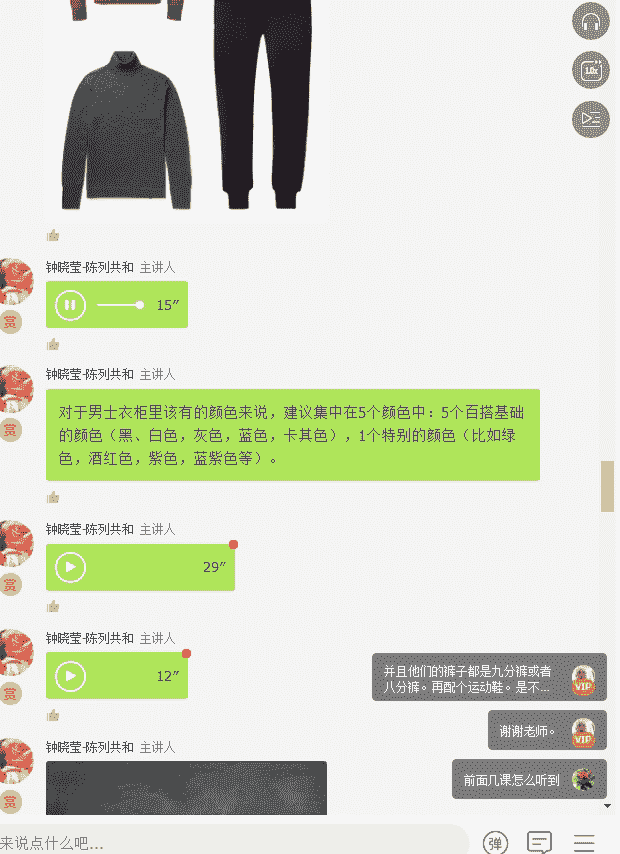

所以这就是我对于这个部分的总结，就是男士衣柜里面该有的颜色来说，建议集中在5个颜色，也就是5个百搭基础的颜色，黑白灰蓝卡其，再加一个特别的颜色，比如说绿、酒红、紫、蓝紫等等。

那这些颜色这一个特别的颜色去用来点缀你的衣橱的。但是你永远记住，你不能够把自己变成一棵圣诞树或者是一个灯笼。

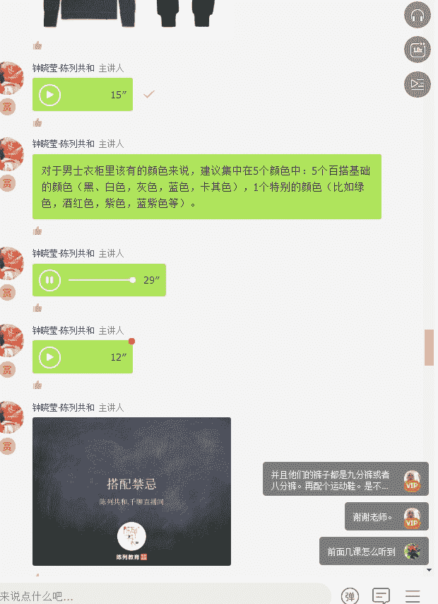

好了，那接下来我们在讲正确的搭配之前，我想先让大家来看一看错误的搭配又是哪些，我们是需要回避的。

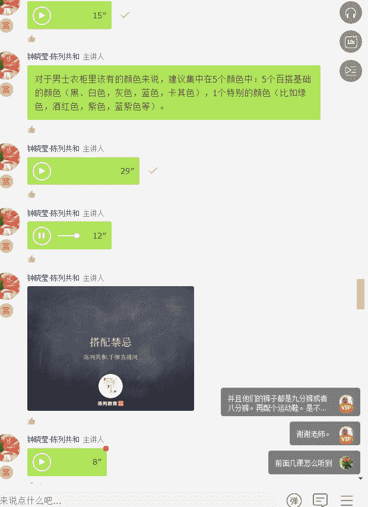

其实有很多时候，如果我们不去了解什么是搭配的竞忌，我们其实是很难让自己搭配的好看的。

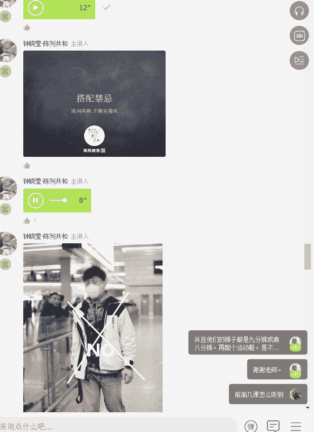

首先我们在男装的色彩搭配当中有几个禁忌点，第一，全身超过4个颜色。第二，身上穿了三个油彩色，比如说绿黄配的禁忌点。

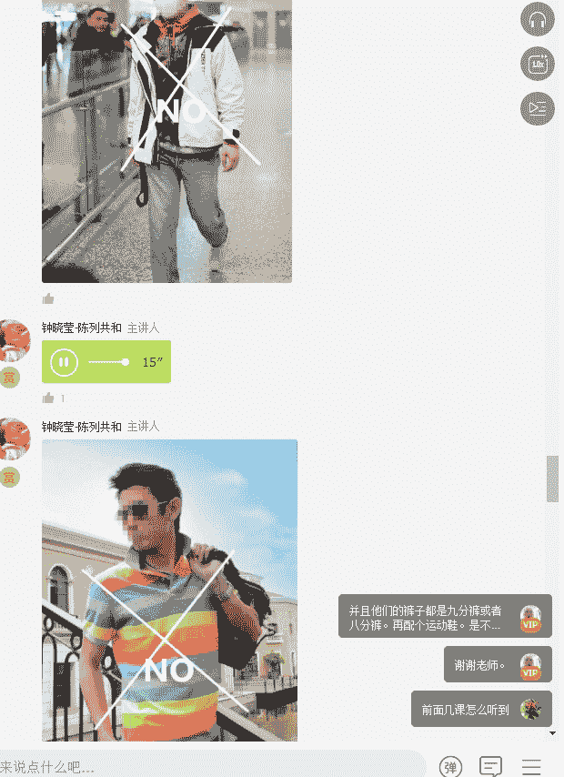

大家现在看到的这些都是我发上来的是比较禁忌的。第一个就是你的颜色太多，把自己变成一个圣诞树，然后颜色特别的缤纷。第二个就是我觉得因为我们今天是讲颜色嘛，所以我们全部都集中在这里面。

所以我还是建议男同胞们还是选用基础的百搭色来搭配这种特别的颜色啊，全身上下有一个特别的颜色出现就可以了。就是大家有没有发现我们经常会在机场啊，或者在一些公共的场合，看到有一些男士。

特别有些男士穿的裤子很紧，然后上衣很花的时候，我们都会都会互互互相对着呃对视一下，就是同伴跟同伴之间对视一下，然后说一字说一个字，娘，所以我想所有的男人应该除了你有特殊爱好之外，你都不希望别人说你娘吧。

所以娘的特点是什么呢？就是穿的太花。第二，穿的太艳。第三，穿的太紧，这都是娘的原因。因为男人阳刚之气，他表达出来的是那种魁梧，壮实力量，同时是一种简洁，色彩一定是用一些比较简单有力量的色彩。

比如说黑呀、白呀、灰呀组合起来。啊，最近有部很火的电视剧啊，就刚刚呃康有为先生有提到的说是那个什么恋爱先生里面的两大花痴男哈。的确，我觉得我们中国的很多的电视剧，特别是时尚电视剧里面的男士的搭配也好。

女士的搭配也好，我觉得都不是特别的得体和符合角色的塑造。那我唯一赞赏和唯一欣赏的呢，可以说是欢张颂里面的男士的一些穿搭。好了，那我们现在就来做一个呃色彩搭配原则的一个呃一个讲解。

首先第一个我建议大家用中性色进行互搭。比如说黑白灰三色相搭或者米杏蓝三色相搭，这都是非常保险的颜色搭配。

好，大家现在看到的就是黑白灰互相搭配当中的灰色不同明度的这种搭配。那当然了，还有就是黑加白加灰的这种搭配也是可以的，或者是黑加白啊或者灰加卡其加白的搭配也是可以的。

好，大家看到了吗？这就是不同的白色跟灰色的搭配。无论你是上装是白还是下装是灰，其实都很好看。那当然常规来说都是上衣是白色，下下装通常颜色深一点，因为你不想显得头重脚轻嘛。

好吧，那大家看到的这两个男人，一个是关泽哈，大家有没有看到关泽的这件白色的这个围衣围巾啊，让他从一米8几的身高一下降低到了1。7米啊，为什么呢？因为这个白色在中间而且视觉将他整个人拉长了呃，拉短了。

然后整个人往地上拉，然后另外一个呢就是他的这个呃他的这个白鞋呃，作为一些呼应。但是呢因为这条围巾呃，让他个子变得很矮那当然了另外一个这个男人是原来的F4当中的一个成员吧，忘了他叫什么了。呃。

很浮夸的一种风格，一条小丑裤，然后再搭配一条飞行员的机车夹克。我认为这种搭配呢不是特别有胆量，应该是不敢穿出来的。如果普通人这么穿的话，真的很雷人。

好了，黑白灰接下来呢我建议大家可以用米杏黄来做另外一种搭配。

大家看到的这个最后这双鞋的颜色了吗？这个就是杏色杏色。大家现在看到的这个吗？这个就是米色和杏卡其色和杏色，再加上蓝色的一组搭配。这种搭配会给人一种非常清新的感觉，它给人一种非常嗯大学生的这种味道。

那当然因为你用到了杏色，所以呢特别是卡其色，你就会有一种非常低调的优雅。第二点就是你要控制住自己的欲望，全身就一件有彩色和亮色，也就是色彩搭配原则当中的第二个原则。第一个原则是中性色互搭原则。

第二个原则就是你要控制住自己的欲望啊，全身只有一件有彩色和亮色。好，你现在看到的这这三张图都是什么？都是全身控制在一个有彩色啊，蓝色和灰色、黑色哈，他们包括白色都是用来做它的辅助的。

大家有没有看到这个它就是两个颜色了，一个绿，一个玫红。

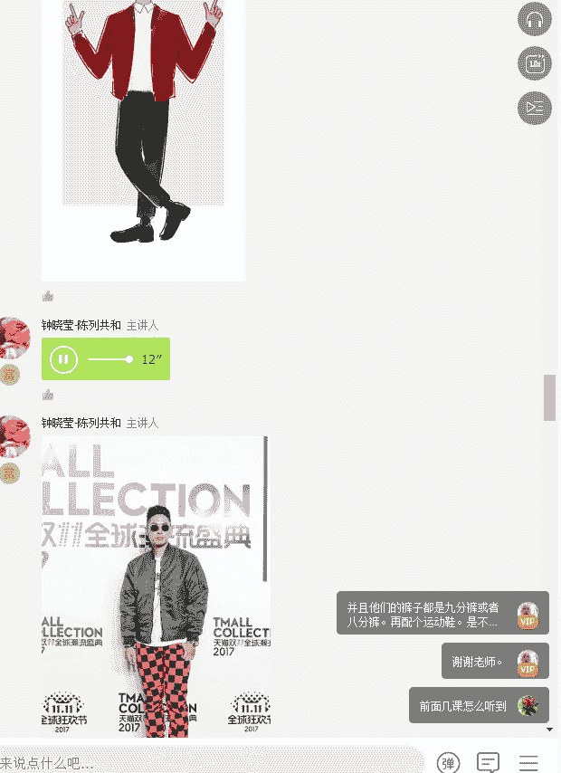

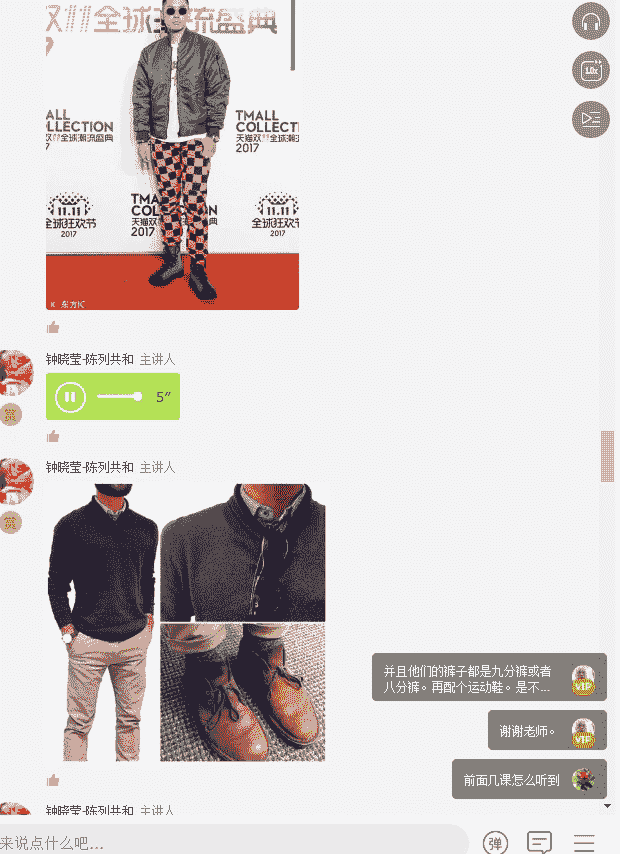

好，大家有没有发现这个杏色卡其色，它跟呃咖啡色跟牛仔色的搭配都特别的和谐啊。所以大家一定要get到这个点哦，这种卡其色其实是非常适合亚洲人穿着的。

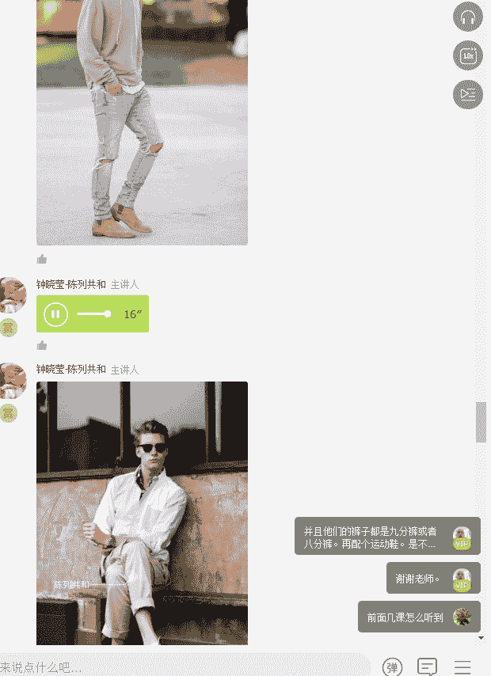

好，那么我们现在接下来要讲到的是三种对比色彩的搭配，低明度啊低对比度、中对比度和高对比度。那什么叫低对比度呢？低对比度其实就是呃类似于有点像比如说你的肤色很白，那你穿穿衣服的时候。

你的服装的对比度就要比较小才好看。那中对比度呢就是比如说我们大部分的亚洲人哈，黑头发，然后皮肤呢偏黄，然后对比度呢，这个时候我们就要选择中的。比如说我们不要穿太过于低对比度的，除非你的皮肤很白。

那么这个时候我们就要举例啊，你穿一件深蓝色的外套的时候，你就内搭一件浅灰色的T，然后裤子呢穿一条深蓝色的牛仔裤。那什么叫高对比度？就是强对比度呢？就是一般那种皮肤颜色很呃很很白，然后头发的颜色又很深。

然后呢呃或者是你的皮肤很黑，你的头发颜色也很深。这个时候你就适合用这种高对比度。比如说很深的黑来对比很白的这种颜色或者很深的蓝来对比这种很白的颜色。

其实低对比度就相当于你穿一身的白或者一身的灰啊。那如果是中对比度的意思，就是这种上浅下深，然后呃上浅下深的这种搭配，或者是外深内浅的这种搭配。其实这种中对比度是非常适合我们亚洲人的穿搭的。

那接下来要讲到的是高强度的强对比的搭配。比如说像这种哈，它的对比是非常非常什么强烈的。优或是这种都是属于对比非常强烈的，这种是要么就是你皮肤偏深啊，要么就是你皮肤偏白才能够这样去传达。

其实大家只需要记住一点啊，身上服装的颜色的对比度应该是以你的肤色和你的头发的颜色对比度保持一致。记住这句话就够了。当你的服装的颜色的对比度和你的肤色和发色保持一致的时候，你的脸色就会显得很精神。

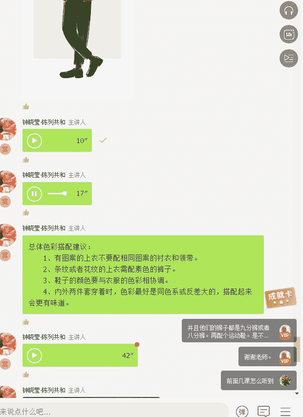

所以最后我们来做一个总体的色彩搭配的一个总结。第一就是有图案的上衣，不要配相同图案的衬衣和领带啊，因为你记住了，你如果穿了一件有图案的上衣呢，你就不要再去搭有图案的衬衣和领带了。

不然的话你全身就会显得很花。第二个呢就是条纹或者花纹的上衣，如果你穿了这两个其中的一件就要配素色的裤子，鞋子的颜色要与服装的色彩相协调。第四个就是内外两套两件套穿着的时候。

色彩最好是同色系或者反差大的搭配起来才会更有味道。

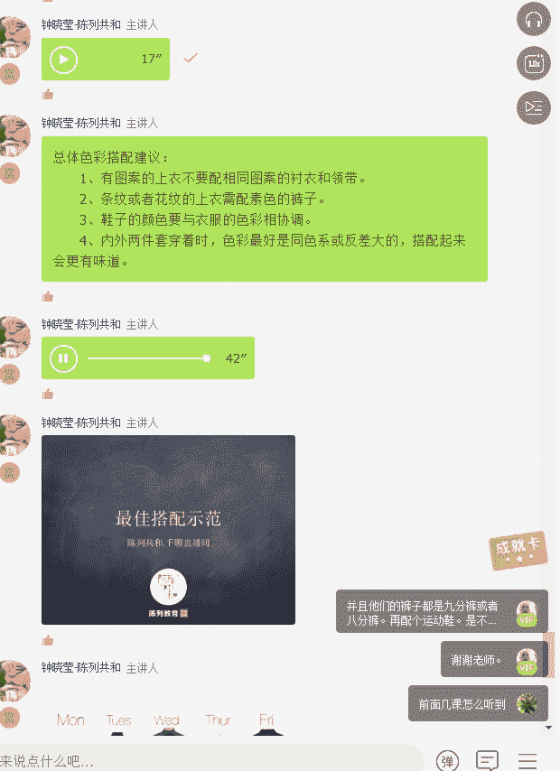

好，接下来我给大家来看几组最佳的这种示范的搭配，希望接下来对你们这个会有一定的了解。就是接下来我到底周一到周五到怎么去搭呢？怎么样去选用颜色呢？我给大家看到了这种一一多搭的方式。

大家现在看到的这个呢是一件灰色的羊毛衣，然后进行了周一到周二、周三、周四的这样子的一个搭配。其实大家有没有发现它在这里面并没有做很大颜色的突破。

它全部都是用黑白灰蓝、卡其这几个颜色来进行不断的错位的搭配。其实我觉得男士色彩搭配当中，我觉得最重要的就是你一定要非常控制自己的对于色彩的这种欲望，想要穿多色的这种欲望。如果你想要搭配的得体。

那么搭配的有味道，你一定记住，有图案的，尽可能让它出现一件就好。有颜色的尽可能让它出现一个就好，你不要穿完条纹又穿格子又穿呃又穿花衣，你永远记住，要协调，你永远记住，色彩要相互的呼应，就一定不会出错。

我一直认为色彩搭配不应该是男士第一考虑的，而是更多要考虑的是服装的这个裁剪和它的版型，还有它的面料的材质。啊，我现在发上来了四款羽绒服，大家有没有看到这四款羽绒服。

你会有发现从呃从面料上面其实它都是羽绒。但是你没有发现在色彩上面它是不同的。如果我们要追逐羽型的话，可能会选择黄色呃，左边的两件。但是如果我们考虑的是它长期经典简单基础的话。

可可能会考虑灰色和黑色这两件。如果按照搭配难度来说，最难的是哪一件呢？考试最难的是哪一件，大家告诉我，是黄色还是绿色还是灰色还是黑色。

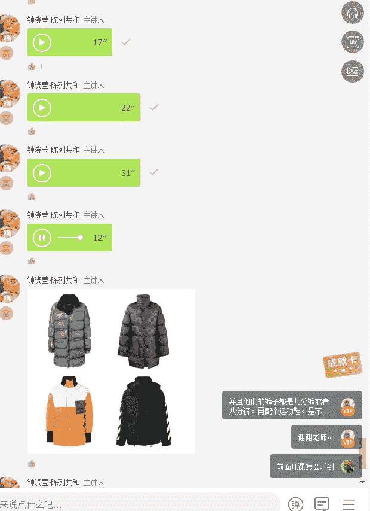

我想大家应该都知道，最难搭配的应该是只这件黄色了。第二个就是绿色。第三个才是灰色，第四个才是黑色。所以如果你想追逐流行，那么你一定会选择黄色，但是你如果穿黄色的这件羽绒服的时候，一定记住了。

你身上只能有再出现一个颜色了，那么就是黑色里面的内搭裤子全部要用黑色。那如果你要选择这一绿色也是一样，你全部都要用黑色，但是如果你选择灰色和黑色的话，那么你里面的内搭就可以采用彩色了。好。

大家再来看这四件同样是红色的衣服，你们觉得它的搭配的难度在哪里呢？难度就在月花的越难搭，对吗？第一件蝴蝶和格子相接的这种搭配，太难搭了。这种就是流行款。

那第二难搭的就是那个AANGER的这条好多流苏也很难搭。但相对来说它比那件蝴蝶的要好搭。搭多了，那接下来次然搭的就是那个有蜘蛛的。

但有蜘蛛的这件你可以在外面照一件黑色也是可以的那最容易搭的就是这条黑黑红条纹。所以大家能够透过我这两个图，能够理解到搭配的精髓了吗？所谓的搭配就是什么？所谓的搭配就是从简单入手，不要从复杂入手。

如果你是新人，你一定记住，不要去追求所谓的流行色，当季的流行色啊，什么紫色啊，什么黄色，你不要管它，你一定要记住，从最简单的颜色开始，比如说白灰蓝或者卡其和米色。但是永远记住哦。

并不是说黑色的衣服越多越好哦，黑色的服装单品一两件质量好的也就够了。你不要选择太多，全身都是黑，其实看起来也是很压抑的。特别是你如果你的个子偏矮的话，你全身是黑，会显得你个子更小。

但是你也不能全身都是白，所以你要可以，如果你的个子比较矮哦，偏偏矮一点的。比如说我才1。68米才1。65米，其实你是可以穿一点灰色调的。其实有很多时候面料对颜色的影响是很大的，在选择颜色的时候。

要考虑采用呃呃要要考虑他所用的面料以及他的品质感。如果是网购的话，一定记住，你买的便宜的面料，寄过来的颜色一定是跟他的照片有很大的区别的。所以我建议大家还是要到实体店里去试这种带色的带颜色的衣服。

因为呃商店里面最起码你可以很直观的看到它的这个颜色，当然有很多人说老师其实商店的镜子会有有时候会骗人的，其实不会，其实大部分的商店现在追求的都是特别是一些大牌的店铺啊，你比如说呃uniq啊。

zaara啊这些国际的一些品牌的店铺，他们要求的光要求的灯光都是要还原他们的产品色的，而不是制造假象去欺骗顾客啊，我们大家不要有这样子小格局的想法。

我现在给大家看到的这些全部都是呃我建议大家的一种搭配的方法，一般好看的搭配基本都有几个呃都有两个特点。第一2加1或者3加1。

那2加1就是黑白，再加一个彩色，或者是全身的黑，加一个彩色，或者是三个颜色，黑白灰再加一个彩色。大家现在看到的这几张图片哈，从第一张开始，我们可以看到啊，这是全黑的搭配。

但是中间有一件灰色的什么灰色的衬衣，就是这件皮夹克。那第二个呢就是这个呃欧洲的男士啊，长得非常网子的。它上身全部穿的是一体的灰呃，裤子呢其实是这种呃浅的米灰色。然后第三套呢就是外套是这种豆沙绿。

然后在中间加了一件白色，然后再加了一件卡其色，还有它的鞋子。那第三个呢就是它用牛仔搭配了这种呃米驼色，然后再加了一双这种咖红色的鞋子，跟手表相互呼应。然后军绿色搭配灰色的裤子和浅灰色的围巾。

还有一条还有一双小白鞋。当然还有一个。

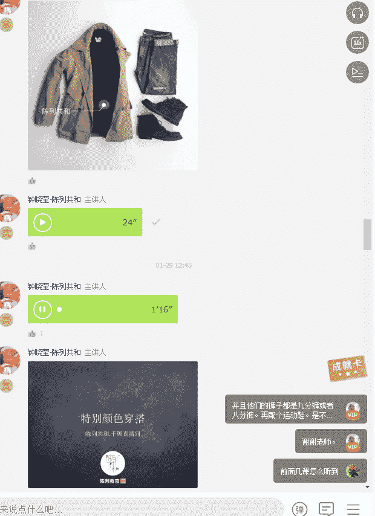

跟围巾呼应的灰色的帽子。那接下来呢这个军绿色下面呢就是一套。不同呃，外外衣是浅灰，然后裤子是深灰，然后搭配了一件这种深的焦糖色的毛衣，其实就有点像我们的咖啡色，然后鞋子呼应了这个焦糖色。

中间再过渡一件白色的衬衫。

啊，接下来大家可以看到就是蓝色跟灰色和白色的这种组合了。

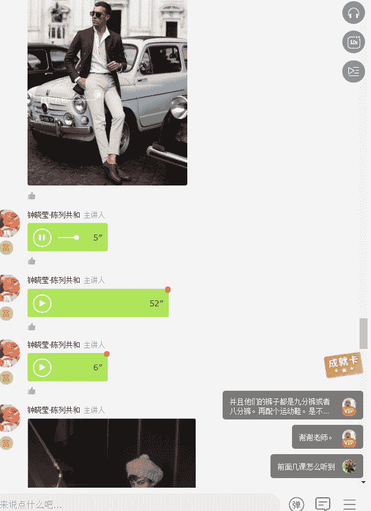

好了，以上就是我要跟大家今天讲到的男士的色彩搭配的全部的内容。那回去之后呢，我建议呃我来做一个总结哈，就是首先第一个把你的衣橱当中的颜色分出黑白灰，这是我们之前讲到的啊。

第二个就是把你的衣橱当中的有彩色，什么红啊、黄啊、蓝哪、紫啊，这些颜色全部都单独挑出来。然后用黑白灰作为基础的两件衣服作为基础搭配，然后在这中间位置插入，比如说有彩色，或者是里面的内搭和裤子是五彩色啊。

黑白灰，然后外面的外套加入有彩色。然后第三个就是亲自穿上身拍照，然后传到我们的这个学习群里面，裤相之间去做一个点评。

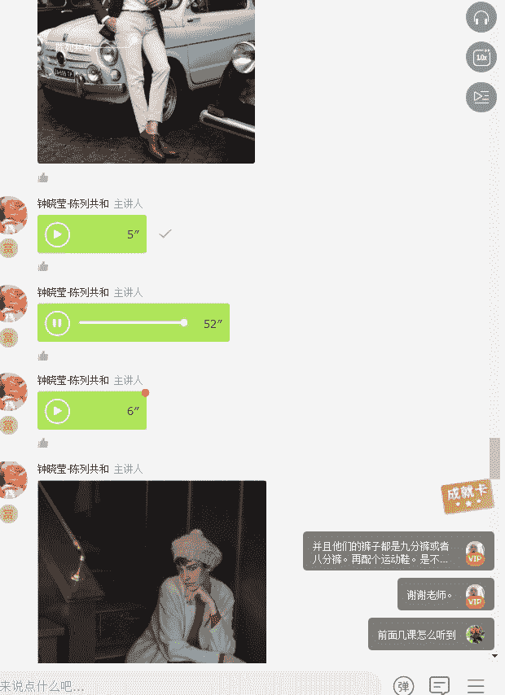

好了，这就是我留给大家的作业。那接下来呢给大家5分钟的时间提问。

我最后给大家看到了一些比较特别的这种油彩色的颜色的搭配哈，一个是橄榄绿，一个是红酒红，还有就是墨绿，还有就是这个红色跟白色的互搭，希望这些搭配图片能够带给大家一些搭配的灵感。其实我每一天的搭配。

其实我都是在找寻灵感的。比如说我常常会觉得哎呦自己最近不知道怎么穿了。那这个时候呢，我可能就会啊上网去，比如说找一下这样的图啊，然后去看看我接下来应该怎么去搭配呀。

其实这就是我们每一天最有趣的一件事情了。穿搭其实是在表达我们自己的内在，一定记住。一个搭配得体，形象得体的人，一定会给人或会给人一个非常好的印象。就因为这个好的印象，你可能会比其他人获得更多的帮助。

美国曾经有个数据表明，就是形象好的律师，他的收入比普通形象的律师收入高出20%。所以我想形象好，其实是对于我们人生来说是百利而无一害的事情。只要你不是过度的追逐流行。还是那句话。干净比时髦更重要。好了。

那我们今天的课程到此结束。嗯大家还记得刚刚在课程结束之前，老师布置的作业吗？还是那句话，知识不产生力量，运用知识才产生力量。所以呢我待会儿会把老师布置的作业发到发上来。那大家可以对照着回去做练习，呃。

期待在交流群里面看到大家呃搭配后的这样一个成果，我们一起来分享和交流。

那同样的，每次课程结束，我依然会把每堂课的总结呃的知识概要都发上来，供大家回顾。

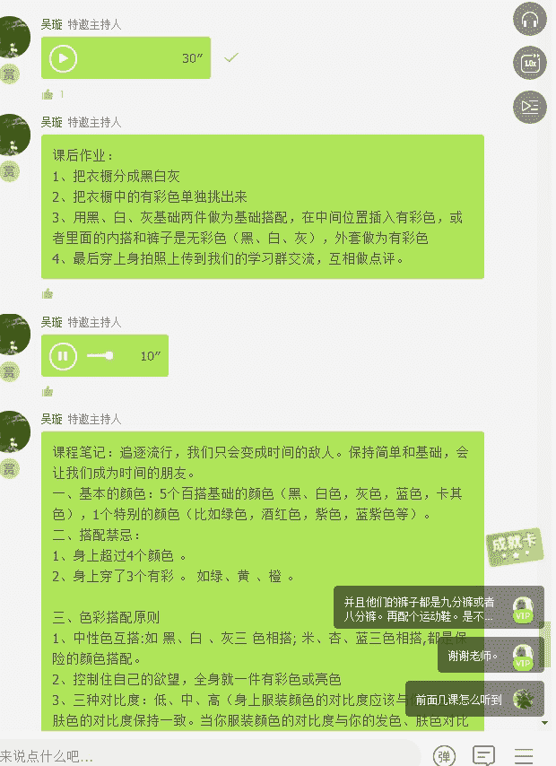

好，课程的最后的话，还是希望大家能够在给我们的课程做一个。反馈也就是在你的。课程界面上面的右上角有一个点评，希望大家对于今天的课程给予客观公正的评价，然后方便我们更加给到大家提供更好的服务，谢谢大家。

那OK我们明天同一时间的上午12点钟见。

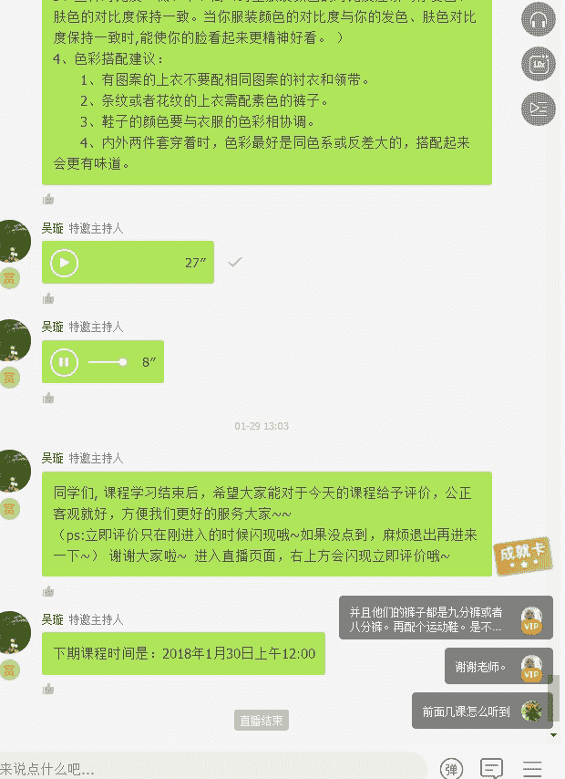