# 1、17手机摄影视频课：第3课-手机照片后期处理（2）

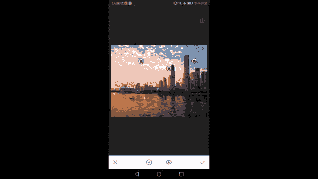

好了，学会了呢我们的局部，我们继续看我们的修复工具，晕影和文字怎么使用啊，修复顾名思义就知道它是对画面的一些小细节进行一些更改。比如这里发现一个莫名其妙的浮标没了。

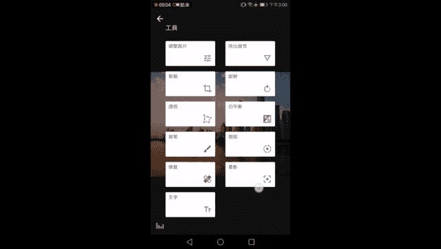

是不是太快了，看不清楚。看一看看一看看一看修复工具是这样的，也是有一个画笔，看到中间那个圆圈了吗？这就是画笔的大小，你通过缩放画面来调节画笔的大小，然后选择画面中的一个东西。比如说刚才这个浮标。点一下。

它就会自动的啊它APP去识别周围这个东西，它周围的画面是什么样的？比如说这里是一滩水。他就把周围的这滩水抹在了你所选择的这个浮标上，这个浮标就消失了。嘿，当然也是不自然。如果你选择的太大的物体。

比如这艘船啊，你把它抹掉，它周围哪有足够多的信息，让这艘船被抹掉啊，那肯定会出bug，对不对？所以一些小的瑕疵，比如说我们人脸上的一些污渍。刚才画面中那个不好看的那个浮标啊。

我们可以通过选择这个修补工具的画笔来让它消失。那这艘船你让它消失，怎么可能呢？附近根本没有足够多的水面信息来填补这艘船，对不对？你怎么把这个这个楼错了没有呢？这是不可能的。

附近没有这么多的天空信息来填补楼的这个位置，所以它可以对画面的一些小局部起到一些调整的作用，修补一些瑕疵啊，就是修补工具在人像中的应用会比在风景中更多一点点。我们这里不需要它把它关掉晕影顾名思义。

这好像很难撕，它其实暗角的意思啊，很简单吧。

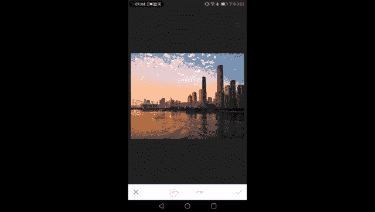

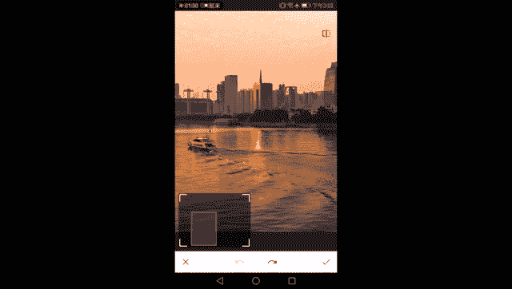

我们很多时候在看到一些instagram啊，或者说viss啊，以及其他的像mix之类的APP上都有这么一个加暗角的工具。只不过nap see的要聪明一点的地方是它可以调整里面的亮度，它可以把里面加量。

啊，内外它区分了一下，同时呢它可以加量角。他把外面加亮了，哎，它就变成亮角了，把外面减暗了就变成暗角了。所谓的暗角无非就是让画面周围的一圈光线减少嘛，对吧？就变成暗角了。那你把它加多变成变成白角了呗。

量角了呗，这都是可以自己去调节的。同时呢暗角的大小暗角覆盖的A，按错了，不好意思。

暗角覆盖的大小也可以通过缩放画面来选择。

这就是我们的按角工具。OK下一个文字啊，非常简单了，就是一个在画面上加水印加字的这样的一种功能，我是很反对大家在画面上乱加什么忘了爱啊，再见时光啊，什么忧伤啊，这些乱七八糟的东西。

当然了这是显示个人风格，你想一下就加我也喜欢在画面上加一些自己的水印啊，表示这样作品是我拍的，然后这是它的一个功能。那么刚才看到了清楚画面以添加文字。然后呢文字有几种调节，下面第一个左边是颜色喽。

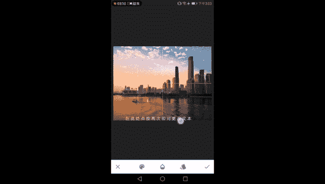

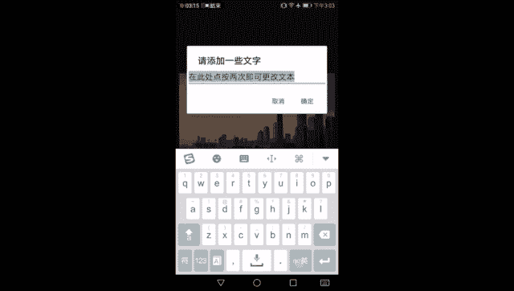

各种各样的缤纷色彩需要有中间是不透明度，不透明度就是它不透明的程度喽，它越往左它就越会出现在画面中，越往右，它就会越清楚，越不会陷在画面当中去他这样就是薄薄的一点点就很漂亮。

倒致了就是把它跟画面的不透明度反过来。形成一个镂空的效果。有时候大家需要突出文字的时候，也可以使用这样倒置不透明度的效果，让画面成为背景，让文字成为我们想要看到的一个主体。

所以这就是倒置之后不透明度倒置之后的一个效果蛮酷的，蛮好玩的。那么大致以来给自己的照片加一个洋气的水印，还是可以通过这个功能来的啊，摆平了。然后第三个就是文字的相当于是字体，或者叫它的一些风格啊，字体。

然后有一些特殊的玩法，比如说一个圈。六边形这样加在画面中形成一个logo一样的东西，也蛮好看的。还有很多非常丰富的字体。我个人常用的就是这个lash4。其实我其实有时候也会比较喜欢。第一个赖E。

也蛮好看的OK那这就是文字工具，非常的好懂，非常的简单。然后呢进入到了我从来都不推荐大家用到的滤镜，对不对？我说滤镜一键调节特别的特别的让人偷懒，同时很难去控制它调节的效果，所以我们不推荐大家用滤镜。

但是也不是所有的滤镜都不用一棒子打死，也是错的那我经常会推荐大家使用的是色调对比度，啊，增强画面的细节，它并不会改变画面的太多的色彩，色温方面的风格方面的质感方面的调节不多，它只是把画面的按照高中低。

按照明暗，按照亮度中间调和暗部三个不同的像素啊，不同的亮度的像素集中起来进行调节对比度，不会加更多的东西，魅力光晕只是把画面中的一些比较粗糙的地方，加上一些光晕的效果。然后复古是增加画面的立体感。

这三个滤镜中个别可。

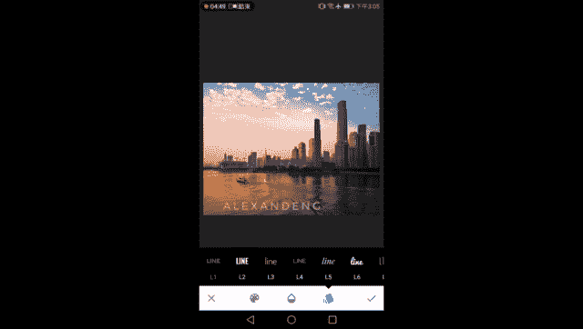

用个别可用。那么按照我平时的顺序，我们先进入色调对比度，对画面的立体感进行一次加强。

我们都知道立体感是有对比度带来的。如果一个画面没有对比度就是一片灰啊，亮的不亮，暗的不暗，像雾霾天一样，对吧？就没有任何的立体感。那么我们通常加对比度的时候是针对整个画面的对比度进行增加的。

就会把暗的加的太暗，亮加的太亮。那么我们把画面分成高中低三个色调，根据它不同的亮度，还记得直方图吗？根据它不同亮度把它分成高中第三个色调来进行调整，这样就能够哎实现局部立体感的加强。

就说这句话局部立体感加强。比如说我加楼的立体感，我可以加暗部哈，我把先把它都降为零。我们先把们都降为零，这里是没有任何调节的。我们点右上角看没有任何的变化。然后比如说知道这个楼啊。

它大多数是在比较暗的地方的，我说只加低色调对比度，大家注意看低色调对比度，有没有觉得这些建筑唉变清楚了呢？有没有变得更立体了呢？那反过来我们的天空。😊。

当我在调低色调的时候，几乎没有任何变化，没有任何变化。看到了吗？所以这就是色调色调对比度分开调节画面中各部分不同明暗部位的对比度的一个神奇的效果啊，才能够让我们去局部的调节我们的画面。

那么如果只想调高光呢，OK啊，只调高光暗部不发生变化，也是没有问题的。中间调啊，中间调建筑比较亮的这部分和天空中比较暗的云彩，这部分是我们的中间调加中间调也可以只让中间调的对比度增强啊，细节看起来立体。

大家注意感受一下是不是有变化，是不是有变化。那么我们可以看到这是它隔壁这些暗部丝毫不为所动啊，内心毫无波动，甚至想象和这个中间调完全没有关系。所以色调对比度是这样的一种调节画面立体感的滤镜。

是不是跟我们普通人理解的那种一加整个画面就爆掉的那种滤镜完全不一样。

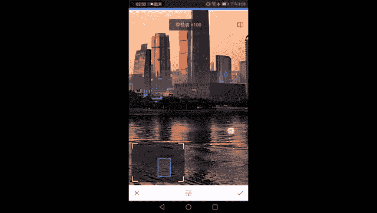

所以这样的滤镜是好滤镜。好，我们要是好同志，我们要相信他，信任他，多多使用它。然后呢就是我们的魅力光晕，魅力光晕可以使画面中充满了柔。软的感觉，我们可以看到内力光晕的下面就复杂一点了。除了这三个参数啊。

调节这个内体光晕本身的程度的参数以外，它还有几几种不同的不同的预设5种啊，其实预设没什么卵用，无非就是帮你调好一堆参数。你看最右边的这个第5号就是让它更暖一点，饱和度低一些，光晕加57。

你这个4号呢就是让它偏冷一点，饱和度稍微不要减那么多了。然后光晕加57。然后我们看到三号滤镜哦，光晕加100饱和度和暖色调不调节。那这些绿色有什么用，没有什么用，还不如我自己去搓这三个参数呢。

所以我只有自己来调OK光面降0，现在又是回到了最初的一个数据，我们来慢慢看有什么样的一用处，大家注意看画面的细节。当我调节光晕程度的时候。

发生什么样的变化？有没有觉得变得柔软了？刚才看起来非常的锐利啊，我们加了锐度，加了结构，对吧？我们还加了四角的纬度，后那些看的很锐利的细节又变得模糊起来了。但是这种模糊呢跟。

那种低对比度那种像雾霾一样的模糊又不一样。它是把画面的边缘加了一层柔光的效果，像我们老照片上的柔光镜一样，哎，让画面有一种淡淡的柔光的感觉。那魅的光晕是有这样的一个作用。同时呢它又能够降低画面的锐度。

降低画面的锐度，然后让那些很清晰锐利的地方不那么僵硬，有时会觉得画面太锐了，有点傻，像画出来的一样啊，1一板一眼的特别的死板，来一点柔光来一点点柔光，让画面中明暗对比过度的地方，稍微。

揉一点点啊，比如说我在没有加之前，我们看这栋楼，我们看这栋楼，它的暗部和。

亮部的交界线像刀砍的一样，非常的清晰，对不对？东台也是一样啊，很清晰。这样的交界处。有些时候我们就觉得画面不需要这么的精准，不需要这么精准的切割它的边缘。有一点点诗意，有一点点朦胧，反而更有一种朦胧美。

或者说有一种柔性的美。那我们家光晕。注意看加光晕。就可以让这些物体尖锐的边缘多了几分温柔的色彩啊，多了几分温柔的色彩。加之前加之后对比一下你看。对不对？它不简单的降低画面的对比度，让这个画面变得不锐利。

而是把一些非常硬朗的边缘变得有一几分温柔的色彩了。让这个夕阳下的珠江星辰啊，不仅是一副曝光准确，边缘清晰锐利这么一种很傻很呆的证件照变成了一点有点艺术风格，有点温暖有点温度的这么一幅画面了。

这就是魅力光晕的一个作用。其次呢魅力光晕还可以让我们色调对比度或者是加锐度的时候加的比较烂的。你看这里这样一些因为加锐度加过分，出现的色斑出现的色质啊，这样一块大大块的色字和这些颗粒。

但然这肯定不是噪点，对吧？你也可以理解成广一下的噪点，但是它不是那种IIO太高造成的噪点，它是锐度加过度了之后形成的一些高反差的局部。那么我们通过魅力光晕哎能够显。

著的减缓显著的减缓这这一现象，看到没有？加之前这里是非常的粗糙，非常的有颗粒的。然后我们加了之后呢，哎就没有了，就成了过度非常自然，非常柔软的天空了。所以说魅力光晕它这两个作用是非常重要的。

第一个能够让我们的本来应该很锐利的，很硬朗的建筑变得有一份温柔。让本来就应该温柔，就应该过度很自然的天空云朵，这种很柔的部分变得更加的柔，更加的自然，更加的自然。

那么这就是魅力光晕的神奇作用。那么也不一加多了，任何事情都不能太多。我们大家都知道度很重要。

那么调面的光晕的时候，注意看一下，不要把建筑加成了。

像化了妆一样的女子一样妩媚，就不太好了。这个大家自己去平衡这种风格啊。如果加多了，我们待会儿会教给大家一种神奇的蒙版工具，使用它画面的局部进行调节，而不要让魅力光晕加在整张画面中就会好很多。

那饱和度和它的暖色冷暖色调，我们也可以根据自己的喜好进行一定的调节，有人喜欢蓝蓝的紫蓝蓝的紫紫的日落，有人喜欢这种啊一片昏黄的感觉，都OK一个比较自然的画面作为一个上限啊，不要超过它就好了。

这是 made的光晕打勾。然后呢，来到了复古12号，为什么是复古12号？我刚才还记得魅力光面的那几个预设是没有什么卵用的对吧？他就是把那三个参数帮你调好。但是在复古这个滤镜中，这些。

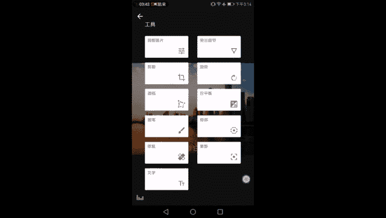

预设就有很大的用处了，有很多你并不能够通过参数调节的风格化的调整，都在预设里面。它的预设为什么是一张张的色块，一张张的颜色呢？就是因为这些预设都会给画面的色彩带来不同的变化，看到了吗？

都会有不同的偏色的一种效果。所以说。复古滤镜就不是所有的预设都可以用了，我只用最后一个。最后一个不会对画面色带来任何变化，它只会增加画面的反差。我们注意看。看到了吗？

加之前加之后加之前加之后可以看到画面的对比度变强。那而且这样的对比度变强，跟我们在在基础调整里面加那个对比度是完全不同的。所以这就是对画面的立体感啊，进行加强的一个复古12号基础12号这样的一个滤镜。

左边是加这个晕影，就不需要加了。好了，那么我们也了解了复古这四个调节，但是它除了12号这种无脑的预设套一下以外，我们还可以调节它的亮度啊，人为的再去调节。比如说你觉得它反差加高了，画面太暗好。

我们加一点点亮度可不可以可以啊，画面有点亮亮的感觉。这样你们看调节前调节后嗯，画面既有立体感。又保证它的一个亮度。然后呢，饱和度可不可以再加强一点，可以啊，这太夸张了，对不对？我们可以降低一些也可以啊。

黑白的感觉也不错。还有一个呢是样式的强度，所以样式强度就是指这套滤镜本身在画面中出现的强度，强度加满，就会发现画面对比度非常高，不好看。如果长度降为零呢，就相当于没有没有没有加过这个滤镜。

没什么太大的卵用。所以说。到最后是晕影啊，抱歉，最后晕影就是直三角，大家都知道，没什么好讲的，一般会降为0，不要降角。所以说这就是加强立体感的复古12号滤镜，复古12号滤镜。那调到这一步。调到这一步。

我们所有的调节基本上就结束了，这就是一张城市风光照的。按照我木溪的一个调整的方法，完整的走完了一一趟后期的旅程，从这么一张天空该蓝不蓝，夕阳该红不红的一个画面。啊，建筑该有立体感。

该锐丽的不那么锐丽的一张照片，一张原始的照片变成了这样的一个该黄黄该蓝蓝该瑞瑞，然后该柔化的柔化啊，变成这样的一张照片，同时呢还加上了自己水印啊，很很臭美的加里自己的水印，其只是为了教大家怎么用。

然后这样的一个过程是我们调节城市建筑风光，以及自然风光。最最最最最常见的一个流程是我自己的摸索出来的一个流程。请望大家好好学习。那么到了这一步，我们拔高一下啊，拔高一下。你说老师，我想调节局部。

我觉得我的饱和度加高了之后。我的天很好看哦，或者我的水很漂亮，但是我的天就爆掉了，我不想这样子怎么办？我就想只加水面，只让我的夕阳变得很黄，或者说我只想天空变得很蓝，怎么办呢？

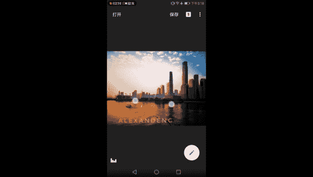

靠局部工具咯，靠画笔工具咯，我画不好那么好的画笔，我不知道局部工具有没有那么多调节，它只能调节对比度，只能调节亮度，只能调节饱和度。那我要把复古加在水面上，我要把魅力光晕只加在天空，怎么办？

那么我们蒙版工具来拯救大家，这是一个全新的思路，可以把之前的局全局调节，全图调节全部变成局部调节的一个很神奇的思路。我们来看一看啊，是这样的，点开。

这个数字啊在最外面的那个页面中点开右上角这个数字九九是什么意思？是我们经过了九步调节啊，这个九步调节也是我大多数调节的一个数字，九步调节，点开它，不要怕点开它看到这是我们调整的所有步骤都在里面。

这也是n的神奇的一个点啊，你所有的步骤都在里面了之后，你如果调到调到这一步之后发现这一步调错了，我们还可以回到这一步来，重新调整或者删掉，重新调整它或者删掉它，或者来了来了没有，中间这个东西，是什么呢？

就是蒙版，你任意点开一步，除了这种透视之类的改变整个画面的调节没办法使用蒙版，不然就把把画面变得很奇怪了，对不对？其他的这样魅力光晕色调对比度往局部之类的都可以使用蒙版来进行调节。哎。

我们来以魅力光晕为例，告诉大家蒙版是个什么样的工具，点开魅力光晕这一步。看到中间这一个像画板上有一支笔的标志。点开它好了，进来之后到了这样的一个界面，蒙版画笔组合界面看到了什么东西呢？看到了下面写的。

四个字，魅力光晕告诉你，你进入的是魅力光晕这个滤镜的蒙版，左边呢是一个反向的功能，能够让画面中受到魅力光晕调节的部分和没有受到魅力光晕调节的部分进行一次交换。那么当我们什么都没有动的时候。

我们这张画面是没有受到魅力光晕调节的。那么按一下这个反向就会让画面全部受到魅力光晕的调节，对吧？那么之后就是魅力光晕的蒙版画笔，这个画笔我们很熟了，我们在画笔工具里面已经遇到过好多次了。

那么它一共有5种从0从0到25到50到75到105种画笔0就是让画笔的效果消失。25呢就是有一点点效果，50有一半的效果，75有大部分的效果，100就是让刚才的效果完全出现，然后这只眼睛很熟悉的吧。

刚刚才看到过的，是让我们看到画面中哪些部分被调节到了。好，点开这个眼睛一看，我们知道除右下角这一点一点点以外，整个画面都被。一种叫做魅力光晕的效果覆盖了百分之百。那么我们要擦掉一部分，怎么擦呢？

百分之百嘛，顾名思义就是让整个画面完全覆盖了，对不对？我们打开这个眼睛就可以看到。然后我们再剪掉一部分。比如说我觉得我的楼布需要那么柔了啊，我的楼楼不要那么妩媚，不要那么软。我们的光笔往下剪剪多少呢？

减到0还是25呢都可以啊，都可以。因为现在它覆盖的是百分之百，我们拿这只画笔放大，然后可以看到这个会变化的圆圈，这支画笔的大小，画笔的大小差不多这么大一个画笔，然后我们来把它擦掉，把这这个东塔给擦出来。

从这个柔画的滤镜当中拯救出来。😊，不只是动塔了，它周围的一些建筑们都去擦一擦，看看会有什么样的结果。啊，不想擦了，我很烦，我们把它放大一点，再擦一下。OK随便擦一下哈。😊。

然后现在因为整个画面处于查看蒙版的状态，所以是红的一片。不知道怎么样，我们点掉这个眼睛叮眼睛没有了。哎，不一样哦，大家再仔细看一看，我们点按下右上角。是不是我们这个楼并没有受到魅力光明的影响？再看一眼。

东塔并没有受到魅力光明的影响，受到魅力光明影响是白外面的天空，这是整个画面都没有被魅力光源所调整，就是整个画面中都被魅力光源调整，除了被蒙板擦掉的部分。看到没有？我们看这边被蒙板所覆盖的画面。

他们是不是都被覆盖了，对不对？我们的福理中心被盖住了。好，我拿掉一个零的画笔去擦福理中心这栋楼。嗯，大家注意看。有没有变化？有没有变化？当然是有变化，还有这栋楼这应该是哪个银行，农行还是建行忘了。

我们去擦啊，就擦出来了。这栋楼的效果就不再受到了魅力光晕的影响了。所以说这就是非常神奇的蒙版。只要你心灵手残，不对，只要你心灵手巧，不是心灵手残，你就可以通过蒙版的非常细致的调节。

对我们的画面局部。你看看你看看哎，是不是擦出来对画面的局部选择施加某一种调整，或者是不施加某一种调整。这样子这个。

整个snap seat的调节就可以非常的精致，就仿佛在PSphoshop这样的一些软件中调节使用蒙版调节画面局部一样了，只是它没有电脑上软件那么方便智能啊，但它仍然可以对局部进行调节。

这样我们的建筑就比较柔，比较硬朗了，不再受到魅力光晕的影响。而，我们的天空，大家可以看到天空和水面仍然受到了媒离光的影响，变得非常的柔软，过度，非常的细腻和自然。而后我们需要它硬起来啊。

硬朗起来的建筑就仍然保持了一个比较锐利，比较清晰的状态。但是我们看这里没有擦好蒙版的后果也是很明显的这坨天就莫名其妙的黑掉了。那么我们迅速把媒体光选到100，然后把它补回去，把这些天。

补回去仔细仔细再仔细。有没有觉得哪怕是玩个摄影，修个图？也少不了当时数学老师跟我们说过的话，是不是一定要仔细听，不能马虎。调门板是这样，哎，调一调，然后再看一眼，注意笔的大小。如果你要修的非常精细的话。

建筑间的缝隙也是要仔细的去擦掉的。好了，这里既然是给大家演示，我就不做的太仔细了。平时做图都还是比较变态的，还是真的还是蛮细心的。所以才会有很多很好看的画面。好了好了，看到建筑基本上没有受到的影响。

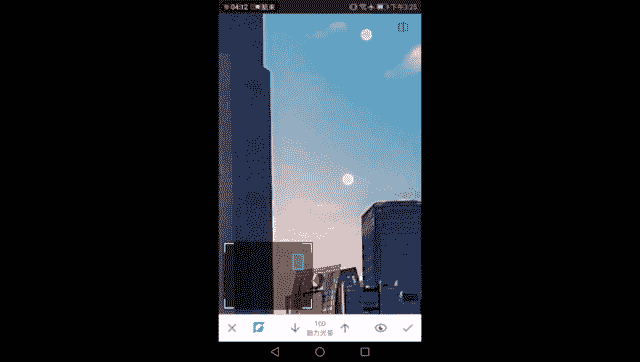

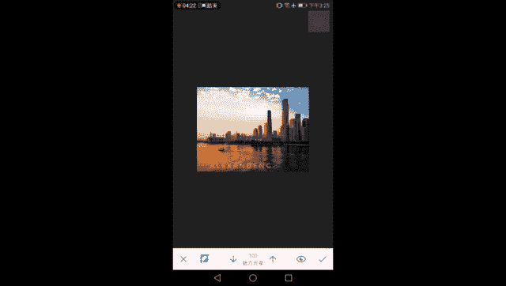

嗯，如果说海星沙这块也可以给他调一调。好。它擦掉，让它不受到魅力光晕的影响，然后让天让其他部分天空和水面受到美力光晕的影响，变得比较的柔软和舒适，这样就很好了。打个勾。

大家去看那一瞬间闪出来了一个魅力光晕的调节，然后我们再加复古。好了。这样整个画面的建筑就很不一样了。所以这就是蒙版，蒙版工具搭配着不同的滤镜，不同的调整，来对画面进行一个改造。好了。

那么城市建筑的后期就到这里，再来回顾一下我们的步骤啊。首先通过调整图片调整了画面的明暗调整了画面的对比度调整了画面的高光和暗部，然后调整画面的饱和度，色彩部分饱和度和它的冷暖色调。

虽然我不建议大家这样调，但是要知道调整图片，这个基础调整里面可以这样调，通过突出细节，让画面变得更加锐利，画面变得更加清晰，再看一眼，突出细节，是不是细节真的很细节了，对不对？然后通过透视好了。

让一个歪歪扭扭的建筑啊，歪歪扭扭的建筑变值变正，白平衡，让画面的冷暖有了一些个性化的变化，有了一些个性化又不失真的变化，然后局部啊，通过局部的学习。我们。

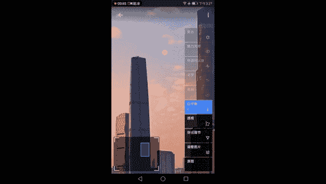

到了画面中一些地方可以单独的被选出来进行调整，而不影响其他部分。然后文字这个是最后也可以加，我只是顺着我们工具的一个排列来给大家讲。好的，到了这一步之后呢，我们又学会了色调对比度。

对画面的暗部暗部中间调，中间调以及我们的亮部进行分开调整来增强画面的对比度，增强画面局部的立体感。然后通过媒体光晕来实现一个柔顺的过渡，还记得刚才被调整的很夸张的这部分吗？对吧？有色块有很多颗粒。

我们通过色调对比度把它都降低，然后再通过媒体光晕啊，对，就是通过媒体光晕来把它降低说错了，不好意思，通过媒体光晕来让这部分的很夸张的过渡变得很自然变得很柔嫩，同时用复古。

最后一步用复古来增强画面的立体感。

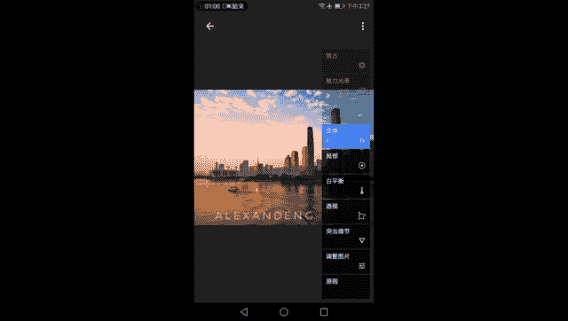

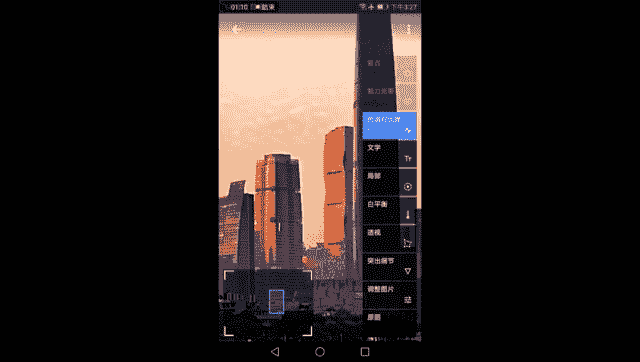

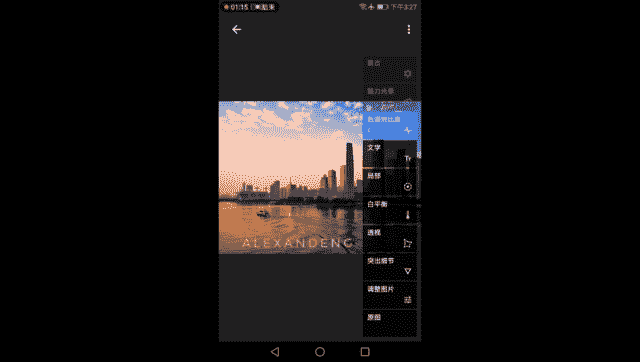

在此之后呢，我们还知道我们可以使用蒙版工具啊，对画面的局部进行调整。蒙版工具呢有眼睛可以看我们调到哪里了，有画笔的不透明度来决定我们调整的一个程度啊，有反向来交换，被调整的部分。

你看被调整的本来是外面天空和水面，我点下反向就调整了。我们建筑了来进行交换O这样一个整个进程就走完了，至于咱们自己在具体的调整当中，我们也可以自己去调se对度的一个蒙板，对不对？我只想调建筑。

我不想给天空加上那么多seel对比，我也可以使用蒙版工具来遮住天空啊，对吧？现在是百分之百全部都被调整嘛，然后我可以用对度零把天空选出来，不要给天空那么强的对度，免得它都烂掉了，这些局部都烂掉了，对吧？

那也可以啊，所以说每一个可以使用蒙版的全局调节都可以变成局部调节。这是蒙版工具非常神奇的一点。OK那调完了这样的一张照片，点击保存。即将保存，那么这样的一次调整也就结束了。

