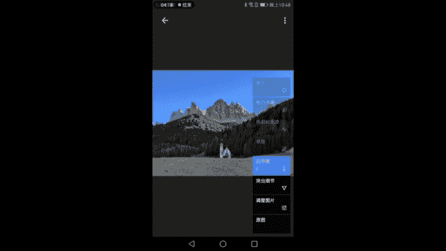
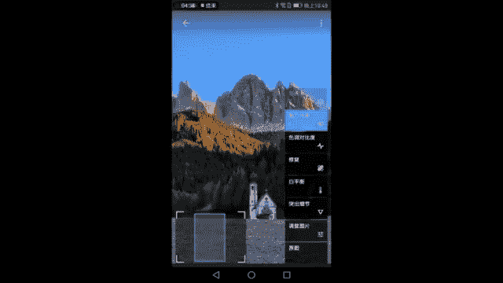
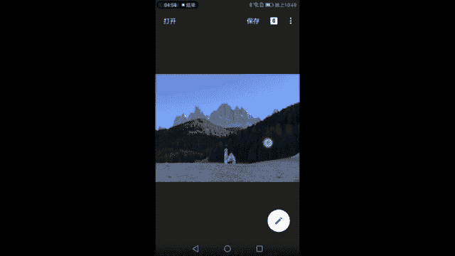

# 1、17手机摄影视频课：第4课：拍摄城市风光、自然风光

开始了，大家好，我是木西。那么今天来到了。非常著名的阿尔卑斯山区啊，在意大利北部的这一段南地罗尔这一大块被称为多罗米地，也就是白云岩的意思。这块山区里非常著名的一个景区也好，一个点也好。

那么总归是来到这里，在这里给大家讲一讲风光摄影的。外景中会运用到的一些基本的技术。同时呢也会告诉大家如何去观测光线，观测它阳的方向，以及我们如何去正确的曝光，正确的测光。O那么我们现在开始。

看到我们身后的。这座教堂和后面非常美丽的叫做欧do的群山，这是我们今天要P的主体。当然我们脚下这片大平原啊，是牧场，同时也是冬西的滑雪场，也将成为我们花园中非常重要的一部分构成。

那么现在我们要看到的一个点是如何针对这座教堂和后面的山进行一个搭配。好，为了让大家更好的看到我的拍摄，我用了视频的形式。然后我现在就对着我的手机讲。那么首先是一个教堂，一个山。

然后是我们后面的这片颜色较深的森林，以及颜色较浅的地面的这块大坝子。那么这样的一个构图很很简单的一些方法是它符合的是我们最基本的三分法。我们可以看到以这个。

以这座黑色的有森林的山作为边界和天空有一条明显的分界线，这条分界线正好可以放在我们画面的上3分之1处。而我们继续走动，可以观察到它和地面这块大坝子，也有一个很明显的分界线。这条分界线。

我们可以放在画面的下3分之1处。所以在风景的构图常见的那种构图当中，我们可以让画面正好处于这样的一种3分的结构，也就是让天空啊，让天空这样3分之1，让中间这块深色的一条森林也是缓坡带啊呈现3分之1。

让地面也呈现一个3分之1的状态，然后来进行这样的一个构图。那么我们要怎么选择我们的主体的摆放和背景的摆放呢？😊，首先这座教堂啊非常的小，非常的可爱。它在一个深色的背景当中，它是一个浅色的主体。

能够把它突出的很明显。那么把它放在画面中某一个比较突出的位置是比较适合的。像我记之前课程中有讲到过两种构图的方法。第一个是把它放在左3分之1或右3分之1的所谓的黄金分割点的兴趣中心的位置。第二种呢？

就是我们采用中心对称的构图，放在画面的正中间。那怎样比较合适呢？我们现在可以尝试一下，首先是把它放在画面的右3分之1处，我们可以看到的点是什么呢？来拍一张哈。😊，他的点是什么呢？是很明显的一个问题。

就是左边的这栋。建筑啊，这些农家乐也好，酒店也好，茅台晚，它反正会入境，不好看，画面就变得复杂了，本来想突出一个教堂少，即时多，对吧？那么这样就不好看。那么往往右放了之后呢。

又感觉整个右边的这一片颜色较深的缓坡带，显得过于沉重，那这样构图之后显得右边太多，左边太少，右边太黑，左边太白，这样的一种不太平衡的感受。所以我觉得还是把它放在画面中间比较好，这样会比较好看一些。

那好了，现在大致的构图有了我们的焦段需要怎么样的选择。首先我觉得天空空太多，地面空太多，然后教堂又比较小，这样无法突出我们主要想呈现的教堂和山的关系。所以我们要进行一些放大。😊，啊，如果是拿的是手机。

就进行数码变焦。如果拿的是相机啊，我们可以用无损的光学变焦进行变焦。好了，放到了这样的一个层次之后，我们可以感受到依然是一个基础的三分法。

天空缓坡深色的缓坡和浅色的这样一个大坝的地面正好形成了这样一个比较优美的构图，然后将教堂至于下3分之1处的正中间，左右左右的颜色和画面中的元素都比较平衡。右边我们可以看到右上方这样放的话它也会有山。

然后左边也会有山，右边有这样的深色的缓坡和地面，左边也有深色的缓坡和地面，这样画面相对比较对称。当然后面是大自然的鬼斧神空，也不可能要是它完全对称，把教堂放在画面的中央部分啊，这样可以获得一个比较平衡。

比较稳定的构图。同时充分的体现我们后面欧斗群山的这样的一个非常壮观的景象。我们的教堂人造的痕迹啊，我们的信仰显得非常的渺小，在自然面前，同时呢以这样的一个比例。😊，去放大它，也可以让画面比较充实啊。

同时也留够了足够的想象空间。比如上半部分留够了一定的天空，下半部分也有一定的地面，让我们教堂踏踏实实坐在地面上，让我们的山峰能够向天空中去延伸。OK那这样获得一张。照片应该就是不错的了。

因为我现在使用的是手机的录皮。录屏啊，也就是视频的模式来进行截图拍摄的。所以它的比例是16比9。好了，容易冷死。好了，刚才给大家讲一下啊。基础的构图，我们已经说过构图是风光摄影中非常非常重要的一部分。

因为它的容错性最低，它很难被。再改正，通过后期的方法，你没有拍到东西就再也没有了。所以构图一定要好好 go，这是第一件事情。那么构图结束之后，我们要完成一次拍摄，我们都知道我们要有一个曝光的过程。

我们相机要从这个世界搜集光线，然后成像，所以这个过程我们需要有准确的曝光。那么准确的曝光呢就涉及的一个测光的问题。因为我们现在手机都是自动去测光。所以我们要以哪里为依据做一个测光点去选择呢？

那么下面就给大家。讲一讲啊，测光。尤其是用手机摄影的时候，测光是如何进行的？来，我们还是以后面的这座山峰和教堂作为一个例子。大家可以看到这幅画面中有深色的这样的一个缓坡带，上面都是一些针叶林啊。

一些乔木。然后呢可以看到上面有比较亮的天空和山峰。所以这个时候这个画面中，如果你的测光点的选择有一些问题的话，就会导致这个画面的曝光的一个失败。我们来尝试一下选择。缓坡带看到没有？

整个山整个远处的山就完全的过曝了。如果你以深色的部分作为测光体的话，如果你选择山，选择天空作为测光点的话，右边的缓坡又会显得比较欠爆，这就是一个比较麻烦的情况好，所以说我们这个时候一般会使用HDR模式。

我们采用HDR模式来进行拍摄，能够有效的保证。天空和地面都能够尽大最大程度的保留细节，收集到他们的光线。HDL我已经在之前的课程中讲过了，大家肯定是知道的。

所以这个时候一定要使用HDL如果HDL还会非常满意。我们总记得画面中有一个小方框和一根小太阳插在棍子上的小太阳。通过上下拖动这个小太阳。我们看到画面的明暗，画面的明暗已经发生了很多的变化。

已经是按照我们自己如何拖动小太阳的操作进行了一些人为的变化，而不而不再以测测光点的测光结果为依据进行调整明暗了，而是于我们的这个曝光补偿为依据在调整画面的明暗了。所以这样也是一个可以进行。

人为调整画面曝光的一个操作。比如说我强行要拍好这个教堂，我不管天空过不够暴，okK那我测光在教堂附近的缓坡处就会出现这样的问题。然后测光在地面也会让外面的山显得比较过曝，测光在天空。

又会让周围的环坡显得有点欠爆。所以如何选择测光点啊，在画面中去寻找一块既不那么亮又不那么暗的部分去测光。比如说这里。看到没有？大家，比如说这块左边的这块环坡，它既不像天空那么的明亮。

它也没有像下面的树林那么的黑。那后为它作为测光点。我轻轻点一下，唉，基本上我们看到山是有点过曝，但是山的轮廓还在，这样就过分了。山是基本上有点过曝，但轮廓还在，而这些树林的细节也是可以看到的。

那么这样的一个测光点就是我们平时去选择最佳的一个测光点，选择好这个测光点之后，打开HDR基本上能够保证一张照片的正确曝光。如果还不行，我们使用我们使用我们的曝光补偿功能来满足我们自己的一个曝光的需求。

好了，那么这样曝光这一刻也讲完了。我们刚才已经讲完了我们的构图，我们的用光和测光啊，用光和测光用光没得说，用光线在是这样。那么我们再讲讲我们的透视吧，透视是大家都知道是一个近大远小的东西啊。

如果它离你近，它就会显得大它离你远它就显得小。😊，那么在风光摄影当中，因为景物通常特别特别的大，所以说我们这样的一些近态元色的变化并不明显。但是今天这个点非常特殊。

就是因为我们面前有一座可近可远的小教堂。通过走近它或就远离它，来实现它自身大小的明显的变化。以这个手机为例。当我手机放在这儿的时候，你可以看它的山的大小的比例是怎么样。当我向前不断移动的时候。

你可以看到手机会越变越大，迅速变大，而山并没有太多的变化。所以假设手机是不动的，我们人来前后移动这个距离的话，也会出现类似的效果。好了，那么在风光摄影中，如果我们今天以这个小教堂作我们画面的主体。

我们想要体现它很小，山很大，那么就要站在现在这个位置上。我们如果把教堂拍的大一点，山拍的更小一些，那么我们就要往前走，我们来看一看，我们往前走了之后会发现怎样。跳槽逐渐变大。为什么会在这方突然蹲下呢？

大家可能从刚才的画面中已经看到了。我们当我们站起来时候，我们看到旁边有有。有一片啊很脏的，并没有成型的滑雪场啊，那是当地的主人想要把这里变成一个滑雪场进行个造雪作业。但是现在明显天气还不给力。

还没有铺成一大片的雪。那么在我们刚才构图当中啊，无论如何那一片。那片雪厂和后面的房子都会进入画面，成为一个比较脏的部分。那么我们就要寻找一个东西，能够刚好挡住那片雪场。

同时又能把我们的主体这座教堂后面的山给暴露出来。所以我从后面往前走的这个过程当中，我就发现了这样的一个很小的缓坡，非常小的缓坡，我们往前走。没发现这。寄报给别。坡有点点小小的弧度啊，大概。几度的样子。

但是当我往前走的时候，我发现它好像可以阻挡到。不果能？的小房子。然后我一稍微往下一蹲，往下一蹲，看到左边的房子就没有了。我们稍微站起来之后，就可以看到刚才左边那部分的房子。退一点点。

然后我们看到这里有一块雪场。对吗？那如果在刚才的位置上去去拍摄的话，无论如何都会把它拍进去啊，这是我很不想要拍进去的一部分。来破坏了整个画面的一个纯净性啊。本来前面都是很正常的缓坡和这个大坝子的交界处。

为什么到你这就有一块白白的东西很奇怪，所以我不想拍到它，但是这么大的区域中，我没有找到一个可以让我躲起来的地方，而此刻我走到这的时候就找到了我们稍视把机位放低。Hey。发现了吗？

整个地面突然就变得干净了很多，这样的一些构图的技巧，很可能就是你90%的照片和99%的照片差的那么一点点差的那么一点点。当然你说你可以后期去除，完全没有问题，你确实可以后期去除。

但是如果能够在前期把事情做好。这像我之前讲前期是一切的基础。我们尽量使用前期的工作来完成。好，我们看一下到了这样的一个缓坡地带，我们需要怎么样去悄悄的构一个图。这是为什么？我经常说风光睡。😊。

一定要靠脚去走它，怕你的主体再大。宏伟你要去。绕场一周啊，一公里的路来回走走，外面的路来回走走，不会亏的。意外的发现很好的前景，一个意外的发现一个可以遮挡，可以遮挡后面不干净背景的小缓坡。

这些都是在实践中一步一个脚印去走出来的。那么一定要靠走，不管是我们学拍照还是在拍照现场中，所以一定要靠亲自去。到这里面去，现在看到这个缓坡可以刚好的挡住左边的一块雪场。但是呢如果你埋的太低的话。

你又会把它那个我们的主体教堂遮挡太多。那所以我们要不断的尝试可不可以向左走一点点。然后或者是稍微抬起来点，让这个缓坡最高的位置刚好遮住左边那块雪场。然后好，我们再往右走，再往右看一看。

可不可以再遮多一点。嗯，遮的不错，这的不错。我们要是刚好把教堂放到一个凹进去的地方，然后左边的缓坡往左突出起来，遮住那片雪场就更完美了。好，差不多这个位置，然后我们进行一个两倍的放大，大家可以看到。😊。

这样一来好了，整个画面就非常的干净了，完全不用担心左边那片缓坡破坏了我们画面的一个纯净性。那么刚才我们也看到了，在我们的这样的一个观察现场的过程当中，哪怕是看起来一马平车。

什么都没有的这样的一个大坝子上都可以给你惊喜，为你的构图创造一些优好优优良的条件，等死我了优良的条件。好，那我们继续往前走。来回到刚才的透视的话题来看一看。通过人用脚步进行前后的距离移动。

会给画面中的元素比例大小带来什么样的变化。我们继续往前走。现在可以看到，对不对？叫他音面的人。然我们的山还是那个山。缓坡和它的森林还是那个缓坡和森林，但是我们的教堂变大了非常多了。

所以当我们在构图的时候，我们需要拍到怎样的画面，怎样的教堂和背景的比例，怎样的主体和背景的比例，很多时候要靠人的前后移动来完成的。那么这移动的标准就是。我需要离我近的这个东西。变大还是变小？

如果说它变大，我就要离它很近然后靠近它要往它前面走。如果说它变小，我就往后退，尽可能的后退。像我们刚才一样啊，推到很远的地方去，那么这个教堂就显得很小，这样的一些移动都是透视规律所导致的。

如果平时朋友们观察生活里会发现有这样的一些原理啊，我们在。一个窗户这儿往前走的时候，我们会发现窗外的楼好像越变越。小。到往后退的时候，窗外楼会越微大，因为我们的窗户大小变化的很夸张，因为我们离窗户近。

而窗外的楼离我们很远，这是我们很多时候在高速路上也好，在火车上也好，可以看到离我们近的地方动的很快。旁边的护栏哗哗哗在走。好，旁边的树哗哗在动，而离我们很远的山远方的建筑却几乎没有怎么移动，这也是透视。

近大远小带来的一个变化。hello，大家好，我们又换了一个另外的机位啊，来继续给大家讲解一下风光摄影中的一些简单的构图技巧和曝光技巧。我们现在看到选择一个正确的拍摄时间非常的重要。

这个时机看到我们远方的景色。正好我们将要拍摄的那一栋主体教堂处在阳光的照耀当中，而它背景其他的山谷的建筑已经不能被太阳照到的。那么这样的一个背景是深色的。而教堂本身的颜色是比较浅的，因为它被太阳照了嘛。

它是亮的一亮一暗，这样的一个对比，就能够很好的看到我们的主体，所以选择一个好拍摄时机能够让方便的，让我们更好的去运用光线条件去塑造们主体的一个形象。大家可以看到的是。不好的时机啊。

我们现在看到那边再把它放大一下。我们就可以很明显的看到啊，在我们主体教堂的旁边有一个塔吊，哎呀，我去。本来是非常古香古色的这样的一个欧洲小镇的教堂，没想到他旁边好死不死，来了一个工程，正好是在修。

应该是教堂后面有一些扩建的工程，有个塔吊就完全破坏我我们的画面。所以这就是好是好在我们选择一个太阳在正确的时间的一个。在这对位置的时间，然后不好的就是我不知道他们的社区最近在扩建。

旁面居然架了一个这么大个塔子要破坏我们的画面，所以很为难很痛苦。但是正好可以把这个课给大家讲讲。那么我们现在在这样一条小道上去寻找一个最佳的位置，从现在这个位置拍过去。可以看到群山是自左向右。

把整个后面的天空都铺满了的。但问题呢？就是我们的教堂太偏左了。如果在这个位置上进行拍摄，我们可以看到画面的重心明显是在左边，然后右边显得比较空。啊，这是第一个点。第二点，右边呢正好有一个向下的线条。

向下的线条就感觉教堂在左边要顺着这个坡往下滑的一种错觉。因为右边它空同时它低又低又空，就是一个向下坠落的这样的一个感觉，会给人带来这样的一个视觉上的引导。那么我们一定要继续向前走。

找到一个能够把教堂稍微放在中间一点的位置上，这样拍到的画面就可以看到教堂是比较和谐的啊，可以看到这个教堂的位置。🎼处在画面的重心，让它有一种很稳定很平衡的感觉。那么往前走去寻找最佳的位置。

那么顺便哦听一下。三点。🎼此刻的我们的教堂敲响了三点的钟声。🎼15点。🎼的终声。🎼那么在这个过程当中，顺便给大家讲一下，到了一个地方之后，不要急着去寻找那个最经典的在网上看到的别人介绍的。

🎼或者说第一眼觉得很好的那个位置。🎼多多去转一转，多去走走看看。当然你跟的是旅行团道，没说。自己在外面旅游的时候多去走一走，多去看一看，了解一下整个环境的状态。

我们可以看到我们要拍的主体啊在哪个位置比较合适，用脚再一次用脚去寻找。去寻找那个最佳的拍摄机位啊，不要迷信别人推荐的机位，不要迷信网上那些照片中出现的最佳的位置，自己都去走走，一定会有惊喜。

一定会有惊喜。比如说同样的是这个景，大家都这样拍。但是我那张是马格达蒂娜最经典的作品，就是在下面的道路上拍到的就是一个在沿途驾着车寻找最佳位置的时候，或者叫巡查整个环境的时候，无意中看到的一个景象。

非常的美，非常的温馨，两个人牵一条狗这样的一个画面。那说完那边就有有人在那边牵狗。大家可以看一，就当地的居民在那边牵着狗啊遛着。然后往这边走过来。那么我们现在来到这个位置。看一看。喂你打开我的手机。

这样的一个位置，我们获得的这个画面就相对平衡很多。教堂处于画面相对靠中间的位置上这样来构图。如果说是不变焦的话，显得山太小，近处的这些林子比较比较影响我们的画面。我们再使使用一个变焦的两边变焦。

然后我们可看到好了，教堂在一个比较舒服的位置，同样是三分法构图天空，然后我们的山脉，然后我们的教堂和地面形成一个三分法，这样的教堂的比例和后面的山是比较比较协调的。而刚才我们拍到的那个位置呢。

就会显得过于的偏左，重心在左边啊，因为你要把山拍下来，那教堂就正好在左边就麻烦，那么往前走一走，找到一个新的积位完成这次拍摄。这也是在疯狂摄影实践当中很重要的一个点，比较多走。再次强调要多走啊。

今天一直在说多走。好，你看到。美个风景非常合适的时间，才能照亮它。山呢因为冬天的原因，暂时看不见。但是最糟糕的还是那个塔吊回去想办法把它修理掉。好了，完成了拍摄啊。

我们现在最激动人心的时刻就是如何把一张照片，从我们刚刚拍下来的时候那个样子P成在朋友圈里可以顺利装逼的样子。这个是大家非常期待。如果我们用的是相机呢可能我们还要等到晚上到电脑面前才能导出。

但是我们现在用手机就可以马上进行后期好，那我现在选了这样的一张照片使用我们刚才说到的对称的构图方法，将教堂置于画面中央然后山体在上3分之1处利用三分法来购置了这个画面的背景。

我也看到这样的一些层次非常的漂亮一层天一层山一层林子一层地中间是我们的主体这个教堂了来修图开始因为修图我们已经在修图课里讲过工具的各种应用。所以我这里不再特别的去强调我们就直接顺着开始。

我们今天的修图作业。看到的是左下角点开直方图。😊，然后我们可以看到纸张照片的曝光是什么样的情况，整体曝光很好，没有过曝，也没有最左边的欠曝，整体比较偏左。然后我们可以看到画面是相对较暗的。

可能是因为画面这种大量的这样的暗部啊，让我们的像素有一部分分布在了很左边这一端。然后中间毫无疑问是这样的一些亮度正常的部分，亮度正常的这些部分啊，这些部分是这一块像素然后最高光的右边是没有的。

所以整个照片的调子会稍微的偏反差较大，相对的更加暗一点点。O那么这张照片去修呢会发生什么问题。第一山太灰山太灰没有立体感。第二，树林的层次并没有出来。虽然说信息是在的，死黑是没有的。

但是他们的的反差并不够细节局部反差并不够，让我们感觉到不是那么的立体。再一个呢就是整体的颜色上还是欠缺了一些，毕竟是啊使用某水果手机拍摄的，它的整体颜色是比较淡的，所以我们需要有一定的。

后期它达到一个我们心中的一个比较美的状态，也达到我人眼当时在现场看到的那种山。比如说是应该是黄的，比如说这个天应该更蓝，有这样的一个状态。OK所以我们先开始调整亮度，基本上不没有什么大的可以调的。

因为虽然说我们直方图偏左，那那纯粹是因为这片树林造成的。而我们其他除了树林之外的主体是在直方图偏中间的部位，是一个很正常的很正常的一个曝光。那么既然都集中在中间，就会出现我们之前说过的太灰的一个问题。

这个时候呢我们使用。对比度啊会让画面变得更加有层次一些，然后再增加氛围嗯增加氛围。让暗部不那么暗，让高光亮部不那么亮，这样画面看起来会比刚才这样更加的立体一些，不那么灰了。好了，一你稍微增加一点点。

稍微增加一点点。然后相应的刚才也说到过了啊，饱和度不够，增加一些饱和度。增加一些饱和度，饱和度过高了之后呢，会让山的阴影显得过蓝。山的阴影太蓝了之后呢，画面会偏得稍微冷一点。

这时候就要取决于我们个人的爱好。我曾经讲过哈。画面中的色彩是允许一定的偏移的，只要符合人眼的观测规则，让大家觉得真实可信就可以了。到底是冷一点还是暖一点，可以用我们自己的爱好来决定。相对而言。

这张照片太冷之后很不自然，好像我们眼眼睛上蒙了一层蓝色的。镜片一样，所以我们向右暖一点，哎，看起来还挺合理的，而且画面感觉颜色的。冷暖对比会更加强烈，有暖，有暖有冷。这样看起来比较舒服OK啊。

那我就把暖色调加一点起来，看起来是非常的自然。是不是那么整个照片的基础的调整工作到这一步已经差不多了，氛围我们可以稍微再多加一点点，让画面更有立体感一些。😊，好，高光可以剪一些剪太多就会出现这样的白边。

它无法自动识别到底剪到哪里为止，所以不能剪太多，稍微一点点就好了。OK。基础调整完成。

顺手来到突出细节。可以看到结构可以加强一点啊，我们可以看到画面中结构加强了之后，山的立体感会非常的漂亮。但是当山的立体感出来的时候，我们最讨厌的这个边缘甲量又出现了。

还是因为呃SB啊无法正确识别或者这个软件本身无法正确识别天空这部分。和山体这部分之间的界限，所以它的加。加结构的时候，对吧山的旁边的天空和外面的大面积的天空无法正确的区分，把它们形成了一个白边。

所以这个情况下呢，我们就要使用我们已经介绍过的神奇蒙版工具来帮助我们完成仅仅对山体进行调整啊，需要蒙版工具的帮忙。那么我们今天使用的蒙版工具，我们就不会在乎什么所谓的白边了。

根本就不看你待会把它擦掉就没有了。那么我这这个需要看的就是。我的山体是否达到了我想要的效果？锐华加一点，嗯，看这样还是比较糊的。锐华再往前再加加加加加这样的太夸张了，颗粒感过强。啊，我们加到这个程度嗯。

35左右，30左右比较合理。然后我们的结构呢。结构从零开始往右加，嗯，加到一个大概60到70左右的时候也是很合理的了。OK。这样的山体我们就比较满意了。同时我们可以看到地面显得细节过于突出啊，不太合适。

但是林子呢还不错。我们可以通过按右上角这个键来看一下，调整前后的对比，嗯，林子变得更有立体感呢更加清晰了。所以我们知道待会在擦蒙板的时候，需要把山体和林子都擦出来。至于这个小教堂。

我觉得不能用之百的蒙板去擦，可以用50%做右的蒙板去擦，以免它太过于脏了哈。表面OK打勾。😊。

为了不让他忘记，我们现在就进入蒙版。打开突出细节啊，先点到右上角再重复一下这个步骤，点到右上角这个二啊，看到这个二是我们已经调整的步骤，点开它选择突出细节。😊，向左的一个箭头。

然后这个键按下去进入个蒙版界面。好了，现在回到了没有调整的状态，全部都是一片的，完全是没有被调整过之前的状态。使用百分之百的蒙板，我们来擦山体，可以看到已经擦上了一笔了。点一下叫小眼睛。

看我们擦到哪里了。OK已经擦上了一笔山体了，关掉小眼睛，继续观察我们。蒙版的状态。嗯，如果说不太熟悉的朋友可以开着小眼睛，以防止自己手残，一不小心擦到了边缘之外，又把白边给还原回来了，也擦回来了。

是不太好了。所以。建议新手朋友们刚刚开始擦门板的新手朋友们可以开着这个眼小眼睛啊。然后看到自己每一步操作到了。了哪里看这里是不是就就多了一点点，所以我们按零按零，然后把这个边缘给擦回来。好。

然后继续按到百分之百百分之百。然后我们继续去在画面中突出我们的山体的细节。当然你没有必要每次都擦的这么细哈，只是为了给大家做一个正确的示范。要有个良好的认真的仔细的态度去擦蒙版，这件事情是世界性难题。

尽管啊哪怕在刚刚结束的dobe大会上，他们说他们有很厉害的智能识别的功能，也是在dobephoshop上很厉害的智能识别边缘的功能。但是当场演示的时候还是出了许多无法识别的bug挺尴尬的。

所以在蒙版内容识别这个问题上，没有东西可以替代人脑，没有东西可以替代我们手的操作，所以只能老老实实仔细细的去擦OK关掉这个小眼睛可以看到。😊，山体已经由这变成了这样这样变成了这样OK。

那么它的细节完全出来了，但是稍微有点过度。所以我在擦这边的树林的时候，我将使用75的画笔，而不再使用百分之百的画笔稍微高了一点点啊。林子给他一个75差不多了。那么相应的刚才说到教堂只给他一个。

50左右的。画笔让它的边缘显得比较锐利就可以了。你看教堂后期前后期后好了，那么这样教材就很清晰了，画面会给人一种非常清楚的感觉啊，很高级。完成了这样的一步调整，我可以看到从调整图片到突出细节。

整个画面已经比较接近我们想要的样子了。那么之后这一步呢可以对画面的色彩再进行一次调整。首先视角是不需要的裁剪更没有什么裁剪的需要。那么进入白平衡，对画面进行一些进一步的冷暖色调的调整。

首先我觉得山体我个人看到的山会比现在还要更黄一些。所以我会把色纹向右调整，向右调整到一个我觉得山足够黄的状态。然后着色这边一个是向绿，一个是向阳红调整，那么我觉得让它黄一点红点会更好看。

所以我向右加了一点。

一点点的着色也相又加了将近50的色温啊，可以低1点40的色温。那么这个时候可以看到画面其他部分，比如说地面变绿了，比如说这个教堂白色的部分墙面变黄了，不合适怎么办？

继续进入蒙版。白平衡点开中间的那一个选择键，我们进入蒙板。然后把想要变黄哎，想变黄的山体。给它擦黄，把它擦的比较黄一点，包括这片林子，我觉得也可以黄一些啊。毕竟春天还没有来嘛。

所以冬天的林子黄一点也很符合自然啊，很符合。你看这里就擦出去了一点在天上。我们千万要注意把这里给擦回来啊，剪到画笔0。把它插回去，这里也擦错了。刚才。好，插回去之后，一切恢复正常。

我们一起选百分之百的不透明度，蒙版的不透明度来调整我们的画面。啊刚你说了，可以看一下。哎，这里好像擦有点过了啊，像天空和山体的边缘嗯显出一抹黄色。我们赶紧把这不该有的黄色给擦掉。啊。

恢复正常的天空的颜色。OK可以看到，通过这样的调整之后，山体的颜色变得更加的黄了。而我们天空和地面的色彩并没有受到影响。就再一次给大家相当于是复习了一下蒙版工具。嘿。好了，百分之百我们继续擦OK。

这样的话让整个删处一个比较暖的状态，也比较像啊这个岩石在日光下的颜色。好了，调到这一步之后，我们检查一下细节。比如说左边是不是有些毛躁的地方果然有。清理掉嗯，这些凸出来边缘，宁可朝内，不可朝外。

山的颜色一段山的颜色少一点黄，没关系，看不出来天空的颜色一旦变黄了就很不好看。这是为什么呢？因为山本身的层次非常丰富，你看它有有明有暗，有很多细节，那么这里黄一点，那里少黄一点。观众朋友们不会发现。

但是天空。是一片非常纯洁的蓝色的画布，你上面花画了一笔黄，一眼就看出来了，是不是这就不好看了，写的不西。所以你的山体宁可少擦一点，山体的边缘，没有擦到山体的边缘都OK，因为山本身内部的层次非常的复杂。

大家不会一眼看出来，边缘没有那么的黄。但是天空因为是一片湛蓝湛蓝的一块纯色画布，它一旦被其他颜色给污染了，就很明显啊，所以是这个道理，很多时候在擦蒙板的时候，宁可像山体像复杂的主体内部侵蚀一点啊。

向内部侵蚀一点，也不要把蒙板调整的部分覆盖到了纯色的部位上去。比如说这样的蓝天，或者说其他我们调整总会遇到一些不管什么样的一些背景。你看就会很明显。而我们反过来就不会太明显。

所以对尽可能的把蒙的蒙板的边缘向内控制一下，向内控制一下。好了，这也是一个很重要的小技巧。没有上过这节课的朋友们是一定不会知道的。打勾完成了这次调整，让山体的颜色变得更加的顺眼，在此之后啊。

局部晕影都没有什么态度可以说的，更别说修复了。当然可以提一下修复工具。如果你们想把这些地上这些凸出来的草皮给抹掉也完全可以的完全可以的这个抹的就不好，这个抹就宁可不抹。比如说这样的一些黑色的啊草皮块。

擦掉擦掉。好了，嗯左边2块最大的。我们把它单独的放的更大一些来擦擦它。好了，然后左下角这一块。我们把它擦掉。好，这样的话地面的草皮会显得更加的干净，有没有？不要仔细看啊，仔细看觉得有bug。好。

完成这一步调整之后打勾，然后来到了我们的色角对比度。色调对比度是对画面中的一些。中调高调和暗调的细节进行进一步的强化。高色调毫无疑问，就是这画面中的这些天空嗯，和山体的高光部分完全不需要再加强了。

中间调可以有一定的增强，可以有一定的增强我们的林子，我们的山体的细节还可以再一步强化，显得更加的粗糙，更有岩时的质感。低色调是这些林子的幽暗之处啊，我们幽暗之处也可以加一点点，让林子更加的立体。

稍是调整一点点低色调，即可完成色调对比度，对画面细节的强化。然后这张照片还有什么可以调的呢？基本上已经到位了。那么这个时候如果想要让画面中有一些更加柔和的过渡，比如说刚才山体中这些明暗部分。

因为没有云的原因，因为阳光直射的原因，显得非常的锐利，那么我们增加一下魅力光晕，会让山中间的这些变换显得更加的柔和，你看调整前调整后更加的柔和。好了，那么有了这样的一些油。

画般的光晕效果也会给画面的质感增加一些高级的感觉。所以我们就这样调整啊，调整个魅力光晕。那魅力光晕可以调暖色调和饱和度，可以根据自己的需要来设置饱和度和暖色调。当然这幅画。

我觉得更好是偏暖一点点啊毫无疑问，然后饱和度嘛要适度啊，你这个林子这么黄，搞得跟九寨的彩铃一样，这就不太合适了，对不对？毕竟是冬天不是深秋，所以饱和度要适当的降低一点点。

刚才它原来预设里面降低了30多还不错了，还不错，那么暖色调控制在一个比较合理的范围之内，不要加的太黄，也不太合适，OK差不多这么多。然后我们会觉得天空的颜色，因为增加了这样的一步调整变得有点不太合适。

所以我继续使用蒙版，仅仅针对我的山体那些因为阳光直射而使得光线的明暗对比太过于强烈的这些。画面中的元素啊，擦一下这个魅力光晕，使它变得比较漂亮啊，显得比较柔和。但是在擦的时候。

我就会发现天空如果不擦的话。会出现一些不太好看的边缘，不太好看的一些色块色字。所以我你看擦前擦后啊魅力光晕前面的光晕后，所以我还是决定对天空进行魅力光晕的覆盖。

那么基本上这幅作品的上半部分都受到了媒力光晕的影响，大致就是这么一个调整的思路。好了，魅力光晕调整完成。我们看到已经调到第六步了。最后为了进一步增强画面的质感和立体感，我们进入复古12号滤镜。

熟悉的复古12号滤镜。首先将运影强度稍微降低一些暗角太强，也不太合适啊，画面中明暗强行的有这样的一个对比，其实不太好的风光照中，一般希望画面中不要有暗角。那么为了突出画面正中间的教堂和山体。

我们可以适当的允许它有一些暗角，让大家把注意力更好的集中在画面的中心。所以我加到十和8的运影就差不多了。我看到加1。然后样式强度决定了这个画面中中间调部分的立体程度。

我们可以把强度加到一个我们感觉非常的山非常的立体的状态了，再也不会觉得像最开始看到它的时候那么的那么的灰，对不对？现在看到这样的一个程度比较合适了。这样的山体让我们觉得会比较满意。

同时呢可能画面整体偏暗一点点，我再加些许加一些亮度很敏感了，这个时候亮度调整也很敏感了。好了，加到8，让我们看下调整前调整前调整后调整前调整后调整前调整后山体的立体感是已经更强了。好了。

那么有这样的一个画面我觉得就已经比较舒服了。如果大家还需要加强一点饱和度的话，我觉得也OK啊，让那一抹黄成为画面中一个非常吸引眼球的东西。如果你觉得不太合适，不想让它那么黄的话。

我觉得也没有必要加这个饱和度啊，这个时候呢就完全看自己的爱好了。我会愿意加一个实的饱和度，在这样的一个最后的调整之中，然后晕影可能还要再加一丢丢嗯加一丢丢晕影，这样天空就形成了一个油。芬兰。

到浅蓝的一个渐变。很好，有了这样的一个调整之后，我们整个画面已经从最开始的一个很灰啊很灰很缺乏立体感，但是信息量丰富的这么一个画面变成了现在一个质感十足，无论是山体还是我们的教堂都立体感质感十足。

同时反差，整体反差局部反差啊，也就是对比度都非常适合的一个状态。几个重点。第一个是通过调整图片的几个功能，让它变得比原图更加的饱和度更好，光影更加的符合我们视觉的逻辑，更加符合我们人眼观测到的效果。

进一步突出细节的蒙版，使得山体更加立体。白平衡的蒙板，使得山体更黄，通过修复，好像地面一些吸引眼球的比较脏的一些东西。你看通过修复消失了。然后色调对比度让山和林子更有质感，更有质感，魅力光晕。

仅仅添加到画面的上半部分，使得被太阳照到的对比强烈，边缘过度比较锐利的部分显得有些柔嫩啊，柔不嫩，不要乱说柔柔和，然后进入复古，增强画面整体的立体感，突出了中心这一块主体部分的效果啊。

因为加了一个暗角OK那么这样的一个调整就比较完美了。再看一下前后的对比。

好，那么这样的一张风光照，我们就调整完成。