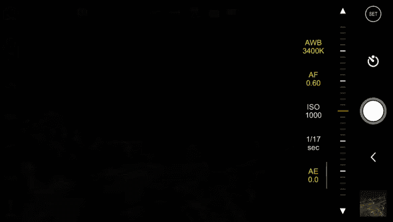
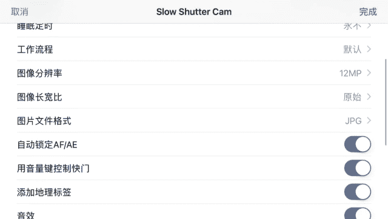

# 1、17手机摄影视频课：第6课：四款拍摄APP的使用教程

OK大家好，欢迎来到我们的最后一课啊，之前也说过了，根据同学们在群里面反馈的一些内容来回答大家的一些疑问。那么在上周的直播，答一中已经给大家简单的演示了在安卓手机。

华为手机上如何手动的去操作我们的手机来进行曝光参数的调节，而不是简单的一个傻瓜相机一样按一下快门键直接拍照这样的一个模式。那么在iphone上我们都知道iphone上是没有这样的一个手动的模式的。

所以我们需要一些APP来实现这样的功能。那么所以说就像我们之前上传到群里的文件一样。我们要使用到的APP分别是codetex啊tex主要用来模拟长曝光的效果。长曝光的效果。

就像我们现在看到这样的一些照片一样，也是车的轨迹，也是流水拉丝效果和云朵拉丝的效果。然后更简单的一点呢是proDRXX我们知道我们iphone上的HDR或者我们其他安卓手机上的HDR都是一个自动HDR。

点开了这个模式之后，它自动拍。但是我们知道HD的原理是通过将三张不同曝光的照片合并在一起，对吧？那么这三张照片的曝光你是无法去选择的啊，如果在手机自带的HDR模式之下，你就无法选择的。

所以你需要精确的控制明暗的效果的话，你就需要像这样的一些APP来帮你实现。不管是苹果还是安卓都需要啊这款APP好像在安卓上是没有的，我们还要继续发掘，在苹果上是可以使用它来替代原来的HDR效果。

最后则是最简单的，之前已经说过了procam也就是用来实现我们在安卓手机上的那些手动曝光调节的一个效果。O那今天由简到难号。我们先来介绍最简单的proca。

然后我们再学习proRX最后再到可以堆栈的tex好了，我们已经进入到procam这样的1个APP了。看起来是非常的复杂。其实我们平时需要用到的并没有那么的多。

首先这是iphone7plus所以你在画面的。😊。

左上角看到了两个按键啊，第一个是我们左上角注意看左上角第一个是调整我们前后置摄像头的那常常我们拍照都是使用后置摄像头，所以不去选按左上角这样的一个转换的标志。

第二个则是选择我们的iphone7plus双摄中的其中一个较大的这个圆圈在上面的这个圆圈呢是我们的广角头281。8那个镜头啊，现在大家看到的画面就是一个比较广角的画面。而我们下面这个比较小的。

我们点按它一下，我们可以看到远处的建筑被放大了，那这就是我们的562。8内置摄像头，它的光圈更小，所以画面更黑啊，焦距更长，所以更放的更加的远。我们仔细看你看这样切换一下就知道光圈更大的1。

8的那个摄像头画面更亮，而且视角更广。而这个呢画面更黑，视角更窄，它是前面那栋楼的一个放大的状态。所以这两个键呢就是我们如何去。切换摄像头。然后之后呢，我们可以看到像AEB啊这样的包围曝光啊。

像HDR这样的自动包围曝光啊之类的这样的一些设置啊，我们是不常用到的。因为这些包围包这样包围曝光这样的功能，我们都可以在其他的APP里面实现更好的调整。所以我们不会去选择AEB和HDR这两个选项。

而反而我们有有TIF和弱这几个选项可以去选这两个呢是指种文件保存的格式pro之所以叫专业相机，也就是它允许我们以最大的格式去储存我们的照片啊，它比JPG大小啊大很多是10倍。

大家也可以看到这样的一个说明已经讲的很清楚了。那给大家解释一下，就是说照片的大小越大画面的质量越好，可后期的空间越大保存的细节也就越多。O因为iphone7开始提供了弱格式。

也就是完全没有被编辑过被修改过的纯粹。会由手机摄像头传感器直接生成的原始文件的这样的一个格式，所以它会更大一些。但然它没有TF大它没有TF大TF也是在编编码过一次的，所以是这样的一个格式。

大家现在可以了解一下TF格式和弱格式，希望能够得到最完美无瑕的后期的朋友可以选择左下角的弱格式啊，希望能够得到一张比较大的照片。

然后用于后期的呢可以选择TF这完全依靠个人的一个喜好弱格式并不是普通的APP就可以打开的。而TF格式呢大多数格大多数的APP都可以打开，但是它会比弱格式更大，若格式要稍微小一点，但是它也是原声无损。

但是打开它的APP就要少一些像这样一些APP可以打开它。所以大家可以自己去选择其中的一个。😊，好了，左边的差不多讲完了，但左下角闪光灯给大家都知道。

可以选择自动或者强制开启或者强制关闭或者当电筒来常亮这样的一个功能。可以看到这样的一些选项的一些区别。但是如果地方太暗，又不想让它闪光的话，你可以开启这个小的电筒的标志。这样的话。

闪光灯会作为常亮灯来展开啊，来一直亮着，所以是这样的一个选择。O那最主要的呢是我们看到的是右边这一排啊，右边这一排右边这一排就是我们之前在安卓里的手动模式或者说专业模式里面可以选择的几个曝光参数了。

首先啊我们知道曝光参数有3个，对不对？光圈快门ISO而在手机上光圈是固定的光圈并不能发生任何变化。所以这在这边我们也看不到光圈的选择。

我们只能看到SO以及下面这个多少分之1这么一个快门速度SEC second就是秒的意思，意思是现在这张照片是17分之1秒。😊。

然后SO是1000okK我们都知道SO越高，噪点越大，拍下来画面就越糊。我们可以尝试拍一张。好，然后可以看到。😊，这样的一张照片有许多的噪点，有许多的一个噪点，尤其是暗部，对吧？非常的清晰，非常的明显。

全是他们是噪点。OK我们来看到刚才拍摄的照片。😊，明显的可以感受到来自ISO1000的折磨，也就是远处的这些噪点啊，建筑的边缘啊，阴影部分的这样的一些噪点是非常之明显的。所以让我们回到我们的拍摄界面。

我们把我们的ISO降低，我们把SO降低，我们慢慢的降低SO我们当然知道SO越低，画面就会越暗了，对不对？因为它对光线越来越不敏感。但是随着ISO的降低，我们使用了专业模式，我们就可以人为的。

增加我们的曝光时间，对不对？我们把曝光时间增加了之后，同样可以获得正常的曝光啊，而且又得到一个比较干净的画面。来，我们把SO降到100，然后把我们的曝光时间延长到这个APP所允许的最长的时间。

也是4分之1秒。对它并不能像安卓手机那样可以长达30秒，它只能有4分之1秒。okK那我们来拍一张试试看啊，按小快门。好，拍好了。😊，点击右下角，我们来看一下这张照片。

不知道你们有没有发现暗部有了非常明显的变化啊，跟刚才那张比起来，这张照片的暗部可以说是非常的干净，并没有像ISO1000那样啊，全是噪点，全是噪点。你看刚才的照片是很不一样的。哎，这是。

之前拍摄的SO1000拍摄的照片看到了吗？暗部细节是这样的，而我们使用SO100拍摄的照片，暗部细节是这样的。所以当我们遇到了夜景啊，无法避免的夜景的时候，我们说怎么样让自己照片画质更好。

首先是降低SO其次延长曝光时间，最后请勿忘记三脚架。三脚架是摄影师的好伴侣，不要跟我讲拿手机拍，我不想用三脚架这种话，没有任何意义。因为这个时候人类的科技就只能支持我们达到达到这样的一个噪点水平。

如果你拒绝这样的噪点，不喜欢这样的噪点，要么你就拿电筒把自己脸照亮，用闪光灯啊，要么你就使用三脚架，保证稳定的前提下让曝光时间尽可能延长，这样SO可以更低一点画面的的一个噪点就会更少一点。

所以建议大家随身携带口袋三脚架。好了，那么讲完了快门和SO的这样的一个设置啊，这样的一个设置，我们还可以讲一些比较简单的东西。第一个是我们的AF也就是我们的所谓的自动对焦。😊。

高功能我们可以用手动对焦来调整我们的iphoneone的一个对焦点，这样保证我们对焦的位置准确无误啊，不会因为黑暗太暗，所以找不到应该对哪里导致拍出虚掉的照片啊，我们也可以。

人为的让他拍出那种虚焦的画面来实现一种很朦胧的效果。比如说像这样，你看平时你要想拍到这样的一张照片的话，你会很痛苦啊。你要用很复杂的操作，才能让画面变得有这么美丽的光斑。

但是你在proAF注意AF这个选项中啊进行上下的一个滑动，你就可以轻而易举的实现对焦点由近到远的一个转化，我们来试试看，然后把它往下走，这样就从最远的无限远变成了最近的一个对焦点。那当然了。

我们知道焦点不在一个物体上物体就会虚掉，就会糊掉。在夜空中拍摄这种没有焦点的失焦的一个照片，就能获得很漂亮的一个光斑。而且由于我们使用了ISO100这样的一个参数设置。

让我们的画面的这样的一些细节也变得非常的干净，没有很多的噪点。这样的照片进行后期一下，就会有很漂亮的一个效果。所以这是关于对焦点的一个选择，关于ISO的一个选择。😊，关于曝光时间的一个选择。

大家也是比较清楚了。那么再给大家感受一下啊，慢速的快门会带来什么样的效果。这也是我们之前很多朋友一直想要拍到的那种车轨的样子。好，那么我们等一下下面的红灯，当它绿的时候，我们看到如果有车经过我们的路口。

那么就会把它整个车灯的在4分之1秒钟移动的轨迹都拍下来哦，有车经过了，我们来拍一张试试看。😊，OK拍摄完成，我们应该可以看到啊，大家可以看到看到没有？这些车已经不是像静止的那种车一样停在路边的样子呢。

是一辆完整的车，而是整个这4分之1秒，它所行驶的距离中，从开始到结尾的整个这一段的运动过程都被拍下来了。那4分之1秒显然是不够看的这样的车轨很奇怪啊，还不能形成一条轨迹。

所以我们还需要下1个APP来完成我的拍摄。那么在结束proca的介绍之前呢，在给大家简单的解释一下最上面这一排一些简单的意思啊，第一个是电池，最右边的第一个是电池告诉你你的手机还有多少电。

第二个呢是储存卡，就像SC卡一样的标志从右到左。第二个啊，第三个呢则是曝光的一个模式的选择。然后之后呢则是一个闪光灯的开启，再一个呢是一个我们照片大小的选择，12mixel也就是1200万像素的分辨率。

大家应该通过。😊，这样的一个模式看得很清楚了。然后右上角有一个sit，右上角有一个sit，通过sit，我们还可以进入到更加复杂的操作选择界面中去啊，我们可以人工的选择快门优先。

可以选择SO优先这样的一些不同的模式，使用对焦峰值对焦实时显示直方图等等，非常复杂的这样的一些一些选项。这个东西呢我们在这一课中就先不去设计它了啊。我们在之后的答疑互动中，有兴趣的朋友。

我们来一个一个的讲解这样的一些使用功能。包括后面还可以看到。😊，他也可以拍视频，对，还可以实现视频的一个拍摄，视频的稳定性、延时摄影等等，非常的复杂。😊，还可以选择语言。

所以我建议大家大家一开始不要去碰这样的一个。一个选项啊，就学会拍摄就可以了。还有一个可以介绍的呢是一个叫自拍的一个按钮。好，点点一下它，你可以选择。选择它的一个自拍的时间，5秒还是30秒啊，都可以选择。

那么有了这个东西呢，你可以用自拍定时就不用在自拍的时候用快门线啊，或者说必须要找一个朋友帮你按快门这样的一个操作了啊，也就是可以一个倒计时。然后你站在那个地方等它咔嚓一下快门。

所以大致大家可以看到proca这个APP实现了我们在安卓手机上才有的手动的操作的这么一个功能，并且可以提供给你一些很多新鲜的玩法。比如说玩出虚焦的画面啊，比如说拍出一点点的小小的车轨。好。

那么我们现在换到下1个APP。好了，我们介绍完了procam知道如何手动调整曝光参数，可以给画面的画质带来如何神奇的变化，以及可以通过对对焦的调节啊，如何实现有趣的玩法，如何实现虚焦的效果。

那么现在呢我们来教大家的是pro hDRX这样的一个APPX跟手机的HDR不一样。😊。

它允许你自动的去啊不对，手动的去选择画面中明暗的不同的部分来实现HDR的合成。好了，我们现在已经进入到了pro hDRXpro hDRX它这名字真的是非常的好口哈，念好几次才能念正确。好了。

来到这样的画面当中之后，我们看到它有三个所谓的box三个这样的一个蓝色的框。我们知道啊HDR这个功能其实就是拍摄三张曝光，不同的照片，把亮的暗都给拍下来，然后把各自有细节的地方。

有意思的部分给它合成起来，对不对？所以你看到这三个框的时候，你应该很灵敏的就能够察觉到这三个框，就是让你选择三张照片，不同的测光点，以此作为一个三个不同的标准来进行曝光。所以这proDX啊的一个玩法。

但是呢在此之前呢还是要给大家介绍一下左边的几个选项。第一个是网格，九宫格这个网格能够让我们更好的构图。就对于新手朋友们来讲，需要通过它。😊，来辅助你找到画面的视觉中心，趣味中心。

更好的去拍摄画面的主体开和关开合关。好，左下角的这个键呢是HDR也就是我们这个APP最主要的一个功能了。那它可以有几种。第一个是你可以关掉R就是有病。

我买了个APP后把它关掉肯定不可能用这个选项对不关掉好，不管它，那么还可以用自动HDR我买的个APP就是为了手动HDR我选自动HDR我差不多也有并。

所以我们一要选中间那个men也就是手动操作HDR那么这也就是为什么会出现三个蓝色的框的原因。那左下角自然是闪光灯了，不用去理它的，所以是关掉就可以了。那么我可以看到来这三个不同曝光的APP啊。

就让我们去选择画面中不同的位置不同的位置，然后来实现我们的一个曝光的合成。首先我选了最暗的地方选一张，然后我在亮的地方又选一张很亮的地方，比广告牌，然后我在一个不。😊，不亮的路灯和竖这选了第三个。好了。

那他现在就会针对这三个点分开进行测光，分开进行拍摄。然后我按这个巨大的快门按钮，真的是巨大。来，我们来按一下这个巨大的快门按钮试试看。一。好，分析好，我们可以看到。

这就是一张通过HDRproHDRX拍下来的一个照片啊，因为是夜景，所以画质也不会好到哪里去。拍完之后会自动生成一张这样的照片。我们可以看到这样的照片跟平时你拿手机直接拍的还是很不一样的。

你看它的暗部的这些地方，这些楼的细节，天空的细节和高光的广告牌啊，路灯啊，车灯都被很好的保留了。唯一的美中不足就是噪点太大，这个实在是没有办法。因为自动挡的曝光，实在是在夜晚中只能有这样的一个效果。

结束之后呢，我们可以在这样的一个菜单中去选择几个选项啊。第一个是调节曝光，也就是你看到最下面右下角，第一个像一个太阳一样的标志。首先你可以调节HDR的程度，拖到最右边是最夸张的HDR这张照片。

你看到高光会被压下去，发现了吗？我从左往右滑的过程当中，高光会被压下去，这样来获得最夸张的HDR的效果。然后第二个。😊，是亮度啊往右是最亮往右是最亮，往左是最暗，可以看到整个画面的明暗也可以调节。

然后最下面的应该是对比度，往左是最灰，整个画面啊没有黑的也没有白的，只有一片比较灰蒙蒙的一些灰接的一个过渡。那我建议大家在调节这个的时候呢是另刻它更灰一点点啊。

我们在step seat里面再去增加对比度，这样可以保留画面中更多的一个细节啊，亮度呢则以不不过曝，不欠爆为宜啊来选择。然后第二个有三个圈，象征着三原色的部分呢，意味着我们可以对它的色彩进行调节。

第一个是它的饱和度啊，我们一玩就知道往左黑白了，没有饱和度的，往右特别的鲜艳啊，就是饱和度的调节。第二个呢则是它的一个色温，你可以看到往左是非常的蓝，非常的冷，往右是很暖很黄。在下面一个是色调的偏移。

色调的偏移则是在绿色和杨红之间进行偏移啊。我们可以看到一个发绿，一个发红发。😊，所以我们在这里的时候也可以对画面进行一些基础的色调调整。仍然建议大家在这里不要调的太过分了。更多的工作。

我们留到后期APP里面去做pro hDRX它只是一个前期曝光的一个APP能够让我们把画面的曝光调节更加舒服，尽量的去保留高光和暗部的细节，它的工作实际上就完成了。那么完了之后呢。

我们可以选择最上面的三个按钮的其中一个直接保存是中间这个按钮啊，按下它照片就已经保存到我们的图库了。然后呢我们还可以左上角直接保出到我们的微信微博或者是乱七八糟的其他的一些平台上去。

也可以通过左下角这个按钮直接保存到我们的相册里，它跟右边的第二个按钮是一样的一个功能，它跟这个按钮是一样的功能。O那么右上角的第三个按钮按一下它就回到我们的拍摄界面，回到我们的拍摄界面。

是这样的一个操作。右下角的加号呢则提供了一些花哨的玩法。大家平时一般不用在这里调节。比如说它可以裁剪。那你说我在step里面也可以。😊，没错，所以我没有必要在这里裁，它还是甚至提供了一套滤镜啊。

不同的一些效果。当然滤镜我们就更加不去使用了很夸张的一些滤镜。再一个呢就是可以加边框啊，不同的一些边框加上去。然后右下角是一输入一个字啊，可以有一个加文字的功能。

当然这些功能其实我们都觉得比较积累在里面都有。所以在这里我们就只提供一个保存键就完成了我们HDR的一个拍摄的一个工作。O那么pro hX这一块APP给大家介绍到这里了，记住那三个蓝色的框。

三个蓝色的box用它们来选择画面中不同的明暗的部分，然后点击那个巨大的快门键来进行拍摄就可以完成我们这个APP的一个使用。O现在我们来到ex我们知道如果我们在iphone上用proca拍车轨的话。

车速度够快，你在一个高速公路上拍是可以的。但是4分之1秒的曝光时间在一个正常的车速啊，😊，大家刚才也看到了只有很短的一小条车轨。那所以说我们要使用堆栈的模式来把一张一张的照片的车轨接起来。

这样就会形成比较长的车轨。于是我推荐的是codetexmtex使用对栈模式能实现两个效果。第一个是能够把车轨连起来，形成一条长的车轨，但它有可能是断的。那第二个更重要的是呢，它能够通过对栈来消除噪点。

这是一个很复杂的原理。在这里呢对于没有摄影技术的同学来说理解起来会比较困难。那我就只简单告诉大家，还有两个功能，第一个是比procam，它能够把车轨拍的更长。第二个它能够把暗部的噪点去除的非常好。

那这个软件很不幸它也也是个全移文的软件。那现在在这里给大家展示一下它的一些操作的界面啊，我们现在已经进来了那软件了，那左上角毫无疑问更简单，前后摄像头的切换，我们拍照肯定是用后置的。

所以也不用管它第二个呢则是我们曝光参数的调节。曝参数的调节有两种，第一种是自动，第二种是高级。😊，模式手动模式adanced中间这个啊。一进到中间这个时，我们就感觉到了一股扑面而来的专业气息。仿佛。

我自己拿了一个什么整流器啊，什么高级的电表啊，什么乱七八糟的那种测试的仪器在手中一样啊，看起来很高级。其实不用害怕不用害怕，只要你学过第一课，你就应该知道这里面内容并不是那么令人恐惧，并没有那么难。

首先ter priority就是光快门优先，你设置好一个快门速度，然后其他的曝光参数随之要调节。其实在手机上并没有其他的曝光参数只有SO我们知道快门越快，SO越高，快门越慢的话，IO也就相应的越小。

很门越慢，它SO就越低。所以在这里呢是这样的一个设置选项。第二个呢就是SO以SO作为我们调整的标准。然后其他呢快门速度会随之而改变。

最后就是menu全手动调节我们的快门速度和SO这两大曝光参数一个控制对光线的敏感，一个控制近光的时间。然后通过手动调。😊，而且呢我们可以实现最好的画质是SO100啊，然后再把曝光补偿调的一个正常的参数。

也就是4分之1秒左右曝光时间。SO100好，调整好了这样的一个参数之后，我们选择右上角的down。好，完成了一个调整。那这个参数呢设置的是每一张照片，单张照片的一个曝光参数。

而我们tex can先进指处就是它会连续的拍摄很多张照片，然后把它们堆在一起，来把其中所有的细节，所有的噪点都排除掉，把所有的细节都挖掘出来啊，合并在一起，并且把所有的车轨都接起来。

那么我们先看一下左下角选择的这个数字就是我们拍摄的张数，拍摄张数越多，整个拍摄的流程毫无疑问就会更加的长。但是画面的可挖掘细节也就会越多。所以这就是一个双键啊，你选择了更多的帧数，比如这是99帧。

就是拍99张，那么你的画质会最好会最好，但是同时拍摄时间就最长。如果你选择的帧数非常。😊，的小的话，那么拍摄的时间就会很短，但是画质相应的没有那么好。所以我平时要想达到最好降噪效果一般会拍35张左右。

像这样的一个天气，像这样的一个时间就这样的一个选择。O选择好了35帧，35frames35张堆战的一个照片的数量之后选择相角的当。好了，万时俱备只欠我们的一个快门键了。

这个很黑的快门键它不像HDRpro xX那么大，但是它很黑，按下快门键进入拍摄模式。下面写的exposure，也就是我们现在正在拍摄啊，拍摄这35张照片啊，拍完之后它会进行一个对战的过程。

我们耐心的等待，所以大家可以看到平时拍一张呢，它要拍35张，而且每张的曝光时间在4分之1秒左右，所以花的时间是非常的长的。😊，Oprosing拍摄完成。

saving to cameraa rule是保存到了我们的照片。我们打开camera rule，大家可以看到这样的一张照片完成了拍摄。刚才的车轨，刚才车开过的痕迹。

在这里有一些轻微的淡淡的这样的一些车的痕迹，就已经出现了。这就是我们的车轨的一个状态。有一点点糊，为什么？因为有一些轻微的抖动？在我们按下快门的时候，画面有一些轻微的抖动。让他画面有一些弧啊，有一些弧。

并不是非常的清晰。但是我们可以看到什么呢？可以看到我们这些建筑的暗部啊，这些细节的噪点的控制是非常的完美。你很难相信这是一种手机拍下来的一张照片拍下来业绩达到了一个极高的画质就是tex的两个功能啊。

第一个是让我们的车轨能够形成这样的一个痕迹。但这样车我知道你会说很丑的的确确很丑，所以说我们之后会推荐第四款APP选择右上角的当的这样的一个按钮回到了我们的拍摄界面。

那现在呢就我来继续给大家介绍这款APP的其他的设置了。我们刚才已经学会了最基本的曝光的调整。比如说通过这里我们可以手动设置我们的曝光参数我们也可以在basic里面刚才是教大家adanced对不对？

adanced是完全纯手动的选择画面优先优先纯手动啊，然后调节我们的曝光。那么我们如果选择basic它就只调整我们的画面的亮度，通过曝光补偿。还记得非常熟。😊，曝光补偿吗？

通过按下我们黄框右边的那个上下拖动的小太阳，对不对？那么在这个APP里面，如果你要想进入一个简易的拍摄模式，曝光模式的话，就可以选择basic，然后直接调整我们的曝光补偿。来家决定画面的明暗。

如果进入 advancedance高级模式的话，就进入了纯手动调节的这么一个选项。好了，那这就是我们曝光调节的全部内容。然后选择画面的曝光的帧数。那我们大家也看到了左下角从时帧到99帧可以选择帧数越多。

画质就越好。然后回到我们的右上角有一个设置按钮，一般来说设置按钮中的内容都很复杂，我都不建议大家去用。那么这边可以看到有几个选项。第一个ins强化我们的阴影。因为在拍摄夜景的时候。

噪点大多数都出现在比较暗的地方，通过阴影强化能够让我们尽可能的降低阴影部分的噪点，这是一个必选的选项。remove motion blur呢是调整我们画面中的一些动态的模糊，这个你可选也可以不选。

在下面一个就是。G和TF也就是刚才已经讲过的，对不对？在呃proca里面就就可以选择这个拍摄的模式，普通的保存GPGTF会更大会大很多，但是它的细节多一点。

可以更好的后期 poch闪光灯是否把它作为常亮的手电筒。然g就是网格，网格你可以打开可以关掉啊，有一个九宫格在后面帮助你最后一个毫无疑问就是一个计时器。那么time打开之后呢。

第一个是可以让你手完全不用触碰到屏幕。没有一丁点糊片的可能在你没有带蓝牙快门扭没有带耳机快门线的时候，使用timer这样倒计时来保证画质绝对的稳定。第二个呢就是自拍咯。

使用time你可以按下快门之后走到拍摄地点带它来开启快门，所以有30秒和5秒两种选项，倒数第二个的 lens镜头的选择则是专门针对iphone7plus的用户，你有没有两个镜头，所以你可以选择长焦。

你看下这是一个长焦镜头选择w angle广角镜头对于这枚长。焦镜头可以说意义非凡。因为我们知道iphone7plus长焦镜头的光圈只有2。8。那么在夜晚当中，这个比1。8小了很多的光圈会拍出更多的噪点。

所以使用这款APP搭配我们的长焦镜头，通过多张对战的效果来进行降噪也是非常重要的。所以说tex cam的降噪功能，对于iphone7plus长焦摄像头意义重大。最后则是我们可以进行两种拍摄的选择。

一个是使用video啊，用我们的录像功能拍摄，然后对战。第二个呢就是用我们照相机的ro进行对战。当然这个看大家自己的选择了，我都建议使用弱进行对战，然后普通的选择w angle广角镜头进行拍摄。

当然需要拍摄叫长焦的时候，我们也可以使用右边这个telephoto这样的一个选项来打开我们的iphone7plus的长焦镜头，然后呢再通过对战来降低它的一个噪点。

那这就是整个cotexcam的APP的使用方法。好了，那么这就是刚才讲到的cotex ca的。😊，几个功能主要是通过对站来提供一个夜景降噪啊，还有一个呢就是通过堆站来形成一个车轨。

那这个车轨呢是说实话是比较水的，比较简陋的那有没有更好的拍摄车轨APP呢？那么在之前呢为了减减轻大家的学习负担啊。因为确实这三个APP要完全精通熟练也是很需要时间的。为了减轻大家学习负担呢。

我就没有再提供更多的一些选择。而且还有一个问题，就是IOS系统的这个生态实在是太好了。所以它里面的APP号如烟的海几千款拍摄APP很难去寻找一两款比较优秀的。那么在学有余力的前提下。

因为大家的水平也渐渐提高了，对不对？那么我会推荐大家使用这款叫做slow shutter的这样的一款APP啊，它在APP store里面叫s shut付费12块钱也不贵，点不到一个菜啊，买杯水都买不了。

所以这样的一个价格是s shut的。那么我们来看一下slow shut如何实现更加精致。美丽的车轨的效果。首先这一个界面真的是今天晚上这节课大家见多了哈，大同小异，什么都有。但是基本上呢也都是这样子啊。

我们看到左上角无非是一个前后摄像头的转换，不管它永远不管它。然后WY把它切换成我们的t tell那么这个是iphone7plus上特有的一个广角镜头和长焦镜头的一切换，因为它是双摄，然后是AF啊。

也就是自动对焦锁定。那你选择一个地方了之后呢，你把它锁定焦点，就保证在这个黄欢呢也不会在自动的，因为比如说前面出现一个手啊，或者因为其他什么奇怪的东西而影响对焦点AE也是一样的。

auto exposurelook，也就是自动曝光锁定。你看刚才我的手经过的时候，会有一些其他的曝光变化。现在完全没有了，画面纹丝不动的一个明暗程度，所以这两个按钮呢是用来锁定曝光。😊。

值和锁定我们的对焦点，选好一个曝光值，觉得画面的亮度满意了。选好一个对焦点，觉得画面清晰了。那么请按一下这两个按钮，保证你的画面中出现任何其他的东西都不会影响你的对焦和曝光，这很重要啊。

现在就处于一个锁定状态。这个眼睛呢就是让左上角出现一个小的监控窗口。这个窗口能够看到当前摄像头拍到的实时画面。因为我们在进行长曝光的时候，画面会出现一条又一条的很多的很奇怪的车轨。

所以它提供了这样的一个监视窗口，让你看到实时的看到当前摄像头拍到的画面是怎样的。左下角毫无疑问，也就是我们最熟悉的一个灯的一个功能，打开它和关闭掉它，就是提供一个照明。而右上角呢是我们的非常复杂的拍摄。

一个参数设置，首先是自拍老规矩，只要是设及车轨啊，长曝光的这个东西都会允许我们设置一个自拍间隔，要么我们没有带快门线，怕抖动，我们可以设置1到3秒的一个自拍。要么我们在自拍，比如说玩我们的。😊，光会啊。

拿几个手机的电筒啊，拿几个光绘棒在空中画的时候呢，我们需要提供更远的自拍间隔，更长的自拍间隔。让我们啊把相机设置好之后，站在相机面前开始绘制，是这样的一个功能，定时间隔的拍摄，当然就是设置啊。

每隔多少秒拍一张，每隔多少秒拍一张，目前是把它关闭了。如果说你要想玩一下这样的一种间隔拍摄也是可以的，之后呢是睡眠的定时定多久，它会进入睡眠呢？通常的是永不睡眠。工作流程这个会负杂一点点。

它会允许你自动编辑，允许你自动编辑的之后再清除掉之前的那张照片，或者自动保存在清除，就可以选自动保存在清除，就是我建议大家选择的。当然默认也可以没有问题。

图像的分辨率当然选择最大12mapixixel1200万像素，或者是啊上面这种60PS啊，这样的一个选项，这是一个帧数的问题。30FPS就是每秒拍30张，然后每张都保证。有1200万像素那大。

相当于是4K的分辨率了，选最大就好之后呢是我们的图像长宽比原始照片拍下来是多少就是多少，这是获得最大像素的一个选项。图像文件格式画质越好，图片越大啊，通常选择GPG然后自动锁定打开啊。

自动锁定打开音量键控制快门也允许因为长曝光这件事情总之是很怕抖动的。哪怕你按下快门那瞬间的抖动也会让画面糊掉，所以说用呃音量快门键，这也是允许我们通过音量来远离触碰手机这件事情音效啊提示啊。

然后显示地理标签都可以增增加上去，实在不行，看使用说明好了，完成了这样的一套配置之后呢，我们就可以开始我们的拍摄工作了。那拍摄呢有很多模式可以去选择，所以这也是个P很复杂的地方啊，有动态模糊的选择。

所以动态模糊也就是白天拍流水，白天拍云朵的这么一个选项模。

度从大到小可以选择他们速度可以从30秒到闭门。所谓闭门，就是你不关，它就一辈子拍下去，拍到天荒地老，拍到没电为止，也就是手动操作曝光时间，也就是所谓的闭门，大家会提示你啊，对，要关掉睡眠定时啊。

启动睡眠定时你才可以使用闭门拍摄。因为如果你闭门的时间特别长的话，有可能就直接睡眠了。然后SO也是可以选择的SO当然大家都知道SO越低画质越好。但是如果太低，画面会很暗。

所以我们要选择一个比较合适的SO的值。那今天要讲的车轨就是灯光轨迹喽。灯光轨迹。顾名思义啊，需要我们拍摄到流水一般的车的灯的痕迹。SO涉及到一个你满意的画面亮度为止啊，太高，噪点很厉害。

大家可以看到太低画面一片漆黑，自动也有可能噪点太高，所以我们选择一个可以接受的最高值，比说250这样子一个非常吉利的数字。然后同样的快门速度也要我们自己用手去选择。

你可以选择从最小到8分之1秒4分之1秒2分之1秒一秒。当然了，我选择报车轨当然是越长越好，甚至完全手动控制都可以O这里我选择一个闭门啊，告诉他闭门是什么。就是你按下快门，你关闭快门。

完全由你自己手动来操作快门的这个一个开和闭，所以说选择个闭门，我们来拍一张试试看啊，按下右边通边啊这样的一个像光圈一样的快门键。你看今天用的4个P的快门键都不一样。

按下之后我们可以看到发生了一些很有趣的现象啊，我们这个画面当中的这些车移动的车辆开。只在画面中拖出自己的轨迹了，你仿佛看到一条光带，在画面中行进，哎，开始移动了，开始过街了。

那么这样的一些车辆呢就会在画面中形成他们自己独有的轨迹，这就是使用slow shutter can这样的APP来拍摄车轨的全部操作流程。当你觉得当你觉得这个车轨多的差不多了。

因为我们知道一个晚上一条接口可能会过几百辆车，那如果你报一个晚上呢就是完全一片死白。比如说我们左上角的这个猎车大道，它已经是接近死白了。所以你要看清楚画面，就差不多时要及时关掉，及时关掉我们的拍摄啊。

这样的话才能够保证我们的车轨不不至于粘成一片啊，也不至于断掉太短，完全手动的操作我们的车轨，这是比较好的一个一个东西。那我们再来看一下就下面的操作，我们再试一张好按播放。你看到出现绿灯了。好。

我们就有一辆一样的车在过我们的马路就能够形成这样非常。漂亮的痕迹。那同样你说老师可不可以用这个来光绘呢，当然可以啊，你要想跟你的女朋友表个白，你要想在一个荒山野里留下自己的一个签名，一个印记。

你当然可以使用slow shutter cam这样的一个功能，配合我们的自拍倒计时，对不对？配合自拍倒计时来拍摄我们的光会O你看刚才发生了轻微的抖动，所以画面就糊掉了，再拍使用这样的一些功能。

slow shut ca要长曝光的时候，一定要记住使用三脚架，而且画面一定不能抖动，刚才不小心碰到三脚架，画面就出现了很明显的抖动，O拍摄完成。

那么这就是slow shut cam来拍摄车轨的这么一个玩法。O那么更多的功能也需要大家自己去探索去研究啊，怎么样把它拍的更好看。那么我也会在群里面进行相应的一些活动。大家可以来参加。😊。

