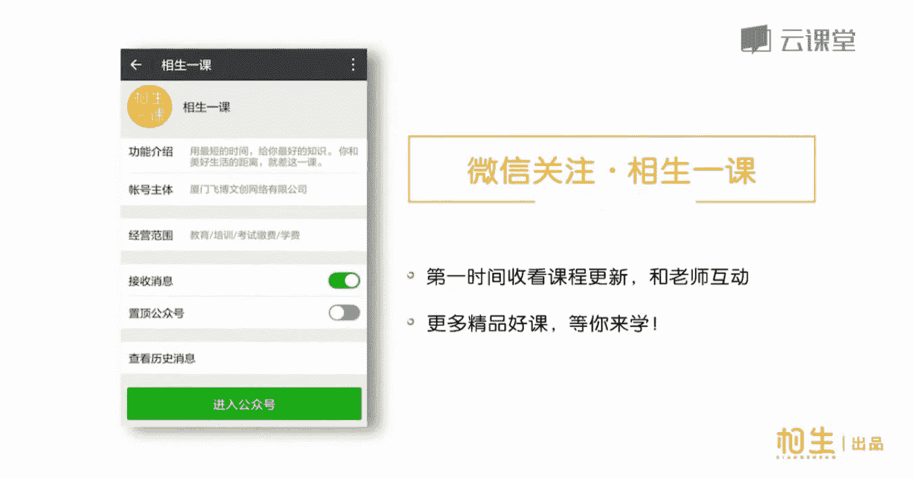

# 1、18手机胜单反：第七节、十招轻松拍出美食大片，整个朋友圈都饿了

🎼第一招。🎼尽量在光线充足明亮的地方拍照，最好呢是靠近窗户的光源。🎼如果我们在餐厅里面吃饭，想要拍美食，建议大家尽量选择靠窗户的一个位置。因为窗户这边而接近我们的一个自然光源，所以拍摄出来的照片。

它本身的光线质感会好很多。如果你是在室内偏暗的环境靠近里面，它光源会是呈一些暖黄色的灯光。这个时候实物拍出来就会有一些偏色，可能就偏黄或者是偏冷色，所以我会喜欢挑选靠近窗户的地方座位，提前去占位。

🎼第二招，当地特色美食纪念照，这样拍更fashion。🎼这是杰克的一种传统美食。🎼用特制的面粉发酵后的长条形面团一圈圈的卷在长棍上烤制而成，裹上颗粒状的双糖以后，放在炭火上烤制几分钟就可以吃了。

如何将类似这样的当地特色美食拍的与众不同呢？🎼显然，这样随意拍摄是不行的，背景凌乱。🎼当地特色美食拍摄的正确打开方式是这样的。🎼寻找漂亮的背景，比如店铺的招牌，调整位置。

尽量让拍摄角度与背景面板保持垂直平行，又或是用当地的特色建筑或街道作为食物的背景。🎼第三张只拍一款美食的时候，记住这些诀窍，构图采用中心点构图，将一盘美食放置于画面最中间。🎼比较推荐采用饱满构图。

尽量让整盘食物充满画面，但也不能太拥挤，画面至少保留餐盘边缘。🎼第四张大部分实物拍摄的最佳角度是。🎼通常拍摄实物采用俯拍的视角，保持30到45度的角度拍摄。

🎼这个角度适合大部分食物都能拍出诱人的美食大片。🎼第五招，部分食物采取特殊拍摄角度。🎼饮料、蛋糕、冰淇淋等有立体感的食物，有时候采用平视角度拍摄更加合适。把手机直接就是这样放在桌面上。

或者就是这样的一个呃角度，这样的一个角度去拍摄饮料。那它的层次整个的颜色都会展示出来就会更好看，拍出来的实物就会更加诱人。我现在先选用还是人像模式，因为它可以虚化背景，我们的背景是有一点凌乱的。

但是呢现在大家看到这个整体它会有一点偏暗。因为我们这里属于一个背光的拍摄。所以在我进行对焦锁焦以后，画面里面你看到右边有一个黄色的小太阳。我们现在可以把小太阳，手放在屏幕上。对完胶锁完焦以后，然后当时。

Yeah。黄色的小太阳，我们给它往上去拉调整。像现在这样的话，我们光线就亮起来了。进行一个拍摄。好，看一下效果。发给我。🎼虚化背景后，让主体更突出。🎼适合平视角度拍摄的食物。

有这些冰淇淋、透明玻璃杯瓶装的饮料。🎼马卡龙除了可以采用45度角拍摄之外，也可以采用平视角度将马卡龙摆放成如图所示，利用室内环境的光源虚化成光斑作为背景。🎼第六招，整桌的食物更适合俯视平拍角度。

一定要端屏手机，让手机与桌面保持平行。

🎼桌面上东西很多的时候，甚至需要站起来平举着手机拍摄。第七章加入手的元素，让食物的照片有互动感。

🎼拍摄前整理盘内食物形状，与盘边食物残渣。🎼，🎼旁边有食物残渣，影响美观，让照片看上去不干净。🎼所以想要拍出好看的美食照，不仅要摆设食物，还需要擦干净脏掉的盘边。🎼还有一个。🎼现在盘边有被我们蹭脏掉。

但是拍出来的话就非常的不美观。所以我们需要把盘边给它擦干净。完。🎼第九招，利用小道具装饰，让画面摆脱单调更丰富。🎼我现在如果是要拍全景的话，就需要你自己还要稍微摆设一下，摆设一下我们的这个菜品。

那可能自己还需要加一些我们的装饰物。因为可能它这些盘子方方正正都会比较单调，而且缺乏背景的话，有些时候你就可以还有把这个菜单或者是他们的酒店的一些呃这样的一些小菜单，比较好看的颜色。

我们可以也给它作为一个道具，给它放在这个桌板上作为一个装饰。摆盘也是相当的这个重要啊。摆盘。在。那背果的话可以稍微揭开一点点。拍全景尽量采用一个也是俯拍的一个角度去拍摄它。🎼呃。

同样也是可以加入手的元素啊，那您可以自己假装这个要端杯子。但是如果是有第二个人在旁边帮你来操作，就是假装在切某一样东西的话，你采用这样一个角度拍摄可能会更好。🎼手机一定要端平啊，平拍平拍的一个角度。

🎼因我。这样OK了。🎼那我们来展示一下刚刚拍摄到的一个画面，采用这样的一个俯视的角度，而且桌子角可以作为一个切割画面的，让画面显得不那么呆板。我们的这里手叉叉子有进入画面，但是最好是能一整只手进入画面。

两个人来完成这样一幅照片会更好。🎼这两个就是我们自己有家的一个装饰物来平衡画面的，就是用一些其他大小不一样的一盆小植物，或者是这个小的传单来作为一个装饰。餐厅小卡片做点缀装饰，银镜片餐店作为背景装饰。

绿色的复古菜单做点缀装饰。🎼第十招，一款适合懒人的相机app，自带滤镜，让美食更诱人。下载footie软件。

🎼打开福底软件，挑选喜欢的滤镜款式。🎼可以从最下面的名称菜单选取滤镜，也可以直接左右滑动屏幕，切换不同的滤镜。🎼The。🎼あ。🎼用上这十招拍摄美食，整个朋友圈绝对都饿了。

