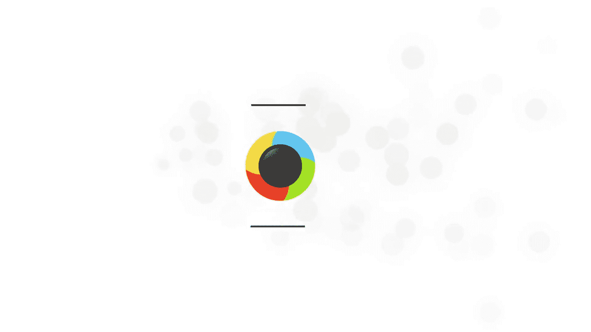

# 1、19小北摄影课（完结）：第10期：12期之第10期：拼图排版APP攻略

嗯。🎼hello，大家好，欢迎来到小北的手机摄影课堂。我是想和大家一起帅三代美三代的小北，欢迎大家和我一起学习手机摄影。这节课是我们的第五节P图课。我将教大家如何进行图片排版。

如何用手机排出精美的杂志效果。以前当我们小时候习惯于用日记记录自己的学习和生活。而现在随着智能手机的普及，我们不光能写字了，而且还可以用精致的图文去记录生活的点滴和精彩瞬间。未来的某一天，当我们回看时。

这些精美的图片日记，一定是我们最宝贵的财富。首先我要推荐大家一款我非常喜欢的APP叫做17，它可以记录你每天的生活可以插入图片视频，甚至最终你可以制作出一本属于自己的生活志。😊。

🎼好的，我们点击进入17。🎼这款软件的界面非常的干净，是黑白系的。呃，底下有4个菜单，我们一个一个来看。🎼首先我们先看一下它的样书事例。🎼他这里有。🎼几种不同风格的书籍的事例。

比如说这里有一个我的旅行日记，我们点击进入，其实它就是一本书。这个所有书中的内容你都可以自定义的。比如说标题啊，作者啊，还有这个封面的图片都是可以自定义的。好，我们翻开第一页写的是我的旅行日记。

然后谁谁谁作者，然后时间。🎼还有一个头像，这个头像其实就是你上传的那个头像。好，这是作者页。然后这里有一个呃关于什么出版字书页数的这个介绍页，这都是它自动生成的。下面就是重点了。

重点就是说呃这里大家看到这有一个时间。这个时间就是可能就是2015年9月30号，你写的这篇日记。然后呢，通过时期它自动生成了，就是把你所有的日记放到了一起，生成了一本你的旅行日志。

🎼所以这里我们只需要做的就是每一天更新一篇日记，然后用时7自动生成一本属于自己的图书，我们再换一本。🎼比如说小青的朋友圈，作者小青。🎼好，依然还是作者叶。🎼然后就是一个时间。

这本书的风格是大概是这样的时间，然后你的文字，包括你的图片、时间、文字图片。🎼好，其实非常简单。那么下面我们就来自己制作一本属于自己的书。好，我们看到这里有一支笔，写下生活一键成册，我们点击。🎼嗯。

很简单，只需要选择一个标题，然后底下输入你的文字，呃，这里可以插入图片，我们一步一步来。因为时间有限，我就直接插入一个图片好了。先。🎼插入一个。🎼比如说这张图片好，我打勾。🎼好，这张图片就插入进去了。

🎼那我来粘贴一段文字好了。🎼我整天一段。🎼我粘贴一段重庆森林的文字，那我这里标题打上。🎼重庆森林。🎼好。🎼这样的话我们就生成了一篇比较简单的，有标题，有图片，还有文字的书了。我们点击保存。

🎼这篇日记就已经存下来了。🎼好，我们还可以再次点击画笔，再写一本日记。比如说我这里再插入我插入三张图。🎼我的小狗的图。🎼好。🎼好，插入图片之后还是一样，我可以加一点文字。呃。

时间关系我还是随便粘贴一段文字好了。🎼好，嗯，标题就叫做宠。🎼古日记。🎼好，这里我点击保存就可以了。🎼这篇宠物日记也保存下来了。🎼为了演饰方面，我再写一篇不同风格的，这里我就快速的操作了。🎼呃。

这一篇我就叫他。🎼这篇叫做旅行。🎼日记。🎼好，啊，同样也是粘贴文字，点击保存。🎼好，这样我们就制作了三篇日记。那么我们如何把这三篇日记变成一本书呢？🎼首先我们要点开一篇日记，然后点击修改。

在这里我们有一个添加制书册，我刚才没有选，其实我们每一次写完一篇日记之后，可以选到一个它适合的地方。比如说这一篇我就选到生活杂技里边，点击确定。🎼好，这本书就进入了生活杂技里边，那这样有什么用呢？

我们点击保存，它就会提示你是否将本篇文章同步至生活杂技，我们点击确定。🎼okK呃，这里我们再找到右下角的书架。🎼书架里你会看到有一本生活杂记的书。🎼当我们点击进去之后。

你会发现哎它自动生成了一本生活杂志的书，作者是小北。🎼然后跟刚才我们看到的示例书很像，也是头像、名字，还有作者。🎼还有这个介绍页，然后有一个目录，目录只有001，重庆森林。

也就是只有我们刚刚添加的这一一页书。🎼好，我们看到是不是我们刚才加的。🎼好，就是我们刚才所制作的这本书。🎼那么我们可以再次把下一篇，比如说宠物日记，我们也给它修改。🎼添加至书册。🎼生活杂技确定。

🎼然后保存。🎼好，这样的话我们再次进入生活杂技。🎼好，依然是哎我们发现有了宠物日记。🎼好，我们往下滑往下滑。🎼好，这样其实我们每一天写完日记之后，我们都会同步更新到这本书里边。

那么你可以随时的翻阅你的日记，这里进入目录，你可以直接快速的跳转到每一天的日记，我跳转到宠物日记。🎼那它就直接到了这一页，所以非常的方便，这是我们日记的方式。另外还有一种方式。

如果你说我每天没有那么多时间去写日记，我每天都是发朋友圈或者发微博。那么这个软件非常强大的一个地方在于我们点到这个制作里边，它有微信书，有微博书，有豆瓣书，有QQ书。我们以微博书为例。

当我们点击微博书的时候，它会让你登录。这个时候我们只需要登录自己的微博登录之后，它就会在书架上生成一本有你的所有微博内容的一本书。根本就不需要我们再重新写。好，这是我刚刚为了节约时间自己生成的一本书。

大家可以看一下，所有的东西你都可以自定义。比如说封面的。🎼标题啊，还有封面的图片呀，还有作者啊，所有东西你都可以定义。🎼好，我们往右滑动。🎼啊，这是我的微博头像，它自动变成了作者的头像。

🎼然后注意从你的第一篇微博开始，我的第一篇微博是16年。🎼好，这是第一篇。然后包括所有的时间，还有你的文字，还有你的图片全部都被保存下来了，而且全部都是自动生成的，根本不需要我们自己再去做任何的操作。

你还可以向右滑动。我大概发了有200多篇微博。那么它可能也就花一两分钟，就所有的微博全部变成了一本书，这里你还可以点击目录。你可以看到呃每一个时间段的微博，我跳转到最新的，比如说2017年的。🎼好。

这是我们最近发的一个微博。🎼好，这是它非常强大的一键生成微博书，一键生成微信书。有了这个APP我们就可以记录自己的生活点滴，记录自己的旅行日记，记录自己的读书笔记等等。这些珍贵的记忆，多年之后。

一定是我们最宝贵的财富。接下来这款APP不是拼图，而是可以帮助我们切图，它是一款能够将一张图片拆成九宫格的软件，操作非常简单，而且有多种模板供我们选择。

🎼好，我们点击进入九格切图。🎼这里有一行字，美图秀秀荣誉出品。🎼我们点击下边的按钮，打开一张图片。🎼那么随便选一张，比如说这张图片。🎼9张图片九格已经划分好了，那底下是一些特效啊。

比如说我们点击复古特效。🎼然后它的特效效果一般，所以我不太经常用。但是它有一个好处，就是说你点击一次，它会自动随机的给你套用一个特效，你可以再次点击。🎼再次点击之后，他会把这个特效换掉，随机的换位置。

🎼比如说这个LVE。🎼它本来是LOVE这样排列，如果点一下它就换了一种方式。🎼可以选择一个你比较喜欢的方式，我一般不太用底下的这个东西，感觉有点奇怪。好，除了底下的这种滤镜特效以外，嗯，它还有一个功能。

就是说左上角有一个形状，我们可以任意的去选择你喜欢的形状。比如说选择一个圆形，那它就切成了一个圆形的。🎼我选择苹果就变成了苹果的形状，呃，非常简单，那情侣一般可以使用这个爱心。好。

当你拍了一个比较文艺的情侣照，然后你把它切成心型的形状发到朋友圈，肯定比你直接简单粗暴的发秀恩爱的自拍会好很多。呃。如果你觉得这样OK的话，我们就点击保存。然后它会告诉你，请按1到9的顺序分享这批照片。

即可有如下效果。呃，其实我们分享到朋友圈的效果，就是我们切图的这个效果。好，这款APP是美图公司出品的叫做海报工厂，它拥有杂志封面、电影海报、美食菜单旅行日志等超多海报模板。

🎼好，海报工厂这款APP也是非常的简单。我们点击开始制作。🎼然后随意添加几张图片，我就添加这两个孩子的照片，然后开始制作，他就套用自动去套用了模板。🎼然后底下有三个选项，清新时尚简约。

我们随便选就可以了。🎼好啊，所有的都是一键套用的。🎼呃，同时呢你可以拖动这个。🎼这张图片往这个大图上拖，他俩就可以换顺序。🎼改变位置。🎼好，这都非常的简单，这里我就不再多说了。

那么如果你觉得这些模板满足不了你的要求，那么们点击更多素材，那就会发现哇，好多好多的各种各样的海报模板。嗯，你喜欢这个的话，点击一下，然后点击下载，然后马上就可以使用。那就马上就套用到了这个效果。嗯。

同时其他的也是一样，都是一键套用。🎼我再换一个，比如说这张。🎼点击下载点击使用。好，嗯，比如说这一个模板下我要做一些其他的改动呢，比如说除了更换顺序以外。🎼我还可以调整这个图片，让它出现在哪个部分。

🎼比如说他默认的可能是两个孩子没有出现全，那我只需要拖动一下，把孩子放在中间就可以了。那么另外我还可以通过单击，它还可以为这张照片添加一个滤镜效果。如果你懒得去P图，比如说你拍了很多很多的照片。

一天下来呃，你想拼一张图，那你又不想一个一个去修，那只需要呃比如说我们全部都套用M3的。🎼滤镜，那你的照片风格也会比较统一。🎼好，这是海报工厂，它就是这么的简单，我们可以随便的。🎼更换模板。

最后选择一个你喜欢的，点击保存就可以了。🎼好，这款软件我就说到这里，大家可以有时间的话自己去实践一下。🎼接下来是一个比较文艺的APP叫做留白，它更像是每天记录一段自己的内心独白。

以一张张优雅的留白照片记录平淡生活的精彩。🎼好，我们打开留白。🎼我们先不着急自己写诗，我们先看一下别人是怎么写的，我们找到广场，在广场里边我们可以看到。🎼其他用户上传的一些图文。

🎼这个排版非常精美的图片就是使用留白制作的每日意图，你可以轻松的把它下载下来，或者是分享到朋友圈。🎼好，看过了别人的图片，下面我们来自己制作。首先点击加号。🎼选择一个模板。🎼它的模板都非常的简洁。

基本上就是三行文字配合一个图片，我选择居中的好了，然后点击下一步。🎼我们点击相机。🎼接着我们就可以在相册里选择一张图片。比如说这一张插卡盐弧的照片，它可以选择比例。🎼我就选择1比1好了，打勾。

🎼打勾之后你还可以添加滤镜。呃，但是我觉得这种调色操作我们还是放到专业的调色软件里进行。还有其他的这些这些我就不用了，点击下一步。🎼好，这样我们的图片就已经插入进去了。那么接下来就是为图片插入文字。

我们点击文字部分。🎼好，就可以输入自己想要写的文字了。🎼我随便写一些好了。🎼我写哥，你好。🎼Youubai。🎼好，我就写这两行文字，然后打勾。好，这张图片就是我们刚刚用留白制作的。

那么留白还非常适合制作黑白风格的照片。🎼比如说我们换一个模板，选择这个模板，我们插入一张黑白图片。🎼我从相册里选择这张图片。🎼呃，我们可以换一个比例，我换成这种4比3的比例。🎼好，点击下一步。🎼啊。

文字内容也是随便写，我就随便打了。🎼整个过程可能不会超过30秒，我们可以使用留白每天生成一张精美的图片，然后与刚才制作电子书的17APP结合，制作出属于自己的最精致的回忆。🎼下面这款APP叫做简拼。

人如其名，操作简单，只需要几步就可以拼出自己喜欢的图片。

🎼我们点击进入简拼APP。🎼好，它的首页有非常非常多的各种各样的模板，可以让我们选择还有这种特殊风格的滑动解锁，类似锁屏的这种。🎼好，我们随便点一个点击进入。🎼好，进入之后。

我们看到下边有一排简约便签封面拼接长途、名片、明信片等等。🎼它不同的类别对应的是不同的风格。比如说长图里边，那就非常适合这种化妆教程啊、穿搭教程啊这种呃一张图片配合一段文字，一张图片配合一段文字。

可能这张图很长，所以这种是可以做那种杂志效果的。🎼好，其他的比如说还有一个比较有特色的是封面。那封面的话有点类似于这种海报。🎼有点类似于这种时尚杂志的封面啊，这些的话也可以非常适合人像。

就是比如说你拍了一张很好看的照片，你可以把它作为封面啊，其他的比如说名片啊，名片这种是适合加二维码加联系方式，或者是作为自己的一个。比如说这个摄影师，他通过剪拼制作了一个含有自己头像啊。

还有一些个人经历，还有二维码和作品的一个链接给别人。那别人可以通过这张图片，快速的了解这个人，并且取得联系方式。🎼还有明信片啊这种好，这里我就不再演示了，我随便找一个好了，我找一个简约里边的。

比如说这个旅行的吧，旅行主题的好，那我就选几张旅行的图片。🎼呃，一张两张。🎼三张4张。好，我选择4张图片，点击下一步。🎼代步之后，那这个就已经自动套用了。🎼我们可以随意更换位置。🎼好。

那我们可以选择这个背景的颜色，包括背景的花纹。🎼好，这个就凭借你的喜好吧，这里我就不再演示了。其他的。🎼模板也是大同小异。🎼啊，我们再换一个好了。🎼我们换一个明信片。🎼好，明信片的话。🎼那就这一张好了。

🎼嗯，我们随意挑选两个。🎼这个和这个反差比较大，点击下一步。🎼哦，这这两张拼起来有点奇怪。那如果有问题的话，我们可以选择这个换一张图片。🎼我还是换成这种蓝天的好了。🎼好。🎼然后再换一张这个。🎼好。

这样这两张图片还算比较合适，比刚才的要合适很多。好，这里我就不再演示了，简拼其实很简单，而且功能也很多。大家可以根据自己的需要去使用它。🎼说到拼图模板，下面这款APP是我见过的拼图模板最多的APP之一。

有选择困难的同学，最好不要打开它。🎼う。

🎼这款软件的模板多到令人发指。下面我们就来一起看一下。首先它分为了拼图和杂志。🎼那么我们点到拼图里边。🎼大家可以看到各种各样的不同类型的拼图模板。🎼然后你就划吧，一直是非常非常多。

后边还有高级的拼图木板，这个是需要买的，不过价钱也不贵，大概10多块钱可以买100种。🎼好，这是高级的那就是光基础里边就有180个各种各样的模板。我们比如说随便挑一个就它了。

🎼然后这里边你就可以呃按到这个选择一张图片，插入张图片就可以了。这里我就不再演示了。🎼那么这个是它的基础基础模板。🎼它还有一个杂志模板，杂志模板里边也是非常的多，有100种各种各样的杂志模板。

比如说刚才我们看到的简拼里边是一些简单初级的这种海报啊，或者是呃这种长图。那么它这里边就相对于是那种杂志级的排版，就很精美。你可以用它做任何的事情，随便打开一个好了。打开这个模板。

🎼你就可以看到它已经把版式固定好了，我们需要做的就是按此插入一张图，按此插入一张图。好，直到把这张图插满，然后导出就可以了。这里我就不再演示了。如果你觉得刚才那些简单的APP满足不了你的要求。

那么你就可以试一下这款软件。🎼如果你看过了太多的拼图模板，挑的眼睛都花了的时候，可以试试这款由instagram公司制作的APP，它也许就是为了简单而生的。

🎼好，上面一款APP的模板非常非常的多，而下面这款刚好与它相反。🎼打开之后，你几乎看不到它的模板在哪。那么我们随意选择4张图片。好，上边就会出来了它所有的布局模板，总共也就这几个。

🎼而且是非常非常基础的一些模板。这个其实就是从上到下并排排列。那这个就是1234并排排列。那它有一些简单的功能，几乎简单到不能再简单。第一个是替换图片，也就是我换一张图，第二个是镜像。

我把两个人的位置换一下。🎼好，其他的也是只是上下翻转，还有最后生成一个边框，就是这么简单的纯粹，也正是因为它简单，所以非常适合拍完就用。我拍完直接就拼好图。然后分享到朋友圈就可以了。除此之外呢。

这个软件它还支持一张图片的拼图。比如说我选择这张图片。那我们看到上边它还会有很多很多的拼图方式。那这个是其他软件所不具备的。比如说最后有一个这个直接就是做成了9张。

🎼然后还有这种它可以直接把人变成这个样子。那结合它的镜像功能，你还可以玩起来玩出很好玩的效果。🎼好，这里我就不再演示了，这款软件非常适合即拍即用，有兴趣的话，大家可以去尝试一下。

下面这款APP除了滤镜调整拼图排版功能以外，还有超多各式各样的边框可以修改和套用。

🎼好，我们点击进入。那它的主界面就是直接让你选图片，而且这个时候选只是选一张图片。呃，我就选这张图片好了，选完之后它会让你去调这个滤镜啊，还有其他的东西。我们不管它，我们点击这个第二个拼贴。

比如说我要添加4张图片。那我就选择这个4张的模板。然后双击加号键就可以加入下一个。🎼双击加号键加入下一个。🎼再双击。🎼好，我们再挑一个。🎼调一个这个吧，呃。

这个软件的好处在于它可以精细化的调整每一个组成部分。比如说我这张图，因为我加了白框，所以它显得很小。那其实可以选到这个里边，然后双手拖大。🎼把它拖大。🎼然后和这个整体的风格统一。

那么另外它还可以精细化操作到我可以为这张图片添加一个滤镜。那么这个其实其他软件里边也有它的厉害之处在于它可以针对每一张图片进行亮度啊、对比度啊、饱和度啊等等一系列的调整。比如说我选择这张图片。

比如说我把它的亮度减一，然后打勾，这里还可以增加它的饱和度。如果你觉得这个添不够蓝。🎼好，就是可以针对于每一张图片进行细致的调整。🎼那么这个其实也是很方便的一个功能。这样的话我们可以拍完图片。

直接导入进来。好，这个是它针对于每张图片的调整功能。另外它还有一个非常酷的功能，叫做叠层。那叠层是什么意思呢？比如说我们随便给它选一个。比如说我们添加一个这个叠层。那就它统一为照片加入了这样的一个特效。

🎼还可以添加其他特效。🎼那么这个东西它同样可以进行精细化操作。比如说我觉得这个特效放第一张图不好看，我就可以恢复它。🎼这张图不好看，我恢复它。如果我觉得这张图适合这个风格，我就给他选择一个这个叠层。

这张图适合这个风格，我给它换一个叠层。好，我觉得这个叠层不是很好看。🎼那其他其实它有很多好看的一些叠层，你可以叠进去。比如说这种。🎼黑白的可以为你的图片增加质感的。🎼啊，我的图片因为统一都太亮了。

所以不太适合这个往上再叠东西。比如说这种暗调的图片再叠一种有质感，有纹理的东西的话，会显得非常的好看。好，这里我就不再叠加了。那么接下来它还可以添加文本，还有各种各样的字体供你选择。

比如说我可以在中间加入一些文字，这里我就不加了。啊，继续就是贴纸。🎼那贴纸其实这个更多的是针对于人像的贴纸，我这里边没有人，比如说你插了4幅图，是4张大头贴，那你就可以使用这些贴纸。

为每一张图片增加一个贴纸。🎼这款软件还有一个功能是增加边框，还有更换背景。那么它的背景非常非常的多。我们怎么制作出这个背景呢？首先点到拼贴，我们刚才选择的是田字格分割四个画面。那我们再点击一次。

当我们向右拖动的时候，这样边框就出现了。比如说我选到三打勾，打勾之后，我再选择边框选项就可以为这张图片增加边框更换背景。我们选择最基础的，呃，本来是白色，我点一下黑色，它就变成了黑色的框。

其他颜色也一样。好，这里还有其他的，比如说这种旧边框，是各种新型的边框。🎼就比较适合情侣。好，这些东西大家可以根据自己的需要去选择。它光一个情侣里边就有非常非常多的背景可以选择。还有很多。

比如说呃纹理质感啊、黑白啊或者其他的。🎼大家可以根据自己的需要去使用。还有这种豹纹啊、动物的皮肤等等。选好之后我们就可以保存了。这款软件对于外出拍很多照片的。而且又想修图，又没有那么多时间的人非常适合。

因为你可以一次导入很多图片，然后对于每一张图片进行精细化的操作，并且最后批量导出，使用起来非常方便，有兴趣的话，大家可以下载来试一下。这节课我们针对于拼图排版给大家推荐了几款APP。

其实小北希望大家通过这节课不光能学会拼图排版，更重要的是可以利用所学记录自己生活的点滴。希望大家都能够真的将生活过程师一样。好了，感谢大家收看这节课，我是小北，我们下期再见。

