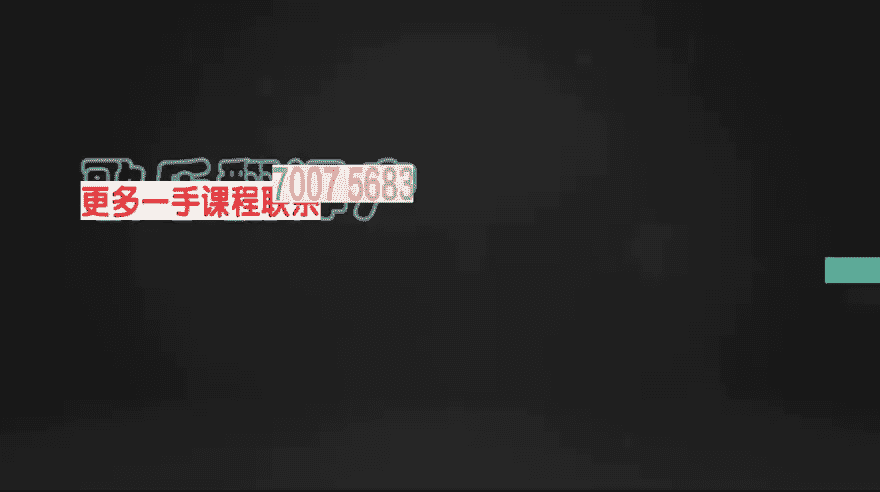

# 1、19小北摄影课（完结）：第12期：12期之第12期：综合实战，融会贯通APP修图

🎼大家和我一起学习手机摄影，这节课是我们的第十二节课，也是零基础手机摄影的最后一节课。想了很久，最后应该跟大家聊点什么，或者以什么样的方式去和大家告别会更有意义。想来想去。

决定跟大家聊一聊我自己的摄影经历，对生活旅行摄影的理解，以及在课程结束之后，我们应该如何持续提升自己的摄影能力。当然了，P图课还是要继续讲的。下面我通过三个真实经历跟大家聊一聊拍照和P图这件小事。🎼は。

🎼首先我们打开snapsed。🎼我们希望在得到一张照片之后，通过后期处理传达出更多的情绪。那么我们观察这张图片，在图片的上半部分有一个飘扬的旗子。但是对于我们这张图片来讲，我觉得这个旗子是很多余的。

很多时候我们在后期处理时要学会取舍。正是因为有这个旗子的存在，他把画面一分为二，在图片的上半部分是旗子和白色的天空。而下半部分才是我们的主体人物，也是我们要表达故事的核心。所以第一步我将对图片进行裁剪。

我们点击画笔。🎼进入裁剪。🎼在后期处理时，很多时候我们都要进行取舍。虽然说这个旗子的形态很好，但是由于它占据了太多的空间，导致人物主体没有那么突出。图中的人物，还有整张图片的故事感就会比较弱。

所以我们要大胆进行取舍。🎼首先我把上面的旗子直接裁掉。🎼然后打勾。这时候我们观察图片，由于去掉了天空和旗子，我们的视线就被集中在了人物，还有周边的建筑身上，主体会更加突出。接下来我们再次观察图片。

我觉得下边的两条线还是很多余的。它对于我们要传达出的情绪，还有故事，没有任何的帮助。所以我们要进行第二次的裁剪。🎼这次裁剪针对于下边的两道横线。🎼好，然后打勾。🎼这个时候，由于没有天空，还有地面的干扰。

我们的视线就被锁定在了人物的身上。这个时候我发现整体的画面还有一点点的偏，所以我们可以使用旋转工具，把地平线转正。🎼OK我们打勾。好，其实我们只进行了很简单的两个步骤，我们就获得了一张全新的图片。

所以在这里我想跟大家说的是。🎼摄影其实有时候需要我们更加的专注。在前期拍照时，我们要尽可能的考虑足够多的因素来帮助我们获得一张好照片，而在后期处理时，我们要目的性明确，像图片中多余的地方。

或者说对于我们传达情感，传达故事，没有帮助的地方，即使它再好看，我们也要坚决的舍弃掉。好，我们回到这张图片。在刚刚我们去掉这个旗子之后，这里还有一个栏杆感觉非常的多余。那么我们怎么把它去掉呢？

还是点击画笔，然后进入修复工具，然后双指放大。🎼在需要擦除的地方轻轻一划。🎼然后缩小就OK了，这个时候打勾就可以了。🎼在对图片进行了二次构图之后，接下来我们可以对图片进行色彩的调整，还是点击画笔。

点击调整图片，它默认打开了亮度。这个时候我们可以通过向右滑，适当的增加一点点亮度，然后向上滑，选择对比度。对于这张照片来讲，我希望能够更多的体现人物的存在。所以我可以适当的增加一点对比度。

🎼这样人物和背景的反差就会增大。🎼更加有利于我们传达出情绪。🎼好，接下来是饱和度。在这个时候我们有两种选择。当我们把饱和度左滑到最低的时候，这张图片就变成了一张黑白照片。

而黑白照片有时候可以更好的体现我们的情绪，或者我们可以把饱和度增加获得更加鲜艳的色彩，由于人物是黑色的剪影，饱和度越高，它们之间的反差也会越强。但对于这张图片来讲，我还是更加喜欢黑白照片。

🎼接下来我们看到氛围这个选项。氛围这个选项我觉得对于这张图片来讲没有太大的帮助，它会把整体的细节，天空的细节还原，而暗部的细节也会增强。这样反而导致反差没有那么的强烈。所以这个不是我想要的结果。

🎼我们把氛围降下去。🎼好，下面高光和阴影。阴影的话，我觉得我们有两种选择，一个是还原一些阴影的细节。🎼让大家能够看到，原来这个是发生在一个码头上面的故事，或者你干脆把细节全部抹掉。

这样更加能够体现人物的存在。这里我觉得适当的增加一点阴影。接下来我希望图片看起来更加的清晰。我们可以选择突出细节。🎼然后向右滑，当我们滑到最高的时候，对比一下之前天空还是比较模糊的，这边都会比较模糊。

通过把结构增加到100，我们获得了一张更加清晰的照片。🎼呃除了结构，我们还可以整体的增加一点锐化。🎼好，这里我加到16打勾。🎼接下来我希望通过局部的调整，是人物，还有画面最中心的地方对比增强。

那么我们怎么办呢？还是点击画笔，然后选择局部，我们点击进入局部。这个时候左下角会出现一个蓝色的加号。我们点击需要进行局部处理的地方，然后拖动你可以发现一个加号，还有一个圆圈。

我们把这个圆圈放到人物的主体身上。🎼好，它就出现了一个亮，亮是什么意思呢？我们通过左滑还有右滑，你可以看到画面的中心位置有了变化。🎼我希望中心再暗一点。🎼同时我希望对比度再增强增强一点。

🎼我们可以双指放大或者缩小，调整这个圆圈的范围。🎼当我们拖的很大的时候，这些红色的地方全部都是全部都是能够影响到的范围。而我们缩小到非常小的时候，只会对这个局部产生变化。🎼好，除了对于画面中心以外。

我们还可以再添加一个。比如说我这个旗子颜色不太好看，我不希望再有这个颜色。🎼我们只需要点到旗子，然后向下拖，找到饱和度，把它拖到最低。🎼这个时候我们对比一下旗子就变成黑白的了。🎼好。

我们简单回顾一下思路，这节课的核心也正是修图的思路。🎼对于这张图片来讲，我们首先通过裁剪，将视线聚焦到了主体身上。然后对于确定好的图片，我们再进行了亮度和对比度的调整。

而最后我们希望能够精细化的调整这张图片，选择了对图片进行局部处理。按照这种先定型再调整，再进行局部操作的方法，我们最终获得了一张有故事的图片。在图片的后期处理环节，最需要的就是尝试。

即使我们已经获得了一张彩色的照片，你仍然可以通过点击画笔，然后为它选择一个黑白的滤镜，通过不断的尝试为照片找到一个最适合它的表达方式。🎼好，这里我可以选择对比，然后进行一些亮度调整。🎼好。

这样打勾就可以了。🎼好，我们打开vissco，这张用全景模式拍摄的图片非常的长。首先我们点击编辑进入调整。我们简单分析一下这张图片，由于这张图片非常的长。画面里就包含了人物、环境，还有天空三个主要部分。

那么我们在修图时一定要注意这三个部分的关系，对于人物部分，我们要保持它的亮度，让大家能够看到这个人物，而对于整个的环境楼房来讲，我们希望它能够不抢人物的风头，我们希望人们能够一眼就看到人物。

但是人物又不是非常的跳戏或者出细，那么带着这个思路，我们对图片进行细致的后期调整。🎼首先我们进入基础调整。🎼对于天空来讲，我们如何压暗它？那其实很简单，只需要找到高光减带。🎼然后往下滑。

我们发现天空就已经暗了。🎼我们大概划到。🎼3。4，然后打勾对比一下。🎼之前天空很亮，现在会稍微的暗一点。🎼嗯，这时候我觉得整体的亮度可能还可以稍微降一点。🎼好。🎼当你降了太多之后，人物就没有那么亮了。

呃，我们不用着急，人物我们可以分开再调。🎼那么在这个环节，我们首要的是把环境的楼房，还有天空处理好。🎼好，我剪到2。4左右，然后打勾。🎼接下来我们为图片增加一点对比度。🎼当我们左右滑动对比度的时候。

你可以明显的发现天空更亮了。🎼而建筑深色的地方变得更暗。🎼我们找到一个合适的位置，比如说2。0，然后打勾。这个时候由于天空更亮了，所以我们需要再次进行高光减带。🎼但它不会那么突出。🎼打勾好。

接下来还是很关键的一步进行兑换。🎼通过锐化，使楼房的背景更加的清晰。我们打勾。🎼接下来我们可以为整个的画面添加一点环境色，我们找到阴影色调，在阴影色调里，我们随意点击一下。

🎼我们再次点击降低一点红色的阴影，然后打勾。🎼这样的话，我们的环境也就是主体的楼房就会被添加上了一些阴影的颜色，照片也就有了一点氛围，而天空还是依然非常非常的亮。我们可以通过为它添加高光色调。

使天空带一点淡淡的颜色。那么当我们点击蓝色或者青色的时候。🎼这个颜色是很重的，你再次点击，然后向下滑。🎼大概给他带一点点的颜色就足够了。🎼只需要不让天空显得过于苍白，就OK。🎼好，这时候我们对比一下。

之前会很亮。🎼这是调整之后，那么这个时候我们可以再为照片选择一个滤镜。🎼这里我就选择T一滤镜，然后降低一下它的数值。🎼好，这时候我觉得画面还是有一点亮，那么我还可以再进行曝光补偿的降低。

🎼是整个的环境非常的暗，然后打勾。那你要说了，那我这个人物也变得很暗了怎么办呢？Vs狗中是没办法进行局部的调整，那么我们可以先进行保存，然后打开另一个软件。

🎼好，对于局部调整而言，我们可以打开mix。🎼在这里中间位置就有一个局部调整，点击好，打开这张图片之后，由于我们是希望将背景变暗，然后人物更加的突出。所以我们整体的降低了亮度。当我们要提亮人物的时候。

可以选择右下角的调整笔刷。🎼然后底下有4个选项，我们首先选择亮度。🎼只需要在人物的地方擦一下。🎼就可以了。🎼对比一下。🎼用来放大一点。🎼我们看到人物。🎼这个之前是暗的，然后变亮了。如果你觉得涂的不够。

你还可以再涂几遍。🎼好，这个白色就会非常的白。🎼好，人物就变亮了，这是局部调整非常简单。好，如果你说我要降低亮度怎么办呢？只需要点击这个减号，然后对准你需要降低亮度的地方随便涂抹就可以了。

🎼大家看到我使劲涂的话，这里直接就变黑了，这就是mix局部调整画笔。🎼好，我们可以撤销回来。🎼当我们进行完局部调整之后，还可以点击左下角的照片海报。打开这张照片后，随便点击一个模板。🎼然后只需要向上托。

选择一个合适位置。🎼我们的照片马上就变成了一个海报，后边还有很多种的选项。🎼当你处理好图片之后，这些都非常的简单。🎼好，我们还可以点到旅行这个分类，选择一个适合旅行的照片。🎼点击保存即可。

🎼在我们掌握了修图的方法和思路之后，对于大多数图片你都可以做到事半功倍。那么我们打开这张图片之后，第一个要做的就是进行二次构图。首先我们分析一下这张图片的问题。

我觉得拍摄思路就是将一个独特的建筑倒映在水里，然后捕捉这一课的画面，但是这两只脚，我觉得有一点多余，那么我们通过二次构图把它去掉。🎼我们可以选择直接去拉，或者选择这里长宽比。🎼选择1比1。

🎼然后找到一个合适的位置。🎼这个位置。🎼这样的话我们就没有这个讨厌的角了，能够把我们的画面聚焦在人物，还有这个倒影的建筑身上。我们接下来要进行色彩、色调方面的调整，点击编辑工具箱。🎼首先。

曝光我们可以增强一点点。🎼然后再次观察图片，分析一下修图思路。我们希望获得的照片是一个反差很强，并且能够将水中的建筑形态更好的突出出来。那么我们就要增加对比度。🎼当我们减弱的时候，画面一片苍白。

而增加之后，人物的倒影，还有建筑的倒影都更加的清晰了。接着我们看到高光和阴影两个选项，我们首先调整阴影，阴影对应的就是建筑，还有人物的倒影。🎼当我们增加的时候，还是整体发亮，这种效果我们不喜欢。

我们可以把它降低一点。🎼降低之后，原本映射在水中比较模糊的建筑倒影也就变得更加的清楚了。我们长按进行对比。🎼之前的画面一片苍白，而调整之后，画面更加的清楚，色彩更加的丰富。🎼那么说到色彩。

我们还可以为照片增加一点点的饱和度。🎼或者干脆，我们直接把它饱和度降完，降完之后，整个画面就会显得更加的干净和纯粹。🎼也更容易将视线聚焦在人物，还有建筑身上。那么下一步我们可以添加一些锐化，向右拖动。

就发现地面还有整体的倒影都更加的清晰了。🎼这个时候可以人工的增加一点噪电。🎼使画面更加的沧桑。🎼按角其实也可以帮助我们更加的聚焦，我们可以适当的增加一点。如果我们出去玩，不止拍了这一张图片。

我们可以通过右上角点击保存滤镜，然后添加一个滤镜名称，比如说黑白。🎼自定义。🎼点击保存。🎼这样我们就获得了一张黑白滤镜。那么这个时候再次点击mix，打开一张新的图片。

在自定义选项里可以看到我们的黑白自定义滤镜，点击一下。🎼它就自动套用了。当然，套用了自定义滤镜之后，它可能并不适于每一张图片。所以在套用之后，我们还可以进行细致的调整。这里我使用一个曲线工具。

首先明确我们的目标。我们的目标是让影子更加的暗，让人物的倒影更加的清晰。那么首先这张图片存在的问题就是太亮了。🎼那我们可以把整体的亮度先降低一点，然后在中间位置点一个点向下拖动这样。

🎼影子就会更加的实在。🎼但是当我们拖动的时候，发现整个画面都变暗了，我们希望图片的反差大一点，所以我们在上半部分再点一个点向上拖动。🎼增强对比度。好，我们把曲线隐藏，这样的话影子会更加的实在。

🎼我简单总结一下，之前的课程可能更注重于软件的操作。🎼而这节课我希望大家能够更好的去体会修图调色的思路，去探索更多的可能。

🎼，🎼好了，到这里，我们本期的课程即将结束了。最后还有些话想跟大家说。🎼嗯。🎼每个人心中可能都会有一座大山。🎼总想翻过这座山，去看看山外面的世界是怎么样的。但其实爬到山顶上，发现山的那边还是山。

只不过更高更远了。🎼很多时候我们都在翻一座又一座的山，想让自己走得更远。🎼这大概就是心灵的旅程。🎼而在这段孤独的旅程中，幸运的是我们可以用摄影去记录那些泪水或者欢笑。🎼有人说，人生其实就是一场旅行。

旅行就是体验不同的人生。🎼对于每个人来讲，生命其实就是一场盛诞的旅行。🎼而日子就是这旅途中你经过的每一站风景。🎼或美丽或温暖，或忧愁或喜悦。🎼而这转瞬即逝的一切，我们可以通过摄影永远的珍藏下来。

🎼希望大家能够永远保持对生活的热爱，这也许才是摄影真正的意义。