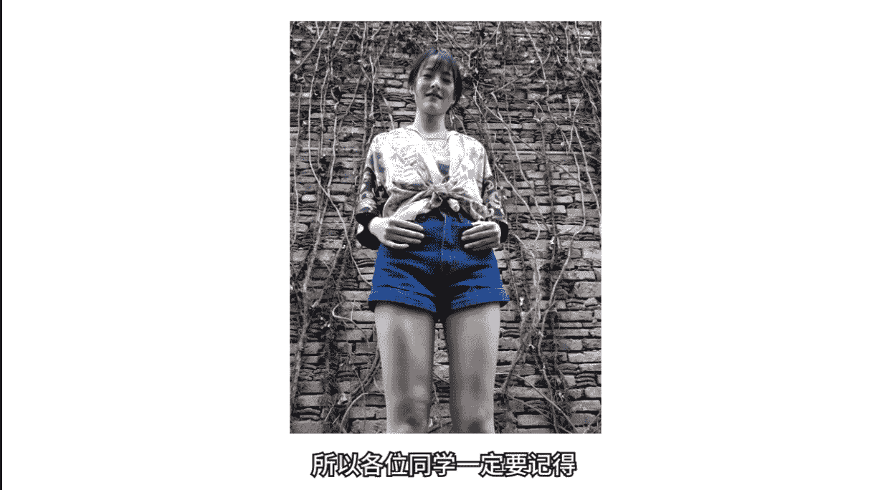
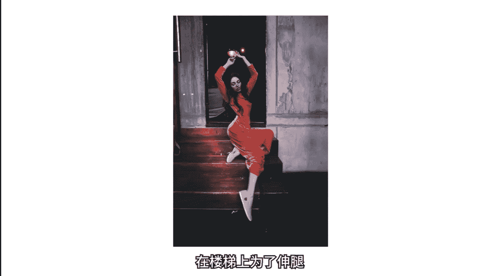
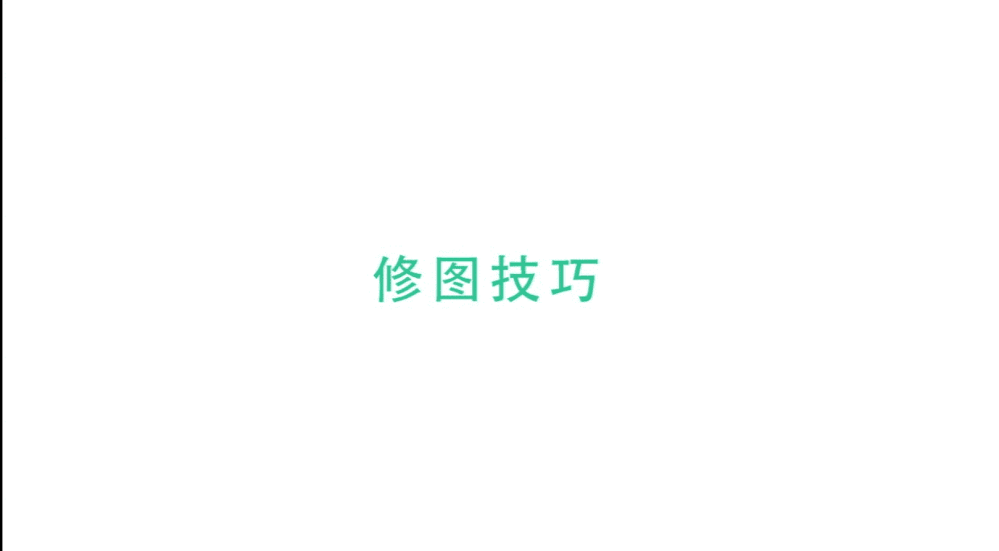

# 1、19小北摄影课（完结）：第5期：第5期、学会这几招，分分钟拍出大长腿

。🎼hello，大家好，欢迎来到新一期的小北手机摄影课堂。我是想和大家一起帅三代美三代的小北。欢迎大家和我一起学习手机摄影。上节课我们一起学习了从身边普通的场景来进行拍照。

我觉得我们除了学习拍照技巧以外，更重要的是培养从身边发现美的意识。生活中不起眼的点点滴滴，最终构成了我们最美好的回忆。今天我们把目光从场景转移到一个特定的拍摄主题，那就是拍摄大长腿。那么有同学要问了。

小贝老师，我们都和你一样，是腿长2米的帅三代，根本不需要拍照技巧。那么我们看了这节课有啥用呢？这位同学问的好，看我课程的你们腿那么长，当然不需要拍照技巧了。但是呢你们可以学会之后帮助腿短的朋友们啊。

你们说是不是好了。😊，🎼言归正传，其实想要拍出大长腿并没有我们想象的那么难。这节课主要分为两个部分，第一部分是显腿长显身材的服装搭配技巧和前期拍照技巧。第二部分主要围绕如何后期修长腿塑美腿。

教大家P出更美的腿型。好了，接下来我们就一起进入大长腿的世界。🎼在我准备这期课程的时候，我看了很多资料，也学了很多摄影师所教授的大长腿秘籍。但我发现一个很大的问题，就是如果我们想要拍出大长腿。

光懂拍照技巧是远远不够的。我们不光要会拍，同样还要会穿，把衣服选对，同样也是很重要的。下面进入第一个环节，为你增高2米的服装搭配技巧。

🎼我们先看一种典型的由于服装搭配不当而显得腿短的案例。这是一个国外的时尚网红，他经常晒自己的服装搭配，但是这套衣服却显得他身材比例很差。🎼即使图片中的他比普通人更加会凹造型。

依然无法掩饰他身高不足的缺点。而我们观察这套服装的问题，首先最最重要的问题是上身下身五5分。如果再减去高帮鞋的高度，人物腿部就短的更可怜了。那么还是这个网红，我们看右边这张图，明显发现他的腿变长了。

而且与左图相比，身材也苗条了很多。那么为什么同一个人仅仅换了一套衣服，身材比例就变好了呢？腿就变长了呢？其实很简单，想必大家也都发现了影响身材比例的一个重要因素，就是腰线的位置。左图中由于腰线低。

形成了上下一边长的55比例身材。而右图中，由于腰线的提高，图中人物看起来有3分之2都是长腿。虽然他是同一个人身高也是同样的身高。🎼虽然我们都能看出来，他实际本人身高也并不会很高。

但视觉上右图的身材就是比左图好了很多，整个人的气质也显得不同。实际上提高腰线并没有使人物的身高增加，而是使腰部位置在视觉上上移了，显得我们腰部以下全是腿，是通过服装搭配，优化了身材比例。

所以呢想要优化自己的身材比例，获得一双大长腿，家中常备几件高腰裤子还是很有必要的。所以我们要记住一个核心要义，那就是腰线以下露出来的全是腿。那么根据这个原则，在选择鞋子上也会有小心机。

比如个子不高的同学们在选择高跟鞋时，尽量选择能够露出脚背的鞋子，在视觉上能够拉长腿部的长度。🎼我们在穿大衣或者长衣时，应该尽量避免拍摄背影，尤其是对于个子不高的同学们，从背后拍摄，简直是丧心病狂。

遇到这种抓着你背影拍的摄影师分分钟要跟她绝交。即使对于身高本来很高的女生，拍摄背影时虽然气质和优雅还在。但还是将本身优秀的身材和长腿优势拍没了。那么原因是什么呢？其实很简单。

因为背面拍长衣完全看不出腰线，是不是我们永远也不能穿长长的衣服了呢？当然不是我们可以通过拍摄正面或侧面的内搭加外搭来解决如何穿大衣这个问题。🎼其实对于身材比例问题。

我们只需要记住腰线位置是一个关键的影响因素。我们看这张穿大衣拍摄的正面图片，由于观察不到腰线位置，所以人物的身高优势和身材比例并不突出。🎼解决办法很简单，就是露出腰线，让人们能够清楚的观察到腰线的位置。

并且是一个较高的腰线位置。那么外面大衣的修长与内搭显出的优秀身材比例相结合，分分钟拥有大长腿。所以内搭按照高腰线搭配好，我们需要的只是把外套拉链打开，妹妹，你就大胆的往前走吧。

🎼刚刚和大家一起分析了服装搭配对身材比例的影响。下面我们就一起学习具体的拍照技巧。首先，我们如果要拍大长腿，拍照前根据腰部以下全是腿的原则，我们可以把脚长的外衣扎起来，提高腰线位置做好拍照前的准备。

🎼好，我们先看一下平常大多数人的拍照方式。首先我们来到平常闺蜜或朋友帮忙拍照时的场景。🎼和大多数人拍摄方式一样，就是将手机端到面前，然后按下快门拍拍拍。实际上我们以旁观者视角来看手机里的画面时。

可以明显的发现，哎，好像这个角度显得人腿比较短啊。🎼这是因为拍摄时手机的位置比较高，斜着向下拍摄会拉长和突出上身的长度，拍出来的照片就会显得上身长，下身短。🎼腿也变成了两条小短腿。

🎼大家如果把闺蜜拍成图上那样，不管你闺蜜多么拼命的摆造型去挽救，你们的友谊可能也就到今天为止了。另外还有一种更加令人发指，男莫女泪丧心病狂的情况，就是你刚好碰上一个不会拍照的男朋友。

这时候她的大长腿和她的身高优势，反而变成了劣势，身高越高的男朋友，拍照时俯视你的程度就越深。对应的情况就是你的腿就会越短，她手机里的你不论怎么摆姿势，还是拥有一双小短腿。🎼看到拍出来的照片之后。

你肯定分分钟就想跟他分手。🎼不光是普通人这样子拍照，很多网红被俯拍时也是腿短的气人。所以如果拍照角度掌握不好，再好的搭配，再长的腿再高的颜值都是白搭。🎼我们如果像普通人那样站在原地随手拍。

那肯定是不行的。看过了上面的错误拍照示范。可能你也知道了，拍照时如果高视角不行，那么我们就让男朋友蹲下来，将手机从一个比较高的位置，降低到女朋友的腰部以下，从低视角向上仰拍。

这时候我们再观察手机里的画面，就会发现，由于拍摄使用了仰视视角，女朋友的腿部会被镜头拉伸和强调。🎼显得更加细长，而上半身也没有之前那么突出。其实很简单，根据仰拍原理。

接下来的这个方法就是见证你们友谊和爱情的方法。那就是你都不跪下为我拍照，凭什么说爱我和这个类似，还可以对你的损友们说，你都不趴下为我拍照，凭什么说爱我，总之一个原则你开心就好。不过一般来讲。

蹲下拍就够了。不过年不过节也没人给发压岁钱，咱们犯不着心思大。这里小北还要特别提醒大家一下，在低角度拍照时，一定不要因为追求大的仰拍角度和夸张的大长腿效果，而距离被摄者太近，这样反而会起到反效果。

因为仰拍角度太大，腿部被过分强调，所以原本细细的两条腿，在手机画面中就变成。🎼了两条又粗又大的大象腿。🎼所以各位同学一定要记得，不要距离被拍小伙伴太近，应该根据不同女朋友的身材特征掌握好没有。

🎼应该根据不同被摄者的身材特征，掌握好拍摄距离，找到可以使腿又细又长的那个最佳拍照平衡点，拍出你和他都满意的图片。接下来我再教大家一个小为我屡试不爽的拍照小技巧。🎼在拍摄大长腿的路上，能够助你一腿之力。

🎼看到手机摄像头了吗？我们要做的很简单，把手机转过来，也就是由平常普通的正向操作手机变为倒着拿反着操作，不过完全不用担心，把手机倒过去之后，画面中的景像和人物仍然还是正向的。

只不过是快门按钮跑到了上面而已。🎼对于我们而言，唯一的区别只是操作界面从下到上，除此之外，和平时拍照几乎没有任何区别。对于拍照而言，大家都爱说细节决定成败。不过我估计大家也管不了那么多。

反正能够让我的腿长增加，哪怕一毫米，我也会义无反顾的把镜头转过去，如果嫌蹲下来拍照很麻烦。我们可以让小伙伴走到楼梯上，借助楼梯形成天然的高度差，不用跪下，也不用趴下，站在原地反着拿手机即可搞定。

🎼拍照时可以向前或者向下伸腿，会显得腿型更加修长。所以如果外出拍照，看到有楼梯，果断让你的老铁们站上去拍，伸完左腿伸右腿，一张长腿照就搞定了。🎼还有一个楼梯拍照小技巧，你可以让你的朋友从楼梯上走下来。

当然不要走太快，我们在他向前迈步的时候进行抓拍即可。下楼时，由于腿部向下伸长，腿型也会显得更瘦。🎼，🎼刚刚我们讲了拍摄大长腿的常用角度，还有个问题，困扰很多同学。

那就是我在拍照时应该摆什么样的姿势才更容易排出大长腿，最简单实用的方法就是向前伸腿，这里要注意一点，就是伸腿时，一定要保证在前面的那条腿使劲绷直，脚尖尽量向前点地，使前腿成为一条直线。

这样看起来腿部线条也会比较修长。🎼拍照方法像我之前讲到的那样即可蹲下来反向拿手机。我们观察屏幕中人物的腿部，可以清楚的看到腿部显得很细长，而我们仅仅只是依靠向前伸腿和脚尖点地就完成了大长腿的拍摄。

另外还有一种方法就是拍摄转身照片，原理与向前伸腿类似。转身向前走时，后腿线条比较舒展，同样也能获得很好的腿型。🎼除此之外，还有一个同样简单的方法，那就是腿部向前交叉。现实中，小伙伴的腿可能并不很长。

但当我们在手机屏幕中看时，交叉腿型就显得又细又长。手机实时的长腿效果就足够明显了，几乎不需要任何后期修饰，我们还可以向后伸腿交叉，同样能够拍出漂亮的腿型。🎼有许多欧美时尚博主在拍照时就很喜欢交叉摆姿。

🎼还有一种姿势也深受时尚达人喜爱，那就是大步向前走路，同时进行抓拍。这个方法看起来就是抓拍人走路，但其实要注意的地方也不少。首先一定要迈大步，因为只有迈开步伐，才能显示出修长的腿部线条。

第二点是要昂首挺胸，上身要挺直，这样才会显得人更加自信，第三点也是最容易被人忽略的一点。那就是我们要保持后腿尽可能的使劲绷直，由于前腿要向前迈步，可能不是很好控制的笔直。但是后腿在离地向前迈的时候。

有意识的绷紧，形成三角形状，就能获得漂亮的腿部线条。有同学要问了，我的腿比较粗，在坐下来拍照时，可能会放大腿部缺陷。🎼显得腿部又短又粗，有没有什么好的办法呢？这里我告诉大家一个拍照小心机。

就是千万不要实打实的坐在椅子上，而是向前坐，只做椅子的边缘，最好是屁股只坐到一点点点点点的椅子。🎼保证屁股下面全是腿，而腿部要尽量向屏幕边缘伸展，比如伸向屏幕的右下角，同时腿部还可以向前交叉。

坐下来拍照时要特别注意，不管你有多瘦，都应该尽量避免大腿大面积的接触座椅，假如大腿上的赘肉直接拍在座椅上，那画面想想就太美，我不敢看。还有楼梯也是一个很好的坐姿，长腿取景地。🎼但我们要注意的是。

一定不要傻傻坐在原地，而是要一如既往的向下伸腿。楼梯从上向下的高度差，可以完完整整的将小伙伴的大长腿展示出来。其实坐姿总结起来很简单，总共三个词，伸腿伸腿再伸腿，我们还是要向网红博主学习姿势。做沙发时。

前腿能伸多远就伸多远。🎼做桌子时只做边缘，同时还要保持修长腿型。🎼甚至有的人坐在窗台上，一条腿也伸得笔直，这充分告诉我们一个道理，不怕腿不长，就怕腿不直。我观察了很多坐姿。

发现有些网红拥有独特的大长腿技巧。🎼那就是半坐半躺。当然了，如果你仔细观察，同样不难发现，他们还是在尽可能的向前伸腿。在楼梯上为了伸腿，甚至都摆出了这么高难度的动作。所以说连网红都这么拼。

我们拍照时还有什么理由不伸腿。这里我再告诉大家一个拍照小心机。我们在倚靠墙壁拍照时，可以偷偷垫起脚尖，这样做有几个好处，一个是垫起的脚也成为了我们大长腿的一部分。另外，当从正面拍摄时。

完全看不出我们的小心机，剩下的只是一双笔直的大长腿，在这里请为自己的美貌与智慧点个赞。说了这么多，也辛苦摆了这么多造型，此时此刻，我只想说拍长腿我们是认真的。

あ？

🎼首先我们要学习的是通过手机APP简单操作，拉长双腿。下面我给大家带来一段手机实录视频。🎼拉腿其实很简单，比如我们以这张错误示范为例。🎼我们只需要找到美图秀秀的增高功能，点击进入之后会看到有两条横杆。

那么当我们拖动的时候，会看到蓝色区域为选中区域。那我们只需要把腿部选中。🎼然后滑动下面的横杆，当你向左滑的时候会越来越短，向右滑的时候会越来越长。那么我不建议大家一下子就滑到顶。

🎼我们可以通过好几次的滑动。比如说我第一次先大概找到一个比较舒服的位置，然后打勾打勾之后，我们再次点击进入增高功能。🎼然后我们换一个区域范围，比如刚才是从。🎼裤子到下边，那么我们这次只框入腿腿部。

🎼然后增长。🎼这样的话就可以进行局部细致的调整。那你可以使用这个功能调节你的上身。🎼比如说我我们觉得可能上下比例不太好，那么我们框住上身，然后把上身的比例进行一些调整。好，那这个时候我们就可以利用到短。

🎼调整完之后打勾即可。我们在后期P图时，很多人只做拉长腿操作。而实际上我们不光要拉长腿，同时还要为腿部塑形。下面我们还是以这张图为例。🎼这张图的腿型可能还需要一些修饰，所以我们找到瘦脸瘦身功能。

点击进入。🎼然后双指放大图片，比如说我们要把这个小腿，小腿有点向左弯曲，我们只需要点到小腿位置，然后向右拖动。美图秀秀就会自动帮你把腿型。🎼往右推就不会显得那么向左突出。好，右边也是一样。

🎼比如说大腿位置，我们也可以。🎼轻轻拖动，向左拖动，大腿的形状也会发生改变。但是呢我们一定要注意，不要一次拖的很大，拖很大之后，你腿型就变得会很夸张。所以我们先撤销，可以进行多次操作。

🎼进行细微的操作叠加。🎼好，我们对比一下，右上角可以进行对比，那么可以明显的看到这个大腿和小腿的形状发生了变化。🎼我们还可以用这个功能结合拉腿功能。🎼以实现一个完美的腿型，这里我就不再演示了。好了。

今天我们大家一起学习了，用手机拍出大长腿。在课程之外，也欢迎大家到我的微信公众号，人民公社上与我沟通或者交流，我们大家共同学习，共同进步。好的，感谢大家收看。我是想和大家一起帅三代美三代的小北。

我们下期再见。

🎼而。🎼不同的场景来进行拍照。🎼我觉得最多。

🎼这位同学问的好。