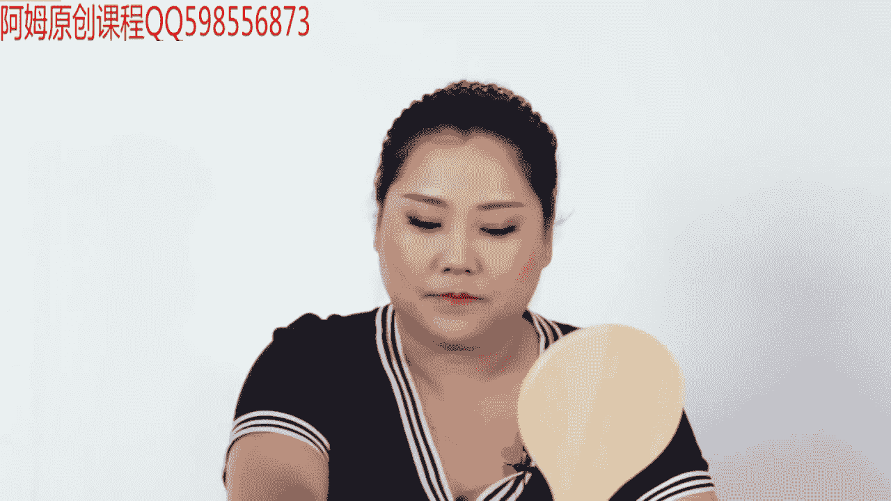
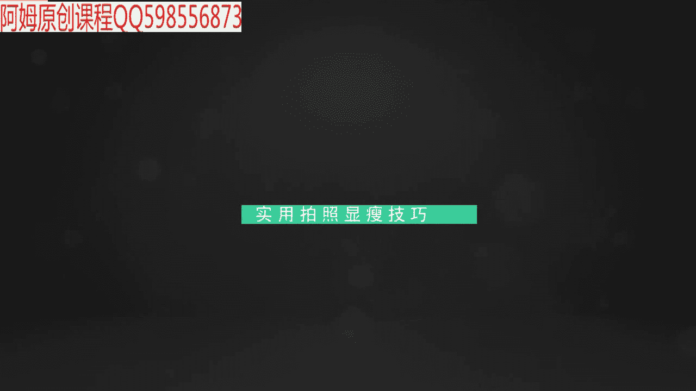
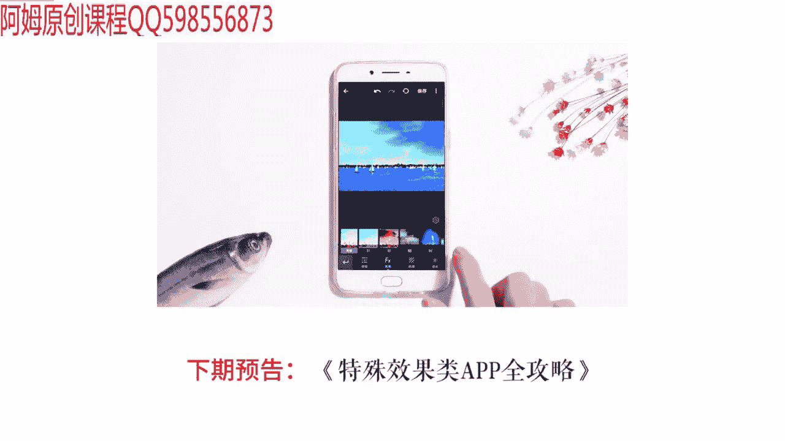

# 1、19小北摄影课（完结）：第7期：12期之第7期：这些显瘦的角度和技巧，帮你轻松瘦瘦瘦 

嗯。

🎼hello大家好，欢迎来到小北的手机摄影课堂。我是想和大家一起帅三代美三代的小北。上节课我们一起学习了如何拍出大长腿。那么这节课呢，我们将一起探讨如何把人拍瘦，也就是拍照显瘦的小技巧。

我身边呢有很多女生朋友，他们不管是不是真的胖，都或多或少的会对自己的身材不满意。这次呢我请到了我的老朋友楠楠。😊，🎼她不同于以往身材苗条的模特，她是一个体重超过了80公斤的胖姑娘。

接下来我们将一起给大家分享拍照显瘦的心得。我希望通过这期视频能够使对自己身材不满意的朋友们走出自卑，重拾自信，其实，拍照显瘦没有那么难。我觉得主要可以分为两个部分。第一部分通过化妆和穿搭来修饰身体。

为拍照打基础。第二部分呢主要靠显瘦pos进行调整和优化。

🎼首先第一部分就是一个胖姑娘亲身总结的瘦脸妆容心得，而楠楠本身也是一个专业的中极彩妆师，希望她的专业知识和乐观向上的心态能够对大家有所帮助。🎼大家好，我是之前那位80公斤的胖女孩。

现在突飞猛长的已经长到了90公斤。今天的话我会跟大家一起分享，我平常化妆的心得。现在我已经用平常大家经常用气垫BB把底妆打好了。然后接下来就是定妆嘛，定妆的话，我还是想跟大家说一下啊。

你定妆的话有分三种粉，一种是粉饼，一种是散粉，还有一种是蜜粉，大家会问了，这三种粉有什么区别。接下来跟大家说一下这三种粉的区别。首先是粉饼，粉饼的话，它的遮瑕效果要比其他两种粉更好。

如果说你平常是化妆比较浓一点，或者说是想要持妆更久一点，那最好选择粉饼，散粉的话主要是让妆容看起来更透亮，蜜粉区别是在于它有提亮高光的效果。但是遮瑕效果是这三款粉种是最差的。接下来就是打粉了。

🎼打粉的话啊特别是注意油性肌肤，一定要在出油的地方多打一点粉饼，这样子的话。🎼妆容会更持久。🎼还有眼部是一个最容易出油的地方。🎼也要用粉饼。🎼将这边的油份控制住。🎼这样到时候眼线不会晕染开来。

手法的话就是这种点压型。🎼咱们接下来说眉毛，那我来教大家，就像我这样的胖美眉脸部会比较圆，这样子的话应该强调眉毛的弧度，让脸宽的注意力来转移调，大开始画眉毛喽。🎼眉毛怎么定点，就三个步骤，认真看哦。

🎼眼睑。🎼对上去就是你的眉头，先定一个点。🎼还有。🎼瞳孔外侧边缘对上去就是眉峰。🎼最重要的一点，眉尾大家看清楚喽，鼻外侧。🎼和啊眼角。🎼作为一个尺子斜的拉过去。平常就可以用眉笔。

🎼拉过去拉到这边就是你的眉尾。🎼好，接下来把三个点连起来就行了。但下手一定要轻啊。🎼眉头擦掉一点，眉头不能过深，眉头要浅一点。🎼这样会让眉毛看起来不会过于硬。🎼然后再用眉笔将中间填充满。

🎼最后再用刷子刷一下。🎼现在画另外一只眉毛。🎼还是按照刚才的，接下来就是眼影，眼影最常用的颜色，大家都知道大地色。🎼但是一般人的话用眼影只用一个颜色，我会用到3到4种，这样子让眼部更有深邃层次感。

🎼先用浅色的在眼部打上颜色。🎼但都是带有微珠光的。🎼接下来再使用深一点的颜色。🎼在。🎼靠近。🎼眼眼节底部。🎼第三层我选择珊瑚色。🎼最后最后再用一点点的咖色。🎼在燕窝处稍微打一点。

🎼这样看过来就不会一下子注意到你的胖脸，而是注意到你的眉毛跟眼睛。🎼接下来就是侧影跟高光，一般脸宽的话就需要用侧影来加深一下你面部的柔和。现在我先把要打侧影的地方标识出来。🎼这样你们可能更直观。🎼额头。

发髻。🎼脸颊。🎼就这一块，这边也是。🎼我一般平常生活当中选择的是用珊瑚色。珊瑚色的话，它不会像棕色那样突兀，颜色比较温和一点。🎼侧影的话是你咬紧牙齿。颧骨这边突出来的这块骨头，就是你要打侧翼的地方。

咬紧牙齿。🎼看一下两边脸。接下来我涂这一边。🎼还有一种侧影就是脸颊。🎼也可以带一下，一般脸颊的话，看你今天画什么妆容。如果说是可爱一点的，今天脸上擦了粉色的腮红，那可以在腮红。

就这个颧骨下面再加一点珊瑚色的。🎼侧影。🎼接着再把这边也补上。🎼做完了侧影，接下来说一下高光，高光的话有很多女生啊都不知道打在哪里。接下来我会把需要打高光的点出来，这样可能效果会更明显。🎼T区鼻翼。

🎼然后额头。🎼接下来是眉毛眉骨这边。🎼一点点。🎼再就是人中。🎼还有就是下巴，最后一个点就是平常我们嘴角这边总有两条黑黑的，所以这边也要遮一下。好了。🎼然后再把这些给墨鱼。🎼还有就是鼻影。

🎼鼻影的话就是正面看过来，你的眼睛内眼睑跟鼻梁中间的这个部位。🎼打上侧我画的明显一点，让大家能看得清楚。🎼我用的还是珊瑚色。🎼然后就是用指腹去加深这个颜色。

🎼接下来我将通过视频实例和图片对比给大家展示拍照显瘦的实用技巧。为了更加直观和真实的效果，我给大家录制了拍摄现场手机屏幕的实时画面。🎼首先让我们一起来看一个不光能够显瘦。

而且能够使人物更加有神的拍照小细节。我们先看这组对比图，为了更便于大家观察差异，我们选择了拍摄侧面，真的很感谢我们的胖姑娘楠楠敢于为大家做示范模特，楠楠也希望这些拍照技巧，能够真的帮助到大家。好了。

下面我们开始进入对比分析。左边图片中，我们的胖姑娘楠楠被拍的很臃肿，尤其是肚子部分。而在相同位置，我们又给楠楠拍摄了右侧的图片。圆圆的肚子不见了，而整个人看起来也精神了不少，相信大家都看出来了。

右图的秘诀在于两点，一个是吸气，另外一个是挺胸，我们回顾一下自己的拍照经历，很多人在拍照时都会喊11223。🎼茄子，然后搭配一个好看的表情，但是问题也会随之而来。

通常我们在拍照时可能光顾着喊123茄子和展现面部表情了，而忽略掉了控制自己的身体。🎼实际上在真正的拍照时刻，我们可以在听到摄影师喊123时进行吸气，然后再摆表情，这样既控制了表情，也控制了身体。

我们要记得也很简单，123就等于吸气，以后拍照时只要听到123就吸气。🎼准没错。123。🎼123123123123123123。🎼刚才我们讲了一个吸气小技巧，下面这招也是一个简单实用的拍照小技巧。

那就是借助周围环境进行遮挡拍摄。比如说楠楠直直的站在原地时，会显得比较呆板，身材的缺点也被直接暴露在外。这时候我们可以借助周边环境进行拍摄，手叉腰，身体略微向内侧倾斜。🎼然后呢。

我们就得到了一张漂亮的照片，其中有几个小细节需要大家注意一下，露出来的一侧摆出手臂叉腰的动作。另外，借助环境遮挡人物时，遮挡物本身也可以帮助我们进行构图和分割画面，和最开始直直的站在原地拍摄相比。

能够使画面不会显得很单调，接下来我们一起分析一下，借助建筑物遮挡所拍摄的图片。首先，手臂叉腰的动作可以一眼就让人看到腰线位置，能够更好的塑造腰部曲线，而叉腰时，身体可以顺势向遮挡物一侧倾斜。

这样不会显得人物很臃肿。构图方面，不论是图中的圆弧形还是普通的方形墙，都可以修饰画面。我们生活中最常见的方形墙，使对称构图的。🎼利器还有很多，比如柱子啊、栏杆啊、桥墩啊等等，都可以辅助构图。

🎼当夏天来临，我们穿起短袖或者无袖装进行拍照时，也要注意拍照技巧。首先一定要杜绝的pos是像视频中这样扶着手臂，会显得大臂非常臃肿。🎼我们需要保持手臂和身体之间有一定的空隙。我们看这两张对比图，很明显。

左图中大臂被压扁了，右图则是将大臂和肩膀撑开，腰部的曲线也显现出来了。即使我们没有挤压大臂，只是站在原地，手臂自然下垂也是不行的。尤其是上身肉肉比较多的女生，视觉上像是很多肉堆在了一起。

所以拍照时最好还是要在手臂和身体之间留出一点距离，让上半身有一定的层次，这里大家只需要记住一句话，不管多瘦的人，大臂压下去，也会堆出肉来。🎼刚刚我们看到了大臂挤压身体会显胖，而当我们蹲下时。

肚子也会堆积出很多的肉来。下面给大家演示一个既能显瘦，又能显腿长的蹲姿拍找小技巧。视频中，楠楠在蹲下时，肚子上很明显有很多肉，只能选择用手臂去遮挡住胖胖的肚子，但看上去仍旧不能令人满意。

比较正确的做法是双腿一前一后支撑，身体侧向面对镜头，与镜头呈30度角，后脚脚尖支撑这个姿势搭配一条脚宽的裙子，可以很好的遮盖住肚子上的赘肉，结合上节课拍摄大长腿的技巧，将前腿向屏幕一脚伸展。

尽可能的摆出一个舒展的腿部曲线，即使是对自己腿部非常不自信的泥，也能分分钟拥有大长腿。下面我们来对比这两种不同蹲。🎼姿所拍摄的图片，左右两张图都使用了从低向高的仰视视角，这样可以拍出更修长的腿部。

但是随之而来也会造成其他问题。比如我们观察左图喃喃的脸部，由于脚低的视角，导致我们拍出了双下巴。而右图中上半身略微向前倾，加上微微低头的动作，显得脸部整体没有那么胖。

另外右图中向前伸展的腿部和一直一弯两条手臂的造型，不仅遮住了肚子上堆积的肉肉，也使得与左图相比，人物造型没有那么呆板。🎼整体而言，蹲姿是我们平常不太实用的一种姿势。

但是偶尔也可以让好基友给自己来一张长腿显瘦图。🎼上一个部分我们遇到了双下巴问题，而接下来我们就一起来学习隐藏双下巴的技巧。一般来讲，下巴处受到挤压，堆积出来的肉形成的双下巴。比较正确的做法是。

我们要先向前探头，再低头收下巴，因为向前探头时，会使下巴与脖子之间的距离拉大。🎼在低头时，也不容易在下巴处挤出多余的肉来，而直接低头下巴稍微比较胖的姑娘们，由于和脖子的距离没有拉开。

可能会像之前手臂贴身那样，在脖子上挤出多余的肉，显出比较明显的双下巴。🎼右图中我们可以看到，由于有微微向前探头的动作，楠楠的下巴和脖子之间是有一定的距离的，没有像左图那样挥出双下巴来。

🎼下面这个方法是我跟一个长发姑娘学到的，被她称为头发遮大脸发。🎼通常没用头发遮挡时，我们拥有的的确是一张大脸，而我们可以用手指将头发调到一侧，同时向一侧转头，将侧脸留给镜头。相对于正面平视。

一般侧面朝向镜头时会弱化脸部的宽度，再加上头发进一步的遮挡，原本宽宽的大脸就不会再抢戏了。另外，拍摄侧脸时微微向上仰头，照片的效果也会不错。在这里，小北想说，心疼男孩子们。🎼心疼短发遮不住脸的女孩子们。

顺便心疼一下自己。🎼那么如果像我一样没有长发或者长度不够遮脸的小伙伴们咋办呢？🎼很简单，用手挡脸就可以了。每个人可能都有自己比较好看的一边脸，所以可以选择将不好看的一边脸用手挡住。

这里小北要特别提示的是，当我们挡脸时，手臂弯曲，同样也会挤出很多肉，比较显胖。所以我们可以借助二次裁剪的方式进行重新构图，将粗粗的手臂裁掉，只保留被遮挡住的脸部图片，那如果手臂粗怎么办呢？拍照时。

我们只能裁掉吗？🎼当然不是，我们同样可以利用双手遮挡手臂。🎼比如说手臂上的肉很多，该怎样使它看起来瘦一些呢？其实并不难，五指分开，轻轻的搭在要遮挡的手臂上，同时不要左右水平的抱着手臂。

尽量能够使一边高一边低，左右两侧略微倾斜。所以以后在抱臂时。🎼可以有意识的倾斜出一定角度，打破原有的视觉平衡。🎼拍照摆pose时，我们需要记住一个小技巧，那就是少摆直线，多摆斜线。

比如说楠楠的肩膀线和眼睛线现在都是水平的直线，这样就会显得人物很呆板，我们可以让楠楠侧身45度站立，然后使眼睛、肩膀、胸线都有水平变倾斜。🎼相比较于左图中一本正经的正面站立。

右图中肩膀眼睛都有一定的倾斜角度，在视觉上相对于左图也会显得人物比较放松。左图由于pos太过横平竖直，给人带来很大压力。所以拍照时pos太正经，会给人造成压力哦。🎼拍照时还有一个简单的口诀。

那就是不好的地方要会藏好看的地方要会露。手臂粗的女孩子不建议大家直接穿无袖的衣服，会将手臂的缺点暴露无遗。但是我们可以再搭配一件薄纱外套或者披肩。如果你身上的衣服是深色系的。那么选择一件亮色系上衣。

再把肉肉藏起来的同时，还可以调节整体的颜色感觉，藏肉技巧加上之前提到的倾斜身体的方法，使右图相比于左图更加具有活力。🎼我们在拍摄坐姿图片时要注意两点，第一，千万不要葛优瘫。平常我们可以怎么舒服就怎么做。

但拍照时一定要控制身体。一看到镜头，我们马上应该进入拍照状态。🎼如果你大腿上的肉比较多，可以用裙子进行适当遮挡，腿部尽量向远处伸展，不要直直的向前伸腿，最好倾斜一定角度。🎼还要注意一点，坐下来时。

肚子又会堆出肉来，我们还是要注意吸气，挺胸，身体可以微微向前看，使人物看起来不那么臃肿，拍摄坐姿时，第二个要注意的点是，千万不能走过去，站在原地随手一拍。摄影师要在低角度拍摄。

左图中的俯视视角不适合坐姿拍摄。那什么情况下适合俯拍呢？其实当人物站在低处，可以做出一些比较伸展的动作时，很适合从高向低俯拍。而且在俯拍视角下向前伸腿也会显得人物的腿部很细。

🎼现在大多数人拍完照片都会用P图软件修饰自己的身形。这里小北想提示大家一点。🎼最好不要在这种条纹场景前拍照，否则会导致我们后期很难进行P图。比如这两张图，左边是原图，右边是我们尝试修饰身形的图片。

仔细观察会发现右图的竖线弯了，当小腿和旁边的竖条很近时，我们只要用P图软件向内推腿，就很容易把竖线弄弯。所以如果想P瘦身形，咱们最好还是要避开条纹场景。好了，很感谢大家能够看到这里。

在这里我要特别感谢自信乐观的难难。🎼拥有姣好的容颜和火辣的身材，确实令人能够赏心悦目。然而，保持对生活的热情和乐观，更值得被赞赏。毕竟没有谁的幸福是靠美貌维持的，而是基于人与人品质的欣赏。

得不到赞美就去得到快乐嘛。在课程之外，也欢迎大家到我的微信公众号，人民公社上与我沟通和交流，我们共同学习，共同进步。好的，感谢大家收看，我是小北，我们下期再见。🎼不。🎼主要靠显瘦pose。🎼我的肉来。

下面我教给大家一个方法，既能显瘦又能显出大长腿。🎼看看接下来是一款功能多到爆炸的APP，也有人把它称为手机版的photoshop。🎼借助xix artAPP，我们可以轻松实现。

如果你不满足于对图片进行双重曝光，除了图片，我们甚至还可就是我们之前加的。那这样的话，这个动态贴纸就加到了每个鱼身上。你只需要点击保存就可以把这段视频保存下来了。🎼更多，而且它的效果你直接靠用。

就是凡是有天空的地方，它会自动识别，并且给你安置一个新的天空。

🎼比如说这种银河。