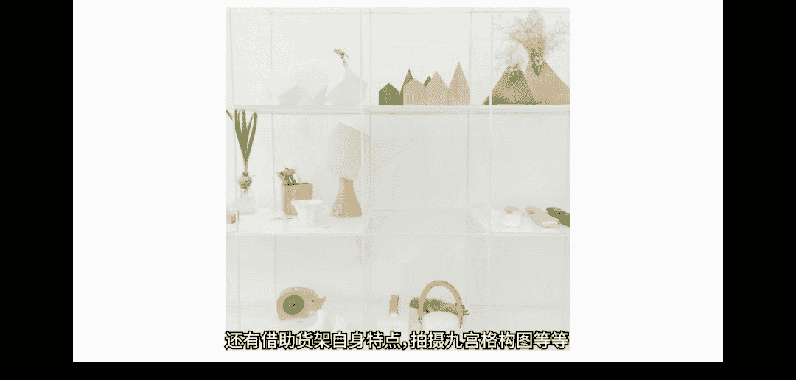

# 1、19小北摄影课（完结）：第9期：第9期、文艺清新照片攻略

🎼hello，大家好，欢迎来到小北的手机摄影课堂。我是想和大家一起帅三代美三代的小北，欢迎大家和我一起学习手机摄影。上节课我们一起学习了一些拍照显瘦的小技巧。😊。

🎼那么这节课我们一起聊一聊很多人关心和喜欢的文艺清新照片的拍法和修法。没错，这节课是一节前期与后期结合的综合实践课。通过三大要点具体案例以及实际的修图调色操作，教大家轻松搞定文艺清新照片。

文艺清新照片的第一个特性就是色彩的统一性。也就是照片整体的色彩风格是一致的，没有很大的偏差。我们首先来看一些比较有名的日本摄影师的作品。这是冰。那个作品。清新自然风格与欧美风格的强对比。

日系一般都呈现明亮舒服的颜色，倾向于呈现自然的感。无论颜色或者背景上都非常自然，并且色调统一。我们不会在一张清新的图片中看到大面积的黑色或者暗色调。整体的色彩风格是相近的。

包括画面内的人物的服装以及场景、道具等。色彩都不会相差太大。简而言之，色彩统一性的关键就是画面内的主体色彩是否与环境和谐统一。文艺清新照片的第二个特性是情境统一性。也就是人物的动作和情绪。

与当时的情境是和谐统一的。我们看一组酷被珍惜的写真集。我会发现照片是充满情绪的。因为照片不只是他色调，情绪和意境同样重要。色调只不过是用来表达这画面的一种手法。而最根本的就是人物彼时彼刻的状态。

所以我们拍照时应该结合具体情。该笑的时候放声大笑，即使是再简单普通的场景照片。也会充满情绪。文艺清新照片的第三个特性是元素精简性，这个很容易理解，画面中元素太多就会显得很杂乱。面中元素过多。

还会破坏我们上面所说的色彩统一性和情境。因为元素越多，照片中的各种颜色就越多，越不好管理和。色彩很难统。而精简画面元素后，还会更加利于我们构图。

所以拍照前我们可以花一点时间挑选合适的场景，并且精简一下镜头内部的元素。

刚刚我们一起了解了文艺清新照片的三大特点。下面我将通过具体的案例教大家如何得到一张文艺清新的照片。🎼首先先来看我们要得到的照片效果。这张照片是我在一个海边拍摄的，我先是路过了这样一个场景。当时我就在想。

没有左侧的障碍物就好了。画面。就会非常简洁。当我发现这个路牌时，我感觉太棒了。这个路牌刚好可以放在中间分隔画面。并且画面元素很精简。于是我就得到了这张图片。当时路过的汽车很多。

我就在想画面中的黑色车子很。颜色也很重，非常不利于画面的整洁和色彩的统一。当我把车子避开后。拍了一张，这时候我觉得还不错，那么还能不能有更好的画面效果呢？最终我拍出了这样一张照片。我的想法是。

不光要海天一侧，更要海天。色彩统一和谐。之前人物黑色的衣服虽说影响不大，但多少还是有点过重了。接下来我们来一起观察和分析这张照片的原。看看还有哪些地方是可以改进的。我们会发现。

都有很多多余元素可以被精简掉。比如左上角的树杈。图片左侧的路牌一角。右下角的一些花丛都显得很多。这些我们前期拍照没有注意到的地方，需要在后期处理中去除掉。刚刚我们简单的指出了一些原图中存在的问题。

🎼接下来我们按照三大原则对图片进行后期处理。图片我们主要利用三款。第一款指我。它主要进行的是全局的色彩色调调整。第二款软件是sm。他主要进行的是局部的一些调整操作。🎼啊，最后是黄色相机。

黄色相机可以为我们照片加一些边框，加一些文字。那么我们首先打开dico。首先是色彩统一性。我们希望的是得到一个文艺小清新的色彩。那么小清新色彩第一个特征就是亮度比较高，所以我们。这样操作。

我们打开曝光补偿，先向右滑动位。增加亮度。大概找到一个觉得还不错的位置。3。4差不多，我们长按一下，可以看到对比效果。好，第一步提亮之后。我们接下来要降低一些对比。降低对比度的好处在于它可以使画面的。

米暗对比也没有那么强烈。我就稍微降一下，0。5左右。接下来我们观察图片，刚刚我们也分析过了。左上角这里还有右下角都有很多的杂物。我可以通过的裁剪工具把这些杂物去掉。首先选择。我就选择3比2比0。

这时候把杂物避开。左上角还有些。好，右下角还避开。Okay。啊，这个也要注意啊。这个路牌其实是画面的中心，他把画面分割成了左右两部分。あ？中青妹置。他左边和右边流出的空隙是一样的，所以。

找到一个合适的位置。打勾就可以了。至少我们观察这条。线其实它是弯的，它不是一个水平的。那么我们可以通过vissco。変だ？这里有一个旋转。当我们拨动的时候，你会发现。可调整你的水平位置。

找到一个差不多的位置。好，这里我觉得还可以。我们打勾。啊，其实有一点左边有一点。偏高了。我们稍微回来一点。好，这个时候。我们基本的一些操作就调整好了。接下来呢。我们希望达到一个效果是海天一色。

然后画面没有很强的对比，所以我们要对画面进行阴影补偿。将暗部。提量一些，我大概提到5。3。好，这个时候呢。其实我想要一种比较文艺的效果，那你还可以尝试增加一些褪色。照片增加褪色效果有一点。

像胶片的那种感觉，那么提起胶片，你还可以为照片增加一些科。那是颗粒不宜增加太多。我们可以放大看。当增加很多的时候，那照片就会显得很粗糙。我们稍微的增加。年長？就可以了。

那么最后呢我们可以为图片增加一个锐化操作。那么锐化操作可以使。岩村フ。照片看起来。比较的清晰。这里这个源图有点模。不所以我。我希望增加多一点。这个照片看起来。比较清楚。这时候我们打嗝就可以了。

🎼第一步的操作，我们在vissco中就已经做完了，大概就得到了一个这样的画面。我对比一下之前之后之前之后。这时候我们观察图片它还有存在哪些问题呢？我们希望得到的是一个小清新的色彩。

那么它的整体亮度都比较高。刚才我们已经针对于。小清新的色彩已经进行了一些基础的调整。那么我发现这个路牌其实他还是很。就会显得和这个画面整体格格。呃，另外还有一些问题就是其实这个海上漂船是很正常的。

但是呢这个。左边这个船。他就出现了一节。我就看着很难受。所以我们还可以想办法把这个杂物给它去掉。那么针对于这两点操作，我们需要使用到的是snapd。我这里先保存一下。我打开始呢。我转一下屏幕。包子。

たな。好的，我们点击右下角的画笔。首先呢我们要去除照片中的杂物。那么我们先选择修复工具。修复工具怎么使用呢？我先来一个简单粗暴的，比如说我觉得这个路牌。碍事。我就直接。他就没了。呃，修复工具就是干这个。

好呃，我们利用修复工具其实是要把这上边的这个半截的团给去掉。那我只需要把它这。好，他就没有了。えみちゃん。好，这个船就没了。接下来我们要进行的是一个局部的调整操作。呃，我们刚才说了这个路盘和整个的。

色彩还有亮动度是不一致的，路还有点太暗了。所以我们选择的是跨别工具。呃，这里大家可以看到加光减光曝光色。饱和度我选择加光减光，然后调到。抹就好了。你觉得把这个。呃，亮度就可以了啊。好。

这个就是呃局部调整的一个操作。接下来我们要使用黄油相机为照片增加一些特效。还是打开这张图片。呃，我们首先为照片增加一个白边。我们希望加了白边之后的画布笔是。向右。接下来是一个。黄油相机内的滤镜和调整。

随便挑一个好了，我就大概。增加到20左右。嗯，这时候我们发现增加了白边之后。照片还是有点暗，当我没有这个白边的时候，看的时候，其实觉得。宝宝宝还可。有了白边之后。希望更加的亮一点。好的。

这样我们就得到了一张文艺小清新的照片。下面就服装色彩，我再举一个例子。这是我之前去青海湖石录制的一段视频。布制的时候我就在想这么简洁的只有白色、蓝色两种颜色的画面中。如果有人穿着大海或者蓝天颜色的衣。

那。非常好看。然后我就拍到了这张照片，主体人物的衣服颜色与环境颜色的和谐统一。并且人物做出了较为舒展的动作。符合当时的情境。另外，在浅色的背景下，我们还可以选择比较鲜艳的。这样主体也会非常突出。

生活中我们可以借助道具，自己营造出一个符合和文艺照三大特性的环境。白色窗帘就是。一个很好的选择。首先。可以遮住窗外杂乱的树木已经。点画面的元素，聚焦主体人物。同时他还可以营造造出一种朦胧的效果。

配合人物的动作和情绪，增加照片的文艺气息。我们看到原片效果没有那么突出。不够好看。那么我们的后期思路也很简单，就是精简画面元素，统一画面色彩，强化朦胧效果，最终获得一张文艺倾新的。在下面的后期处理环节。

我还将教大家一招增强照片光晕效果的小技巧。首先我们进行napt的操作，增加光晕。那么接下来我们再进行整体的亮度，还有色调的调整。首先我们打开n。还是把它转过来。方便大家观看。那么在此呢这个。

有一个魅力光晕。这里是可以增加光晕效果的。第三个吧。第三个，然后我们对比。你会发现诶。好像唔错。体的画面都融和了。公运。的感觉非常的强。光是人物的面。还有其他的这些窗帘都整个都柔和了。

尤其是你在阳光下拍照片。使用到这个功能。也可以得到。非常柔和的光晕效果。好的，接下来我们使用vissco进行整体的色彩调整。刚才我们使用魅力光域。让照片变得非常柔和了，这时候只需要套用随便套用一个滤。

就可以保存了。但是如果我们要自定义操作的话，那其实还是有一些地方可以调整的。这样的话，结合魅力光晕效果，照片就会更有阳光下的感觉。好，打勾就可以了。好，接下来。我们发现这边有一个。

窗户的话它的颜色比较暗，那这里呢我就不再进行内饰操作了，我就增加一些阴影补偿。让这个窗户。那么的黑。好呃，这里打勾就好了。根据我们的三大原则呃，第三个原则，很好的一些元素的精简性。

因为这个照片由于这层纱的遮挡，后边的杂乱的触木，包括这个窗户已经没有那么的强镜了。那么在居家这个情形下，加上人物的整体的动作和神态，这种比较慵懒的。

那么我们最终色彩我觉得统一到一个比较暖的色调会比较合适。那么在最终我们可以为照片整体的再增加一点色温。加个百分加个1。5左右。那么整体的这个感觉就是统一成了一个比较暖的。

比较符合这种居家慵懒情绪的一种感觉。好的，经过我们的努力。最终得到了这样的图片。掌握了这招魅力光晕，你也可以为照片增加朦胧效果，使照片更加文艺。对于有男女朋友的情侣们。

也可以拍文艺的情侣照来记录自己的小确幸，告别简单粗暴恋人发指的秀恩爱方式。ys上有一对非常有名的济州岛夫妇，一年365天都在穿情侣装。🎼他们的文艺情侣照让很多人感受到了陪伴，才是最长情的告白。

幸福不是服饰，有多奢侈。🎼而是对生活细节的把握和感触，朴实温暖的爱情。穿什么开始？其实拍摄方法很简单，下面我就给大家举个例子。之前我微博有发过这个视频。这。我详细给大家讲一下文艺情侣照的拍照要点。首先。

背景环境一定要检。最起码要整洁，这里我选择的是一个比较对称的背景。拍照前可以设计几个动作，然后人物在画面中心一左一右站开，做一致并且对称的动作。服装方面也尽量选择与环境颜色一致的进行搭配。

还是个十很简单。只需要露出最真实的笑容就可以了啊。其实后期处理同样简单，我们需要的只是强化照片的日常感。那么怎么做呢？首先我们打开调整。在调整里，日常感，第一个就是没有很强的对比，日常是平淡的。

和我们的生活是一样的。大概。先减1。5的对比。然后打工。🎼日常感其实还有一个特点，就是它是一种比较明亮的，而不是很暗的一种。日常应该是开开心心的。本通です。增加一点曝光。那么我们对比一下。

这样看起来会比较舒服一点。那其实这张图片已经非常的简单了。通过观察，我们发现图片的左边右。有两条的柱子没有被毙掉。所以我们通过了裁建工具把它消灭掉。往，这里打勾就可以了。那。

这样的话就是一个比较对称的效果了。接下来呢我们要做的还是增强日常感。那日常感还有一个就是我们刚才提到的色温，色温一定是暖的。这样的话就很奇怪，一个日常就会。するの？那我们希望的日常是一个比较暖和的日常。

增加色温增加色温之后，我觉得这个照片太清晰了。其实我觉得朦胧一点或者淡一点。效果会更好。增加一个关键的操作，就是褪色。当你把褪色增加到满的时候，你会发现照片是比较朦胧的。我们不需要增加这么多。

我们大概增加到。6左右。那时候我们对比一下。我们观察图片。经过处理后，照片其实是一种比较暖的，比较明亮的，比较柔和的效果。这样我觉得就差不多了，我们点击保存。好，同样我们把这个操作复制编辑。

然后把其他的一件套用。🎼好，那就粘好了。粘好之后。日本ァらせ。这长你是统一的。然后同样是这样的一种风格，从春夏到秋冬，从相恋到步入婚姻的殿堂，希望大家都能够找到那个愿意一年365天。

每天都陪自己穿情侣装的人。之前一直在说人物的拍法。生活中还有很多文艺的事物值得我们去记录。之前小北发过这样一组图片。个人喜欢也在问调色教程。今天我就教大家。🎼公录照片的拍摄方法。首先。特征就是画面整洁。

1百遮百丑放在静物照片上，同样适用。另外，我们可以结合静物的具体特征，寻找最佳构图。二读。可以借助楼梯获得对角线构图。我们可以借助我垂下来的三盏灯。这画面。获得对称作图。还有借助货架自身的。

拍摄九宫格构图等等。

前期拍照时重点在于精简画面元素，选择最佳构个图。而后期修图。那是要将自己。这个场景和这个景物的情感融入进。照片风格其实。明确的。好，下面我们进入后期处理环节。其实这张进物图片。

比之前所有的人像图片的处理难度都要高。因为它的元素非常的的多。不光只是白墙，还有各种各样的。🎼前颈后颈中颈物体。需要我们去处理。那么我们怎么能把他的风格。这样明亮的感觉呢。我们先试试常规的。そだだ。

た全に。首先我们观察这个图片是比较暗。那么使图片变量的话，最直接的办法就是。お好嘛。但是我们当我们往右拉的时候，你会发现。ついくのと。嗯。白墙还有底下的这些物体，他的。亮度之差比较大。因墙是白的。

然后这些物体又比较暗。所以呢当我们调整曝光的时候，那墙就非常。底下的。亮度正常的时候，墙已经看不了了。那你说我们可以用高光啊，比如说我们剪高光。能不能弥补呢？当我把高钩剪到头了。这个墙都变成了黄色的了。

他就已经出现了问题。然后这种。各种各样的问题都都出现了。我们常规的办法已经解决不了，这里又有白墙，又有相对较暗物体的这种情况了，我们怎么办呢？这里我们要引入一个新的概念，叫做曲线。

可能很多人说时间太复杂了。我。我不知道它的原理，或者我根本学不会怎么办呢？其实曲线也不难，我们只需要记住一种基础曲线。啊，就是比如说我们在中间。我们接下来就可以往上拖或者往下拖，我们只需要记住。

也就是当我们往上拖的时候。你可以增加这个整体画面的亮。隐藏一下。观察一下。是整体的亮度全部都增加了。那你觉得这个段子都还不够的话，你还可以再增加。啊这个时候你会出现。就这里也会过报。这是一个灯。

所以它比白墙还要亮。那这个时候我们怎么办呢？当有这种过报的时候，我们只需要记住一点，就是往右侧，它代表的是你图片中的亮。那这样的话，我们就可以在一路侧点。然后向下拖动。你会发现亮度变暗了。

没有刚才那么亮了。好，我们找到一个大概的位置就可以了。如果你觉得这个还是太亮了怎么办呢？那我们可以把。今ペドルて。再往下拖。这个就没有那么的抢眼了。大概到这个位置就可以。好，接下来我们对比。

我发现这个暗处的物体。它也是变量的了。然后明处的这种。🎼本来的量度还没有过曝，所以这就是曲线的一种使用方法。当然只有一个曲线还是远远不够的。我们还要针对于每一个物。的调整。好。

这张图片中个的元素非常的多。各种颜色，各种形状的元素都有。我怎么把他们调整成一个比较和谐统一。至少亮度上看起来是和谐统一的呢。显然，我们刚才使用的。全局性的调整已经在这里失效了。不可能通过。增加。

就把这个的底下的还有各种各样不同亮度的能够达到一个。所以我们观察这张图片。这个主体的图片中有很多的元素都是这种橘黄色。比如说这个灯，还有上面的这些灯。那么我们可以通过mix的摄像饱和度功能进行。

单一颜色的调整。比如说我觉得这个灯还是有点暗。我们可以选择到这个橘黄色，找到。然后向右拖动。好，这时候你会发现。这个灯。你觉得这些都。他的亮度是有变化的。这样我们就及时可以精准的。橘黄色的西。提亮操作。

那么同时你还可以对橘黄色进行增加饱和度或者减。减少往回度的操作。这里我就不做了，我觉得主要问题是亮度问题。🎼那么橘黄色做完之后，还有这个颜色，这个颜色其实是这种灯的比较亮的地方，高光部分。

我们看一下是不是。好，这个部分。降低体量。どをたた。都在同时变化。而这些背景啊，包括其他的东西没有人。那其实我们就可以进行有针对性的调整。我把明度调到这里。剩下的红色红色，它其实是底下的这些。

比较暗的地方，还有很多的红色。我们来看一下是不是当我们调明度的时候。降低的时候，他变暗。能高的时候，他变量。包括这个不略士。这样我们就精准。进行了调整。增加到这里差不多。那同时呢我还可以增加饱和度。

我觉得差不多。就饱和度我就不变了。其他的颜色其实这里边比较少。那比如说绿色的话，只有这里。还到这里。我们看绿色起不起作用啊。还是有用的。虽然说绿色非常的少，那其他的颜色中起不起作用呢完全不起作。

因为他这个颜色几乎不含绿色。没事我就随便调一下好了。过我们对于每一个不同颜色的调整，那么我们得到了一个与之前截然不同的照片。这个这张照片不光亮度变亮了，暗部同样的。在案部。同时亮度还没有过曝。

这样就是我们要达到的一种效果。好的，通过具体的针对于不同颜色，不同形状的调整之后，我们的照片就基本上调整完毕了。这个时候你可以选择在wsco里面套用一个滤镜，那么这个照片就会很好看了。好。

这里我想特别强调的一点是。🎼其实这些局部调整是看起来比较麻烦的。但是呢如果你真的好好的去掌握了这种方法，我相信你可以用这一招应付生活中绝大多数的场景，你也可以比较自由的修出你想要达到的那种效果。好了。

今天我们主要学习了文艺清新图片的拍摄和修图方法。简洁统一情绪是三大核心关键词。希望大家。好好使践练。🎼在课程之外，大家也可以到我的微信公众号，人民公社上与我进行沟通和交流。共同学习，共同进步。好的。

感谢大家收看。我是想和大家一起帅三代美三代的小北，我们下次再见。