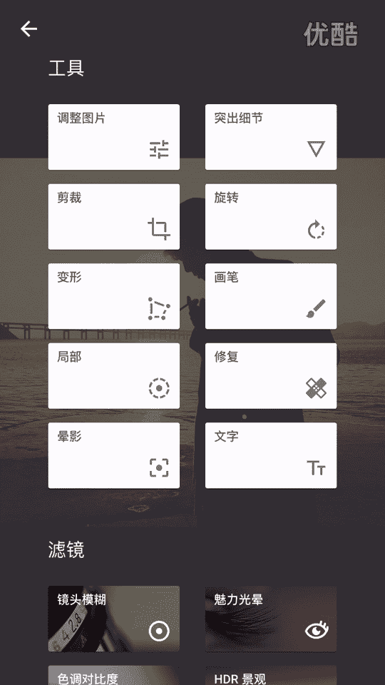
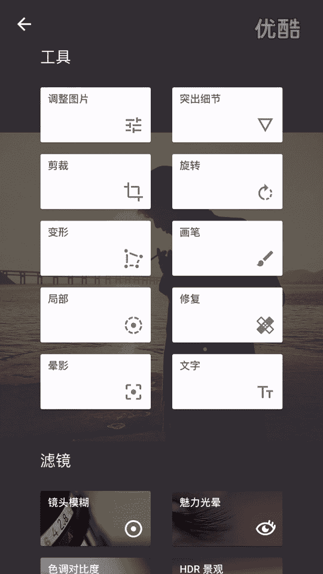
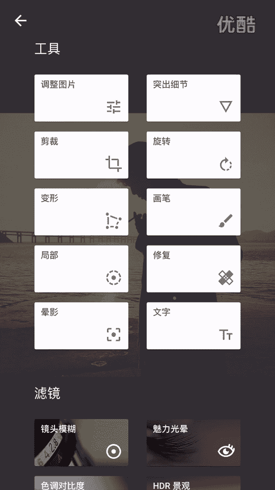
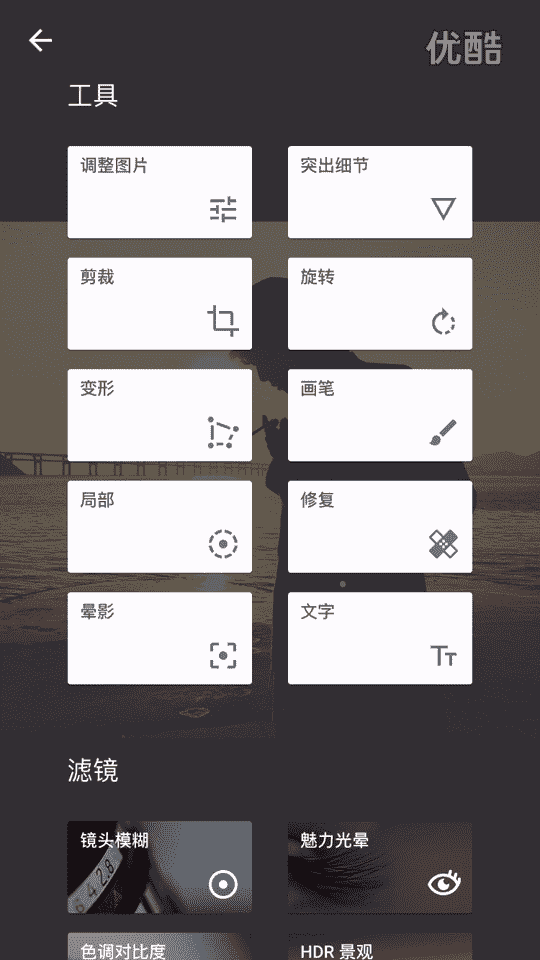
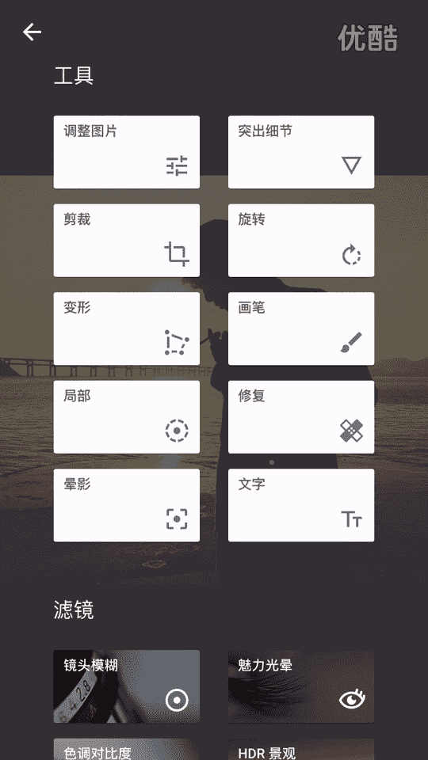

# 1、20游绅度最牛修图视频课：01修图软件的介绍

大家好，我是剑桥的老师。那么我们今天来上第一节修图课。在上这些修图课之前，那我们需要先下载四个软件，是我们到时候修图一定会用的上的四个软件。那么大家可以看到第一个软件叫snap see的。

那么这个软件是用来调光的。第2个VSU这个软件是用来加滤镜。那么美图秀秀的话是用来疯狂的改变。人体的物理特征呢，那么face turn嗯其实也是用来那个。呃，修炼的。大家先把这四个软件下了，那么这个。

snap seed跟VSU美图秀秀都是免费的。大家可以看到face turn的话，那如果你直接在。苹果APP上下的话，它需要25块钱。但是如果你下1个PP助手。可以直接下载免费。

那PP助手的话可以下载任何所有的付费软件。那么。这节课。我们先来讲一下就是。这四个软件的一些呃用法，一些基本功能。以及一些。啊，使用了先后顺序。那么首先我们要明白，就是说照片分几类。那么第一类是实物。

第二类是景物，第三类是人物。大家记一下，拿笔记一下，就说如果你是修呃实物跟人物的话，只需要用到这两个软件就OK了。那如果你是要修一张人物的话，你需要把这个这个这个这个这四个软件都要用上。

能那我们首先来讲一下snap的一个功能介绍。大家可以看到打开这一张照片，然后点击。右下角这个铅笔的东西。大家可以看到那么多功能。啊，怎么用，那其实也不用管他。所以我们一般只会用到这两个功能。

就行了。点击这个调整图片，然后往上一拉，大家可以看到那么多功能。那我们到底用哪几个呢？

大家用笔记一下，那我们只需要用到一个亮度，一个氛围，一个高光，一个阴影。这四个东西。就够了，就不要再用其他什么东西了。亮度啊顾名思义啊，就是那个调它那个曝光补偿了。过曝过量都是不行，调了一个合适的。

亮度。这两个不用管它，那实物的话，我可能会加一点饱和度。饱和度的话就是一个色彩的。鲜艳程度嘛，氛围其实跟饱和度是差不多的意思。大家可以自己去感受一下，就说这些。

这几个功能就是说把它呃开到最大跟开到最小的区别在哪里？自己去尝试。那氛围的话呃，其实跟那个饱和度其实差不多的意思，就是说让你周围环境啊更加浓。作为环境的色彩更加浓。更加鲜艳。高光的话，大家记一下。

一般是简淡的，一般是负的。那么高光一般怎么用？高光就是说你给大家可以看到，就是如果你加亮的话，可以看到哎。这种天空的细节就没有了，它就会有一些光这种。光就把那个细节没有了，就说高光一般是简淡的。

把天空中那些呃曝光过度的光减淡。就会可以清晰的看到那些天空的轮廓，那白云也出来了。所以说大家只需要记住把高光高光基本上是简淡的就行了。还有一个阴影。啊，阴影就是黑黑呃黑色这一部分的。黑嘿的这一部分。

然后大家可以看到，如果剪暗一点的话，更加有感觉。这个也是没有没有什么定性的。有时候我们需要那个加大，有时候需要简单。明天再缴费，反正审核通过了缴费就简单。那么。锐化的话锐化跟结构。结构就是。更大的锐化。

那么锐化什么意思呢？就比如说一张500K的照片。你锐化了之后，它可能变成两兆。就是可以增加你照片的清晰度，就增大你照片的质量。所以说一般我们锐花要加到很大。但同时有一个不好的地方，就说你锐化加大之后。

你照片那个颗粒会变多。但是没有关系，那我们后面会有软件可以处理掉。所以说大家记一下，那么snap我们只会要用到两个东西，一个是调整图片，一个是突出细节。那其他其实基本上很少用的上。

调整图片用了什么？亮度。氛围高光阴影。突出细节锐化。就这个软件大家一定要一定要把这5个功能都用上，你才能啊。

修出一张非常好的照片。

我们来讲一下VSU那么这个软件的话。它是一个滤镜非常多非常好看的这样的一个软件。但是如果你的。滤镜直接在上面买的话，都非常的贵，也非常的必要。那么我们可以在淘宝上面买一个5块钱的账号。

这样的话你就可以破解它117个滤镜，只需要5块钱。那么这个软件现在用的话是要翻墙的那大家需要下1个VPM。来翻墙来登录这个账号之后，就可以永久的使用了。具体怎么用，淘宝会告诉你。

那么大家可以看到先来看一下这张照片啊，先打先比如说你。你打开这软件，它自然会弹到这个界面。那我点击这张照片，然后点一下这个东西。先挑一个滤镜，那比我比较喜欢铃木。啊，可以看到这是一个滤箭的浓度。

我喜欢浓一点，淡一点，看自己个人审美。就觉得修图它是一个个人审美的体现，就是说很多参数它没有一个固定的界限。就我们平时可以通过一些杂志一些微博。一些摄影公众号去看一下，去观察一下就优秀的作品。它的。

色调跟。构图什么样子，他一些照片的风格，就你看了多好的东西之后，那么你脑子里面自然会过滤掉那些不好的东西。就是它是一个积累的一个过程，是一个人审美的体现。呃，点击右下角这个圈圈。嗯，你选一个滤镜。

OK那我们点击这个小三角。嗯，再点一一下这个。哇靠，那么多东西哎，那么多东西我们那里怎么用？不用管它，那我们只需要用到。这两个东西就行了。S叫阴影色调，就是黑色黑黑的这一部分。的颜色。呃。

高光色调就是亮的那一部分的颜色，那我们只需要调这两个东西就行了，就一定要调。这样照片才有感觉。这也是我修照片的风格。就是如果大家喜欢我的照片的话，就一定要跟着我走。我个人比较喜欢绿色跟紫色或红色。

就是这三个色是我用的比较多的阴影色调。那我先挑一个绿色。调一个我自己喜欢的浓度，然后点击这个圈圈。点击这个圈圈，点到高光色调，那我个人是比较喜欢。黄色嗯差不多了。一张照片就出来了。这是一个基本的用法。

就是大家只需要记住。VSU选一个滤镜啊，调一个阴影色调跟高光色调就完了。就那么简单。啊。又来讲到一个大家喜闻乐见的。美图秀秀。那么只需要大家只需要记住就平时用哪几个功能就行了嗯。

就大家千万不要用那个一键美颜。这个效果用起来就非常的假。😊，非常的不好看。呃，磨皮美白的我建议大家也不要用，就一旦用了之后，你会发现整张照片的质量会变得很低。其他的也不说了，就是我们要用哪一些？

就第一个是。瘦脸瘦身这个。第二个是增高会用的比较多一点，就是说有些兄弟身高不够的话，可能需要增一下高。然后眼睛放大就是放大你的眼睛。然后你去黑眼圈，它有一个非常特别的办法，非常特别非常。

就是这种隐藏功能啊在里面，待我会跟大家讲一下。就那么多，就这4个。拿笔记一着。然后fiston。face特呢是一个非常强大的一个磨皮的软件和一个加深你细节的一个软件。那么我平时就只会用到两个功能。

第二个是平滑，第二个是细节，平滑什么平滑就是磨皮。我一般用更加平滑。那么大家可以看一下，就是。比如说膜呃磨膜这个鼻子哎哎哎哎，你可以看到。但冇啊都没买。嗯，是吧。它可以磨掉磨的非常仔细。就是一个磨皮。

大家记一下，平滑就是磨皮细节的话，它就是一个锐化。可以局部锐化，比如说我抹一下这个眉毛哎。诶。是吧是吧就眉毛眉毛蛋的兄弟一定要学会用这个软件。OK那么我们这四个软件的一个简单的介绍就到这里。

那么最后帮大家总结一下，就说这四个软件你可以看到它其实怎么说呃，有几个都是英文的。大家可能会觉得很复杂，其实并没有大家只需要记住就我们平时用的是哪几个功能。哪几功能用的比较多啊，然后其实就OK了。

总结一下snap seat有哪几个。第一个亮度，第二个氛围，第三个高光简淡，第四个阴影，然后第五个锐化5个功能。The VSU。第一个是挑滤镜，第二个是调呃调那个。阴影色调，第三个是调那个高光色调3个。

美图秀秀用的美图秀秀的话呢。一个瘦脸，一个增高，一个去黑眼圈，一个大眼。face turn一个平滑，一个细节。那么。临场方今天这节课就讲到这里。我们下节课再见。对，就就那么点。

