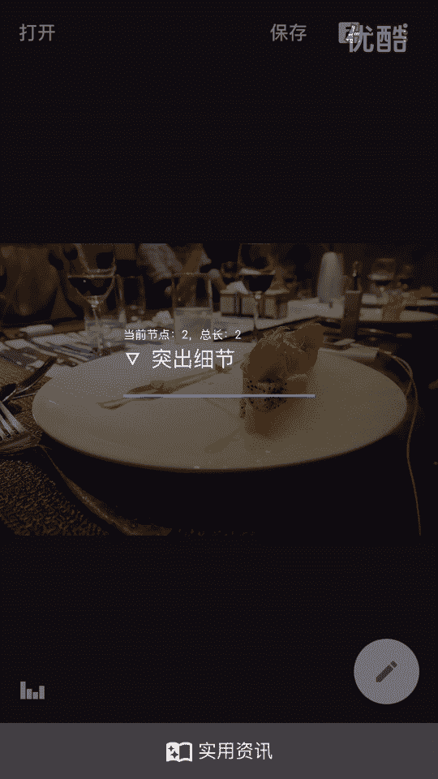
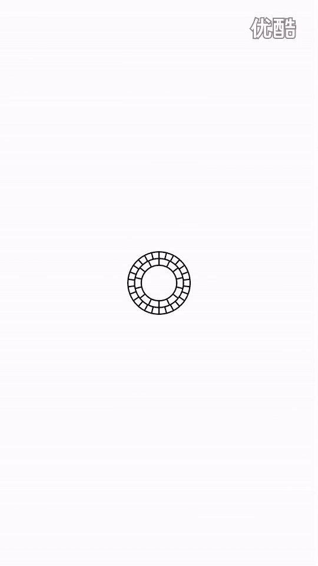
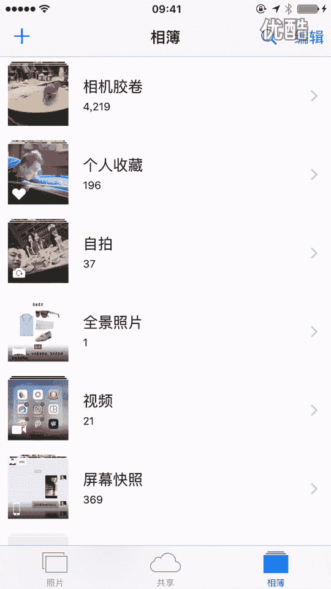
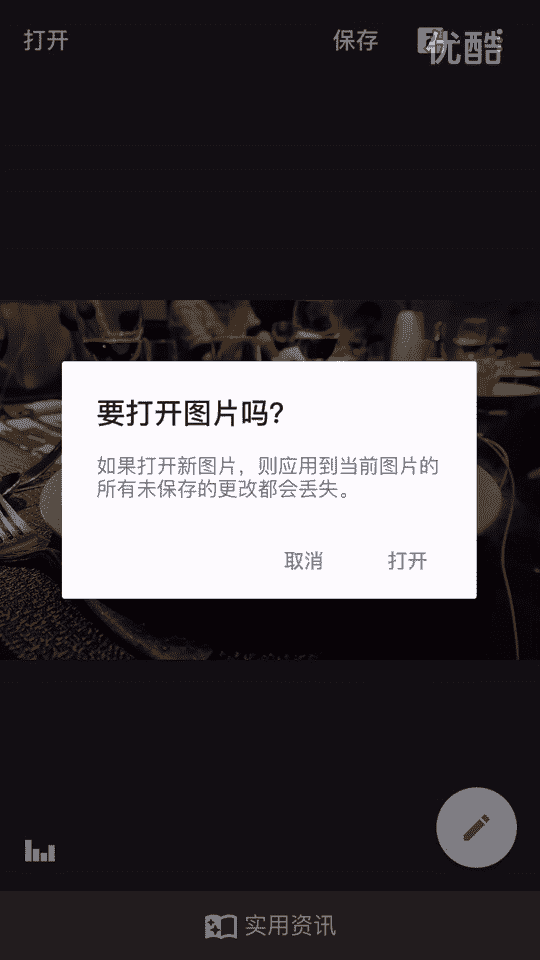
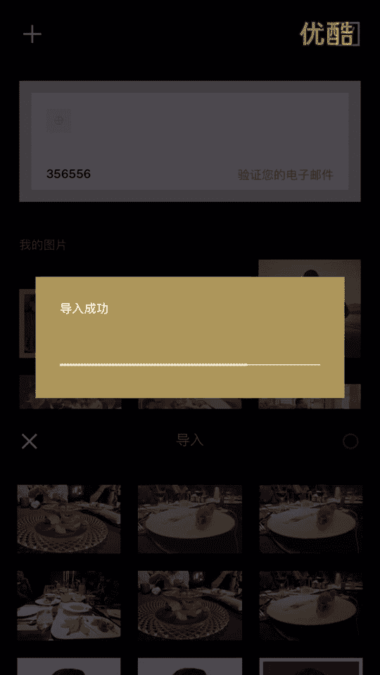
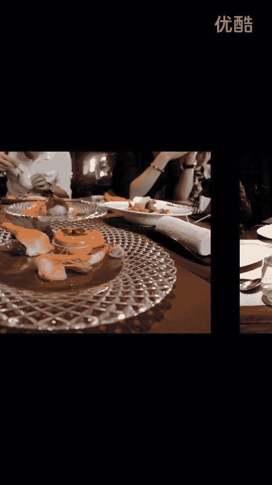

# 1、20游绅度最牛修图视频课：02修食物

大家好，我是剑桥导师。那么今天是我们修图课的第二节课。就上一节课没有看过的朋友，就一定要先把上一节课看了。再来看这一节课，这样才会有效果。就不要大家不要去跳跃的去看，就我们先把基础给夯实了。

就前面一节课介绍了，就说呃我们要用这四个软件去修图，就四个软件的一些功能介绍。那么我们今天就来修一张图给大家看，就我上节课讲过，就说图片我分为三种，一个是食物，一个是景物，一个是人。

那么我们今天来修一张实物给大家看一下。把上塔给拔了。这比如这张1物嗯。😔，先点击这个。😔，回劳，我们点击这个来调一下光。那么我们首先来观察一下，这张照片，我觉得。其实还行还行哦。

我觉得周围的环境稍微有点暗。那我可可能会稍微调稍微调一点亮度。调30差不多。然调个氛围。氛围不用太过。调一点点。饱和度要不要调呢？饱和度调一点点嘛，就实物一般会加大一点饱和度。

然后高光高光高光就不用理他了。阴影把阴影去掉，阴影去掉一点，阴影去掉一点点抓。那我觉得还应该调亮一点。打个狗。我点击这个。点击突出细节。往上一提瑞化。老豆糕。

好了，保存一下飞点击导出照片。就第一步就完了。

就任何照片，我们第一步都是先调光跟加一个。最话。那我们再来调个试。有点带不动。点击这个。😔。

添加图片。点击这个圈。我。点击这个。先挑滤镜，那我个人比较喜欢铃5。然后调一下这个滤镜的浓度，我觉得调到8差不多了。然后点击这个圈。点击这个小三角。再点击这一个。打到最后面。点击S阴影色调。

绿色或这个或这个。我觉得紫色挺好看。绿色也不错。😔，绿色吧，个人我个人比较喜欢绿色。もちだの？调到调到四差不多了，然后点击这个圈，点击这个圈，然后高光色调，点击这个哦，个人比较喜欢黄色这个光黄色高光。

黄色高光的话就有一种胶片的感觉，就大家可以看到以前这种复古的老照片都是发黄的那我个人是比较喜欢这种胶片感的照片。看没有用的嗯，然后点击这个又搞了一，我第一次粉，第二次粉我再锐化一下。哎，点击这个圈。

点击这个。点击这个点击这个点击保存照片到相册，点击实际尺寸。

一张照片就秀完了。那么我们可以来看一下，就这三张照片的不一样。那原图是这个样子。收藏。请说明天。说一个n斯。一6。这个期末他妈的屌啊呦。😡，哎，这这个是原图呃，原图这个样子。

只实拍的可以，但是没有什么感觉。那么修完之后是这个样子。这照片多了一种多了一份质感。

好吧，让我来接你的手。那我们再来修一桩。一点感觉没有打开。

Z。😔，这个。即。😔，醉了。嗯。打开VSU进行最后的调试额。

太考嗯。这个。这个。😔，等我等我等我等我等等我，这这ADU死了，他妈的当着人面。😡，Zi。哎，大家可以发现，就我们只需要按照我推荐给大家用的那几个。啊，功能就每个软件就只要把那几个功能用上。

就可以秀出一张非常好的照片了。这个。大龙啊。找楼大即个。这个。即。保存。保存。

大家可以看一下。没有20多秒，没事。说话太明显了，就是下自己看见来的打的。😊，可以看原图对，原图这个样子啊，没人。我操唉。

然后修完之后是这个样子，你干嘛？我操修完之后是这个样子。那么修实物的话，只需要用到。这两个软件snap跟VSO就ok了。我他妈的哎呀，真是。那么我们下节课就来跟大家讲一下，就是修景物的话，应该怎么修。

应该用呃哪几个参数。那么这节课就为大家上到这里，我们下节课再见。