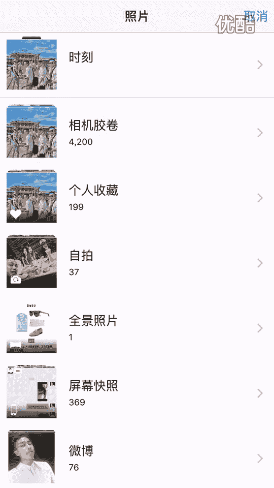
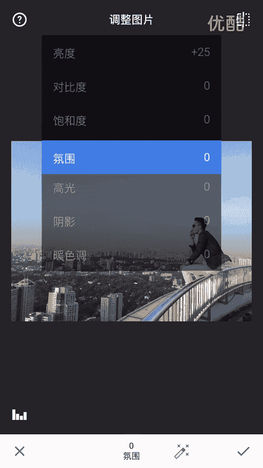
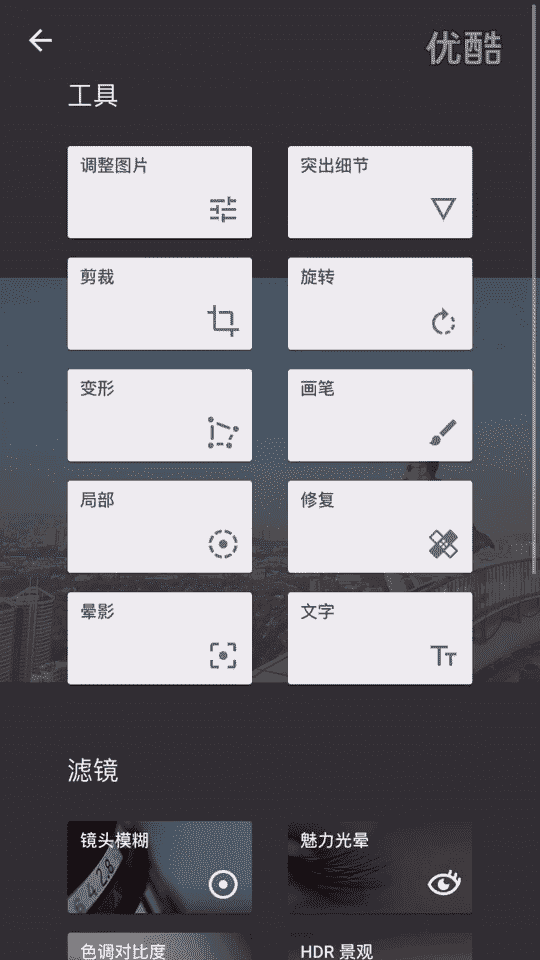
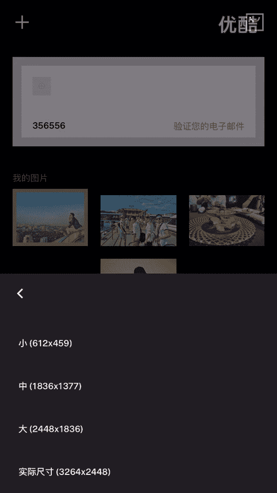

# 1、20游绅度最牛修图视频课：03修风景

大家好，我是剑桥导师。那么欢迎大家来到我们第三节的修图课程。前面两节课第一节课讲的是呃四个软件的基本用法。那在上一节课讲的是。修实物啊，到底应该怎么修？那么其实很简单。

就是说实物跟景务只需要用到这两个软件就行了，而且只是用到其中的几个参数。大家只需要把那几个参数啊，那几个功能。都用上，那基本上就可以修出一张非常好的照片。首先我们先来挑一张照片，那么。

这张照片是我去年在蜈之州的跟四个小伙伴拍的街拍。大家可以看到这张照片，其实人物神态其实拍的挺不错的，而且脸基本上也不用怎么修了，就说主要是环周围环境跟天空，怎么去修一下，怎么把那个白云显现出来。

把蓝天更变得更蓝。OK那么我们先来点击右下角这个小铅笔。

然，点击调整图片，那我们先来调一下光啊，我想调暗一点。呃，想调亮点，就是小伙伴的脸上太黑了。嗯，O。然，调一下氛围，哎哎，大家可以看到这天空变蓝了。氛围。我调到了100。呃，高光简淡。

剪剪嗯剪大家看下天空的细节出来。阴影。英语英语。Yi。音加一点。减一点减。嘉瑞华。😔，高走。おれが。瑞华。😔，打个。Gu。啊点右下角这个。点这个这个这个这个局部。点进去。然后点这个点一下。

调一下这个范围，它可以局部的调天空。哎，我想让天空变得更蓝一点。调亮一点，然后调个对比度，调个饱和度。打个勾，然后我们再来。再来调把天空调一下，再点一下这个。调亮一点点，调个对比度，调个饱和度。

嗯。然后脸部比较黑嘛，那我可以这样直接的调亮。打高。嗯。基本上就点击保存。就 ok 啦。调个四。然后06吧，我觉得06这个也挺好的。不道干什。好吧，昨昨天昨天跟。😊，から。我们的。在做。我上来的。

昨天你好啦。

大家可以看一下。你叫我多。嗯，收藏呢。你告说那边。嗯。原图这个样子。看天空很暗啊。修过之后这个样子，我靠。他妈的大早上的结果还赢了。这个天空。这个天空多么的湛蓝。这颜色调一下，我操。瞬间爆炸。

这边要补的没有一个速度知道吧。我们再来修。另一张给大家就是印象深刻一点。

我不。哎，去哪去了？你结束我的走。不要歉不能。掉回去了。即系装。

用你两个手指可以放大缩小这个范围。就是我想就脸部就亮点，我就缩到这脸部就稍微亮一点就行了。这个是外地达的兄弟，就每个每一个兄弟我都会带他来这边，就南京这个。最靠谱的天台去拍一张照片，这风景实在太好了。

She。这局部功能非常的好用，可以调局部的颜色。痔川嗯。再来一次。O。刘瑞华。

老师。调颜色。还是以前那个套路嘛，哎，瞧个找个滤镜06，我觉得挺好的。

却只是。😔，喂。嗯，绿色吗绿色。黄色高光嗯黄色高光嗯。嗯。再热华一下咯。再加点朦胧哦这个。这是什么东西？这叫褪色，就是说让照片更加的模糊，有点朦胧的感觉，朦胧的胶片感有点模糊的感觉。老照片。

我是比较喜欢这种照片的风格的。然我保存。

那原图什么屌呀？原头这个样子。那些我之后。😔，就然这样子。😔，Soang。😔，天空更加蓝，让建筑物更加分明，然后皮肤也稍微好了一点。这些人我还没怎么修。那么其实修景物也就是这几个功能。

其实跟实物是差不多的。就说很多兄弟他可能看了修图课之后，他可能。还没有能修出跟我一样好的照片，为什么？因为他审美跟我不一样。这修图它体现的是人的一种审美。所以说我建议大家去提升一下自己的审美。

那么通过什么样的方式去提升呢？就大家平时一定没事，一定要多去看新浪微博，一些网红，一些时尚博主啊，时尚微博、一些官方微博都有非常好的照片，大家去可以去参照一下。去看一下别人的色调跟那个摄影风格。

然后调色风格。很多微博都有。大家去留意一下，然后觉得好的照片可以保存一下，就你见了多好了之后，那里面那你心里面自然会过滤掉那些不好的。好了，今天的第三节修图课就讲到这里，我们下一课。下一期啊再见。

