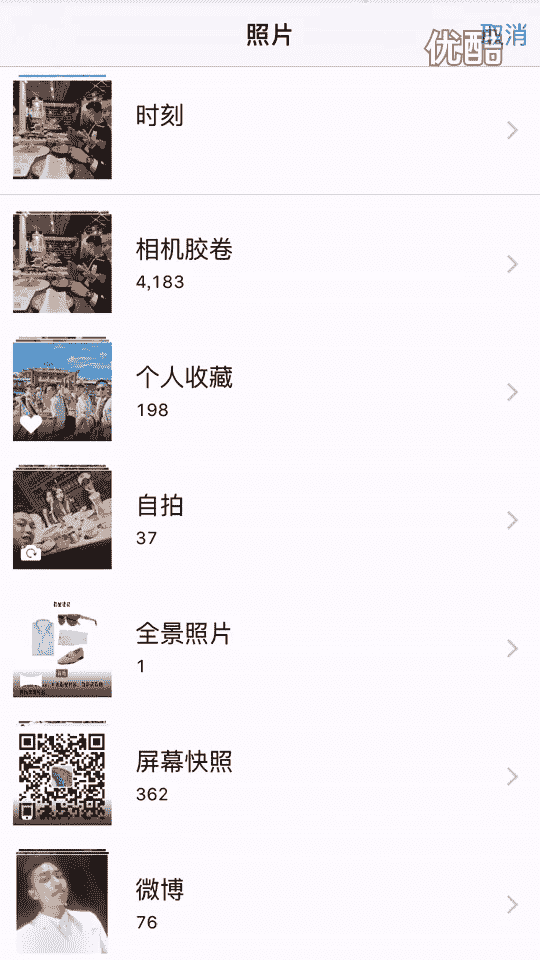
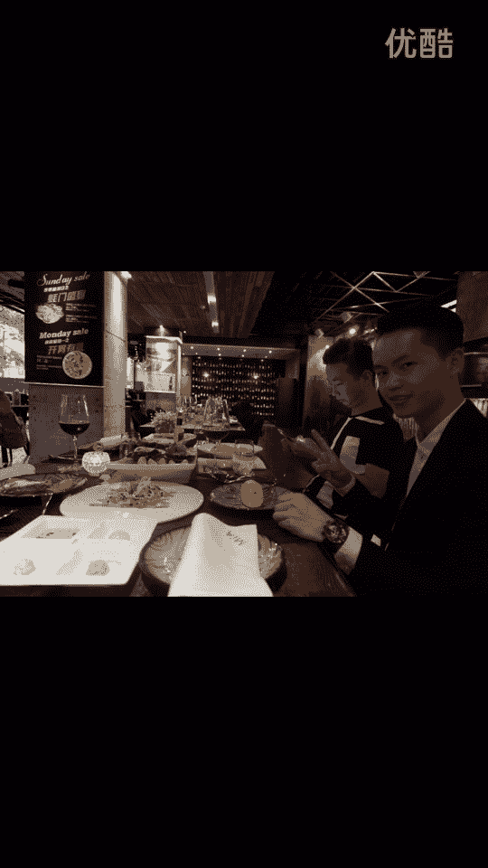

# 1、20游绅度最牛修图视频课：04修脸部

那么今天这课也是大家非常期待的，也是最精彩的。修炼对，就如何把一张哎。就是这么朴实无华的外表，就一瞬间就变成网红脸。啊，这也是很多兄弟嗯都想学习的。那么在修装图片之前。啊，我们先来给大家普及一个概念。

就是一个微整的概念。对，就首先我们要了解一个人脸的。面部构造。那么大家可以看到。张照片就。这位兄弟的脸庞，那其实我觉得这位兄弟。呃。长得还行，就可能这个角度。P的。稍微有点嗯显得这个脸部轮廓不是很好。

但是我们可以通过我们的后期去调整。就说我这也就说到我们这个修图课的意义。说有时候我们在一些比较好的呃比较高档的场合，或者说一些比较重要的活动。然后会留下一些呃记录生活的照片。但是那有于一些小伙伴啊。

拍照技术实在太他妈糟糕了。就导致照片实在看不了。啊，但是我们学会了修图之后呢，就说一张本来啊就不怎么样的照片，或者说是刚好拍了我们。这个人脸的死角的时候，我们可以通过我们的修图技术。去把呃这张脸。啊。

修复到一个比较完美的一个状态。啊，废话勿多说，我们直接来讲干货啊。首先我们先来观察一下啊，这位是兄弟的脸型。就脸人的脸型。大家可以看一下。算一下。就说嗯。😔，这个地方叫额头，对，额头。然后。嗯。

这个地方叫鼻梁。然后这个是鼻尖嗯。😔，然后这个叫鼻翼。这叫嘴角，然后这叫嘴唇，然后这个叫下巴。这叫苹果肌，这叫太阳穴。这这块我统称叫脸颊，就脸嘛？脸型嘛。这一块叫咬肌，就这个叫眼角，外眼角和内眼角。啊。

眉毛这都是我们要去修正的地方。只要修的地方蛮多，大家可以用笔记一下，那么我们就直接开始。还是要先调光。今か啊。你不录了。唉，大半夜还要帮大家录这修图课，室友都叫我赶紧睡觉了唉。是为了兄弟们啊。

赶紧把那个修图客给出了，就大家期待已久了。就明天早上6点还要起床去集兑啊，有个升旗仪式。唉，警校真的是辛苦啊，不过也是挺锻炼人的。😔，来，大家可以看一下，我们先调一下这个亮度。调到一个曝光正确的位置。

就你可以看到，如果你要追求脸部。呃，够亮的话。那这个实物的话，他可能会爆掉，所以说我们要懂得把亮度跟氛围。这两个功能相互协调一下，就比如说我不用调太亮，我调了50。把我份围加大，哎，那脸部自然会。

清晰起来，那后面的话高光我们简单一点。阴影的话我们去掉。😔，那么我还有一个局部调光的功能，可以把这个脸部。加亮达勾劳加。一个锐化，那么我们第一步。😔，的调光也就OK了。那么我们马上接下来。

就到了一个疯狂的去改变一个人的。😔，物理构造的一个软件叫美图秀秀，我操。😔，这个什么亚洲四大学术啊，美图秀秀排第一啊，大家可以看一下啊OK。那么修脸的话，我一般喜欢调到四档。加四档话比较好操控。呃。

就是为了那个大家可以看到比较出效果的话，那我就要大修了，就是说修的可能会把张脸会修的面目全非。但大家要记住一点，就是我们学会这个修图课，修图的意义，并不是说把你的脸修的你妈都不认识。

这个不是我们的这个目的。我的目的什么？我的目的是让你掌握啊，大修，就平时你自己小修一下去也就OK了。既然你能掌握到大修。那微整一下其实也是没有什么问题。那我们开始吧。就是我们瘦脸。的话就尽量是从外面。

外面的这个部位往里面推，就不要从里面推。就不要这样子不要这样子。啊，不要这样子。这样子不好，这样子那个效果出不来。那我们从。脸的外面往里面推就放大一点。我们小小的哎，对对这个脸。动刀嗯，对对对。😔。

慢慢的把这个脸部轮廓给修出来。😔，把这咬鸡变小，咬鸡其实咬鸡很大，咬鸡大其实是每个人都会有一点的问题。那么。😔，这下巴下巴轮廓基本上出来。嗯，然后他这个。苹果机稍微有点大。苹果机稍有点大。

然后鼻梁的话嗯。不知道怎么说，他鼻子有点奇怪，我也不知道怎么说，鼻翼我们稍微缩小一点，这鼻翼。买鼻梁，我们让他听下嗯。😔，嗯，佢。嗯。然后身边的室友已经按捺不住要过来看了啊。对。

然后这个鼻子就修复的其实还算成功。对。你看这个牙齿有点。不怎么说，他们有点奇怪。😮，我也不知道怎么搞啊，无所谓，差差不多差不多。然后。😔，这额头哎。😔，这个额头就有点奇怪，我妈了。把它修复下修复掉。

你都。嗯，然后嘴角就嘴角我比较喜欢微微上扬，就有点。微笑的感觉嗯，嘴角微微上扬。😔，微微上扬OK然后他眼睛。😔，嗯，眼睛他妈的把眼外外眼角开一下。开个外眼角。眼睛这里有点不知道怎么说呢，我再开一下。

可能有点有点眯。没关系。粉丝点。嗯。怎么说呢？这个兄弟真的是。😔，开眼角开眼角眼角开眼角。是有啥，就妹子最近比较喜欢开眼角的，我们也来开个眼角给他们看一下啊。嗯，下巴可以稍微拉长一点。嗯。

这整体轮廓差不多出来。😔，嗯。无敌是多么的寂寞啊。😔，眉毛可以拉长点。嗯。然后这位兄弟就嗯。怎么说呢？😔，还是有点奇怪啊，都把再把连试试。再把脸瘦小点。😔，嗯，室友已经看不下去睡觉去。That one。

哇晒得我带上害真的。😔，为了兄弟们在。😔，这个搞到宿舍真的是。大家赶紧报课，下那个赶紧报课啊。修图课程会不定期的更新，就会有一些复杂场景，就走具体怎么修，都会定期的更新给大家看。超哥也很辛苦了。

每天都要集兑。Dianing。最近还被搞了个通报批评，哎，烦的要死。专属管理吗？大可看下，卧槽卧我槽，你看即细果哎哟。哎呦喂。😔，呃，都是。这个鬓角可以鬓角把它那个鬓角拉长一点。修饰一下这张。怎么说呢？

😔，嗯，并不是非常英俊帅气的脸。大家可以看到这个拉长之有点奇怪啊。啊不要拉长了。还是有点奇怪，这个。不怎么说？😔，没事，待会我们还可以把线模糊的地方处理一下。嗯。差不多了，然后我们再换一位兄弟继续。

那你看这兄弟没有下吧，我操。这兄弟他妈没有下吧。😡，我操，你看这个下巴，他妈的兄弟，你看我操这这他妈的。😡，没有下巴怎么办？那我们只能。帮他捏一个小巴算嗯。就说我们要把张人脸想象成一个橡皮泥。

就不断去蹂躏它，蹂躏蹂躏蹂躏蹂躏。有你邮箱吧。嘿，室友楼笑室友楼笑。怎么了？笑死了，兄弟。😊，4月8下了。我什。笑了，呵呵。下午啊。什么。有有。呵走走啊。怎么了？めてこいちゃ。别给我想你我想说。

讲呀讲呀。想啊。笑容啊，真的是哎呀。😊，这以兄弟鼻子还行啊，鼻子还行。我日你妈。😊，一快不来，你讲吧讲讲讲笑文。さ日は。这个什么。除非你不需要超，所以就不需了。控制不住啊，笑容啊。😊，えそに。怎么办？

ゃない。上啊。😀，是不是傻逼呀？😊，你能不能打字给我说。😊，不下来。因为我胖子你太好玩了。😊，对你看这皱的地方吗？拉拉直拉拉平，拉拉平这种褶皱的地方，我们到时候可以抹掉，就是我们先把这个形状给打出来。

这个该是挺简。そ话话。我会觉得那个没办我。原叫。讲文。讲啊，我操。你俩真讲嘛，我操笑什么。😊，大家大家一起笑一下吗？叫来说下。我这不。也不错，没有，丑哥在那讲课。😊，然后呢然后呢。哎呀。

室友真的是哎这室友。😔，为啥你这么高谱，然后胖着去厕所。然后呢，然后呢。上手に悪いた。啊。我你妈瞎鸡妈屁。😊，我是说了啊。然后呢。没有。😊，那有什么好用啊。笑点何子。不知道算出来了，叫什么。😊。

涛哥说什么了？涛哥没做。我给吓。嗯。🤢，这两个人。好说不要紧。嗯。没做明啊。那笑脸是会家笑脸我知道。😊，我的消服一。等法子。希望你们永远停下来。😊，下句晚上他就。行啦。But。😊，我我一起都俩。😊。

呵呵。😊，对，然后基本上这个轮脸部轮廓的，你可以看一下，我操我操兄弟们。我操你可以看下，我操。我操哎呀哎呀哎呀哎呀哎呀。这是这是批前和批后的对比。对。是不是很神奇，兄弟们，你看这个下巴我靠我靠我靠。

回过送音5卡乌卡哇卡。所以我们当年。嗯再再点一下，看啥效果，我这一对比看一下对比他点很高的。😊，就大家可以看到，就第一步是先把这个轮廓打出来然后我们第二步是。

用这个faceton去把那些褶皱的地方给磨平。😔。

特对是。就是他这个是用了一个平滑的平滑功能，就把这些褶皱的地方给抹掉。哦，戴哪塞了当时。啊嗯。咩。人到能哥能回到能放个下，就妈屁。那不。那那可以。这这这个效果真的真的强啊。对。

大家可以看到这个褶皱基本上不见了，那我觉得还不过瘾。那我们再来一次，他妈再摸他一次，他妈的。😡，褶皱哎，没了好的，我们再来一次OK。再来一次OK。😔，可以看到这脸睛本上磨没了，不过没关系。

到时候我们后期还可以处理一下。嗯。嗯ふ哼。チ子。嗯。什么茄子。😔，嗯。嗯。搭勾，然后最后面我们用细节细节怎么用。就细节相当于女人化妆用那个侧影。知道吧？侧影。你如果不懂侧影的话。

大家去那个百度一下侧影到底什么意思？那我先对眼部进行一个勾勒。把眉毛这样弄，然后头发也可以搞呀。😔，头发啊头发。嘴唇点下行哎。就不断的去磨磨磨磨那个。😔，把那个小巴磨出来。😔，嗯。高有そ。先界でで。

就不敢去磨磨磨。😔，魔魔魔魔。😔，5。是稍微磨了点过，不过没关系。😔，嗯。查下。😔，哦。😮，同家。没了。😔，洗洗。的一个自己。嗯，老庭华。😔，就把一个脸部轮廓勾勒出来。😔，嗯。行了。😔，谁在看黄片？嗯。

细节啊，把嘴唇眼睛哎哎哎哎。😔，细节沿着这个脸部轮廓打一圈，用细衣节。绕着这个脸部轮廓，不断的抹轮廓边缘的地方，不让去抹，就相当于一个侧影的效果，就让你轮廓更加明显。嗯。基本上成型了。最后加一个滤镜。

😔，嗯。用红色绿定好看。黄色。再加锐化清晰一点。然我再加一个朦胧的感觉。😔，有一个朦胧的感觉。这个叫褪色，有种朦胧的感觉。我靠。😔，这他妈是谁？😡，吓。😮，我操，再看一下再看一下，我操。😔。

呃，他看一下，我操我操。😔，我们来看一呀。😔，啊。看下原图怎么样。😔。

嗯。原图这个样子。看仔细了这个样子。喂。本来不过只管我把两张图拼下来给大家看一下。😔，嗯。怎么样？兄弟们。啊。查个修图技术靠不靠谱？全国独家最牛逼的。修炼技术。仅售268嗯。净手266。线下课的话。

300块钱。老包送啊。网络修图客线下修图客仅售300。就比某团队的什么什么什么。什么。😔，装逼修图克399弄坑货修图克啊。到靠谱的贝。怎么样？兄弟啊。哎，最后大家来关注一下我们的这个微信公众号嗯。

油深度。优深度团队。那么。😔，这。修图课的1。0课程。就4级。但是基本上融入了我所有的干货。

都在里面。后续的话会有更大的更新，就是说会加入更多更细腻的修图技术。比如说那。怎么去修这个鼻子，我会出一集视频。怎么修脸型会出一些视频，就每一个五官的每一个细节。我都会出一句视频，但你看到这个下巴。

我操不碍是。什么情况？你看。这个样子。都可以拥有一个完美的下巴。然后我们再来。讲一下，就说很多兄弟可能觉得我操你这样修徒，那妹子出去来约会，说我们是照片，知道呗？啊，这个是所有人都要问我的一个问题。

It。所以说你就不要修那么过，知道吧？就我教大家，这只是一种比较夸张的手法。就是说我建议大家修图还是润木细无声。就稍微啊修饰一下，微整一下也就okK了，不要太过。就当你学会了大修之后。

你学会再学那个小修啊，其实那个力度控制就完全在你的控制中。还是有兄弟觉得哦脸可能不用怎么修，但我告诉大家，脸是一定要修的，因为妹子也修。找妹子的照片呢，我们他妈的也修一点点呢，有什么不可以呢？

说为什么很多兄弟很担心这个。就他担心的害怕的出去约会嗯。这妹子觉得他跟照片不一样。为什么他会有这种顾虑？就是说嗯他除了这个照片OK或者说呃外形稍微好一点。货说的外形不好，只有照片好。啊。

他除了有展示面之外，他没有别的。呃，有优势的地方。能够去吸引妹子。所以说那我们。只要一个外形上跟照片差不多，其实脸稍微有点修羞过的，其实也无所谓。因为妹子也修啊，对，大家都是平等的。好了，那么。

本期的修图克1。0就为大家上这里。希望希望大家能多看几遍，多去学习。那么我们修图克2。0再会。