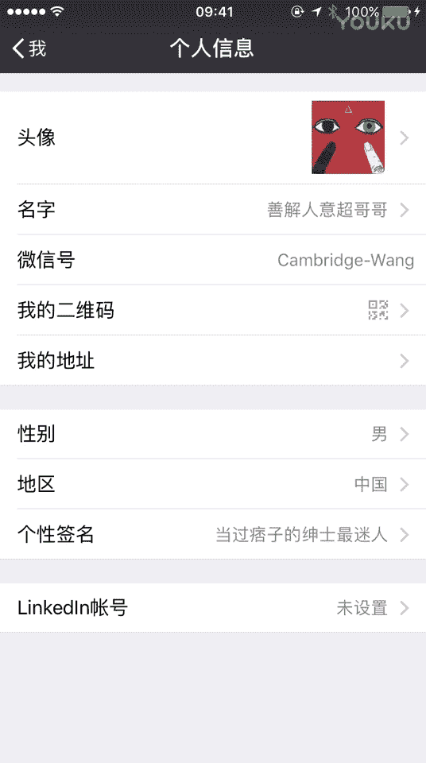

# 1、20游绅度最牛修图视频课：第5节 鼻子的精修以及修复磨皮过度的问题_高清

大家好大家好。那么今天来上休。有点咳嗽。今天来上修图课的续集第二集。那么今天想来给大家讲的是。关于用fsta磨皮然后磨的稍微过度了，嗯，然后磨的整个人的面部轮廓都不见。那么我们应该怎么去？完善这个问题。

嗯。

然后这个是我的微信。

大家可以加一下加一下。在干人？首先先我们再来复习一下前面的课程。好的。我的样改觉1到44的。

哦。嗯。啊，我们。继续来来休下这位兄弟兄弟。我都叫个鸡巴你。这嘴唇有点厚啊厚啊。然后嘴角可以微微上扬。M。下巴往下拉一点。圆润一点。不要男人下巴不要太近。O。基本成信嗯。苹果七有点大。看你看呢。

这个轮不嗯轮廓嗯，OK的。啊。那么那么。现在大家要仔细看。也是在修脸的过程中最难修的鼻子。我们应该怎么去修？首先大家可以看到这位兄弟的鼻子呃。嗯，这个怎么讲呢？要冲天鼻，这鼻孔都会翻起来。

然后这个鼻梁也是歪的。还好还好还好呃，有我有我。😊，那个在帮他拍照的时候，选了一个可以去修复的角度。那么现在大家一定要仔细看，而且要反复看嗯。O。那我要开始了开始了。首先首先要把这个比一稍微小一点。

就就你可以向大。大家去打那个玻尿酸，都会先把这个鼻1去。呃，消一点一点。然后这个鼻尖一定要弄起来，然后这鼻梁要弄直。具体。要把握一个度，那就要看大家的审美。是吧。好菜啊，好的。然鼻孔孔可以。

不那么往外翻，然后藏起来自己好厉害。把鼻当的鼻梁挺起来。O就不断的往中间去挤，把那个鼻尖挤出来。左右左右左右左右左右左右，嗯，然后这里稍微有点不太协调。O。嗯。嗯，不断的去微调。😔，怎么样怎么样嗯。

超哥牛不牛逼？牛逼。我操。哎呀，这个稍微修的有点过啊，就就不要那么好看啊，那个稍微丑一点。嗯，稍稍微长一点。说出来嗯，其实我我想跟大家讲的是什么呢？什么呢？😊，就是是你这个人就你在自拍的时候一定要要。

留有一个小小的角度去为后期去做准备。为什么呢？如果你是直接的一个正脸。啊，啊然后自拍自拍，然后去修修。其实其实改动的幅度是很小的，就一定是不要正对镜头，是稍微有点点侧，这侧脸是最好的最好。嗯。

因为他有一个角度可以让我们去修。大家可以看到这个鼻子已经非常完美，这鼻梁是挺，然后鼻尖也出来，然后鼻翼的话也比较标准。大也可以看到这个比例其实嗯也是比较协调。然后鼻子鼻尖、嘴唇，然后下巴嗯基本上是。呃。

一个水平线上这样是比较好的。还有15。帮大家普及了一个微整的概念。那么基本上嗯这个脸就这样是OK了。哦。那么我们再来帮他磨一下皮。大家可以去下载festton2。它里面有一个关于磨皮磨的过渡。

然后你去修复的功能。

自己。我不要习惯睡更加平坦。要磨起来快。的幅度调到最大大阿摩你看哎哎哎没了没了没了没了哎。继续继续嗯。诶自己。诶诶诶。诶诶。诶诶。嗯。う。越塔就很膨胀。对何。然后一个人家喊冲在我。

那么么这样的一张磨皮过度的照片怎么办？点击这个纹理他妈的配现登报还是直接当当面吧，妈登报啊，你他妈的有点过分。怎么都不抽。就往这个脸上去摔害了个车灯。赔以钱不就好了，还真报道。扣个来。民警想不想干啊？

😊，OO，那么他脸上就会恢复一些颗粒程度。嗯，就显得没磨皮没那么过。然后就想跟大家讲这个，但首先大家先要下载这个。Fton2。那么这节课就跟大家讲到这里。敬请期待我们的下期课程。好，再见。啊，差多。

旅个。