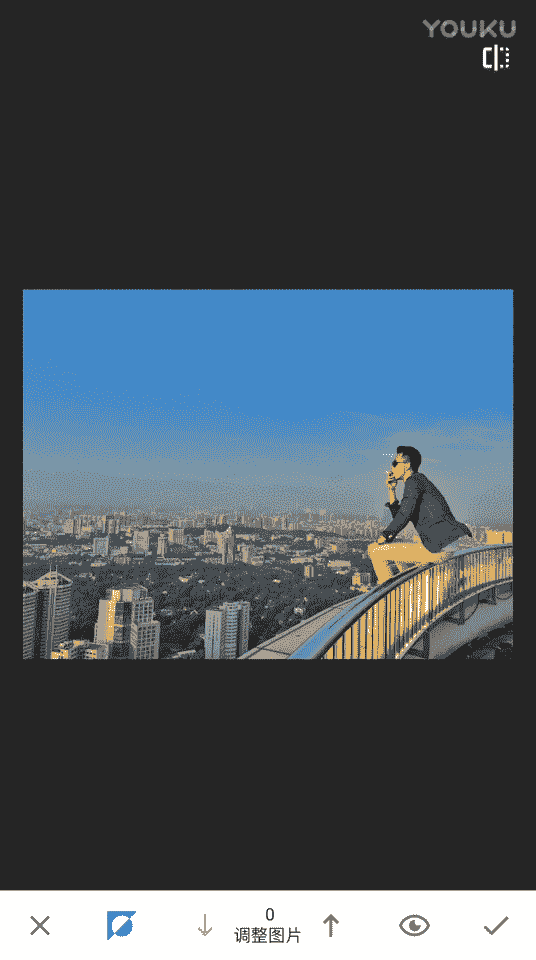

# 1、20游绅度最牛修图视频课：第6节 蒙版功能_高清

好，大家好，我是剑桥导师。那么今天就来为大家分享。呃，我们修图和更新后的一个课程。然后这个是我们团队的公众号。就是现在呢就发现有很多的嗯。盗版课程。就是很多兄弟看到我们的课程，但还不知道我们是什么团队。

那么请大家关注一下我们的公众号。那么废话不多说。直接来讲我们今天要更新的课程。OK那么看了。前面我录制的4集。修图课程呢相信大家已经对修图技术嗯有所提升。但是我们在修图和修图里面还遇到了一些小小的问题。

需要去解决一下。那么今天来讲一下the snap C里面的。😔，哦，我先找一找。有点。对。有什么？孙兰。你单独控制时也行。反正只要各体各的意见。搞我。我不样的。那么大家可以先来看一下这张图片。

首先观察一下，就可以看到这个天空还是有一点细节的。那么尤其像我们去修这样的天空啊。我们需要去。压低天空的高光，然后这个天空细节就可以出来。啊，大家看到没有受害人和我还不过瘾。😊，我再来一次。

OK那你压的过低的话，它天空会有一些颗粒，那我们适当调整一下。就不要压那么低。但其实我今天想跟大家讲的是。呃，一个蒙版的概念就蒙版蒙版这两个词是来自于photoshop。首先那我们调这个氛围的时候。

这是我们平时用的最多的。就是可以让天让天空更蓝。让周围的环境颜色更浓。大家也看到嗯这天空马上就蓝了起来，但同时呢有一个非常重要的问题。相信大家也知道。就当你分为拉高的同时。你脸不。也会变黑。就谢实。

这个时候就很多人他喜欢你比如说这个这样。他喜欢用嗯局部。去那个。去那个调亮他脸部。对，就这样子。这样其实是很不自然。那我我们。啊，为了追求完美，那我今天就来跟大家讲一下今天最大的干货。O。

打开了点击。这个位置。这里。然后再点击查看修改内容。

点击调整图片。电机。这个东西。诶。张可看到。这是这张照片。原来的样子，然后我们点击这个。这是我们修了过后的这样子，然后我们把这张图片放大，嗯，可以看到这个脸很黑。

这个时候。😔，我们轻轻的用我们的手指去擦拭掉我们不想让它变黑的部分。比如说脸。就这一部分给擦拭掉。嗯。到栏杆这一部分。嗯， ok。大家可以看到，还有这些嗯。对，这这个其实不用。

就是我们可以把脸部这些黑的去掉。那么以此类推，嗯再来一张。啊啊。我了是不是？要干嘛干嘛做那个做那个作业。随便编的嘛，用一个针的装西蒸一下，就你你你你从我那个包包里，没事没事，没包包里面那个蓝色。

啊，那就说这张好了。牛逼啊，这个。氛没调到最大嗯，然后你看天空色彩会变得很蓝，然后我们导勾。然后从这里面。调到这个这里。电视。哎呦，我操。屌你证。点这个。然后抹掉。Hm。就把你不想让它变亮的地方抹掉。

这个就叫做蒙版。OK那么。这个隐藏功能呢。这是snaps里面隐藏的蒙版功能，这个功能就解决了我们。氛围调的过高，然后脸部变黑。然后去处理的更完美的问题。身份证号码。你写多啊。实现他都能。你问身份证号码。

随编的。我我还我还是了解。以及。Mm。

OK那么这节课就到这里。