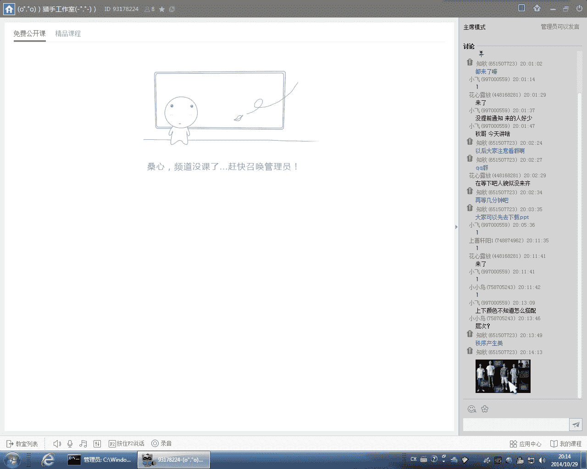
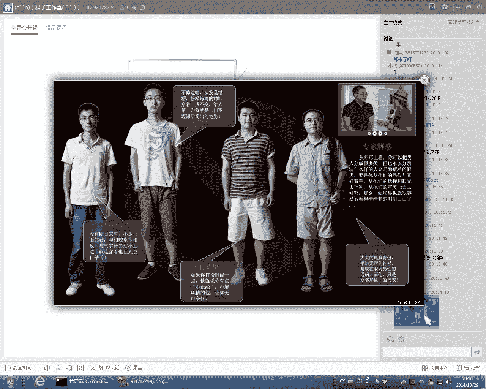

# 1、21知秋《时尚型男养成计划》：20151029服装搭配核心法则：20141029服装搭配的核心法则上

嗯。Yeah。嗯。好的，那个我们今天正式来上课哈，都来了吗？😊，那个现在都能听到声音吗？好。好的，我们今天呃正式来讲我们的那个。我们那个网络课程的第三节课啊，呃今天我们来讲一下那个服装搭配的一些问题。

呃，那么关于搭配这个问题呢，相信都是大家非常非常关心的啊，也非常非常的困惑的。呃，就大家平时在那个给自己挑衣服的时候，是不经常遇到那个啊比如说我买了一件衣服啊，呃，但是我不知道他应该搭配什么样的裤子。

搭配什么样的包包。或者是说其他的那个配饰。对不对？是不是经常有这样的那个那种困惑？那么这里我想问一下大家，就是说呃大家对搭配。呃，这个主题你们觉得最困惑的地方是什么呢？我者。嗯ん嗯ん。呃。

或者是说大家呃就是在搭配那个当中最经常遇到的一个问题是什么？呃，可能有的很多同学会说呃风格对吧？不知道怎么搭配这种或者是那种风格吧？呃，有的同学可能会觉得颜分。对不对？呃。

那么这个呢其实就是说呃我们在第一节课里面也讲到过。呃，大家还记得我们第一节课讲到的那些知识吗？美，什么是美？怎么样才能够产生美？还记得这个这个观点吗？我说。什么样的东西会产生产生美啊产生美感。啊。

秩序产生的。还记得吧？还记得这个观点吧。好，那么我们普通人就是说没有学习过服装搭配那个这方面的知识人，最经常出现的问题就是什么呢？我说没有秩序，对，没有层呃，没有层次感，其实也是秩序的那个一方面啊。

呃我们说没有秩序就不会产生美感。我们看一下那个这样图片。

呃，这个是我经常用来做反面教材的啊，也是我用的非常多的一个非常经典的呃几个那个。宅男的压力啊，大家可以看一下他们这这四个人的组装是不是完全没有秩序的。这样就一个是非常的脏非常的乱，对不对？

而且也呃几乎是没有呃我们所说的那种搭配的美感可言，对不对？纯粹的就是说只是把那个衣服穿到那个身上。我们说穿衣穿衣服有三种层次啊，呃一种是整齐。干净。呃，那么呢第二种呢就是。好看有美感。好。

那么第三个境界呢就是说你能够穿出自己的风格。呃，所以但是对于普通人来讲呢，很多人连干净整齐这个这个境界这个层次都做不到。那就像我们那个这张图片当中的这个四位展览一样啊，大家可以看一下。

他们的衣服是完全没有搭配的，对不对？无论是从那个颜色啊面料还是从那个廓形方面来讲，都是没有层次感，没有那个秩序的，对不？所以看起来就非常的乱啊，你经非常的乱了，你就没有那个。整体造型的那个美感可言呃。

那么还有关于颜色这方面呢，呃也可能也是很多人非常非常困惑的。呃，最常见的就是说上下半身的那个颜色面积是一样的呃，衣服的比如说呃我之前看过很多同学是用红配绿啊，然后上身就是很大很大面积的红。

然后下身呢穿一条那个。呃呃，长裤绿色的长裤啊，就整整一身的那个颜色面积看起来是5比5的啊，一半一半的那这样子呢也是我们所说的，这样就没有层次感啊，没有层次感就没有秩序。所以这样呃出来的那个效果呢。

就也是不好看的啊。那么其实呢服装搭配呢，它是有它自己的一个核心的法则的。不是不是乱搭的。对吧那我们今天呢我们就来讲，我们来看一下服装搭配的三个核心法则。

或者说服装搭配的三要素。首先是廓形啊，然后是第二是面料。呃，第三个呢是材材质。那么今下来分们讲这这三个方面啊。我们先来看一下那个服装的廓型。呃，我们说那个呃现在的那个服装的廓型呢，基本上可以分为那个。

欧美风格的那个路线和那个日韩风格的路线。那么这个可能之前在我们呃一的一些那个前面的课程当中也讲到啊，就是欧美风格的衣服呢，它比较注重服装的那个外轮廓。嗯。就服装的外部线条啊，就你呃远远看上去。

那整个人穿的衣服呢，它是有一个很清晰的外部的那个线条的啊，比如说呃成一个X型，又或者说成一个A字型啊，那比如说那种大风衣。那么日韩风格的衣服呢就会比较注重那个。服装的一些细节啊。

比如说会有一些那个精致的做工。呃，例如说在那个领口啊、袖口的部位啊，去呃用一些拼色啊，或者说呃放上一些那种小配饰啊，这样的一那种风格。呃，那么好，我们来看一下那个服装的廓型包括哪几种。

好呃服装的廓型呢其实就是对应每一个人的那个身材。那么说图上的廓形的主要有直线型，一个是H。呃T还有那个A型，那么曲线型的服装廓形呢主要有那个X和那个O型。呃，但是对于我们男士来讲呢。

其实呃比较多穿的就是H。呃那个梯型。因为H型的那个服装呢，就好像大家那个在图片当中看到的这样。是吧呃直筒型啊，H型也叫直筒型。那么这种衣服呢，它的那个肩宽跟它的那个衣服的下摆那个长度是一样的啊。

整体来讲就是呈一个长方形。那我说这种呃这种廓形的衣服呢是当下服装品牌做的比较多的。呃，因为这种衣服的廓形呢包容性是最强的。呃，就是说无论你是高矮胖瘦啊，还是肩宽肩窄啊，还是说有小肚子。

还是那个屁股比较大啊，各种身材的这种衣服呢呃那么H型轮廓的衣服呢都可以比较好的包容起来。啊，特别是在清冬天啊，大家身上都会穿多几件衣服嘛，对吧？呃，那么这种呃。当你的衣身上的那个衣服层次感比较多的话呢。

那么你就可以比较好的那个去遮掩一下你的身材的那个那个那个那个缺陷啊。呃，还有一个就是呃H型身材呢，任何呃任何身形的人都可以穿啊，无论是你是倒三角身材。还是说这膀比较窄。呃。

或者是说你的身材比较瘦的人都可以穿。好，我们来看一下第二种廓形啊。嗯，第二种廓形呢，我们叫它做梯形。呃，也叫做倒三角啊。呃，那么这种廓形的衣服呢对应的就是倒倒三角形产人。呃。

这种衣服呢它会把那个男士的那个肩膀的那个线条很好的。穿托起来。我们说男士穿衣服最好的一种廓形其实就是什么呢？就是你能够穿出一种倒三角的那个线条出来啊，就是肩膀宽啊，然后收腰。呃。

我们说呃每个男人都梦想着有一个倒三角身材。对吧就是肩膀和胸肌宽阔，然后收腰啊，那么这种身材呢就是被被称之为是男士最理想的一个身材，对不对？好，大家呃在座同学有哪有哪位同学是属于这种身材的。

就梯形或者是倒三角形材的。可能H型的比较多，对吧？有么有谁呃是属于这种倒三角生产的呢？嗯。嗯。Yeah。倒三角并不一定是肌肉发达的人。呃，大家如果有空的话，可以量一下自己的肩宽。呃。

就是说如果你的肩宽比你的。肩围比你的腰围大很多很多的话呢，那你基本上就是属于属于倒三角了。嗯。嗯。那么像这种A型啊呃这种A型的廓形呢就比较常见于那个。冬季的外套啊，比如说一些。那个长款的大风衣。

那么这种A型的大家可以看一下啊，它的那个衣服的下摆是往外往外放的啊，然后肩膀比较窄。那么这种廓形的衣服呢，一般来讲呢就是H型或者是倒三角生产人都可以穿。呃。

可能倒三角身材的人穿起来呃相对来讲不是太适合啊，但是H型身材人呢是可以穿的。呃，我这里举那么多廓形的那个啊，还有一种AO型。呃，还有一种是O型。呃，这种衣服呢属于一种特殊的廓型啊。呃，在那种。

其实正常人来讲的话，很少会穿到这种廓型。因为这种都是属于那种比较个性的啊。呃，你在一些那种时尚潮牌啊，或者是一些那个设计师品牌当中呢，才会比较常见。啊，那么关于廓形这些方面呢。

我们要了解一下它的廓形的搭配印象。呃，如果是长款搭配呢，就是比较成熟大气稳重。短款搭配呢就比较显年轻时尚前卫。我我们那么我们之前也讲过，就说衣服的长度越长，它所呃体现的印象呢就越传统呃，越稳重。

那么衣服的长度越短呢。那么他体现的感觉就越年轻越时尚。所以为什么很多人现在很多那个时尚界都流行卷裤甲。对吧因为那个如果是你的裤子是完全遮住你的那个脚部的皮肤呢。

那这样子代表的那个呃印象和感觉呢是比较传统的。所以呢现在人很多人为了体现休闲时尚的这种感觉，就是把就是会把那个裤脚卷起来。因为你会发现传统的衣服呢都是把那个身体的皮肤完全遮住的。就是你的那个衣服。

你露出皮肤的面积越大，那么它体现的那个印象呢就是越时尚，越年轻呃，越前卫的。那么这个呢是需要大家。记住的。啊，那服装的廓型呢男士的那个服装廓型的搭配，其实就是一个是呃长短的搭配。う好。我们可以看一下呃。

大家可以看一下这两张模特的图片啊，呃一个呢它是上长下短。呃，另外一个呢是下短上长。好，那么我来问一下大家，呃，你们觉得这两种是上长下短的这种搭配更适合大多数人呢，还是下长上短的搭配，更加适合大多数人呢？

大家都觉得是下长上短，对吧？因为下长上短显身高嘛。呃，如果是上衣呃，你上面的呃衣服搭配呃比下面的那个裤子要长呢，那么这种就是要身高达到一定的那个要达到一定身高的人才可以驾驭得了。Okay。

所以一般来讲呢呃男生穿衣服呢基本上都是会穿修身的，修身的深色的那种裤子，对不对？而且是要尽量穿长裤。呃，如果是身高不要身高不是特别高的人呢，呃就尽量不要穿短裤和那个七分裤了啊。

这样穿九分裤呢是比较显腿长，也比较显身高的。嗯。Yeah。那么这种呢这两个就是非常非常基本款的一个搭配了啊。那你看像这种修身的这种九分裤。黑色和灰色都是非常非常百搭的啊，任何一个男生都可以驾驭得了的啊。

然后一个白色上衣。那么其实呢在呃秋冬天来讲呢，在内搭的方面呢，就是说呃我们穿在里最里面的那层衣服呢都可以参考这样的一个一个搭配啊，就是下面深色的裤子啊，上面是浅色的衣服。呃。

那么外套呢大家可以根据自己的那个长相气质呃和自己的那个本身的风格，呃，以及所要出席的那个场合呢去挑选啊，比如说这两种。你看那这两套衣服的搭配范围都是非常非常广的啊。呃，如果是长得气质硬朗一点呢。

呃你想表现比较难人为的一面呢，你可以在外面搭个皮夹克啊，或者是说那种牛仔外套。呃，如果再是呃比较像比较冷，北方比较冷一点的地区，你可以在外面搭一个比较厚重的那种大棉衣。呃。

又或者是说呢身材比较高的同学呢，可以在外面套一件那种长风衣，或者说那种长款的那种韩版西装啊都是可以的。那么阔形方面呢，还有松与紧的区别啊，我们说呃衣服的版型越宽松呢，它体现的感觉就是越舒适，越洒脱。

那么越紧呢就比就会更加的拘束啊，正式严谨呃，甚至说嗯有一点女性化的感觉。呃，我不知道大家有没有看过那种那种gay啊，呃那些搞gay的那种男生呢就会经常穿这种很紧很紧的裤子。呃。

很甚至会说买一些那种女装款式的那种打底裤来穿。所以所以越紧的衣服呢，它体现的东西就就越越偏女性啊，越偏中性，越性感。那么一般来讲，我们是不是还是基本上是会用一些下紧上松这样的一个搭配，对不对？

因为这样是最最显身高的啊。呃，如果你是要。呃，穿。就是如果你是要把上衣穿上衣就是用上紧下松这样来搭配呢，那么就要注意啊。呃，如果其实如果是身高不高的同西，同学呢呃也可以穿稍微宽松一点点的裤子啊。

但是你要注意那个裤子宽松的来呢，又要有一点点型在那里，就比如说像大家看到的这样图片，像左边的这个这个模特穿的这条这条裤子，对不对？大家可以看到他的裤子呢虽然说也是那种比较宽松的那种款式，对？

但是他的这裤裤子呢。是是依然是有一个形的那的。啊，依然是那个整体的那个形状呢，依然是依然是比较笔直的，对不对？不是那种松松垮垮，看起来很没精神的啊呃，那么然后他们它的那个上衣呢也是非常非常宽松的啊。呃。

它这种搭配呢就是上面松，然后下面也松这样的一个搭配。那所以它整体看起来的那个体现的感觉呢，就是越街头越休闲的。那么这种宽松的搭配呢，基本上就是只能够在休闲场合啊呃一般不会出现在那种比较正式。等那场合。

Yeah。那么关于这个廓形方面呢，一个是一呃一个是长和短啊，就是说你的上衣跟你的裤子的那个长短的比例，把这个大家要掌握好啊，要根据自己的那个身高和那个呃身材的高矮胖瘦来去搭配。

整体上呢还是要尽量搭出一个那个尽量显高显瘦的一个一个比例。呃，那么松与紧的廓形这方面呢，大家就是要注意一下。呃，那么首先呢大多数人会用到的也是下紧上上松这样的一个搭配。

对吧那么如果你是要穿稍微宽松一点点的版型呢，也要注意一下，就说你要选一选择一些它宽松的来，但是又要有型的那种衣服啊。呃，那么这个这种衣服呢通常来讲价格就会稍微贵一点点。呃，因为如果是太便宜的衣服呢。

因为首先宽松的衣服呢它不好做啊，它首先在生产上面呢，它有那个它所生产出来的难度呢是要比比紧身的这种衣服呢要。要稍微暖一点点。呃，因为你宽松的呢，又要控制好那个那个版型，又要穿上身，穿的有型。呃。

这个呢是要相相相对来讲是要花比较大的一个一个成本的。嗯。因给大家来看一下啊，呃那么这一套呢就是全部是宽松的一个搭配了。呃，所以大家看一下这种搭配，大家觉得喜不喜欢。

这套它其实搭配的体现的是一种呃比较怎么说比较慵懒啊，比较街头，甚至有点点有点点嘻哈的那种风格啊。那么这种其实就是大的太宽松了啊。呃你你之所以觉得它看起来还行的吧，但是呃。不是特别难看啊。

是因为她是模特啊，所以模特长得比较帅啊。如果是普通人这样穿呢，就非常非常的那个。呃，给人感觉非常的邋遢，没有精神了。那我们看一下它其实颜色搭配搭配方面是没有问题的，对不对？像黑色上衣，然后黑色裤子。

然后里面穿一件白色T恤。那是因为他为什么难看呢？是因为它的廓形太宽松了。啊，所以有时候我们把颜色搭配了啊，这个就是我经常讲的一个一个观点啊。嗯，就是首先穿衣服一定要把那个廓形，把你的身形给穿好。呃。

如果你的身形穿不好呢，你即使颜色穿穿对了。那么整体看起来也是非常的不好看的，对不对？这个就是一个非常非常典型的例子啊，那我我也见过太多太多的人，就是说它的颜色是穿的没错啊。

也挺适合他的那个肤色和那个气质啊，但是就是那个整衣服呢就是不合他的那个身材啊，没有把他的那个身材穿出来啊，没有体现就显高显瘦的效果。那这样的话话呢穿去也是特别特别难看的。没那么刚才我们讲的。

廓形这方面的那个知识啊。呃，那么总的来说呢，衣服的廓形。呃，大家只要根据自己的那个。那个身材和那个身体的条件去选啊，尽量穿一些显高显瘦的这种廓形的衣服就可以了。嗯。好，我们来讲一下那个色彩啊。嗯。

那么关于色彩这这方面的知识呢，我之前有写专门写过一篇文章。再也没有看。你没有谁看过。其实专门讲那个呃如果找到最合适你的那个色彩范围的。如果没有的话，我这里发把那个链接发出来啊，大家扣扣去去看一下。嗯。

う。Yeah。那么颜色呢这个其实是非非常非常非常大，非常系统，也非常专业的一个知识。呃，那么我在这里其实只要掌握一些那个基本的色彩知识就就可以。呃，如果是对色彩这方面有更加希望有更加深入的研究呢。

可以看一些那种呃设计类方面的一些一些书籍。那么其实对男装来讲呢，对我们穿衣服来讲呢，其实呃并不需要用到太专业的一些色彩知识。呃，因为男装的本身呢呃也没有太多那种色彩的那种变化啊，男生只要把那个那个身形。

把那个衣服的廓形给穿好了啊，整体来讲就不会太难看。而且男装的那个色彩呢是非常集中的。呃，大家如果有空多多跑一考那些实体店铺啊，就会发现那个每一个品牌的那个衣服的颜色啊，男装啊，我说的是男装啊，呃。

男装的衣服的颜色基本上是非常非常集中的。呃，基本上都是集中在那些中性色方面。啊，什么是中性社？大家呃我这里把我的那个文章的那个链接的那个地址发出来了啊，呃，大家可以去去看一下。什么叫中性色呢？

就是说呃比较百搭啊，包容性比较强。可以很好的跟其他的那种比较鲜艳的颜色搭配到一起的颜色。比如说黑白灰。下面会就是我们呃我们所知道的最比较经典的一一组那个中性色，也叫做百搭色，对吧？另外一种呢就是米色。

还有卡其色。呃，驼色棕色。还有所有近似黑色的那种，比如说呃深蓝色。还有藏蓝色。呃，也叫宝蓝或者是海军蓝。呃，那么这几这一类的颜色呢，它的一个特点就是说它可以很好的包容那种比较鲜艳的颜色。啊比如说海鲜兰。

呃，男装当中的颜色来讲呢呃海军蓝是适用性最高啊，范围也是具说适用范围是最广的一个一个色系啊。呃，而且我们说蓝色系呢是男生当中运应用率非常非常高的。那么我们来看一下那个服装色彩的一些基础的知识啊。

首先三原色是指哪种颜色？那个大家中学学物理的时候有没有有没有学过？铜黄蓝对吧？啊，那么红加黄等于橙，然后黄加蓝等于绿。呃，然后呢蓝江红是等于紫。对吧那么这三颜色呢。

它们互相混合就另外形成了会形成另外三种颜色啊，红黄蓝橙绿紫。那么这个呢就是我们色线环中的那种。6种颜色。那么这六种颜色呢再经过一些比例的那个调和，就成为了。我们现在看到了这个2024个呃颜色色这。

我们可可以看一下红。红也它也分有很多种啊，有是偏黄调的红啊，有的是偏紫的红。所以呢我们穿衣服颜色呢，很多人问到啊，老师我能不能穿红色啊，其实每个人都可以穿红色啊。但问题是每个人穿的红色的种类是不一样的。

嗯，如果你是皮肤比较白比较白一点的那个人呢，那么你就可以穿稍微比较呃浅比较鲜亮一点的那种红色。而如果你皮肤是比较暗，比较黑呢，那么你可能穿一些那种酒红色。暗红色就会比较适合你。嗯。不。

那么这个是色彩的明度啊。呃，这里大家能不能理解什么叫明度？其实就是颜色的深深浅。那么我们刚才也说了啊。呃，每一种颜色呢都有它的深和浅啊，比如说红色有浅红深红，那么红色呢越来越深，就越来越接近那个黑色。

对不对？啊，蓝色呢也有分深浅。啊，每种颜色它都有分深浅，那究竟是选择那个深色还是浅色呢？呃，这个呢需要根据你的那个也肤色的深浅来定。就你尽量穿呃跟你肤色的那个深浅程度比较接近的颜色。呃。

比如说你那个皮肤是比较黑，比较暗的。那么你穿的那个红的那个颜色呢，就不能够太浅。但是也不能够太深。呃，至怎么样去找到那个自己最适合的那个色彩范围呢？呃，这个呢就是需要在那个实验当中做一个那个色彩测试。

这个的话才会比较比较的这个准确。我们再看一下那个色彩纯度啊，呃那么色彩的纯度呢就是指是色彩的那个鲜艳的程度。就是颜色当中所含有色成分的那个比例呃，比例越大呢，色彩就越纯。比例越低的话呢。

色彩那个的那个纯度呢就就越低。那我们看一下这个图片啊，那个最左上角的这个黄色是不是最鲜艳？对不对？然后往下它往黄色当中呢不断的加黑加黑到下面我们看一下。呃，这个黄色大家一直看下来。

下面的这个黄色是不是给人感觉特别的脏？他别较混浊，对不对？那我们说如果是肤色比较黑啊，呃，又或者是皮肤。嗯，肤质不太好的同学呢就不要穿太鲜艳的颜色了。呃，因为这样的话呢，越是鲜艳的颜色呢。

越会把你的那个呃皮肤的瑕疵给暴露出来。Yeah。那我说颜色也分冷暖。对不对？好，但呃大家知知不知道什么是冷色，什么是暖色。那个冷色和暖色冷色和暖色的分类，大家知道吗？啊，我们把红橙黄称之为暖色啊。呃。

然后绿蓝紫呢称之为那个冷色。那暖色呢给人一种温暖积极的感觉啊，然后冷色呢给人一种寒冷和沉静的那种感觉。然后浅色呢给人感觉轻啊，深色给人感觉重。那么这个呢就是色彩的。

我们所说的那个色彩的一个情感的表达的基调所以大家其实稍微了解一下了了解一下就可以了。我们主要看的是这个啊。我们来看一下我们来看一下这呃这张图片。好，那个大家看一下这张图片，回答我一个问题啊。

呃就这两个这两张图片呢，你们感觉哪一个比较正式，比较严肃？然后哪一个比较时尚，比较活泼？他觉得是哪一个哪一个给人感觉比较。呃，比较比较正式。大家可以看一下那个好，这两个人呢。

他们身上所用的颜色都是一样的，对不对？都有黑色、红色、白色呃，还有黄色和蓝色，只不过他们的那个颜色的位置不一样。对不对？好，大家感觉右边的那个比较正式是吧？嗯。啊。

那么这个其实就是说那个色彩的位置呢也会影响一个人的那个那个形象啊，我们说政策来讲呢，应该是左边这个比较看起来比较严肃，比较正式。为什么呢？因为他的那个头部是黑色的。

然后右边这个他的那个头部是有蓝色和黄色。对，我们说一个人的那个气质呢主要是集中在他的那个头面部的，所以你头就说你的颜色越往上，越是能够影响你的那个整体的那个气质。

就是如果我们呃是想那个比较严体现一种严肃，比较正式的感觉呢，那我们那我们就尽量把深色放在你的上半身啊，就是越接近你的那个脸部。如果是我们想体现越是年轻时尚活泼这样的一个一种感觉呢，就尽量把深色放下面啊。

然后把一些呃鲜艳比较明亮的颜色放上面，那这个呢就是一个色彩的位置起到的那个呃那个对一个人的那个形象起到的那个影响。那么那么我们现在来看一下啊呃颜色的几种搭配的方法。呃，一种是同色系或者是同色调配色法。

呃，同色系配置法而其实我们在上一节课呃也讲过很多很多的类似的那个方法了，首先同色系大配法，但是说要要掌握一个什么样的那个原理。ああ。あ。比如说一整身的黑色怎么样让它看起来不至于那么没有层次。

不不至于那么平面的。因为如果穿衣整身黑呢，很容易就穿的呃非常非常的严肃，非常的暗沉，对吧？好，我们有同学说到一个材质啊，一个明暗程度。呃，那么我们我们如果是要用一整身的那个同色系的搭配法呢。

一个就是一定要注意那个颜颜色那个深浅的那个长度啊。比如说你在有外面的外套。可以用颜色颜色稍微深一点点的。然后里面的衣服呢可以用颜色稍微浅一点点的。所以你整体出来的一个效果呢。

要让人家看到很明显的看到哪一个颜色呢是有。比较突出的啊，往前走的哪一个颜色呢是比较暗淡，比较低调，往后走的啊，这个呢就是我们我们所说的那个颜色上的一个那个层次感。

那么那么黑色啊呃我们就拿黑色最最常见的一整身黑来举例啊，怎么样把一整身黑色穿好呢？一个就是说你要注意那个。呃呀黑的那个要有层次感啊，比如说大家看一下他这个这个模特身上穿的这件皮衣，对吧？

就是发亮有光泽的。然后他的那个裤子呢，相对这个皮衣来讲呢，就是没有那么相对来讲没有这么。没有这么亮，对不对？然后它的鞋子呢又是处于那个衣服和裤子的那个亮度的两者之间啊，那么这样子呢。

上周下就产生了一个颜色上和那个视觉上的一个层次感啊，就不会是说一看起来都都是一样的啊，过于平面的。那么另外一种呢，就是说你在以整身的那个颜色当中加入一点点的那个过渡，颜色过渡。再看一下右边这个模特。

他的这个衣服里面呢，其实就是有有一个假两件的一个设计。啊，有一个灰色这个拼接的一块布在里面。那么这个呢这样的一个设计呢，其实就是起到一个非常非常好的一个视觉上的过渡这样的一个效果。嗯。好。

那么这两这两个这两个也是一个同色系配色的一个一个典型啊。呃，左边这个呢就是一整套的那个西装的套装啊，然后它里面再看一下它里面搭配了一个比较比较鲜亮的一个。紫色的一个浅紫色的一个格子衬衫啊。呃。

右边这个它是一整套的那个黄色啊，它其实这个属于那种对比比较对比感比较强烈的了。Yeah。那么这个啊大看一下左边这个这个男生穿的这一套。这套呢其实是并不是同色系的啊，就是说我们属于一种叫同色调。啊。

红色调怎么理解呢？其实就你你可以理解为呃一整身的浅色调。呃，又或者是说一整身的深色调。那么左边这种模呢是不是很很明显是一整身的那个浅色调，对不对？浅色系啊，虽然它不是同一种颜色啊。

它的那个呃它上衣是米黄色啊，它的裤子呢是米白色啊，但它它整一身呢还是属于浅色系的对？那大家可以看一下，它整一身浅色系，浅的蓝呢依然是非非常的有层次感的，对不对？啊。

他中间搭了一个呃米黄色的那个圆点的围巾。呃，这个围巾呢其实就是整医身造型的一个亮点啊，呃除了可以起到那个视觉的过渡作用呢，还可以起到一个拉长上身线条啊，非常非常显身高这样的一个效果。好。

那么右边这个右边这个其实就是属于一个同色系，同色系的这个一整身的那个蓝色系啊，然后大家看一下它那个它那个领子的那个白衬衫，对不对？这其实也是我们上节课讲到的一个视觉过渡。呃，浅色调。

其每一种颜色都有浅色调。我刚才不是说了嘛？颜色有很多很多种啊，红橙黄、绿蓝紫啊，每一个颜色呢都有浅色调，也都有深色调。这浅色有浅红、深红、浅黄、浅紫、浅绿啊，深色也有深红、深黄、深紫深绿。

就说其实同色系呢或者是同色调的在搭配的时候啊，大家还是要注意一下，就是说你上上身的那个颜色的深浅度跟下身的颜颜色的深浅度呢一定要区分开来。然后呢，你在那个在在当中呢这样绿衣，比如说用用一些配饰啊。

或者是说用衬衫呢，白衬衫呢，呃又或者是鞋子啊袜子啊，这样的起到一个那个过渡啊这样的一个作用呢。那么整体你出来的那个造型的感觉就会比较好了。那我们来看一下这两张。好。

大家觉得这两张有没有颜色上面的那个层次感呢？有吗？那如果呃看这两张图片，看久了会有一个什么样的感觉？是不是很觉得很很刺眼啊，呃或者就是说那个眼睛很疲劳。是的。嗯。

那我们说呢这个呢就是最忌讳的一个一个颜色的搭配啊。呃，最低的就是说你整身都是那个很平面的。因为这样的颜色搭配呢是完全没有层次感啊，一眼看过去就好像你身上打翻了一个颜料啊，或者说你身上成了一块调色布。

对不对？是不是会有这样的感觉？Yeah。我们再看一下那个分离配顺法啊。好，分离配置法呢这里大家要掌握两两种关键词啊，呃一个是呼应。第二个呢是过渡。就是说颜色上颜色上面的一个上下或者是左右的一个呼应啊。

第二种呢是一个颜色过渡。那我还是来看这个图片的范例啊，呃，左边这个他穿的是一整身的蓝色，对，同色系的一个搭配。然后大家可以看一下他的搭配的好的地方在哪里。呃，它里面穿了一件白色的那个T恤，对？好。

大家如果可以想象一下，如果他没有穿里面的这件白色T恤。那么他整医生会是什一个什么样的一个效果？还有左边这个呃穿一整身黑的这个这个男生啊。他里面穿了一件白衬衫。然后还把那个下摆露出来了一点？啊。

如果他没有穿里面这白衬衫，那么整体的效果会会会怎么样？那么其实呢分离配置法。最关键的一个就是。我们说一个呼应，一个过渡，对不对？呃，比如说像左边这个蓝呃穿蓝色呃。蓝色上衣和蓝色裤子的这个男生。

他你里面的这个白色T恤是不是就起到了一个过渡的这样一个作用呢？把那个上下身的那个蓝色的分给分离开来了啊。如果没有，如果它没有里面这件白色T恤呢，是不是整体的那个视觉效果就过于平面了啊。

没有那个层次感了啊。但是你把这个白色T恤呢往里面一加啊，哎，这个颜色层次感就立马就出来了，对不对？外面是比较深的啊，然后里面浅啊，那么这样呢就形成了一深一浅这样的一个层次感。然后右边这个这套搭配啊。

优品这个这好搭配呢，其实它好就好在中间这个白线上漏出来漏漏了一截出来。这样的一个起一个呢是起到颜色上面的一个过渡这样的一个作用啊。另外一个呢还起到一个分割身材比例。

就是说把它的这个这个长下半身的这个长度呢给显露出来了。

啊，我们看一下这一套啊，呃这一套是女装啊，呃但是没关系，再家看一下那个造型的那个原理，其实是是相通的。我们刚才讲到分离配置法关键一个是呼应。对不，大家可以看一下呃，这一套它从它的帽子，它的那个围巾。

看看裤子、鞋子。都是属于驼色系，对不对？那这个是不是就形成了一个从上到下这样的一个那个颜色呼应。所以这个给我们一个什么样的启示呢？就是我们在搭配的时候呢，要尽量注意。

比如说你可以戴一个那个帽子、围巾、裤子、鞋子都用同一种颜色。然后你的上衣呢。就可以用呃另外一种颜色，这样呢你的整体看起来看起来的的那个效果呢就会比较的有秩序啊，不会的那个。太过于混乱。

还有大家可以看一下它的这个围巾其实是比较长的对，这样呢其实也是可以起到一个呃拉长身形这样的一个作用。那么右面这个啊右边这个大家应该都可以看得出来了，对不对？灰色的围巾和里面的这个灰色的这个裙子啊。

像是互相呼应的啊，那外面再套件那个驼色的外套。头色的外套呢其实也是起到一个那个颜色的过渡这样的一个作用。这套哈呃这套其实比较我们看一下里面这个就是属于比较比较百搭的一种内搭啊，条黑白条纹的一个一个上衣。

然后大家可以看一下它上衣里面的那个黑色对，跟它的裤子的黑色和它鞋子的黑色又是相互呼应，对不对？而且而他的裤子的黑呢和他的鞋子的黑呢又是不一样啊。他的鞋子呢其实不是并不是全黑啊，是有点深灰色啊。

有一点点接近黑色的那种灰色。那这样呢又是又是形成了一个颜色上面的一个层次感。对对。左边这个啊左边这个就应该更好看了，对不对？嗯，他的上衣外套的黑色跟他鞋子的那个。跟那个黑色是相呼应的。

所以很多人呃平时说不知道选什么那个颜色的那个上衣或者是那个鞋子。呃，很多人说选了一双黑色鞋子，他说他问我老师那我应该选什么样颜色的那个那个衣服，或者是说那个配饰，其实最简单的一个方法就是呼应。啊。

你选择了一个呃什么样的上衣或者是裤子或者鞋子，你在其他部位用其中一种颜色跟它去相呼应，相搭配，那就可以了啊，这个是最简单的一个办法。对，右边的话就是确实确实是非常非常经典的一套黑白灰的一个。一个搭配。

呃，那么基本上来讲呢呃深色外套啊，浅色内搭呃，然后深色裤子、深色鞋子这样的颜色搭配呢是基本基本上适合大多数人的。那么上下呢就是看面料了啊，看每一每一件衣服的面料和做工了。呃，即使大家都穿黑白灰啊。

但是你不同那个档次的面料啊，不同档次的衣服做过呢，你穿出来的那个感觉也是不一样的。呃，一般来讲，横条纹呢会适合比较瘦的人。呃，素条纹就是个比较壮比较胖的人。呃，但是也不一定啊，那大家看一下。

关键是关键是横条纹是怎么样的横条纹。如果那个横条纹是比较粗的横条纹呢。那么这样的呢，反而会。比较显胖啊啊比较显瘦。啊，这个观呢其实我们在那个我记得在上一节课我们也讲到对不对？本来横条纹显瘦，对不对？

但是当横条纹很密集的时候。Yeah。会产生反效果。谢谢。接受。啊，这个观点我把它打出来哈。Yeah。对，对不对？横条纹呢本身是产生一种横向的视觉效果，会显胖啊，但是当横条纹很密集的时候呢。

就会产生反效果就减瘦了。那同样道理呢。还有竖条纹，对对？竖条纹呢本身是显瘦显长的啊，但是当横条纹很宽，很粗的时候呢，会产生反而会产生反效果啊，显胖。右边呢它这种叫松糕鞋。啊。

松糕鞋呢它有一个特点就是底子很厚。呃，适合那种腿比较。呃，腿比较细啊，或者说身高不太高的同学。但这种松糕鞋呢一般来讲呢呃也是搭配休闲的衣服会比较好。一般呢就不太适合搭搭配那种太修身呃。

面料太精致的那种小西装。一般来讲呢就是搭配搭配廓形比较宽松一些的衣服会比较好。呃，对，瘦的人呢比较适合第一种啊，就是比较粗比较宽的那种横条纹。呃，然后呢在外面再套一件外套啊，这样就可以了。Yeah。

你们再看一下这个哈。这个还是我们刚才讲到了那个一个一个过渡一个呼应的这样的一个原理啊。好大可以看一下他身上有哪几种颜色。所，他身上比较突出的是是黑色。一个你看他的头发呃，那个眼镜还有书包。还有它皮带。

鞋子是不是都有整一身都身上的几乎每一个部位都有出现黑色，对不对？那这样呢它上下身的那个一体感就会比较强啊，因为它从头到脚都有黑色啊，就就是说它的黑色呢是贯穿它的整体啊，所以这样子看起来呢。

你会觉得它的那个它是比实际的那个身高是显高的。而且大大家可以看一下它的裤子呢，它的裤子虽然是比较比较鲜鲜艳的那个粉红色，呃，它的裤型呢比较修身。还是非常非常的显显腿型。另外一个呢，他他把那个皮带啊。

他把那个呃衣服扎到裤子里面去了。要把那个皮带有也露了出来。啊，其实正常来讲呢，穿polo衫呢是嗯是不应该扎进去的啊。呃，但是他这样炸其实还还可以啊，还还不算太难看。这一套啊。好，这个就是横条纹了。

对不对？我们可以看一下，当横调温很密集的时候，是不是反会产生一种比较呃视觉密集的效果啊，这个是会会显瘦的。然后大家可以看一下他的那个腰带。还有他的裤子，还有他的鞋子啊，是不是同都是同一种色系？

都属于一种。其实都可以算黄色系。呃，裤子是浅浅卡其。他的那个鞋子呢是深咖啡色。然后皮带呢是属于橙色。橙色系。那这样呢其实也是提到一个那个颜色上面相互呼应。呃，然后那个过渡的这样的一个效果啊。

所以大家以后在呃在下半身的颜色搭配方面呢，就用你的皮带。还有你的那个裤子和鞋子呃，尽量用近制色，就是相近颜色的搭配啊，这样的话呢会显得你的下半身呢整体感比较强，这样的话呢就会比较显你的那个那个身高。

就比如说你选择了一条黑色的裤子啊，然后你就那皮带呢你可以用深蓝色。或者是深咖啡色。啊，又或就是说其他类型的身色。那么鞋子呢你也可以用深灰色啊，或者是黑色。你这两套啊这两套左边那个就是很典型的一个。呃。

里面同色系一个搭配，对不对？一个全黑色，那外面呢套一个浅色，呃，这样的这样的一个颜色搭配，就是说呃里面深外面浅的一个颜色搭配呢，是那个层次感是非常强的。呃，一般来讲呢。

个子比较瘦的人呢可以可以试尝试一下这样的一个搭配啊，就是尽量把你的浅色浅色的外套呃，或者是鲜艳颜色的外套穿在外面。嗯。大可以看看一下这两张那个搭配啊，其实男生穿黑白灰穿的好呢。都可以很好看了啊。

不需要说太多那种特别太鲜艳的颜色。大家可以看一下这两套男生，这两个男生，他们颜色是一样的，对不对？他的风格是不是完全完全不一样。左边这个呢就是比较大家可以大家可以看一下，首先它的廓型，对不对？

左边这个呢它的廓型就比较收身，比较紧。那么这样体现出来的感觉呢就比较呃会比较抢手，比较绅士一点点。对呃，右边这个呢就很典型的一个比较街头啊，比较时尚潮人这样的一种风格，是不是？Yeah。嗯。

那么所以呢呢那个颜色呢在在男装的搭配当中呢，真的不是并不是说占特别特别重要的一个比例啊，关键还是那个身形，还有你看你一个整体的一个一个风格。嗯。呃，微信公众号。

你直接在微信里面搜一下花生造型的这四个字就可以搜得到了。好，我们那个稍微休息几分钟，好吧，啊，我们也讲了差不多一个小时了。我们那个我们休息5分钟吧啊。

