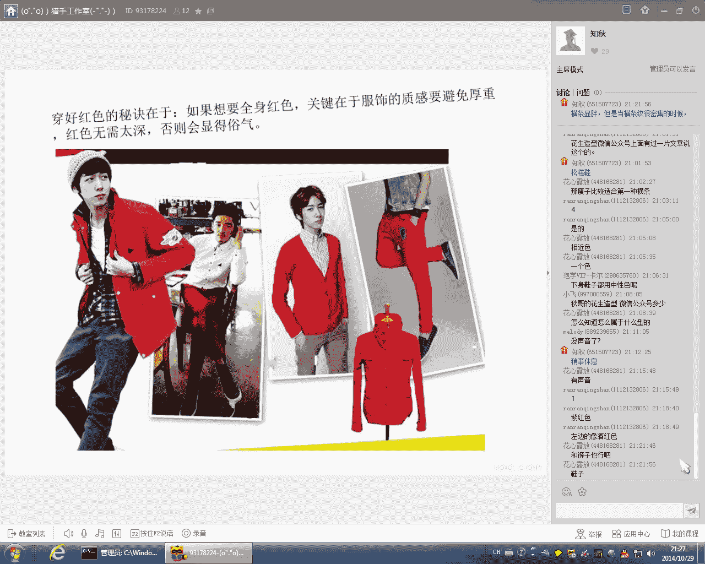
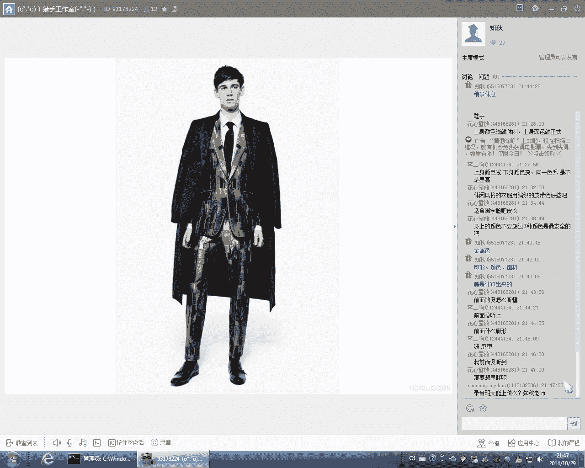

# 1、21知秋《时尚型男养成计划》：20151029服装搭配核心法则：20141029服装搭配的核心法则下

好那，我们继续回来上课啊。好，这个都听得到声音吧，都听得到吧。我们下面来看一下那个。那个对比配色方哈。呃，对比配色法呢就顾名思义，它是有色调。色相差异比较明显的那个颜色是间定型的一个搭配。呃。

搭配的好呢会有一种华丽而强烈的视觉效果。那么大家可以看。像那个图片。那么你们主要采用的对比呢就是上下半身的对比。和内外之间的一个对比。那么这种对比配色法呢。对于那种长相，一定要是那种长相。

五官长相比呃棱角比较突出。呃，或者说浓眉大眼的那种人去用会比较好。特别是像这种像大家看到的这两张图片当中，这两个模特身上这么大面积的颜色对比啊，这种颜色对比呢就是要一个是身高比较高。啊，另外一个呢。

你的五官长相要比较清晰，比较强烈。这样的话呢才能够教育教育得到这种对比。这种这么大面积的这种对比配色。呃，如果你的那个长相是比较普通啊，比较平庸。嗯，或者是身材比较单薄这样的一个。那个身材或者长相呢。

你再用这么。呃，大面积的对呃，衣整个衣服的那个颜色啊，把你这个人的那个气质给压住了。嗯。那么正常来讲呢，比如说怎么样判断呃一整套软件造型是不是对比配色呢？所如我们看一个是看上身和下身的颜色。呃。

另外一个呢看那个外面跟里面的颜色，比如说黑与白，就是很经典一个一个对比配色，对不对？呃，黑白配呢是基本上每个人都可以用的。但是当大家用到，比如说呃红加蓝、红跟绿。黄的红又或是黄跟绿啊。

这样有颜色的这样的一个一种搭配呢。需要注意的啊，一般人讲呢都不太适合那种太大面积的对比啊，而是适合比较小面积的那种对比。就比如说你那个又或者是说呃你整身呢用一些比较柔和，比较低调一些的那种颜色。

就像那个左边这样这个模特穿的这件外套，对不对？它虽然是黄色系啊，但是它的这种黄色呢黄的来是比较柔和的。更是属于显卡其色。然后大家看一下他的那个裤子，他裤子那个红色是不是也是比较低调？比较暗沉的对不对？

跟右边这个模特的这个红色裤子比起来的。就相对来讲没有那么的鲜艳。而右边的这一整套搭配呢。嗯，就是说他穿了一件那个。深蓝色的上衣。对吧然后他把这个比较鲜艳的这种。或呃这个红色呢放到了下半身。

那么这个呢呃是比较比较好的啊呃比较聪明的一种一种穿法。呃，基本上来讲呢男生呢。因为很少有男生的皮肤呢一般来讲都会比较比较干，或者说或者说有有瑕疵。嗯，皮肤白净肤质比较好的男生呢，相对讲是比较少。

那么呢就把鲜艳的颜色呢放到下半身，这个是比较聪明的一种呃一种做法啊。因为当你把鲜艳的颜色放到下半身呢，这样呢对你的那个整个脸部的那个皮肤的那个气质影响。相对来讲呢就。会比较小一点点。

那么我们看下左边的这个模特，她穿了一件宝蓝色上衣。而他穿了一个大红色裤子啊，这样的话呢他整一个视觉效果就提到一个。隔离啊，他的那个红色裤子呢就不会过多的影响他的那个脸部的那个那个气质了。

那么其实他这一整套呢依然依但是他这一整整套呢呃依然是属于属于一种那个对比搭配对吧，对比配合法。Yeah。我们看一下啊呃左边这个他穿了一套驼色的西装，然后搭配那个浅蓝色的牛仔裤。

然后里面搭配一个白色的毛衣。呃，黄温蓝也是一种一一组对比色啊，就是说从那个摄像环上面来讲，它也是一种比较经典的配色。那大家看一下它的这个黄的来是是不是比较柔和的，就是它的它的那个色系是比较柔和的啊。

不会说特别的鲜艳，特别的刺眼啊啊右边这个呢右边这个它的那个红色的这件毛衣啊，这件外套是相对来讲是比较鲜艳，会比较那个亮眼的啊。但是你看一下它的里面的这件呃。白色的上衣，还有他的这个土黄色的裤子。

是不是那个颜色的那个明度都比较低。对呃比就是说没有它的那个红色的这个颜色那么鲜艳啊，那么这个呢其实也是起到一个颜色上面的一个调和的效果。还有他的大家可以看一下他的袜子啊。

酒红色的袜子刚好呼应他的那个上半身的那个那个衣服。所以在以后选袜子的时候呢，可以根据你的上身。的那个颜色来选。因为我们会特别在秋冬天了，我们不会穿短袜了，对不吧？因为比较冷。

我们都常通常会穿一些那种穿肠到那个。呃，小腿的那个长袜啊，那我们的那个袜子呢其实也是一个呃露出袜子的颜色呢，也是一个丰富整体的那个造型层次感的一个很好的一个一个小技巧啊。好，我们来看一下这两张图片啊。

呃就是说当我们如果一定要用到那种对比配色的时候呢，就说当你的上身和你的下身那个颜色冲突比较强烈的时候呢，我们一定要在当中加入一些那个中性色。呃，比如说黑白灰或者是说浅蓝啊。

那个浅卡其这样的一些那个中性色去过渡一下那个整体的视觉效效果啊，就是说缓和一下那个过于强烈的那个。那个视觉效果。比如说大家可以看一下这两张在观男生，他外面穿的衣服灯是不是都很鲜艳？颜色都很鲜亮，对不对？

而它里面呢用了一件呃白色T白色或者是T恤的那个内搭。这样呢其实就是起到一个那个过度的视别效果，对不对？这样呢它就让整体的那个感觉呢没有那么冲突，没有那么强烈了啊。那么大家如果可以想象一下。

他们如果没有穿里面的白色或者是黑色的这件。内搭呢是不是整体效果就特别的刺眼，对不对？我们都来看一下那个重点配色方啊。好，重点配置的话，这个大家应该也也很好理解啊，配合这个图片大家应该就能够。

很好的那个看得出来了啊，就是它的你的整体色相相统一，用撞色或者是其他的颜色做来点缀。就说整体你要突出整一身的那个颜色啊，突出一种颜色。那这个这一套造型大家可以看一下。

它的重点的那个颜色很明显在它的那个外套上面。对不对？而这个呢。这两个单位呢大家看一下。哪一个颜色是最先。最抢眼的啊这些能够让你的眼球能够看得到的。

这个它里面的那个黄色的那个polo衫和那个粉红色的那个上衣啊。对对啊，这种方法通常应用在我们就是说比如说你买了一件你很喜欢的啊，价钱很贵的，很上档次的一件衣服啊。呃。

你特别想让人家看到你穿了一件呃很呃很高级的一件衣服啊，那么当你特别想突出某一种颜色，或者说某一件单品的时候呢，那么你其他的搭配呢，就要尽量的简单这样的一个低调啊，比如说你买了一件那个呃皮衣啊。

你买了一件西装外套。啊，你特别想把这件衣服穿上去，特别想秀给别人看。那么你里面的那个内搭和你的裤子和你的鞋子是不是说就是尽量的简单选择选择那些基本款会比较好啊。

啊如果你的裤子和你的鞋子和你的那个上衣呃都是属于那种款式比较特别啊，跟你的那个西装外套一样抢一眼的时候，那你要是不是就看不出，就不会再特别的关注你的那个西装外套啊啊，这个其实就是一个那个呃对比。

就是说我们当时当你一件那个一件单品特别突出的时候呢，你想要突出这件东西的时候呢，你其他的那些搭配呢，就要选择尽量的简单一些啊，这样呢才能更好的突出你的那个重点。

那我们很多同学为什么说穿衣穿穿来穿去总是不好看呢？所以我们我们就会说你身上没有一个重点啊，就是人家不知道你身上想表达的是一种什么样的那个东西啊，那么我们看回这两张图片。这样做变呢。

这样他们这样出来很明显是表想想表达一种年轻时尚有活力的感觉。对，因为他整一下呢最呃他把那个最鲜艳最鲜亮的颜色呢放在上面了啊，比们说当你把一个颜色放在你的上身呢。

那么你主要表达的那个情感呢就是贴近这种颜色了。对，所以我们。嗯，可以很明显的看得出来啊，这两个男生他所表达想表达的一个效果就是比较年轻、轻快活泼时尚活力的，对不对？然后这个啊。

这个可以大家可以呃很明显的看得到它是它的亮点在于它的这个包包和它的鞋子。对不对？所以呢我们搭有时候搭配的时候啊，我们要要搞清楚重点。呃，当你一件单品呢那当你的某一件单品呢很特别的时候呢。

那么你其他的那个搭配呢，其他的衣服呢就可以选择非常简单一些的啊。那么这个呢是红色的。几种搭配啊，就穿上红色的秘诀在于呢。呃，如果你是想让这个红色特别特别的显眼呢，你其他的那个衣服呢一定要穿的比较低调。

你就用一些最基本款的那种那种黑白灰。或者是说用一些那种百搭色或者是中性色来跟这种大红色相搭配。这样的你整身就可以比较好的突出这个红色，也比较有亮点了。

。嗯，黄色我们来看一下黄色啊，呃黄色呢在男装当中呢是属于比较难搭配的一种颜色之一啊。尽量呢大家如果在穿黄色的时候呢，也尽量也是用一些黑白灰来跟它搭配。呃，最好呢是用灰色。呃，因为黄色呢我们说是最。

最温暖的一种颜色。它是极属于极暖的一种颜色，而灰色呢我们说是最中性的一种颜色。那么这种最中性的灰色呢跟黄色可以很好很好的那个能够调和到一起。而如果黄跟黑呢就对比太强了。

我们可以看一下最右边的这个这个模特这个身上的这种黄跟黑。黄跟黑呢是也是比较强烈的一种那个颜色搭配。呃，花心怒话说上身的颜色浅就休闲，上身的深色就比较正式啊，这个观点是没错啊，但是也不一定对。呃。

因为休休闲还是正式呢，是看你整一身的感觉的啊。我们刚才不是说了吗？服用搭配有三个要素啊，一个廓形，第二个颜色。第三个呢就是我们那个下面要讲的那个面料。就你的我们说看一个人的形象，造型是看整一身的啊。

呃不是光看颜色，也不是光看廓形啊，也不是光看那个面料啊，而是廓形面料呃，颜色三个要素综合到一起的那个结果。呃，统一设计确实是会让整体显高。就比如说呃一个深蓝色的裤子。然后再配一个浅蓝色的上衣。呃。

然后鞋子呢用也是用那个深蓝色或者是深咖黑色啊，又或者是深色，这样子穿呢就会让整体比较显高了。我们再看一下啊。即系觉得应该都。可以看得出来，对对？左边这个老头子。他身上出。是了就是他这样这黄色的裤子。

而左边这个外国帅哥呢，他突出的就是那个。这个西装外套对对，所以它里面呢就穿的很简单很简单啊，都是基本款。你看T恤裤子啊，都是属于基本款。还有配饰啊，就当你那个。上上衣和裤子都穿的比较简单的时候呢。

你可以用一些比较特别的配饰啊来突出一下你整体的那个造型的效果。好，大家可以看一下，包括围巾。看一下那个模特的图片当中的豹纹围巾。包括像皮带啊，这种编织款的皮带。

还有这个这右下角这个这种双环搭扣的这种皮带啊，都是款式是比较特别的。Yeah。嗯，对，休闲风格的衣服用编织的皮带会好啊。呃，因为编织的这种效果呢，它本身就是属于一种非常休闲的那种效果。好。

我们来看这个服装搭配的第三个要素啊，面料的视觉效果。不。好，那么我们说从搭配的角度上来讲呢，我们不需要管这个面料它是什么成分啊，呃也不不需要说呃去深究那个当中含有百分之多少的棉啊。

还有多少百百分之多少的羊毛啊。我们关注的是呢你个面料最后穿上身啊，搭配到人的身上整体看上去的那个视觉效果。那么我们将两种不同材质和那个设计的单品搭配的上半身。搭家配到一起呢，会有一种特殊的魅力啊。

也就是说我们所说的那个层次感啊，面料的那个层次感。呃，我们说搭配的时候呢一定要有层次感。如果你的那个里面和外面都是同一种面料的话呢，这样的看上去的视觉视觉效果呢是非常的平面的啊，这样的话呢是不好看的。

那我们可以来看一下。什么是面料的那个糖次感？Yeah。就面料的有分有光泽的啊。呃粗糙的无光泽的。有的是比较显高尚，比较显精致的。有的是比较显那种粗糙廉价的啊，这个就是面料会不同种类的那个面料呢。

都会产生那种不同种类的那个视觉的效果。大家从这个图片上面就可以很清晰的看出来了，对吧？うんちん。皮衣搭配牛仔啊。呃，左边这个这一套呢就非常非常硬朗啊，非常硬汉的那种搭配了啊。

就比较适合那个一个是肤色比较黑。然后那个线条比较直啊，比较硬朗的这种人去穿。因为皮因为皮革呢皮革制品呢它本身就是属于一种那种比较野性啊，比较硬啊，比较man的一种感觉。

然后牛仔裤呢它也是属于那种比较欧美硬汉的那种风格。对，那么这两个搭配到一起呢，一个是面料上面产生了一个比较强烈的视觉效果的一个对比。对，大家可以看一下皮衣它是有光泽的啊，然后牛仔裤呢。

它是它的那个视面料视觉效果是比较粗糙。呃，比较没有光泽的啊，那么两两者搭配到一起呢，就会产生一个比较大的一个反差。呃，皮衣和国字脸的人当然是可以穿啊，但是当呃也是看那个整体的一个长相啊。

呃有的人虽然长相是国字脸，但是他整体的那个眼神啊，他说话的那个语气啊，还有他的那个性格，可能是比较斯文，比较温和的。所以看一个人的风格呢，一个是看外表啊。第二个呢也要看你内心的一个风格啊。

把外表和内在结合到一起呢，才是一个比较准确的一个一个风格测试的一个结果啊。Okay。因为讲个风格这个问题呢，就呃穿衣风格，这个并不是说那个一朝一夕就可以养成的啊，是一个长期的一个一个结果。好。

右边这个啊右边这个有点有一点点偏运动了，大家看出来没有？所以看着他的这个上衣呢是有点那种运动款式的啊，有点有点像那种棒球夹克啊，有点像棒球衣。然后呢，他搭了一个光泽感很强的这样的一个裤子啊。啊。

那么这两张图片也是体现一个面料上面的视觉效果了啊。你看这种毛领的翻领的这种大风衣。然后里面是那种西装比较高档，比较精致的这种面料。啊，右边这个也是啊呃，右边这个其实属于有一点点混搭了。

首先他的这个大风衣是是比较。那个气场十足，这个然后里面呢是那种机车款的皮衣。那么他下面又搭配一个绅士的那个西裤和那个皮鞋。呃，整体呢这个其实就是一个混搭啊，就既有那种呃皮衣那种机车硬汉的那种感觉啊。

又有那个那种欧洲绅士贵族的这样的一种一种风格在里面啊，就很好的融合到了一起。没有。Okay。好，这两个大家觉得那个层次感体现的反而。马甲衬衫，还有他的那个裤子、牛仔裤和鞋子。

就是四种那个单品的那个材质的感觉都不一样。对不对？你看它的马甲是比较那种呃粗糙的呃，然后它的衬衫呢就是最普通的的那种棉质的衬衫。要加牛仔裤啊，深蓝色的牛仔丹宁牛仔裤，然后皮质的皮鞋。

所以他这整身呢看起来视觉效果非常非常的丰富。那所以我们在搭配的时候呢，就也也是其实就是核最最最需要注意的核心的一点啊，层次感还是层次感的问题。而右边这个啊呃右边这套搭配呢，我觉得就就比较挑人了啊。呃。

首先大家就要尽量注意哈，不要尽量不要穿这种针织款的这种背心。因为这种背心呢，现在如果穿的不好看呢，就会非常非常的那个乡土气息。呃，就很像那种三四十岁的那种猥琐大叔啊。

穿着一个V领的那种鸡心领的那种毛衣穿出来啊，整体效果就非常非常的不好看啊，呃要穿的也尽量穿那种西装马甲啊，就比较符合现在那个大众人那个审美观。呃，深色的颜色呢确实是不超过三种，是最安全的。

但是其实超过了三种呢也是可以的。呃，比如说呢。就是当你身上的那种颜色，如果是要超过三种的话呢，你要把那个颜色的面积和那个视觉的层次感调和的比较好。那么我们现在来看一下啊，我们刚才讲了服装搭配的三个要素。

一个廓形，第二个颜色啊，第三个那个面料的那个材质。那么我们来看一下，我们通过一套搭配。来看一下那个呃一个好看的那个服装搭配呢，是如何体现那个三个要素的啊。所以我们为什么。

我们看很多很多人那些大牌的这种秀。呃，他们那种大牌的拍摄的那种广告片啊，特别的有视觉冲击力的。我们来看一下啊。好，这套衣图我们首先来分析一下，首先它的廓形。它的空型是不是一个松紧的一个对比？

然后上面松啊，或者说它的外面松，然后下面紧。对，我们可以看到他披着一件呢稍微宽松一点点的这种大风衣，这种大外套啊，然后它里面的那个西装是不是比较比较修身，比较合身的那线条感比较硬的，对不对？

所以在廓形方面呢，它有一个松紧的一个对比。然后颜色方面呢。颜色呢他穿的这件西装呢啊这一套西装呢是属于一种比较特殊的颜色啊。我刚所说的这种叫做金属色。就看起来就是闪闪发光的啊，晶莹的这种感觉很强烈的啊。

这种叫金属色。然后它的颜色方面是不是也是比较那个对比感很强，对？你看它的那个。里面是金银，啊外面是蓝色。呃，金属色呢跟任何一种色搭配到一起呢，都是会产生一种强烈的一个对比感觉。所以说我们从颜色上来讲。

它是不是也是对比的。那第三课我们看面料，我们说面料的一个视觉效果，它面料呢，它里面的这个那个最里面的这件白衬衫，是不是最普通的普通的这种棉质这种衬衫这种感觉啊是没有光泽的。然后呢。

它的这个西装的这个外套呢是光泽感非常非常明显的，对不对？啊，然后他披外面披着这件大衣，它的那个面料的视觉感觉又不一样了，对不对？所以它的三件衣服，它身上产生了三种那个面料的视觉效果，上面的那个层次感。

对不对？所以它的那个面料的视觉效果呢又是对比的。好，我们说说那个服装搭配的三要素廓形。颜色还有面料。好，那这一套造型是不是三个要素都产生了一个很强烈的一个对比。

所以这样呢它出来的一个视觉效果的冲击力就非常非常的强。所以呢这也就是因为因为为什么我们看很多的那些大牌的那种时装搭配，它出来的那个拍出来的那片效果的非常非常的那个抢眼，对不对？

那这个呢其实就是它的内在的一个那个。呃，一个逻辑啊一个的那个原理在里面的啊，所以我们说服装搭配也是有一定也是有那个很深的那个技巧，那种理性的东西在里面的。啊，不是乱搭的啊，我说美，我们第一节课也讲过啊。

美是那种感性的还是理性的，对不对？一定是呃任何那那种美的东西呢，任何一种美的事物呢，它都一定是一个理性和一个感性的一个结合啊，就不是完全凭感性胡乱的那个凭人类的那个想象给制造出来的啊。呃。

之前呢呃那个我记得一个德国的一德国人有一句话啊。呃，就是说呢镁是计算出来的。美是计算出来的。这个其实就告诉候我们一个什么样样的那个原理和启示呢？好。认美的东西呢是其实真的是有一定呃很深的那个那个技术啊。

理性的东西在在里面的。最明显的一个就是比如说黄金比例。当一种东西你达到那个黄金比例的时候呢，它的那个美感就产生了。好，那么今天的那个服装搭配的那个课程呢，就就到这里。

那么我们总结一下我们今天所讲的那个知识啊，服装搭配的三个要素，一个廓形，一个颜色啊，第三个那个面料。所以大家在呃在搭配的过程当中呢呃又或者是说。

以后再看到那个看到当你看到一个你觉得比较好的一个搭配的时候呢，就可以从这这三个方面去分析一下啊，它好在哪里啊，当你看到一件不好的那个搭配的时候，你你也可以从这三个分方面去分析一下它不好在哪里啊。

🤧Yeah。呃，今天讲了那个今天讲的东西呢，可能稍微专业性，那个理论性会比较强一点点。呃，大概有有哪些地方是没有听懂的？主得哪里是特别的听得不清楚，或者说特别难以理解的啊，现在可以可以提出来。

再跟大家解释一下。廓型呢其实就是大家要根据自己的身材来选那个衣服的廓形啊，那么衣服的廓型呢有长和短啊，有的呢是松和紧之分呃，如果长短呢。呃，一般来讲，如果是想普通人想显高显瘦的话呢。

尽量是就是用下长上短这样的一个搭配啊。呃就是如果是上长下短这样的搭配呢，是比呃是一般来讲呢，就是要身高比较高啊，或者是身材条件比较好的那些人呢才可以驾驭的。Yeah。花心路放，你是好像来的比较早吧。

你是后面才来的，还是一开始就来了？好，其实这个廓形呢这方面的东西没有没有那么复杂啊，其实就是把身材给穿好就可以了。所有的关于衣服廓形啊，还有升级方面的就是其实都是一个核心啊，就是怎么样显高显瘦。

他要了解自己的身材。呃，有空的可以去量一下自己那个呃身体各个方面的那个数据啊，比如说肩宽啊，腰围臀围啊，腿长、身高这个具体是多少啊，当你比较清楚的知道自己这个身体方面的那个各个数据呢。

你才能比较好的去去为自己挑选衣服。想要显胖，呃，如果想要显胖的话呢，就尽量穿稍微宽松一点点的衣服啊。比如说像这样子。因为想显胖的人呢通常都是比较瘦的啊。

而且胖了就穿那些稍微宽松一点点的那种廓型。但是宽松的来呢，依然要保持那个整体的那个形状，不能够邋遢啊，不能够松松垮垮，看起来没有精神。嗯，好，看看大家那个对今天讲的内容，还有哪里没有听懂的。

或者是说那个哪些方面还有疑问的。好，那个包跟身上哪一个颜色呼应比较好？其实都可以。呃，包包的颜色你可以跟上衣的颜色呼应，也可以跟裤子或者是鞋子的那个颜色相呼应。但是也要看也要看风格啊。

你是属于比较正式传统的风格呢，还是比较那个休闲时尚的那个风格。啊，这个那个那个是有是有区别的。你比如说你穿的是一整身比较休闲的衣服。啊，比如说你像这个图片当中左边这这个模特穿的这么宽松，这么休闲的衣服。

那你就不要搭搭配一个太正式的包包啊，你就必须搭一个休闲感觉类的的那种包包。嗯。呃，色彩搭配如果你觉得刚开始呃掌握或者是交易不好的话呢，你就尽量用同色系啊。比如说一整身的那个黑白。呃，黑白灰。啊。

注意一下呢那个颜色层次感就可以了。就是呃如果你是想大部分颜色都用中性色的色彩搭配。好，那你就首先要了解那个中中性色有哪些啊，就比如说那个比如说黑色加宝蓝色，就是比较经典的一个中性色搭配啊，黑色加卡其色。

嗯，还有深蓝色加卡其色啊，这个都是非常几种非常非常经典啊，也是那个最安全，大多数人都可以驾驭的一个中性色的搭配。那去看一下我写的那篇文章吧啊，就是如如何选对色彩穿对衣。在我的那个博客上面有。

中性色呢首先就是黑白灰。一边会还有海军蓝。呃，浅蓝啊卡题。你色。咖啡色、驼色啊，这几种都是属于中性色的类别。对，棕色啊棕色也可以说叫咖啡色啊，其实都是一个都是一个色系啊，只不过是那个呃深浅是不一样。

棕色的是稍微浅一点点的，咖啡色就是稍微深一点点的，咖啡色就是那个最最纯正的咖啡的那种颜色。呃，咖啡色呢对于男士来讲呢是非常非常重要的一个设计啊。诶。那么咖啡色呢对于男士来讲也是最稳定的一种颜色啊。

它体现的是一种男士的沉稳啊，比较上档次啊，有品味的一种感觉。嗯，对，大地色系啊对呃，棕色和咖啡色都是属于大地色系。好，再讲一下什么叫大地设计啊。呃，大地色系呢其实。

其实红色和黄色也可以那个称称之为那个大地色系。呃，大地色系是什么样的一种感觉？就是说呃就不是说那种特别鲜艳，特别亮眼的那种颜色啊，而是说有点感觉就是说经过岁月的那种腐蚀啊，经过风吹雨打的。

比如说那种砖红色。砖红色也是属于那个大地色系啊，因为它砖红色的红呢，它并不是说像五星红旗红的那么鲜艳那么亮眼的，而是说非常红色非常的暗淡啊，像被呃经过风吹雨打啊。

风雨洗礼过之后的呃岁月沉淀下来的一种颜色啊，那么这种呢就称之为大地色系。啊。呃，皮肤偏皮肤偏暗的人呢，是是穿冷色比较好啊。呃，因为冷色系呢。呃，能够比较好的能提亮一个人的肤色。嗯。其实相对来讲呢。

冷色系比暖色系要是要好穿的啊。呃那个适用适用的范围呢也比较比较广比较大的。暖色系的人呃，如果要穿暖色的话呢，你的皮肤如果稍微不好的话，就会显得那个皮肤比较脏啊。

或者是说把你那个皮肤的那个瑕疵完全给暴露出来。啊，就比如说有一些像男生脸上长痘的话，呃，或者是那种皮肤比较脏啊，平时就不打理的那种男生，如果穿一个很鲜艳的黄色或者是红色的，呃。

那么那个颜色就会把你的那个脸上的那个瑕疵更几就是说几乎的完全的给给暴露出来。所以我们穿颜色首先是要呃那个让让他适应自己的那个脸部的那个皮肤啊，适应那个肤色。就让你整个人看上去更加精神，更加干净一点点啊。

不能够让你的那个那个。呃，脸上的那个缺陷和瑕疵更加更加的暴露。皮肤不好了就穿黑白灰吧。啊，但是也不能够穿太白。太白了也太白的那个衣服呢，也会让你的那个。呃，皮肤给的那个瑕疵给给暴露出来。

一般穿黑色或者是深灰。呃，又或者是穿深蓝是比较保险，也比较安全的。但最根本的呢还是大家还是要去去做一下护肤。比如说用洗面奶或者是面膜。因为男生的皮肤最常见的两个问题，其实就是呃比较干燥啊。

一个比较比较容易出油啊，所以呢就有大家尽量用那种有补水啊、保湿效果的那种洗面奶。啊，或者是那种面膜啊。呃，这品牌呢我这里倒没有什么太太好的那个推荐啊，一般呢我都是去那个屈臣氏。屈臣氏大家知道吧？

我都是去那个屈臣屈臣氏里面去买的。或者是那个。屈臣氏一般就是洗面奶，我一般就是买个几10块啊，最多到100块。啊，面膜呢也是买那种大概六七十块吧，六七十块可以六七十块两三片的那种面膜。Yeah。

其实屈臣氏里面的那些东西都比较经济实惠啊，比较适合大众去用啊，关键是你尽量买一些呃补水啊、保湿啊，美白效果比较强的那种就可以了啊。你可以去那个问一下那个专柜的那个销售员，就哪一种的那个产品呢。

那个补水效果是最好的那你就买买那种啊。你试了一种，你觉得不合适，你下次再换另外一种就可以了。然后服装搭配呢大家可以看一下，看一下那个时尚起义啊，我们今天因为讲了讲的是专门讲搭配方面这方面的那个知识嘛。

呃大家可以去那个时尚起义里面看一下啊，看一下它的那个搭配手册。啊，他的这里呢就有很多很多套的那个搭配。大家可以用今天那个讲到的，然后学到的那个知识去看一下啊。去好好的理解一下搭配这个这个方面的那个内容。

时尚起义。时尚企业是一个网站啊。那，我这里随便选几张搭配出来给大家看一下啊，简单讲一讲。再看可以看一下那个时尚体育他最新的那个几套搭配啊，看一下都有什么样的特点。首先我们看一下它的廓型啊。

看一下它的廓型是不是都是基本上都是那个下景。上升这样的一个搭配啊。对不对？没有说那个上紧下松的啊呃，因为上紧下松这样的那个穿法呢，对腿型对身高要求都是比较高的。那么颜色呢颜色我们可以看一下。

基本上都是中性色，对吧？比如说黑白灰、蓝色，还有卡其色、咖啡色。都是集用在这几种颜色。那我们再看一下面料，面料他们的那个呃那个你看他们的外套。还有里面的搭配，还有那个里面的内搭裤子、鞋子。

是不是基本上都是。那个不同的那个材质的视觉效果。对吧。再回去根据那个廓形面料材质啊，这方面的三方面的那个要素啊，这这三种思路去好好的看一下，去想一想。哪一个那个。

看人家好看的搭配都有哪些方面的那个值得学习的地方。呃，时尚杂志呢，其实现在当下的那个时尚杂志就很多很多。呃，但是要选对自己适合的。尤其是现在看时尚杂志人已经非常非常少了。呃。

现在很多时尚杂志的那个内容呢都被网站所所取代了。啊，一个时尚先生啊，一个GQ。那其实像微信公众号里面本身就已经有很多的那种时尚搭配的那种那种知识了那种资讯了。很少人会专门的买一本杂志来看。

还有一个叫做优优可能。有可能是。大家可以去看一下啊。啊，有可能是这个男士的部分的那个内容做的还是不错的啊，我最近也都也也一直都在看。Yeah。Yeah。好的，那个看看大家还有没有什么问题。呃。

如果没有问题的话呢，我们今晚的课程就暂时到这里结束了。下周下周上课的时间呃。应该还是星期三啊。还是星期三，如果有什么其他特别的安排呢，到时候就在群里面去通知啊。大家记得看看，大家记得那个留意那个QQ群。

