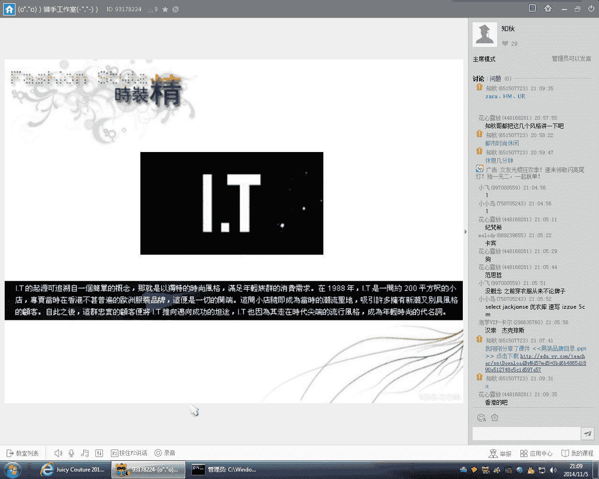

# 1、21知秋《时尚型男养成计划》：20151105男装品牌下：男装品牌下

大都在吧。好，那个我想大家自己说一下啊，就你们能够说的说得出口的那个品牌，或者说你们平时呃了解到的那个品牌的名字，能够能够说一下吗？呃，我了解一下大家对品牌的那个认知有多少。好好。

纪梵希啊呃纪梵希他的那个图案特别的特别出名啊，像那个早些年，好像早两三年的，他那个就会会经常用一些那种动物的图案啊。比如说那种狗头啊，老虎头或者是说那种老鹰的那种图案。

纪梵希的那个图案呢非常的有艺术气息啊。Okay。不。啊，那个小飞说，之前穿衣服从来不认牌子的了。啊，确实对于我们普通人来讲呢，我们还是主要靠靠搭配，因为我们基本上没有能力去消费那种国际一线的那种大牌啊。

嗯那些衣服呢动辄都是几千块上万块的那种。嗯，我们这当我们这里讲的呢都是推荐给大家一些，就是比较终端的啊，就是那种单价在那种200到500之间啊，呃，外套呢基本上是不超过1000啊。

又或者是说那个刚好超过1000多一点点这样的那种比较经济实惠的那种大众品牌。或者是说呢就是比较适合我们都市人这种白领。呃，适合那种都市轻熟男穿的那种那种品牌。那么刚才也说了，一个是zava。

一个是那个HN。还有一个呢是那个UR。zava呢他的那个衣服设计来几讲呢，就会比较注重线条啊。呃，因为它呢是按照那种欧洲人的那种身形来设计的。呃，他不会有很多那种太花哨的款式。啊啊。

但是呢他的衣服zaara的衣服呢一个一个不太好的地方呢，就是他呃版型设计的太大了。呃，我们很多那种中等身材或者说个子小的人呢，基本上都穿不了他的他的衣服。但他的那那个设计感是非常非常不错的。

而那个HNM呢就是更加偏美式一些。呃，因为它的那个廓型呢，HM的那个廓型呢它没有zava做的那么好，就说没有那个zava控制的那么好。嗯，它的做工呢也更加偏，它的做工比较随便啊。

对比较偏那种宽松比较休闲的那种版型。另外一个呢HM的面料呢呃也现在也越来越不行嘛，但是它的那个设计款呢，它的HM的那个款式设计的那个呃多样性呢是比那个zava要要好的。另外一个呢，还有一个就是那个UR。

UR呢在现在好像是只在一些那种一线城市里面里面有店啊，但是呢它的那个设计感呢呃它比那个zava和HNM的那个时尚度呢要更加的高，呃，它的那个衣服呢风格里面还是比较多元化的。

就是正式的也有然后那个商务休闲的也有，然后那种时尚街头潮的那种风格的也有啊。呃，当然在那个UR这个品牌呢，大家可能真的要去到那个。呃，实体店里面去看到才会那个有感觉了。呃。

北京、上海、广州都有他的那个实体店啊，呃，其他地方呢我就我就不太清楚了。Yeah。Yeah。好吧，那现在看一下啊。IT啊。IP这个品牌大家听说过吗？可能有的人呢就都就会很熟悉啊。

可能有的人呢就没有完全没有听过。IT呢它是香港的一个非常大的一个时装品，呃，那个时尚潮牌的一个集团啊，它旗下呢有很多很多的那个好几个那种品牌。呃，那么其中最具代表性的就是那个5CN。

好。呃，5C呢它早期的那个设计概念呢就是以简洁休闲的那个中性化服饰为主。呃，大家可以看一下那个呃5CN它的男女装呢，其实那个风格还都蛮接近的。呃，甚至有些那个呃女装呢呃都可以能够。但是有一些那个女装啊。

它的版型都做的非常的宽大啊，男生都可以穿。所以它的那个呃一个主打啊就是中性啊，另外一个是简洁休闲。呃，他的那个色系呢也是偏暗黑的啊，偏黑白灰，就是穿起来非常的那种街头潮人，呃。

又或者是说那种有点小帅气啊，很酷感十足的那种那种感觉啊。呃，他但zava呢不是一不是一个路线啊。呃，za娃呢就比较适合那种欧美的那种大叔啊。那种呃年纪比较大的那种型男啊。呃。

而5CM呢呃其实或者或或者是说整1个IT集团，他做的那种服装风格，都是偏那种年轻型男啊，或者说那种年轻潮人的那种路线的啊。

首先他在一个那个年龄的那个层次上面就区分的是一个比较明显的那我觉得那个大家有没有去那个IT的那个实体店里面去看过。品牌这种东西呢，大家如果真的是想对那品牌比较了解呢，一定要去一定要多逛街啊。呃。

一定要去他们的那个实体店的那个门店去感受一下他们的那个衣服那个风格是什么样的那个类型啊。呃，讲课呢只是给大家呃讲一个那个点一下啊，就是给大家一个那个框架啊，不能够代替那个真实的那个体验的。

这个是15。呃，一组呢他的风格呢会更加的偏休闲的。大家可以看一下它的那个我刚才不是说了吗？5CN呢，它主要是那个以色调呢，它基本上是以黑白灰为主啊。呃，那么一组呢它的那个风格，包括那个颜色啊、宝款型啊。

那个各种各样的款式啊，它都会呃更加偏年轻和活力一点点。就是他的那个官网，大家可以那个可以上他的那个官网去看一下啊，他们那个如果说对比一下啊，5CM跟那个A组的那个风格区别有什么不一样？

chocolate啊呃chocolate呢它更加的更加的年轻了啊，呃就是那个基本上是18到22，23岁这样的一个那个年龄层的定位。呃，他呢就是会有一些那种比较青春活力的那种款式啊。

比如说像很多那种校园风，或者是说那种街头潮人的那种时尚的款式。Yeah。Yeah。i沃啊呃i沃呢它是专门那个它的那个风格类型呢是属于商务休闲。呃，但是他是属于那种专门做定制男装的。

你看他的那个那个概念就是定制发掘人类个性啊，定制美好生活。呃，那个有没有那个同学喜欢穿定制的衣服的？其实定制的衣服呢，它呃能够做的绝对的那个比较适合你的身形啊。呃，但是他做不出那种太潮太时尚的那种款式。

呃，基本上呢当下的很多男装做男装定制的品牌呢，他做的都只是做要么就做衬衫啊，做马甲或者是做西装西裤，都是比都是呃只是做那种那这种款式。那个小小鸟，你买过那个红邦创意的定制衬衣是吧？呃，感觉怎么样？

Okay。Okay。其实我也定制过一款啊，我也定制过一件衬衫。呃，但是觉得他的那个款式呢太太商务啊，其实穿的几率还不是特别多。呃，如果是那个经常上班需要穿衬衫的话呢。

呃倒是倒是可以定做几件那个比较商务休闲的衬衫。是。あ嗯。呃，定制呢像i沃这个品牌呢，它就是属于一种中低端的定制。呃，他的衣服呢从100多200多到三四百啊，500的都有，不同价位的都有。

那些对于时尚潮人来说呢，呃其实是不太喜欢定制的啊。呃，因为定制出来的衣服呢，它太中规中矩了。呃，就缺少了很多那种搭配的那种。的那种余地。Okay。好，我们来看一下这个ALT。呃。

AT这个品牌大家大家有没有？有没有那个认识过啊，知不知道？他之前是找了那个吴尊来做代言。呃，他的一个品牌定位呢就是新精致主义的时尚男装。呃，他的衣服版型做的比较小巧精致。比较适合那种呃中等身材。

就是一米。1。7裤头或者是1。7米以下这种中小个子的人去穿。啊嗯我有几个那种小个子人的学员呢，很喜欢这个品牌啊，因为这个品牌呢它首先呢它还是比较时尚的啊，比较年轻时尚。呃。

另外一个呢那个它的版型呢做的相对来讲比较偏收身比较小啊。呃，很多那种特别特别瘦的人呢，在他的这个品牌里面呢都可以找得到那个自己穿的衣服。呃，我记得我之前有的有几个学生特别特特别的瘦。呃。

穿裤子都要穿202627这样的一个那个裤头啊，然后就找遍了很多很多那个店铺都没有那个他的那个尺码啊，最后就在这个AT这个品牌，这家店里面找到了。

因为对于一个那个品牌来讲呢呃一个成熟的品牌呢很少会做那种2627这么这么小的这尺码的这种裤子的。一般最少就有2829就已经算很少了。那么呃太平鸟应该是大家比较熟悉的一个那个品牌了吧。他的中文名啊。

他中文名好像我还不太清楚啊，他反正他的那个英文名就叫做那个ALT。北京应该也有的，北京应该有也有他的那个店铺。あしし。那么太平鸟呢就是偏那种。呃东。这种风格啊。

大家可以看一下他的那个年龄层定位是23到30岁的那个都市男士啊，然后呢，26到27岁是他的那个核心消费层，就是他享塑到一种就是自信自由，敢于追求潮流的这样的一个男士形象。呃，他的那个衣服呢也是高瘦的人。

会比较适合啊呃，那么今年秋冬呢。呃，我之前我前两前两三天还去看过他的那个店铺啊，呃他今年其实上了挺多那种还比较花哨的那种运动款式啊。比如说那个一整身的那种大面积的那种艺术气息的那种印花啊。

还有各种各样的那种图案啊。呃他现在的风格呢也走的比较时尚，比较潮流了啊呃就就不是说特别呃特别简单，特别帅气的那种都市男性了啊。呃。

他应该是比较他的衣服风格呢应该是比较比较时尚潮流的那种都市白领的这种形象。Yeah。那个太平鸟这个牌子，它的衣服风格还还挺不错的啊，呃就特别推荐给这种瘦高的人去穿。GSG。GS局大家有那个有接触过吗？

呃，小飞，你其实也是可以穿太平洋的东西的啊，但是要选对尺码。呃，其实基本上瘦的瘦的人呢在秋冬季节都比较好穿衣服。啊，GSG这个品牌大家有没有听说过？对，这个这个牌子呢在在在淘宝呢卖的比较火啊。啊。

其实呢刚刚看的时候呢，你会觉得它跟太平鸟的之间有一点点那个风格还是有呃有一些接近的地方，对吧？呃，都是属于那种都市时尚啊，休闲时尚的都是那个针对那种都市时尚白领去开发的呃，但GSG的那个呃那个风格呢。

它会更加注重细节多一些啊，就还有它的那个介绍当中呃所写的那样子，就是比较多的用一些呃剪裁啊呃那种各种各样特别花哨的纽扣啊拉链啊呃还有绣花印花啊，就体现在一些细节的元素里面。呃，GXG这个品牌呢。

我我也带学员去买过啊。呃，觉得他其实确实跟太平鸟的风格还挺接近的啊。呃有时候你不看他们的那个牌子的名字，你走进他们店里面可能都有可能会会会混淆。但整体来讲呢呃还是太平鸟的那个做工和质量会好一点点。

GSG呢他有一些衣服就面料就比较的粗糙。速写啊。呃，速写呢是一个那个设计师品牌。速写这个这个品牌可能知道人不多啊。呃，因为它是他整体的那个设计风格呢是比较个性啊。

如果大家有机会去他的那个那个实体店里面去去看一下啊，去感受一下就知道了啊。呃，他的衣服呢廓形比较松垮。呃，他基本上没有那种特别收身，特别硬的那种那种版型。呃。

另外一个呢速写像书写像速写这一类那个设计师品牌的面料啊，它也是比较呃用那些比如说棉啊麻啊呃这种自然类型的这种面料啊，就很少有那种呃什么那种。什么太空棉呢，这种现代科技的种的那种面料啊。

因为它整体的一个那个感觉呢就是要体现一种呃比如说一种生活模式啊，比如说这种衣服呢。呃，他有点那有禅意。啊，其实速写呢有点接近例外。例外大家知道吗？另外这个品牌大家大家知道吗？Yeah。Yeah。

像速写和例外这一类呢，就特别适合那些文艺青年啊，呃特别是从事那个设计和艺术行业的那些人，特别喜欢穿。因为首先呢他们有的一个衣服就是做的那个松松垮垮的，他不会说做的像那个西式的衣服装啊。

做的呃像那种西装一样那么的那么笔挺，那么的挺身，那么廓型呢永远都是那种呃有点垂坠感啊，就是松松垮垮的，强到一种很随意很休闲这样的一种状态啊。呃，对，就是就是那个彭丽媛穿的那个牌子啊。W。苏姐呢。

他在天猫也有他的那个旗舰店啊。啊，具体这我就不再详细说了啊，让大家那个自己去看一下。大家可以了解一下。呃，这种类型的衣服呢。呃，也是挺看文穿的。这个首先的身材一定要一定要高。呃。

另外一个呢要那个长相比较独特，比较气质的人穿才会比较好啊。但是它的价格呢也不便宜。呃，看一件那种那种西装外套都得1000多2000。嗯。Yeah。2是。Yes。呃圈的安。

全天这个这个牌子呢在很多呃二线城市都有它的那个品牌。呃，他是那个欧时力旗下的一个男装啊，呃他的那个年龄跨度呢还挺广的。他刚他整体的那个设计风格呢是比较也是偏时尚休闲。比较偏潮人的那种路线。Yeah。

这个衣服的一个特点呢是它的那个版型。不知道大家有没有去他的那个那个店铺里面去看过。呃，你那个有有试过他们的衣服吗？那个有有了解过这个这个品牌的男装吗？呃，小轩长，我之前你之前好像那个拍了几套衣服。

就是就是全景按al了，对吧？Okay。呃，全天的他呃他的那个衣服呢，它的版型比较。呃，比较特别啊呃在各个那个品牌当中是我觉得是比较特别的啊。呃，首先呢它的那种版型不是说特别修身。

但是又不是特别紧身的那种啊。呃，它的裤子和衣服穿上去呢就是呃整体来讲呃修身啊，但是又能够包容性比较强的。另外一个，它在颜色和其他款式的方面的，就是各种各样的那种大的那种花纹啊。

它其实很多那种设计呢是抄直接抄袭纪梵希啊，或者是说那个抄抄那些一线大牌的那种设计的。嗯，很多那种胖子喜欢穿他们这样的衣服啊。因为他们这样衣服其实我也试过试过啊。

呃他们的裤子呢做的那种宽松版型的裤子做的非常非常多啊，比如说那种直筒裤啊，或者是说那种有点掉裆的那种小哈伦裤啊，都做的比较多。另外另外呢他们的那个衬衫呢，他们的版型也是偏直筒啊，或者说偏偏宽松的。呃。

所以他们的衣服呢对于一些那个身材不是特别好的那种胖子呢。呃，我身边有很多那种身材比较壮，比较胖的人啊都喜欢喜欢穿他们的那种衣服啊。呃因为他们的衣服呢不太不太显身材啊呃对身材的要求来讲呢没有那么那么高。

他有空可以去那个他们的那个店铺里面去试一下啊，因为发现他们的衣服很多都是直筒型。啊，衣服和裤子啊都是那种直筒型啊，又或者是说那种O型啊，他们有会有有一些那种O型的那种衣服，就穿上去那种很宽松啊。呃。

稍微稍微比较显肥大的那种版型。Yeah。爸。那个马克华菲啊。呃，马克华菲这个名字听起来挺成熟的，对不对？呃，但其实呢它还是一个比较偏年轻时尚的一个牌子啊，呃它的色彩非常的绚丽。

包括他的那个那个室内的那个装修的整体风格呢，也是偏那种啊奔放。呃，比较那种呃颜色和花纹的那种运用啊都非常非常多。Yeah。呃，马克华菲这个牌子呢，它的那个呃颜色对比感比较强一点点。

我最近也去看过他们的那个今年的那个秋冬季啊，呃，他们其实还是延续了他们那个一直以来一一直以来的那种就是色彩比较绚丽啊呃那个呃然后那个颜色对比感比较强的那种风格。

那么他们家的衣服呢就适合那种个性比较张扬啊，比较奔放的那种人去穿，就不太适不太适合那种比较呃。比较斯文的男生是男生穿啊。呃如果是那种斯文的小男生呢，就可能穿不出他们那种就是大气绚丽的这种感觉了。

Yeah。诶汉朝啊。呃，汉虫是广州的一个品牌的。呃，他在那个做商务休闲这一类的那个衣服当中是做的比较比较成功的。あ。嗯，那么他的定位呢是25到45岁啊。呃，消费力比较成熟的人士。呃。

汉虫呢它的一个特点是它在商务装当中呢，它的设计感是比较好的啊，比较比较强的。但是它的面料呢就比较一般啊，可能是二流或者是三流的这样的一个面料。呃，那么他的一个服装风格呢，对于一些那种。呃。

就是工作对着装要求不太严格的那种人呢啊是比较适合的啊，就是说既想体现一个男人工作时候的那种专注那种专业程度啊，但是你又不想穿的太严肃，太古板啊，还是想体现一点点时尚感的这种感觉啊。

那么他这个牌子呢做这种感觉的那个风格的衣服呢，就是做到一直都是都是比较好的。他也可以去他们的那个官网啊，或者他们的那个店铺里面去去看一下。啊，他们的衣服呢。呃，也是做的比较修身啊。

呃做的像那种它的那个设计呢是秉承韩国一贯的那种呃简约修身的那种设计。杰克琼斯这个品牌大家应该那个都比较熟了吧。呃，杰克琼斯是一个呃比较比较经典的一个那种偏欧美风格的欧美休闲风的那种那种品牌啊。呃。

他们的衣服呢呃版型来讲呢也是比较的宽松。Okay。有穿过他们家样的衣服，对吧？很多都是他们那个杰克琼斯的那个忠实的粉丝。但是他们家的衣服呢呃有些款式还不错，呃，但有些款式呢就不太行。

这个主要还是看搭配啊，如果搭配的好的话呢，它搭出来效果还是不错的啊。但是他们也有很多那种屌丝款。我们今天所说的那种宅男款啊。就是又宽松，然后那个面料又没有质感的那种。

所以买他们家这个杰克琼斯牌子的这个衣服呢，还是要会会挑选。不楚。结构情况是那个大家自己上那个淘宝店去去看一下吧。因为图片太多，这个这里就就就不发了啊。う。Yeah。Okay。Yeah。あ。

还有一个那个select。呃，中文名叫做那个思莱德。呃，思莱德呢他的风格比较偏成熟一点的。呃，他定位虽然说的是20到45岁之间的那个男士啊，呃，但是他的那个呃我觉得他的风格呢其实是偏呃26岁以上的。

26岁到那个30岁出头啊，这样的那个年龄层比较适合穿他们家的衣服啊。呃，首先呢他们版型来讲呢，也是比较的大。比较的宽松。呃，他基本上是以一些那种，他其实商务商务休闲类或者是那个时尚休闲类的那个衣服都有。

也是比较偏欧美风格。他其实跟呃某些风格上面来讲啊，跟之跟那个杰克琼斯有点类似啊，但是他的那个设计感和那个衣服的做工和面料呢会比杰克琼斯要更加的好。嗯，所以我觉得如果是要买杰克琼斯。

而且他们两个的那个价位呢也比较接近啊，所以如果是要买杰克琼斯呢，倒不如去去买那个斯莱德。Yeah。Yeah。Yeah。好，卡宾卡宾这个应该也是一个比较知名的品牌的吧。那个有谁穿过卡宾的衣服的？プロ？

参差不齐。呃，有一些呢穿起来非常的屌丝啊，有一些呢就是搭配一下的话呢，就能够穿的非常好看。あはい。Get。呃，gap这个就就大家就不看了啊，不用不用关注了。这个呢其实也是一个那个快时尚的一个品牌。

但是它的那个衣服的那个面料和质感呢呃全部都是偏那种日常休闲的。他的那个场合呢其实有点接近那个优衣库。呃，基本上也是在那种居家休闲的那种场合去穿的。自己稍微讲一下吧。呃，无印良品。

其实你看像那个那个gap和那个无印良品。呃，还有优衣库啊，这几种类型的，它都是属于一种那个居家休闲的。呃，它的居家休闲衣服的那个一个代表呢一个特点呢就是衣服的面料比较松软，裤型呢比较大，比较宽松。嗯。

就基本只适合在那种很休闲很休闲的那种场合去穿的啊。呃它是穿不出很有型很帅气的那种感觉的。Yeah谢。那个bu卡啊。呃，波奇款呢它也是一个西班牙的那个呃街头风格的一个年轻的品牌。啊，呃，那么他的衣服呢。

他的衣服其实跟那个HM有点接近啊。呃，但是那个更加的偏休闲，更加的偏街头。呃，同时呢他的那个色彩和那个图案的那个款式呢也更加的那个多。Yeah。bu卡这个品牌可能在那个呃如果不是一线。

不是生活在那个一线城市的朋友呢，可能会比较少见啊，听的比较少。那他的那个衣服版型也是偏大啊。其实很多很多那个欧美品牌的那个衣服，最大的一个问题就是版型太大。那个对于我们亚洲人的那个身材来讲呢。

是一个比较大的一个挑战。特别是很多那个中小呃中等偏瘦身材的这样的一个人呢，都都很难穿。はい。呃，Dpo3啊。呃，这个呢是近年来比较呃比较火的一个复古的一个时装品牌。呃，他的一个设计理念是把那个复古。

还有一些街头运动的一些潮流的元素，很好的那个融合到了一起。呃，他的衣服风格呢首先肯定是偏时尚休闲的啊。呃另外一个呢它的版型来讲呢也是比较的那个宽松的。呃，他在那个一二线城市都有他的那个店铺。

可能这个牌子听听的听的人比较少是吧？很少听过这牌子吧吧？可能广州的那个同学呢偶尔会见过呃，因为他在那个帝王广场和那个万里汇那边都有他的那个店铺。嗯。Yeah。是。

あったた。好，那个最后呢一个是呃我个人非常喜欢的一个香港的一个品牌，销做那个in。呃，in呢它是呃我在那个两年前发现了一个品牌。呃，他的一个风格呢也是走的一个复古和混搭这样的一个路线。

也是比较那个结合当下的那个一个潮流的趋势。你们当下时装界流行两种趋势啊，一个是复古。另外一个呢就是混搭。那么他这个牌子呢在这两方面呢做的是是比较好的。呃，同时呢他的那个衣服的那个款式也比较多啊。

从那个时尚商务啊，或者是说商务休闲，再到那个运动，再到那个街头潮人啊，基本上他的那个衣服涵盖了一个男士应该有的衣服，80%以上的那个70%到80%以上的那个风格。嗯，不过但他们家的那个衣服呢。

也价格也是偏贵的。可能一件衬衫都要1000多这样的一个那个价格。那是他这个品牌呢好处就是他经常会打折。特别是在那个年底的时候啊，过年前他的那个打折力度其实还是还是蛮大的啊。

很多时候都会打到那个三折到5折这样的一个一个折扣。但这个品牌呢大家可能只有只亲自到他们的那个门店的那个店铺里面去感受一下，才能够才能够知道了啊。这里可多东西就就讲不清楚了啊。呃。

其实我今天那个把这个品牌的这几个PD做给大家看呢，然后用那个语言文字描述了一下他的那个品牌风格的特点呢。这些呢大家可能都只是有一个大概的一个一个。一个概念哈，那衣服这种东西呢。

你一定要去去到他们的那个实体店铺里面去去感受，感受他们的那个衣服穿到身上是什么样的那个感觉啊。这样的话，你才能够对那个品牌的那个风格啊和他们的那个文化啊有一个更加深刻更加好的一个那个了解。

那么像 initialit这些这一类的那个店铺呢。呃，他的那个店铺装修呢，你会感觉到他走到那个他的店铺里面去了，你会感觉到就他不仅仅只是卖时装，更加是卖一种那种生活的态度和方式。呃。

他的店铺里面呢会播放很多那种好听的音乐。还有那种香薰，那么这个呢就是让你在看衣服的同时，那也让你去接受啊，去融入他们的那个品牌文化的那种生活方式啊，你去到他们店里面就会知道。

呃不知不觉的就在他们店里面去逗了很长很长的那个那个时间。どうだ。其实现在呢呃越来越流行这种生服装会所或者是说那种生活馆这样的一种方式了啊。

就是呃服装店铺呢不仅不仅仅只是卖那种衣服本身的啊呃如果是一个成熟的一个呃那种品牌呢，特别是像一些设计师品牌呢，他会把很多的那种。服装以外的东西融入到那个服装本身当中中去啊。

就好像一律手这样的那个的的品牌这样子。Yeah。好的，那个大家对今天的那个课程还有什么问题吗？对那个品牌知识这一方面还有还有没有什么问题？ううん。呃，整体来说确实是这样子啊。

瘦身材瘦小了呢就不太适合穿欧美风格的衣服。呃，但是也也不一定啊呃有些欧美品牌的衣服呢，他如果有。呃，那种小码或者是加小码的那种衣服呢，还是还是可以穿的。瘦小人还是建议走那种韩版的韩韩国风格那种路线。

就比如说像那个一开始推荐给大家的那个时尚奇艺。时尚企业呢就是非常好啊，非常成熟的一个那个网络原创的平台。基本上我们亚洲人呢还是穿韩版的衣服会好一点点。啊，不知道自己属于什么风格路线的啊。好。

其实风格路线这个大家没有没有必要去纠结这个啊，并不是说以你呃你一定要去把自己定位到就是单一的一个风格路线去。呃，因为因为一个人可以适合那个风格多线有很多的啊，这个呢是要去根据自己的那个生活和那个。呃。

或者工作的那个情况啊，甚至是说自己的那个性格啊去慢慢的去沉淀去积累，去形成的。啊呃你基本上我觉得你可以，但是你可以去给自己定位一下，就是你。不适合什么样的那个风格啊，或者说你绝对不会尝试。

绝对不会穿的那种风格啊，用种排除法。那么剩下的那个风格呢，你自己去慢慢的去去多尝试。Yes。因为我刚开始呢。我刚开始呢也没有把自己那个定位在某一个风格的那个路线上面。

我觉得我早期开始那个学习这方面的知识呢，我这个我就是那个以时尚起艺啊，就是以那个韩版的那个衣服为一个那个参考啊，那个和那个模仿的那个对象啊，然后不断的去慢慢自己去尝试啊，自己去多模仿啊。

然后模仿到呃模仿的多了啊，你自然就会那个找到自己心中觉得最适合的那个那个风格。所以说风格这种东西呢，它不是说一下子给你定位下来的啊，而是说你自己的慢慢的去尝试，去积累，去沉淀下来的。は。Okay。う。

呃，今天讲的盘子呢，大家都是大家都可以去去了解一下啊，呃包括去上网去搜一下他们的那个官网，呃，或者说去百度一下他们的那个相关的那些那些资料啊。嗯，对，那个多买多试才能有感觉，这个是没错的。

因为这种就是今天其实讲的这种品牌东西呢，都只是给大家一个概念啊，或者说一个一个一个框架啊，这种都是属于那种真实性的范畴啊，这种东西呢大家知道一下就可以了啊，但自己去实践的去买衣服呢。

又是另外一个一个问题了。有很多像今天所讲的这种品牌呢，呃你即使知道他的那个设计风格啊，知道它是什么样的那个类型，呃，知道他是什么样的那个理念或者是那个文化啊。但是你如果不去他们的店铺试穿他们的衣服呢。

你就是没有感觉。Thank。Yes。对，所以就是。呃。对，因为现在淘宝很多都可以退货了嘛，对吧？你可以直接买回来。百花如果穿的不好看的话，那就那就再退。网上跟我就就只能这样子了。あ。好的。

那看看那个大家今天还有没有什么问题啊。啊，对，那个今天是这一期的最后一节课啊。赛季呢可能是在11月中旬以后才会开朗。呃，然后因为我们的网课呢基本上都是要收购5个以上的那个新学员才会再开一期的。

那平时呢大家有什么问题呢，就直接在在那个QQ群里面去提问就可以了。Okay。Yeah。Yeah。啊，下期可以啊，下期你们还可以听。然后你们呃那个想听什么样的内容呢，平时也可以多反映给我。去去。

你可以直接的告诉我啊。然后因为我们的那个课程呢，课程大纲的内容呢就基本上是那个框架啊，但是每一期呢都会加一些新的内容进去啊，那个所以内容方面呢也是在不断的那个完善和那个那个升级的。Yeah。Yeah。

うし。好的，那个。如果大家没有问题的话呢，那今天的那个课程就先到这里了啊。Yes。你知。你。うんうんうん。嗯。Yeah。

