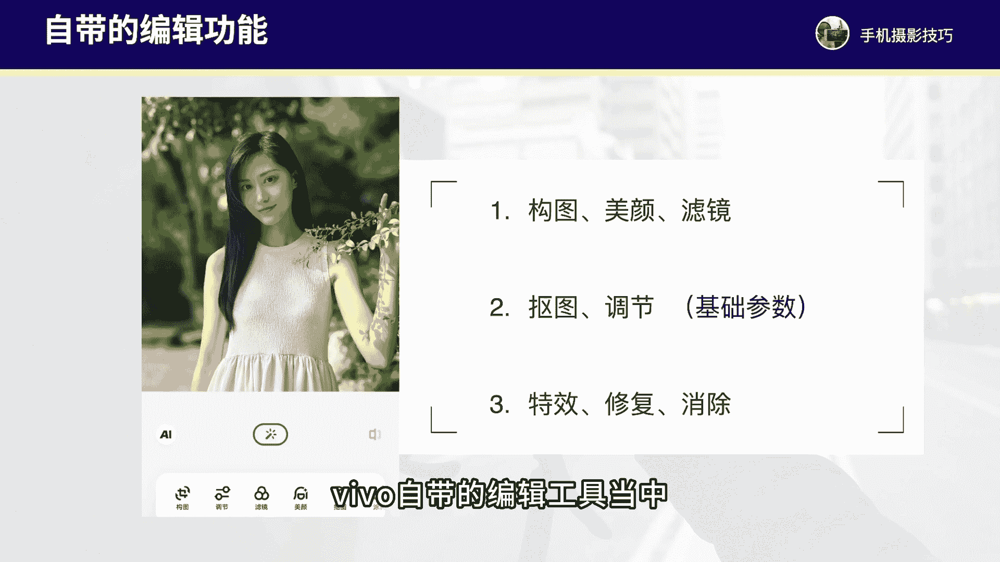

# vivo手机拍照操作课，零基础玩转vivo摄影功能 _ 杨老师讲摄影：10_第10课：vivo手机自带编辑功能详解

各位同学大家好，这节课程我们来学习一下vivo手机当中自带的照片编辑功能。自带的照片编辑功能呢有一些比较不错的常用的工具。比如说我们在相册里面打开之后，可以看到有构图、美颜滤镜这些工具。

可能有些工具啊能够帮助我们快速的去调整照片，快速的出片会比较不错。还有抠图调整图片的基本参数以及特效修复消除这的工具，有可能在我们对一些呃杂乱的照片可以快速处理，快速的调节基本参数。

让我们的照片呢有更好的一个处理效果。所以这个自带的编辑工具啊，虽然说它没有特别精细化的专业调色功能，但是它有些功能和效果。

还是能够快速的帮助我们出片的那我们详细的来看一下vivo自带的编辑工具当中有哪些比较好用的操作，以及常用的这些参数到底有什么作用。

在vivo手机的相册当中，我们打开照片，点击底部的编辑按钮就进入自带的编辑工具了。vivo手机其实它自带的编辑功能呢比较强大，有些非常好用的一些功能。例如，首先我们来看啊，这里呢左下方有1个AI这功能。

它是一个智能优化，智能修图。一般我不太建议去直接使用啊。因为这个AI呢它有些时候调色，没有那么好啊，没有根据我们自己的主观想法去做调整，可能调出来的效果不太满意。而且用AI1键调色的话。

就失去了我们修图的这个意义了。还有这个中间的按钮啊，这一个可以。还有中间的这个按钮呢是可以一键进行调色，这个也是同样的傻瓜式的调色。我也不太建议直接去点这里的自动调色。

我们还是要自己去按照下面的这些工具栏和参数来做调节。我们一个一个来详细的看一下。首先第一个是构图。这里面呢我们可以进行对照片自由的裁剪，也可以旋转照片的角度，可以自由的来做调整，旋转，以及。

可以做镜像的翻转，都可以调整。按照自己的想法来适当做裁切就可以了。那第二个呢就是调节工具。这里面是对照片进行参数的调整，亮度和色彩参数来做调整。第一个是自动啊，这个也还是傻瓜调色。

一般呢我们建议不要去自动做调整，我们还是要一个一个去自己的呃来对照片的亮度和色彩来做精细化的处理。首先，曝光啊增加是让画面亮度调的特别的明亮，降低是降低画面的这种明亮度。那第二个呢叫做亮度。

这个参数啊也可以加亮度也可以降低亮度，那么它跟曝光的区别是什么呢？亮度这个参数对照片明亮度的调整更柔和一些。而曝光这个参数它的调整更加的猛烈，它的亮度加的更猛烈。

同时它还增加亮度同时会让画面的对比感更加的增强，降低亮度，让画面的对比感更加的增强。所以我建议咱们就调亮度就好了。曝光这参数我们可以不调就调亮度，增加明亮度。降低明亮度就可以了，更柔和一些。

对比度这个参数呢可以增强或者降低画面的这个明暗的对比，可以增强画面的层次感。第三个是呃对比度。接下来第四个是高光这个参数可以主要调节画面最亮的区域的亮度，或者说降低画面最亮的区域的亮度。

最亮的区域是后面的房子和天空是画面最亮的区域。而阴影主要是调节画面最暗的区域。比如说前景的建筑阴影，调的更亮，以及阴影调的更暗，主要控制画面阴影部分的亮度的饱和度用来控制画面色彩的饱满程度，增加色彩。

降低色彩饱满度，用来控制色彩的艳丽饱满程度的。自然饱和度呢，它其实也能够调节色彩，它更饱和度的区别在于自然饱和度对色彩的调整更柔和，而饱和度它的调整非常猛烈。所以我也建议啊咱们可以更多的调自然饱和度。

而不是去直接调饱和度。自然饱和度的调整更加的柔和。色温这个参数呢主要是可以调整两种色调。如果色温往右，画面会偏暖黄色，色温往左去降低，画面会偏清冷色调。接下来是色调也是能够增加两种色调。如果往右。

增加紫红色，如果往左增加青绿色，一般这个色调我们调的比较偏少一些。锐度这个参数呢可以增加，可以适当的增强画面的清晰度。褪色主要是增强画面的这种怀旧复古的感觉。一般啊在胶片色调的照片。

我们可以适当增加褪色。普通的照片调色褪色，我们是不用去做调整的。暗角呢可以增强画面四周的一些这个暗角，让观众的视线更多聚焦在画面中间这个区域，增强这个功能，主要可以增强画面的层次感。

让画面的明暗对比感呃增强的话就可以让画面明暗对比没有那么大啊，让画面更通透。如果降低的话就可以让画面的明暗对比更加的增强画面的这种。层次感会更加的明确。所以这个参数如果处理风景照片可以适当的增加一些啊。

让画面的这个细节，尤其是阴影跟高光的对比没有那么大。如果我们处理一些这种高调的照片需要明暗对比感非常强，可以适当的把增强这个参数降低一些，让明暗的对比感更加增强。最后一个是去雾，我们再拍摄一些风景照片。

如果有一些朦胧的感觉，没有那么清晰锐利，就可以使用去雾工具啊，让画面看起来更加的清晰一些，而不是朦朦胧胧的感觉。所以这就是调节当中的参数啊，比较常用的就是亮度对比度，高光阴影，自然饱和度，还有色温。

这几个参数用的比较多一些。那根据照片的一些色彩，我们去做一些调整就可以了。那么第三个是滤镜这个工具，我们点击进入滤镜里面来，这里面呢有些滤镜还是蛮不错的。比如说当我点进来滤镜啊。

手机它会自动的帮我识别到这张照片，它可能比较符合胶片这个风格。确实胶片这。风格滤镜我个人还是比较喜欢的。像这张照片，我觉得第二个滤镜胶片里面的第二个这个暖蓄这个滤镜呢加出来的感觉还是比较不错的啊。

所以这个滤镜我们可以直直接去做添加。那如果说我们调的是其他的像风景照片，可以套用风景这里面的滤镜啊，还是不错的。如果是人像照，我们可以套用人像这里面的滤镜，那也会比较不错。

日系胶片风景人像这几个风格都还不错。我建议大家如果想要调色的这个效率更高，我们可以采用先加滤镜，然后再去微调基本的参数的方式啊，这样就可以快速的来进行照片的调色。好，我们再来看一下啊，第四个美颜。

因为我这里是建筑照片啊，所以呢就没有办法去美颜。我这里打开一张人像照片，我们详细的来看一看。好，我们打开这张人像照片进入编辑工具点击进入美颜。在这个工具当中呢，我们可以对照片啊进行美颜的磨皮。

处理磨皮我们可以适当增加一些啊，让肤色的这个细节会更好，可以感受到肤色的这个明显的变化，也可以让肤色啊调的更偏白一些，尤其是脸部肤色啊。

手臂的这个肤色更加的偏白肤色啊更加偏这个呃粉红色还是偏一些这个清冷色啊，可以做调整。还有祛斑祛痘，我们可以处理人物脸上的一些瑕疵细节，以及后面呢还有瘦脸啊。

还有这个短脸、下巴、大眼、眼距、亮眼都可以做一系列的调整，还有美妆也可以处理口红、眉毛等等。处理这个美颜工具，我们只要记住，不要调的太假，不要调的太过度就可以了。

尽可能让肤色整体的表现更加自然就会更加耐看啊。这里的美颜工具呢，我们根据自己呃的需要来做调整就好。那这里我们可以简单top过滤镜啊，这张照片，我们可以透过人像的滤镜。比如说嫩白或者说香槟。

这里我觉得是香槟这个颜色啊，这个色调还不错啊，加了之后。后呢我们在调节工具里面稍微啊加一点这个亮度，对比度也稍微加一点点啊，这样呢色调看起来还不错。接下来我们进入一下抠图这个工具。

这个工具还是挺有意思的。我们进来之后啊，手机它会自动的帮我们完成抠图人物照片哎，就直接抠出来了。那么抠好图之后，我们如果说要做一些呃像这个证件照之类的。

我们可以直接啊点击这个证件照进来之后它就是纯色背景。那我们如果选择一个红色背景，那我们把照片缩小，哎，背景就直接替换成红色了。这个时候我们点击对勾保存照片就可以。这个软件的抠图还是非常不错的啊。

非常的抠的比较细，啊，自动的来进行抠图。我们对需要的照片进行抠图处理就可以了。这里呢我们就日常不会做过多使用，有需要抠图的时候才会去做运用。接下来这个工具呢是涂鸦工具。

这里面主要可以进行对照片一些涂抹一些绘画的效果。我们如果要对照片进行一些这个涂抹绘画，那么就可以用涂鸦这个工具来涂抹。同的画笔，不同的这个效果，这个工具日常使用也是比较少。

还有马赛克这个工具呢可以加一些这个涂抹，盖住人物。比如说某些咱们不想要出现的地方，我们涂抹人物涂抹不同的形状，不同的效果，直接涂抹就可以了。这个功能啊，我们在一些趣味照片处理的时候。

或者说你要给对方发一些照片，我们需要盖住某个部分的时候可以用马赛克来进行处理。那么接下来是特效啊，这里面呢可以加一些光效啊，像阳光不同的这个效果啊，漏光，还有一些光芒的效果，还有这个虚化啊。

一般这个虚化呢，我们可以后期加，但是后期它加的这个虚化呢不是特别的自然。你看加了虚化就特别的假啊，不是很自然，还有幻天啊，换天就更加不自然了。一般这里面呢我们就呃相对用的比较少一些特效啊，尽量少用。

还有加文字啊，加文字的话，这里我们可以按照一些样式以及它的这个花质效果啊，来加一些这个文字。不过文字啊，这里的添加啊，它的风格。我个人还是不太喜欢这里面的风格啊，它不算特别文艺。如果你喜欢的话。

可以选择喜欢的文字。这里我重点和大家说一下，如果咱们用的是新款的vivo手机，它这里面的边框功能是可以来加一些水印的，尤其是我们点定制这里边来可以增加这样的vivo手机拍摄的手机型号。

白色的底部的这种边框效果啊，会更加的让照片显高级感，我们可以用这个方式来给照片啊增加这种边框的效果啊，会更加的不错啊。还有其他的这种不同形式的白框啊，咱们都可以去添加啊，会让照片看起来这种格调更加高级。

这里面我就推荐定制这里面的啊这个vivo的。专属的边框水印。好，还有这个消除工具啊，是可以对一些路人一些杂物来进行修复的处理，它可以自动的去消除自动的处理啊，如果说我们照片有杂物。

直接用这个工具啊去消除去涂抹就可以了。消除笔是直接去涂抹。而这个消除路人，它是默认去帮我们处理掉的啊，还是比较好用。接下来一个工具呢叫做修复这个工具啊，我们点进来之后，可以直接点击这个超清图像。

那么它会自动的帮我们对人物照片进行处理。哎，可以让人物照片看起来清晰度更好。不过它这里面有些处理呢会处理的比较过度啊，这里面就处理的人物的肤色，有点这种涂抹感比较强了啊，所以就如果有些照片。

我们需要处理的更加的清晰，更加的锐利，可以用它这个超清图像来处理。处理的可以的话，那效果呢还是不错的。还有夜景人像，如果拍摄的是夜景人物呢，可以按照夜景人物的风格去做处理。如果我们拍的是一些这个。

文档的照片，文档去除光影啊，就可以让文档看起来更加的曝光均匀一些啊，这个功能还是有些特殊的处理效果。最后一个是高级修图，这个工具啊，是专门使用vivo它专门的这个高级调色工具来做处理。

有更加精细化的这个调整，跟po辣软件非常相似啊。后面我会把po辣软件的这个调色的操作啊，详细的通过视频教程给家来说一说。那基本上vivo的自带编辑工具呢，就是这么多，比较好用的是滤镜。

里面有非常不错的滤镜调色的效果，还有调节工具当中，基本的这些参数的功能和作用，以及它这里面呢还有像美颜抠图，还有它的这个边框效果也非常不错。我建议大家今后可以把自带编辑工具好好的琢磨一下，把常用的工具。

我们使用到位，就可以帮助我们快速的进行照片的修图和处理了。那这就是。

手机比较常用的自带编辑工具。好了，通过刚才的讲解，对于vivo的自带编辑工具，我们有了一定的了解和熟悉了。那今后就可以经常用起来。那在调整照片的过程当中，有一些基本的参数功能。

我这得要再给你来强调一下所有的后期调色当中，我们最重要的就是基本参数的调节，调曝光，调色彩的基本参数。首先，亮度主要是用来控制照片整体的曝光和画面明亮度的对比度可以降低或者提高画面的明暗之间的对比。

让照片的层次感更好，饱和度主要是用来调整画面色彩的饱满艳丽程度的锐度可以调整画面的清晰度，阴影和高光分别控制画面最暗的区域和最亮的区域的曝光，色温主要是用来调整画面的色调是偏冷还是偏暖色。这几个参数。

对于所有的后期照片调色。不管是自带相机的编辑工具调整还是使用软件做调整。这几个参。都是我们后期调色当中的基本工具和基础当中的基础。这些功能参数大家一定要了解。好了，那么通过这节课程的学习。

我们就主要讲解了各项参数的功能和作用以及自带的编辑工具是如何来进行操作和调整的。这节课程我们就学习到这里。那么到这里啊，咱们vivo手机摄影的时间课程，我们就讲解完毕了。希望对vivo手机的使用和操作。

我们有更进一步的熟悉和了解来帮助你用vivo手机拍出更好的照片和视频。那课程我们就先讲解到这里，我们在后续的课程当中，再继续见面。感谢大家。

