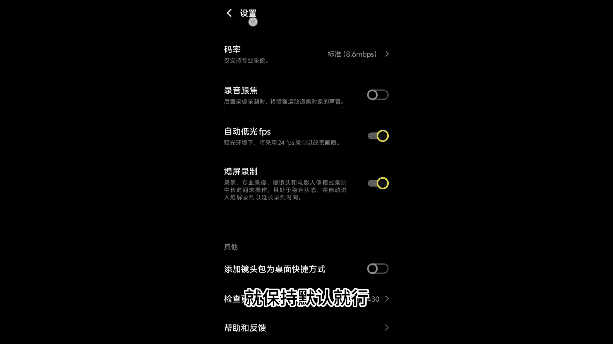

# vivo手机拍照操作课，零基础玩转vivo摄影功能 _ 杨老师讲摄影：13_vivoX100操作功能讲解

这堂课和同学们来讲一讲vivo叉100这个系列的手机是怎样来进行一些设置，还有它的一些独特的功能的。呃，首先呢我们记录的是vivo叉100这个手机常规的拍照的这个模式。这个模式呢我们可以调节焦距0。

6超广角一倍，常规的焦距2倍。3倍啊，还有这个10倍啊，这些是它常用的这个可以直接点击的数字。那么这款手机它的变焦功能非常强，我们可以直接双手去拉动。呃，我自己测试下来就是在10倍以内，我们直接去拉动。

直接这样滑动也好，或者说直接两个手指在屏幕上拉动也好，得到的画质都还是可以的，画质都还不错。所以这款手机它的这个呃变焦功能以及长焦功能做的不错啊，在光线好的情况下，1倍以内去拍摄都还可以啊。

所以这款手机我们可以放心大胆的在光线不错的。像晴天白天去使用它的这个长焦和变焦功能啊。当然如果要呃更加的便捷一些，那么就直接拉动啊，直接点击就可以了。那。左侧我们来看一下它的一些这个设置功能，闪光灯啊。

这里我们把它关闭就行了。然后这里呢有这个颜色模式啊，鲜明就是相对来讲呢整体啊是比较偏亮一点。然后质感呢是更加增强一下明暗对比，能够凸显更强的画面的质感。然后还有第三个是自然的这个色彩啊。

看起来也会稍微鲜亮一些。呃，我建议呢要么就用质感增强明暗对比，要么就用这个自然啊，相对来讲色彩看起来啊好像要好一些。然后这个功能，这朵小花是超级微距的功能，点到超级微距呢手机它会自动的开启到三倍长焦啊。

进入到微距拍摄的一个模式啊，点这个小花就是微距按钮了。然后这里的设置按钮呢就是调节照片的比例，一般是4比3。这里是延迟5秒延迟10秒钟来拍照，一般我们选择无延迟啊。

然后构图线打开水平仪可以打开这个抖动提示可以把它关闭，不用打开。然后效果大师啊，这里面不用管它啊，效果大师把它给关闭就行了。水印呢可以打开呃，设置到这个蔡司边框这个就可以了啊，开启好，这个运动追焦啊。

我们可以用来拍摄这种追焦的效果可以自动自动追焦也可以手动追焦啊，可以直接开启去拍摄就好了。好，然后HDR功能也可以打开，在拍摄一些风景照片的时候呢。

可以更加的呃得到曝光更加均匀的这个画面就是常规的一些拍摄啊，常规的设置啊，更多的设置这里面啊，像这个快门声地理位置自拍镜像啊，这个可以把它打开超广角校正打开啊，其他的保持跟我的这个默认的设置就可以了。

好，然后录像这个分辨率啊，分辨率呢我们这里可以选择到4K60呃，前置这里。那可以选择1080P30就可以了。好，然后呃电影人像这里面选择到1080P30。然后再看。

专业视频这里面咱们也选择了4K60驱啊啊，这样拍摄出来更加的高清，当然也会更占内存。慢镜头这里咱们选择1080P120帧，这里就可以了。然后。延时摄影，咱们选择了4K30帧就可以了啊。

设置好这些分辨率就可以了。其他的啊就保持默认就行啊，其他不用做过多的设置。好，我们再看一下啊，拍摄模式，这里面抓拍就是用来抓拍一些快速运动的一些像奔跑的小朋友，一些快速运动的动物来进行抓拍就可以了。哎。

这个防抖提示，我要把它关掉啊，这个没啥用啊。如果把它打开的话，中间就有一个黄黄的这个圈啊，可以不用。

我们拍的时候只要拿完手机去进行拍摄就可以了。好，抓拍就是用来抓拍一些快速运动，快速跑动的这个物体的。比如说飞鸟都可以用抓拍的模式去拍夜景用来拍摄夜景功能的，直接去拍就行了啊，不要去调任何的参数。

调整焦距就行。其他参数一个都不用去调整。好，人像模式，这里面我们重点说一下人像模式，这里面呢可以调整不同的焦距，它这里有5个拍人像的焦距。第一个是一倍一倍对应的焦距是24毫米，1。5倍对应的是35毫米。

2。2倍对应的是50毫米，3。7对应85毫米，4。3100毫米。注意看啊，我们切换的这个数字的时候就会显示1个24355085100拍人像用这5个不同的焦距，能够获得不同的构图啊。

我们根据拍摄的场景和构图灵活选择就可以了。用这5个灵活去进行构图的切换就没问题。好，再来看一下啊，这个按钮是调节一些。虚化的效果的啊，我们这里可以调节虚化的程度，一般呢默认是F2。0啊。

然后选择自然就可以了。然后这里是美颜啊，美颜我们就选择自然就可以了啊。然后这里最上面这个是风格，可以调整到不同的这个人像的风格啊，自然质感清爽，复古蓝调，高级灰黑白等等，可以选择不同的这个人像的呃风格。

一般呢它默认是自然，就用这个默认的就好了。人像模式是vivo手机它非常强的一个拍摄功能。比其他所有手机，拍人像都好啊。我认为目前是拍人像最好的手机。好，我们再看一下啊，拍照模式，刚才咱们讲到了录像功能。

我们正常去开始呃录像，开始拍视频就可以了啊，这里选择分辨率都可以啊重新设置，重新调整。如果你觉得4K分辨率太占内存了，就用1080P。但是这个帧率啊一定要选择到60帧拍摄出来的视频，它会更加的顺畅。

更加的丝滑一些。好，我们再看到那这个模式就是它内置的一些拍视频的一些模板，一些这个功能啊，一般我很少用这个效果，用这个模式去拍这个功能可以忽略啊。然后剩下的像专业模式啊。

这里面该有的都有跟我们呃这个课程里面讲到的专业模式，第三课是一模一样的，参照这节课去看就可以了。啊，然后呢。更多里面它这里面时光慢门就是用来拍慢门的。我们在专门讲到慢门的那堂课里面也有讲到。

可以再去重新看一下，都是一样的。好，看一下其他的功能还有没有什么独特的。其他的功能呃几乎啊就差不了太多了。超级月亮啊，可以用来拍大月亮啊，根据这个构图去选择合适的焦段来拍大月亮延时摄影。

这里面也有专业延时摄影模式，可以调节拍摄的这个速率，可以调节这个专业模式的参数，在延时摄影的那节课里面也可以点击进入去看就可以了，是一样的啊。所以这款手机呢跟之前的vivo的系列。呃。

稍微有些区别的地方，就是人像模式多了几个不同的这个焦距，以及在拍照模式下，长焦功能更加出色了。基本上在光线比较好的情况下，我们在3倍和10倍之间，你直接去滑动，直接去滑动。

随便滑到5点几6点几7点几得到的画面的。

质感画面的画质都还可以啊，光线要充分一些。然后这款手机它的超级微距功能啊会更出色一些啊，更好一些，以及人像模式啊多了几个焦距啊，所以它的更好用的地方就在这几个方面。

其他的啊就都跟之前的系列和型号是一样的了。大家可以去看一下另外的几堂课就可以了。好，那这就是vivo叉100这款手机啊，大致的一个呃它独特的一些功能的介绍。

