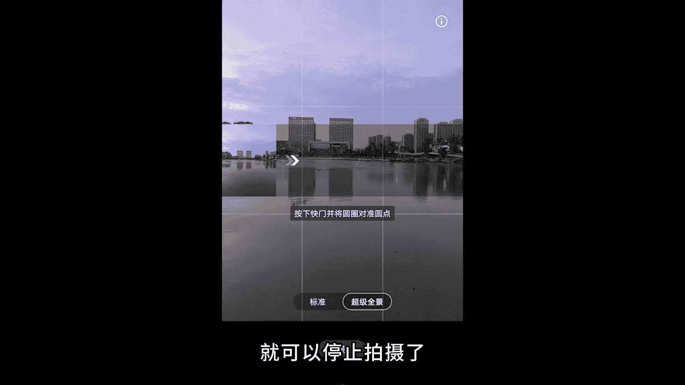
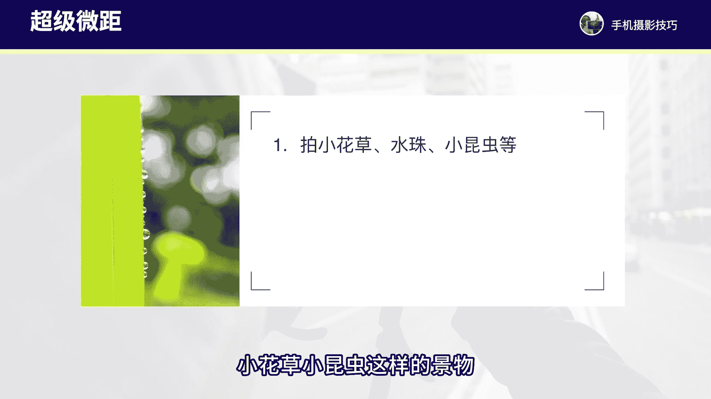
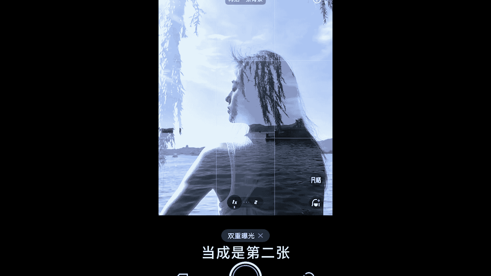

# vivo手机拍照操作课，零基础玩转vivo摄影功能 _ 杨老师讲摄影：2_第2课：vivo手机特殊拍摄功能详解

各位同学大家好。这节课程我们来学习一下vivo手机当中的一些特殊拍摄功能是如何来进行使用的。vivo手机当中有很多的拍摄功能，有些功能我们可能都不会用到，但是有些功能我们遇到一些合适的场景和拍摄的条件。

用到这些特殊功能还是非常出片的。例如我们首先来看一下全景模式的拍摄的操作。这个模式主要是用来拍摄一些比较壮观视野开阔的风景或者建筑场景，拍的过程当中，需要双手拿本手机平稳的来移动手机进行拍摄。

拍摄全景照片首先是可以横屏拍摄。那么拍到的就是风景画面，由左往右的一个非常开阔的视野范围的照片，还可以竖屏拍摄。那适合拍摄比较高的建筑比较高的树，或者说拍人物，也可以竖拍全景，可以拍到比较高大的画面。

例如我们看一下这张照片是横屏拍摄的。拍摄的是弧面的一个日落风景建筑。

这张照片我进入到vivo手机当中的全景模式，然后手机从画面的左边开始拍摄。拍的过程当中，我们要看着画面当中有一个圆圈按钮，我们要让这个圆圈按钮从左往右不断的平稳的移动，就可以停止拍摄了。

到什么地方停止拍摄呢？我们觉得画面的构图差不太多，把我们自己想要拍的画面视野范围已经拍到位之后，就可以停止拍摄了，没有必要环绕一周去进行拍摄。那还有像这张照片，我是在旅行当中看到非常漂亮的雪山风景。

所以站在山顶的地方用全景模式，从左到右拍到一张非常壮观的雪山，日出风景的照片。还有像这张照片呢，我拍摄的是比较高的摩天轮。那这张照片在拍的时候，我进入vivo手机当中的全景模式，手机横着哪。

然后按向跨门开始拍摄。手机先拍到地面，然后再往天上去样拍，拍到更。

多的这个蓝天白云把整个摩天轮高大的效果就拍摄出来了，这张就是用竖拍全景的方式来得到的。所以这是全景模式的两种拍法。还有我们再来看一下vivo手机当中还有一个模式叫做超级微距。这个功能。

这个功能主要是用来拍摄一些非常细微的画面。例如我们可以拍摄像水珠小花草小昆虫，这样的景物可以拍的非常的细微。那这样的画面我们在拍的时候一定要拿稳手机拿的特别的稳，而且距离要特别近。

靠近到2到3厘米进行拍摄，然后不断的点击屏幕当中的水珠或者昆虫主体来进行对焦，才能拍到比较清晰的画面。如果照片拍摄出来，觉得不清晰，那我们需要在轻微的调整一下拍摄的距离，让照片的对焦达到比较清晰的状态。

例如我们来看一下这张照片呢，我就是用手机的超级微距模式来进行拍摄的。我们在vivo手机拍摄界面顶。

步的按钮当中可以打开这个小花朵的按钮。那这个按钮呢就是微距了。打开之后我们就靠近去拍摄小水珠，点击屏幕当中的小水珠来进行对焦，拿本手机当对焦比较清晰之后就按下快门拍摄。

就能够拍到非常清晰的水珠微距照片了。还有像这张照片，我也是用vivo手机的超级微距来拍摄的一个小虫子。那么在拍的时候也是离得非常非常近啊，离小虫子大概3厘米左右这样的一个近距离。

拿本手机对焦在小虫子身上来进行对焦清晰之后就按下快门就得到这样一张微距照片了。所以拍摄微距，我们需要去找到非常细微的水珠，小昆虫的画面就可以拍到清晰的微距照片。

接下来我们再来看一下vivo手机的超级月亮这个功能。超级月亮可以拍的非常大非常清晰的月亮照片。例如像这张照片就是用超级月亮模式拍摄得到的。拍月亮照片，我们尽可能呢呃是要把手机的变焦拉到比较大。

基本上要拉到10倍以上的焦距，才能够拍到比较大比较清晰的这个月亮拍的时候一定要拿本手机。如果手机拿不稳的话，可能月亮在画面当中会跳来跳去不够清晰。要点击月亮对焦，画面清晰稳定的时候，就按下快门拍摄。

例如我们来看一下，像这张照片，我就是用超级月亮模式拍摄得到的月亮。当时我在拍的时候遇到好看的月亮，然后就拉起手机变焦拉近到30倍左右。拿本手机点击月亮对焦就可以拍下非常清晰的一张月亮照片了。

还有我们再看这张照片，我也是用vivo手机的10倍变焦来拉近构图拍到一张月亮照片。当时这张照片的拍摄呢还是在下午天还没有黑的时候，所以能够拍到比较通透的蓝天，同时也找了几个树枝来作为前景。

跟月亮形成一个呼应。这样构图就会非常的耐看了。所以拍摄月亮照片，我们尽可能拿本手机用到vivo手机的。

长焦去进行拍摄，就能够把月亮拍的比较清晰了。这个功能呃操作其实难度不大，我们就只要拿本手机对焦清晰，放大焦距拍摄就可以了。那接下来我们再来看一下vivo手机当中的运动模式。

这个模式主要是用来拍摄一些运动的场景或者人物。比如说我们拍摄这个跑动的人物，我们拍摄飞鸟以及跑动的孩子，我们拍摄跑动的车子，就是把运动速度比较快的景物，把它拍的比较清晰。

因为常规的拍法是没有办法把运动的这些景物拍的比较清晰的。例如我们来看一下啊，像这张照片呢就是拍摄跑动当中的人物。那么在拍的时候呢，进入到vivo手机的运动模式当中，直接拿起vivo手机来跟随人物。

在跑动过程当中来按下快门拍摄，就可以抓拍到人物回头人物的飘动的头发，人物的这个手的姿态拍的非常的清晰，主要是用来拍摄运动当中的人物或者。

或者车子，还有像这张照片拍摄的是飞鸟，也可以使用运动模式来进行抓拍，可以把飞鸟的细节翅膀煽动的瞬间拍的特别的清晰。今后遇到高速运动的物体，咱们都可以采用运动模式来进行拍摄，能够抓拍到更加清晰的照片。

接下来我们再来看一下vivo手机当中的高像素功能，这个功能呢平时我们用的可能比较少，主要是用来拍摄一些光线比较偏弱，以及我们想要保留更多的画面信息的照片和场景，一般拍摄风景照片比较多。

日常的拍摄用的比较少。如果我们对像素对照片的画质有更高要求的情况下，用这个模式拍的照片能够保留更多的画面的信息和色彩的信息。后期调整以及后期处理的时候，就能够保留更多的画面细节了。另如我们来看一下。

像这张照片呢，我是在一个逆光的场景来进行拍摄。那在这里拍摄呢，由于阴影比较多。我为了让照。

拍到的这个清晰度更好，所以进入到高像素这个模式。然后拍的时候呢呃用手机的超广角来取景啊，拍到这样一张光影感特别好的照片啊，用高像素模式来拍摄的。还有像这张照片啊，拍摄的是夜晚的风景啊，光线比较弱。

所以这张照片也是用了高像素功能来进行拍摄，可以看到画面的细节呃，可以保留的更好一些。接下来我们再来看一下vivo手机当中还有一个功能叫做双重曝光，这个功能也比较有意思。双重曝光是指我们拍摄两张照片。

然后合成为一张照片，这个模式，我们在拍摄的时候就需要拍两张。首先我们可以拍一张人物照片，然后再拍第二张风景照片，这样结合在一起的画面呢会非常的有抽象感。一般来说我们尽量取景的时候。

找比较干净的背景来进行拍摄，能够更好的突出人物主体。例如我们来看一下啊，这张照片当时我的拍摄是在湖边上。首先我。

拍人物的这个背影侧身，先找干净的这个天空做背景来拍摄一张人物侧脸，人物背影的照片。拍完之后，人物走出画面，不要拍人物了。第二张照片我们就拍摄一张风景的照片啊，可以拍摄一张树枝背景天空这样的照片啊。

当成是第二张。那么拍了第二张之后，照片也就拍摄完成，就得到一张双重曝光的照片了。这个功能比较有意思啊，所以我们今后遇到类似的场景，可以拍一张人物和风景的照片就能够得到比较不错的双重曝光的画面了。好了。

那么这节课程呢咱们就主要学习了vivo手机当中的这些特殊的拍摄功能。这些功能可能平时使用情况并不多。但我们遇到合适的场景和时机就可以把这些功能给运用起来。大家就可以把vivo手机当中这些功能。

我们先做一个熟悉和了解。今后在合适的时候就可以用起来了。那这节课程我们就先学习到这里，下节课我们再来继续深入学习。

