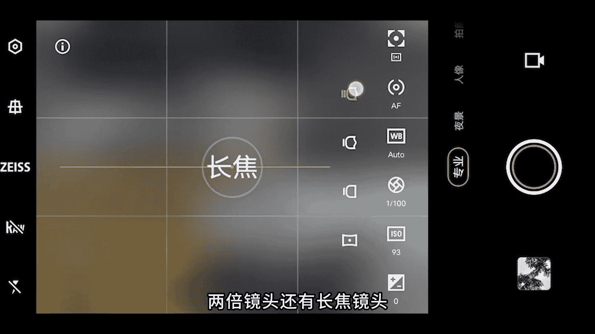
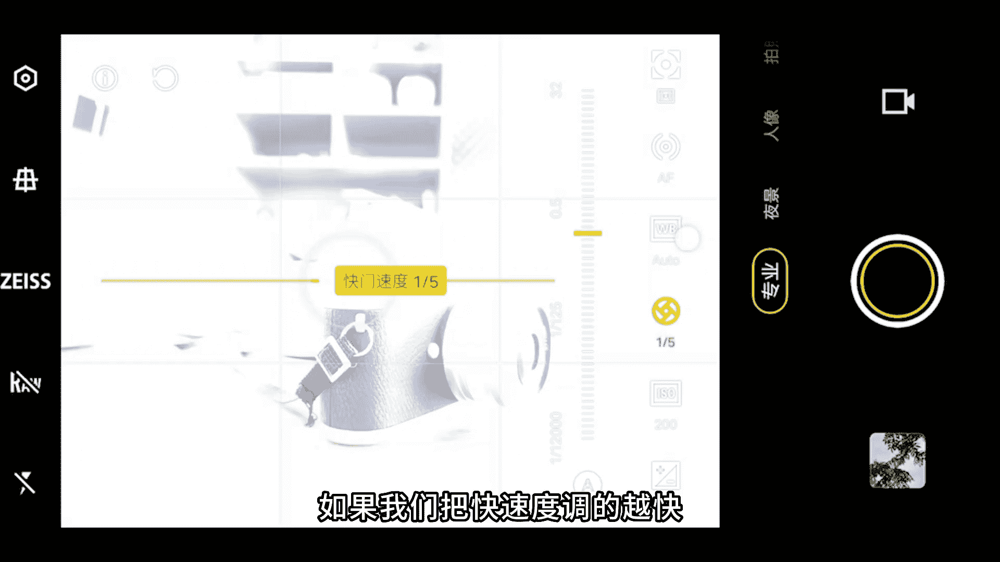

# vivo手机拍照操作课，零基础玩转vivo摄影功能 _ 杨老师讲摄影：3_第3课：专业模式的参数调整和详细运用

各位同学大家好。这节课程我们来学习一下vivo手机的专业双影模式，参数的功能和作用是怎么样的，以及如何来进行拍摄和调整。那首先我们先进入手机的专业模式。

详细的来看一下专业模式的这个参数界面都是如何来进行控制的。我们进入vivo手机的专业模式，这就是拍摄的界面了。在专业模式下，我们先看一下左侧的这些按钮，所以上面这个按钮是设置啊。

这里面跟拍照的设置差不太多。一般来讲呢构图限制里要打开水平仪也可以打开水印，看我们自己的需要，包围曝光，这里啊，它的意思呢是啊拍摄3张或者5张7张啊，拍摄不同的这个画面的曝光。一般来讲这个功能呢。

我们把它关闭就好了。一般不太常用，间隔拍摄这里我们看是否需要啊。如果开启的话，可以设置拍摄的张数多少张啊，间隔多少时间去拍摄一张照片。这里面呢就一般用的比较少，一般把它关闭就可以了啊，设置这里面绑。

持跟拍照模式下的设置一样就可以了。那么这个按钮呢是可以把这个地平线校正功能打开，打开之后，中间屏幕当中会有条黄线啊，可以纠正我们在拍摄的时候，如果手机没有端屏，可以帮助我们校正地平线。

接下来第三个呢是蔡司自然色彩，这个看自己的喜欢是否打开。不过我个人的经验是打开或者关闭，对照片拍摄出来的色彩都没有太特别的影响。我这里呢是一般把它关闭的。第四个啊这个是肉格式。

这个格式呢可以保留更多的原片的色彩信息，后期调色的空间会更大。当然它也会更加的占内存，一般呢我是把它关闭的。那么下面的闪光灯，咱们一般是把它关闭。好了，那么右侧就是专业模式的这些参数的调整了。

首先啊我们来看一下啊，上面这里啊有几个这个镜头，这几个按钮呢分别代表的是超广角，一倍镜头，两倍镜头。

还有长焦镜头啊，这个看自己的手机，它的焦距是多少，就分别代表是几倍的焦距了。总之呢是超广角一倍镜头、两倍镜头和长焦镜头。那我们调整到一倍标准镜头。那右侧的这些参数，我们从最下面往上看。

最下面这个参数呢是调节画面的曝光，这个叫曝光补偿，这个参数跟拍照模式下的像太阳是一个作用，直接简单粗暴的来调节画面的明亮度，一般来讲在专业模式当中，这个曝光补偿参数，我们把它调整到零。

永远不要去调这个参数就对了。这个参数不要去动。好，第二个参数ISO这个叫感光度。那这里呢最下面啊有一个字母A这个字母A代表的是自动。如果我们调整到了其他的感光度数值。那么我们需要把这个参数调到自动的话。

点一下A，那么参数就自动了。好，第三个是快门速度啊。这里快门速度呢，我们可以调节快门速度，这里我们先固定一个数值，比如说固定到320分之1秒，那我们再来调感光度这个参数，感光度调的越偏高，画面就越亮。

感光度越调低，画面就越暗。所以感光度它对画面的曝光影响就是越高，画面越亮。但同时如果感光度调的比较高，随之而来带来的噪点也就越高了。所以一般白天光线比较充足的情况下。

感光度我们是调整到50到200之间不要太高。那我们再看我们再来看一下快门速度这个参数，这个参数我们越把它往高处去调，也就是快门速度调的越慢，现在快门速度是15秒，再往上去调，最慢到达32秒。

快门速度越慢，曝光时间越长，画面也就越亮。如果我们把快门速度调的越快，比如说21秒，51秒，画面就会越来越偏暗。这个代表的是曝光时间越来越短。

进入到镜头当中的光线就越来越少，所以得到的画面的亮度也就越偏暗了。这就是快门速度，它对于画面光线的影响。那么第四个叫做白平衡，这个参数呢可以调节不同的画面的色调。一般我们用自动就可以了。

就直接点这个A就可以了，保持默认自动就行。第五个参数叫做AF这个叫对焦。对焦呢我们可以拉到最上面就代表的是对焦在最远处，远处背景是清晰的。而如果说我们对在往下走啊，那么近处的如果相机拉的更近。

那么近处的这个相机它是清晰的，而远处的背景是虚掉的。所以这个呢是用来调节画面对焦清晰度的意思。一般这个参数我们很少去调，只有在拍虚化光斑拍摄星空照片，夜景场景需要去做调整。

一般我们直接用手点击屏幕来进行对焦就可以了。那么最后一个功能叫做测光模式，这里面呢有三个平均测光，中央重点测光，还有点测光，一般就保持中间这个默认的就可以了。不用单独去做设置。

因为不管用任何一个测光模式，最后拍到的照片的曝光效果都差不太多，所以这里就不用做单独的去做调整了。在专业模式当中，我们就只需要去调整感光度快门锁。速度还有偶尔情况下需要调整对焦这个参数就可以了。

这就是专业模式啊，每一个参数的功能和作用，以及我们也需要去调整不同的焦距来达到不同的构图的效果啊，这是vivo手机的专业模式。好了，通过刚才的讲解，想必大家对于专业模式的界面有了熟悉。

那我们这里再来做一个巩固啊，在专业模式的拍摄界面呢，首先我们要看到啊这上面四个按钮呢是分别来调整vivo手机的焦距的超广角一倍2倍以及长焦。那么下面才是参数栏，最左边是曝光补偿。第二个感光度。

第三个是快门速度，第四个是白平衡，第五个是对焦模式，最后一个是测光模式。那我们可以把这个画面截图回去好好的去把专业模式的参数一个一个对照着，把专业模式的每个参数，我们都知道它的这个功能和作用。

那我们这里重点和大家强调一下专业模式当中啊，我们需要调的参数。只有两个，一个是感光度和快门速度，对焦模式，偶尔的情况下需要去做调整。那么其他的三个参数曝光补偿、白平衡，还有测光模式。

这三个都不用做任何调整。这个页面大家也可以好好的截图保留下来。那专业模式，我们在什么场景下去使用呢，有几个常用的拍摄场景。首先第一个使用场景，就是我们可以用来拍摄星空照片。像这张星空照片。

我就是用vivo手机的专业模式拍的。那么感光度我们可以调整到3200左右，快门速度可以调整到20到32秒左右。根据我们拍到的照片的这个亮度来适当的调整。如果亮度不够，我们可以调整到32秒。

如果亮度比较亮，那就可以调到20秒左右就可以了。第三个参数是AF这个是手动对焦，我们可以拉到最右边就可以让手机的对焦对在最远处，因为星性非常远，所以调整到这个参数用来拍摄星。照片就是非常合适的。

那么第二类拍摄场景呢就是用专业模式来拍摄高速摄影的照片。像这张水花四溅的照片，就是用专业模式拍的那我们需要调整的参数，首先第一个感光度调整到400到800左右。

第二个快门速度我们调整到2000分追秒左右，快门速度是参数调整的关键，一定要把快门速度调到2000分追秒才能够把水花飞溅的这个非常高速发射的瞬间给拍下来。如果快门速度不够快，那水花是拍不了这么清晰的。

另外我们一定要注意其他参数呃，可以不用做任何调整，但一定要在光线很强的地方来拍摄这样的水花四溅的照片，光线如果弱了，那么用这组参数拍出来，可能画面的亮度就会比较偏黑。

所以尽可能在光线亮的地方用到这组参数就可以拍出来水花四溅的照片了。那么第三个拍摄场景呢就是拍摄追焦的照片。像这样的照片就叫做追焦背景有非常具有速度感的虚化效果。那么主体车辆是非常清晰的，拍摄跑动的车子。

首先，感光度我们可以调整到100甚至更低，调整到50左右。快门速度调整到30分之1秒到60分之1秒左右，一般30分之1秒用的更多。那么另外的参数就不用做调整了。

拍摄时间最好是在夜晚或者说傍晚光线比较弱的时候来拍啊，拍的过程当中呢，我们先点击路面对焦，当车子进入到我们的对焦框之后，在移动手机让对焦框跟着车子移动一小段距离之后。

再按下快门就可以拍到比较清晰的这样的追焦照片了。还有一种拍摄场景叫做光斑虚化，主要是用来拍摄一些夜晚的灯光，光斑效果的这个照片效果，参数的调整就很简单了。我们直接把AF这项参数啊，对焦拉到画面的最左边。

拉到最左边画面就。全部虚掉了，而其他的参数一个都不用做调整，就能够把夜晚的灯光拍出这么具有柔美的光斑的效果。啊，所以这四种拍摄题材，拍星空高速摄影，拍追焦拍虚化的光斑，是专业模式比较常用的四种拍摄题材。

那么其他的情况下，我们就很少会用到专业模式了。专业模式的目的是让我们在光线比较弱。比如说拍星空拍夜景的时候，可以让画面的亮度曝光更加的充分到位。并不是说我们用了专业模式，照片拍出来就更加的专业。

以及我们在白天光线比较充分的场景当中是用不着专业模式的。所以我们就只要记住，在刚才所讲到的四种场景去使用专业模式就可以了。那接下来呢大家就把专业模式里面的功能和每个参数的作用，大家好好的去做熟悉和掌握。

以及这几种拍摄场景的参数调整。那这节课程我们就讲解到这里。下节课我们再来。

继续深入学习。