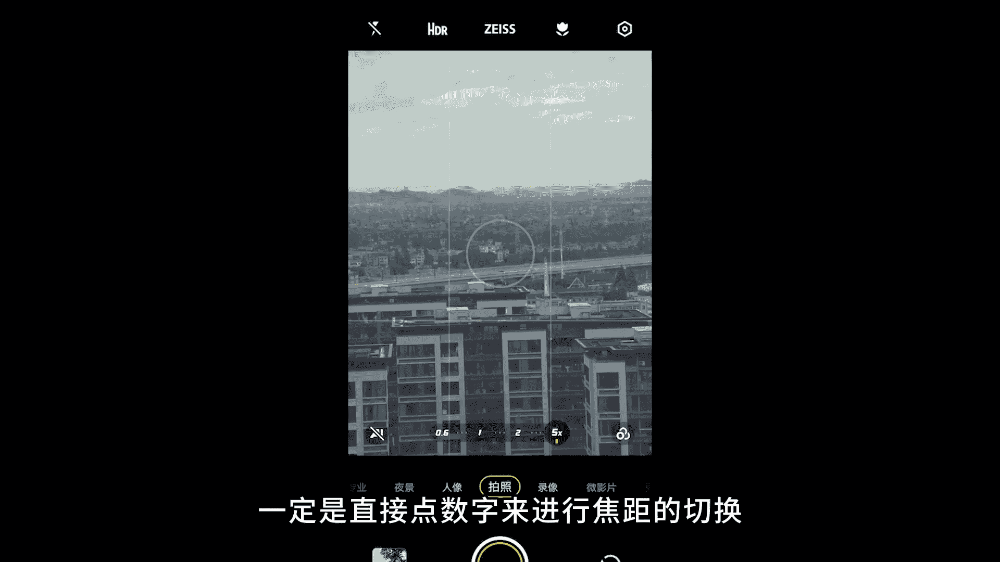
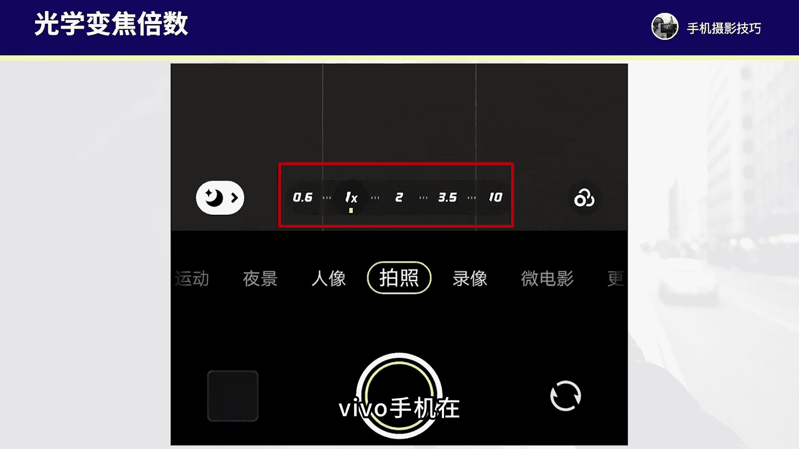

# vivo手机拍照操作课，零基础玩转vivo摄影功能 _ 杨老师讲摄影：4_第4课：vivo手机变焦功能的拍摄技巧

各位同学大家好。这节课程我们来学习一下vivo手机的变焦功能。在拍摄过程当中的操作和运用。我们在vivo手机的拍摄界面可以直接点击屏幕上的这些数字来进行焦距的切换。我们在进行变焦的时候，一定要记住。

点击屏幕上的数字直接切换变焦，不要用两个手指放大拉近。因为如果用两个手指放大拉近，那么切换到的就是一个画质压缩很厉害的数码变焦一定是直接点数字来进行焦距的切换。那我们就要注意了。

如果我们在拍的过程当中拉近变焦会遇到一个问题，画质会下降，画质会降低。如果我们点数字来进行切换的话，那么画质它的下降呢就不会很大，得到的画质啊，它的压缩是非常非常小的。

如果直接拉到一个不是这些数字上的焦距，那么画质压缩就更厉害了。那一般来讲呢，我们普通的拍摄变。

焦一般不要超过5倍，超过5倍，那么手机的画质它就非常的下降明显了。当然拍月亮除外啊，因为月亮的拍摄我们一般都是变焦10倍以上，而且vivo手机都有超级月亮功能。

所以拍月亮得到的清晰度呢是比较不错的那我们详细的来看一下vivo手机当中啊，不同的型号，可能这个变焦的数字不一样啊，例如我现在的这个画面呢是vivo叉80pro这款手机。那么它就有0。

61倍、2倍、5倍，这几个数字可以直接去进行切换。那如果说是像vivo叉90pro加这些型号呢啊，或者说更新款的一些未来。那可能它的这个数字0。61倍、2倍、3。5倍为主。那10倍它是一个混合变焦。

10倍不算是光学变焦啊，十0倍的画质压缩也还是比较大的那我们具体的来看一下vivo手机在拍摄场景当中，我们应该怎样来进行灵活的变焦来。

让构图变得更加的有看点。首先我们看一下这个场景。这个场景呢我是在一个4园当中啊，这个大厅里来进行拍摄。当时这里啊我是用普通的一倍焦距来构图。那我发现中间其实有个门框，而且后面呢有一座塔。

所以我就可以用长焦啊，在这里用5倍变焦拉近来构图。那这里就形成一个框架构图的视角，前景这些地面柱子，包括大厅的顶部就不要拍到了，长焦来进行拍摄，可以让构图更加的干净，更加的简洁。

后面的塔恰好是位于这个门框当中的，做一个框架构图，而且这个门框的线条以及这个窗户上的纹理也还算比较通透。所以这张照片呢这样用长焦构图就会更加的有看点，构图主体也会更加明确了。

另外我们再来看一下啊这个拍摄的场景。这个场景呢我是在呃江西的婺源秋景的。时候去拍摄的那这个地方当时是日出村庄当中有晨雾，也有一些这个秋色的树林。那这张照片现在还是一倍将距拍摄。

当然这样的照片是没有看点的。因为虽然有阳光有晨雾，但是画面元素太多了，没有重点，所以我就选中画面中间的这个区域，vivo手机我直接切换到5倍成交来进行构图，所以五倍成交我拍摄到的就是这样一张照片。

让构图更加的突出。房屋建筑和后面的树加上乘物在中间能够形成非常好的简约的意境，就像一幅画一样。所以长焦是可以取局部的画面来让构图更加明确。另外我们再来看一下这个场景啊，我拍摄的是一张月亮照片。

这张照片呢用的是3。5倍这个焦距来拍摄的那这个焦距拍到的月亮显然有点小，前景的数枝也拍的太多，所以我就用10倍来进行拍摄，十0倍拍摄到的这个月亮就更加的凸显，树枝也更少一些。这样构图第一更极简。第二。

月亮作为主体更加明确，更加突出。一般来讲，我们在拍月亮的时候，呃，10倍以上的焦距都是O的。没问题啊。如果说拍其他的风景那1倍，我们只有在光线非常好的情况下才能去使用光线稍微弱一点。

10倍拍的照片画质就会下降非常厉害了。那我们再来看一下啊，这个拍摄场景，我当时呢是在沙漠当中旅行这张照片当时的拍摄啊现在还是一倍焦距。那现在的画面其实没有太多的看点。虽然沙漠的这个纹理线条呃比较丰富。

但是太多太杂了，没有主要的一个线条的规律感。所以我就重点观察中间这。这个区用手机的5倍长焦拉近来构图，就把远处的这个沙丘的线条，像一个S型的线条往远处去延伸的这种感觉拍摄出来。

同时再加上早上的阳光打在这个沙丘上，能够形成非常强的明暗的层次。所以这张照片用长焦来拍摄，就能够凸显沙丘的线条感以及明暗的层次感，更加的明确和突出了。

我们再来看一下这个拍摄场景。这个场景呢，我当时是在新疆旅行当中啊，拍摄的在新疆塔县的盘龙古道这个地方啊公路的线条感蜿蜒的感觉挺好。但是我们在这个地方由于机位高度有限，拍这个道路的蜿蜒线条的话。

不太能够把这个S型的弯道线条拍摄出来。因为机位的视野太受限了。如果要拍这个公路线条的话，可能需要无人机伸得非常高，往下俯拍才能拍出来。那这里呢其实我会发现啊，后面的这个山丘有阴影。

也有这个阳光同时有一些这个烟尘啊，在背景当中后面有云彩。所以在这里我会考虑使用手机的长焦来拉近构图，就不要前景的这些公路和这些公路的护栏。因为前景的层次感不算特别好，所以我用长焦拉近来构图。

拍到就是这样一张构图更加的有独特感。山丘之间的层次，山丘之间的这个线条感，再加。上阳光与阴影之间的一个对比，这样构图拍的照片啊层次感就会更加的鲜明了。

所以长焦拍的画面它的独特感会呃更加的具有不错的一个表现力。还有我们在看这个场景，这个场景呢是我拍摄的一个古镇，江南古镇。那这个古镇呢其实现在是一倍焦距啊。当然现在水面非常平静。

一倍焦距拍摄到的画面呢也是不错的啊，倒影的感觉非常美啊，很静谧的感觉。但是这里啊我们除了用一倍焦距来拍之外，还可以用长焦来进行拍摄。所以当时我就用手机的光学面焦3。5倍，我拉近构图。

我重点拍的是局部的这个建筑啊，局部的这个建筑的结构和层次。用长焦拉近了构图，就拍到的是这样一张。建筑的层次，建筑的一个细节了。所以长焦拍细节广角拍全景，广角拍的比较全，表现的是壮阔的画面。

长焦拉得近就重点表现细节。所以今后我们在拍摄的时候，就要看我们这个场景要表现的重点是什么。从而选择到合适的焦距来进行构图，让照片的美感和意境变得更好。好了。

那么这节课程呢就重点和大家讲解到vivo手机的这些变焦的倍数以及vivo手机变焦功能，在拍摄场景当中的运用。那么这节课程呢大家就需要重点的掌握自己的vivo手机到底有哪些光学变焦的倍数。

我们今后尽可能使用手机的光学变焦倍数来拍摄，这样才能拍到更加清晰的照片。在光线不是特别好的情况下，我们尽可能不要变焦拉大到太大的这个数字。要不然拍到的画质就不是那么好了。

充分的了解到每个焦距拍摄到的画面视野范围。这样我们才能够在不同的场景下使用到合适的将距来拍摄，得到构图更美的照片。好了，那么这节课程的讲解我们就到这里，下节课我们再来继续深入学习。

