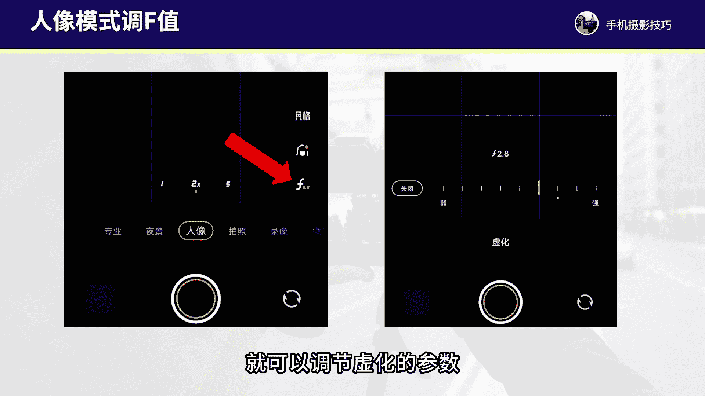
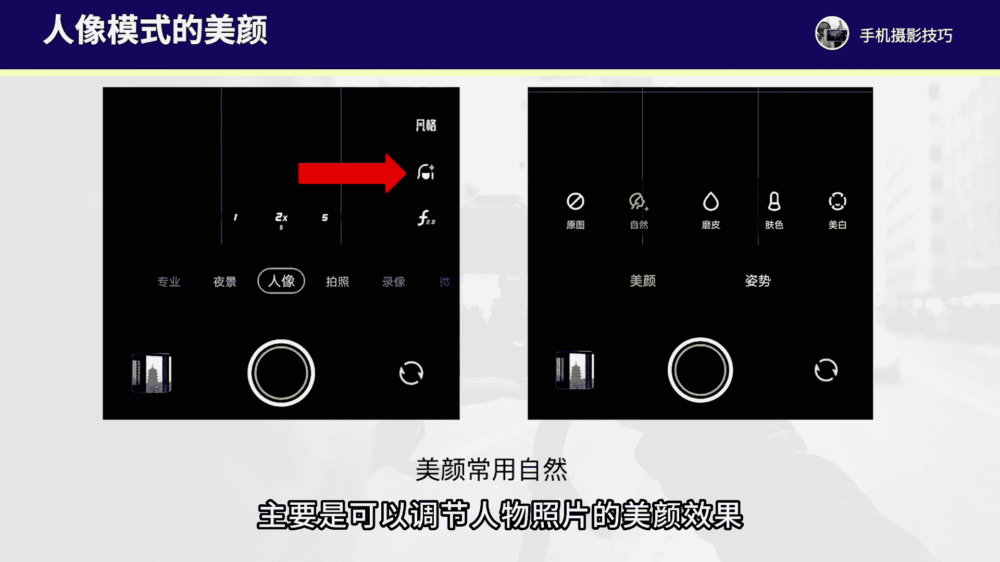
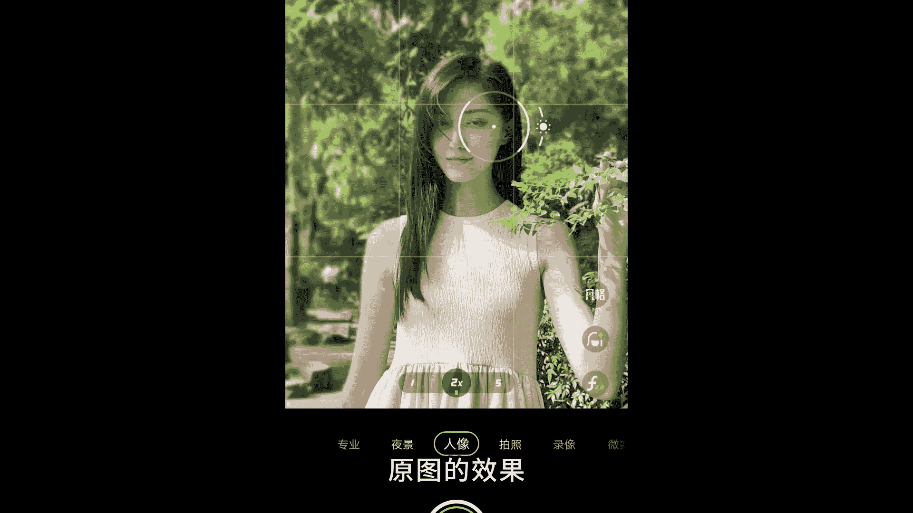
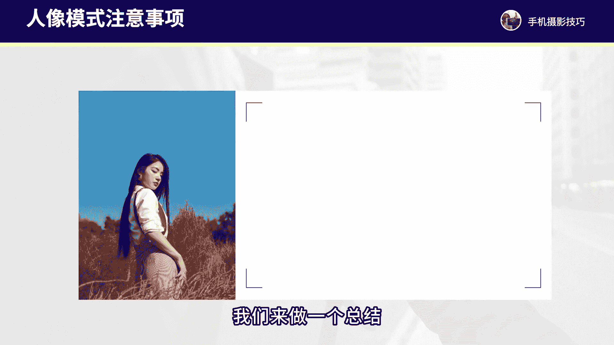

# vivo手机拍照操作课，零基础玩转vivo摄影功能 _ 杨老师讲摄影：5_第5课：vivo手机人像模式拍摄技巧

各位同学大家好。这节课程我们来学习一下vivo手机的人像摄影模式的拍摄操作和人像照片。我们在拍摄当中需要注意的一些事项。首先呢人像摄影模式啊，我们在拍的过程当中，一定要知道的几个拍摄操作。第一。

人像摄影模式，最佳的一个拍摄焦距是两倍焦距拍摄得到最佳。如果一倍可能拍的背景比较多，近距离拍人物可能会变形人像模式主要是用来拍摄背景虚化的啊，两倍焦距拍到的构图也会更加耐看。

还有人像摄影模式除了拍人物照片背景虚化，拍摄花朵、美食静物也都能拍出背景虚化的效果。所以只要想要背景的虚化，我们就都用人像模式来拍摄。另外，人像摄影模式下。

我们有比较多的一些虚化的效果以及风格还有虚化的程度可以做调整，以及我们在拍的时候需要注意的就是拍摄距离，最好控制在1。5到2米这个。距离能够拍到最好的背景虚化效果。人像双影模式下呢。

我们需要注意一下调整的一些效果和参数啊。首先呢我们可以调整背景虚化的数值。在人像摄影模式下，我们点击右下方的F这个按钮就可以调节虚化的参数。这个虚化的数值越往左调背景的虚化就越弱。

越往右调背景的虚化效果就越强。这个主要是用来控制照片，背景虚化程度的。还有中间第二个按钮，主要是可以调节人物照片的美颜效果，一般我建议就用第一个自然就可以了，甚至这里面就保持默认自动，不用手动去做调整。

还有第三个是风格，这里面可以选择不同的背景虚化的风格也可以选择滤镜。如果你喜欢一些呃独特的虚化效果，可以选它这里面的第二个或者说第三第四个都可以去尝试一下。我个人用的最多的就是第一个原图的效果。

拍到的背景虚化效果更加的自然。那接下来我们来看一些人像照。

啊拍摄的这个实操的案例。例如我们来看一下，像这张照片。这张照片我是在一片芦苇草丛当中去拍摄的两倍焦距啊，拍摄得到的照片。我们来看一下这个真实的拍摄场景。当时我拍摄的时候，在一片芦苇草丛当中。

我刚开始呢先以常规的一倍焦距一倍视角来进行拍摄，得到的照片呢，这个画面非常的杂乱，前景的地面前景的杂草太多了，人物的后面是比较多的一些芦苇和后面的这些树林。所以我尝试调整到人像模式两倍焦距。

同时拍摄的机位，我蹲下来，机尾蹲的低一些，机背的高度大致在人物的这个腿部大腿部的这个高度差不多。然后机位稍微仰拍一些，让人物的身后是干净的天空做背景。

不要拍到后面比较多的这个树林对焦在人物的脸部对焦清晰之后，就按下画面拍摄，就得到这样一张人物背景虚化。而且。构图又更加干净的照片了。同样的我们再来看一下这张照片，也是我在一个公园当中啊。

一片草丛的地方来进行拍摄的。这张照片拍摄的场景呢当时其实比较杂乱，后面也是有比较多的一些树杂草和地面。如果常规的角度，我们用一倍焦距去拍摄，得到的照片背景太多，人物显小，前景的地面也拍的非常多。

这样的画面就不太好看。所以我调整到人像模式两倍焦距，拍摄的机位也是稍微低下来一些，机位的高度啊在人物的腰线，这个高度差不多。然后拍摄人物是侧身，同时对焦在脸部。

这样低机位的仰拍构图能够拍到更多干净的天空照背景，画面的背景就更加的简洁，对焦脸部清晰之后，就按下框面拍摄，就得到这样一张背景虚化感更加柔和，同时人物的身体姿态线条，也会更好看的一张照片了。所以。

学会利用人像模式拍出背景虚化的层次，同时拍的时候找机位低一点的角度去仰拍，构图会更加的干净。另外我们再来看一下这张照片啊，当时的拍摄呢啊是在一个树林当中，我用手机两倍焦距。

人像模式来进行拍摄的这张照片虚化的层次感特别好。那这张照片其实当时拍的时候，树林是比较杂乱的。当时我看到这个树林当中，草地比较好看，而且有一些树林的光影挡在草地上，于是想到在这里来拍张照片。

但这里拍摄呢肯定不能用常规模式，一倍焦距拍摄啊，得到的画面没有虚化的这种层次感，前景的地面，背景的树也都太多太多了，所以切换到人像模式的二倍焦距来拍摄。但是如果我们直接找正面的角度去拍。

会拍的很多的后面的树，而且我的机位不能是平拍的角度啊，应该是我站高一点，因为人物是蹲在草地上的，所以我站的机位高一点，站的机。机位高点手机往下去俯拍，找一点点角度啊，让人物后面不要和树重合。

要不然后面的树就会非常抢眼。所以俯拍的角度以干净的地面作为背景。同时人像模式对焦在人物的脸部，按下可拍摄就可以得到这样一张背景的虚化感非常柔美的人像照片了。

这是这是vivo手机人像睡影模式拍摄得到照片啊，非常的柔美。还有我们再来看一下这张人像照片也是在树林当中来拍摄的。这张照片啊，光线是一个左后侧光的光线。那当时拍这张照片的时候呢。

我的基位高度是在人物的腰部高度这个位置。当时拍摄也是切换到人像模式的两倍焦距，机位，我要稍微低一点，然后仰拍，尽量不要拍到太多的地面，而是拍到后面更多的这个树林树叶和天作为背景，这样构图。

照片才会拍的更加的简洁。同时人。也会拍的更加显高啊，极为低一点，大概在人物腰部这个高度，人像模式两倍焦距对焦在人物脸部就能拍出来非常柔美的背景虚化。同时阳光也能拍出来比较通透的照片效果。

所以vivo手机拍人像，它的虚化，以及它得到的人物肤色的美化，还有整体的色调都是非常耐看的。那么vivo手机的人像模式啊，我们除了拍人像照片之外，拍其他的景物。

尤其是拍静物花草之类的场景也是能够拍出来背景虚化的。像这张照片，我是拍摄一个小相机桌面上，我把相机放好手机我们进入到人像摄影模式，二倍焦距，点击相机对焦之后啊，可以稍微降点小太阳。

让画面的明亮对比会更加的增强一些，按下快门就可以拍到一张背景虚化的静物照片，还有拍摄花草照片，同样的也是可以把对焦在花朵上小太阳适量降低，按下快门拍摄静物花草同样的也能拍。

拍出很美的虚环效果。所以人像摄影模式有丰富的运用。不过需要注意的是，人像模式拍风景照片，建筑照片无法虚化背景，因为距离太远了。一般来讲，手机离主体之间的距离，我们控制在1。5到2米左右。

如果是拍摄静物花草距离可能还要更近一点，在半米到1米左右这个距离。好，我们来做一个总结啊，拍人像照片呢我们需要注意，由于人像模式啊是一个副摄像头，它不是手机的主摄像头，它的像素更低。

所以我们尽可能在光线充足的地方来进行拍摄，这样得到的照片的画质才会更好。另外我们需要注意就是焦距，一定是选择两倍焦距，拍摄得到的构图是更加耐看的是人像双影模式，拍人像也好，拍静物花草也好。

两倍焦距是最佳的一个拍摄焦距。还有我们需要注意就是这个距离啊，一定控制好在1。5到2米太。

太远了，可能。这个虚化不好，太近了，有可能对不上焦啊，一定要注意好这几个方面。好了，那这节课程啊我们关于vivo手机的人像摄影模式就讲解到这里。

大家今后对人像摄影模式的操作和拍人像照片的取景角度有更多的熟悉，我们就可以把人像照片拍的更加好看了。那这节课程我们就讲解到这里。下节课我们再来继续深入学习。

