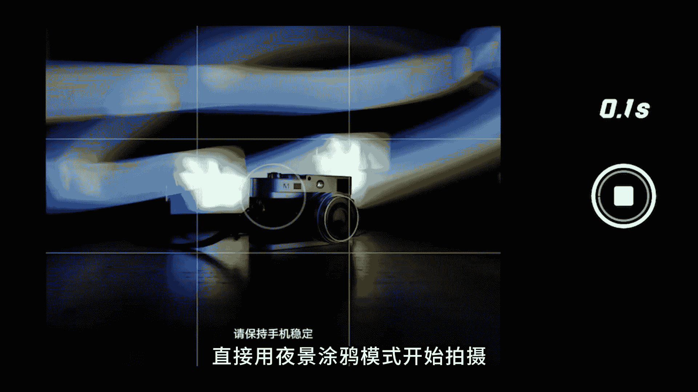
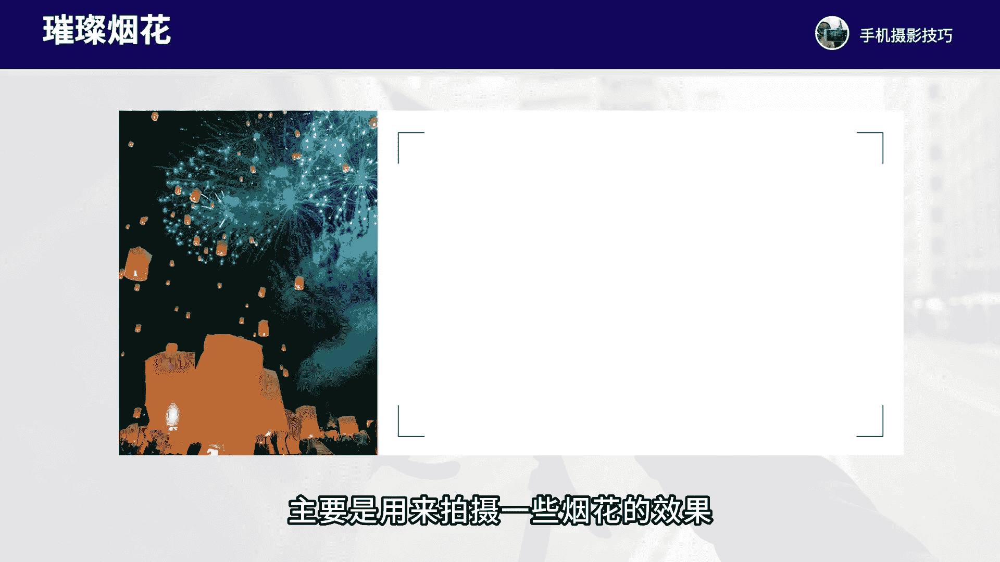

# vivo手机拍照操作课，零基础玩转vivo摄影功能 _ 杨老师讲摄影：6_第6课：玩转vivo手机的慢门摄影

各位同学大家好。这节课咱我们来学习一下vivo手机的时光慢门模式的拍摄方法。这个模式呢主要是用来拍摄一些拉丝慢门的效果。我们在oppo手机的拍摄界面，点击更多，找到时光慢门进入之后会看到有6个模式。

分别是车水马龙、夜景涂鸦，流水瀑布、行人物化，璀璨烟花和绚练新轨，那我们详细的来看一下这6个模式都是怎么来进行拍摄和操作的。首先，车水马龙模式主要是用来拍摄一些夜晚的车流轨迹的效果。

可以把跑动的车子拍出拉丝的状态。我们一般取景要在视野开过的位置，最好要用三脚架来稳定拍摄。如果说是新款的vivo手机防抖功能都还不错，我们用手持拍摄也没问题，但最好要用三脚架。

手持的话一定要拿的非常非常稳才可以。那拍的时间大约是拍3到6秒钟左右就可以出片了。例如我们来看一下像。

这张照片呢，当时我就是在路边用车水马龙模式拍摄6秒钟左右，就可以把行驶的车子拍出拉丝轨迹的效果。当时直接是在一个十字路口的地方进入车水马龙模式，点击画面中间的灯光进行对焦，暗线快门。

等待6秒钟就可以拍出来。这张车流轨迹的照片效果了。同样的，像这张照片，我也是拍摄的这个车尾，这张照片拍的是一辆公交车，我在公交车站台的地方，手机放在支架上机位放的很低一样拍的视角进行拍摄。

可以把过往的公交车行驶的轨迹拍摄出来，非常的有抽象感。还有这张照片也是用车水马龙模式拍的。在一个山顶的位置，我拍摄的是中间山谷当中的公路线条，车子在公路上行驶留下的车灯轨迹的照片效果。

大约拍的时间是30秒钟左右，可以把车流的轨迹拍的更加的拖长。还有这张照片呢，我是在城市当中天。

桥上来进行取景，可以把两侧道路过往的车流拍出轨迹感。所以车坠马龙这个模式啊主要就是用来拍摄夜晚的车流轨迹的那我们再来看一下第二个模式叫做夜景涂鸦。这个模式可以拍摄一些非常有抽象感的光会涂鸦的效果。

一般我们要在夜晚光线非常黑的情况下，使用三脚架，一定要用三脚架才能把画面拍的清晰。如果手持的话，有可能会导致画面比较模糊的情况。一般拍摄时间呢在20秒到1分钟左右都可以。

尽可能要描绘出一个比较完整的图案。这个模式通常来说是不会有过曝的情况的，我们只要拍的过程当中没有太多的灯光，以及拍摄的这个光线，不要太强，就不会过曝。例如我们来看一下这张照片我是拍的一个相机做主体。

背景是拍摄彩色的这个灯光。那这张照片我当时拍的时候呢，是在一个黑暗的。

房间当中，我在画面当中用相机作为主体景物，我用另外一台手机打开一张彩色的照片在屏幕上。然后我用这个彩色的照片在相机的后面挥舞出几道光线的轨迹。那拍摄的时候呢，直接用夜景涂鸦模式开始拍摄。当我用彩色照片。

在背景当中描绘出几个光的轨迹之后，就可以按下快门，停止拍摄，就得到了这样一张光会的照片效果了，非常的有视觉上的抽象感。还有像这张照片，我也是用一个黄色的灯光来甩出一个圆球的形状啊。

站在原地来进行甩出圆球的形状，可以拍摄非常有视觉冲击的一个像是火球的一个状态。那这张照片当时也是在夜晚拍摄的啊，拍了有50秒钟左右，直到我把这个圆球的形状给甩出来，就拍到这张照片了。还有这张照片呢。

我是用烟花棒来进行。

拍摄的我拿着烟花棒一边挥舞圆圈，一边往后退，下面呢是一个水面啊，是个倒影。所以用烟花棒就能挥舞出特别有美感的一个光环的效果，特别有抽象感。所以夜景涂鸦这个模式呢能够拍出非常漂亮的涂鸦光会的效果。

我们再来看第三个模式叫做流水瀑布，这个模式呢主要是用来拍摄一些流水拉丝云彩拉丝照片效果的。我们一般是拍摄有流水瀑布喷泉以及河流这些场景，以及拍云彩都能拍出拉丝的效果，最好使用三脚脚架。

如果是新款的vivo手机的话，手持拿稳一些，也能拍摄。通常拍摄10到30秒钟左右。如果说我们要想拍出比较好看的一些色彩。我建议呢在清晨或者说半吻的时候，拍摄得到的画面的色调更加的柔和。

如果中午阳光比较强得到的照片，有可能会过曝，而且色彩。

拍摄出来比较平淡。例如我们来看一下，像这张照片，当时我是在城市日落的一个场景，湖边湖面上呢有喷泉。那在这里呢我就拿完手机进入流水瀑布模式，开始拍摄。这张照片大约拍摄8秒钟左右，可以看到喷泉。

会直接拍成拉丝的一个状态效果。而云彩也是有一些拉丝的状态。如果拍摄时间更久的话，那么云彩的拉丝会拖得更长。那流水瀑布喷泉效果基本上拉丝效果是通过两三秒就能够拍摄出来的。所以这就是流水瀑布这个模式。

主要是用来拍摄拉丝效果。同样的，还有这张照片也是拍的瀑布，拍摄时间8秒钟左右，把水流拍出拉丝的状态。还有像这张照片呢也是我拍摄的云彩，由于天空的云彩呢是大朵大朵的云走的速度比较快。

所以在这里我驾稳手机拍摄25秒钟左右就能够拍到一张云彩拉丝的照片效果了。这样的拉丝效果，我们一般肉眼是很难看出来的。所以用流水瀑布可以直接拍出来慢门拉丝的照片效果。

那接下来我们再来看一下行人物化这个模式拍摄的这个操作。这个模式呢我们主要是用来拍摄一些人比较多的场景，把走动的人。

杂乱的一些背景的车子，把它拍出虚化的效果。这个模式啊也是最好使用三脚架。新款的vivo手机呢可以直接手持，但是要拿稳一些。那拍的过程当中只要拍4到6秒钟左右就可以了。一般在人多的地方。

比如说游客多的场景，把背景的人把它拍虚掉，只让主体人物保持清晰就可以了。例如像我们在拍的过程当中啊，这个场景我是在西湖边上啊，拍这个亭子。那当时这里呢人特别特别多，我想在这里拍张干净的照片。

所以直接一用行人物化这个模式拿稳手机拍摄20秒钟左右就可以拍到这样一张人物走动啊，是拍出虚化的效果，而中间的亭子，因为始终它都是固定的，所以它保持清晰，这样就能够把走动的人拍出虚化的一个效果啊。

非常的呃能够让照片有一种虚实结合的感觉，让人物看起来没有那么杂乱。所以行人物化主要用来拍摄。些人多的场景。那接下来这个模式呢叫做璀璨烟花这个模式。这个模式啊主要是用来拍摄一些烟花的效果。

烟花爆炸烟花的一些拉丝的形态。这个模式新款的vivo手机可以手持。如果是老款的，最好使用三脚架，拍摄时间只要2到3秒钟左右就可以了。拍摄夜晚烟花过年过节重要的节假日，有烟花的场景就可以来进行拍摄。

比如说像这张照片，我们在拍的时候啊，我就是用璀璨烟花这个模式拍摄时间大约2秒钟左右就可以把烟花的拉丝效果，烟花爆炸所产生的这些火花往下掉落的过程所产生出来的这个拉丝的效果可以记录下来。

所以烟花这个模式呢，也是非常的有趣味性的那最后一个模式啊就是绚丽新轨这个模式了，主要用来拍摄星轨照片的。星轨照片呢，我们一般跟拍摄星空照片的条件是一样。要在户外。

没有月亮，晴朗的天气，远离城市灯光，一用三脚架拍摄时间需要至少拍30分钟以上，以及要对着正北方拍摄，能拍到圆形的心轨。如果对着其他的方向拍摄，可能拍到的这个新轨呢，可能是一个圆弧的一个部分。

例如说我们看这张照片，呃，当时有拍到圆形的这个心轨，中间的圆心就是北极星，对着正北方距进行拍摄，大概率都能拍到这个圆形的新轨。那这张照片呢找了一个建筑啊作为主体，作为前景。

更加的有一个视觉上的虚实的对比，以及让照片呢呃有一个前后的呼应，跟新轨形成更好的一个层次感。那这张照片当时拍了有60分钟左右，用训练新轨模式拍摄，手机装上支架拍60分钟就可以出片了。

还有这张照片呢啊是拍摄的一个圆弧形的心轨，没有拍到圆心啊，因为拍的方向是对着东南方。

像去拍的这张照片拍了30分钟左右，就出片了，时间短一些，取景也是找了前景的建筑来作为主体搭配背景的新轨，这样构图呢会更加的有看点。

所以这就是vivo手机的时光慢门6个模式的拍摄的一些啊操作和拍摄的主要的效果。那么这节课程呢我们就主要讲解这么多，大家重点把这6个模式去重点做一些熟悉和操作，今后遇到合适的场景。

我们就可以把这6个模式使用起来，从而能够拍出非常的有美感和抽象感的慢门拉丝的照片效果了。那这节课程我们就学习到这里，下节课我们再来继续深入学习。

