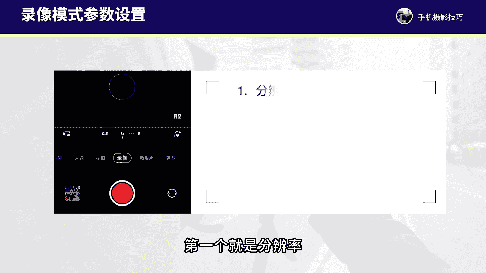
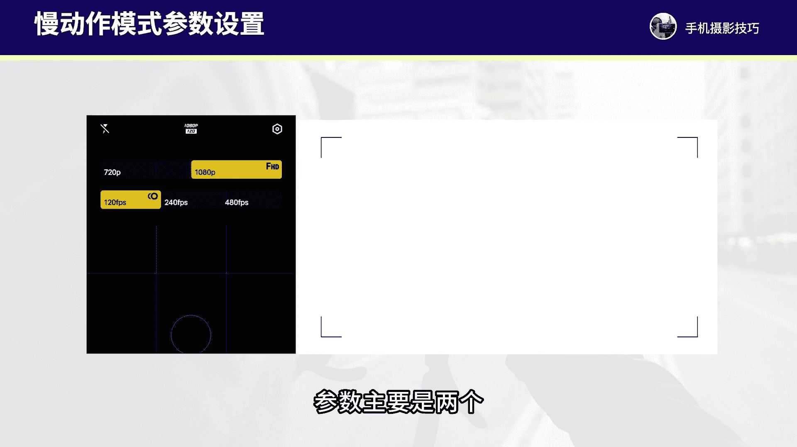

# vivo手机拍照操作课，零基础玩转vivo摄影功能 _ 杨老师讲摄影：8_第8课：vivo手机的录像与慢动作拍摄技巧

各位同学大家好。这节课程我们来学习一下vivo手机的录像模式和慢动作模式拍摄的设置和拍摄的一些基础操作。在录像模式下呢主要是用来拍摄视频的。那么这个模式下，我们首先要调的参数。第一个就是分辨率。

我们直接可以在vivo手机拍摄界面顶部的按钮可以点击调整分辨率，主要调整两个，第一个可以调整到1080P这个负辨率呢清晰度还可以，它不会太占内存，我们也可以调整为4K这个负辨率。

这个负辨率它会占内存更大，但是它的清晰度要好很多。如果说你的手机内存足够，我建议用4K这个分辨率会更好一些。还有帧率，我们需要调整到60FPS用这个帧率来拍的视频，画面的流畅度啊会更好一些。

那还有其他参数不用做任何调整，保持默认的就可以了。我们调整好了这个基本的参数设置，拍视频的时候，我们需要做的就是找到一些。

独特的视角以及运镜尽量的动起来，推进横移环绕等等这样的运镜方式，让视频画面看起来更加有动感，以及尽可能拍到一些丰富的景别。下面我们通过一个在树林当中拍摄的案例，详细的来看一下视频的一些拍摄基础操作。

例如在树林当中，我拿完手机拍摄之前，长按屏幕两秒钟锁定对焦曝光，然后平稳的拿着手机往前推进进行运镜拍摄。然后我再找到一片树叶。手机靠近针对树叶长按屏幕锁定对焦曝光之后，再做一个小环绕的运镜拍摄。

拍树叶的细节。然后我再蹲下来找到草丛当中的小草上的露珠，第机位贴的非常近来拍摄一段非常细微的一个微距的画面细节。

这段画面我蹲下来找草地做画面的前景，后面拍到天空和后面的路面，往左横移运进来拍摄一段视频画面。🎼同样的，接下来这段视频呢，我在一棵树下，我在拍摄的时候，手机贴树比较近，针对后面的树叶锁定对焦之后。

再往左横移运镜拍摄出来，找树作为前景来运进画面的动感就会更强了。还有这段视频呢，我去拍摄风吹动树叶的一个画面。我们拍了这六段素材，剪辑一下，来看一下成片。う。

那接下来我们再来看一下vivo手机当中还有一个拍视频的模式啊，叫做微影片。这个模式。我们来看一下，在vivo手机当中，我们点击进入微影片这个模式。这个模式呢有非常多的拍摄的模板已经设定好了。

如果说是新款的vivo手机可能微影片模式啊，它的这个形式啊，会有些区别，会有些不一样。那如果说我们想要拍摄它这种同类的风格。比如说我们拍摄夜景，我们可以点击夜景进入看一下。

Yeah。那它这个模式呢就是帮我们设定好了夜景的画面，我们可以参照着它这样的夜景画面。第一段拍3。5秒，第二段也是3秒，第三段、第四段、第五段，我们根据它设定好的这些夜景的画面去进行参照拍摄。

就可以快速的出片了。所以这是一个已经设定好的视频拍摄的模板啊，如果说是新款的vivo手机呢，它可能这个模板不一样啊，但总之呢这个功能啊，如果我们想要直接套用的它的这些模板，我们直接照着去拍就好了啊。

那我们这样的拍摄就更加的省时省力一些。不过它这里面的模板呢也不是万能通用的有些场景可能限制还是呃比较多。一般来说呢，微影片这个功能，我们知道它的功能作用就好，日常的拍摄。

咱们还是使用录像模式自己去运进取景拍摄。然后后期我们使用剪映软件来做视频的剪辑就可以了。接下来我们再来看一下手机的慢镜头，这个模式是如何来进行拍摄。

设置的慢镜头和慢动作是一个意思，拍摄到的视频画面，它的速度要比常规视频速度更慢一些。那慢动作呢我们在vivo手机当中可以直接进行调整的参数，主要是两个，第一个还是分辨率。

一般我建议调整的1080P这个分辨率会更加的清晰。帧率我建议一般使用120帧或者240帧就可以了，480帧或者以上的帧率呢，拍摄到的慢动作，第一会非常慢。第二，拍摄到的画面的画质会下降非常多。

其他参数我们不用做调整就可以了。一般用的比较多的就是1080P和120帧，这个参数的组合。那么慢动作模式啊，我们一般来说有什么样的拍摄技巧和操作呢？我们通常要双手拿板手机进行拍摄。

不然的话拍到的画面呢可能晃动的情况比较严重，尽可能把画面拍的更稳。以及在拍的过程当中，慢动作主要是用来拍摄一些快速运动的物体。

一定要找那些动感比较强，画面的动感丰富的场景来进行拍摄，这样慢动作拍摄出来才会更加的有视觉冲击。另外，慢动作拍摄呢我们一定要在光线比较充足的地方来进行拍摄，才能确保更清晰、更好的画面的质感。

慢动作的拍摄啊，主要我们有哪些拍摄题材。我们也详细的来呃讲一讲慢动作并不是适合所有的拍摄场景，一定是有拍摄的一些题材限定的。首先，慢动作适合拍摄的题材是人物的一些动作和神态。例如人物走路的瞬间。

脚步动作、手部动作、裙摆随风飘动起来，头发随风飘动，脸部的笑容，脸部的情绪变化，人物奔跑等等。这样的姿态和动作瞬间，都是可以用慢动作来表现，可以把人物的一些动作细节、神态细节表现的更加具体。

还有可以拍摄一些自然界当中的像风吹草动、风吹树叶，浪花飘动，流水瀑布。

浪等等这样的画面，自然界当中的场景都可以使用慢动作来进行拍摄，可以拍到更多细微的一些瞬间。还有呢我们可以拍摄一些日常的生活街头场景，或者说动物奔跑，飞鸟小猫小狗他们的动作都可以使用慢动作来进行拍摄。

记录到更多丰富的画面细节，让你的画面更加的具有感染力。那么拍摄慢动作视频呢，我们也需要注意几个问题。首先，拍摄慢镜头视频，我们一定要注意光线。如果设置的帧率是480帧以上。

那么一定要非常强的光线才能确保画面的清晰度。通常来说呢，慢动作啊，它需要的这个画面更多。因为480帧就代表480个画面，同样的一秒钟时间，我们需要更多的光线才能确保画面拍的比较清晰，这是第一个要注意的。

好，第二个拍的过程当中啊，不用三脚架拿本拍摄就可以了。拍的过程当中可以是。样的运镜，让画面保持一定的动感，往前推进或者环绕或者横移或者后拉都可以，让你的画面更加的有一些啊动感呈现出来。

还有我们尽可能的使用120帧或者240帧，120帧的慢动作会更加的常用一些。好了，那么这节课程呢就主要和大家讲解了录像模式的设置和一些基础操作，以及慢动作拍摄的场景和慢动作的常用的一些设置。

那这节课程呢我们就学习到这里，下节课我们再来详细的学习延时摄影的拍摄和操作。

