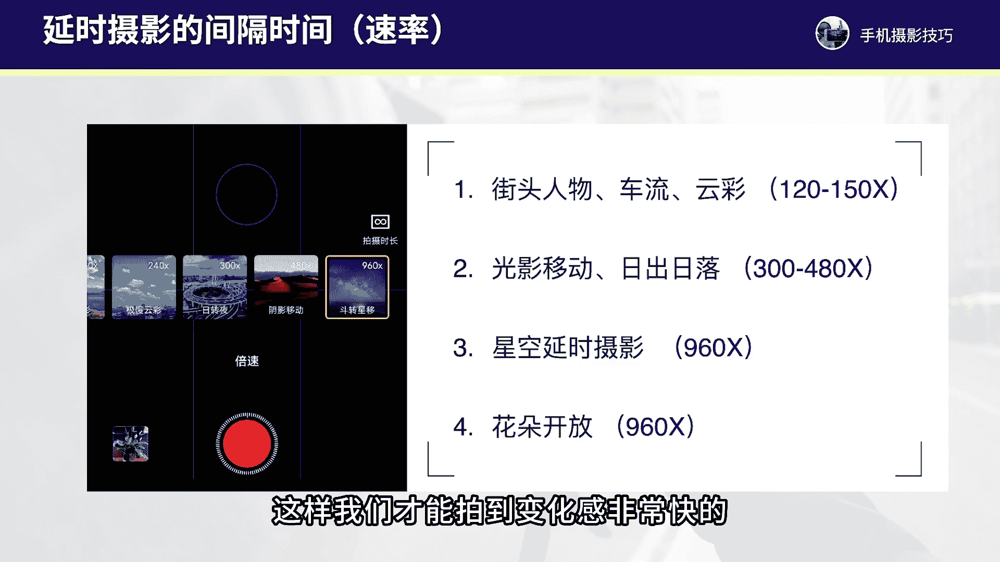
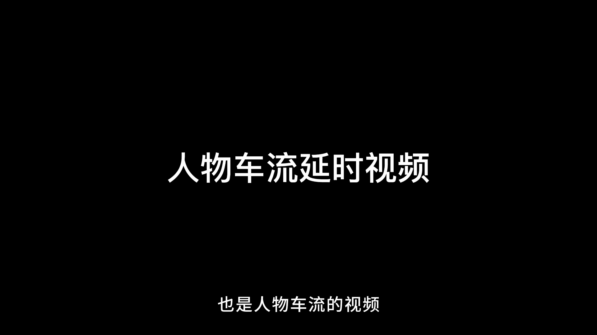
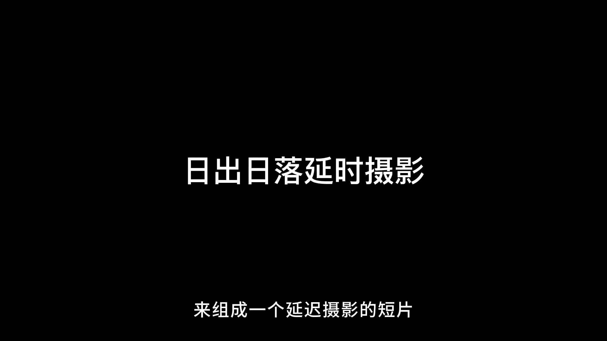
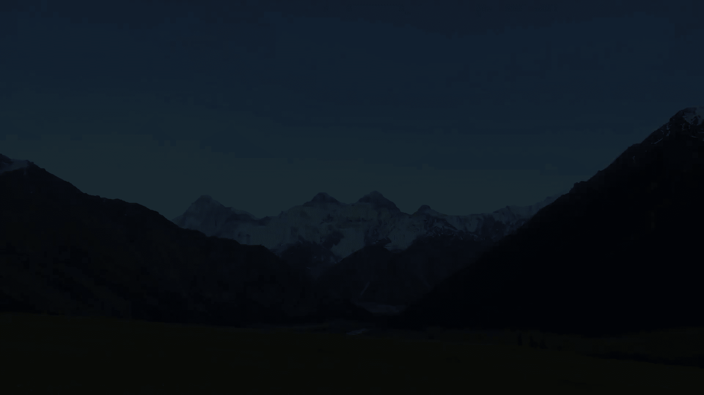
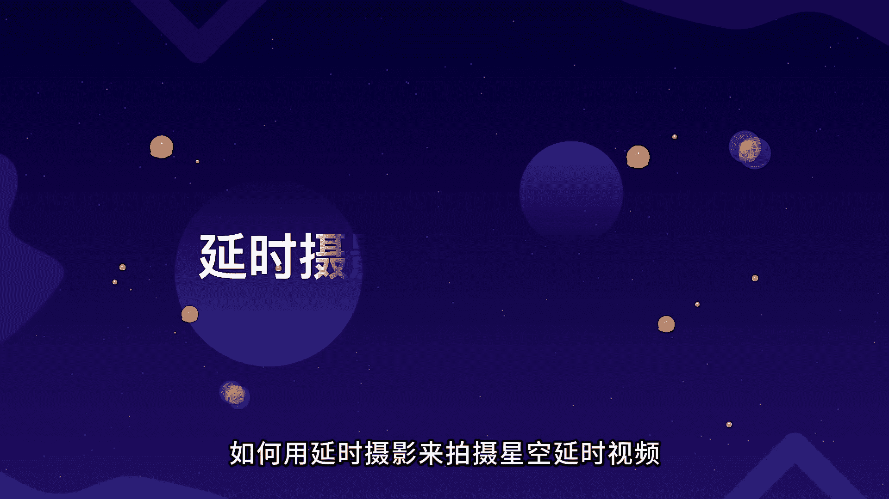
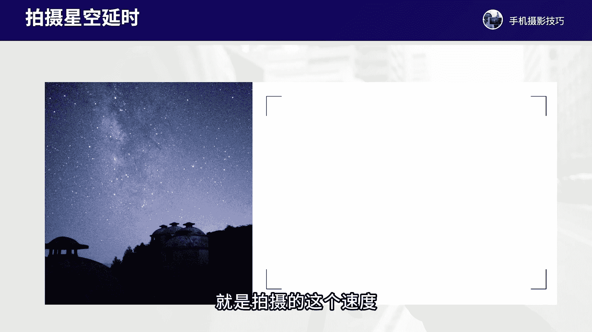
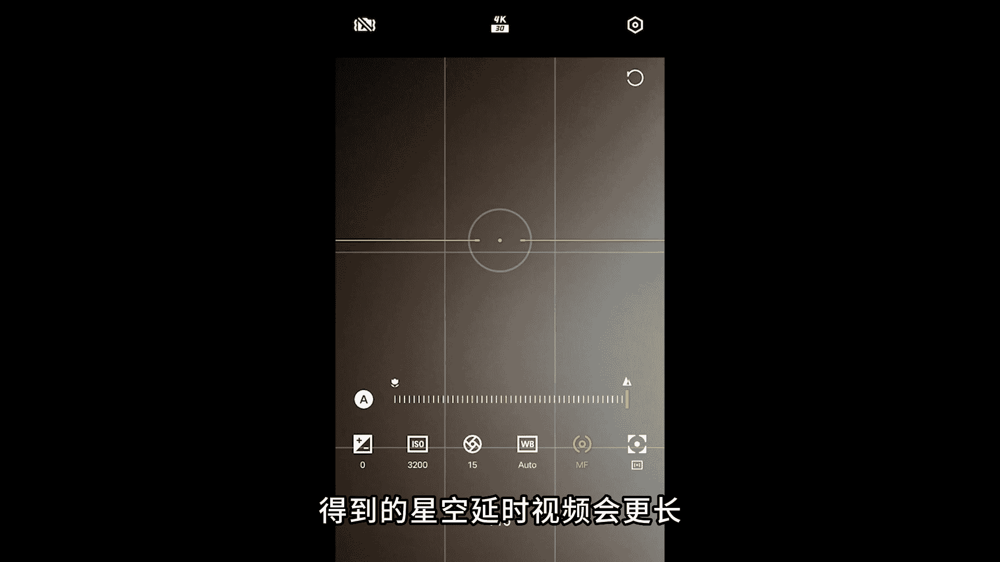

# vivo手机拍照操作课，零基础玩转vivo摄影功能 _ 杨老师讲摄影：9_第9课：玩转延时摄影拍出酷炫视频

各位同学大家好，这节课程我们来学习一下vivo手机的专业延时摄影模式，拍摄的一些参数设置和拍摄的技巧。vivo手机的延时摄影模式呢可以调的参数非常多。我们先来看一下拍摄界面。

到底这些参数都是什么功能和拍摄的调整。我们进入vivo手机当中点击更多进入延时摄影模式。在这个模式下，首先我们点击顶部或者说左侧中间按钮，调整视频的分辨率，分辨率我建议调整到4K的分辨率，帧率。

这里默认的就是30帧，只要调整到4K就可以了。那么左下方呢会有一个按钮叫防抖啊，这个功能我们保持默认就行，一般也可以不用去开启延时摄影，大部分情况，咱们都是固定在支架上拍的，这个可以不用打开。好。

最重要的地方呢是拍摄画面啊，右上方这个地方或者说我们在竖屏拍摄情况下就是。

右下方，那么这里面呢第一个按钮我们是可以调整拍摄的倍速。如果我们不做调整，那么就是默认的自动啊，自动的话拍摄出来画面的变化感太慢了，我们需要自己手动去调整。一般我建议调整到90倍往上啊。

我们不要去看它这里面设定的像日出日落慢速云彩快速云彩，就按照我个人的经验来说，我们设置90倍以上拍摄出来的画面的动感才会更强。比如说150240或者拍日出日落300或者说480。

拍摄出来的速度感才会更快。稍后我会重点来讲解，针对不同的场景如何来设定。还有第二个参数呢是这个三条杠的按钮。这里啊可以调整专业模式的参数。一般其他参数，我们不用做调整。

这里面要调整的参数只有三个感光度快门速度和对焦，针对像拍星空延时，拍摄夜景延时，车过延时，我们才需要做调整，稍后我会重点来讲，拍这些延时摄影的时候，如何去做调整。如果。

就拍日出日落、云彩延时、人物车流这些画面呢，我们就不用调这些专业模式的参数了，只需要调这个倍数就可以了。那还可以调整焦距啊。根据不同的场景，我们调整到不同的延时摄影的焦距来达到不同的这个画面的构图啊。

看我们的延时摄影模式，支持什么样的焦段，然后来调整焦距进行构图就可以了啊，这就是vivo手机延时摄影，我们简单的一个参数和画面操作。好了，通过刚才的讲解。

大家可以看到vivo手机的专业延时摄影模式功能开始非常强的，能调的参数非常多。首先我们要调的就是拍摄的这个速度，也就是拍摄的倍数，可以控制我们最终拍摄到的视频画面，它的速度快慢。第二个。

我们需要调的就是拍摄的参数，我们像在拍摄一些车轨延迟拍摄星空延时夜景延时的时候，就需要调整快门速度和感光度，这两个参数了。还有我们其他参数不用做任何调整，但是一定要用三脚架来。

稳定拍摄一般延时摄影的拍摄时间都比较久，至少要拍摄5分钟以上，所以一定要用三脚架稳定手机拍摄。那么在延时摄影模式当中呢，我们要调的这个速度啊，也就是速率，这个参数啊是最重要的。根据不同的场景。

我们可以设置不同的这个速度。例如如果拍摄的是街头的人物车流云彩，这样的场景我们设置的这个速度啊可以在120150或者说90到150倍之间。如果我们拍的是光影移动，日出日落，这样的场景。

我们可以把这个呃速度设置在300到480倍之间就可以了。如果拍的是星空延时摄影，我们要设置到960倍最大的啊，如果拍的是花朵开放，也要调整到最大的960倍左右。这样我们才能拍到变化感，非常快的视频画面。

例如我们来看一下啊，这些拍摄场景，我们都是如何来进行拍摄的。首先我们来看一下如何。

用延时摄影来拍摄人物车流的视频。例如，在这个路口的地方，我用手机来拍摄人物车流的延时摄影。在延时摄影模式下，我把倍速调整到120倍，比较适合拍人物车流。那我固定好手机之后，在这里就开始拍摄了。

在拍的过程当中要确保手机不要发生太大的抖动，尽可能在风比较小的地方拍摄稳定手机拍摄大概5分钟左右就拍到一段人物车流跑动的这个画面了。还有这段视频，我们也一起来欣赏一下，也是人物车流的视频。

接下来我们再来看一下如何用延时摄影来拍摄云彩走动的视频画面。例如在这个地方，我来拍摄一段云彩走动的延时摄影。进入vivo手机的延时摄影模式，我们把倍速调整到150倍，比较适合用来拍摄云彩移动的延时摄影。

调整好参数之后，点击屏幕当中天空和地面交际的地方对焦，就开始拍摄手机固定好拍摄大概10分钟左右就可以拍到一段云彩走动的延时摄影的画面了。同样的拍摄参数。我们拍摄更多的云彩的场景。

然后组成一段延时摄影的视频。我们来看一下这个作品。接下来我们再来看一下如何用延时摄影来拍日出日落的延时摄影的视频。例如我在这个地方来拍摄一段日出延时摄影，要在日出前10分钟到达拍摄的地方。

我们进入延时摄影模式，把速度调整为300倍。这个速度非常适合拍摄日出日落的延时摄影效果，调整好之后，点击屏幕当中天空和地面建筑地面景物交接的地方对焦之后就按下快门开始拍摄。手机稳定好。

拍摄大概30到40分钟左右，就可以把整个日出的过程给拍摄下来，非常的有画面的动感。同样的参数，我们也可以拍摄更多的日出日落的延时摄影来组成一个延时摄影的短片。

🎼，🎼。

🎼，接下来我们再来了解一下如何用延时顺影来拍摄花朵开放的视频。拍摄花朵开放。首先我们需要把速度这个参数啊调整到最大的960倍。因为花开的时间需要非常非常久，几个小时甚至几十个小时都有。

所以我们需要拍的过程当中呢，把速度调到最大。另外，拍摄环节的光线要非常均匀。我建议最好把房间所有的窗户灯光我们尽量都关起来，不要任何的这个自然光，我们就用台灯来把花朵打亮，近距离的灯光把花朵打亮。

能够让这个花朵的细节打亮的更加的明显。

因为拍的过程当中时间非常久十几个小时，这个过程阳光会变弱，也有黑夜也有白天。那么拍到的光线会不均匀。所以一定要在黑暗的房间用台灯或者小灯来打量花朵，让光线均匀下来。还有我们在拍的过程当中呢。

其他参数就不用调整了，只需要调整这个速率就行。花开多久就拍多久，花开10个小时，拍10个小时，花开这个20个小时就20个小时。所以拍摄花朵开放，需要特别大的耐心，把花整个开放的过程都完全记录下来。

接下来我们再来看一下，如何用延时收影来拍摄夜晚的车流轨迹，拍摄这个视频效果呢，我们需要调整专业的这个参数。首先，速度我们调整到90到150倍就可以了。那么快门速度我们需要调整。

需要把感光度调整到50快门速度调整到2分之1秒或者到2秒钟左右。根据拍。拍摄的这个夜晚场景的灯光光线强度来灵活调整，一般是在一秒钟左右比较合适。另外其他参数就不用做任何调整了。拍的过程当中。

我们尽可能在视野开阔天桥十字路口的地方来进行拍摄，尽可能拍到比较多的一些车流轨迹。那接下来我们通过一个夜晚的拍摄场景，详细的来看一下这个参数是如何来进行调整的。

例如我们在这个十字路口的地方来拍摄车轨延时，进入vivo的延时摄影模式。首先我们把倍速调整到60倍或90倍都可以，然后再把专业模式的参数感光度调整到最低的50，确保拍到的画面，质感更好。

同时再把快门速度这个参数调整到0。5秒左右，调整好这两个参数之后，再点击屏幕当中中间亮部的灯光区域进行对焦，然后就按下快门开始拍摄。固定手机在这里大约拍摄4到5分钟就可以拍到一段。

车轨延迟摄影非常的具有视觉冲击感。我们来看一下效果。接下来我们再来看一下如何用延时摄影来拍摄星空延时视频。星空延时视频，我们首先需要调整的就是拍摄的这个速度要调整到960倍最大的那其次。

感光度调整到3200左右，快门速度调整15到20秒钟左右就可以了。对焦模式啊一定要调整到最右边以及拍的时间拍久一点，至少拍个40分钟以上，就可以把星空移动的视频拍摄出来了。拍的过程当中啊。

跟拍星空的条件是一样的，要在晴朗的天空没有月亮，远离城市灯光，没有云彩的情况下来进行拍摄就可以了。那我们详细来看一下啊这个参数如何调整的拍摄星空延时摄影，我们进入到延时摄影模式当中。

首先我们需要调整的就是拍摄的这个倍数啊，调整到960倍啊，最高的这个倍数，然后进入右下方的按钮。我们点击到专业模式界面。在这里面呢首先感光度这里咱们可以调整到1600或者36200。

根据拍摄的光线，如果光线弱就到36200，光线没那么弱，可以到2000或者1600左右就可以了。那么第二个快门速度，这里我们可以调整到最长的30秒啊，或者说回来一点点到20秒钟左右就可以了。

一般是这个参数范围，15到30秒之间都是拍星空的快门速度的一个范围值。好，另外呢就调下对焦AF这里，我们一定要拉到最右边就可以了。这是拍星空延时摄影的几个参数组合啊，用好这组参数拍摄星空延时。

半个小时以上就能够拍出星空延时摄影，比较不错的效果了。最好拍久一点，拍一个小时得到的星空延时视频会更长视觉冲击啊，会更棒。接下来呢我给大家看一个手机拍摄的延时摄影的视频作品。

大家详细看一下这些画面全部都是我用手机的延时摄影模式拍摄的，可以感受一下延时摄影非常有视觉冲击的一个表现力。

Yeah。🎼，🎼Yeah。好了，那么通过这节课程的讲解，大家对于专业延时摄影模式的参数调整，以及针对不同场景的拍摄，我们都有了大致的掌握。那今后大家就可以把延时摄影这个功能，我们多多的用起来。

用延时摄影来拍摄出非常有视觉冲击的一些视频大片。那这节课程我们就学习到这里。下节课我们再来继续学习。

