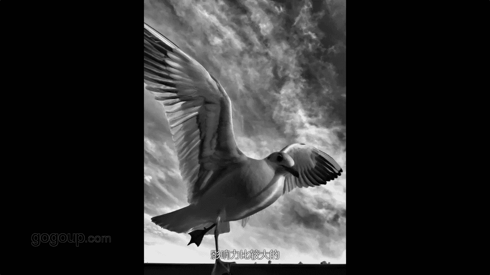
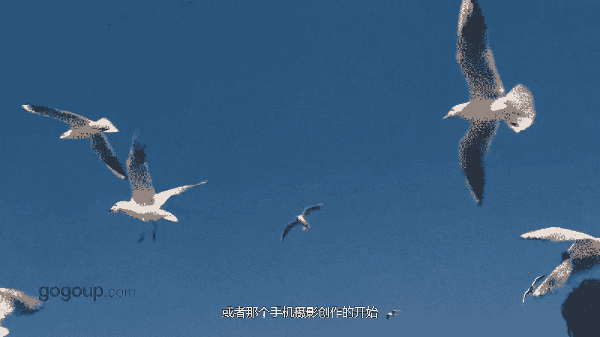
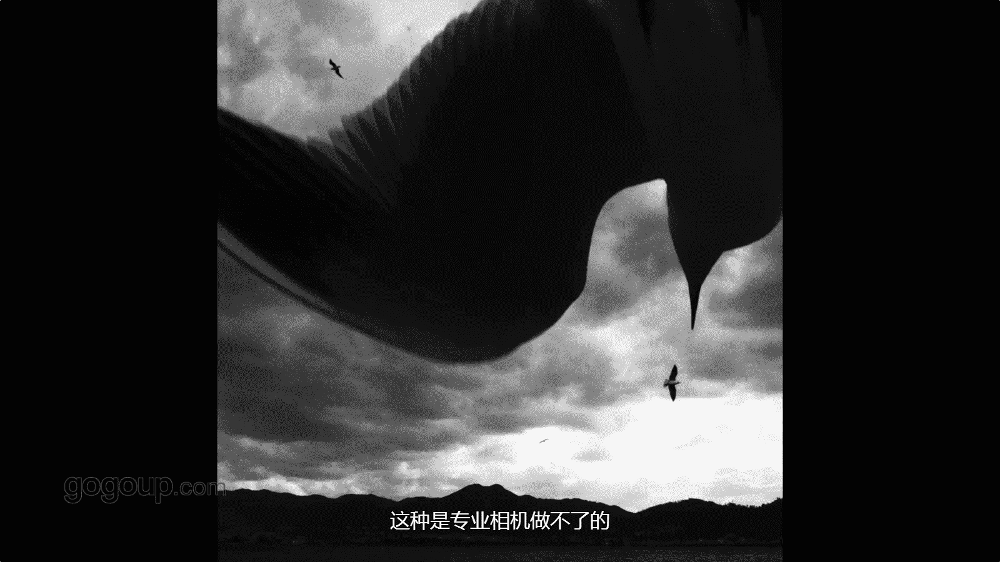

# 何雄-手机摄影教程：第01课·跟着何老师去外拍：课时1 · 昆明红嘴鸥

嗨大家好，我叫何雄，我是一名摄影师。好多朋友都叫我鸟人。我以前一一直以来我都传统的摄影家，近年来我比较热衷于。用手去进行创作。可能很多朋友在网上也看到过我的一些作品。影响力比较大的应该是鸟人。

今天我来的高高手非常的高兴。😊，上周我刚参加了莱卡跟吉普的一个大师赛的颁奖典礼，我拍的一幅首剧作品也。很荣幸。嗯，获得到那个大师赛的那个首机组的金奖。首机摄影现在应该是一个摄影里面就不可回避。

或者说呃你避不开这一个话题。最好的相机应该就是在随身那台相机下，我觉得手机它就是这样的一台相机。在光线比较好的话，场景空气质量好的话，它应该不输于。啊，专业的相机上。

它也很有自己的一种特有别那种手机的那种味道。嗯，我觉得我因为我尝试过很多，在收出上到15寸以内的话，现在苹果四或者或者是呃500万或者800万的话已经足够了。当代手机摄影还有一个很亲民。嗯。

你拍人和事物的时候，他人都给你一个没有抵触的思想，就他很对手机摄影啊，他对那个手手机镜头的时候有一种亲密感自然感。啊，最后手机手机很多修图的APP啊非常强大，更新的非常快，很容易轻松的就。

做到一张自己很喜欢呃的作品和照片的这样的一个一个后期。所以说说到手机够我们用了。啊，现在就跟大家分享一下我手机摄影的开始吧，应该是从10年的一次偶然的机会，我用手机抓拍到了。红嘴鸥的瞬间说到红嘴。

大家应该都知道，或者都听说过啊，昆明的红嘴楼。大说的红嘴油，它是以1985年的一个冬天一次寒流。一个寒流把西伯利亚。这红嘴鸥带到了昆明或者是别的昆明这，站样在一一个高原城市上。

也就是我的城市着85年至现在已已经30多年了下，我拍它的时候是10年的一个冬天是，偶然的机会刚刚说着，偶然了一个机会拍到他这。呃，所以说我进行跟他们的一个一个。亲密接触或者创作的那个手机摄影的开始。

就是从红嘴右开始的。

昆明红左右跟人的那种关系的话，我觉得是非常准确的一个词啊，鸟和人人和鸟的一种。啊。亲密或者自然的一种关系着，这秒跟人的那种关系，就像人与人的关系非常亲密，或者跟亲人一样的关系着。

当然现现场中你能看到一些照片，或者说你能体会到现场的话那种。感觉是。不用我多说的特好。他会让你。想飞那种那种心态好者狂放自我，把自己。推向跟鸟在一起，或者我或者或者或或或许好多时候。

你看到它你就想成为鸟或者就是鸟。那的一种状态。鸟跟人人跟自然的这种关系在这里体现的。非常完美。所以说在这点这我的鸟人现鸟，咱们拍鸟的时候就啊这种状态是非常重要的。我也希望就是当大家创作的过程中的。

能融入自己的很多的情感和状态。去创造一张或者去表达一幅，有是有有人味，或者是有。有自我情感是吧。😡，的作品他应该就是有生命力的人，或许说有自我风格的人。哎，你那边有人在为红酒哦。我们过去看看能拍到什么。

嗯，大家可能都知道，看到我照片里面，或者看到我视频里面好多红嘴物。特多，我就不怕人这。我们就这经演期拍他们吧。啊，他广角哦体形很大。嗯，可以贴的很近去拍它郊外的那个场景也交代的非常清晰，或者是。啊。

那种料。亲。然后没有没有把把静音关到静音下拍的时候，它会没有任何的那种一种干扰性。他们竞争力非常强，嗯非竞争那种状态跟人我认为特效或者是一样的是吧。当然在拍的过程中。

咱们手机嗯我拍的时候就会注重一些构图。这种场景的话，我可能会来一个大场景下，就演演一下，把它那个环境跟人物交代的那个啊清楚点。然后我可能手机的特性。要画质更好的话，我会贴上这一排，对吧？攻击性很强。

贴的很近的些牌的话。啊，他会有一种。手机本来就是一个应该我手机的那广屌，他在应该是在28跟35之间。可能他太强的光的话，现在在手机上可以个点测光去进行一些。

剪一些那个曝光补偿来把它红嘴哦白色的羽毛更有细节，不至于说过曝，这是为咱们以后后期或者咱们要的效果进行的一个就前期。技术性的完美的一个叫或者是呃一个一个一个一个掌控。

这是手机摄影里面的呃认可摄影吧这个一个不可缺少的一个一个技巧。可能很多说现在手机很牛，或者说对啊它像苹果它可以。连拍其实我不建议这样子啊，好多时候在不建议说你去按住一个键，它一秒钟哗哗哗的连拍。

那样的话不如拍视频。其实我还是有选择性的。拍摄我应该是我们内心都有一个意记。或者是想要的一个画面。去进行释放快门是吧？去捕捉我要的那个那个瞬间是吧？在拍摄的时候。

你可能也我就认为摄影尤其手摄影下拍的时候不要去考虑太多，尤其抓拍。可能很多时候手机它好一点就它不会让你有太大的压力。像相机拿起相机来的时候，你就会。去想谁大是怎么拍的？😡，什么点线面购价端。

其实很多时我觉得应该我们不要被这些。呃，很多框框框自己一下，尤其手机线一下。更轻松的是吧。或者不经意的这段本能的反应去捕捉一些。特有的那个那种瞬间啊，这种瞬间是。是你不可那种。复制的他也会给你很多惊喜。

我觉得这个就属于性咱们应该就非常有乐气，就呃有艺术感或者很有自我。那种一种风格的一个一一个特点。但可能拍的时候拍红轴的时候，会选择很很特别的角度，趴着或者低着着，或者叫手机它比不像相机啊。

叫笨重或者是角度那种不好控制。你可以说看都不看。啊，把手机贴在地面上啊，或者他的一些脚啊，一些就瞬间，一个眼神，一个瞬间羽毛啊啊这样的一个真实命时间那种瞬间的一种状态啊啊都可以去捕捉。

因为每张照片那种拍出来的东西，他都会给你一种很特别的视角，但你也可以引导他们反正他喜欢吃但我拍的时候我就不会那么直白就拍跟我的像大家知道很多在拍手里面来吃啊怎么样者都有这样我不会让去拍可能我会尽量去在拍他吃与不吃之间的就跟着那种关系是不是在我的引导他来为表达方式。

但精彩往往尽量瞬间就是一晃而过的他的对焦速度我觉得在目前时候真的比单反啊。嗯，还顺手，可能大家也没试过，他几乎没有任何的实质上。尤其好的点你对焦在海鸥头样的话，它郊外同样的郊外还有很清晰，或者说很。

啊很交对的很一个面感。这也应该就我觉得手机上的个特户性，这种是是专业项的做不了的一些。

嗯一个特点。好，可能说在构图上，我们会段呃去找一些特别角度。比如说有些人他都有海鸥。啊，它那个味道就是它自然就我提上去啊，就会自我的想象它的一个瞬间。你看刚刚下面这张图可能会会一个你的在那有味。

他头发被风出的那种特有特有感觉这样，可能我就听上去，可能大家知道在拍啥呢干嘛呢？其实我就在等一个他头发跟海鸥。还鸥在飞科发斯飞起那种瞬间的这一种一种一种感觉下，就有一种比较狂泛那种自由的一种一种瞬间。

比如在拍红左右的时候，我在阳太阳光强的地下面是中午啊一般。我中午早上都拍的话，当每个时段早中我都会拍，或者在阳光强的情况下，在顺光或者侧顺光或者逆光各种角度去表现的话。他有不同的效果。尤其是对。

像你说你在顺光的拍的话啊，一般同我顺着太阳的光的拍的话那个。光影对比，他会有一种特通透的感觉是吧？在逆光拍的话啊，应该也看到过可能网啊网上也看到过我一些作品，或者在在下面咱们也会放一些作品进去。

那逆光拍的话，它有一种让你会惊喜的那种特别的。感觉着那种光斑或的那种那种通透感，它不像专业相机那样，它会死黑，或者是光纤会会拍成剪影一下手机手机不手机它可以做到，不是剪影下。出来拍手机拍的话，呃。

还有个重要的问题，大家可能不要忘记。一定要带个充电宝，很大很大充电宝，保证你的那个手机，它有足够的电。但我像我用的话，我就最大的容量的手机。或许时候我会带最开始的候16G的时候，我会带电脑。

立马拍完拍满16G或1G的话，我就给他存电脑删除，然后继续再拍。因为这个是我以前肯经说过，或者自己最爱乎的一些话，很多时候对于抓要拍拍红嘴或者拍一些咱们喜欢题材都是制造影像垃圾开始，咱们不要去否定。

不要去缩短拍鸟或者拍一些东西的时候，可能我们嗯也会有存在一个很。专业的词汇那些说法吧，就吧啊可能大家会知道这个陷阱对焦就等一个。你希望或期盼的那个画面出现在你的镜头里的时候，你的释放快。你看啊。

可能下面这作品你看得下，我就拍了好几个早上，应该三天的早上的就会抓一个逆光的逆光的那个飞翔的红嘴哦，可能就不下2000张。最后面我。只选中一张。或者3张价。但这种也很有戏剧性。

也很多时候我就是说我还说过一句话，采访，他们采访我说过一句话，我说好多时候画面不是我找到的，是好像好像是画面有些瞬间是。1到我或者给我这样的一个瞬间。😡，好吧，我们说说逆光拍摄也特有意思的。

手机逆光的话，像我早期的我用的应该大家看到啊。苹果4。它会出现一个特有的光纤，但光光斑那光斑像莲花一样特特有意思着。嗯，就可能对于说相机来说，它是一个叫线光。这种线光的话是个很失败，很讨厌的东西的。

我们用很多遮光照啊，去把它那个去去屏蔽了，不要。但在手机里面，我觉得这个东西是然后这个。对于象机说的缺点，我觉得它是一个优点，特牛。😡，这优点让你的画面增添了非常的有意思一个戏剧性。

说到或者是一些创意性或者视角感的话啊，应该这就是来生活，或者说我们一些多观察吸东西的。比如说海鸥这个影子，它从强光中午的时候，它太阳正直去，海鸥从空中飞过，它的影子就会。呃，引到地面或者水面。

然后这样就拍的话，其实也就是一种。啊。很随心吧，就触动到你眼睛的东西一种拍的话，你看比如影子对吧，影子，我拍拍的海鸥六的影子地面的影子是，我也跟他合过影子，我的影子跟海鸥的影子在一起的也有的。

或者是现实中的啊真的或者的真实的海鸥跟它的影子或者的场景都吻合在一起都有的，这是一个细心，这就是光跟影的一个。一个完美组合段。

其实拍了这么多的那个海鸥，其最重要的一点。你要去爱他们。打心里喜欢他们是吧。觉得他们很可爱对，借就理你拍他们。不演了。嗯，他们有联系。嗯，也不觉得会害怕害怕你害怕。开发人渣。

但企间于这种相互的一种一种默契或者一种信赖。就他愿愿意待在我我身上或头上来进行段呃觅食着这对于。我们来说。应该就是一个很特别的一个相互信任。或者人与鸟或者一个自然关系的一种融洽。

