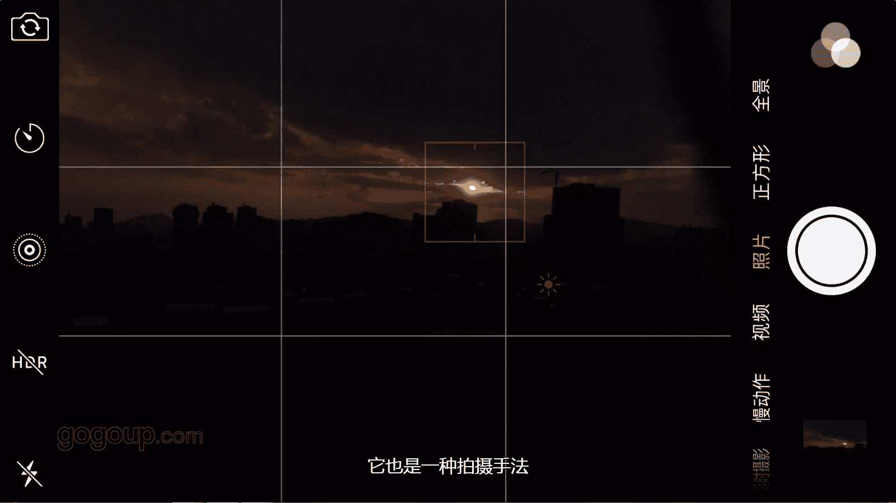

# 何雄-手机摄影教程：第02课·用手机进行创作：课时1 · 手机拍摄的技巧

哎，好吧，现在来到窗外跟大家。啊。分享一下这个对焦的拍这个夕阳的一个一个测光的一个一个技巧的。你看我们进行。某个漆的测某个漆的测光的时候，它会有一些不同的变化。在加减曝光的话，它会出现一些。

这样的明暗对比较，我会这样情况下，我会拍几张呢，一般对不同的地方，不同的地方我去拍拍。呃，测广去尝试看我的效果是吧，你熟悉的以后肯定我就测出这的地方。大家看到我车最亮的地方的话，我剪曝光。

然后他暗部的那个暗亮很亮的夕阳下亮的地方，它的光线就会层次就会感会很强。你可以其他的地方去转动一下去来。现这样看可能就是。🎼大家可能喜喜欢这样的作品。这样的视角上我觉得他这样的话，他的呃。

你看咱们在剪曝光的时候看得到它那个测光虽然没问题啊。但们他剪曝光的时候还看得到。他那个亮处的地方的细节还不够那么巧，我会剪。你看简他演演出那个亮的地方，层你的层次就会非常清晰。嗯，但暗部好像细节差。

这个不怕啊，这个不是重要的事情，我再把。HDI打开以及简历一下HDR拍的。SDI同样也可以让的，咱们锁定曝光的同样同样的可以去呃减曝光。然后。再拍。他是两张的。啊，这样这样的一个一个方法去排断。嗯。

也可以说咱们蹲下来，慢慢蹲下来点去呃，来拍一些。啊，或者是静好，把它关了。一些特写或者从一些男人的一一些呃这样特写的一些创作，或不对？呃，让去拍一些。东西咱们可以就这样你可以看到这。好。

的低一点我的低一点没事。啊，我从从从这个大家看到没有？这？这个我从这个做前景的话，我用它这个清晰的话，演出就很显，我也可以对焦对对演处的夕阳西下，然后。嗯，把这个。呃，这个铁丝网。做一个前景的作为。

构架框架也好，让去构架的啊，一个前景的构架。降面排摄队。看这样的牌子这样他较对，现在浇对的这个铁丝网的话，他眼头就稀了，我还是对待他在夕阳西下的地方。啊，演出的这个房子啊。我捡曝光的。啊。

这角度好像可能不太不太对。我们在在变换，现在太阳上露出来了。太阳已经落落出过了，我会将来时长时短。像咱们的胶是对在铁丝网上，这种常见可能拍的完呢可以慢的侧动或对这个地方的话。

你看他演出那个西西郊就很有意思。这样清晰的，我对着这个地方。大家可以看到我左手边。对，一。右手大拇指这边的塌的，我进行加减曝光。看他知道吧那个西西郊的那个。那那个那个感觉这后在慢慢的偏动。

他会很很有一种梦幻的感觉，是吧？对我对着演珠。对他有些很清晰的。现在我对太阳的话。近景窗太阳镜白，现在他对不上。你可以说咱们就踢上去，不要这个网子。现在太阳出来的，咱们直接去拍太阳。嗯。

🎼这种你看太阳就那个光很强。如果太阳让的很严的话，我就不只有解曝光够差。这种可能就是另外你看剪到最底，它也是一种嗯一种拍摄手法，呃，看你的需求来说的你要的手段，可能有些人不喜欢这样低调的这样一些创作。

但这个是告诉他告诉告诉大家，这是一个一个技巧。

哎，刚跟大家分享的是手机摄影的呃一些曝光。呃，锁定对焦和对焦的一些简单的技巧，希望大家。诶。在生活中多去尝试实践下。

🎼Yeah。