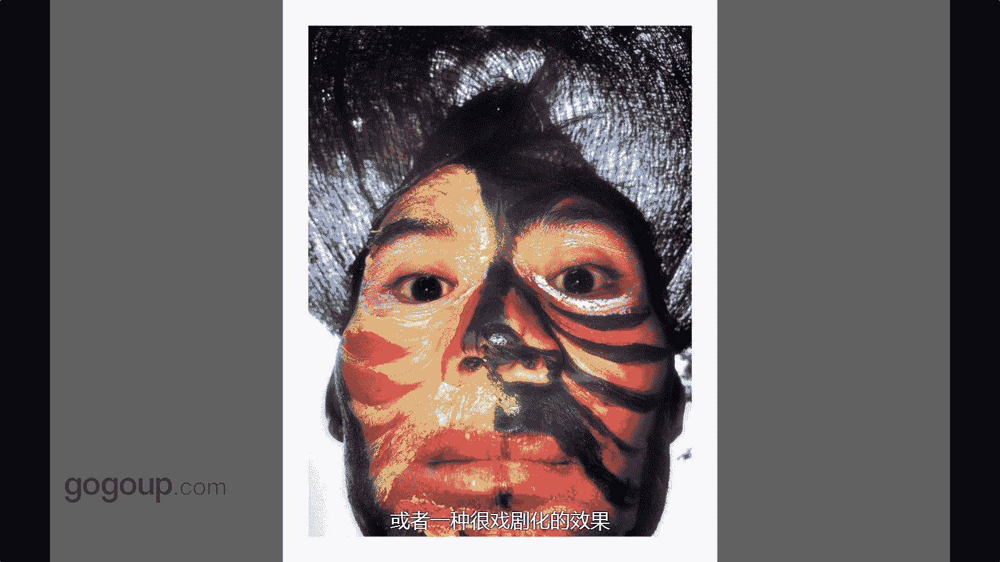

# 何雄-手机摄影教程：第03课·手机拍摄的技巧（作品实例讲解）：课时1 · 控制曝光  

首先我们跟大家分享一下。对手机摄影的一些技巧。啊，我们看到这张照片是一个逆光拍摄的手法啊，可能大家。啊，也知道啊，逆光的话，如果测光在最亮的部位，我们就会显得暗部或者下方的时候会很黑或者看不到。啊。

我测光的情况，我这种情况我就测到啊。海鸥的部位或者水面的部位的话，让天空过曝，这就是一个也是一个测光或者加曝的一个手法。这样就让暗部的海鸥跟湖面，它有一个很清晰的那展示它的细节在。但天空我们不要它的影。

当天当时的云没有那么好。所以说我就呃这样的是个就加曝光补偿来控制了这个画面暗部的细节。哎，第二张这张照片应该都知道，上张是剪家暴的这张是一种这张简报的拍摄手法。当跟上张一张相比的时候。

就是他在当时的光线很强。然后呃天空的影层的细节呃细节那个它有很丰富，然后我就进行了一个段呃剪爆把天空的那个细影成的细节压的那种。很有质感。啊，因为海鸥的白的那光线很强的时候。

他那翅呃翅膀都看到啊有一个很透的一个质感，这是一个简暴的一个一个拍摄手法。哎，这张是一个对下午的一个一个顺光拍摄，顺光就是光影的一个呃一个控制。这是一个正常跟应该是简报，我简报和者。

和家暴之间的一个正常的一个一个拍摄手法的。我们测光是测在那个远处房子上的一个夕阳那种光影上的进行的一个拍摄手法。哎，这张是看到过，这张是一张后巧的作品。这张作品。是一张开闪光进行拍摄的作品。

我们别小看一些，如果近拍的话，或者是呃。阴影有阴影，因为它带着一个头饰，阴影拦住面部表情的话或者面部又产生阴影的话，我们这个情况的话，我们就开闪光贴上去拍的话。

它会让你有一种啊很好的质感或者一种很很细剧化的效果。

Yeah。

🎼あ。

