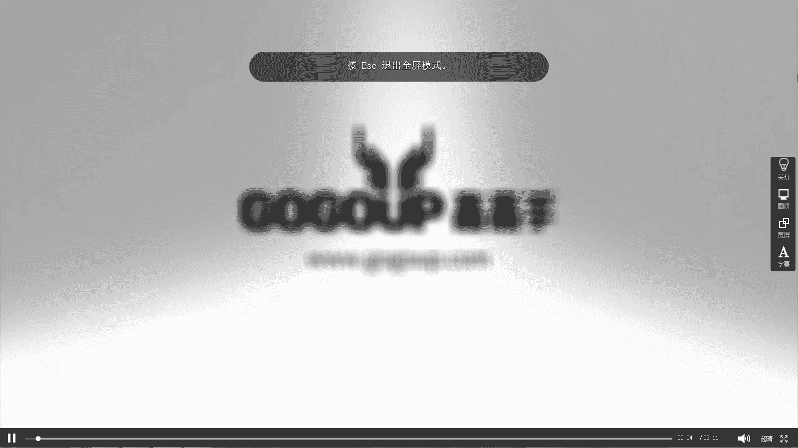
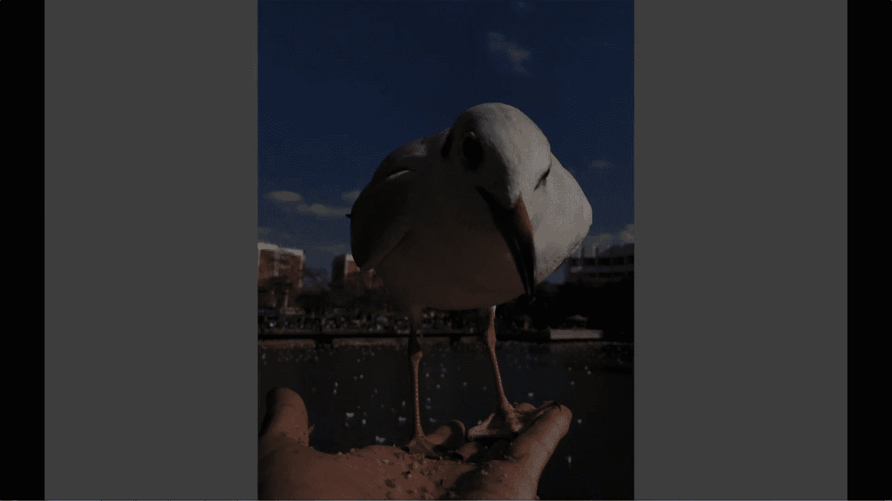

# 何雄-手机摄影教程：第03课·手机拍摄的技巧（作品实例讲解）：课时3 · 抓拍

下面这个就说一下这个就连拍或者抓拍的一些呃。一些那个。技巧或者是或者手法。你看这是这种手机的强大，我们就不要说啊，这个是我自己在喂。在喂洪泽欧的时候。

在我站在我手心里问洪泽欧的时候的一个左手在为右手在拍的一个这样的一个大人看到一个呃很贴近的一个1111个抓拍。这种抓拍的话，可能就大家知道。

可能说现在手机苹果它我很多西它就可以连拍一秒钟10张或者十几张那样子的。按住快门键，它就不断的去拍。我个人认为我不太建议那样去拍的话，那样制造了很多很多的影像垃圾可能也抓不到你最想要的个瞬间也能抓到。

而我这样拍的话是我。最好交。等着他那个一个那个它瞬间的时候，我进行释放的快门，再按快门的这样这样去一个捕捉它的一个瞬间。这瞬间是可可预见的，而不是连喷的东西。

我都不知道它会什么样的效果那样的做的盲目的进去拍展。所以说这个大家就心想看看这几张这这，我就同时就在几秒钟的的一个。抓拍的一个。呃，红嘴油在我手里面密失着一个那样的一个瞬间。看第二张者。

他是一个一个很呆弱很淡定一个状态。这张的示两张的区别咱没说到，又又重复了一个老话小话题吧，就之前像那个加减曝光，这张是减曝光的。这张加曝光的下，就正常拍摄，这张是正常曝光的下，当它状态的不一样。

可能表达的一些东西也是效果也不一样。这种也是一种拍摄手法，就说在相机里面一个可能有存在一个呃曝光补偿下，或者曝围曝光的下，可能得到几张照片，这样的一个一个手法去去控制曝光的东西。

可能达到我们需要的那种或者后期有效的效果。看这张他的个呃一个一个状态表情这样，拍有这张，你看他密的第一张可能看到的它是一个展次低头下来幂的东西的。

这张是在他低头的一个很可爱很啊那种很萌的一个状态的那那那那姿态的，这可能是就在我拍的时候已经就连拍快拍抓拍的时候，他呢控制到画面的感觉。我要东西才释放快门的而不是说。

按着快本不动的去强行的去拍了很多很多那样子去来写的。这是后期的一个后期饮调接来啊，就后面会说到一个一个效果。这样跟大家的分享就是它的一个。一个一个所拍到的一个一个状态。快拍抓拍连拍的一个的一个效果。哎。

好，这节我们就先讲这么多。

🎼The。

