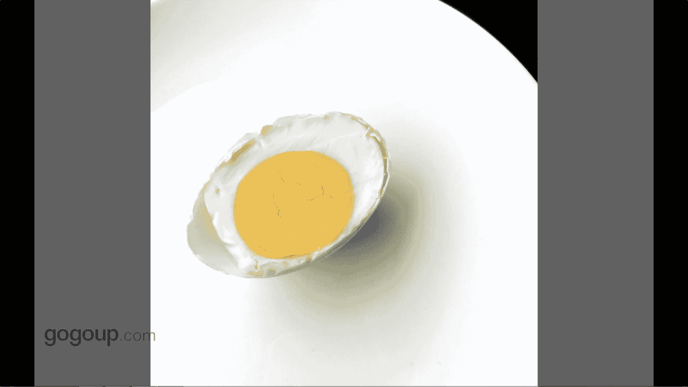

# 何雄-手机摄影教程：第04课·视觉训练（作品实例讲解）：课时1 · 题材-食物

哎，这张节跟大家分享的是一个视角训练，可能视角训练的话就来呃我个人就是所。分享的就来自于生活中我们非常跟咱们非常非常密切的这呃很多一些相关的东西，比如食物啊啊反正很多。

下面我们去看一个题材的那个题材的一个一个对一个拍摄的对。比如说你看一个早餐，一个面包跟单面煎蛋，这可能每天早上我们都会旅行啊干嘛的。

都会面对着一些叫非常细无常的一个很很必须的一个一个一个一个一个生活状态中的一个需要的一个一个东西的个早餐。可能我看到有意示着。它的对比或者质感下，我就会。啊，拍一张啊纪念一下。

因为我我拍张我喜我喜欢啊煎蛋跟跟面包，我就把它记录下来了。对，这个是一个一个自助餐的一个。一个对白吉贝跟一些这些都知道看到应该对我为什么拍单呢？它是一个当时拍它的就是一种一个色彩的一个搭配。你看。

绿色的植物红的的，反正的它有很很丰富的一个元素。吸引我这，我去给他呃。拍下来。你看一个很很极简的构图是吧，可能看这片子，可能大家也会想到，当时我创意灵感也来自于一个团队轮子的一一个西瓜。

它一个西瓜皮摆在一个盘子里面，有个有个西瓜子在这样子去拍的，我可以拍一个这种题材，可以拍个咸蛋，咸鸭蛋在这排盘盘盘子里摆盘子里面是吧，它一个也是一个很极简很。😊，呃。

很很明显对比这一个红黄过度的一这样的一个画面。但是我控制的很干净，把右上角留了一个一个切的一个黑的那个布分，它是有一个一个对比或者一个没那么满的一个一个空间感。

这是我的对吧视角训练的一个对就很多时候是感感应我们感知到的去拍一些东西的一些一些灵感或的一个想法。

哎，这个就这看的很简单，的很这眼片，就就不说演不掩片了，就很简单的一个东西，就是吃这一个火腿。这是我老家的一个咸鱼火腿，特有名特好的东西的。你看到应该也有实力着就是妈妈做在这，所以我给他拍了一张。

🎼。