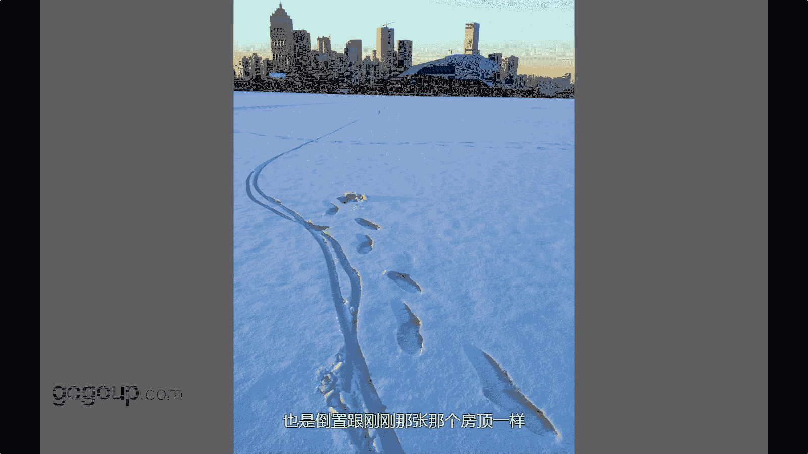

# 何雄-手机摄影教程：第04课·视觉训练（作品实例讲解）：课时11 · 创意-低角度 

哎，这个是张原片，但不是说原片，你说没有后期，就没有说后期的就拿出来的。这个是是跟大家说一个就叫这一个创意的一个视角的。手机做的很牛的，就把像手机倒过来的时候，把它贴近这是一个塑胶跑道。

但很像塑胶跑塑胶跑道。它不是它是在我朋友的他家我们家的房顶上。😊，方向他那个是防水的那个一个涂料，早上很早那个太阳升起的时候，我看到就就喜欢那样子就泡着很温暖的感觉，把手机倒着下来的时候。

手机倒手机倒置的时候，摄像头很跌天地面进行一个触摸对焦。你看那个地方焦点就是沿片焦点触就这个很清晰的地方进行一个一个拍摄。所以它上下一个吸东西，就像一种很很专业的那种相机很棒的头。

它的一个很大的光圈进行一个呃空气的切割那种感觉那样的。这这就是一个就。就是一个视角。就可以说这个这个创意的话就是一个你啊很特殊的一种方法去捕捉一个很微妙很微小的视角的一个1一个一个一个展示。好。

这个是这样鸟的。你看我又在说一句老话，重复离不开鸟，我的片子里面每个题材都会有有鸟出现。然后这个鸟也是有个小故事，就拍的时候就其实没什么资很多呃多闲。

就是看到一个女孩子在那个大呃专门滇池那个大坝上看海鸥为海鸥，他是一个霸馆上面可能有50公分那么高。因为他当时穿那个一张很记记忆很很清晰，是际上一双红色的匡威的板鞋上啊牛仔裤那样子就就我就嗯贴上去。

我说你别动你拍问你的海鸥，我来给你我来拍拍一个这个这个你的鞋子的视角很好看。😊，但拍了不是一张，这个拍了可能至少有八九张10张，还还能记住这个这个东西。就等一个对这个鸟这个这种低角度贴上去拍的话啊。

把鸟跟这个人这个角的一个对吧？一个呼应，不要去想太多的贴上去不同的看着这是很很傻的一种一种一种训练好的一种就手机它有个屏，它不像想像这种，你要都要看手机有个屏这看到屏。😡，去去怎么样好看，怎么样舒服。

怎么样很特别，我就给他拍来。😡，这就是一个叫有是其是一个创意性的东西的，就非常人的方法去看待这个这个物体。对，这个是可能北方人知道，这应该是沈阳的那个横河展。这个冬天。

我南方人的冬天对冬天的蒙蒙大雪特喜欢是，虽然寒冷的一下石度山乎，我也跑的那个冰面上河面上去对。当时运气特好，那个北方的天气那时候夕阳西下，天空放着泛着很很这是阳眼片角。

泛着很那种有点那种泛黄跟蓝的那种那种天空的，很暖的感觉。当时天气特好，然后湖面你看这个他这个呃也是倒竹跟那个刚刚那张那个房顶上拍那个夕阳是一个手法。

