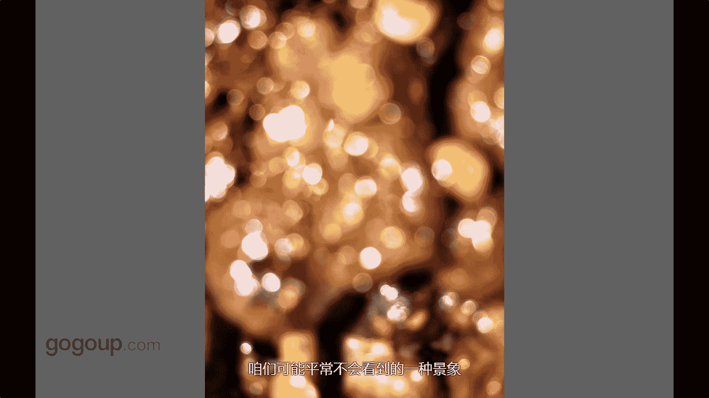

# 何雄-手机摄影教程：第04课·视觉训练（作品实例讲解）：课时12 · 创意-刻意虚焦

哎，这个一说到话现在叫高高手站，这个说吧这个是北京的后海，那天是应该我我最不喜欢的，我来的时候都是好的天气，那天的时候非常的雾霾，这个应该是3点半4点钟左右时，我自己很忧心。然后我就在后海转。

就这样拍来讲着。这个当时这个手机很特别，就就是这种天气操作的这种拍摄手法，我对焦对太阳上面太阳清晰的，它下面就就就就就糊了。😊，然后水面上跟那个。呃。

对面的摄影倒影的就一一个一个西的一个一个一个倒影对应这叫好像。很有意思，讲觉某种立景下，这个是一种一个很惊雅的一种一种。内心的表现手法。可能大家很很吃惊，这怎么拍的这是羊肉串。😊，然后串我们可以怎么拍。

你们咱们可以尝试着下把手机开到闪光强闪，然后贴上去拍的时候，你看到它有很多小光斑，因为太近了那个焦短，一闪光，它就出来一种非常梦幻，像专那种很很很大光纤很棒的那种郊外的一种效果的。这个也是一种小型机。

这种你说创业创业这种可以呃说是一种很抽象的一种。咱们可能平常不会看到的一种一种景象。

