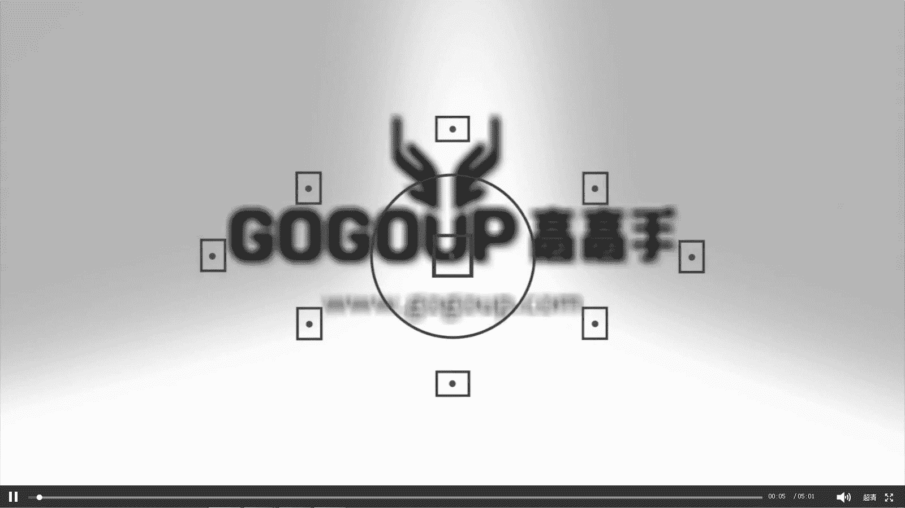
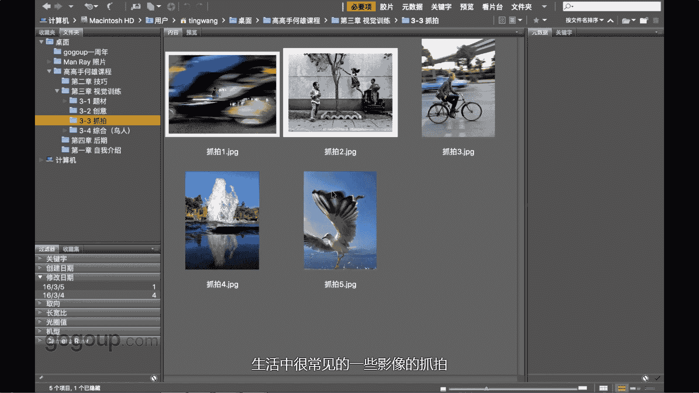
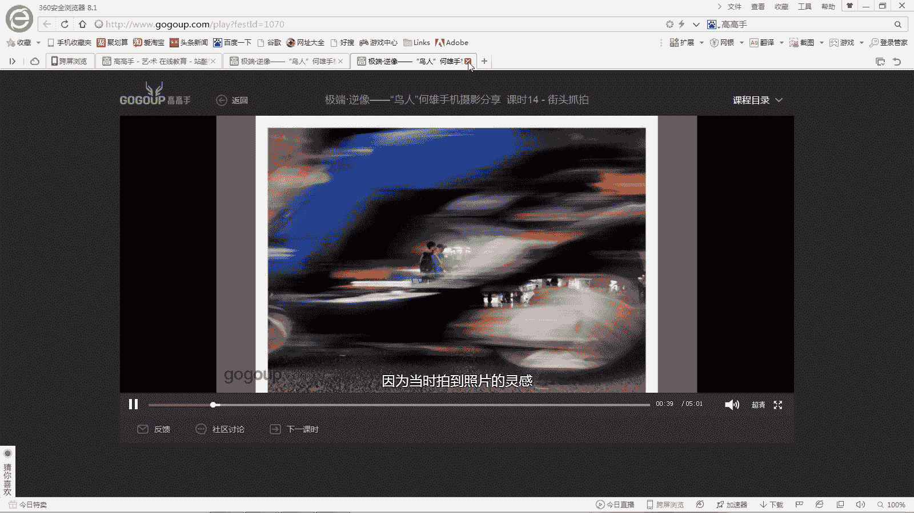
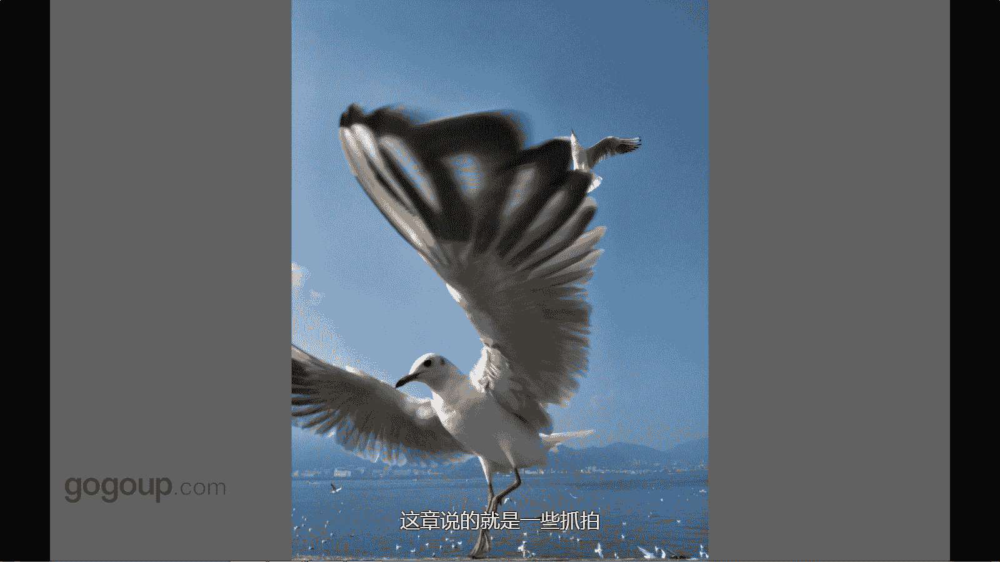

# 何雄-手机摄影教程：第04课·视觉训练（作品实例讲解）：课时14 · 街头抓拍

好，这章节我们就说一说抓拍的一些抓拍的。作品的分享或者技巧或者一些。啊。生活中很常见的一些一些影像的抓拍。

这张照片大家应该看到的，这个是一个很很我很喜欢，也是一种生来之彼，不可复制的一个瞬间。怎么这样说呢？因为当时拍到这拍照照片的。

好，这章节我们就说一说抓拍的一些抓拍的。作品的分享或者技巧或者一些。呃，生活中很常见的一些一些影像的抓拍。这张照片大家应该看到的，这个是一个很很我很喜欢，也是一样么生来之彼，不可复制的一个瞬间。

怎么这样说呢？因为当时拍到这拍照照片的灵感是纯属一个偶然中的偶必然中的偶然吧。怎么说必然。因为我看一对情侣。好像是应该是学生展，他们一边走一边在吵，还怎么干嘛的，在说话。

我在后面在昆明的一个龟背立交桥下面，我就。在后面走。看他们。几次想想亲吻吧，那样的东西在，我觉得这个是很有意思的一个瞬间是。啊，然后我蹲下去，正好那个准备拍的时候。

这就是就很很细计化的一个11个一个场景出现了。正正当我最好交释放快门的瞬间，一张电动车从我的镜头前面。一下过去下，当时哎呀我说我当时还有些想哎呀，这张照片可定废了，很挡住了。当时可是回放的时候。惊喜就。

就给我给我很多惊喜，就降临在我身上了，给我被我捕捉到少是吧，就从那个脚跟那个电车的座位下面的一个空隙之间，正好那个时候。A。透过这个位置这，看到他两个人在。嗯，亲吻的一个瞬间是吧。

我想应该这个不管扫街或者抓拍的话啊，这也是大家应该必须的。知道的一个要素的你有一见性或者是一些。呃，东西的话也会出现一些不可意见的东西，特效给你这样。但这个就是可能就抓拍里面。最牛逼最好的一个乐气战。

好，所以说他一个你看下动态东抓拍的话，这种就有很多意外是吧啊，我拍的好像应该是四五张吧，但有一张那么这么很棒的是吧，他一个都对一个跳他一个在起跳的瞬间跳起的瞬间，或者跳下来一个回头走过的瞬间对。

这样都是一个非常自然的一个东西。一个东西。所以说这种抓拍。呃，就是也是咱们说到上级那个训练的一个段教训的个东西断叫。我们生活中可以发现很多东西啊。嗯，你说这个吸引我的眼睛。

也就专么就回顾一下上上一节的视者视角经验里面的说吧的一个老外，你说穿出791台应该是凤凰吧，我能看着还是永久这样这样的1个1个38的28的大大大大在众，应该可能。嗯。

80或者70的应该对这个很很有有有印响。这个在种他他在种啥这样的一个自行车站，然后他那个就。吸引为他是他是一个老外是的中国产的的一个一个自行车。然后呃他的姿态很优美。

这是一个我我还当时给他起个名字叫风凉的男子呢，这样说的，他一单只是扶罗那样的这个叉包的那个那个很生活叉包的小手指冒出来，背个鞋单肩包的。😊，那样那样的一个状态下，你看他棱角就侧面的话，鼻子特高是吧？

头发金黄色的这这样子一个在在中国或在我的城市出现这样场景的话，也就特对我有个吸引的东西。对吧？苹果的那一个老外拍的一个对一个好像六出来的时候，的很多我们城市都看到那大型的广告。有这样的一张鸟。

你们去去找周去看一下它那鸟是在一个栏杆上横拍的，也是这样起飞的起飞的一个状态的。嗯，这这张。这张那个一个一个呃一个瞬间的画就贴的很近，手机的广角贴的很紧展，然后也是拍了很多张，他这个姿态给他补出来的。

早上的时候呢光线的时候，他那个翅膀张立着。就是这种招拍的话，就感就就是有些时候是是神来之笔，就你做好一些准备。系啊。或者期盼要些东西他给你一个一个瞬间那样子。他这个姿态大家去看着非常非常优美是吧。

也非常有那种动感。它红嘴鸥体现的很很明显，红嘴跟红脚对，这个就是叫红嘴的这个一个一个名称的内物来在，这是滇持滇持那个。电池大坝那个一个一个岸边一个拍的东西，对吧？这样的一个作品这个也是一张言片啊。

就是说抓拍的一些东西的讲你可以在引起强光的话，可以做到这很很牛很的很很有张力的一一些视角。这张就说的是一些抓拍。

。あ。

