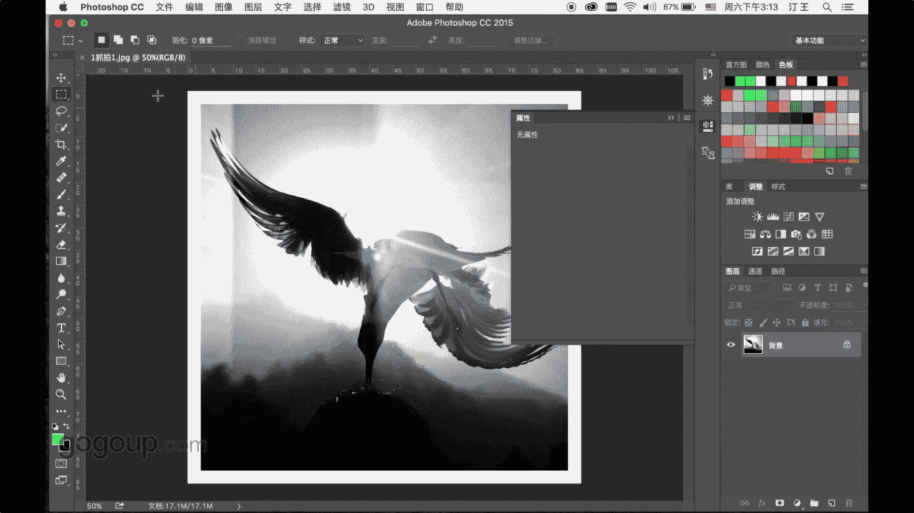
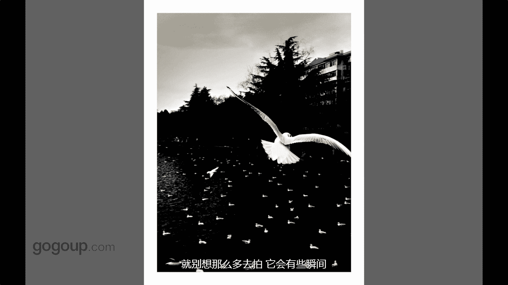
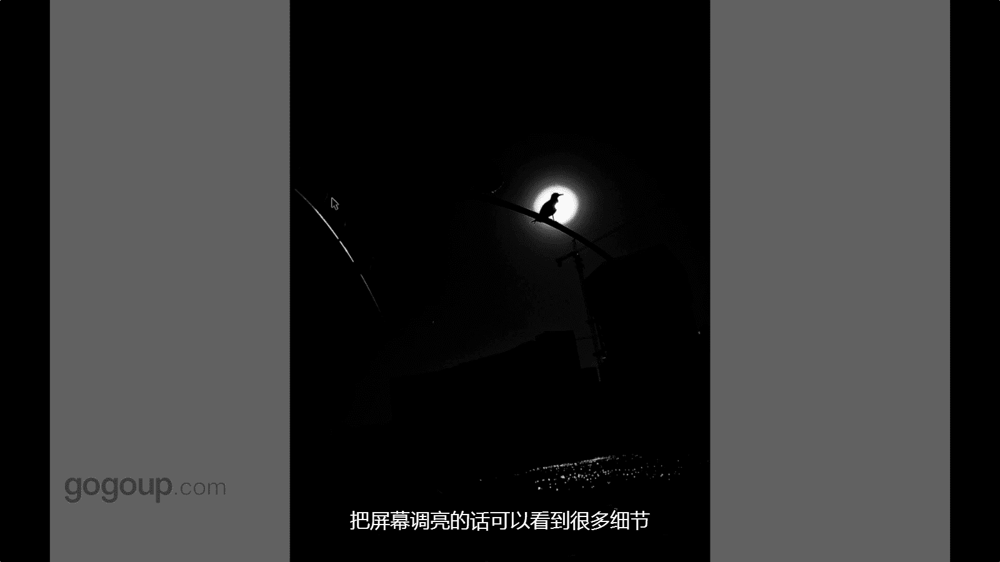

# 何雄-手机摄影教程：第04课·视觉训练（作品实例讲解）：课时15 · 综合-解析《鸟人》系列作品

好，嗯，现在这张就分享一下这个啊对这么鸟人的，我的老人这个鸟人比较成功的一个一个一个系，或者说应该是大家比较认可，比较凸显我代表作的一个一个系列。好吧，我们就先看一下这些抓拍的这都是抓拍的。

因为鸟鸟的东西。

呃，鸟鸟都是在，不可这个东西跟人我拍那么多久，它是一个。不可控制的一个东西是啊一个一种动物是跟咱们就可能毕竟是它啊交流也是几极难那种东西的。

所以说我这个也归定在抓拍里面抓拍也是一个非常有趣的每个瞬间都是不可预见或者不可控制的人。但是你只要去准备去拍，它就会有些很多机会。像这张作品段是一个我们就可以带一下这张作品，严格的说话。

它是一个后期用幽灵进行一个一个合身作品。但鸟根下面你看下面演进出这个是是一个头头头发的部位，演出那个山是一张背景是一个我有你用用后后面会说到一个软件段，它一个合身的软件东西软件去介绍到啊。

他就他鸟鸟根这个觅室的瞬间头上有东西，他在吃吃东西的时候就瞬间抓拍的东西的逆个光。嗯，是这样的一一张照片。然后这张短这个也是抓拍很多瞬间，这个还像记得。其实很多人就问到我说这是不是两个鸟什么的呃，翅膀。

我说回答的不是，它就是一只鸟，因为这也是当时是手机的快门跟不上一个阴天。所以说我们拍的时候就这种意外很很很奇特的，给你一些很惊喜的，它没有动的部位，它就有一个有个很清晰的，像部下部位。

翅膀跟脚就很清晰的一个展示着它后面翅膀。当时天气不太好，就它扇动的非常快。就造成了一个的一个一个脱颖的感觉对？对？但是相互对现的非常有意思的这也是个年会做选片的的，我们会找一些非常刺眼，非常让人。

感到很特别的东西来来挑选出来的。对，这个也是一个对嗯，一张就很特别东西在咱不说后期可能黑白天的这看的就说了一个。瞬间抓拍一个动静的结合是吧，当初也就是他看到他那个鸟从那个一个栏杆上面。

应该是我被我吓到了，冲过去拍吓到的，他就想展翅飞的时候，也就那个瞬间就它中午的时候啊呀下面很近。这种中午它很近啊，很鸟很休息的时候，它有部分的鸟它会这样的啊一些飞动一个动静结合。

跟演出的一个呃城市的一个建筑的，这个是抓拍来这东西，就很多东西像这种鸟的抓拍，可能就是我们去。去大的去拍吧，就别像那么多去拍，它会有一些瞬间让人惊喜。

对啊，这个也是跟那个很相像。呃，跟前相下就也就是太近，你配这手机跟相机应该都有个东西。当我们拍的贴的跟主体贴近太近的时候。

它动的地方绝对是有一个很很意外棒的一个一个划痕一个拖痕短他自字上好多人问过我是不是手机是不是后期加这个还有可能大家微博里面看到过中央电视CCTV吧TV他那个新闻频道他也会转发把这转发给他也说什么用一个好的APP能处理一个好的手机摄影作品。

这个我跟他们一个一个一个理论说不要去不懂，不要去说他是用APP弄的其他这个就是APP后面做的后期就是一个调那种蓝调的一个处理下。😊，那，这个也是今这个是芯片，应该在家早期可能好多朋友在微信微信里面啊。

那个在我微信中间能看到过啊，也是今年应该是一个芯片，这个是一个顺光的拍摄，也是抓拍，也跟那个很很相像的，就是它有一个特贴近拍的时候，它一个一个动态跟静态的一个一个瞬间的一个你看翅膀的花痕在。

右下角能看到大家能右下角能看到我的手指啊，那个是手指黄黄那个啥，我在喂应该在是引引诱他这种跟那种交流互动的时间的时候拍到这个顺光东西的。他有某种构架。这个手机再说一下就它很特别地方。

你看他翅膀同时的清晰，在后面的房子跟人物。它同样有清晰的，这个就抓拍了，同样还有些一些清晰的细节在这个能看到大家他没有那大呃相比或者那聚交以后，它就会产生一个后面很很模糊的一个一个背景。好。

这个也是这样，这几张的画痕就很经典，可能都是新作。今年就应该是15年16年的对，115年跟16年之间，这个冬季拍的应该是15年对呃，12月份拍的这个有一个印象，也是就太近的时候，他从我身边画过时候。

它动静之间的一一个抓拍的一个很很细剧化的一个效果。嗯，对，这个也是这张片子很棒吧。这个也是我特喜欢的。应该这张拍的片子应该是在早期是有苹果五拍的吧，还有印象，因为好好照片我们应该都大家都知道。

每个拍的好照片都都非常有个深刻的印象，一一下刺到你的东西作品都有一个特特让记录的印象，可能这也是一个成功的作品吧，或者我们看展看起来作品一张一张照片刺激到我们让我们记照片他应该是张好照片。

这种照片实就就是一个一个一个动静结合的一个瞬间。抓拍摄里面的那种那种那种很。很极致的一一个一个表现。你看他这个很大的海鸥它这种难惰的就飞过时，下面动静的一个结合是吧，有一种互相照应或者客后的感觉对？

这是我我客自己赋予他的一些一些一些想法。对。然后下面的同们再对，这个不要说啊，这个肯定也是我非常面试不多的。两可能在朋友圈发过的一一个对线光逆光拍摄的一个东西。可们上期咱们也讲上两段讲过。以特有的效果。

像比如这张对啊就是一个逆光，这也很欣慰。这个效果好像我就他妈两三天拍过去，后面就再也出不了了，这可以分享一下。当时苹果四就很牛叉，一个一个的光斑，特有的光斑。这个快门我还跟大家说一下。

可能有沿途大可以看到噻。这个快门的速度在万1万以上1万那这个这个跟相机不不是一回事，这个是电子快门的通电手机的快门是电子快门一通电它就就就就十放快门的。😊，这样去有，所以他万分之1秒。

的只是手机这个这个电子快门的一个说法，也不能说跟那个相机的这个那个快门来来进行一个比较，只是手机一个参数，就怎么样说，就这种也是抓拍或者是逆光这个这也是在这一种创意啊，一种想象在这种就很多元素在里面这。

这样排列它是颜片。对，这这几张都这样的，你看都是一个逆光。逆光拍的一个一个瞬间啊，我们就浏览这几张就吸收的。这个你看。

嗯，是是这样，都是一个一个瞬间。应该这张是最开始我拍的一张照片，逆光拍的照片。就因为拍这张照片了，我才拍到了后才去拍后面的这个照片，就他就给我的个一个惊喜。对，这个你看这种有某种像从太阳里面穿透出来。

感觉当时拍的这个非常的这个也没有经过后期的就非常有意思的东西。可能这种线光可能是残缺的东西，但是它是一种特有的味道，特美的一种味道。对，这个后期的一个价。虽然可能在网上也看到过，也发布过这张照片。

这张照片就说我也很喜欢他是就是因为当时拍的时候。光太强的时候呢，他就把全部分给给吃了，就光把把主体给吃了的后面的时候进行一个那子有有一个穿越的感觉的。这个我的认知就当时拍的时候就有某种穿越的。

或者奔向阳光，或者从阳光里面出气或者进来的，或者是这种这种的一一个一个想法的表演手法，这个也可以说到一个创业或者一个一个思想的拍摄理念。对整体的这这几张片子，它就是一个一个逆光的一个对一个。嗯，牌坊。

对，这张也很棒，这张肯定很多就，是不是怎么拍的？有很新奇兴趣，是不是晚上夜亮了，这夜亮怎么能拍手机能拍一量妈的，能拍这样子，拍这么大是不可能的。这个我跟他说一下，这个中午12点的时候就是逆光太阳。

这个以说那个逆光当时拍的时候，点测光吧，苹果四这个还记得还记得这个是苹果4。你点测光最亮的部位的时候，手机这里很强大的时候，它就会。对比非常明显，尤其现在的苹果55以后，5S66S以后接片的。

它可以在手机上触摸点测光以后进行减曝光，可以把太阳。白天时候拍的很简直就像一个红点。这就很牛的地方结婚，我觉得相机还做不到，这个呃不管你们信不信相机我们点测光的话，还可以这样去剪辑的话。

可能他就剪那样子的话，几乎就没什么都没有了。😊，对，但这个手机你看下面还有水波面上水的一个细节是啊，这个是一个一个雕塑的一个一个栏杆，它还有演出可能放大看，把屏幕调亮的看的话。

还有一些很多细节的新的东西11一个瞬间的。

好，这个街头大家街头抓拍也是一个新心东西，大家跟鸟人看的离不开。这指都是鸟人在分享的，这个可能大家也在过昆明。😊，昆明的一些对啊，像华西桥或者大坝电池边和翠湖吧，它就有这样的景象的这种一种非常。嗯。

核心的一个瞬间下，就我当时拍的时候就也在想，你就也是等这个也是可以在等跟抓。但手手点让拍的一个嗯，一个一个抓拍的瞬间下，他一个海鸥从斑马线挂掉，我的孩就说他。只是说可以说叫动物。

它也能走走走斑马线的这个叫你看演出右上角这个地方的电线杆上好多的海，那是疫情好多好多的海鸥，它的。对，这个地方你看哎。这地方好多好多的海海鸥在。这好多海鸥在遇小角这好多的海鸥在上面洗个不动。

这个很壮观的一个东西的。这样的一个干一个演出的自行车或者斑马线，就主体就好了。如果这张照片。抓拍没有个亮点的话，可能没有海的话，这就很平常的一张照片。肯定只能说是信念结配的信念者啊。

但是就不会拿出来的一个一个亮点出来跟大家分享。哎，这个也是这样跟那个很像，这个就说也是我很喜欢的照片。他就是说在机飞机中，我就起了个名字写说的咱们在这昆明去说了一句笑话，昆明的红嘴鸥鸟可以走飞机动车道。

你看它在空中这样走的，这个是那边是车道，这边是非机动车道，是自行车道，然后疫情这飞飞就过去的话，你看存在一个这个构架的话，上面的房子那边进出的车子。嗯，还有下面这个对它的它的呃中午光线照射下里面。

它的影子着，在地面的影子这。这构成了一个就很有一种光影美的感觉上。对，这个也是一个等待抓拍东西。可能虽然说这个抓拍抓拍但时也是少的抓拍东西也是要少的东西。因为我不可控制一些鸟的走向，我只能去去迎合它。

或熟悉它他的一些东西啊，或者引导他，能引导的引导，引导可能引导的东西就很少，其实是就是等一个等一个抓他那瞬间的话，就是连拍的话肯能做不到这样子就可能就我等到他那个起飞的瞬间逆的光。

看地面的海鸥一个从那边一个银州我在，当时这样挑选他的或这样对他的是一个。呃，印象深的一感觉这样。对，这个可能也所过这个是非常有代表性，我非常喜欢张照片。嗯。

这种排法是说说说实话的可能是一种非常非常近的一个手法，也手手机做到，也跟只有昆明这种鸟跟人的关系做到，他一概一从空中拍过的时候，我举起手就要拍一张对。因为我当时我想要出发点，抓拍，就想要一个城市环境。

根苗的11个1个1个一个瞬间的鸟就显得很大，你看就像皮像配后期这样的，其实他是一个抓拍的。一个特有的一个瞬间。对，这个也是近期做的，这个是应该是今年15年的一个新座对，当时拍拍的对吧。

也是就同一个场景跟刚刚场景很相像啊，为什么显他的，为什么拍照拍呢？就当时看着还同那过来时，也是个顺光的拍摄。你看下面的红车跟那个还鸥的红角，对。

这个是我显它或者大家展示的一一个非常有有亮点的一个一个一个意思一个东西。哎，对然后这个对，这个就是鸟人里面也比较经典的一个东西，对？它是一个人物做前景，对吧？

这个东西对我们用人物啊可以用很多东西做前景的。但这几种展示的是个人物做前景，或者是人跟鸟鸟人械列比较代表性的东西的鸟人这样的一个11一个系列东西对吧？打这个拍摄的手法，或者是抓拍为它就是一个人物。

人跟鸟的这个是我一个应该是我早期作品到中期的一个升华，还始肯定去抓拍一些鸟的一些瞬间。一些关系，现在这个就称华到嘴鸟根的这个关系。降样一啤酒，我用人把代运气家。啊，当长也不去收耳的它这个这样的一个状态。

就它是用鸟人做前进，然后跟鸟的一个完美的一个瞬间的结合。对，这个应该大家很熟悉这张照片，这个照片应该就是我非常有代表性的一张一张照片。这也不是说拍一张。当拍到的这一张呢，我拍了好多张。

就这个场景这个也收到一个抓拍一个蹲点，对？一个当时一个下午一个逆光的感觉这，就剪影的手法去拍摄。然后当时的那个可能这种叫我们叫夜丝光电灯光对吧，可能叫丁格蓝效应吧。

对这样的一个在云南很常见这种光从银城里面的透过来的这种东西的是在云南是很常见的，可能在西藏也多，可能在其他地方不太清楚是吧。这样的一个戏计化东西叫一个鸟刚刚飞过，就是一种互动性东西者。

也是用人做一个跟鸟的一个关联。这是我作品里面比较有代表性的一样。对，这也是应该可能看到我早期的画册叫极端逆向。那个封面上面的就形到他这张的就是一个用人做前景。跟鸟的一个互动。

你看这个鸟嘴下面有一个小的面包渣，其这个老人去把它抛出去的时候，可能我不会那么去直白的去抛。我们就说一下创作理念上，不会那么直白的去拍他在喂的瞬间，就他刚刚把手拍抛出去，收回手的时候。

就抓不了这样的一个瞬间的这张这张特好，就是有一种好像秒跟着那种交流下这样的这样的一种状态。没有跟你直白的去说，就他是在喂，其是在喂的一个瞬间。

有这样的一个1一个瞬间给你的抓拍到到他那种一个可异性或者是一种神秘感的一种一种交流。对，这个也是很场非常经典经典的一张照片。这孩子在那个躺那里睡觉啊，带一只鸟飞过。

好多人问我是不是PSL那样子那样子就这种东西可能我就说我也很自豪说，这个很多身来之笔，就是在抓拍中是。抓拍中。得到对，但这抓拍也是要你的教育付出于时间或者耐心去等待，去思想去去去迎合的这做这么讲件试情。

对，这个就是暖系的一个再来这张也也是一张。啊，很当时吸引我的就是因为他这个能告诉他说的一个冬天的，它上面的是一个呃，他毛衣上面的是一个雪花的一个这样的一个一个。一个一个图案。

当时我是对焦手用对焦的喜欢上等于海鸥它的胃。我就开始重复着，他喂的时候，我不想让他拍到他喂的瞬间，我让他喂的那个鸟头那边，可能人为死什么鸟为死亡，人为人为踩猜的嘛，我就不是啊。

就可能要这个他一个这样的一个一个状态的，他可能也在觅失在生存的一个觅室上飞过下。😊，抖音里面的这个我人人头鸟这样这样的一个一个说法。对，这个很常见的吧，现在就手机摄影特特常见的一个姿势自拍。这个对。

也是就也是一个人物做前景的叫叫叫。偶然在电视大波浪就每天冬天有好多好多的。诶。年轻人也好是吧？情侣也好，也好，他就会会这样对着这样子去自拍当真好，我吸引我的这个这个小女孩很漂亮。很漂亮。

然后就这样子看到鸟正好有鸟飞过，就这样抓拍了一张。对，这个也是很很惊惊惊艳。好多人问过我，当时发短说是不是这叫骗视交骗拍的妈妈的，其实这可能这个假象是受其处理的是，有这种效果。在抓拍的时候也是就是一种。

嗯，很有意思，怎么抓拍呢？当时一个老爷在喂他在喂海鸥的时候，嗯，一直好多头上的海鸥都飞呀飞呀的过。然后我想去抓拍他的时候，我可能就他不会配合我。因为陌生人在可能我走他背后的时候。

我就这么抓拍的给他一个呼应一下，我就好像是当时我还记得之，我就磕一下，就这样磕一下兽。他回去看我看就进接看我的瞬间的话。正好海鸥飞过就就抓拍了他的眼神他的表情。还对。

正好头上也有一个一个海鸥的翅膀露出来的，就某种东西就因为我系里面都知道跟鸟鸟头人头上有很多鸟的或者有鸟的有东西的，这个这个是我戏的一个一个部分。对，这个也是个自己抓拍的一个东西。

很有脑文里面戏里面的叫叫都是人物一些人物的肢体啊，人物的东西做前景的一个东西。大家看了就这样的，就自己的手把升上气以后啊然后就想从手跟就想有种表达触摸感吧。

触摸或者哭者想飞的感让样的心态去拍一些很多海鸥，正好那个时候的海鸥，他就瞬间的。啊，有一个呼应。过来飞过来用手机啊，就就给他记录下了这一章了。浙江那个海鸥系对。然后对再来看着上就有什么感觉，是不是？

密集恐惧站是吧。这个就是这样讲，就就可能这种也就是说可能看到还有一些人可能会会不舒服，是吧？就对密集孔子呢不舒服，它就是一个。😊，一个瞬间停飞的海鸥瞬间停飞的一个状态。这是在脆骨牌的这。这种抓拍的话。

就可定就我们要抓拍就有很多很多时候我就是很多年去观察呃观察去发现很多有趣的时候。嗯，好，这张可能就分享的也说了一张叫侯称吧。可能回头我会在呃软件里面跟他说的。

这个是手机拍的一个一个扭的一个一个横流的一个背。然后我把一个。人物是吧在用用一个软件给它抠出来的一个朋友好友的好友的背景下。放在他的背上的，这根你就好像是个托起一个人的感觉的，或者像眼峡谷样子。

这个是我的一个。一个形象空间的一个一个展示表一个表现。嗯，好，我们再说到一个对焦点，这个失焦是焦点来的可以对这样子是一个照片。因为前面也说过，这张照片可能大家熟悉一下。

这也是就是一种啊我在鸟人系列里面的一个一个部分的一个作品的一个一个一个比较稀的一个叫叫西化的一个梦幻的一个场景下那个光。交派的呢这个是一个秦秦那个轻殴狂舞的一个瞬间。好，这个。

这张也是很经典这张作品是演出的演出的海鸥跟金球这个也是海鸥，但有个某种鸟的这种关联对，它是一个非常有。有有有有代表性的一张作品是吧非常干净或者非常空灵。

好，这张也是我特喜欢这张有王者风范。我老说的是啊，我所谓拍的片子，这张片子应该鸟的片子，特写的片子，我最喜欢的一张是？因为可能我很多片子是人在看鸟啊，交流下这张片子我附一下的东西，就是他鸟在看世界。

或者鸟在看人家，他这样的一个状态，演出的阳光跟他这个眼神光和这个翅膀的一个一个展示的东西。就是有。我就怎么说呢？好像就是有一个王者的风范的感觉是。对，这个应该再说这个这个又多就说一句讲。

这个是这次莱卡莱卡莱卡及莱卡吉普一个这个摄影大师赛的一个一个一个这手机拍了金奖，这个要。要直接说一下对吧，这张这张作品是非常的神来之笔。当时拍的时候可能。嗯。

抓了很多张的这种瞬间我在我作品里面应该不很很很难很难见到很少，自有场景或者有一些那个一个互动性的东西，对角的东西，两个小海鸥。演出的海鸥跟跟滇池跟演出的西山这样的这样的一个。一个呼应。

这个海鸥的状态就像一个高跟鞋一样的一个样的造型，这个地方阐试好吧，这就是。

鸟人的部那个一些综合性的这在抓拍里面，鸟人的一些系列的一些一些作品下，有彩色的，有早期的东西的，杂七八八的都很一些东西，不同风格的一些跟大家分享。

あ。