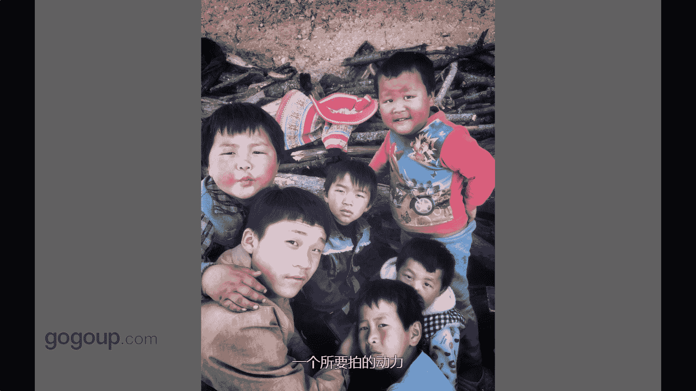

# 何雄-手机摄影教程：第04课·视觉训练（作品实例讲解）：课时4 · 题材-街头人物

好，一些到可能街头人物或者人物在抓拍，这个下一面这个这个是一个街头人物或者一些拍抓拍的一些人物人物的一些肖像，这个也离不开。你看这个小孩咱们看到画面知道的一个小孩为什么会拍他，可能这个视性的话。

他两个中分特好看。我当时看了吸引我就中分，他那条线就跟大讲，可能大家看到过黄上些作品，这样中分的头发跟一条路。麦田有关系的照片也有是吧，这肯定也是有那个灵感。

然后我就就后面就这样子去拍了他一个站在湖边的一个一个一个一个孩子一个背影。好，这张片子大家知道可能叫一个小孩子也是这样的一个很很有意思的一个一个一个瞬间。因为抓的孩子我特喜欢的就这个眼神这样。

他人的眼神或者孩子的眼神特跟大人眼神特不一样，特透，他会有一种就很。很纯的一种感让者，他那里有小孩子里在玩的一个同时。做这个纸箱里面的，哎呀，我上次打了高呼。这样跟他说一下，哎，小朋友把动漫。

是不是给你拍张照片，就这么一下载的，他那种眼神就看我的时候就要把它布出来。因为这肯定也就是其实手机摄影的一个优势。他没有攻击力。不不不没有危机感。对，这个也是就看到鸟吧，这也是就是很常见的一个昆明。

冬季。黄西桥对，我经常拍这个地方的一个人的一个一个老奶奶带着个孩子在抱那个地方就要享受那阳光看到鸟的那种感觉是。就转过去跟老人打个招呼，或者跟小孩兜逗他一下对这样的一个一个交流上，然后就觉得。

有某种很和谐的，或者或者是那种很很老人跟孩子的那那那种那种一种一种爱的关系。然后我就拍张就他抓了一个地方叫就这种东西很常见，你对吧？咱们身边很常见。拍两江东，拍了一降这样一个瞬间。

建筑视角的一个一个观察或者新建。看这小孩子这样这可能也大家可能这小孩子在装扮的样子，跟大家看过，可能前面视频呃那个扩件里面有一些段小数据那个地方。

我们拍了一个乡村那个段那个呃宗教那个那个基督教的一个一一个那的，他们小孩子对。就这个可以说这抓拍啊看的不错啊，他们蛮有长得蛮有特点的当手看到我在蛮蛮可爱的是然后我就走出下我说靠靠一席说说给你拍张照片。

就这么简单东西，就这样子就就就很常见的东西就抓拍，他们看人肯定也不是抓拍看西他每个的表情，每个样子你看因为就是在发现的东西就吸引到你的东西，可能就他你看小孩子他每个的呃他们民族少数民族家长得蛮蛮蛮怪异。

或者蛮可爱的。每个人都是有不同的一个特点。这肯定就是生活中吸引我视角的一个一个说要拍一个动力。😊。

你看这个可能大家知道的这个以前我作品里面出现过多次的一个短叫李应的一个老爷爷下，他70多岁了。呃，他是一个很潮的人家。

可能大家就他经常南半侣装着很搞怪的那个在一些公园啊进行一些呃自我那种就是一种呃或者说可能我们说的很潮的样子，自我的那载歌载舞啊对吧？那样子南半侣装啊那样子气氛那样的一个东西。

我就也跟他也就进行一些交流沟通啊，手了以后就跟他抓拍了一整他这个一个很很搞的一个一个瞬间。他手里拿的那个是是个他很热，因为跳舞跳完舞热了，是个小电动的吹风机，风扇。他眼睛这眼镜跟大家可能看过。

花木经纬有一张照片，花木精纬也这样子戴着眼镜自己给自己拍张自拍，这个眼镜眼镜很很没有后续的，很特别是，他是个双层的这样。还有一个当时看他的花衣服跟眼镜这个这个这种这种冲击感。

就吧给我的一个一个一个非常的大的一个灵感或者一个一个冲动，拍了冲动。😊。

