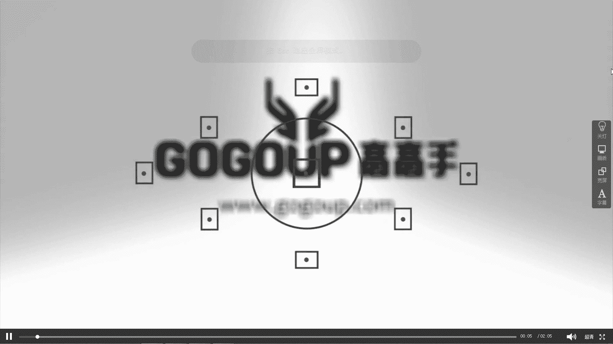
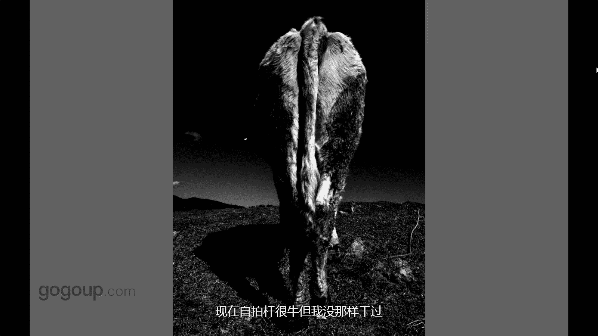
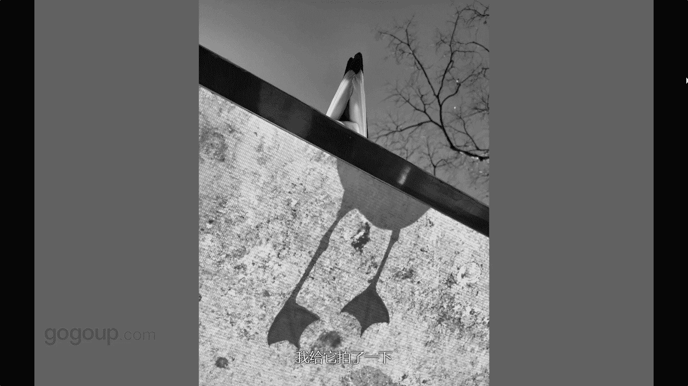

# 何雄-手机摄影教程：第04课·视觉训练（作品实例讲解）：课时6 · 题材-动物 

这张我们讲的一个动物，这个肯定就这这，这是一张我在腾冲拍的很有印象的，这是金看牛。这可能一些不敢吧，你孩子可能有些不敢，然后就贴上去拍。其实你嗯这个手机就有这个优势啊，或者这个有这个亲密镜这。

因为我带的地方很低，我蹲下去的时候他也不会踢我这，可能一些你肯。跟动物交流少的跟牛角少的可能不敢上去拍，我可能呃比大家呃就痴狂一点在感觉贴的那么近去拍他一个牛的的。当时就是等着就可以说这个是守后。

也是发现他还有他老在那里动舔啊啊在跷脚啊的，然后我当时就是这个就就就走过去来。这个我说就能抓拍到他一个这样瞬间在。😊，看这也是就是那当天一起来的，这是后期在后期过黑白的一张这一个牛的个背影。

可能大家好多人看到说，哎呀，这是不是马，其实他就刚刚这个牛的。对一个背影下。就踢上去这种当然很危险，不建议你们女孩子后者不建议去研究打动物人就打动些气拍。这个如如果用自拍杆可以，你把抽象机可以用自拍杆。

现在自拍杆很牛大，我们可以那样干过，你们可以这样拍。

对，这也一道鸟啊的，这可能我我这一辈子他妈的可能就离不开这个鸟鸟的这这个拍小这个东西间每个照片都会有鸟的元色，不管什么，这个是海鸥。😊，这就是个影子的一个影子的一个啊，对吧？当时很有气就。

发现人家那看他的那个上面下面是一个一个童子，他钉上面手人可能我们就多一些视角感的一个信念，就是多看一些东西，很特别东西。哎，怎么看影子的。可能拍个影子很单调。

对呀多等他一下他的他的尾巴就现实真的跟假的这一个那个明显对比的时候。我给大家拍了一下。

