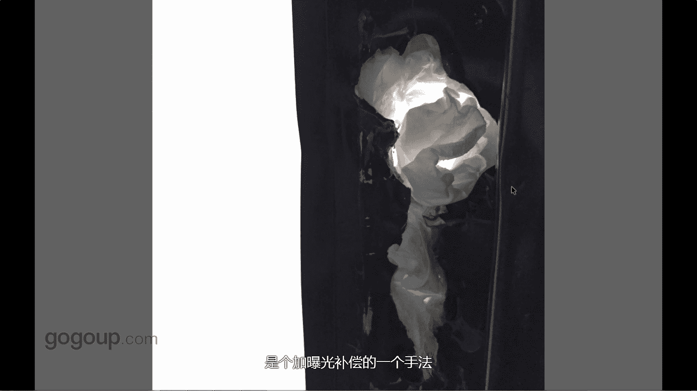

# 何雄-手机摄影教程：第04课·视觉训练（作品实例讲解）：课时7 · 题材-房间

对，这个也很有意思，很大家没看到言片，我者说一下这个也是一次旅行，在一个农村不好的一个一个算是旅社。他这个旅社有公共厕所。二楼有个通厕所，然后叫三楼二楼的上，这是一个门。

厕所的门上它那个门锁的位置被可能烂了，被弄烂了。大家都知道这个旁旁边这个是摩砂玻璃，这是门，可能右边这个是门的那个一个门，然后把那个锁给弄烂了的时候，就他就从里面可能塞个卫生卫生纸啊，对？拦住这。

可能被防止别人偷窥。正个我要去。去厕所的时候看。这是很常见啊，对，咦有意思，它那个好像有某种像个花一样或者什么的有某种东西，隐身东西它有光，我就给他拍一下，当时肯定想拍一下，哎呀，你给他一黑白。😊。

他这种对比这种这种黑中有白，白中有和，黑中有白的，白中白的黑中的，然后还有一些细一细结甲。很简单，就这这个其实东西我们不去科求它什么样。至少我就认为他有美感，他吸引我了，我就这样去拍。在这演变。

我这个是一个对焦在暗部。让旁边的玻璃给它过曝，是个加曝光补偿的一个手法。

🎼。