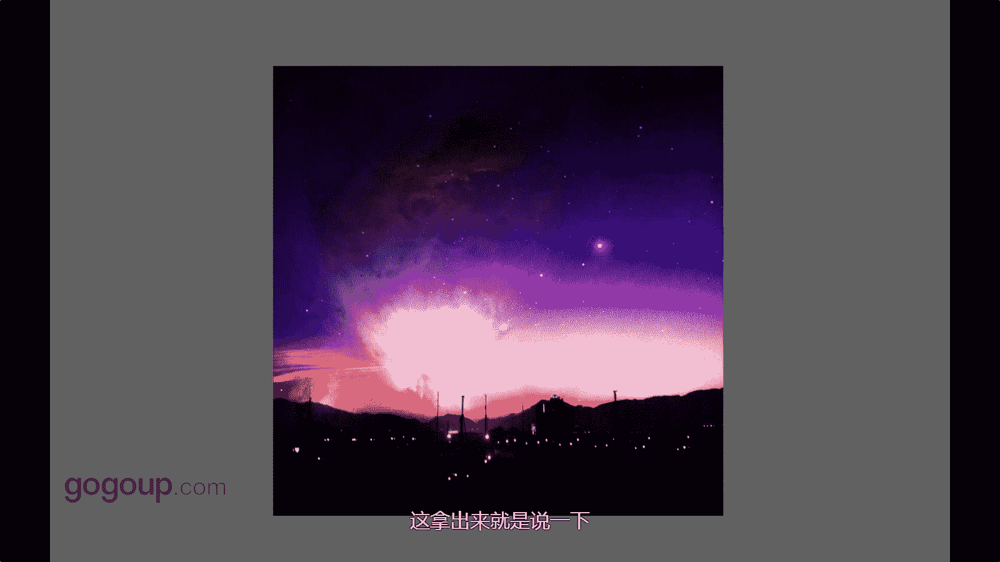

# 何雄-手机摄影教程：第04课·视觉训练（作品实例讲解）：课时9 · 题材-模拟星空

好吧，来到一个说到这个一个就可能大家看照片是不是很惊很梦幻。让骗子我曾经发在微微那个朋友圈发过好多，你问我什么地方？我当时也可开心了，就这个达到我的效果，什么地方这么美手机拍的不可能还。

这就是一个一个一个很有亮点的地方。😡，这就是一个现在很强大的1个APP的一个一个滤境。所以在们浏览下。看这就是一段，就是一个那刚刚这个是下午，这是早晨。

就他一个一个一个这个这种的一个啊模拟星空的这样说的，我就说模拟这个软件的模拟星空，我也不知道英英语也不怎么叫叫那个这个这个这个词子啊。

我就这样给大家这样说的这种就是就这个只是其中的这个创意这个星空只是其中的一个APP一个历境的一个一小部分，这是拿出来这样就说一下，对吧，这个就是这样这个西山。

西山呢西藏西下西山的一个山顶，这个起伏的西昆明滇池边西山那后对，就是我们既发现生活中很常见的吃的。走路街上的车里的或者房呃那个建筑的，或者一些的人物的一些瞬间有泄东西的人，哪怕是进物动物。植物战。

都可以影子光影都可以进行一些创造，一些拍摄。这就是手机。摄影中在创意家的一个视角训练的一个最基本的东西。这样拍的话保障我们保持我们一个激情，对任何东西的一种激情。

或做摄影创作所摄影的一个激情者或者一个表达方式。没有什么是说啊，不可拍的着，生悟中什么都可以拍。当然我也拍，我自拍也拍下来，床上我也拍的，那个不给你们看。都拍我们都可以去拍。😊。

。

あ。